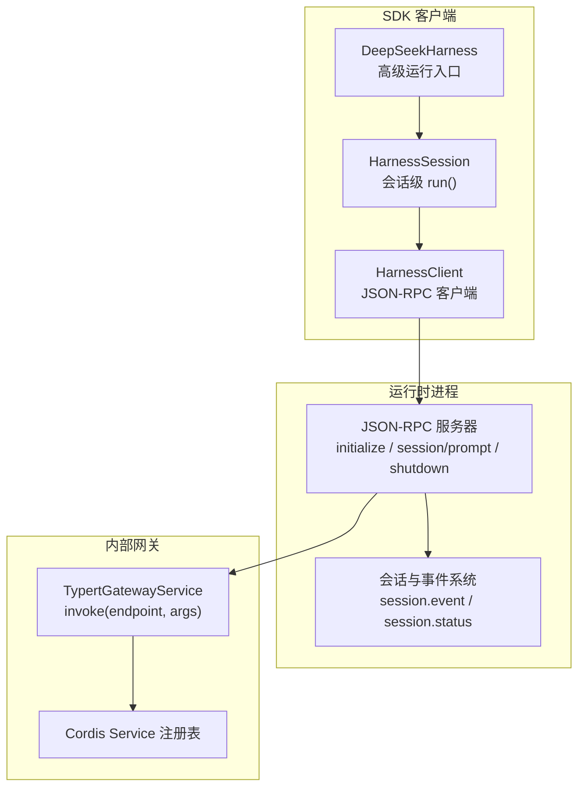
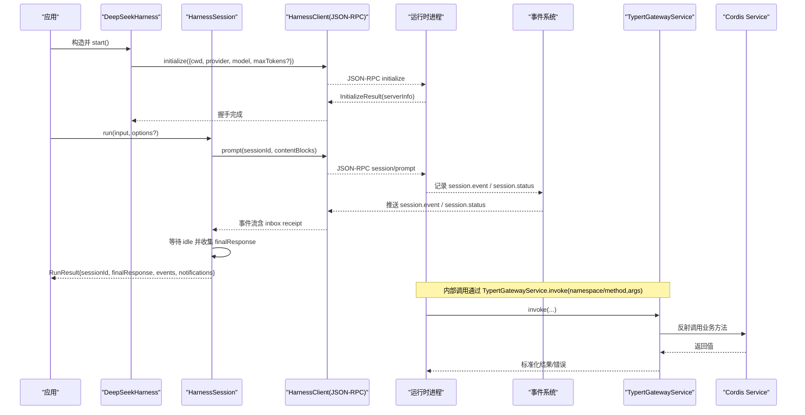
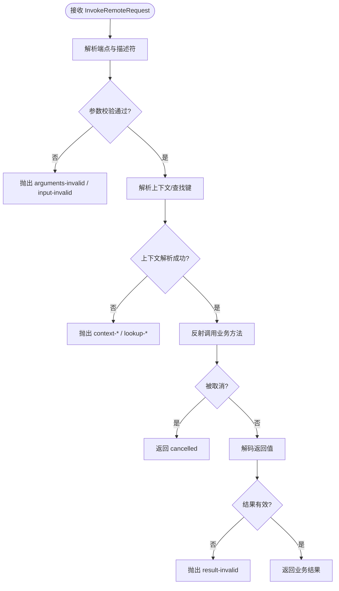
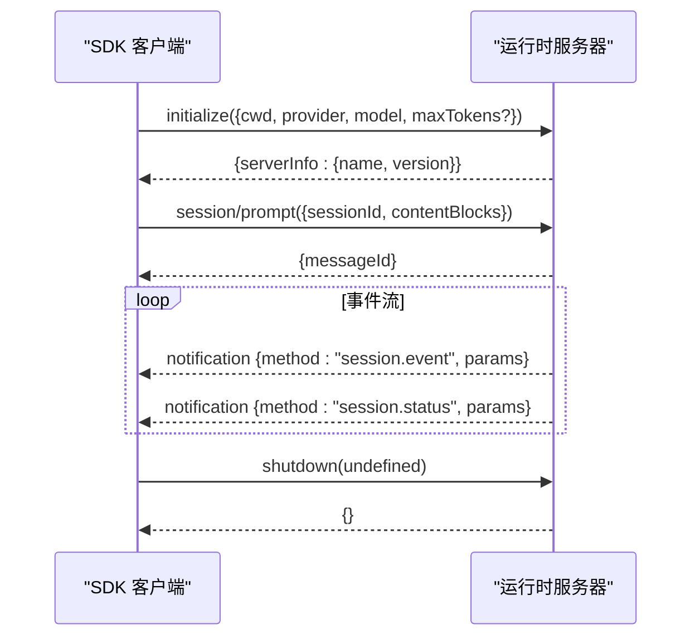
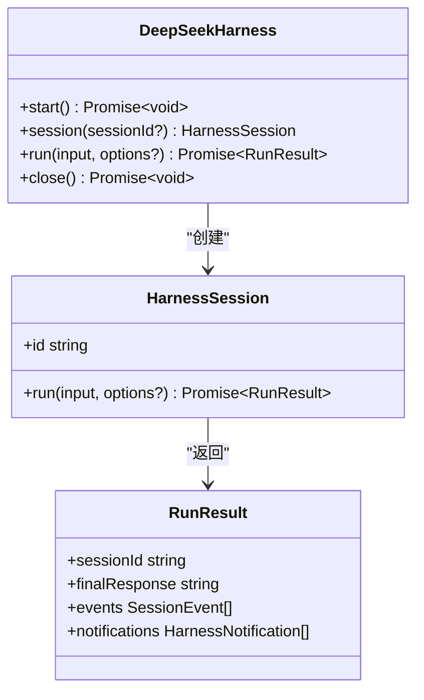
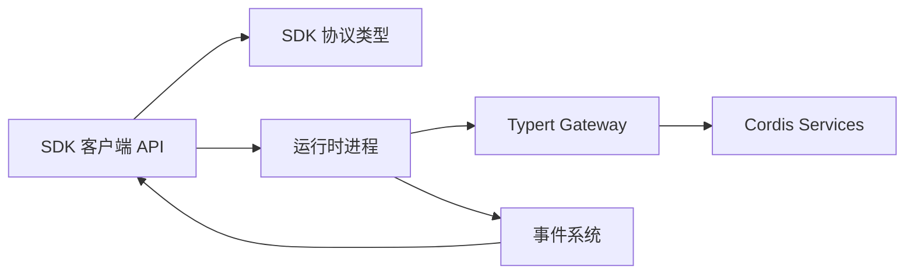

# API 参考

<cite>
**本文引用的文件**
- [packages/api/gateway/src/index.ts](file://packages/api/gateway/src/index.ts)
- [packages/api/gateway/src/types.ts](file://packages/api/gateway/src/types.ts)
- [packages/sdk/client/src/api.ts](file://packages/sdk/client/src/api.ts)
- [packages/sdk/protocol/src/types.ts](file://packages/sdk/protocol/src/types.ts)
- [packages/sdk/client/src/types.ts](file://packages/sdk/client/src/types.ts)
- [README.md](file://README.md)
</cite>

## 目录
1. [简介](#简介)
2. [项目结构](#项目结构)
3. [核心组件](#核心组件)
4. [架构总览](#架构总览)
5. [详细组件分析](#详细组件分析)
6. [依赖关系分析](#依赖关系分析)
7. [性能考虑](#性能考虑)
8. [故障排查指南](#故障排查指南)
9. [结论](#结论)
10. [附录](#附录)

## 简介
本参考文档面向 DeepSeek Harness（dsh）的对外与内部接口，覆盖以下范围：
- HTTP/WebSocket 相关：当前仓库未暴露通用 HTTP/REST 或 WebSocket 端点；Web UI 通过本地进程启动，不在本仓库内提供 HTTP API。
- SDK 运行时协议：基于 JSON-RPC over stdio 的进程间协议，用于在子进程中运行 Agent 会话、订阅事件并等待空闲。
- 内部网关接口：Typert Gateway 将远程方法调用路由到 Cordis Service 实现，提供严格的参数校验、上下文解析与错误码体系。

版本策略与兼容性说明：
- 项目处于开发者预览阶段，存在破坏性变更的可能。SDK 协议中 serverInfo.name 为稳定标识，但整体 API 仍可能演进。
- 建议在生产集成前锁定版本，并在升级时关注变更日志与迁移指南。

**章节来源**
- [README.md:1-58](file://README.md#L1-L58)

## 项目结构
与 API 直接相关的代码主要分布在两个包：
- packages/api/gateway：内部 Typert 网关，负责将外部请求映射到具体 Service 方法，进行参数解码、上下文注入、取消传播与错误归一化。
- packages/sdk：包含客户端封装、协议类型定义与服务端侧的运行时契约。

**图表来源**
- [packages/sdk/client/src/api.ts:22-119](file://packages/sdk/client/src/api.ts#L22-L119)
- [packages/sdk/protocol/src/types.ts:15-105](file://packages/sdk/protocol/src/types.ts#L15-L105)
- [packages/api/gateway/src/index.ts:90-184](file://packages/api/gateway/src/index.ts#L90-L184)

**章节来源**
- [packages/sdk/client/src/api.ts:22-119](file://packages/sdk/client/src/api.ts#L22-L119)
- [packages/sdk/protocol/src/types.ts:15-105](file://packages/sdk/protocol/src/types.ts#L15-L105)
- [packages/api/gateway/src/index.ts:90-184](file://packages/api/gateway/src/index.ts#L90-L184)

## 核心组件
- 高级 SDK 入口：DeepSeekHarness 管理子进程生命周期、握手初始化、会话创建与单次 prompt 运行。
- 会话运行器：HarnessSession.run 发送 prompt、订阅事件流、等待会话进入 idle 并返回最终响应与事件集合。
- 协议层：定义 initialize、session/prompt、shutdown 请求/结果以及四类通知（session.event、session.status、subagent.started、subagent.finished）。
- 内部网关：TypertGatewayService 将 endpoint（namespace/method）解析到具体 Service 方法，执行参数校验、上下文解析、取消传播与结果解码，并统一错误码。

**章节来源**
- [packages/sdk/client/src/api.ts:22-195](file://packages/sdk/client/src/api.ts#L22-L195)
- [packages/sdk/protocol/src/types.ts:15-105](file://packages/sdk/protocol/src/types.ts#L15-L105)
- [packages/api/gateway/src/index.ts:90-184](file://packages/api/gateway/src/index.ts#L90-L184)

## 架构总览
下图展示了从 SDK 客户端到运行时进程的完整调用链，以及内部网关如何路由到业务服务。

**图表来源**
- [packages/sdk/client/src/api.ts:62-119](file://packages/sdk/client/src/api.ts#L62-L119)
- [packages/sdk/client/src/api.ts:146-195](file://packages/sdk/client/src/api.ts#L146-L195)
- [packages/sdk/protocol/src/types.ts:15-105](file://packages/sdk/protocol/src/types.ts#L15-L105)
- [packages/api/gateway/src/index.ts:145-184](file://packages/api/gateway/src/index.ts#L145-L184)

## 详细组件分析

### 内部网关接口（Typert Gateway）
- 作用：将“命名空间/方法”端点解析到具体 Service 方法，严格校验参数、注入上下文、支持取消信号，并将边界错误统一为稳定错误码。
- 关键流程：
  - 解析端点与描述符（严格定义优先，否则 SRC 标记推导）。
  - 校验参数字段是否精确匹配（允许缺失/多余字段的策略由描述符决定）。
  - 解析上下文与查找键（lookup），失败则抛出对应错误码。
  - 反射调用目标方法，捕获取消与业务异常。
  - 对返回值进行边界解码，确保 JSON 安全。
- 错误码：涵盖端点不可用、参数无效、绑定无效、上下文不可用/失败/未找到、查找失败/未找到/不可用、签名无效、结果无效等。

**图表来源**
- [packages/api/gateway/src/index.ts:145-184](file://packages/api/gateway/src/index.ts#L145-L184)
- [packages/api/gateway/src/index.ts:224-263](file://packages/api/gateway/src/index.ts#L224-L263)
- [packages/api/gateway/src/index.ts:359-468](file://packages/api/gateway/src/index.ts#L359-L468)
- [packages/api/gateway/src/index.ts:586-638](file://packages/api/gateway/src/index.ts#L586-L638)

**章节来源**
- [packages/api/gateway/src/index.ts:90-184](file://packages/api/gateway/src/index.ts#L90-L184)
- [packages/api/gateway/src/types.ts:6-47](file://packages/api/gateway/src/types.ts#L6-L47)

### SDK 运行时协议（JSON-RPC over stdio）
- 握手：initialize(params) -> initialize(result)，serverInfo.name 稳定为 deepseek-harness-sdk-runtime。
- 运行：session/prompt(params) -> session/prompt(result)，返回 messageId 作为入队回执。
- 通知：
  - session.event：按序推送会话日志事件（如 assistant/message）。
  - session.status：会话状态切换（idle/running）。
  - subagent.started / subagent.finished：子代理生命周期事件。
- 关闭：shutdown(params) -> shutdown(result)。

**图表来源**
- [packages/sdk/protocol/src/types.ts:15-105](file://packages/sdk/protocol/src/types.ts#L15-L105)

**章节来源**
- [packages/sdk/protocol/src/types.ts:15-105](file://packages/sdk/protocol/src/types.ts#L15-L105)

### 高级 SDK 接口（TypeScript）
- DeepSeekHarness：
  - start()：启动子进程并完成 initialize 握手；失败自动重试新进程。
  - session(id?)：创建会话句柄。
  - run(input, options?)：便捷方法，等价于 session().run()。
  - close()：关闭并回收子进程。
- HarnessSession：
  - run(input, options?)：发送 prompt，订阅事件流，等待 idle，返回 RunResult。
- RunResult：
  - sessionId、finalResponse（最后一条助手消息文本拼接）、events（session.event 列表）、notifications（所有通知列表）。

**图表来源**
- [packages/sdk/client/src/api.ts:22-119](file://packages/sdk/client/src/api.ts#L22-L119)
- [packages/sdk/client/src/api.ts:132-195](file://packages/sdk/client/src/api.ts#L132-L195)
- [packages/sdk/client/src/types.ts:61-71](file://packages/sdk/client/src/types.ts#L61-L71)

**章节来源**
- [packages/sdk/client/src/api.ts:22-195](file://packages/sdk/client/src/api.ts#L22-L195)
- [packages/sdk/client/src/types.ts:11-71](file://packages/sdk/client/src/types.ts#L11-L71)

## 依赖关系分析
- SDK 客户端依赖协议类型定义，以构建 initialize/session/prompt/shutdown 的请求与通知处理。
- 运行时内部依赖 Typert Gateway 将端点解析到具体 Service，保证跨边界的参数与结果一致性。
- 事件系统与子代理模块通过通知机制向客户端推送运行期状态。

**图表来源**
- [packages/sdk/client/src/api.ts:22-119](file://packages/sdk/client/src/api.ts#L22-L119)
- [packages/sdk/protocol/src/types.ts:15-105](file://packages/sdk/protocol/src/types.ts#L15-L105)
- [packages/api/gateway/src/index.ts:90-184](file://packages/api/gateway/src/index.ts#L90-L184)

**章节来源**
- [packages/sdk/client/src/api.ts:22-119](file://packages/sdk/client/src/api.ts#L22-L119)
- [packages/sdk/protocol/src/types.ts:15-105](file://packages/sdk/protocol/src/types.ts#L15-L105)
- [packages/api/gateway/src/index.ts:90-184](file://packages/api/gateway/src/index.ts#L90-L184)

## 性能考虑
- 事件流订阅：在 run() 期间持续订阅事件，直到收到 idle 状态；避免长时间阻塞，合理设置超时与取消信号。
- 输出令牌限制：可通过 initialize 的 maxTokens 控制模型输出上限，避免过长响应影响吞吐。
- 子进程管理：DeepSeekHarness.start() 会缓存握手结果；失败时自动重建进程，注意资源释放与重试策略。
- 网关解码：结果解码与 JSON 安全检查会带来额外开销，建议在高频路径上复用对象与减少不必要转换。

[本节为通用指导，不直接分析具体文件]

## 故障排查指南
- 握手失败：检查 initialize 参数（cwd/provider/model/maxTokens）是否正确；若失败，客户端会自动尝试重启进程。
- 会话无响应：确认已正确订阅 session.event 与 session.status，并确保等待 idle 后再结束。
- 网关错误：根据错误码定位问题：
  - invocation-unavailable / method-unavailable：端点或服务方法不存在。
  - arguments-invalid / input-invalid / result-invalid：参数或结果不符合描述符。
  - context-unavailable / context-not-found / lookup-failed / lookup-not-found：上下文或查找键解析失败。
  - signature-invalid / binding-invalid：服务绑定或方法签名不一致。
- 取消与超时：使用 AbortSignal 传递取消；在客户端设置 requestTimeoutMs 与 shutdownTimeoutMs 以避免挂起。

**章节来源**
- [packages/api/gateway/src/types.ts:18-47](file://packages/api/gateway/src/types.ts#L18-L47)
- [packages/api/gateway/src/index.ts:471-489](file://packages/api/gateway/src/index.ts#L471-L489)
- [packages/sdk/client/src/types.ts:22-45](file://packages/sdk/client/src/types.ts#L22-L45)

## 结论
- 本项目当前未提供通用 HTTP/REST 或 WebSocket 公开 API；对外交互主要通过 SDK 运行时协议（JSON-RPC over stdio）进行。
- 内部网关提供了稳定的错误码与严格的参数/结果校验，适合在高可靠场景下集成。
- 由于项目处于开发者预览阶段，API 可能频繁变更；建议锁定版本并密切关注变更历史与迁移指南。

[本节为总结，不直接分析具体文件]

## 附录

### 认证与授权
- 当前仓库未实现 HTTP/REST 或 WebSocket 的认证授权机制。
- 内部网关通过 Cordis Context 与 Provider 解析上下文身份，适用于进程内服务调用；对外部进程通信未暴露鉴权端点。

[本节为概念性说明，不直接分析具体文件]

### 版本管理与向后兼容
- 协议中 serverInfo.name 为稳定标识（deepseek-harness-sdk-runtime），便于识别运行时。
- 项目声明为开发者预览，可能存在破坏性变更；升级时需验证握手与事件结构兼容性。

**章节来源**
- [packages/sdk/protocol/src/types.ts:27-31](file://packages/sdk/protocol/src/types.ts#L27-L31)
- [README.md:9-12](file://README.md#L9-L12)

### 请求/响应格式与示例
- initialize：
  - 请求参数：cwd、provider、model、maxTokens（可选）。
  - 响应：serverInfo{name, version}。
- session/prompt：
  - 请求参数：sessionId、contentBlocks。
  - 响应：messageId。
- 通知：
  - session.event：sessionId、event。
  - session.status：sessionId、status（idle/running）。
  - subagent.started：parentSessionId、childSessionId。
  - subagent.finished：provider、agentId、parentSessionId、childSessionId、status、stopReason、lastAssistantMessage（可选）。

示例调用流程（文字描述）：
- 启动 SDK 并 initialize。
- 调用 session/prompt 提交 prompt。
- 订阅事件流，收集 session.event 与 session.status。
- 当收到 idle 状态后，提取 finalResponse 并结束。

**章节来源**
- [packages/sdk/protocol/src/types.ts:15-105](file://packages/sdk/protocol/src/types.ts#L15-L105)
- [packages/sdk/client/src/api.ts:62-119](file://packages/sdk/client/src/api.ts#L62-L119)
- [packages/sdk/client/src/api.ts:146-195](file://packages/sdk/client/src/api.ts#L146-L195)

### 限制与约束
- 参数必须严格匹配描述符；多余或缺失字段将被拒绝。
- 上下文与查找键必须可用且类型匹配；否则抛出相应错误码。
- 结果需通过边界解码，非 JSON 安全的值会被拒绝。
- 取消信号仅注入到支持取消的方法；未支持的调用忽略 signal。

**章节来源**
- [packages/api/gateway/src/index.ts:586-638](file://packages/api/gateway/src/index.ts#L586-L638)
- [packages/api/gateway/src/index.ts:359-468](file://packages/api/gateway/src/index.ts#L359-L468)

### 测试工具与调试方法
- 使用 SDK 客户端的 onNotification 回调收集原始通知，便于调试事件顺序与内容。
- 设置 requestTimeoutMs 与 shutdownTimeoutMs，避免长时间阻塞。
- 在开发环境可启用更详细的日志（由运行时提供），结合事件流定位问题。

**章节来源**
- [packages/sdk/client/src/types.ts:11-21](file://packages/sdk/client/src/types.ts#L11-L21)
- [packages/sdk/client/src/types.ts:22-45](file://packages/sdk/client/src/types.ts#L22-L45)

### 变更历史与迁移指南
- 当前仓库未提供显式变更日志；鉴于开发者预览阶段的快速迭代，建议在每次升级前：
  - 验证 initialize 握手与 serverInfo。
  - 检查 session.event 与 session.status 的结构是否变化。
  - 更新 SDK 客户端版本以匹配运行时协议。

[本节为通用指导，不直接分析具体文件]