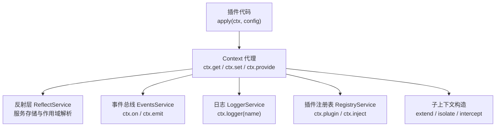
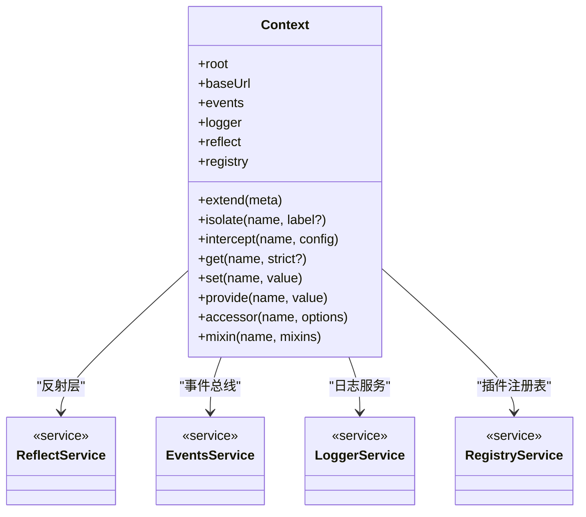
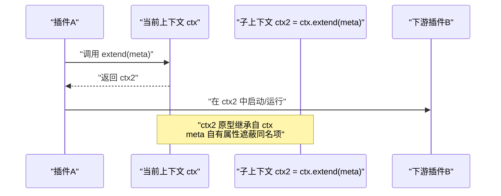
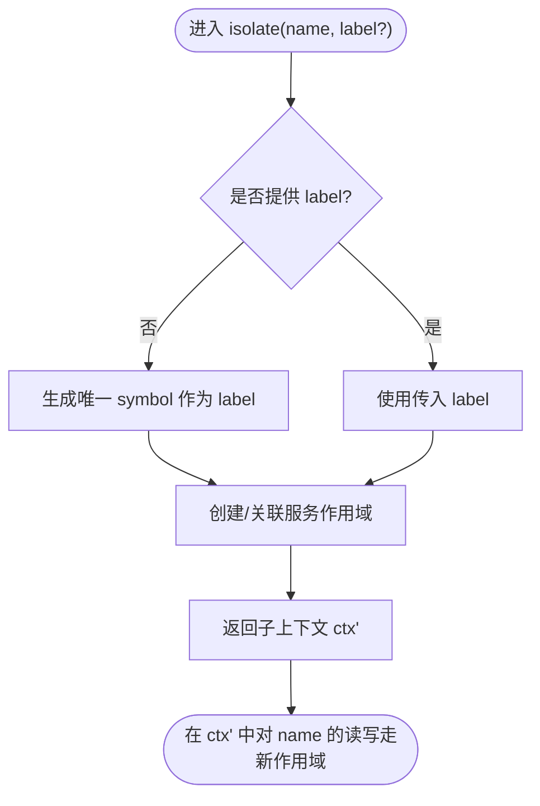
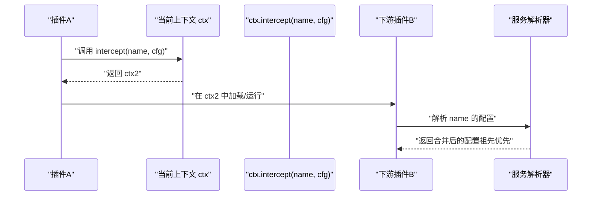
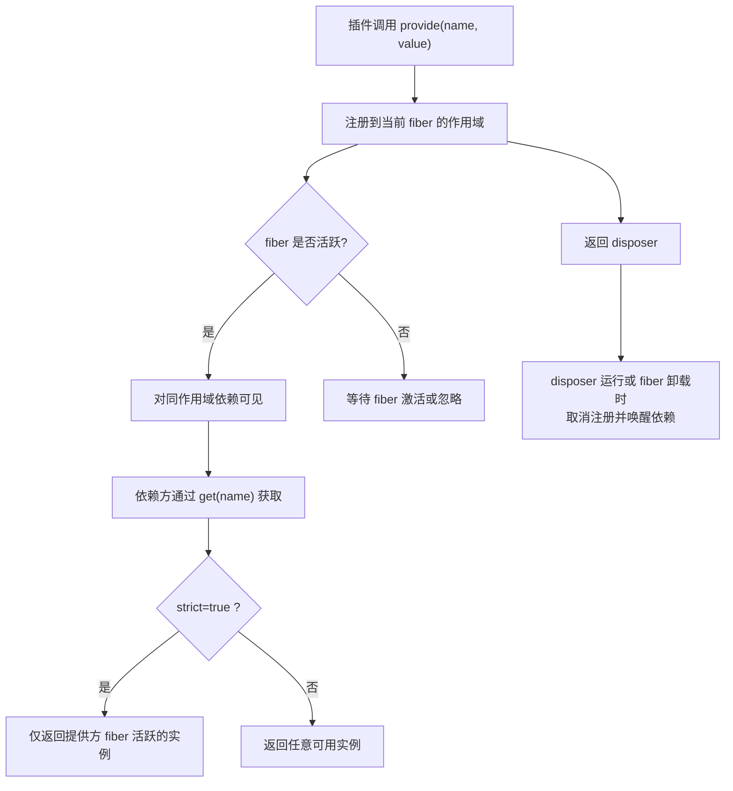
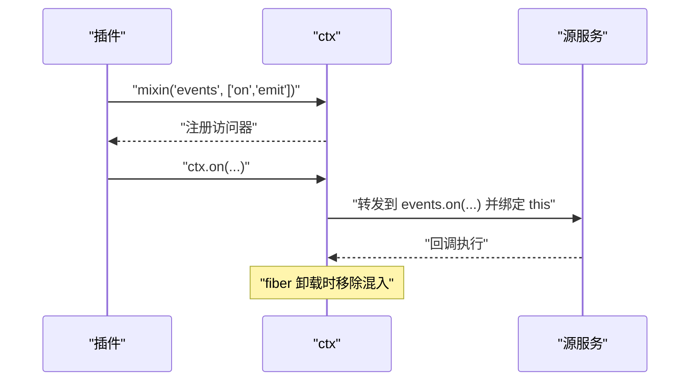
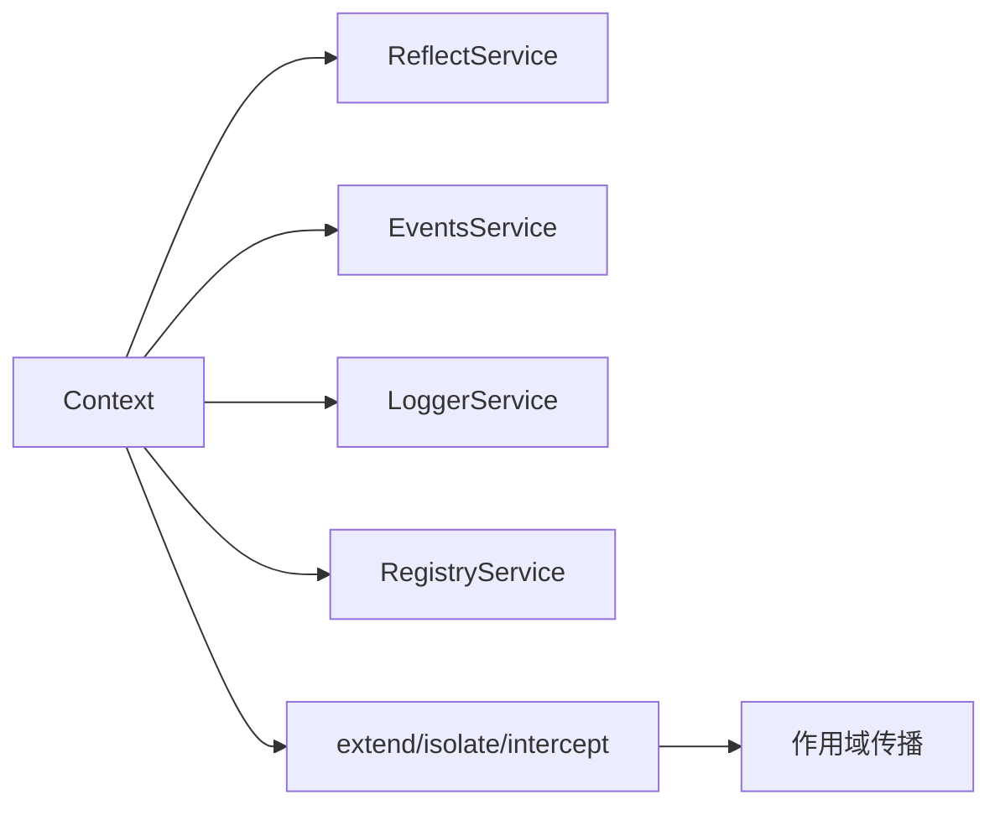

# Cordis 上下文 API

<cite>
**本文引用的文件**
- [docs/cordis-api/context.md](file://docs/cordis-api/context.md)
- [docs/cordis-api/context.zh.md](file://docs/cordis-api/context.zh.md)
</cite>

## 目录
1. [简介](#简介)
2. [项目结构](#项目结构)
3. [核心组件](#核心组件)
4. [架构总览](#架构总览)
5. [详细组件分析](#详细组件分析)
6. [依赖关系分析](#依赖关系分析)
7. [性能考量](#性能考量)
8. [故障排除指南](#故障排除指南)
9. [结论](#结论)
10. [附录](#附录)

## 简介
本文件面向插件开发者与框架使用者，系统化说明 Cordis 的 Context 对象及其在插件体系中的核心职责：服务注册、依赖注入、作用域隔离、生命周期管理、拦截配置与混入机制。Context 是代理对象，普通属性读取走服务解析器；通过 extend()、isolate()、intercept() 可创建具有不同作用域的“子上下文”，且不会修改父上下文。所有事件、副作用（fiber）与插件加载能力均通过 ctx 暴露或组合使用。

## 项目结构
- 文档来源：本仓库以“生成式 API 文档”形式维护 Context 的公开接口与行为说明，英文与中文双语文档一一对应，由脚本从 vendor/cordis 源码抽取并生成到 docs/cordis-api/ 下。
- 源码位置：实际实现位于 vendor/cordis/src（由文档中“Source”链接指向），本仓库不直接包含该实现，但通过文档与脚本保持对外契约稳定。
- 使用方式：插件通过 apply(ctx, config) 等入口获取 ctx，并使用 ctx.get/set/provide/accessor/mixin 以及 ctx.extend/isolate/intercept 完成服务装配与作用域控制。

图表来源
- [docs/cordis-api/context.md:6-12](file://docs/cordis-api/context.md#L6-L12)
- [docs/cordis-api/context.md:120-163](file://docs/cordis-api/context.md#L120-L163)

章节来源
- [docs/cordis-api/context.md:1-12](file://docs/cordis-api/context.md#L1-L12)
- [docs/cordis-api/context.zh.md:1-14](file://docs/cordis-api/context.zh.md#L1-L14)

## 核心组件
- Context 代理：提供 get/set/provide/accessor/mixin 等服务存取能力，以及 extend/isolate/intercept 的作用域扩展能力。
- 反射层 ReflectService：支撑 ctx 代理的服务解析、提供与访问器定义。
- 事件总线 EventsService：提供事件订阅与发布，方法会混入 ctx（如 ctx.on、ctx.emit）。
- 日志 LoggerService：提供具名日志能力（ctx.logger(name)）。
- 插件注册表 RegistryService：提供插件加载与注入能力（ctx.plugin、ctx.inject）。
- 根上下文 root：所有子上下文共享的根引用。
- baseUrl：用于解析相对模块/插件路径的基础 URL（若运行时设置）。

章节来源
- [docs/cordis-api/context.md:98-163](file://docs/cordis-api/context.md#L98-L163)
- [docs/cordis-api/context.zh.md:100-164](file://docs/cordis-api/context.zh.md#L100-L164)

## 架构总览
下图展示 Context 作为“依赖容器 + 作用域边界”的核心角色，以及它与反射层、事件、日志、注册表的协作关系。

图表来源
- [docs/cordis-api/context.md:98-163](file://docs/cordis-api/context.md#L98-L163)

## 详细组件分析

### 作用域与继承：extend()
- 语义：在当前作用域之上创建一个携带额外元数据的子上下文；子上下文原型继承父上下文的所有属性，meta 的自有属性会遮蔽同名继承属性；父上下文不被修改。
- 典型用途：为某段逻辑附加临时元数据（如请求标识、租户 ID、调试标签），并在该作用域内传播给下游插件与服务。
- 复杂度：O(1) 创建子上下文；属性查找沿原型链进行，命中 meta 自有属性时短路。

图表来源
- [docs/cordis-api/context.md:14-37](file://docs/cordis-api/context.md#L14-L37)
- [docs/cordis-api/context.zh.md:16-39](file://docs/cordis-api/context.zh.md#L16-L39)

章节来源
- [docs/cordis-api/context.md:14-37](file://docs/cordis-api/context.md#L14-L37)
- [docs/cordis-api/context.zh.md:16-39](file://docs/cordis-api/context.zh.md#L16-L39)

### 服务隔离：isolate(name, label?)
- 语义：为指定服务 name 创建独立作用域的子上下文；在该子上下文之下，对 name 的读写将基于新标签解析，从而可以覆盖父作用域的实现而不影响父作用域。传入相同 label 的两个 isolate() 调用会加入同一作用域。
- 典型用途：多租户/多实例场景下为同一服务提供不同实现；测试中替换外部依赖。
- 复杂度：作用域切换 O(1)；label 相同时复用作用域映射。

图表来源
- [docs/cordis-api/context.md:39-66](file://docs/cordis-api/context.md#L39-L66)
- [docs/cordis-api/context.zh.md:41-68](file://docs/cordis-api/context.zh.md#L41-L68)

章节来源
- [docs/cordis-api/context.md:39-66](file://docs/cordis-api/context.md#L39-L66)
- [docs/cordis-api/context.zh.md:41-68](file://docs/cordis-api/context.zh.md#L41-L68)

### 配置拦截：intercept(name, config)
- 语义：为在此上下文之下启动的插件添加针对某服务的拦截配置；插件看到该配置已合并进服务最终配置（祖先条目优先）。父上下文不受影响。
- 典型用途：为特定服务注入调试开关、超时策略、路由规则等横切配置。
- 复杂度：配置合并发生在服务解析阶段；拦截条目按祖先到后代顺序叠加。

图表来源
- [docs/cordis-api/context.md:68-96](file://docs/cordis-api/context.md#L68-L96)
- [docs/cordis-api/context.zh.md:70-98](file://docs/cordis-api/context.zh.md#L70-L98)

章节来源
- [docs/cordis-api/context.md:68-96](file://docs/cordis-api/context.md#L68-L96)
- [docs/cordis-api/context.zh.md:70-98](file://docs/cordis-api/context.zh.md#L70-L98)

### 服务存储与生命周期：get/set/provide/accessor
- get(name, strict?)：从存储读取服务，无需满足注入要求；strict 为 true 时仅返回提供方 fiber 当前处于活动状态的实现。
- set(name, value)：覆盖已提供服务的值；只有提供该服务的 fiber 才能设置它；设置未提供的名称会抛出异常。
- provide(name, value)：注册归当前 fiber 所有的服务实现；fiber 激活后对同隔离作用域内的依赖可见；当资源释放函数运行或 fiber 卸载时取消注册并唤醒依赖方；若名称已在该作用域被提供或声明为访问器则抛出异常。
- accessor(name, options)：定义由 get/set 钩子支持的计算型上下文属性；当前 fiber 卸载时移除；若名称已被声明则抛出异常。

图表来源
- [docs/cordis-api/context.md:237-338](file://docs/cordis-api/context.md#L237-L338)
- [docs/cordis-api/context.zh.md:239-340](file://docs/cordis-api/context.zh.md#L239-L340)

章节来源
- [docs/cordis-api/context.md:237-338](file://docs/cordis-api/context.md#L237-L338)
- [docs/cordis-api/context.zh.md:239-340](file://docs/cordis-api/context.zh.md#L239-L340)

### 混入机制：mixin(name, mixins)
- 语义：直接将服务的选定成员暴露到 ctx 上；每个混入键成为转发到该服务的访问器（方法自动绑定到服务）；当前 fiber 卸载时移除混入。
- 典型用法：将事件总线方法混入 ctx，使 ctx.on/ctx.emit 可直接使用；或将日志、注册表等方法便捷挂载。

图表来源
- [docs/cordis-api/context.md:340-365](file://docs/cordis-api/context.md#L340-L365)
- [docs/cordis-api/context.zh.md:342-367](file://docs/cordis-api/context.zh.md#L342-L367)

章节来源
- [docs/cordis-api/context.md:340-365](file://docs/cordis-api/context.md#L340-L365)
- [docs/cordis-api/context.zh.md:342-367](file://docs/cordis-api/context.zh.md#L342-L367)

### 静态成员与品牌识别
- Context.effect：资源释放函数暴露 EffectMeta 诊断树的 symbol 键。
- Context.filter：上下文监听器过滤器的 symbol 键，每次事件分派都会查询。
- Context.isolate / Context.intercept：隔离映射与拦截映射的 symbol 键。
- Context.is(value)：跨 realm 与多副本安全地判断是否为 Context 代理或原型。

章节来源
- [docs/cordis-api/context.md:164-233](file://docs/cordis-api/context.md#L164-L233)
- [docs/cordis-api/context.zh.md:166-235](file://docs/cordis-api/context.zh.md#L166-L235)

## 依赖关系分析
- Context 依赖 ReflectService 实现服务存取与作用域解析。
- Context 组合 EventsService、LoggerService、RegistryService 并通过 mixin 将常用方法便捷挂载到 ctx。
- 作用域传播：extend 传递元数据；isolate 切换服务解析标签；intercept 叠加服务配置；三者均创建子上下文且不修改父上下文。

图表来源
- [docs/cordis-api/context.md:98-163](file://docs/cordis-api/context.md#L98-L163)

章节来源
- [docs/cordis-api/context.md:98-163](file://docs/cordis-api/context.md#L98-L163)
- [docs/cordis-api/context.zh.md:100-164](file://docs/cordis-api/context.zh.md#L100-L164)

## 性能考量
- 作用域操作（extend/isolate/intercept）均为轻量级对象创建与映射更新，时间复杂度近似 O(1)。
- 服务解析走代理与反射层，频繁 get 的场景建议缓存结果或在 fiber 内复用实例。
- provide/disposer 的生命周期与 fiber 绑定，避免在长生命周期对象中持有短 fiber 提供的服务引用导致泄漏。
- mixin 会在 fiber 卸载时清理，注意不要在卸载后仍持有混入方法的闭包引用。

[本节为通用指导，不直接分析具体文件]

## 故障排除指南
- 无法解析服务：确认服务是否在正确的作用域提供；检查 isolate(label) 是否被误用导致作用域不一致；必要时使用 get(name, false) 放宽严格模式排查。
- 重复提供冲突：provide 在同一作用域重复注册同名服务会抛错；确保仅在单一 fiber 提供，或使用 set 更新已有实例。
- 访问器冲突：accessor 同名已声明会抛错；确保在 fiber 初始化阶段唯一声明。
- 混入失效：fiber 卸载后混入会被移除；若在异步回调中使用混入方法，需确保回调仍在原 fiber 作用域内执行。
- 事件过滤：可通过 Context.filter 自定义事件分发过滤逻辑，便于调试与降噪。

章节来源
- [docs/cordis-api/context.md:237-338](file://docs/cordis-api/context.md#L237-L338)
- [docs/cordis-api/context.zh.md:239-340](file://docs/cordis-api/context.zh.md#L239-L340)

## 结论
Context 是 Cordis 插件体系的“依赖容器 + 作用域边界”。通过 extend/isolate/intercept 构建层次化作用域，结合 provide/get/set/accessor/mixin 完成服务装配与生命周期管理，配合事件、日志与注册表形成完整的插件运行环境。遵循作用域最小化、fiber 生命周期对齐、配置拦截集中化的实践，可获得高内聚、低耦合且易于测试的插件架构。

[本节为总结性内容，不直接分析具体文件]

## 附录
- 最佳实践（插件开发）
  - 使用 isolate 隔离第三方或可选依赖，便于测试与多实例部署。
  - 使用 intercept 集中注入横切配置（如超时、重试、审计），避免散落各处。
  - 使用 mixin 精简 API 表面，提升插件易用性。
  - 将短期资源通过 provide 与 disposer 绑定到 fiber，确保及时释放。
  - 通过 get(name, strict) 区分“必须存在”和“可选存在”的服务依赖。
  - 利用 Context.is 做跨 realm 的类型守卫，增强健壮性。

[本节为通用指导，不直接分析具体文件]