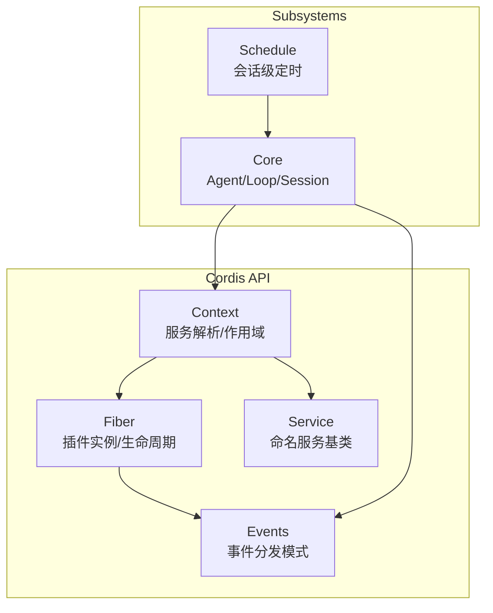
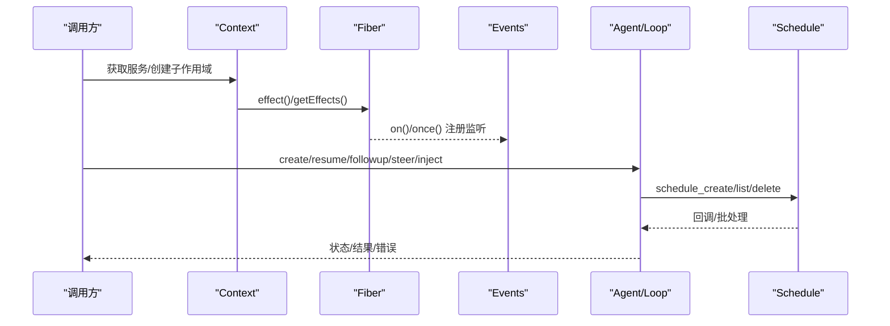
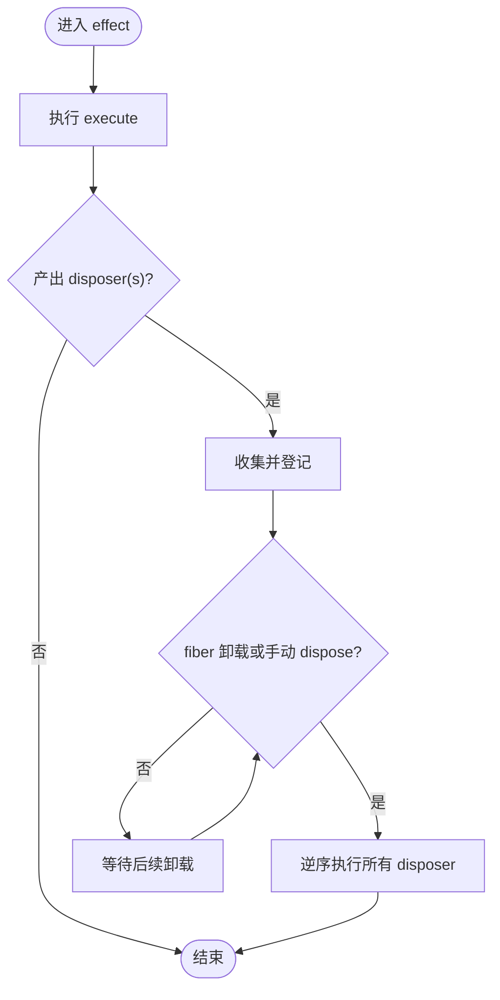
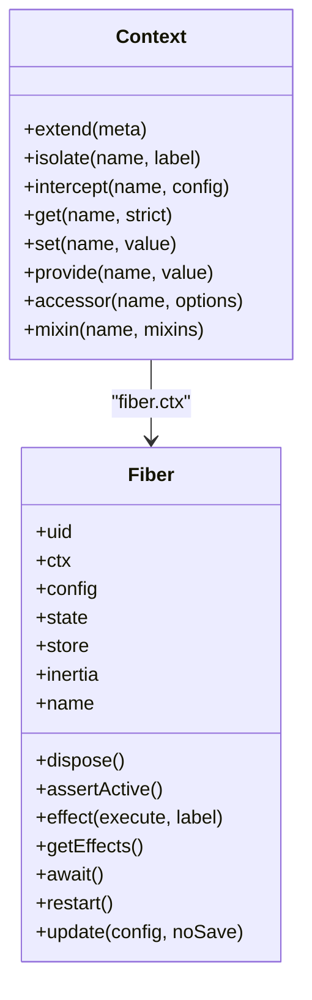
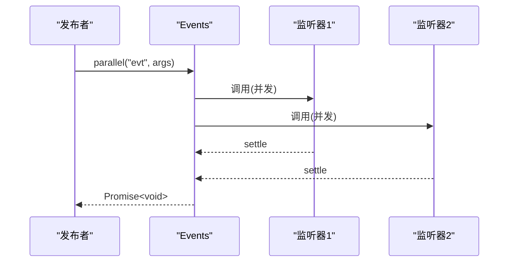
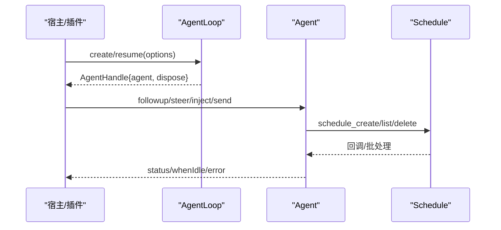
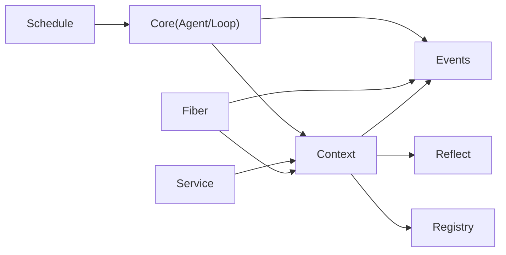

# Fiber API

<cite>
**本文引用的文件**
- [fiber.md](file://docs/cordis-api/fiber.md)
- [context.md](file://docs/cordis-api/context.md)
- [events.md](file://docs/cordis-api/events.md)
- [service.md](file://docs/cordis-api/service.md)
- [core.md](file://docs/subsystems/core.md)
- [schedule.md](file://docs/subsystems/schedule.md)
</cite>

## 目录
1. [简介](#简介)
2. [项目结构](#项目结构)
3. [核心组件](#核心组件)
4. [架构总览](#架构总览)
5. [详细组件分析](#详细组件分析)
6. [依赖关系分析](#依赖关系分析)
7. [性能与并发](#性能与并发)
8. [故障排查指南](#故障排查指南)
9. [结论](#结论)
10. [附录](#附录)

## 简介
本文件面向使用 Cordis/Fiber 的插件与子系统开发者，系统化说明协程执行环境、Fiber 的创建/调度/生命周期、effect 系统、资源清理与异常处理、上下文与作用域传播、并发控制与任务调度、以及调试与性能分析方法。内容基于仓库内已生成的 API 文档与子系统说明进行提炼与整合，帮助读者在复杂系统中安全地组织异步工作流与资源管理。

## 项目结构
围绕 Fiber 的关键文档分布在 cordis-api 与 subsystems 两个区域：
- cordis-api：Context、Fiber、Service、Events 等基础能力
- subsystems：Core（Agent/Loop）、Schedule（会话级定时）等运行时编排

图表来源
- [context.md:1-163](file://docs/cordis-api/context.md#L1-L163)
- [fiber.md:50-275](file://docs/cordis-api/fiber.md#L50-L275)
- [events.md:1-208](file://docs/cordis-api/events.md#L1-L208)
- [service.md:1-103](file://docs/cordis-api/service.md#L1-L103)
- [core.md:1-250](file://docs/subsystems/core.md#L1-L250)
- [schedule.md:1-187](file://docs/subsystems/schedule.md#L1-L187)

章节来源
- [context.md:1-163](file://docs/cordis-api/context.md#L1-L163)
- [fiber.md:50-275](file://docs/cordis-api/fiber.md#L50-L275)
- [events.md:1-208](file://docs/cordis-api/events.md#L1-L208)
- [service.md:1-103](file://docs/cordis-api/service.md#L1-L103)
- [core.md:1-250](file://docs/subsystems/core.md#L1-L250)
- [schedule.md:1-187](file://docs/subsystems/schedule.md#L1-L187)

## 核心组件
- Context：服务解析与扩展点入口，支持 extend/isolate/intercept 构建子作用域；提供 events/logger/reflect/registry 等服务访问。
- Fiber：单个插件运行时的实例，持有配置、状态、effects、store 快照与惰性加载/卸载过渡；通过 ctx.fiber 暴露。
- Service：以命名方式注册到 ctx 的服务基类，自动随 fiber 生命周期管理。
- Events：统一的事件分发模式（emit/parallel/serial/bail/waterfall），用于解耦与编排。

章节来源
- [context.md:1-163](file://docs/cordis-api/context.md#L1-L163)
- [fiber.md:50-275](file://docs/cordis-api/fiber.md#L50-L275)
- [service.md:1-103](file://docs/cordis-api/service.md#L1-L103)
- [events.md:1-208](file://docs/cordis-api/events.md#L1-L208)

## 架构总览
下图展示从 Context 到 Fiber、再到事件与服务的调用链，以及与 Agent/Loop 和 Schedule 的协作关系。

图表来源
- [context.md:14-96](file://docs/cordis-api/context.md#L14-L96)
- [fiber.md:8-37](file://docs/cordis-api/fiber.md#L8-L37)
- [events.md:8-123](file://docs/cordis-api/events.md#L8-L123)
- [core.md:22-142](file://docs/subsystems/core.md#L22-L142)
- [schedule.md:7-187](file://docs/subsystems/schedule.md#L7-L187)

## 详细组件分析

### Fiber 生命周期与 effect 系统
- 创建与拥有者：每个 Fiber 对应一个插件实例，持有 ctx、config、state、store 快照与惰性过渡 promise。
- 生命周期方法：dispose 卸载并等待清理完成；await 等待稳定态并抛出启动期错误；restart 立即用当前配置重载；update 校验新配置后触发更新水线并重启。
- effect 系统：ctx.effect/fiber.effect 注册带清理能力的 effect，execute 立即运行，产出的 disposer 按逆序回收；支持同步/异步/生成器 yield 多个；无效形状抛 TypeError；对已释放 fiber 注册抛 INACTIVE_EFFECT。
- 诊断：getEffects 返回 EffectMeta 树，便于定位嵌套 effect 标签。

图表来源
- [fiber.md:8-37](file://docs/cordis-api/fiber.md#L8-L37)
- [fiber.md:164-210](file://docs/cordis-api/fiber.md#L164-L210)

章节来源
- [fiber.md:50-275](file://docs/cordis-api/fiber.md#L50-L275)

### 上下文与作用域传播
- 作用域扩展：extend 创建携带额外元数据的子上下文；isolate 为指定服务名建立独立作用域，可隔离实现；intercept 为下游插件注入服务拦截配置。
- 服务存取：get/set/provide/accessor/mixin 提供强约束的服务注册与读取；provide 仅由提供 fiber 设置，避免越权覆盖。
- 根上下文：root 指向应用根上下文，所有子上下文共享。

图表来源
- [context.md:14-163](file://docs/cordis-api/context.md#L14-L163)
- [fiber.md:58-275](file://docs/cordis-api/fiber.md#L58-L275)

章节来源
- [context.md:14-163](file://docs/cordis-api/context.md#L14-L163)
- [fiber.md:58-275](file://docs/cordis-api/fiber.md#L58-L275)

### 事件分发与并发控制
- 模式：
  - emit：同步广播，忽略返回值
  - parallel：并行等待所有监听器
  - serial：顺序等待，首个非假值即返回
  - bail：同步短路，首个非假值即停止
  - waterfall：next 链式组合，最后内置行为兜底
- 订阅：on/once 注册由当前 fiber 拥有的监听器，返回 disposer；prepend/global 控制插入位置与全局过滤。

图表来源
- [events.md:8-123](file://docs/cordis-api/events.md#L8-L123)

章节来源
- [events.md:8-123](file://docs/cordis-api/events.md#L8-L123)

### 服务模型与可插拔性
- Service 基类：构造时以 name 注册到 ctx，自动随 fiber 卸载移除。
- 静态钩子：init/check/config/invoke/extend/tracker/resolveConfig 等符号键定义服务扩展点。
- 拦截：通过 ctx.intercept 将配置合并到下游服务解析中，实现跨插件的配置增强。

章节来源
- [service.md:1-103](file://docs/cordis-api/service.md#L1-L103)
- [context.md:68-96](file://docs/cordis-api/context.md#L68-L96)

### 与 Agent/Loop 的协作
- Agent 句柄：send/followup/steer/inject/cancel/whenIdle/runMaintenance 等能力，驱动会话与工具管线。
- 生命周期：create/resume 创建/恢复 Agent，setup 阶段可组合作用域；agent/created/disposed/error 等事件贯穿生命周期。
- 与 Schedule：Schedule 在空闲阶段提交 followup，不抢占当前 turn，保证对话一致性。

图表来源
- [core.md:22-142](file://docs/subsystems/core.md#L22-L142)
- [core.md:553-723](file://docs/subsystems/core.md#L553-L723)
- [schedule.md:154-187](file://docs/subsystems/schedule.md#L154-L187)

章节来源
- [core.md:22-142](file://docs/subsystems/core.md#L22-L142)
- [core.md:553-723](file://docs/subsystems/core.md#L553-L723)
- [schedule.md:154-187](file://docs/subsystems/schedule.md#L154-L187)

### 任务调度与会话级定时
- 记录类型：after/at/every 三类持久化提醒，统一 scheduledAt 时间。
- 输入规范：at 支持 RFC3339 或本地日历对象；every_seconds 最小间隔限制，固定速率且锚定创建时间。
- 回放与批处理：冷/忙会话错过目标时，Every 仅保留最新一次；多 overdue 合并为单批次，限制模型轮次。
- 投递边界：仅在原 Session 存活时投递，无外部通知通道；失败保持活跃，重试策略受限于空闲阶段。

章节来源
- [schedule.md:7-187](file://docs/subsystems/schedule.md#L7-L187)

## 依赖关系分析
- Context 依赖 Events/Reflect/Registry，作为服务发现与作用域入口。
- Fiber 依赖 Context 与 Events，管理 effect 与生命周期。
- Service 通过 Context 注册自身，被其他模块消费。
- Core（Agent/Loop）依赖 Context/Events，驱动会话与工具；Schedule 通过 Agent 的维护阶段与 Inbox 机制协作。

图表来源
- [context.md:1-163](file://docs/cordis-api/context.md#L1-L163)
- [fiber.md:50-275](file://docs/cordis-api/fiber.md#L50-L275)
- [events.md:1-208](file://docs/cordis-api/events.md#L1-L208)
- [service.md:1-103](file://docs/cordis-api/service.md#L1-L103)
- [core.md:1-250](file://docs/subsystems/core.md#L1-L250)
- [schedule.md:1-187](file://docs/subsystems/schedule.md#L1-L187)

章节来源
- [context.md:1-163](file://docs/cordis-api/context.md#L1-L163)
- [fiber.md:50-275](file://docs/cordis-api/fiber.md#L50-L275)
- [events.md:1-208](file://docs/cordis-api/events.md#L1-L208)
- [service.md:1-103](file://docs/cordis-api/service.md#L1-L103)
- [core.md:1-250](file://docs/subsystems/core.md#L1-L250)
- [schedule.md:1-187](file://docs/subsystems/schedule.md#L1-L187)

## 性能与并发
- 事件并发：优先使用 parallel 聚合耗时监听器；bail/serial 用于快速失败或优先级决策；waterfall 适合可插拔的预处理链。
- 作用域隔离：isolate 避免服务冲突，减少锁竞争；intercept 集中注入配置，降低重复逻辑。
- 任务批处理：Schedule 将多个 overdue 合并为单批次，限制模型调用次数；Agent 维护阶段在空闲时执行，避免抢占对话。
- 资源清理：effect 的逆序回收确保依赖正确释放；dispose/await/restart/update 提供可控的重载路径。

[本节为通用指导，无需特定文件引用]

## 故障排查指南
- 常见错误码：
  - INACTIVE_EFFECT：在已释放的 fiber 上注册 effect 或访问失效状态。
  - ValidationError：插件配置未通过标准 schema 校验。
- 排查步骤：
  - 使用 getEffects 查看当前生效 effect 树，定位泄漏或重复注册。
  - 检查 ctx.isolate/intercept 的作用域是否导致服务解析异常。
  - 通过 agent/status、agent/error 事件观察 Agent 生命周期与错误。
  - 对 Schedule，确认 scheduledAt 与 now 的关系、频率限制与批处理边界。

章节来源
- [fiber.md:331-376](file://docs/cordis-api/fiber.md#L331-L376)
- [core.md:725-797](file://docs/subsystems/core.md#L725-L797)
- [schedule.md:154-187](file://docs/subsystems/schedule.md#L154-L187)

## 结论
Fiber 提供了以插件为中心的协程执行环境，配合 Context 的作用域与服务体系、Events 的多种分发模式，以及 Agent/Loop 与 Schedule 的运行时编排，形成了高内聚、低耦合、可观测的异步编程模型。遵循 effect 清理、作用域隔离与事件模式的最佳实践，可在复杂系统中获得稳定的生命周期管理与良好的性能表现。

[本节为总结，无需特定文件引用]

## 附录
- 最佳实践清单
  - 始终通过 ctx.effect 注册资源，确保逆序回收。
  - 使用 isolate 隔离易冲突服务，使用 intercept 注入配置。
  - 选择合适的事件模式：并行聚合、短路失败、顺序决策、链式预处理。
  - 在 Agent 维护阶段执行后台任务，避免抢占对话。
  - 利用 getEffects 与 agent/* 事件进行诊断与监控。
- 参考路径
  - 事件模式与订阅：[events.md:8-123](file://docs/cordis-api/events.md#L8-L123)
  - Fiber 生命周期与 effect：[fiber.md:50-275](file://docs/cordis-api/fiber.md#L50-L275)
  - 上下文与作用域：[context.md:14-163](file://docs/cordis-api/context.md#L14-L163)
  - Agent/Loop 协作：[core.md:22-142](file://docs/subsystems/core.md#L22-L142)
  - 会话级定时：[schedule.md:7-187](file://docs/subsystems/schedule.md#L7-L187)