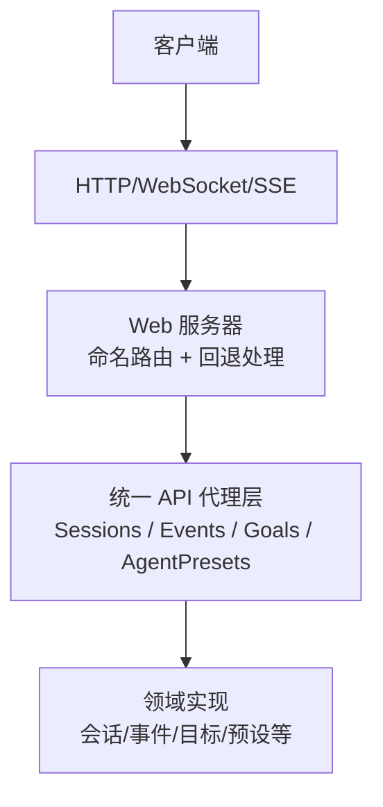
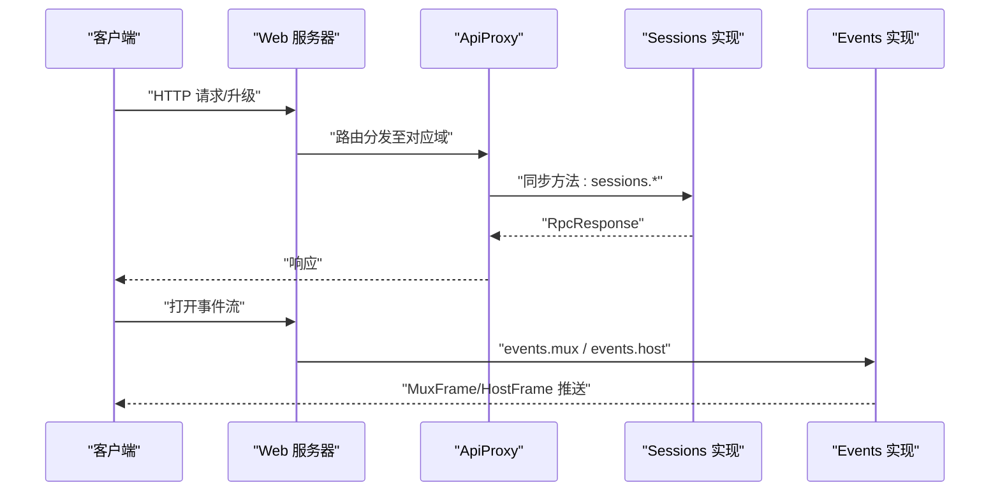
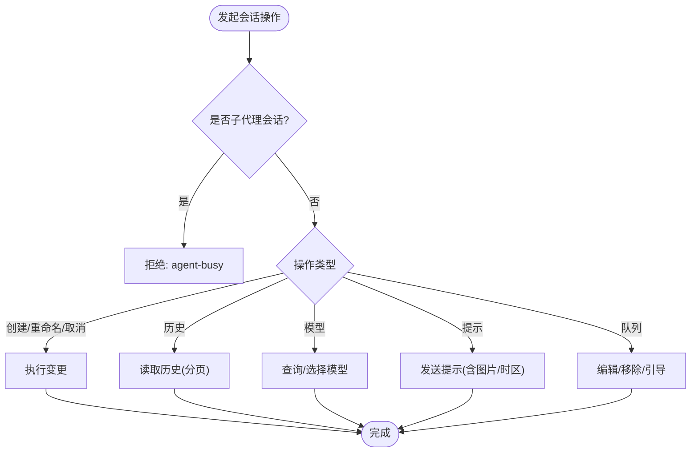
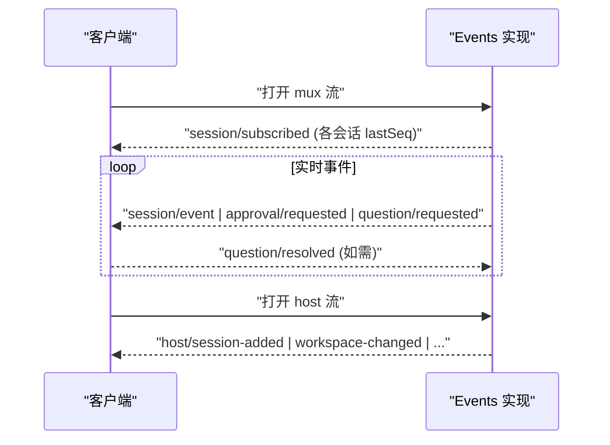
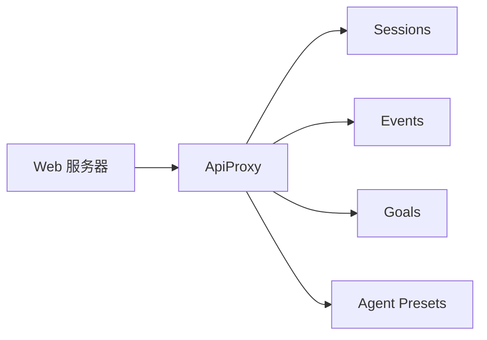

# HTTP API

<cite>
**本文引用的文件**
- [packages/host/webserver/src/index.ts](file://packages/host/webserver/src/index.ts)
- [docs/subsystems/web-server.md](file://docs/subsystems/web-server.md)
- [packages/host/apiproxy/src/api/index.ts](file://packages/host/apiproxy/src/api/index.ts)
- [packages/host/apiproxy/src/api/sessions.ts](file://packages/host/apiproxy/src/api/sessions.ts)
- [packages/host/apiproxy/src/api/events.ts](file://packages/host/apiproxy/src/api/events.ts)
- [packages/host/apiproxy/src/api/goals.ts](file://packages/host/apiproxy/src/api/goals.ts)
- [packages/host/apiproxy/src/api/agent-presets.ts](file://packages/host/apiproxy/src/api/agent-presets.ts)
</cite>

## 目录
1. [简介](#简介)
2. [项目结构](#项目结构)
3. [核心组件](#核心组件)
4. [架构总览](#架构总览)
5. [详细组件分析](#详细组件分析)
6. [依赖分析](#依赖分析)
7. [性能考虑](#性能考虑)
8. [故障排查指南](#故障排查指南)
9. [结论](#结论)
10. [附录](#附录)

## 简介
本文件面向使用 deepseek-harness 的开发者与集成方，提供 HTTP API 的权威说明。系统通过 Web 服务器暴露浏览器可访问的 HTTP 载体，并在其上承载统一的 RPC 代理层（ApiProxy），将“会话、事件流、目标、智能体预设”等域能力以统一契约对外暴露。API 设计遵循四象限消息模型：客户端请求、服务端响应、服务端请求（如审批/问答）、客户端响应，传输通道可为 HTTP、WebSocket 或进程内 SSE。

## 项目结构
- Web 服务器：负责监听端口、注册命名路由、处理静态资源与 SPA 回退、以及升级协议（如 WebSocket/SSE）。
- API 代理层：定义跨通道的领域接口（sessions、events、goals、agent-presets 等）与统一的消息信封（RpcRequest/RpcResponse）。
- 文档子系统：Web Server 的公开能力与配置在 docs 中生成并维护。

图表来源
- [packages/host/webserver/src/index.ts:59-105](file://packages/host/webserver/src/index.ts#L59-L105)
- [packages/host/apiproxy/src/api/index.ts:21-42](file://packages/host/apiproxy/src/api/index.ts#L21-L42)

章节来源
- [docs/subsystems/web-server.md:1-48](file://docs/subsystems/web-server.md#L1-L48)
- [packages/host/apiproxy/src/api/index.ts:1-99](file://packages/host/apiproxy/src/api/index.ts#L1-L99)

## 核心组件
- Web 服务器
  - 监听地址与端口：仅支持 127.0.0.1 与 0.0.0.0；无 TLS/鉴权/源策略。
  - 路由匹配：精确匹配优先，其次最长前缀匹配，最后由已注册的“回退处理器”兜底（SPA 场景）。
  - 生命周期：激活即监听；重复注册同名路由会抛错；错误请求返回 400 或销毁套接字。
- 统一 API 代理层（ApiProxy）
  - 领域接口：sessions、subagents、host、workspace、skills、agentPresets、events、goals、settings、credentials、llm、downloads。
  - 消息信封：RpcRequest/RpcResponse、ClientRequest/ServerRequest/ServerResponse/ClientResponse、RpcError/RpcId。
  - 扩展点：新增领域 = 新增文件对 + 接口字段 + 映射行。

章节来源
- [docs/subsystems/web-server.md:29-48](file://docs/subsystems/web-server.md#L29-L48)
- [packages/host/apiproxy/src/api/index.ts:21-99](file://packages/host/apiproxy/src/api/index.ts#L21-L99)

## 架构总览
下图展示从客户端到领域实现的端到端调用路径，包括流式事件与同步方法。

图表来源
- [packages/host/apiproxy/src/api/sessions.ts:231-373](file://packages/host/apiproxy/src/api/sessions.ts#L231-L373)
- [packages/host/apiproxy/src/api/events.ts:46-63](file://packages/host/apiproxy/src/api/events.ts#L46-L63)

## 详细组件分析

### 会话管理 API（Sessions）
- 能力概览
  - 列表与搜索：列出会话、按内容检索（限制结果数量，无游标）。
  - 创建与会话控制：创建会话、重命名、取消运行、分支（fork）。
  - 历史读取：分页读取事件窗口，尾部页携带投影基线。
  - 模型目录与选择：查询可用模型组、为会话选择具体模型与推理强度。
  - 提示与附件：发送文本/图片提示、读取受保护的附件。
  - 队列操作：编辑/移除/严格引导待处理项。
- 关键约束
  - 子代理会话拒绝普通会话的某些操作（如 agent-busy）。
  - 命令模式：以“/”开头的单段文本走命令注册表，不走模型。
  - 时间区：浏览器调用时附带 IANA 时区，服务端校验并记录。
- 数据要点
  - HistoryEntry 包含原始事件与可选视图（工具调用呈现）。
  - SessionProjectionsBlock 提供投影基线（asOfSeq + values）。
  - ModelSelection/ModelReasoning/ModelProviderGroup 描述模型目录与选择。

图表来源
- [packages/host/apiproxy/src/api/sessions.ts:231-373](file://packages/host/apiproxy/src/api/sessions.ts#L231-L373)

章节来源
- [packages/host/apiproxy/src/api/sessions.ts:38-373](file://packages/host/apiproxy/src/api/sessions.ts#L38-L373)

### 事件流 API（Events）
- 能力概览
  - mux：聚合所有会话的事件流，包含 session/event、session/subscribed、approval/question 往返、session/queue、session/jobs、session/projection、stream/error。
  - host：主机级信息流，包含会话增删、运行状态切换、工作区变更、归档会话变更、远程事件转发等。
- 语义要点
  - 流式帧采用窄形式 RpcRequest<Frame>，rpcId 透传以便回答可应答帧。
  - 队列与任务快照：session/queue 与 session/jobs 提供完整快照，保证多端收敛。
  - 投影更新：session/projection 携带键值与 seq，客户端以更高序列覆盖。

图表来源
- [packages/host/apiproxy/src/api/events.ts:46-156](file://packages/host/apiproxy/src/api/events.ts#L46-L156)

章节来源
- [packages/host/apiproxy/src/api/events.ts:1-156](file://packages/host/apiproxy/src/api/events.ts#L1-L156)

### 目标管理 API（Goals）
- 能力概览
  - 创建、编辑、暂停、恢复、完成、清除目标。
  - 读侧通过“goal”会话投影获取最新值，不暴露独立读取接口。
- 一致性
  - 所有变更基于 CAS（GoalRef.id + revision），避免并发冲突。
  - 子代理会话拒绝普通会话的目标操作（agent-busy）。

章节来源
- [packages/host/apiproxy/src/api/goals.ts:1-55](file://packages/host/apiproxy/src/api/goals.ts#L1-L55)

### 智能体预设 API（Agent Presets）
- 能力概览
  - 列出部署提供的预设（含信任级别、默认标记、可用性原因）。
  - 为空白会话切换预设（会话开始后锁定）。
  - 读取/复制/打开/删除本地预设（受保护，仅限本地作者预设）。
- 安全与权限
  - 读取与作者操作为特权接口，路径解析在服务端完成，不暴露文件系统路径。

章节来源
- [packages/host/apiproxy/src/api/agent-presets.ts:1-117](file://packages/host/apiproxy/src/api/agent-presets.ts#L1-L117)

## 依赖分析
- Web 服务器与 API 代理解耦：Web 服务器仅负责路由与传输，领域能力由 ApiProxy 组合。
- 统一契约：所有域方法通过 RpcRequest/RpcResponse 封装，屏蔽底层传输差异。
- 可扩展性：新增域需新增文件对（接口+实现）并在 ApiProxy 中注册。

图表来源
- [packages/host/apiproxy/src/api/index.ts:21-42](file://packages/host/apiproxy/src/api/index.ts#L21-L42)

章节来源
- [packages/host/apiproxy/src/api/index.ts:1-99](file://packages/host/apiproxy/src/api/index.ts#L1-L99)

## 性能考虑
- 历史分页：history 按消息边界分页，尾部页携带投影基线以减少冷启动开销。
- 流式推送：mux/host 流提供增量更新，客户端以更高序列覆盖，避免全量拉取。
- 模型目录：models 独立加载，失败不影响其他提供者可用性。
- 连接管理：Web 服务器在处置时需关闭所有连接（含 SSE），避免挂起。

[本节为通用指导，无需特定文件引用]

## 故障排查指南
- 常见错误
  - 路由冲突：重复注册相同 (kind, path) 会抛错，检查路由组合是否互斥。
  - 非法请求：解码异常或客户端中断导致 400，必要时销毁套接字。
  - 子代理限制：部分会话操作在子代理上下文中被拒绝（agent-busy）。
- 调试建议
  - 使用 mux/host 流观察会话状态、审批/问答往返、队列与任务快照。
  - 通过 history 尾部页验证投影基线与事件一致性。
  - 检查 Web 服务器的监听地址与端口，确保非环回绑定时的网络暴露风险。

章节来源
- [docs/subsystems/web-server.md:29-48](file://docs/subsystems/web-server.md#L29-L48)
- [packages/host/apiproxy/src/api/sessions.ts:231-373](file://packages/host/apiproxy/src/api/sessions.ts#L231-L373)
- [packages/host/apiproxy/src/api/events.ts:46-156](file://packages/host/apiproxy/src/api/events.ts#L46-L156)

## 结论
该 HTTP API 通过 Web 服务器与统一 ApiProxy 层，将复杂的多域能力抽象为稳定契约，并以流式与同步方式对外暴露。开发者可基于此快速构建前端或集成应用，利用事件流与投影机制实现高效、一致的用户体验。

[本节为总结，无需特定文件引用]

## 附录

### 认证与会话管理
- 认证：当前 Web 服务器未内置鉴权或 TLS；若启用 0.0.0.0 监听，请在前置网关层实施鉴权与加密。
- 会话：会话由 sessions.create 创建，后续通过 sessionId 进行历史、提示、模型等操作；事件流提供会话生命周期与状态变更。

章节来源
- [docs/subsystems/web-server.md:29-48](file://docs/subsystems/web-server.md#L29-L48)
- [packages/host/apiproxy/src/api/sessions.ts:231-373](file://packages/host/apiproxy/src/api/sessions.ts#L231-L373)

### 速率限制与版本管理
- 速率限制：未在代码中体现固定限制；建议在网关层根据业务需求实施。
- 版本管理：ApiProxy 以接口契约为中心，新增域需扩展接口与映射；历史读取与搜索行为在 v1 有明确约定（如 search 无游标）。

章节来源
- [packages/host/apiproxy/src/api/index.ts:21-42](file://packages/host/apiproxy/src/api/index.ts#L21-L42)
- [packages/host/apiproxy/src/api/sessions.ts:231-244](file://packages/host/apiproxy/src/api/sessions.ts#L231-L244)

### 向后兼容性
- 历史读取：尾部页额外携带 projections 块，未挂载投影能力的部署可省略该字段。
- 模型目录：groups 为建议性集合，routable 指示当前是否有适配器服务所选 provider，客户端应据此禁用输入。

章节来源
- [packages/host/apiproxy/src/api/sessions.ts:264-302](file://packages/host/apiproxy/src/api/sessions.ts#L264-L302)

### API 调用示例与最佳实践
- 示例路径（不含代码片段）
  - 创建会话与发送提示：参考 [sessions.ts:246-353](file://packages/host/apiproxy/src/api/sessions.ts#L246-L353)
  - 读取历史与尾部投影：参考 [sessions.ts:264-283](file://packages/host/apiproxy/src/api/sessions.ts#L264-L283)
  - 订阅事件流：参考 [events.ts:46-63](file://packages/host/apiproxy/src/api/events.ts#L46-L63)
  - 目标变更：参考 [goals.ts:30-53](file://packages/host/apiproxy/src/api/goals.ts#L30-L53)
  - 预设管理：参考 [agent-presets.ts:45-116](file://packages/host/apiproxy/src/api/agent-presets.ts#L45-L116)
- 最佳实践
  - 使用 mux/host 流维持 UI 一致性，结合 history 尾部页作为初始基线。
  - 对子代理会话的操作需先判断上下文，避免 agent-busy。
  - 在浏览器环境中传递 clientTimeZone，便于服务端规范化与审计。

章节来源
- [packages/host/apiproxy/src/api/sessions.ts:246-353](file://packages/host/apiproxy/src/api/sessions.ts#L246-L353)
- [packages/host/apiproxy/src/api/events.ts:46-63](file://packages/host/apiproxy/src/api/events.ts#L46-L63)
- [packages/host/apiproxy/src/api/goals.ts:30-53](file://packages/host/apiproxy/src/api/goals.ts#L30-L53)
- [packages/host/apiproxy/src/api/agent-presets.ts:45-116](file://packages/host/apiproxy/src/api/agent-presets.ts#L45-L116)

### 测试与调试
- 使用事件流调试：通过 mux 观察 session/event、approval/question 往返，确认队列与任务快照收敛。
- 使用历史断言：对比 history 尾部页的 projections 与事件顺序，验证投影一致性。
- Web 服务器调试：关注监听地址、端口分配与回退处理器行为，确保 SPA 路由正确。

章节来源
- [docs/subsystems/web-server.md:29-48](file://docs/subsystems/web-server.md#L29-L48)
- [packages/host/apiproxy/src/api/events.ts:46-156](file://packages/host/apiproxy/src/api/events.ts#L46-L156)
- [packages/host/apiproxy/src/api/sessions.ts:264-283](file://packages/host/apiproxy/src/api/sessions.ts#L264-L283)