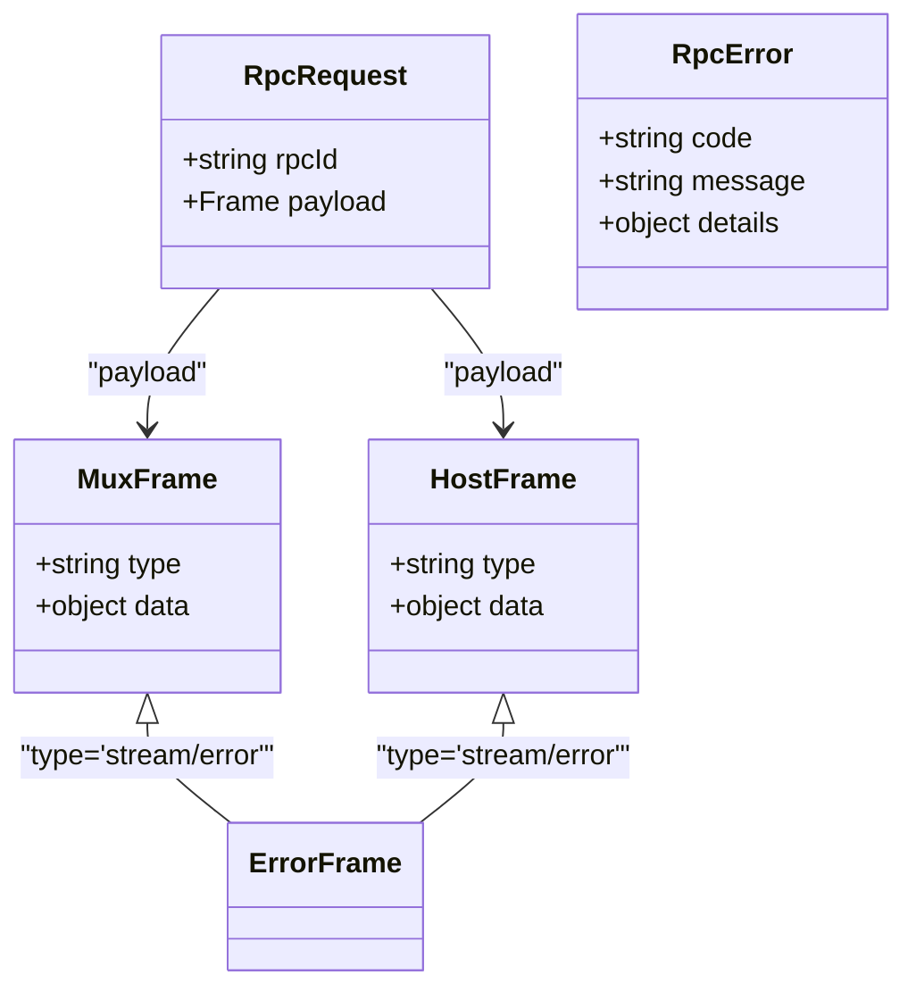
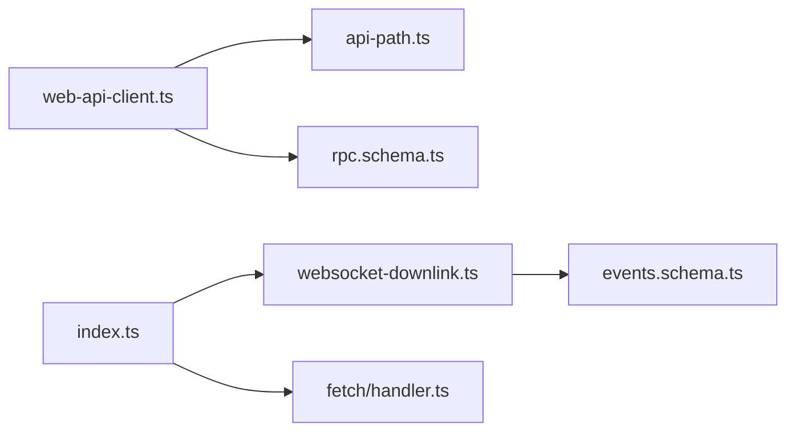

# WebSocket API

<cite>
**本文引用的文件**
- [packages/client/connection/src/index.ts](file://packages/client/connection/src/index.ts)
- [packages/client/connection/src/websocket-downlink.ts](file://packages/client/connection/src/websocket-downlink.ts)
- [packages/client/connection/src/api-path.ts](file://packages/client/connection/src/api-path.ts)
- [packages/client/connection/src/client/web-api-client.ts](file://packages/client/connection/src/client/web-api-client.ts)
- [packages/host/apiproxy/src/api/events.schema.ts](file://packages/host/apiproxy/src/api/events.schema.ts)
- [packages/host/apiproxy/src/api/rpc.schema.ts](file://packages/host/apiproxy/src/api/rpc.schema.ts)
- [packages/host/apiproxy/src/fetch/handler.ts](file://packages/host/apiproxy/src/fetch/handler.ts)
- [packages/client/runtime/src/client/sessions/manager.ts](file://packages/client/runtime/src/client/sessions/manager.ts)
- [packages/client/runtime/src/client/sessions/session.ts](file://packages/client/runtime/src/client/sessions/session.ts)
</cite>

## 目录
1. [简介](#简介)
2. [项目结�](#项目结�)
3. [核心组件](#核心组件)
4. [��总览](#��总览)
5. [详细组件分�](#详细组件分�)
6. [�赖关系分�](#�赖关系分�)
7. [性能���池](#性能���池)
8. [故障�查指�](#故障�查指�)
9. [结论](#结论)
10. [附录：客户端���点](#附录客户端���点)

## 简介
本文件��需��入�时通信的开�者，系统化说�本项目中基� WebSocket 的事件下行通�。内容涵盖：
- ��建立��级路径（HTTP GET 到 WebSocket）
- 消��议��列化格�（RPC 信� + 事件帧）
- 事件订阅机制（Mux � Host 两类事件�）
- 会�事件��智能体状��更�工具执行进度的��方�
- ��管��错误处����策略
- 客户端完整���点�最佳�践
- ���用�性能优化建议

## 项目结�
WebSocket 相关能力集中在 client-connection �件� host apiproxy 之间：
- �务端侧：注册 /api HTTP 路由�两个 WebSocket �级端点，负责鉴���级�帧泵�
- 客户端侧：�览器通过 fetch �起 RPC，通过 WebSocket �收 Mux/Host 事件�
- �议层：统一使用 RPC 信�包裹事件帧，并使用 schema 校验

```mermaid
graph TB
subgraph "�览器"
C["WebApiClient<br/>openMux/openHost"]
end
subgraph "主机�务"
R["/api 路由<br/>信任检查/426 Upgrade"]
W["WebSocketDownlinks<br/>handleMux/handleHost"]
E["ApiProxy.events.mux/host<br/>事件�"]
end
C --> |GET /api/events.mux -> 426 Upgrade| R
C --> |WS �级| R
R --> W
W --> E
E --> W
W --> C
```

**图示��**
- [packages/client/connection/src/index.ts:130-195](file://packages/client/connection/src/index.ts#L130-L195)
- [packages/client/connection/src/websocket-downlink.ts:64-82](file://packages/client/connection/src/websocket-downlink.ts#L64-L82)
- [packages/client/connection/src/client/web-api-client.ts:18-32](file://packages/client/connection/src/client/web-api-client.ts#L18-L32)

**章节��**
- [packages/client/connection/src/index.ts:130-195](file://packages/client/connection/src/index.ts#L130-L195)
- [packages/client/connection/src/api-path.ts:7-14](file://packages/client/connection/src/api-path.ts#L7-L14)

## 核心组件
- WebApiClient（�览器端）
  - 使用 fetch 进行上行 RPC
  - 为�个事件�维护一个 WebSocket ��（downlink-only），仅�收�务器��
  - 解�并校验 RPC 信��事件帧，按类�分�
- WebSocketDownlinks（主机端）
  - �有 ws.Server，处� /api/events.mux � /api/events.host 的�级
  - 将 ApiProxy 的事件迭代器泵�到 WebSocket，失败时�� stream/error �关闭
- 路由�鉴�（index.ts）
  - 对 /api 请求进行�信��校验
  - 对 /api/events.* 的 GET 返� 426 并�求 Upgrade
  - 注册 WebSocket �级处�器，并在��信��时拒��级

**章节��**
- [packages/client/connection/src/client/web-api-client.ts:1-92](file://packages/client/connection/src/client/web-api-client.ts#L1-L92)
- [packages/client/connection/src/websocket-downlink.ts:1-154](file://packages/client/connection/src/websocket-downlink.ts#L1-L154)
- [packages/client/connection/src/index.ts:130-195](file://packages/client/connection/src/index.ts#L130-L195)

## ��总览
下图展示��览器到主机的完整�手�事件�转过程，包括鉴���级�帧泵��错误传播。

```mermaid
sequenceDiagram
participant B as "�览器 WebApiClient"
participant S as "主机 /api 路由"
participant D as "WebSocketDownlinks"
participant A as "ApiProxy.events"
B->>S : GET /api/events.mux
S-->>B : 426 Upgrade Required (Upgrade : websocket)
B->>S : WS �级请求
S->>S : �信��校验
alt �信
S->>D : handleMux(req, socket, head)
D->>A : events.mux({rpcId}, signal)
loop 事件�
A-->>D : RpcRequest<MuxFrame>
D-->>B : JSON ServerRequest(� MuxFrame)
end
else ��信
S-->>B : 403 Forbidden
end
```

**图示��**
- [packages/client/connection/src/index.ts:150-194](file://packages/client/connection/src/index.ts#L150-L194)
- [packages/client/connection/src/websocket-downlink.ts:64-82](file://packages/client/connection/src/websocket-downlink.ts#L64-L82)
- [packages/client/connection/src/client/web-api-client.ts:18-32](file://packages/client/connection/src/client/web-api-client.ts#L18-L32)

## 详细组件分�

### ��建立��级�程
- �览器端通过 openMux/openHost �造 URL，将 http(s) 切�为 ws(s)，创建 WebSocket ��到 /api/events.mux 或 /api/events.host
- 若以 HTTP GET 访问，�务端返� 426 并�求 Upgrade；�览器���起 WS �级
- 主机端在 index.ts 中对请求进行�信��校验，通过�交由 WebSocketDownlinks 处��级
- Downlinks 在�级�立�监�首次 message，若收到任何上游消�则立�关闭（downlink-only，�止上行）

```mermaid
flowchart TD
Start(["开始"]) --> Check["检查请求方法"]
Check --> |GET| Return426["返� 426 �求 Upgrade"]
Check --> |WS �级| Trust{"�信��?"}
Trust --> |�| Reject["403 拒�"]
Trust --> |是| Upgrade["ws.Server.handleUpgrade"]
Upgrade --> FirstMsg{"是�收到消�?"}
FirstMsg --> |是| Close["关闭��(1008 downlink only)"]
FirstMsg --> |�| Pump["�动帧泵�"]
Pump --> End(["结�"])
```

**图示��**
- [packages/client/connection/src/index.ts:150-194](file://packages/client/connection/src/index.ts#L150-L194)
- [packages/client/connection/src/websocket-downlink.ts:105-115](file://packages/client/connection/src/websocket-downlink.ts#L105-L115)

**章节��**
- [packages/client/connection/src/client/web-api-client.ts:34-90](file://packages/client/connection/src/client/web-api-client.ts#L34-L90)
- [packages/client/connection/src/index.ts:150-194](file://packages/client/connection/src/index.ts#L150-L194)
- [packages/client/connection/src/websocket-downlink.ts:105-115](file://packages/client/connection/src/websocket-downlink.ts#L105-L115)

### 消��议��列化格�
- 传输�元：RpcRequest<Frame>，包� rpcId � payload
- Frame 分为两类：
  - MuxFrame：会�级事件�（如会�新��消����工具执行进度等）
  - HostFrame：主机级事件�（如全局状��系统通知等）
- 两端�使用 schema 校验：
  - 客户端使用 serverRequestSchema � muxFrameSchema/hostFrameSchema 解�
  - �务端使用 events.schema 定义事件类��错误帧
- 错误帧：type 为 stream/error，�带标准 RpcError（code/message/details）

**图示��**
- [packages/host/apiproxy/src/api/rpc.schema.ts](file://packages/host/apiproxy/src/api/rpc.schema.ts)
- [packages/host/apiproxy/src/api/events.schema.ts:66-92](file://packages/host/apiproxy/src/api/events.schema.ts#L66-L92)
- [packages/client/connection/src/client/web-api-client.ts:51-63](file://packages/client/connection/src/client/web-api-client.ts#L51-L63)

**章节��**
- [packages/host/apiproxy/src/api/events.schema.ts:66-92](file://packages/host/apiproxy/src/api/events.schema.ts#L66-L92)
- [packages/client/connection/src/client/web-api-client.ts:51-63](file://packages/client/connection/src/client/web-api-client.ts#L51-L63)

### 事件订阅机制�会�事件�
- 两�独立的下行通�：
  - /api/events.mux：会�维度事件（会�生命周期�消��工具调用进度等）
  - /api/events.host：主机维度事件（全局状��系统通知等）
- 客户端通过 openMux/openHost 分别�� AsyncIterable<RpcRequest<...>>，��消费
- 当底层事件�抛出异常时，�务端会��一� stream/error 帧�关闭��，客户端需�此触���

```mermaid
sequenceDiagram
participant C as "客户端"
participant S as "�务端"
participant E as "事件�"
C->>S : 打开 Mux 通�
S->>E : events.mux()
loop 正常事件
E-->>S : MuxFrame
S-->>C : RpcRequest{payload : MuxFrame}
end
opt 事件�异常
E-->>S : 抛出异常
S-->>C : RpcRequest{payload : stream/error}
S-->>C : 关闭��
end
```

**图示��**
- [packages/client/connection/src/websocket-downlink.ts:118-137](file://packages/client/connection/src/websocket-downlink.ts#L118-L137)
- [packages/host/apiproxy/src/fetch/handler.ts:201-219](file://packages/host/apiproxy/src/fetch/handler.ts#L201-L219)

**章节��**
- [packages/client/connection/src/client/web-api-client.ts:18-32](file://packages/client/connection/src/client/web-api-client.ts#L18-L32)
- [packages/host/apiproxy/src/fetch/handler.ts:201-219](file://packages/host/apiproxy/src/fetch/handler.ts#L201-L219)

### 智能体状��更�工具执行进度
- 会�事件�（Mux）承载智能体�行过程中的关键状��化�工具执行进度，例如：
  - 会�新�/更新
  - 消���（文本�图片�代��等）
  - 工具调用开始/完�/失败
  - ��/�考片段
- 这些事件由�端事件�产生，� WebSocketDownlinks 泵�至客户端，客户端根� type 字段分派到对应处�器

```mermaid
flowchart TD
A["事件�产生事件"] --> B["�装为 RpcRequest<MuxFrame>"]
B --> C["WebSocketDownlinks 写入 Socket"]
C --> D["客户端解�并分�"]
D --> E["UI/业务逻辑更新"]
```

**图示��**
- [packages/client/connection/src/websocket-downlink.ts:118-137](file://packages/client/connection/src/websocket-downlink.ts#L118-L137)
- [packages/client/connection/src/client/web-api-client.ts:51-63](file://packages/client/connection/src/client/web-api-client.ts#L51-L63)

**章节��**
- [packages/client/connection/src/websocket-downlink.ts:118-137](file://packages/client/connection/src/websocket-downlink.ts#L118-L137)
- [packages/client/connection/src/client/web-api-client.ts:51-63](file://packages/client/connection/src/client/web-api-client.ts#L51-L63)

### ��管����策略
- ��生命周期：
  - 客户端在 onOpen �调��开始消费事件
  - 收到 close 或 abort 信�时清�资�
  - 收到 stream/error 视为�失败，应触���
- ��建议：
  - 指数退��试，��雪崩
  - �制最大�试次数�最长间隔
  - ����先�试��会�上下文（如最近一次已知的会� ID）
- �务端行为：
  - 事件�异常时�� stream/error �关闭��，确�客户端能感知并��

```mermaid
flowchart TD
Start(["��建立"]) --> Consume["消费事件"]
Consume --> Err{"收到 stream/error ?"}
Err --> |是| Reconnect["指数退���"]
Err --> |�| KeepAlive["����"]
Reconnect --> TryAgain{"达到最大�试?"}
TryAgain --> |�| Connect["�新建立��"]
TryAgain --> |是| Fail["上报错误并�止"]
KeepAlive --> End(["结�"])
Fail --> End
```

**图示��**
- [packages/client/runtime/src/client/sessions/manager.ts:685-690](file://packages/client/runtime/src/client/sessions/manager.ts#L685-L690)
- [packages/client/runtime/src/client/sessions/session.ts:510-520](file://packages/client/runtime/src/client/sessions/session.ts#L510-L520)
- [packages/host/apiproxy/src/fetch/handler.ts:201-219](file://packages/host/apiproxy/src/fetch/handler.ts#L201-L219)

**章节��**
- [packages/client/runtime/src/client/sessions/manager.ts:685-690](file://packages/client/runtime/src/client/sessions/manager.ts#L685-L690)
- [packages/client/runtime/src/client/sessions/session.ts:510-520](file://packages/client/runtime/src/client/sessions/session.ts#L510-L520)
- [packages/host/apiproxy/src/fetch/handler.ts:201-219](file://packages/host/apiproxy/src/fetch/handler.ts#L201-L219)

## �赖关系分�
- 客户端�赖：
  - web-api-client.ts：�装 WebSocket 读��帧解�
  - api-path.ts：共享 /api �缀�事件路径常�
- �务端�赖：
  - index.ts：挂载 /api 路由� WebSocket �级
  - websocket-downlink.ts：�� downlink-only 的 WebSocket 泵�
  - events.schema.ts：定义事件帧�错误帧结�
  - rpc.schema.ts：定义 RPC 信�结�

**图示��**
- [packages/client/connection/src/client/web-api-client.ts:1-92](file://packages/client/connection/src/client/web-api-client.ts#L1-L92)
- [packages/client/connection/src/api-path.ts:7-14](file://packages/client/connection/src/api-path.ts#L7-L14)
- [packages/client/connection/src/index.ts:130-195](file://packages/client/connection/src/index.ts#L130-L195)
- [packages/client/connection/src/websocket-downlink.ts:1-154](file://packages/client/connection/src/websocket-downlink.ts#L1-L154)
- [packages/host/apiproxy/src/api/events.schema.ts:66-92](file://packages/host/apiproxy/src/api/events.schema.ts#L66-L92)
- [packages/host/apiproxy/src/api/rpc.schema.ts](file://packages/host/apiproxy/src/api/rpc.schema.ts)
- [packages/host/apiproxy/src/fetch/handler.ts:201-219](file://packages/host/apiproxy/src/fetch/handler.ts#L201-L219)

**章节��**
- [packages/client/connection/src/index.ts:130-195](file://packages/client/connection/src/index.ts#L130-L195)
- [packages/client/connection/src/websocket-downlink.ts:1-154](file://packages/client/connection/src/websocket-downlink.ts#L1-L154)
- [packages/client/connection/src/client/web-api-client.ts:1-92](file://packages/client/connection/src/client/web-api-client.ts#L1-L92)
- [packages/host/apiproxy/src/api/events.schema.ts:66-92](file://packages/host/apiproxy/src/api/events.schema.ts#L66-L92)
- [packages/host/apiproxy/src/fetch/handler.ts:201-219](file://packages/host/apiproxy/src/fetch/handler.ts#L201-L219)

## 性能ä¸�è¿�æ�¥æ±
- ��模�
  - ��事件�一个 WebSocket ��（downlink-only），无上行��，���手�拥��制开销
  - Mux � Host 分离，��热点事件阻�其他事件
- 背��缓冲
  - 客户端使用 inbox 队列� wake 唤醒机制，��阻�事件循�
  - �务端 pump 过程中�到写失败会�� stream/error 并关闭，防止无�堆积
- ���用�池化建议
  - �一页�内尽��用�有��，��频�创建销�
  - 多标签页场景�按会�维度�用��，�少全局���力
  - 对高��场景�考虑��池（按租户/会�分组），��心跳�活
- 网络��列化
  - 使用 JSON 传输，注�大对象（如图片 base64）的上行走 HTTP，下行事件尽�精简
  - ��设置 maxRequestBodyBytes，��过大请求被拒�

[本节�供通用指导，�直�分�具体文件]

## 故障�查指�
- 常�问题
  - 426 Upgrade Required：客户端以 HTTP GET 访问事件路径，需改为 WebSocket �级
  - 403 Forbidden：请求���在�信列表，或�级请求未通过信任检查
  - 1008 downlink only：客户端� downlink ��了消�，���议
  - stream/error：事件�异常，客户端应��并��
- 定�步骤
  - 检查 /api 路由是�注册�功，以� trustedHosts �置是�正确
  - 确认�览器端 openMux/openHost 使用的路径��议正确
  - 观察�务端日志，确认事件�是�抛出异常并�� stream/error
  - 验�客户端是�正确解�并忽略未知帧类�

**章节��**
- [packages/client/connection/src/index.ts:150-194](file://packages/client/connection/src/index.ts#L150-L194)
- [packages/client/connection/src/websocket-downlink.ts:105-115](file://packages/client/connection/src/websocket-downlink.ts#L105-L115)
- [packages/host/apiproxy/src/fetch/handler.ts:201-219](file://packages/host/apiproxy/src/fetch/handler.ts#L201-L219)

## 结论
本项目的 WebSocket API 采用“HTTP 上行 + �通�下行�的设计：
- 上行 RPC 通过 /api 的 fetch ��完�，具备完善的鉴����
- 下行事件通过 /api/events.mux � /api/events.host 两个 downlink-only 的 WebSocket 通���
- 所有事件帧使用统一的 RPC 信�� schema 校验，错误通过 stream/error 标准化传播
- 客户端需���壮的���错误处�，�务端在事件�异常时主动关闭��

该设计在��安全性的�时，�供了高����延迟的�时通信能力，适用�会�事件�智能体状��工具执行进度的�时��。

[本节总结性内容，�直�分�具体文件]

## 附录：客户端���点
- 建立��
  - 使用 openMux/openHost 分别�� /api/events.mux � /api/events.host
  - 在 onOpen �调中开始消费事件
- 解��分�
  - 使用 serverRequestSchema 解�信�，�用 muxFrameSchema/hostFrameSchema 解� payload
  - 根� payload.type 分�给对应处�器
- 错误���
  - �� stream/error 帧，记录错误信�并触���
  - ��指数退��最大�试次数
- 资�清�
  - 在 close/abort 事件中移除监�器并关闭��
- 示例�考（路径）
  - �览器端 WebSocket 读��解�：[packages/client/connection/src/client/web-api-client.ts:34-90](file://packages/client/connection/src/client/web-api-client.ts#L34-L90)
  - 事件�泵��错误处�：[packages/client/connection/src/websocket-downlink.ts:118-137](file://packages/client/connection/src/websocket-downlink.ts#L118-L137)
  - 事件�异常时的错误帧生�：[packages/host/apiproxy/src/fetch/handler.ts:201-219](file://packages/host/apiproxy/src/fetch/handler.ts#L201-L219)

**章节��**
- [packages/client/connection/src/client/web-api-client.ts:34-90](file://packages/client/connection/src/client/web-api-client.ts#L34-L90)
- [packages/client/connection/src/websocket-downlink.ts:118-137](file://packages/client/connection/src/websocket-downlink.ts#L118-L137)
- [packages/host/apiproxy/src/fetch/handler.ts:201-219](file://packages/host/apiproxy/src/fetch/handler.ts#L201-L219)