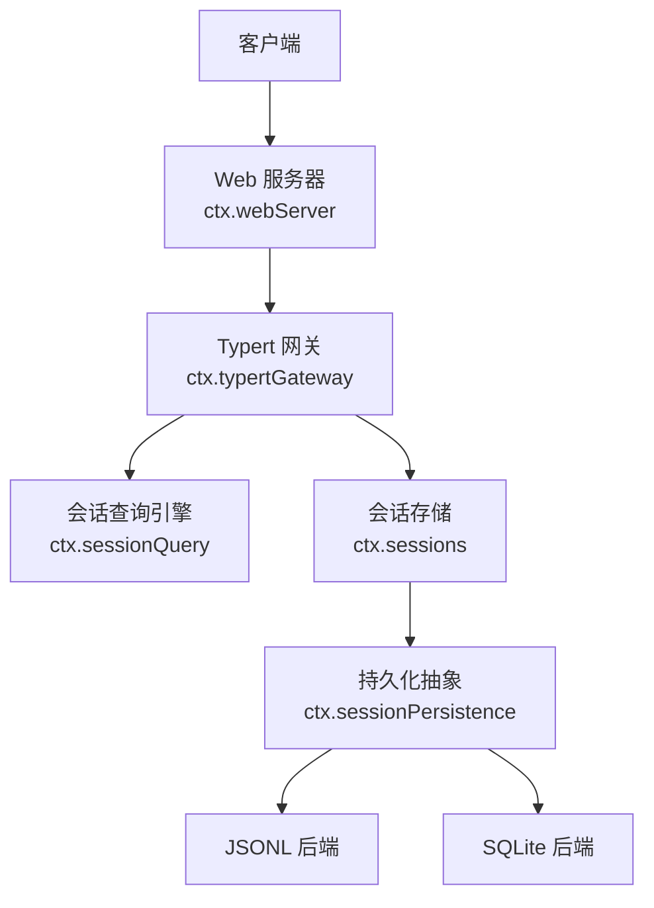
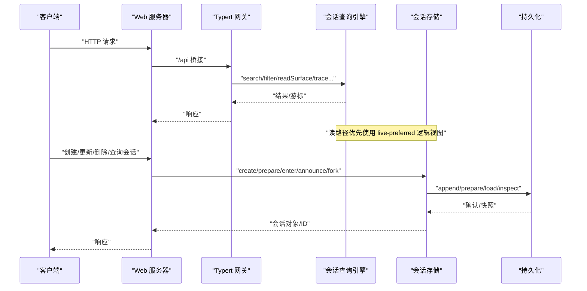
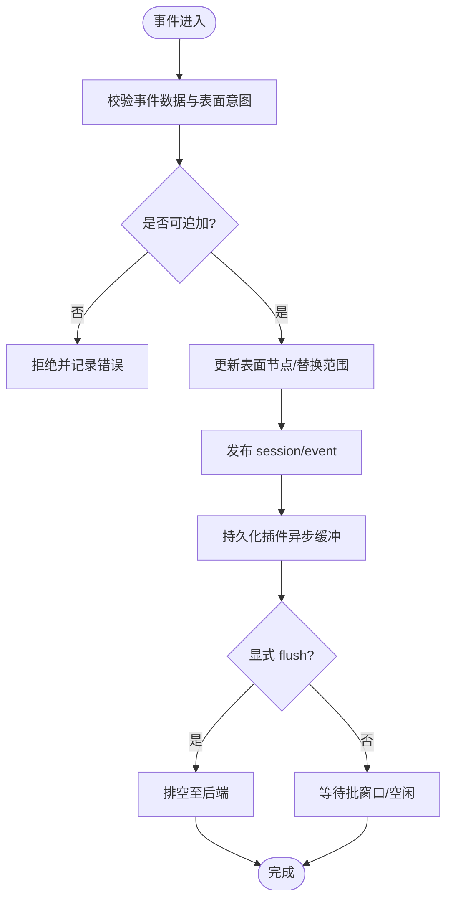
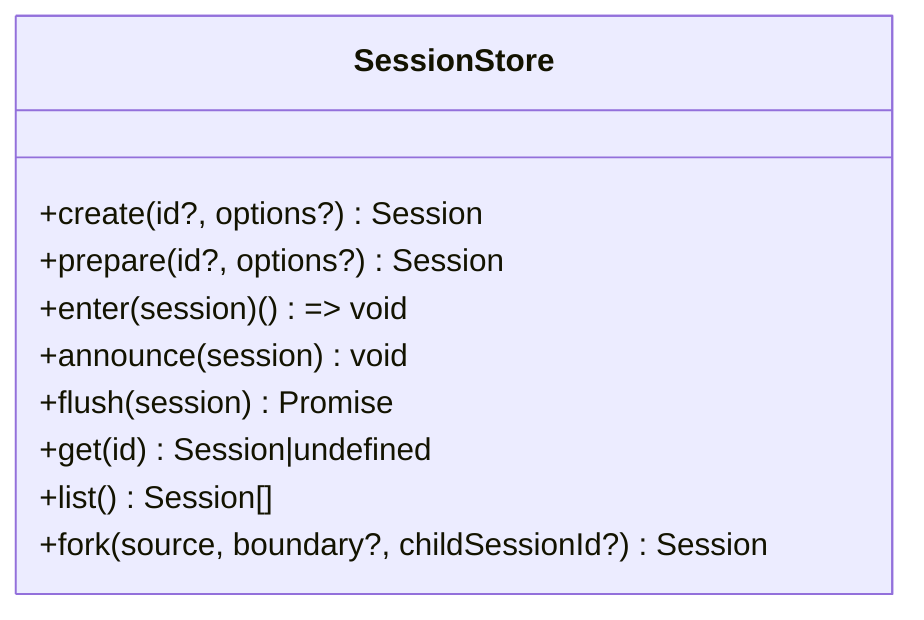
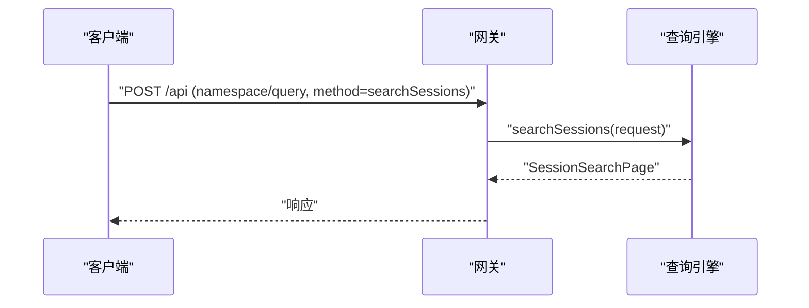
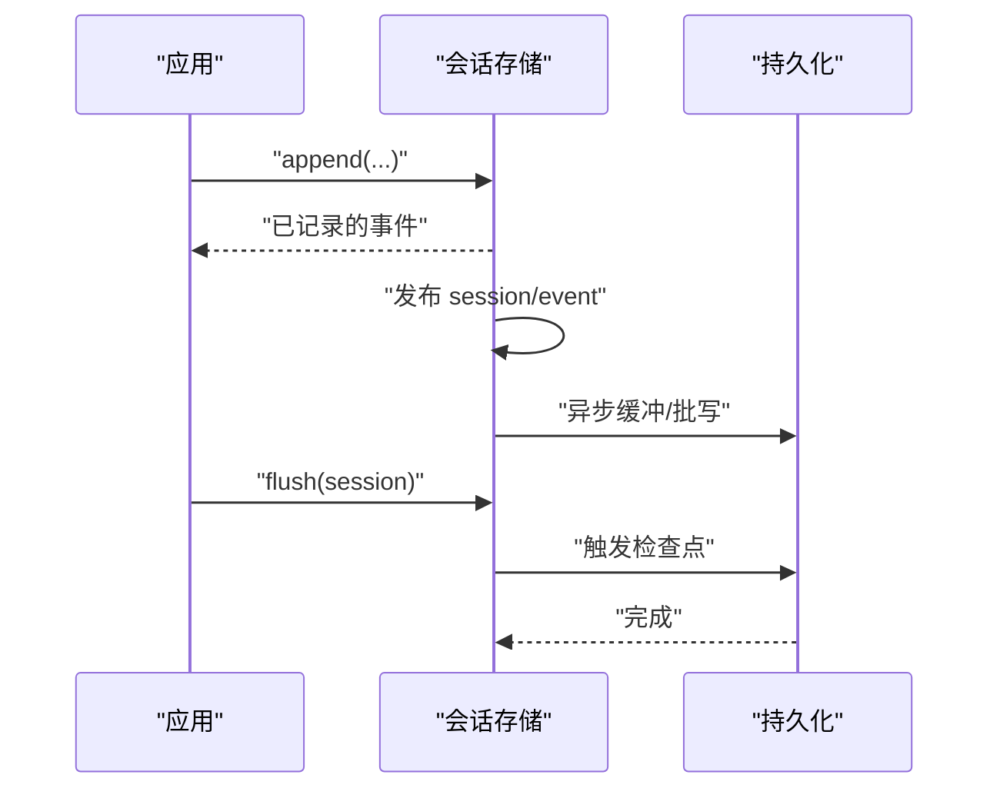
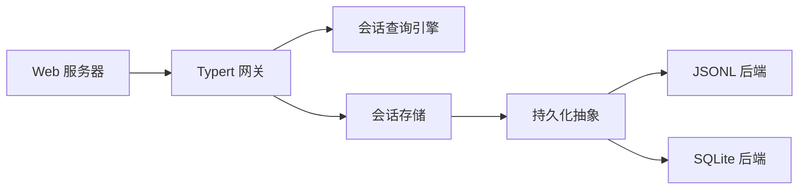

# 会话管理 API

<cite>
**本文引用的文件**
- [packages/core/session/src/index.ts](file://packages/core/session/src/index.ts)
- [docs/subsystems/session.md](file://docs/subsystems/session.md)
- [docs/subsystems/persistence.md](file://docs/subsystems/persistence.md)
- [docs/subsystems/session-query.md](file://docs/subsystems/session-query.md)
- [packages/session-query/session-query/src/index.ts](file://packages/session-query/session-query/src/index.ts)
- [packages/api/gateway/src/index.ts](file://packages/api/gateway/src/index.ts)
- [docs/subsystems/web-server.md](file://docs/subsystems/web-server.md)
</cite>

## 目录
1. [简介](#简介)
2. [项目结构](#项目结构)
3. [核心组件](#核心组件)
4. [架构总览](#架构总览)
5. [详细组件分析](#详细组件分析)
6. [依赖关系分析](#依赖关系分析)
7. [性能考虑](#性能考虑)
8. [故障排查指南](#故障排查指南)
9. [结论](#结论)
10. [附录：RESTful 端点与示例](#附录restful-端点与示例)

## 简介
本文件面向“会话管理”的 RESTful 接口与内部机制，覆盖会话创建、更新、删除、查询的完整生命周期；说明会话状态管理、事件流处理与持久化机制；给出请求参数验证、响应格式与错误处理策略；并提供操作示例（创建新会话、获取会话状态、监听会话事件、管理会话数据）。同时解释会话与智能体的关联关系以及数据隔离机制。

## 项目结构
- 会话内核与事件模型：位于 core/session，提供事件溯源的 Session、会话存储与会话事件总线。
- 持久化：session-persistence 抽象服务 + JSONL/SQLite 后端，负责落盘、崩溃恢复与检查点。
- 查询能力：session-query 提供跨会话/单会话检索、全文搜索、血缘追踪、窗口读取等。
- 网关与 HTTP：api-gateway 将 Cordis Service 方法暴露为远程调用；web-server 提供浏览器 HTTP 路由与静态资源。

**图表来源**
- [packages/api/gateway/src/index.ts:90-112](file://packages/api/gateway/src/index.ts#L90-L112)
- [docs/subsystems/web-server.md:57-105](file://docs/subsystems/web-server.md#L57-L105)
- [packages/session-query/session-query/src/index.ts:81-105](file://packages/session-query/session-query/src/index.ts#L81-L105)
- [packages/core/session/src/index.ts:37-86](file://packages/core/session/src/index.ts#L37-L86)
- [docs/subsystems/persistence.md:231-237](file://docs/subsystems/persistence.md#L231-L237)

**章节来源**
- [packages/core/session/src/index.ts:37-86](file://packages/core/session/src/index.ts#L37-L86)
- [docs/subsystems/web-server.md:57-105](file://docs/subsystems/web-server.md#L57-L105)
- [packages/session-query/session-query/src/index.ts:81-105](file://packages/session-query/session-query/src/index.ts#L81-L105)
- [docs/subsystems/persistence.md:231-237](file://docs/subsystems/persistence.md#L231-L237)

## 核心组件
- 会话内核（Session）：以追加式事件日志为核心，消息历史由事件推导，支持表面替换、增量投影与缓存。
- 会话存储（SessionStore）：维护内存中的会话集合，提供 create/prepare/enter/announce/fork/list/get/flush 等操作。
- 持久化（SessionPersistence）：抽象服务，定义 locate/create/append/prepare/load/inspect/readFrom/list/listSnapshots 等能力，支持 JSONL/SQLite 两种后端。
- 查询引擎（SessionQueryEngine）：统一会话检索能力，包括列表、过滤、全文搜索、血缘追踪、窗口读取、标题折叠等。
- 网关（TypertGatewayService）：将服务方法通过 /api 桥接暴露为远程调用，负责参数校验、上下文解析与错误封装。
- Web 服务器（WebServer）：注册命名路由、升级路由与回退处理器，承载前端 SPA 与 /api 桥接。

**章节来源**
- [docs/subsystems/session.md:359-519](file://docs/subsystems/session.md#L359-L519)
- [docs/subsystems/session.md:617-745](file://docs/subsystems/session.md#L617-L745)
- [docs/subsystems/persistence.md:246-380](file://docs/subsystems/persistence.md#L246-L380)
- [docs/subsystems/session-query.md:367-490](file://docs/subsystems/session-query.md#L367-L490)
- [packages/api/gateway/src/index.ts:90-184](file://packages/api/gateway/src/index.ts#L90-L184)
- [docs/subsystems/web-server.md:57-105](file://docs/subsystems/web-server.md#L57-L105)

## 架构总览
下图展示了从客户端到会话内核与持久化的端到端路径，以及查询与事件流的位置。

**图表来源**
- [packages/api/gateway/src/index.ts:104-112](file://packages/api/gateway/src/index.ts#L104-L112)
- [packages/session-query/session-query/src/index.ts:134-151](file://packages/session-query/session-query/src/index.ts#L134-L151)
- [docs/subsystems/session.md:617-745](file://docs/subsystems/session.md#L617-L745)
- [docs/subsystems/persistence.md:246-380](file://docs/subsystems/persistence.md#L246-L380)

## 详细组件分析

### 会话事件与状态管理
- 事件模型：SessionEventMap 定义了 turn/step/user/assistant/tool/request 等事件类型，构成不可变追加日志。
- 表面投影：SurfaceOp 控制事件如何进入有序表面（追加或替换），deriveMessages 基于表面生成 LLM 可见的消息历史。
- 首活边界：firstLiveSeq 与 session/end-seed 标记本次进程写入起点，用于区分种子历史与实时工作。
- 轮次结束原因：TurnEndReasonMap 包含 completed/aborted/blocked/error/max-tokens/interrupted 等语义。

**图表来源**
- [docs/subsystems/session.md:9-125](file://docs/subsystems/session.md#L9-L125)
- [docs/subsystems/session.md:194-357](file://docs/subsystems/session.md#L194-L357)
- [docs/subsystems/session.md:359-519](file://docs/subsystems/session.md#L359-L519)
- [docs/subsystems/persistence.md:9-19](file://docs/subsystems/persistence.md#L9-L19)

**章节来源**
- [docs/subsystems/session.md:9-125](file://docs/subsystems/session.md#L9-L125)
- [docs/subsystems/session.md:194-357](file://docs/subsystems/session.md#L194-L357)
- [docs/subsystems/session.md:359-519](file://docs/subsystems/session.md#L359-L519)
- [docs/subsystems/persistence.md:9-19](file://docs/subsystems/persistence.md#L9-L19)

### 会话存储与会话生命周期
- 创建与会话头：create(id?, options?) 支持 seed/meta 注入，store 填充 version/id/createdAt；prepare/enter/announce 组合用于精细生命周期控制。
- 分叉：fork(source, boundary?, childSessionId?) 基于稳定前缀创建子会话，要求边界不在开放轮次内。
- 列举与查找：list() 返回按创建顺序的会话数组；get(id) 返回当前内存中的会话实例。
- 刷新：flush(session) 触发所有持久化监听器的检查点，确保事件落盘。

**图表来源**
- [docs/subsystems/session.md:617-745](file://docs/subsystems/session.md#L617-L745)

**章节来源**
- [docs/subsystems/session.md:617-745](file://docs/subsystems/session.md#L617-L745)

### 持久化机制与崩溃恢复
- 抽象服务：SessionPersistence 定义 locate/create/append/prepare/load/inspect/readFrom/list/listSnapshots。
- 后端实现：JSONL（每会话独立文件，压缩/原子写）与 SQLite（单库多行，字段与事件一一对应）。
- 崩溃恢复：冷加载时若发现未闭合的 turn/start，会合成 interrupted 结束事件，保持平衡且不改写已提交事件。
- 格式拒绝：版本不兼容直接拒绝，避免静默降级导致误读。

```mermaid
flowchart TD
Load["load(id)"] --> Inspect["inspect(id) 构建不可变视图"]
Inspect --> Repair{"是否中断轮次?"}
Repair -- 是 --> CloseTurn["合成 turn/end{interrupted}"]
Repair -- 否 --> Return["返回已平衡的日志"]
CloseTurn --> Return
```

**图表来源**
- [docs/subsystems/persistence.md:13-19](file://docs/subsystems/persistence.md#L13-L19)
- [docs/subsystems/persistence.md:231-237](file://docs/subsystems/persistence.md#L231-L237)
- [docs/subsystems/persistence.md:246-380](file://docs/subsystems/persistence.md#L246-L380)

**章节来源**
- [docs/subsystems/persistence.md:13-19](file://docs/subsystems/persistence.md#L13-L19)
- [docs/subsystems/persistence.md:231-237](file://docs/subsystems/persistence.md#L231-L237)
- [docs/subsystems/persistence.md:246-380](file://docs/subsystems/persistence.md#L246-L380)

### 查询与检索能力
- 会话列表与过滤：listSessions(filterSessions) 支持 id/cwd/created-at/parent/availability 等条件。
- 全文搜索：searchSessions/searchEvents 返回分页游标与命中摘要。
- 精确读取：readSession/readSurface/readEvent 提供完整日志、当前表面与窗口读取。
- 血缘与关系：traceSession/traceEvent 提供祖先/后代树与事件替换链、源引用链。

**图表来源**
- [packages/api/gateway/src/index.ts:145-184](file://packages/api/gateway/src/index.ts#L145-L184)
- [docs/subsystems/session-query.md:367-490](file://docs/subsystems/session-query.md#L367-L490)

**章节来源**
- [docs/subsystems/session-query.md:367-490](file://docs/subsystems/session-query.md#L367-L490)

### 事件流与监听
- 事件总线：session/event 在每次 append 后发布，供持久化与观测者消费。
- 生命周期事件：session/created 与 session/disposed 分别表示会话进入与离开存储。
- 刷新事件：session/flush 作为并行检查点，确保持久化完成后再继续业务。

**图表来源**
- [packages/core/session/src/index.ts:42-86](file://packages/core/session/src/index.ts#L42-L86)

**章节来源**
- [packages/core/session/src/index.ts:42-86](file://packages/core/session/src/index.ts#L42-L86)

### 会话与智能体关联及数据隔离
- 会话头元数据：SessionHeader 包含 version/id/createdAt/cwd/parentSession/seedLength/origin/delegationDepth/agentPreset 等，标识会话来源与代理配置。
- 智能体作用域：会话通过 agent 上下文进入 store，scope-filtered 的事件分发确保仅相关 agent 接收其会话事件。
- 数据隔离：每个会话拥有独立 ID 与事件日志；父/子关系通过 parentSession/seedLength 表达；不同 agent 的作用域隔离事件与查询结果。

**章节来源**
- [docs/subsystems/persistence.md:41-90](file://docs/subsystems/persistence.md#L41-L90)
- [packages/core/session/src/index.ts:42-86](file://packages/core/session/src/index.ts#L42-L86)

## 依赖关系分析
- 网关依赖 Typert 注册表与服务反射，将 /api 请求路由到具体 Service 方法。
- 查询引擎依赖会话存储与持久化抽象，提供 live-preferred 的统一视图。
- 会话存储依赖持久化抽象，解耦具体后端。
- Web 服务器提供 HTTP 路由，承载 /api 桥接与静态资源。

**图表来源**
- [packages/api/gateway/src/index.ts:90-112](file://packages/api/gateway/src/index.ts#L90-L112)
- [packages/session-query/session-query/src/index.ts:81-105](file://packages/session-query/session-query/src/index.ts#L81-L105)
- [docs/subsystems/persistence.md:231-237](file://docs/subsystems/persistence.md#L231-L237)
- [docs/subsystems/web-server.md:57-105](file://docs/subsystems/web-server.md#L57-L105)

**章节来源**
- [packages/api/gateway/src/index.ts:90-112](file://packages/api/gateway/src/index.ts#L90-L112)
- [packages/session-query/session-query/src/index.ts:81-105](file://packages/session-query/session-query/src/index.ts#L81-L105)
- [docs/subsystems/persistence.md:231-237](file://docs/subsystems/persistence.md#L231-L237)
- [docs/subsystems/web-server.md:57-105](file://docs/subsystems/web-server.md#L57-L105)

## 性能考虑
- 事件追加热路径不阻塞 I/O，持久化插件异步缓冲与批写，减少同步开销。
- 表面投影与消息推导采用缓存，首次投影后复用，替换时重建。
- 查询引擎支持分页游标与并发限制，避免全量扫描。
- 持久化后端选择：JSONL 适合顺序追加与原始文本导出；SQLite 适合随机访问与复杂查询。

[本节为通用指导，无需特定文件来源]

## 故障排查指南
- 参数校验失败：网关对 args 进行严格校验，缺失/多余字段会返回 arguments-invalid。
- 服务不可用：service-unavailable/method-unavailable 表明目标服务或方法未注册。
- 查询错误：session-query 返回稳定的错误码（如 SESSION_QUERY_INVALID_CONFIG/SESSION_QUERY_SESSION_NOT_FOUND）。
- 持久化失败：flush 失败会被记录并通过 agent/error 上报，不会污染会话事件。
- 崩溃恢复：冷加载检测到未闭合轮次会自动合成 interrupted 结束事件，保证一致性。

**章节来源**
- [packages/api/gateway/src/index.ts:145-184](file://packages/api/gateway/src/index.ts#L145-L184)
- [docs/subsystems/session-query.md:333-357](file://docs/subsystems/session-query.md#L333-L357)
- [docs/subsystems/persistence.md:9-19](file://docs/subsystems/persistence.md#L9-L19)

## 结论
本系统以事件溯源为核心，结合会话存储、持久化与查询能力，提供了完整的会话生命周期管理与检索能力。通过网关与 Web 服务器暴露 RESTful 风格接口，满足创建、更新、删除、查询等常见需求，并在崩溃恢复、数据隔离与性能方面具备稳健设计。

[本节为总结性内容，无需特定文件来源]

## 附录：RESTful 端点与示例
以下端点通过 Web 服务器的 /api 桥接暴露，实际调用由 Typert 网关转发到对应 Service 方法。

- 创建会话
  - 端点：POST /api
  - 命名空间与方法：namespace="sessions", method="create"
  - 请求体：args = { id?: string, options?: CreateSessionOptions }
  - 响应：成功返回会话对象；失败返回错误码与消息
  - 参考：会话存储 create 方法与选项定义
  - 参考来源
    - [docs/subsystems/session.md:617-745](file://docs/subsystems/session.md#L617-L745)
    - [packages/api/gateway/src/index.ts:145-184](file://packages/api/gateway/src/index.ts#L145-L184)

- 准备与进入会话（精细化生命周期）
  - 端点：POST /api
  - 命名空间与方法：namespace="sessions", method="prepare" 或 "enter" 或 "announce"
  - 请求体：args = { id?: string, options?: PrepareSessionOptions }
  - 响应：成功返回会话对象或处置器；失败返回错误码与消息
  - 参考来源
    - [docs/subsystems/session.md:617-745](file://docs/subsystems/session.md#L617-L745)
    - [packages/api/gateway/src/index.ts:145-184](file://packages/api/gateway/src/index.ts#L145-L184)

- 刷新会话（持久化检查点）
  - 端点：POST /api
  - 命名空间与方法：namespace="sessions", method="flush"
  - 请求体：args = { sessionId: string }
  - 响应：布尔值表示是否有持久化监听器参与
  - 参考来源
    - [docs/subsystems/session.md:617-745](file://docs/subsystems/session.md#L617-L745)
    - [packages/api/gateway/src/index.ts:145-184](file://packages/api/gateway/src/index.ts#L145-L184)

- 列举会话
  - 端点：POST /api
  - 命名空间与方法：namespace="sessionQuery", method="listSessions"
  - 请求体：args = { signal? }
  - 响应：会话记录数组（最新优先）
  - 参考来源
    - [docs/subsystems/session-query.md:367-490](file://docs/subsystems/session-query.md#L367-L490)
    - [packages/api/gateway/src/index.ts:145-184](file://packages/api/gateway/src/index.ts#L145-L184)

- 过滤会话
  - 端点：POST /api
  - 命名空间与方法：namespace="sessionQuery", method="filterSessions"
  - 请求体：args = { filters: SessionResultFilter[], signal? }
  - 响应：匹配的记录数组
  - 参考来源
    - [docs/subsystems/session-query.md:367-490](file://docs/subsystems/session-query.md#L367-L490)
    - [packages/api/gateway/src/index.ts:145-184](file://packages/api/gateway/src/index.ts#L145-L184)

- 全文搜索会话
  - 端点：POST /api
  - 命名空间与方法：namespace="sessionQuery", method="searchSessions"
  - 请求体：args = { query, sessionFilters?, eventFilters?, limit?, cursor? }
  - 响应：SessionSearchPage（items, nextCursor）
  - 参考来源
    - [docs/subsystems/session-query.md:367-490](file://docs/subsystems/session-query.md#L367-L490)
    - [packages/api/gateway/src/index.ts:145-184](file://packages/api/gateway/src/index.ts#L145-L184)

- 读取会话完整日志
  - 端点：POST /api
  - 命名空间与方法：namespace="sessionQuery", method="readSession"
  - 请求体：args = { sessionId }
  - 响应：SessionLogSnapshot（header, events）
  - 参考来源
    - [docs/subsystems/session-query.md:367-490](file://docs/subsystems/session-query.md#L367-L490)
    - [packages/api/gateway/src/index.ts:145-184](file://packages/api/gateway/src/index.ts#L145-L184)

- 读取当前表面
  - 端点：POST /api
  - 命名空间与方法：namespace="sessionQuery", method="readSurface"
  - 请求体：args = { sessionId }
  - 响应：SessionSurfaceSnapshot（header, capturedThroughSeq, events）
  - 参考来源
    - [docs/subsystems/session-query.md:367-490](file://docs/subsystems/session-query.md#L367-L490)
    - [packages/api/gateway/src/index.ts:145-184](file://packages/api/gateway/src/index.ts#L145-L184)

- 事件窗口读取
  - 端点：POST /api
  - 命名空间与方法：namespace="sessionQuery", method="readEvent"
  - 请求体：args = { sessionId, seq, before?, after? }
  - 响应：SessionEventWindow（target, events, startSeq, endSeq）
  - 参考来源
    - [docs/subsystems/session-query.md:367-490](file://docs/subsystems/session-query.md#L367-L490)
    - [packages/api/gateway/src/index.ts:145-184](file://packages/api/gateway/src/index.ts#L145-L184)

- 会话血缘追踪
  - 端点：POST /api
  - 命名空间与方法：namespace="sessionQuery", method="traceSession"
  - 请求体：args = { sessionId, signal? }
  - 响应：SessionLineageTrace（target, ancestors, descendants）
  - 参考来源
    - [docs/subsystems/session-query.md:367-490](file://docs/subsystems/session-query.md#L367-L490)
    - [packages/api/gateway/src/index.ts:145-184](file://packages/api/gateway/src/index.ts#L145-L184)

- 事件关系追踪
  - 端点：POST /api
  - 命名空间与方法：namespace="sessionQuery", method="traceEvent"
  - 请求体：args = { sessionId, seq, signal? }
  - 响应：SessionEventTraceObservation（target, replacedBy, replacementChain, replacedEventSeqs, sourceEventSeqs, derivedEventSeqs）
  - 参考来源
    - [docs/subsystems/session-query.md:367-490](file://docs/subsystems/session-query.md#L367-L490)
    - [packages/api/gateway/src/index.ts:145-184](file://packages/api/gateway/src/index.ts#L145-L184)

- 删除会话
  - 说明：当前公开接口中未提供显式“删除”方法；可通过停止所属 fiber 或移除存储条目实现清理。若需外部删除，请扩展网关或服务层暴露相应方法。
  - 参考来源
    - [docs/subsystems/session.md:617-745](file://docs/subsystems/session.md#L617-L745)
    - [packages/api/gateway/src/index.ts:145-184](file://packages/api/gateway/src/index.ts#L145-L184)

- 示例代码（示意）
  - 创建新会话：调用 sessions.create，传入可选 id 与 meta（cwd、parentSession、agentPreset 等）
  - 获取会话状态：调用 sessionQuery.readSurface 或 readSession
  - 监听会话事件：订阅 session/event、session/created、session/disposed
  - 管理会话数据：使用 sessionQuery.filterSessions/searchSessions 进行检索与分页
  - 参考来源
    - [docs/subsystems/session.md:617-745](file://docs/subsystems/session.md#L617-L745)
    - [docs/subsystems/session-query.md:367-490](file://docs/subsystems/session-query.md#L367-L490)
    - [packages/api/gateway/src/index.ts:145-184](file://packages/api/gateway/src/index.ts#L145-L184)