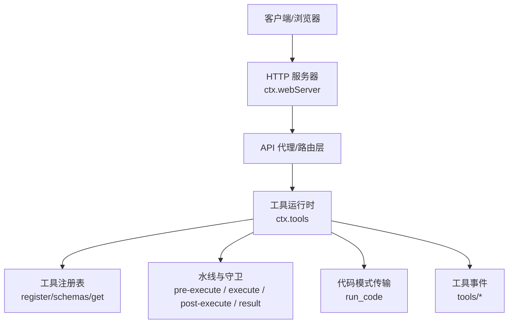
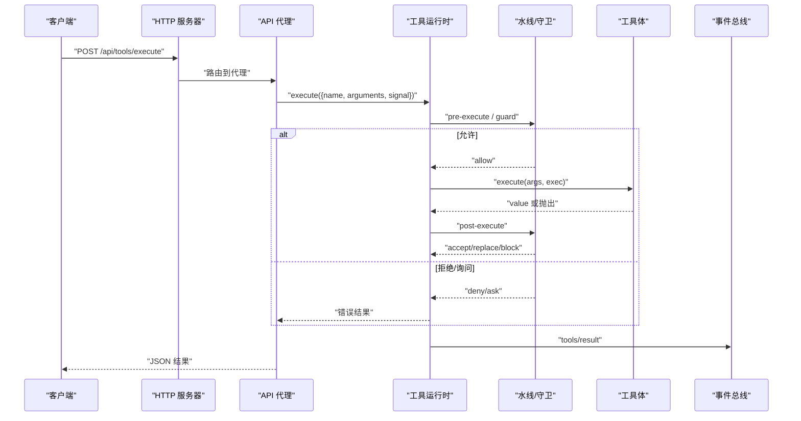
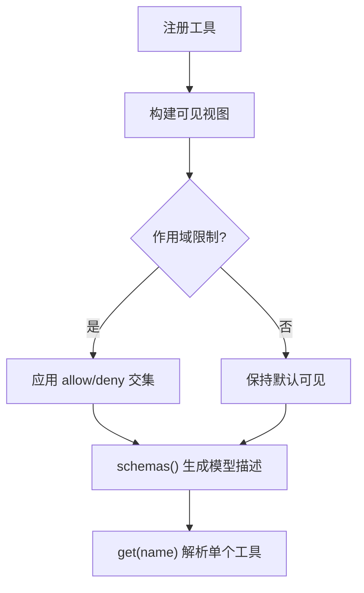
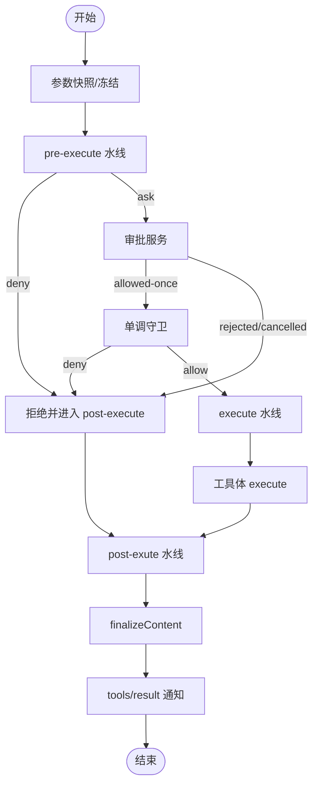
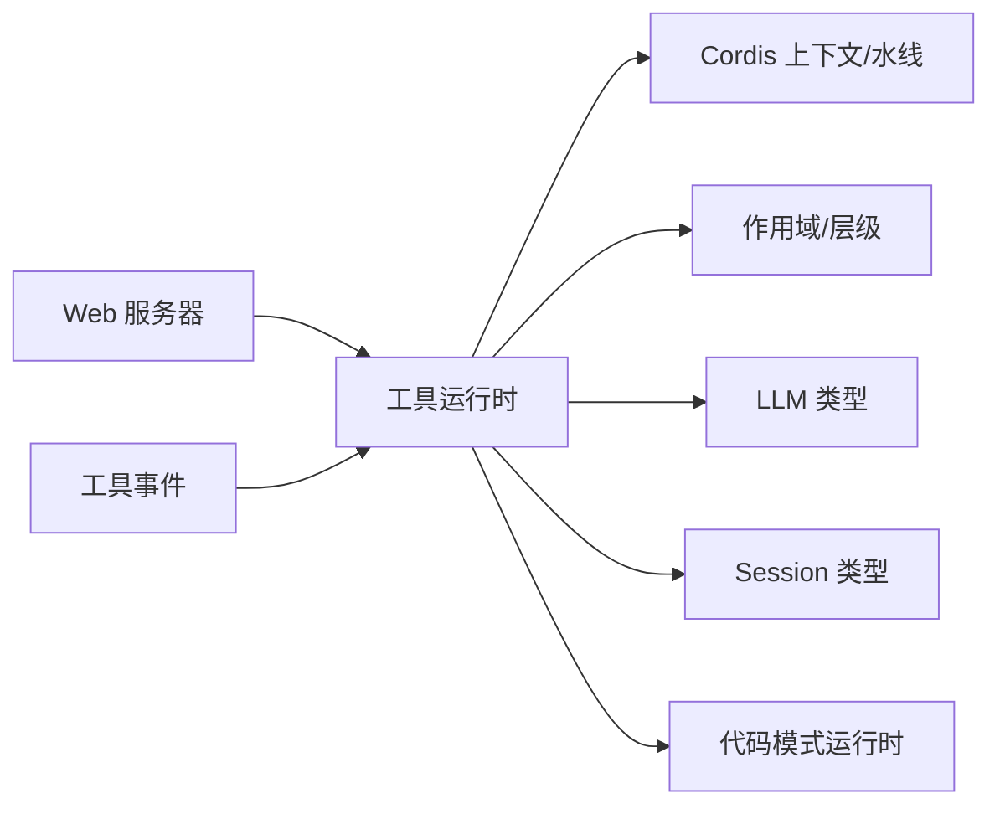

# 工具执行 API

<cite>
**本文引用的文件**
- [packages/core/tools/src/index.ts](file://packages/core/tools/src/index.ts)
- [docs/subsystems/tools.md](file://docs/subsystems/tools.md)
- [docs/tool-execution-pipeline.md](file://docs/tool-execution-pipeline.md)
- [docs/subsystems/web-server.md](file://docs/subsystems/web-server.md)
- [packages/host/apiproxy/src/api/events.ts](file://packages/host/apiproxy/src/api/events.ts)
- [packages/host/apiproxy/src/api/agent-presets.ts](file://packages/host/apiproxy/src/api/agent-presets.ts)
</cite>

## 目录
1. [简介](#简介)
2. [项目结构](#项目结构)
3. [核心组件](#核心组件)
4. [架构总览](#架构总览)
5. [详细组件分析](#详细组件分析)
6. [依赖分析](#依赖分析)
7. [性能考虑](#性能考虑)
8. [故障排查指南](#故障排查指南)
9. [结论](#结论)
10. [附录](#附录)

## 简介
本文件面向“工具执行”的 RESTful 接口与内部执行管线，覆盖工具的注册、发现、执行、异步处理、参数验证、结果返回机制；说明内置工具与自定义工具的调用方式、权限检查与沙箱执行环境；提供同步与异步调用模式、错误处理与超时控制的完整示例；并解释工具链组合与批量执行优化。

## 项目结构
- 工具注册与执行管线位于 core/tools 包，提供 ToolDefinition、ToolRuntime.execute、水线（waterfall）钩子、守卫（guard）、呈现（presentCall/presentResult）等能力。
- Web 服务器提供 HTTP 路由能力，用于承载外部 REST 入口（例如 /api 桥接），由宿主插件装配具体路由。
- 事件系统通过 tools/* 事件暴露工具生命周期关键阶段，便于审计、遥测与 UI 呈现。

图表来源
- [packages/core/tools/src/index.ts:826-933](file://packages/core/tools/src/index.ts#L826-L933)
- [docs/subsystems/web-server.md:9-47](file://docs/subsystems/web-server.md#L9-L47)

章节来源
- [docs/subsystems/web-server.md:9-47](file://docs/subsystems/web-server.md#L9-L47)
- [packages/core/tools/src/index.ts:826-933](file://packages/core/tools/src/index.ts#L826-L933)

## 核心组件
- 工具定义与注册：ToolDefinition 包含 schema、execute、output 投影、可选 finalizeContent、timeoutMs、isConcurrencySafe、presentCall/presentResult。通过 ctx.tools.register 注册，支持作用域遮蔽与限制。
- 工具发现：schemas() 生成模型可见的工具描述（仅白名单字段），get(name, scope) 按作用域解析可见定义。
- 执行管线：execute(exec) 进入 pre-execute → guard → execute（around-dispatch）→ post-execute → finalizeContent → result 通知。
- 权限与沙箱：pre-execute 可 ask 审批；monotonic guards 最终拒绝；fs 写入意图在 fs/* 事件中受控；Code Mode 下仅 run_code 可直接调用。
- 异步与取消：所有阶段均遵循 AbortSignal；包装器可替换信号但不可移除；已启动工作会完成并可能返回 ABORTED。
- 结果与呈现：成功路径产出 value + content；失败路径产出 isError + error；UI 通过 presentCall/presentResult 渲染卡片。

章节来源
- [docs/subsystems/tools.md:9-96](file://docs/subsystems/tools.md#L9-L96)
- [docs/subsystems/tools.md:153-172](file://docs/subsystems/tools.md#L153-L172)
- [docs/subsystems/tools.md:170-375](file://docs/subsystems/tools.md#L170-L375)
- [packages/core/tools/src/index.ts:1459-1600](file://packages/core/tools/src/index.ts#L1459-L1600)

## 架构总览
工具执行从会话事件或外部请求触发，进入统一管线，经过策略、守卫、执行、后处理与结果观察，最终输出模型可见内容。

图表来源
- [docs/tool-execution-pipeline.md:8-60](file://docs/tool-execution-pipeline.md#L8-L60)
- [packages/core/tools/src/index.ts:1459-1600](file://packages/core/tools/src/index.ts#L1459-L1600)

## 详细组件分析

### 工具注册与发现
- 注册：ctx.tools.register(definition)，支持作用域遮蔽；重复名称或保留名失败。
- 限制：ctx.tools.restrict({ allow?, deny? }) 对全局工具进行交集过滤，不影响作用域内注册。
- 发现：schemas(scope?) 返回模型可见的工具描述数组；get(name, scope?) 解析可见定义。
- 呈现模式：presentAs(mode) 切换 agent 视角下的工具呈现（native/code/both）。

图表来源
- [docs/subsystems/tools.md:474-574](file://docs/subsystems/tools.md#L474-L574)
- [packages/core/tools/src/index.ts:946-1000](file://packages/core/tools/src/index.ts#L946-L1000)

章节来源
- [docs/subsystems/tools.md:474-574](file://docs/subsystems/tools.md#L474-L574)
- [packages/core/tools/src/index.ts:946-1000](file://packages/core/tools/src/index.ts#L946-L1000)

### 工具执行管线与异步处理
- 准备阶段：参数快照与冻结；未知/折叠模式下直接返回最终结果。
- 前置水线：tools/pre-execute 允许/拒绝/询问；缺失审批支持时询问转为拒绝。
- 守卫：monotonic guards 最终判定，只可拒绝或放行。
- 调度执行：tools/execute 水线（超时、重试、指标）包裹工具体；可替换信号但需恢复。
- 后置水线：tools/post-execute 接受/替换/阻断/附加上下文；阻断转为错误结果。
- 最终化：finalizeContent 仅做内容级不变式校验；随后 tools/result 发出冻结结果。
- 取消：贯穿各阶段；未启动即中止返回 ABORTED_BEFORE_DISPATCH；已启动返回 ABORTED。

图表来源
- [docs/tool-execution-pipeline.md:8-60](file://docs/tool-execution-pipeline.md#L8-L60)
- [packages/core/tools/src/index.ts:1459-1600](file://packages/core/tools/src/index.ts#L1459-L1600)

章节来源
- [docs/tool-execution-pipeline.md:8-60](file://docs/tool-execution-pipeline.md#L8-L60)
- [packages/core/tools/src/index.ts:1459-1600](file://packages/core/tools/src/index.ts#L1459-L1600)

### 参数验证与结果返回
- 参数验证：defineTool 将参数 schema 编译为 JSON Schema 并在执行前严格校验；不匹配抛出无效参数错误。
- 返回值约束：execute 返回的值必须满足 output.schema；否则被规范化为错误结果。
- 结果结构：成功含 value/content/meta/optional additionalContexts；失败含 isError/error/content/meta。
- 持久化：session 事件记录 tool/call 与 tool/result；value 不持久化，content/error/meta 持久化。

章节来源
- [docs/subsystems/tools.md:98-151](file://docs/subsystems/tools.md#L98-L151)
- [docs/subsystems/tools.md:327-375](file://docs/subsystems/tools.md#L327-L375)

### 权限检查与沙箱执行环境
- 权限：pre-execute 可实现访问控制；approval 服务支持一次性审批；guards 提供最终拒绝。
- 沙箱：Code Mode 下仅 run_code 可直接调用；其他工具需在程序内通过 SDK 调用。
- 文件系统：fs/write-intent 或 fs/edit-intent 事件对工具的文件写入进行意图管控。

章节来源
- [docs/subsystems/tools.md:153-172](file://docs/subsystems/tools.md#L153-L172)
- [docs/tool-execution-pipeline.md:8-60](file://docs/tool-execution-pipeline.md#L8-L60)

### 内置工具与自定义工具
- 内置工具：如 shell/bash、搜索、读取、编辑等，通过 defineTool 注册，具备 schema 与 execute。
- 自定义工具：插件通过 ctx.tools.register 注册；可使用 isConcurrencySafe 声明并行安全；使用 timeoutMs 声明超时预算。
- 代码模式传输：run_code 作为唯一可直调的传输工具，内部再分发至 SDK 声明的工具。

章节来源
- [docs/subsystems/tools.md:474-574](file://docs/subsystems/tools.md#L474-L574)
- [packages/core/tools/src/index.ts:913-933](file://packages/core/tools/src/index.ts#L913-L933)

### RESTful 接口设计建议
- 端点建议：
  - POST /api/tools/execute：提交一次工具调用（name, arguments, signal）。
  - GET /api/tools/schemas：获取当前作用域可见的工具描述（供前端展示与校验）。
  - GET /api/tools/{name}：获取单个工具元信息。
- 请求体关键字段：
  - name: string（必填）
  - arguments: unknown（需符合工具参数 schema）
  - signal: 取消令牌（由服务端管理）
- 响应体关键字段：
  - success: boolean
  - data: { value?, content[], meta? }
  - error: { message, code? }
- 认证与鉴权：由 API 代理层实现；工具侧通过 pre-execute/guard 二次校验。

注意：上述端点为基于现有能力的建议性设计，实际路由由宿主插件注册。

章节来源
- [docs/subsystems/web-server.md:9-47](file://docs/subsystems/web-server.md#L9-L47)
- [packages/core/tools/src/index.ts:1459-1600](file://packages/core/tools/src/index.ts#L1459-L1600)

### 完整调用示例（同步/异步、错误处理、超时控制）
- 同步调用模式：
  - 客户端发起一次 POST /api/tools/execute，等待单一结果。
  - 适用于短耗时、幂等的工具。
- 异步调用模式：
  - 客户端提交任务后轮询或通过 SSE/WebSocket 接收 tools/result 事件。
  - 适用于长耗时或批处理任务。
- 错误处理：
  - 参数错误：返回 INVALID_ARGS 类错误码。
  - 权限拒绝：返回 DENIED 及原因。
  - 超时：若工具声明 timeoutMs，由 around-dispatch 包装器在超时后中止并返回 ABORTED。
  - 取消：客户端发送取消信号，未启动返回 ABORTED_BEFORE_DISPATCH，已启动返回 ABORTED。
- 超时控制：
  - 工具级：timeoutMs 声明预算。
  - 调用级：AbortSignal 传递取消。
  - 网关级：HTTP 层超时保护。

章节来源
- [docs/subsystems/tools.md:53-74](file://docs/subsystems/tools.md#L53-L74)
- [packages/core/tools/src/index.ts:1517-1560](file://packages/core/tools/src/index.ts#L1517-L1560)

### 工具链组合与批量执行优化
- 组合：通过 post-execute 附加 additionalContexts，将多个工具结果串联成用户消息，驱动下一轮推理。
- 批量：
  - 并行：isConcurrencySafe=true 的工具可加入滚动池并行执行。
  - 独占：exclusive 模式形成顺序屏障，避免共享状态竞争。
  - 最大并发：maxParallelSubCalls 控制子调用上限。
- 优化建议：
  - 将读多写少的工具标记为并行安全。
  - 对 I/O 密集工具设置合理 timeoutMs。
  - 使用 post-execute 合并中间结果以减少往返。

章节来源
- [docs/subsystems/tools.md:61-74](file://docs/subsystems/tools.md#L61-L74)
- [docs/subsystems/tools.md:243-253](file://docs/subsystems/tools.md#L243-L253)
- [packages/core/tools/src/index.ts:826-832](file://packages/core/tools/src/index.ts#L826-L832)

## 依赖分析
- 工具运行时依赖：
  - Cordis 上下文与水线机制（ctx.waterfall）。
  - 作用域与层级（ScopedLayers）实现注册遮蔽与限制。
  - LLM 类型（ToolSchema、ContentBlock）与 Session 类型（JsonValue、UserMessage）。
  - 代码模式运行时（codeRuntime）以生成 SDK 提示与传输。
- 外部集成点：
  - Web 服务器提供 HTTP 路由。
  - 事件系统（tools/*）用于审计与 UI。

图表来源
- [packages/core/tools/src/index.ts:1-28](file://packages/core/tools/src/index.ts#L1-L28)
- [docs/subsystems/web-server.md:9-47](file://docs/subsystems/web-server.md#L9-L47)

章节来源
- [packages/core/tools/src/index.ts:1-28](file://packages/core/tools/src/index.ts#L1-L28)
- [docs/subsystems/web-server.md:9-47](file://docs/subsystems/web-server.md#L9-L47)

## 性能考虑
- 并行度：利用 isConcurrencySafe 与 maxParallelSubCalls 提升吞吐。
- 超时：为长耗时工具设置 timeoutMs，避免资源占用。
- 结果裁剪：post-execute 可替换大对象为摘要，减少网络与存储开销。
- 缓存：对幂等读操作引入缓存层（可在 execute 水线中实现）。
- 序列化：确保 arguments/value 可无损 JSON 序列化，避免额外转换成本。

[本节为通用指导，无需特定文件引用]

## 故障排查指南
- 常见错误：
  - UNKNOWN_TOOL：工具不可见或未注册；检查 schemas() 与作用域限制。
  - INVALID_ARGS：参数不符合 schema；核对 defineTool 的参数定义。
  - DENIED：权限拒绝；查看 pre-execute/guard 逻辑与审批服务。
  - ABORTED/ABORTED_BEFORE_DISPATCH：取消或超时；检查信号传播与工具体是否及时响应。
- 诊断手段：
  - 订阅 tools/result 获取最终冻结结果。
  - 使用 tools/code-dispatch-log 调整日志内容（代码模式子调用）。
  - 通过 web 服务器日志定位请求与路由问题。

章节来源
- [docs/subsystems/tools.md:376-405](file://docs/subsystems/tools.md#L376-L405)
- [docs/tool-execution-pipeline.md:8-60](file://docs/tool-execution-pipeline.md#L8-L60)
- [docs/subsystems/web-server.md:43-47](file://docs/subsystems/web-server.md#L43-L47)

## 结论
本 API 文档围绕工具注册、发现与执行的完整链路，提供了清晰的职责划分与扩展点。通过水线、守卫与事件机制，系统在权限、沙箱、异步与结果呈现方面具备强一致性与高可扩展性。结合并行与超时策略，可有效支撑复杂工具链的组合与批量执行。

[本节为总结，无需特定文件引用]

## 附录
- 术语：
  - 工具定义（ToolDefinition）：包含 schema、execute、output 等。
  - 水线（Waterfall）：pre-execute/execute/post-execute 的可插拔处理链。
  - 守卫（Guard）：单调的最终权限判定。
  - 呈现（Presenters）：UI 卡片渲染意图。
- 参考：
  - 工具子系统文档与执行流水线图。
  - Web 服务器路由与事件桥接。

[本节为补充信息，无需特定文件引用]