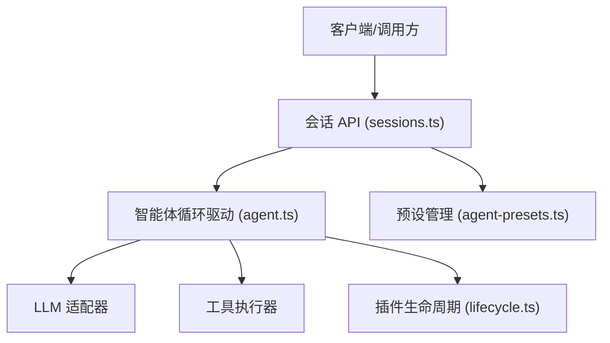
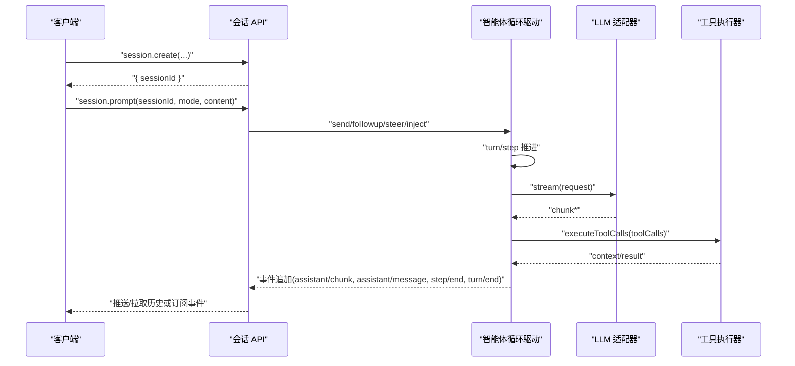
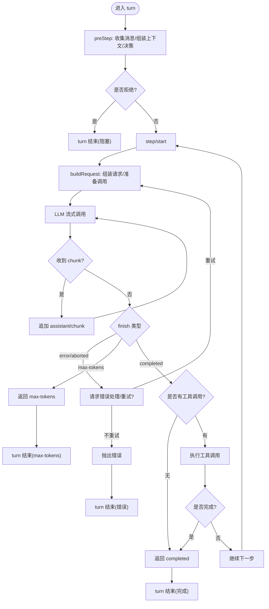
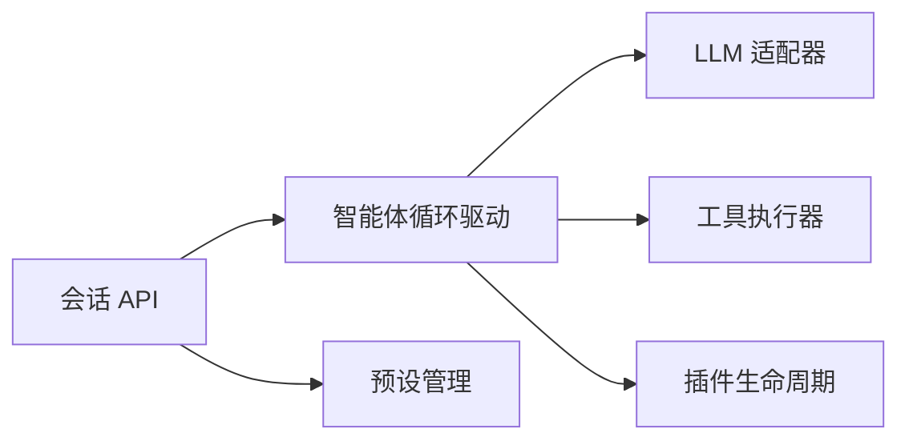

# 智能体控制 API

<cite>
**本文引用的文件**
- [packages/core/agent-loop/src/agent.ts](file://packages/core/agent-loop/src/agent.ts)
- [packages/host/apiproxy/src/api/sessions.ts](file://packages/host/apiproxy/src/api/sessions.ts)
- [packages/host/apiproxy/src/api/sessions.schema.ts](file://packages/host/apiproxy/src/api/sessions.schema.ts)
- [packages/host/apiproxy/src/api/agent-presets.ts](file://packages/host/apiproxy/src/api/agent-presets.ts)
- [packages/extensions/cordis-host-runner/src/lifecycle.ts](file://packages/extensions/cordis-host-runner/src/lifecycle.ts)
</cite>

## 目录
1. [简介](#简介)
2. [项目结构](#项目结构)
3. [核心组件](#核心组件)
4. [架构总览](#架构总览)
5. [详细组件分析](#详细组件分析)
6. [依赖关系分析](#依赖关系分析)
7. [性能考量](#性能考量)
8. [故障排查指南](#故障排查指南)
9. [结论](#结论)
10. [附录：API 端点规范与调用示例](#附录api-端点规范与调用示例)

## 简介
本文件面向需要以编程方式控制智能体的开发者，系统化说明智能体的生命周期管理（启动、停止、暂停/恢复）、配置管理（模型选择、预设）、参数传递与执行状态监控的 API 端点；并给出创建、销毁与资源清理的完整接口规范。文档同时解释作用域隔离机制与权限控制策略，并提供实际调用示例，展示如何动态加载插件、执行任务与获取执行结果。

## 项目结构
围绕“会话驱动的智能体”这一核心，系统由以下关键部分组成：
- 会话 API 层：对外暴露会话创建、消息投递、历史查询、模型选择、取消等能力。
- 智能体循环驱动：基于轮次/步骤推进的执行引擎，负责消息入队、LLM 调用、工具调用与事件落盘。
- 插件生命周期：在宿主侧安全地启动/停止插件纤维，处理注册冲突与失败回滚。
- 预设管理：列出、选择、读取、复制、删除智能体预设，用于决定会话启动时的插件组合。

图表来源
- [packages/host/apiproxy/src/api/sessions.ts:231-373](file://packages/host/apiproxy/src/api/sessions.ts#L231-L373)
- [packages/core/agent-loop/src/agent.ts:64-193](file://packages/core/agent-loop/src/agent.ts#L64-L193)
- [packages/extensions/cordis-host-runner/src/lifecycle.ts:22-45](file://packages/extensions/cordis-host-runner/src/lifecycle.ts#L22-L45)
- [packages/host/apiproxy/src/api/agent-presets.ts:45-116](file://packages/host/apiproxy/src/api/agent-presets.ts#L45-L116)

章节来源
- [packages/host/apiproxy/src/api/sessions.ts:231-373](file://packages/host/apiproxy/src/api/sessions.ts#L231-L373)
- [packages/core/agent-loop/src/agent.ts:64-193](file://packages/core/agent-loop/src/agent.ts#L64-L193)
- [packages/host/apiproxy/src/api/agent-presets.ts:45-116](file://packages/host/apiproxy/src/api/agent-presets.ts#L45-L116)
- [packages/extensions/cordis-host-runner/src/lifecycle.ts:22-45](file://packages/extensions/cordis-host-runner/src/lifecycle.ts#L22-L45)

## 核心组件
- 会话 API（sessions.ts）：定义会话列表、搜索、创建、历史、模型目录与选择、重命名、分叉、提示投递、附件读取、队列更新、取消等 RPC 方法签名与类型。
- 智能体循环驱动（agent.ts）：实现 ReactLoopAgent，维护运行阶段（空闲/维护/运行），提供 send/followup/steer/inject/cancel/runMaintenance/whenIdle 等能力，驱动 turn/step 边界，组装请求、流式输出、工具调用与错误处理。
- 插件生命周期（lifecycle.ts）：在宿主侧安全启动/停止插件纤维，捕获启动失败并做资源回收，报告缺失服务。
- 预设管理（agent-presets.ts）：提供预设列表、选择、读取、复制、打开文档、删除等能力，约束可作者与信任等级。

章节来源
- [packages/host/apiproxy/src/api/sessions.ts:231-373](file://packages/host/apiproxy/src/api/sessions.ts#L231-L373)
- [packages/core/agent-loop/src/agent.ts:64-193](file://packages/core/agent-loop/src/agent.ts#L64-L193)
- [packages/extensions/cordis-host-runner/src/lifecycle.ts:22-45](file://packages/extensions/cordis-host-runner/src/lifecycle.ts#L22-L45)
- [packages/host/apiproxy/src/api/agent-presets.ts:45-116](file://packages/host/apiproxy/src/api/agent-presets.ts#L45-L116)

## 架构总览
下图展示了从客户端到智能体执行的端到端流程，包括会话创建、消息投递、轮次/步骤推进、LLM 调用、工具执行与事件落盘。

图表来源
- [packages/host/apiproxy/src/api/sessions.ts:246-373](file://packages/host/apiproxy/src/api/sessions.ts#L246-L373)
- [packages/core/agent-loop/src/agent.ts:245-401](file://packages/core/agent-loop/src/agent.ts#L245-L401)

## 详细组件分析

### 智能体循环驱动（ReactLoopAgent）
- 状态机：维护 idle/maintenance/running 三态，通过 setPhase 发布状态变更事件。
- 输入与唤醒：send/followup/steer/inject 将消息插入收件箱，必要时唤醒驱动；支持在已中止活动后仍开启下一轮。
- 取消与维护：cancel 清空收件箱或保留待处理项，触发中止信号；runMaintenance 允许在空闲时执行维护任务。
- 轮次与步骤：turn 打开一轮，preStep 组装上下文与决策，step 构建请求、流式消费、工具调用与结束原因判定（completed/max-tokens/error/aborted）。
- 请求构建：buildRequest 合并持久化头、可选推理强度与最大 token，经 llm.prepareCall 适配默认值，记录 header/context 变化。

图表来源
- [packages/core/agent-loop/src/agent.ts:245-401](file://packages/core/agent-loop/src/agent.ts#L245-L401)

章节来源
- [packages/core/agent-loop/src/agent.ts:64-193](file://packages/core/agent-loop/src/agent.ts#L64-L193)
- [packages/core/agent-loop/src/agent.ts:245-401](file://packages/core/agent-loop/src/agent.ts#L245-L401)

### 会话 API（sessions.ts）
- 列表与搜索：list/search 提供会话元数据与内容检索。
- 创建与会话属性：create 支持 workspaceId/cwd/sessionId/agentPreset，幂等创建与冲突处理。
- 历史与投影：history 分页读取事件，尾部携带投影基线。
- 模型目录与选择：models/selectModel 获取可用模型组与精确选择。
- 重命名与分叉：rename/fork 修改标题与派生子会话。
- 提示投递：prompt 支持 queue/steer 模式，文本与图片内容，命令路由。
- 附件读取：attachment 校验会话日志引用后返回图片数据。
- 队列更新：updateQueue 编辑/移除/严格引导待处理项。
- 取消：cancel 终止当前活跃轮次，保留待处理项按 FIFO 恢复。

章节来源
- [packages/host/apiproxy/src/api/sessions.ts:231-373](file://packages/host/apiproxy/src/api/sessions.ts#L231-L373)
- [packages/host/apiproxy/src/api/sessions.schema.ts:101-353](file://packages/host/apiproxy/src/api/sessions.schema.ts#L101-L353)

### 插件生命周期（lifecycle.ts）
- startHostHalf：在宿主 fiber 组中启动受保护的插件纤维，捕获启动失败并释放资源，避免残留未挂载的失败纤维。
- missingServices：检测尚未就绪的服务依赖，便于诊断挂起状态。

章节来源
- [packages/extensions/cordis-host-runner/src/lifecycle.ts:22-57](file://packages/extensions/cordis-host-runner/src/lifecycle.ts#L22-L57)

### 预设管理（agent-presets.ts）
- list：列出部署提供的预设及其信任等级、是否默认、是否可作者、是否可打开文档。
- select：在会话空白期切换预设，锁定后不可更改。
- read/copy/openDocument/remove：读取、复制、打开本地目录编辑、删除用户级预设。

章节来源
- [packages/host/apiproxy/src/api/agent-presets.ts:45-116](file://packages/host/apiproxy/src/api/agent-presets.ts#L45-L116)

## 依赖关系分析
- 会话 API 依赖智能体循环驱动进行消息投递与执行推进。
- 智能体循环驱动依赖 LLM 适配器与工具执行器，并通过事件追加到会话日志。
- 插件生命周期为宿主侧对 Cordis 插件的安全封装，确保失败可回滚。
- 预设管理影响会话创建时的插件组合，进而影响后续工具与能力。

图表来源
- [packages/host/apiproxy/src/api/sessions.ts:231-373](file://packages/host/apiproxy/src/api/sessions.ts#L231-L373)
- [packages/core/agent-loop/src/agent.ts:64-193](file://packages/core/agent-loop/src/agent.ts#L64-L193)
- [packages/extensions/cordis-host-runner/src/lifecycle.ts:22-45](file://packages/extensions/cordis-host-runner/src/lifecycle.ts#L22-L45)
- [packages/host/apiproxy/src/api/agent-presets.ts:45-116](file://packages/host/apiproxy/src/api/agent-presets.ts#L45-L116)

章节来源
- [packages/host/apiproxy/src/api/sessions.ts:231-373](file://packages/host/apiproxy/src/api/sessions.ts#L231-L373)
- [packages/core/agent-loop/src/agent.ts:64-193](file://packages/core/agent-loop/src/agent.ts#L64-L193)
- [packages/extensions/cordis-host-runner/src/lifecycle.ts:22-45](file://packages/extensions/cordis-host-runner/src/lifecycle.ts#L22-L45)
- [packages/host/apiproxy/src/api/agent-presets.ts:45-116](file://packages/host/apiproxy/src/api/agent-presets.ts#L45-L116)

## 性能考量
- 流式响应：LLM 调用采用流式传输，逐步追加 assistant/chunk，降低首字节延迟。
- 轮次/步骤边界：每步追加 step/start/end，便于分页与回放。
- 请求头缓存：首次记录 request/header，后续仅在变化时追加，减少冗余事件。
- 工具调用批处理：一次性收集 tool-call 并批量执行，减少往返。
- 投影基线：历史尾部携带投影块，客户端可直接复用最新视图，避免重复计算。

[本节为通用性能建议，无需特定文件来源]

## 故障排查指南
- 启动冲突：当动态包替换时可能出现“已注册”冲突，需先停止旧版本再启动新版本。
- 服务缺失：使用 missingServices 检查尚未就绪的服务，定位挂起的插件。
- 请求错误：LLM 请求错误会触发 agent/request-error 水闸，支持重试策略；否则抛出结构化错误。
- 取消与恢复：cancel 会中止当前活动，但保留收件箱中的待处理项，等待下次唤醒按 FIFO 恢复。
- 预设锁定：会话一旦开始对话，预设不可切换，尝试切换将返回锁定错误。

章节来源
- [packages/extensions/cordis-host-runner/src/lifecycle.ts:22-45](file://packages/extensions/cordis-host-runner/src/lifecycle.ts#L22-L45)
- [packages/core/agent-loop/src/agent.ts:332-401](file://packages/core/agent-loop/src/agent.ts#L332-L401)
- [packages/host/apiproxy/src/api/agent-presets.ts:63-72](file://packages/host/apiproxy/src/api/agent-presets.ts#L63-L72)

## 结论
本 API 体系围绕“会话驱动的智能体”提供了完整的生命周期管理能力：通过会话 API 创建与管理会话，借助智能体循环驱动推进轮次/步骤，结合预设管理与插件生命周期实现动态能力扩展。配合流式响应与投影基线，兼顾实时性与性能。权限与作用域通过宿主侧保护与预设信任等级加以控制，确保安全性与可审计性。

[本节为总结性内容，无需特定文件来源]

## 附录：API 端点规范与调用示例

### 会话 API 端点一览
- session.list：列出会话（updatedAt 降序）。
- session.search：跨会话内容检索（限制条数与片段长度）。
- session.create：创建会话（支持 workspaceId/cwd/sessionId/agentPreset）。
- session.history：分页读取历史事件（尾部携带投影）。
- session.models：获取会话可用的模型目录快照。
- session.selectModel：选择精确模型与推理强度。
- session.rename：重命名会话（规范化标题）。
- session.fork：从已完成轮次前缀派生子会话。
- session.prompt：投递消息（queue/steer），支持文本与图片。
- session.attachment：读取会话日志引用的图片数据。
- session.updateQueue：编辑/移除/严格引导待处理项。
- session.cancel：终止当前活跃轮次。

章节来源
- [packages/host/apiproxy/src/api/sessions.ts:231-373](file://packages/host/apiproxy/src/api/sessions.ts#L231-L373)
- [packages/host/apiproxy/src/api/sessions.schema.ts:101-353](file://packages/host/apiproxy/src/api/sessions.schema.ts#L101-L353)

### 预设管理端点一览
- agentPresets.list：列出预设（含信任等级、是否默认、是否可作者、是否可打开文档）。
- agentPresets.select：在空白会话切换预设。
- agentPresets.read：只读读取预设组成文本。
- agentPresets.copy：复制预设为用户级。
- agentPresets.openDocument：打开本地目录编辑（仅用户级）。
- agentPresets.remove：删除用户级预设。

章节来源
- [packages/host/apiproxy/src/api/agent-presets.ts:45-116](file://packages/host/apiproxy/src/api/agent-presets.ts#L45-L116)

### 调用示例（描述性）
- 创建会话并设置预设：
  - 调用 session.create，传入 workspaceId 或 cwd，以及 agentPreset 名称。
  - 成功后获得 sessionId，可用于后续操作。
- 投递消息并推进执行：
  - 调用 session.prompt，mode 为 queue 或 steer，content 包含文本或图片。
  - 服务端将消息入队并唤醒智能体循环驱动，逐步推进轮次/步骤。
- 获取执行结果：
  - 通过 session.history 分页读取事件，关注 assistant/chunk 与 assistant/message。
  - 尾部页面携带投影基线，可直接渲染工具卡片与结果。
- 动态加载插件：
  - 在宿主侧通过 startHostHalf 启动插件纤维，捕获启动失败并释放资源。
  - 若存在服务缺失，使用 missingServices 诊断并补齐依赖。
- 停止与恢复：
  - 调用 session.cancel 中止当前轮次，收件箱中的待处理项将在下次唤醒时按 FIFO 恢复。
  - 如需维护任务，可在空闲时使用 runMaintenance 执行自定义作业。

[本节为概念性示例，不直接映射具体代码行]

### 作用域隔离与权限控制
- 作用域隔离：
  - 智能体循环驱动为每个会话实例维护独立 scope 与 ctx，隔离运行时上下文。
  - 插件在宿主 fiber 组内启动，失败时自动释放，避免污染其他会话。
- 权限控制：
  - 预设 trust 区分系统级与用户级，用户级预设具备与所命名插件相同的权限。
  - 预设 authorable 与 hasDocument 控制是否允许写入与打开本地目录编辑。
  - 会话子代理在 busy 状态下拒绝某些操作（如 models 查询），防止并发冲突。

章节来源
- [packages/core/agent-loop/src/agent.ts:64-97](file://packages/core/agent-loop/src/agent.ts#L64-L97)
- [packages/extensions/cordis-host-runner/src/lifecycle.ts:22-45](file://packages/extensions/cordis-host-runner/src/lifecycle.ts#L22-L45)
- [packages/host/apiproxy/src/api/agent-presets.ts:45-116](file://packages/host/apiproxy/src/api/agent-presets.ts#L45-L116)