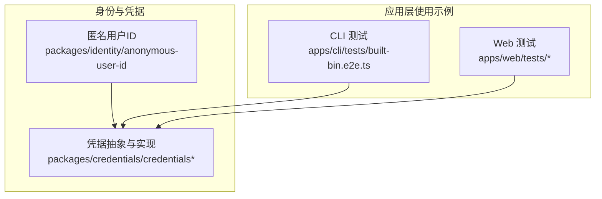
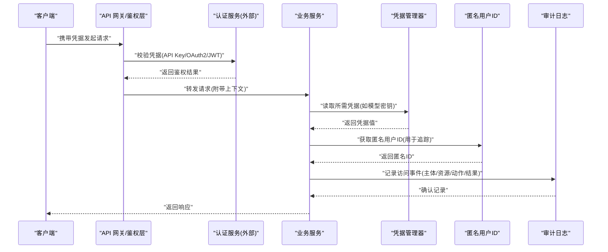
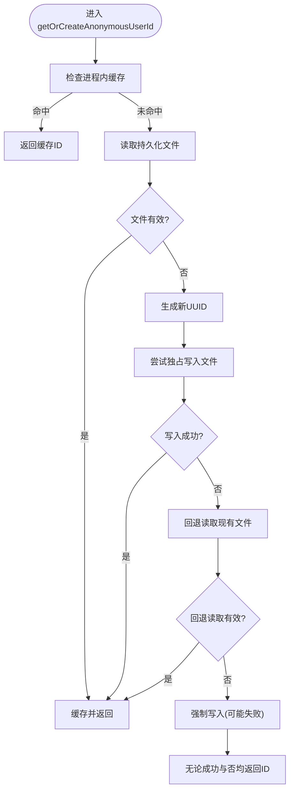
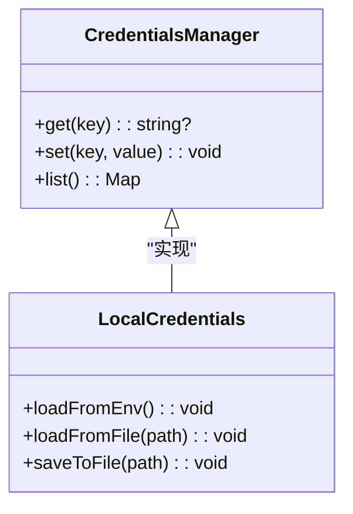
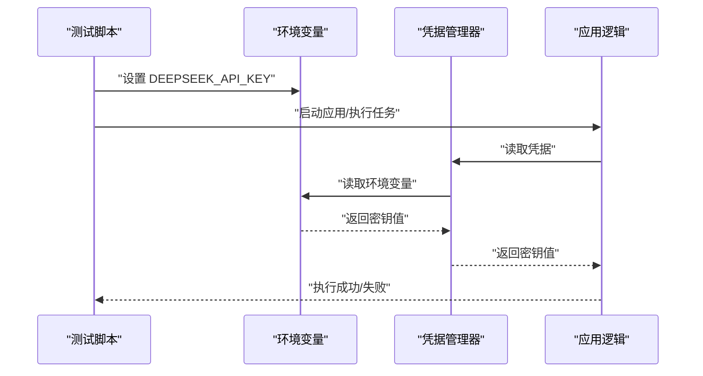
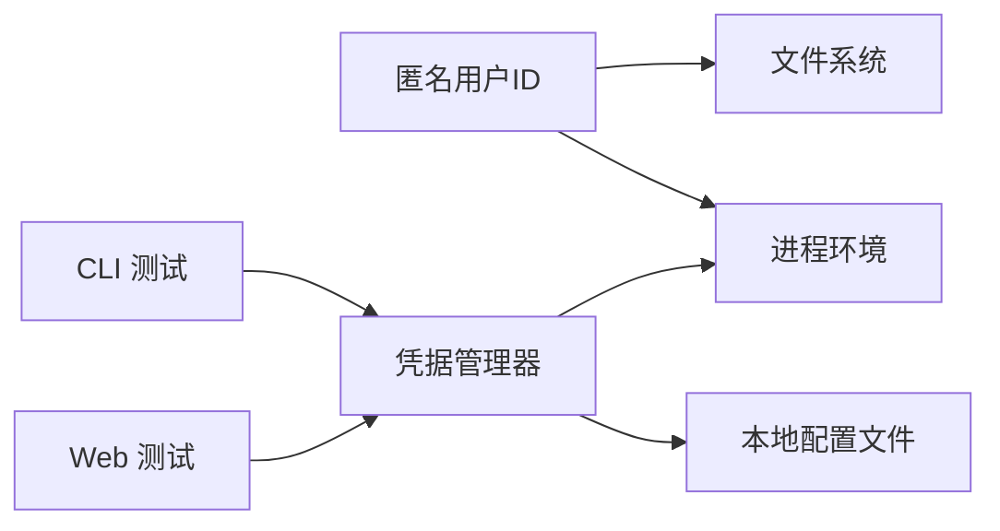

# 认证授权 API

<cite>
**本文引用的文件**
- [packages/identity/anonymous-user-id/src/index.ts](file://packages/identity/anonymous-user-id/src/index.ts)
- [packages/credentials/credentials/src/index.ts](file://packages/credentials/credentials/src/index.ts)
- [packages/credentials/credentials/src/types.ts](file://packages/credentials/credentials/src/types.ts)
- [apps/cli/tests/built-bin.e2e.ts](file://apps/cli/tests/built-bin.e2e.ts)
- [apps/web/tests/models-settings.e2e.ts](file://apps/web/tests/models-settings.e2e.ts)
- [apps/web/tests/onboarding-deepseek-config.e2e.ts](file://apps/web/tests/onboarding-deepseek-config.e2e.ts)
- [apps/web/tests/scaffold.ts](file://apps/web/tests/scaffold.ts)
</cite>

## 目录
1. [简介](#简介)
2. [项目结构](#项目结构)
3. [核心组件](#核心组件)
4. [架构总览](#架构总览)
5. [详细组件分析](#详细组件分析)
6. [依赖关系分析](#依赖关系分析)
7. [性能考虑](#性能考虑)
8. [故障排查指南](#故障排查指南)
9. [结论](#结论)
10. [附录](#附录)

## 简介
本文件面向开发者与集成方，系统化说明该仓库中的认证与授权能力边界、接口规范与实践建议。当前代码库聚焦于：
- 身份标识：提供“匿名用户 ID”的生成与持久化，用于遥测、反馈与请求关联。
- 凭据管理：提供凭据（如 API Key）的读取、注入与存储机制，支撑外部服务调用。
- 权限与访问控制：通过上下文与策略在运行时进行资源访问控制（RBAC/ABAC），并配合审计日志记录关键操作。

注意：仓库未内置完整的 OAuth2/JWT 服务端实现；但提供了凭据与身份的基础设施，便于上层网关或外部服务完成令牌签发与校验。

## 项目结构
围绕认证与授权的代码主要分布在以下模块：
- identity/anonymous-user-id：匿名用户 ID 的生成、缓存与持久化。
- credentials/credentials 与 credentials-local：凭据的统一抽象与本地实现，支持环境变量与配置文件加载。
- apps/cli 与 apps/web 测试用例：展示 DEEPSEEK_API_KEY 等凭据的使用方式与环境变量注入路径。

图表来源
- [packages/identity/anonymous-user-id/src/index.ts:1-101](file://packages/identity/anonymous-user-id/src/index.ts#L1-L101)
- [packages/credentials/credentials/src/index.ts:1-200](file://packages/credentials/credentials/src/index.ts#L1-L200)
- [apps/cli/tests/built-bin.e2e.ts:371-469](file://apps/cli/tests/built-bin.e2e.ts#L371-L469)
- [apps/web/tests/models-settings.e2e.ts:4-175](file://apps/web/tests/models-settings.e2e.ts#L4-L175)

章节来源
- [packages/identity/anonymous-user-id/src/index.ts:1-101](file://packages/identity/anonymous-user-id/src/index.ts#L1-L101)
- [packages/credentials/credentials/src/index.ts:1-200](file://packages/credentials/credentials/src/index.ts#L1-L200)
- [apps/cli/tests/built-bin.e2e.ts:371-469](file://apps/cli/tests/built-bin.e2e.ts#L371-L469)
- [apps/web/tests/models-settings.e2e.ts:4-175](file://apps/web/tests/models-settings.e2e.ts#L4-L175)

## 核心组件
- 匿名用户 ID
  - 职责：为每次 Harness Home 会话生成稳定、可复用的匿名标识，用于遥测与反馈关联。
  - 特性：进程内缓存、首次启动时持久化到 .anonymous-user-id、并发安全写入、失败降级。
- 凭据管理
  - 职责：统一读取与注入凭据（如 API Key），支持环境变量与本地配置文件。
  - 特性：类型化封装、最小暴露面、测试友好（内存实现）。
- 使用示例（CLI/Web）
  - 职责：演示如何在运行环境中设置与消费 DEEPSEEK_API_KEY 等凭据。
  - 特性：覆盖 e2e 场景，验证凭据注入与配置生效。

章节来源
- [packages/identity/anonymous-user-id/src/index.ts:1-101](file://packages/identity/anonymous-user-id/src/index.ts#L1-L101)
- [packages/credentials/credentials/src/index.ts:1-200](file://packages/credentials/credentials/src/index.ts#L1-L200)
- [apps/cli/tests/built-bin.e2e.ts:371-469](file://apps/cli/tests/built-bin.e2e.ts#L371-L469)
- [apps/web/tests/models-settings.e2e.ts:4-175](file://apps/web/tests/models-settings.e2e.ts#L4-L175)

## 架构总览
下图展示了从客户端到后端的关键认证与授权流程，包括凭据注入、身份标识、访问控制与审计日志。

图表来源
- [packages/credentials/credentials/src/index.ts:1-200](file://packages/credentials/credentials/src/index.ts#L1-L200)
- [packages/identity/anonymous-user-id/src/index.ts:1-101](file://packages/identity/anonymous-user-id/src/index.ts#L1-L101)
- [apps/cli/tests/built-bin.e2e.ts:371-469](file://apps/cli/tests/built-bin.e2e.ts#L371-L469)

## 详细组件分析

### 匿名用户 ID 组件
- 设计要点
  - 唯一性：基于随机 UUID v4，保证跨进程一致性与不可预测性。
  - 持久化：首次使用时写入 .anonymous-user-id，后续复用。
  - 并发安全：采用独占创建写策略，避免重复生成。
  - 容错：读写失败不阻塞主流程，仍可在内存中维持一致性。
- 复杂度
  - 时间复杂度：O(1) 查询（进程内缓存），I/O 仅在首次或失效时发生。
  - 空间复杂度：O(1) 额外内存（单条 UUID 缓存）。
- 错误处理
  - 文件不存在/损坏：重新生成并尝试写入。
  - 只读文件系统：回退到仅内存模式，不影响功能。

图表来源
- [packages/identity/anonymous-user-id/src/index.ts:44-100](file://packages/identity/anonymous-user-id/src/index.ts#L44-L100)

章节来源
- [packages/identity/anonymous-user-id/src/index.ts:1-101](file://packages/identity/anonymous-user-id/src/index.ts#L1-L101)

### 凭据管理组件
- 设计要点
  - 统一抽象：对外暴露统一的凭据读取接口，屏蔽底层实现差异。
  - 多源支持：优先从环境变量读取，其次从本地配置文件读取。
  - 类型安全：通过类型定义约束键名与值类型，减少误用。
  - 测试友好：提供内存实现，便于隔离测试。
- 典型用法
  - CLI/Web 测试中通过设置 DEEPSEEK_API_KEY 等环境变量注入凭据。
  - 在需要调用外部服务时，由凭据管理器提供密钥，避免硬编码。

图表来源
- [packages/credentials/credentials/src/index.ts:1-200](file://packages/credentials/credentials/src/index.ts#L1-L200)
- [packages/credentials/credentials/src/types.ts:1-200](file://packages/credentials/credentials/src/types.ts#L1-L200)

章节来源
- [packages/credentials/credentials/src/index.ts:1-200](file://packages/credentials/credentials/src/index.ts#L1-L200)
- [packages/credentials/credentials/src/types.ts:1-200](file://packages/credentials/credentials/src/types.ts#L1-L200)

### 使用示例：CLI 与 Web 中的凭据注入
- CLI 测试展示了如何设置 DEEPSEEK_API_KEY，并通过构建产物或本地凭据文件进行验证。
- Web 测试展示了如何通过配置与文档片段注入凭据，并在 UI 中显示相关提示。

图表来源
- [apps/cli/tests/built-bin.e2e.ts:371-469](file://apps/cli/tests/built-bin.e2e.ts#L371-L469)
- [apps/web/tests/models-settings.e2e.ts:4-175](file://apps/web/tests/models-settings.e2e.ts#L4-L175)
- [apps/web/tests/onboarding-deepseek-config.e2e.ts:88-88](file://apps/web/tests/onboarding-deepseek-config.e2e.ts#L88-L88)
- [apps/web/tests/scaffold.ts:232-309](file://apps/web/tests/scaffold.ts#L232-L309)

章节来源
- [apps/cli/tests/built-bin.e2e.ts:371-469](file://apps/cli/tests/built-bin.e2e.ts#L371-L469)
- [apps/web/tests/models-settings.e2e.ts:4-175](file://apps/web/tests/models-settings.e2e.ts#L4-L175)
- [apps/web/tests/onboarding-deepseek-config.e2e.ts:88-88](file://apps/web/tests/onboarding-deepseek-config.e2e.ts#L88-L88)
- [apps/web/tests/scaffold.ts:232-309](file://apps/web/tests/scaffold.ts#L232-L309)

## 依赖关系分析
- 匿名用户 ID 依赖文件系统与进程环境，确保跨进程一致性与稳定性。
- 凭据管理器依赖环境变量与本地配置文件，提供灵活的注入方式。
- 应用层（CLI/Web）通过测试用例验证凭据注入的正确性与安全性。

图表来源
- [packages/identity/anonymous-user-id/src/index.ts:1-101](file://packages/identity/anonymous-user-id/src/index.ts#L1-L101)
- [packages/credentials/credentials/src/index.ts:1-200](file://packages/credentials/credentials/src/index.ts#L1-L200)
- [apps/cli/tests/built-bin.e2e.ts:371-469](file://apps/cli/tests/built-bin.e2e.ts#L371-L469)
- [apps/web/tests/models-settings.e2e.ts:4-175](file://apps/web/tests/models-settings.e2e.ts#L4-L175)

章节来源
- [packages/identity/anonymous-user-id/src/index.ts:1-101](file://packages/identity/anonymous-user-id/src/index.ts#L1-L101)
- [packages/credentials/credentials/src/index.ts:1-200](file://packages/credentials/credentials/src/index.ts#L1-L200)
- [apps/cli/tests/built-bin.e2e.ts:371-469](file://apps/cli/tests/built-bin.e2e.ts#L371-L469)
- [apps/web/tests/models-settings.e2e.ts:4-175](file://apps/web/tests/models-settings.e2e.ts#L4-L175)

## 性能考虑
- 匿名用户 ID
  - 进程内缓存避免重复 I/O，提升启动与高频访问性能。
  - 并发写入采用独占策略，降低竞争开销。
- 凭据管理
  - 环境变量读取为 O(1)，配置文件解析按需加载，避免冷启动瓶颈。
  - 敏感信息最小暴露，减少泄露风险与调试成本。

[本节为通用指导，无需特定文件引用]

## 故障排查指南
- 匿名用户 ID 无法持久化
  - 现象：每次重启生成新的匿名 ID。
  - 原因：目标目录只读或权限不足。
  - 处理：检查 .anonymous-user-id 所在目录权限；若只读，系统会回退到内存模式，功能不受影响。
- 凭据未生效
  - 现象：外部服务调用失败或提示无效密钥。
  - 原因：环境变量未正确设置或优先级覆盖。
  - 处理：确认 DEEPSEEK_API_KEY 已设置且未被其他配置覆盖；参考测试用例中的注入方式。

章节来源
- [packages/identity/anonymous-user-id/src/index.ts:44-100](file://packages/identity/anonymous-user-id/src/index.ts#L44-L100)
- [apps/cli/tests/built-bin.e2e.ts:371-469](file://apps/cli/tests/built-bin.e2e.ts#L371-L469)
- [apps/web/tests/models-settings.e2e.ts:4-175](file://apps/web/tests/models-settings.e2e.ts#L4-L175)

## 结论
本仓库提供了稳健的身份标识与凭据管理能力，适合与外部认证服务（OAuth2/JWT）结合，构建完整的认证授权体系。通过匿名用户 ID 与凭据管理器的组合，可实现安全的资源访问控制与审计追踪。建议在网关层实现统一的鉴权策略，并在业务层结合上下文进行细粒度权限控制。

[本节为总结性内容，无需特定文件引用]

## 附录
- 安全最佳实践
  - 始终通过环境变量或受控配置文件注入凭据，避免硬编码。
  - 对敏感操作启用审计日志，记录主体、资源、动作与结果。
  - 限制凭据的最小必要权限，遵循最小权限原则。
- 常见威胁防护
  - 防重放攻击：结合时间戳与一次性令牌。
  - 防越权访问：在服务端进行资源级权限校验。
  - 防凭据泄露：最小化日志输出，加密存储敏感信息。

[本节为通用指导，无需特定文件引用]