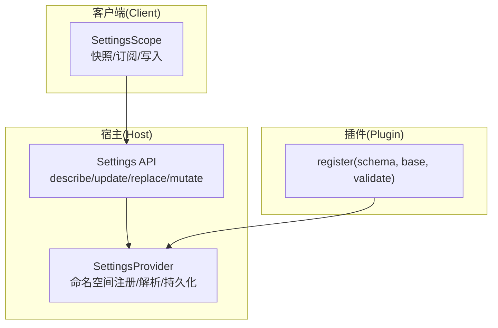
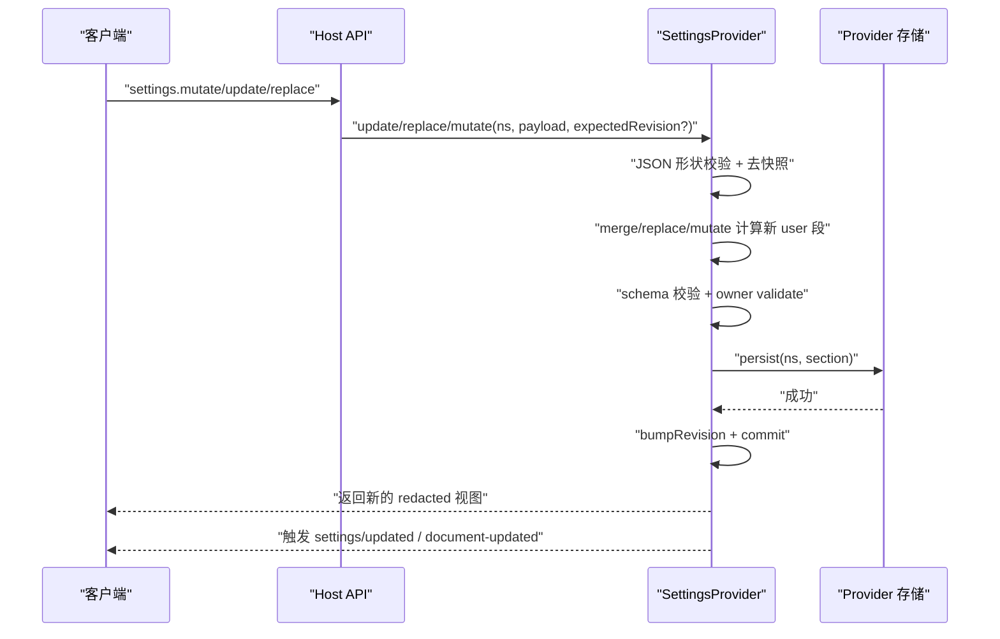
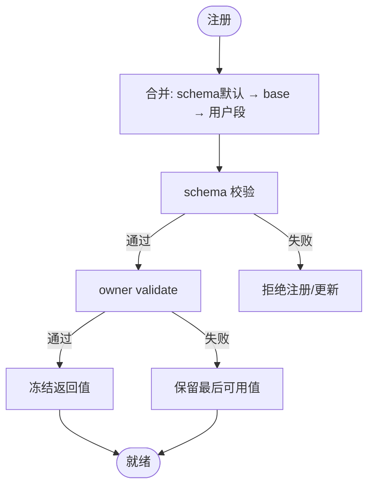
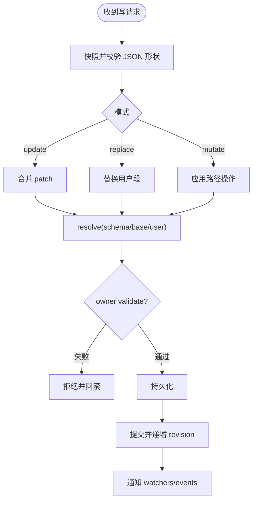
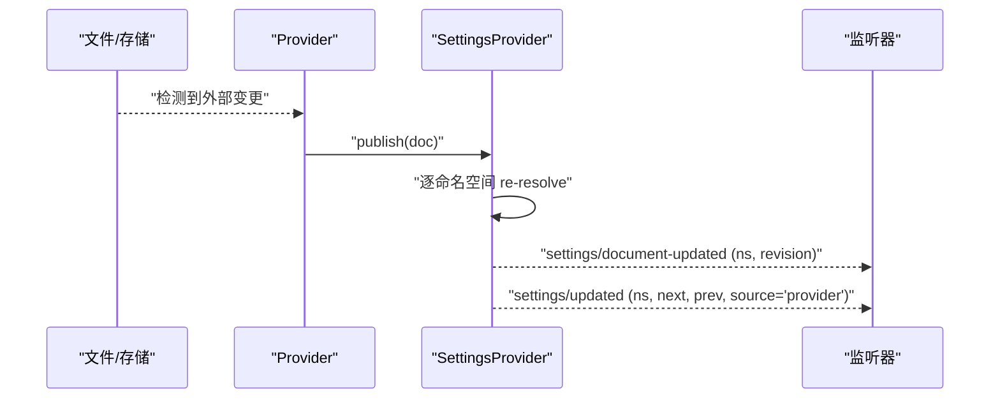
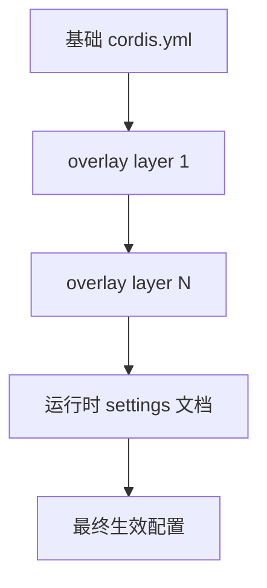
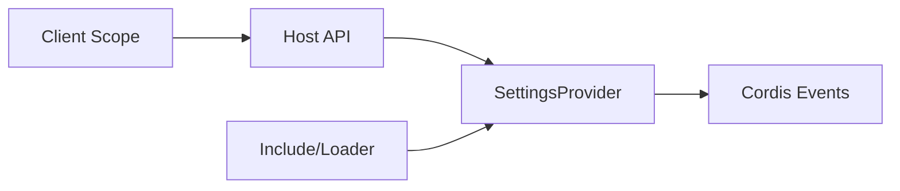

# 配置管理 API

<cite>
**本文引用的文件**
- [packages/settings/settings/src/index.ts](file://packages/settings/settings/src/index.ts)
- [packages/host/apiproxy/src/api/settings.ts](file://packages/host/apiproxy/src/api/settings.ts)
- [packages/host/apiproxy/src/api/settings.schema.ts](file://packages/host/apiproxy/src/api/settings.schema.ts)
- [packages/client/runtime/src/client/contract/settings-scope.ts](file://packages/client/runtime/src/client/contract/settings-scope.ts)
- [docs/subsystems/settings.md](file://docs/subsystems/settings.md)
- [packages/boot/app-boot/tests/config-reload.spec.ts](file://packages/boot/app-boot/tests/config-reload.spec.ts)
- [packages/boot/app-boot/tests/config-dump.spec.ts](file://packages/boot/app-boot/tests/config-dump.spec.ts)
- [packages/settings/settings/tests/settings.spec.ts](file://packages/settings/settings/tests/settings.spec.ts)
</cite>

## 目录
1. [简介](#简介)
2. [项目结构](#项目结构)
3. [核心组件](#核心组件)
4. [架构总览](#架构总览)
5. [详细组件分析](#详细组件分析)
6. [依赖关系分析](#依赖关系分析)
7. [性能考量](#性能考量)
8. [故障排查指南](#故障排查指南)
9. [结论](#结论)
10. [附录](#附录)

## 简介
本文件系统化说明 DeepSeek Harness 的配置管理能力，覆盖系统配置、用户设置与插件配置的增删改查接口；解释配置文件的加载顺序、优先级覆盖与环境变量注入机制；给出配置验证规则、默认值处理与热重载能力；并提供实际使用示例，演示如何动态修改配置、校验有效性与管理版本。同时阐述配置的继承关系与作用域隔离，帮助读者在宿主（Host）、客户端（Client）与插件（Plugin）之间正确协作。

## 项目结构
配置体系由三层组成：
- Host 侧 Settings Provider：负责持久化存储、外部变更发布、命名空间注册与解析。
- Host 侧 API 代理：暴露 settings.describe/update/replace/mutate/openDocument 等 RPC 方法，供前端或远程调用。
- Client 侧 Scope：浏览器端对命名空间的同步快照、订阅与写操作编排。

图表来源
- [packages/settings/settings/src/index.ts:350-800](file://packages/settings/settings/src/index.ts#L350-L800)
- [packages/host/apiproxy/src/api/settings.ts:52-106](file://packages/host/apiproxy/src/api/settings.ts#L52-L106)
- [packages/client/runtime/src/client/contract/settings-scope.ts:10-82](file://packages/client/runtime/src/client/contract/settings-scope.ts#L10-L82)

章节来源
- [packages/settings/settings/src/index.ts:350-800](file://packages/settings/settings/src/index.ts#L350-L800)
- [packages/host/apiproxy/src/api/settings.ts:52-106](file://packages/host/apiproxy/src/api/settings.ts#L52-L106)
- [packages/client/runtime/src/client/contract/settings-scope.ts:10-82](file://packages/client/runtime/src/client/contract/settings-scope.ts#L10-L82)

## 核心组件
- 命名空间与注册
  - 命名空间为小写短横线格式的唯一标识，用于区分不同插件的用户配置段。
  - 通过 register(schema, options) 将 schema、base、applies、validate 绑定到当前 fiber，fiber 销毁时自动注销。
- 解析与合并
  - 最终值 = schema 默认值 → 组合层 base → 用户层 section。
  - 数组整体替换，对象递归深合并；undefined 键在 patch 中被忽略。
- 变更与事件
  - update/replace/mutate 会序列化执行，先校验再持久化，成功后提交并触发 watchers 与 events。
  - publish 用于接收外部文档变更（如文件监听），保持“最后可用值”策略。
- 描述与脱敏
  - describe({ redactSecrets: true }) 返回每个命名空间的 schema、value、base、user、secrets、revision、applies。
- 冲突控制
  - revision 是原始用户段的单调版本号；write 时可传入 expectedRevision 进行并发保护。

章节来源
- [packages/settings/settings/src/index.ts:19-129](file://packages/settings/settings/src/index.ts#L19-L129)
- [packages/settings/settings/src/index.ts:435-512](file://packages/settings/settings/src/index.ts#L435-L512)
- [packages/settings/settings/src/index.ts:534-648](file://packages/settings/settings/src/index.ts#L534-L648)
- [packages/settings/settings/src/index.ts:657-783](file://packages/settings/settings/src/index.ts#L657-L783)
- [docs/subsystems/settings.md:18-153](file://docs/subsystems/settings.md#L18-L153)

## 架构总览
下图展示一次“更新用户设置”的端到端流程：客户端发起 mutate/update/replace，Host API 校验后进入 SettingsProvider 的写队列，完成 JSON 形状校验、schema 校验、owner validate、持久化、提交与事件广播。

图表来源
- [packages/host/apiproxy/src/api/settings.ts:77-106](file://packages/host/apiproxy/src/api/settings.ts#L77-L106)
- [packages/settings/settings/src/index.ts:534-648](file://packages/settings/settings/src/index.ts#L534-L648)
- [packages/settings/settings/src/index.ts:719-783](file://packages/settings/settings/src/index.ts#L719-L783)

## 详细组件分析

### 1) 命名空间与注册（Owner 视角）
- 注册入口：ctx.settings.register(ns, schema, { base?, applies?, validate? })
- 作用域：注册绑定到调用 fiber，fiber 销毁即移除该命名空间与观察者。
- 默认值与合并：
  - 最终值按 schema 默认值 → base → 用户段合并。
  - 数组整体替换，对象递归深合并；patch 中 undefined 被忽略。
- 校验：
  - schema 校验失败直接拒绝。
  - owner validate 可表达跨字段约束；若已存在用户段不满足 validate，则保留“最后可用值”。

图表来源
- [packages/settings/settings/src/index.ts:435-470](file://packages/settings/settings/src/index.ts#L435-L470)
- [packages/settings/settings/src/index.ts:696-710](file://packages/settings/settings/src/index.ts#L696-L710)
- [packages/settings/settings/tests/settings.spec.ts:88-146](file://packages/settings/settings/tests/settings.spec.ts#L88-L146)

章节来源
- [packages/settings/settings/src/index.ts:435-470](file://packages/settings/settings/src/index.ts#L435-L470)
- [packages/settings/settings/src/index.ts:696-710](file://packages/settings/settings/src/index.ts#L696-L710)
- [packages/settings/settings/tests/settings.spec.ts:88-146](file://packages/settings/settings/tests/settings.spec.ts#L88-L146)

### 2) 写操作：update / replace / mutate
- update：以 patch 形式合并到用户段。
- replace：整段替换，未提供的键回退到 base/schema 默认值。
- mutate：基于路径的 set/unset 操作，适合持有不完整视图（如仅看到脱敏后的值）的场景。
- 并发与一致性：
  - 同一命名空间写操作串行化。
  - 支持 expectedRevision 防止陈旧写入覆盖。
- 数据完整性：
  - 输入必须为 JSON 兼容数据（禁止函数、Date、Map、BigInt、Symbol、非有限数、循环引用等）。
  - 失败不会污染后续写入队列。

图表来源
- [packages/settings/settings/src/index.ts:534-648](file://packages/settings/settings/src/index.ts#L534-L648)
- [packages/settings/settings/src/index.ts:253-305](file://packages/settings/settings/src/index.ts#L253-L305)

章节来源
- [packages/settings/settings/src/index.ts:534-648](file://packages/settings/settings/src/index.ts#L534-L648)
- [packages/settings/settings/tests/settings.spec.ts:211-306](file://packages/settings/settings/tests/settings.spec.ts#L211-L306)

### 3) 描述与脱敏：describe
- 返回每个命名空间的 schema、value、base、user、applies、revision 与 secrets。
- 通过 redactSecrets 剥离 role('secret') 字段，并在 secrets 中列出其位置与是否已设置。
- 适用于 UI 渲染表单与只读查看。

章节来源
- [packages/settings/settings/src/index.ts:479-512](file://packages/settings/settings/src/index.ts#L479-L512)
- [docs/subsystems/settings.md:96-153](file://docs/subsystems/settings.md#L96-L153)

### 4) 外部变更与热重载：publish
- 当底层存储（如文件）发生外部编辑时，Provider 调用 publish(doc) 推送新文档。
- 对每个命名空间重新解析；若某段无效，保留“最后可用值”，其他命名空间正常提交。
- 触发 settings/document-updated（raw 段变化）与 settings/updated（resolved 值变化）。

图表来源
- [packages/settings/settings/src/index.ts:657-683](file://packages/settings/settings/src/index.ts#L657-L683)
- [packages/settings/settings/src/index.ts:725-783](file://packages/settings/settings/src/index.ts#L725-L783)

章节来源
- [packages/settings/settings/src/index.ts:657-683](file://packages/settings/settings/src/index.ts#L657-L683)
- [packages/settings/settings/tests/settings.spec.ts:529-579](file://packages/settings/settings/tests/settings.spec.ts#L529-L579)

### 5) Host API：settings.* 方法
- describe：列出所有命名空间及其 schema、值、secrets、applies、revision。
- openDocument：准备本地配置文件并交由平台文本编辑器打开（仅 Host 侧能力）。
- update：合并 patch 到用户段。
- replace：整段替换。
- mutate：路径级 set/unset 操作。
- 所有写响应均返回新的 redacted 视图，便于 UI 刷新。

章节来源
- [packages/host/apiproxy/src/api/settings.ts:52-106](file://packages/host/apiproxy/src/api/settings.ts#L52-L106)
- [packages/host/apiproxy/src/api/settings.schema.ts:29-82](file://packages/host/apiproxy/src/api/settings.schema.ts#L29-L82)

### 6) 客户端 Scope：SettingsScope
- 提供 getSnapshot()、subscribe(listener)、set(field, value)、unset(field)。
- 状态包括 loading/ready/unavailable，mode 为 host/memory。
- 写操作会携带最新 revision，确保并发安全。

章节来源
- [packages/client/runtime/src/client/contract/settings-scope.ts:10-82](file://packages/client/runtime/src/client/contract/settings-scope.ts#L10-L82)

### 7) 配置加载顺序、优先级与环境变量注入
- 加载顺序（Composition）：
  - 基础配置（cordis.yml 中的 include 树）→ 各层 overlay patches（bundle/user/命令行等）→ 运行时用户层（settings 文档）。
- 优先级覆盖：
  - 同层级 patch 按声明顺序覆盖；later patch 可覆盖 earlier patch 插入的行。
- 环境变量注入：
  - 配置中可使用 !!js 表达式读取环境变量（例如 process.env.XXX），在 dump/render 时原样保留以便再次加载。
- 热重载：
  - Include 支持 refresh()，失败时回滚到上一代有效配置；成功时应用新配置。

图表来源
- [packages/boot/app-boot/tests/config-dump.spec.ts:37-87](file://packages/boot/app-boot/tests/config-dump.spec.ts#L37-L87)
- [packages/boot/app-boot/tests/config-reload.spec.ts:61-84](file://packages/boot/app-boot/tests/config-reload.spec.ts#L61-L84)
- [packages/boot/app-boot/tests/config-reload.spec.ts:282-339](file://packages/boot/app-boot/tests/config-reload.spec.ts#L282-L339)

章节来源
- [packages/boot/app-boot/tests/config-dump.spec.ts:37-87](file://packages/boot/app-boot/tests/config-dump.spec.ts#L37-L87)
- [packages/boot/app-boot/tests/config-reload.spec.ts:61-84](file://packages/boot/app-boot/tests/config-reload.spec.ts#L61-L84)
- [packages/boot/app-boot/tests/config-reload.spec.ts:282-339](file://packages/boot/app-boot/tests/config-reload.spec.ts#L282-L339)

### 8) 配置验证规则与默认值处理
- 数据类型限制：仅允许 JSON 兼容类型；函数、Date、Map、BigInt、Symbol、NaN/Infinity、undefined 数组项、循环引用等均被拒绝。
- 默认值：schema 定义 default 的值会在合并前填充。
- 自定义校验：owner validate 可在 schema 之后追加业务约束；失败时拒绝写入或保留“最后可用值”。

章节来源
- [packages/settings/settings/src/index.ts:253-305](file://packages/settings/settings/src/index.ts#L253-L305)
- [packages/settings/settings/tests/settings.spec.ts:615-645](file://packages/settings/settings/tests/settings.spec.ts#L615-L645)
- [packages/settings/settings/tests/settings.spec.ts:88-146](file://packages/settings/settings/tests/settings.spec.ts#L88-L146)

### 9) 继承关系与作用域隔离
- 继承链：schema defaults → base → user section。
- 作用域隔离：
  - 命名空间隔离不同插件的配置段。
  - 注册绑定到 fiber，fiber 销毁后命名空间消失，避免跨生命周期泄漏。
  - Loader 组（group/isolate）可为一组条目共享隔离作用域，避免服务冲突。

章节来源
- [packages/settings/settings/src/index.ts:435-470](file://packages/settings/settings/src/index.ts#L435-L470)
- [packages/boot/app-boot/tests/config-reload.spec.ts:390-431](file://packages/boot/app-boot/tests/config-reload.spec.ts#L390-L431)

### 10) 实际使用示例（步骤式）
- 动态修改配置
  - 使用 settings.mutate 对路径进行 set/unset，适合只持有脱敏视图的场景。
  - 使用 settings.update 合并 patch，适合增量更新。
  - 使用 settings.replace 整段重置，未提供的键回退到 base/schema 默认值。
- 验证配置有效性
  - 在 owner 的 validate 中实现跨字段校验；失败时拒绝写入。
  - 通过 describe 获取 schema 与 secrets，驱动 UI 表单校验。
- 管理配置版本
  - 读取 describe 中的 revision，写入时附带 expectedRevision；冲突时抛出冲突错误，提示重试。
- 热重载
  - 通过 Include.refresh() 重新加载配置；失败时回滚到上一代有效配置。

章节来源
- [packages/host/apiproxy/src/api/settings.ts:77-106](file://packages/host/apiproxy/src/api/settings.ts#L77-L106)
- [packages/settings/settings/src/index.ts:534-648](file://packages/settings/settings/src/index.ts#L534-L648)
- [packages/boot/app-boot/tests/config-reload.spec.ts:61-84](file://packages/boot/app-boot/tests/config-reload.spec.ts#L61-L84)

## 依赖关系分析
- SettingsProvider 依赖 Cordis Context 的事件与 Service 生命周期。
- Host API 依赖 SettingsProvider 的 describe/update/replace/mutate。
- Client Scope 通过 RPC 与 Host API 交互，维护本地快照与写队列。
- Boot 层的 Include/Loader 负责配置树加载、补丁叠加与热重载。

图表来源
- [packages/client/runtime/src/client/contract/settings-scope.ts:10-82](file://packages/client/runtime/src/client/contract/settings-scope.ts#L10-L82)
- [packages/host/apiproxy/src/api/settings.ts:52-106](file://packages/host/apiproxy/src/api/settings.ts#L52-L106)
- [packages/settings/settings/src/index.ts:350-800](file://packages/settings/settings/src/index.ts#L350-L800)

章节来源
- [packages/settings/settings/src/index.ts:350-800](file://packages/settings/settings/src/index.ts#L350-L800)
- [packages/host/apiproxy/src/api/settings.ts:52-106](file://packages/host/apiproxy/src/api/settings.ts#L52-L106)
- [packages/client/runtime/src/client/contract/settings-scope.ts:10-82](file://packages/client/runtime/src/client/contract/settings-scope.ts#L10-L82)

## 性能考量
- 写操作串行化：同一命名空间写操作按调用顺序排队，避免竞态。
- 深相等比较：仅在 resolved 值真正变化时才触发 watchers/events，减少不必要开销。
- 观察者串行化：每个 watcher 的回调按提交顺序串行执行，避免乱序影响。
- 快照与冻结：写入前做 JSON 形状快照，返回值深冻结，避免意外修改。

[本节为通用指导，无需特定文件来源]

## 故障排查指南
- 常见错误
  - 命名空间未注册：尝试更新未注册的 ns 会报错。
  - 只读 Provider：不可写的 Provider 拒绝更新。
  - JSON 不兼容：包含函数、Date、Map、BigInt、Symbol、NaN/Infinity、undefined 数组项、循环引用等会被拒绝。
  - 并发冲突：expectedRevision 与实际不一致时抛出冲突错误。
  - 外部编辑导致无效段：保留“最后可用值”，等待修复后恢复。
- 定位建议
  - 使用 describe 检查 schema、secrets、applies、revision。
  - 监听 settings/updated 与 settings/document-updated 观察变更来源与内容。
  - 检查 Provider 的 writable 与 documentPath 以确定是否支持本地编辑。

章节来源
- [packages/settings/settings/tests/settings.spec.ts:294-306](file://packages/settings/settings/tests/settings.spec.ts#L294-L306)
- [packages/settings/settings/tests/settings.spec.ts:615-645](file://packages/settings/settings/tests/settings.spec.ts#L615-L645)
- [packages/settings/settings/tests/settings.spec.ts:529-579](file://packages/settings/settings/tests/settings.spec.ts#L529-L579)

## 结论
本配置管理体系通过命名空间、schema、base、用户段三层合并，结合严格的 JSON 形状校验与 owner validate，提供了强一致、可观测、可热重载的配置能力。Host API 暴露了安全的读写接口，Client Scope 提供友好的本地状态与写队列。配合 Include/Loader 的热重载与补丁叠加，实现了从部署到运行时的完整配置生命周期管理。

[本节为总结性内容，无需特定文件来源]

## 附录
- 术语
  - 命名空间：插件配置段的唯一标识。
  - 用户段：存储在 Provider 文档中的用户可编辑部分。
  - 组合层 base：插件声明的组合默认值，位于用户段之下。
  - 修订号 revision：原始用户段的单调版本号，用于并发保护。
- 参考
  - 子系统文档：用户设置规范与事件语义。
  - 配置目录：插件配置声明与依赖关系。

章节来源
- [docs/subsystems/settings.md:1-153](file://docs/subsystems/settings.md#L1-L153)
- [docs/config-catalog.md:1-12](file://docs/config-catalog.md#L1-L12)