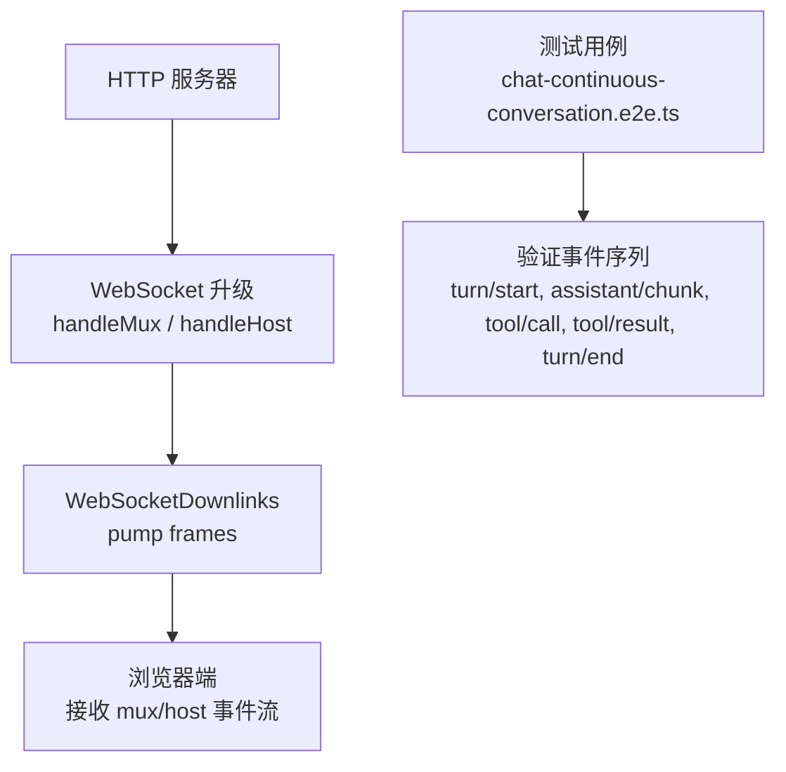
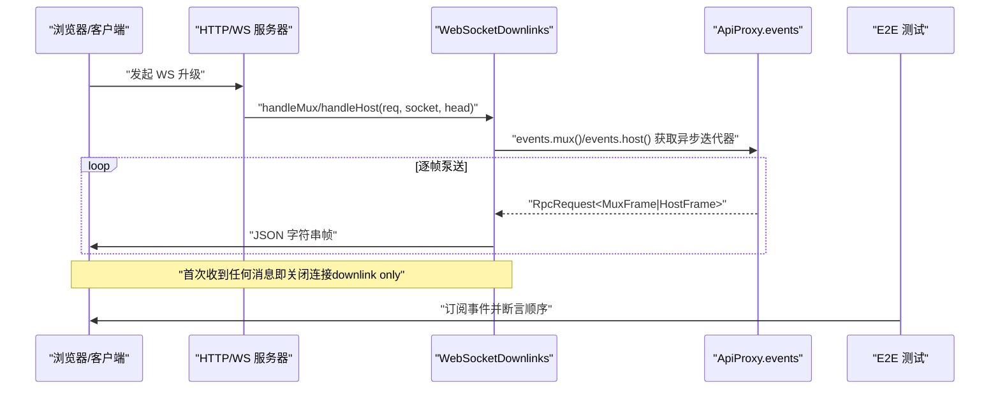
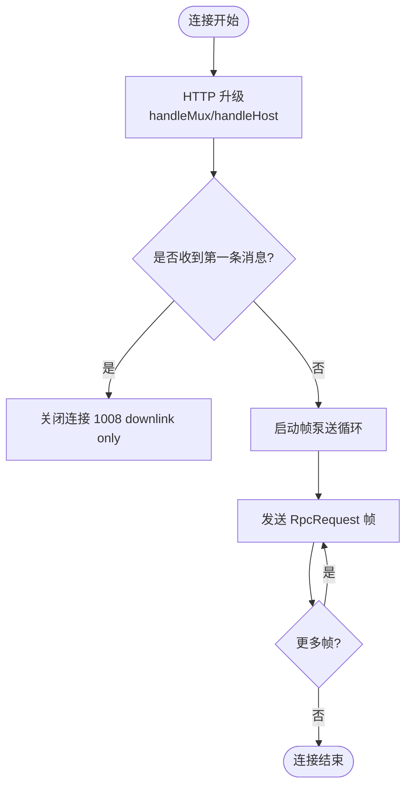
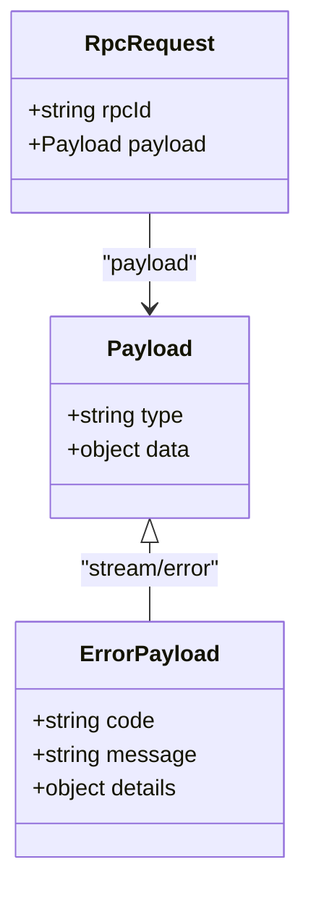
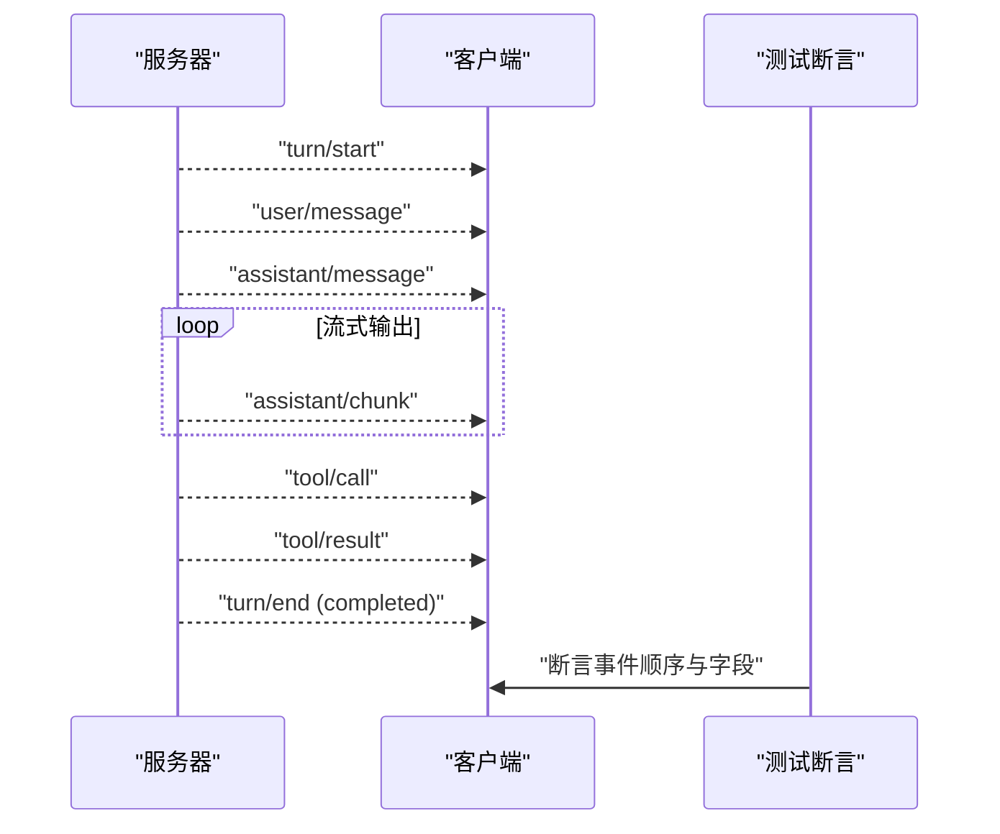
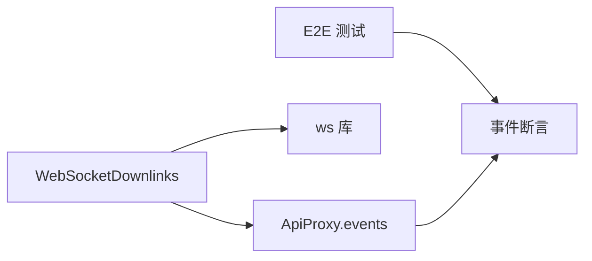

# WebSocket API

<cite>
**本文引用的文件**
- [packages/client/connection/src/websocket-downlink.ts](file://packages/client/connection/src/websocket-downlink.ts)
- [apps/web/tests/chat-continuous-conversation.e2e.ts](file://apps/web/tests/chat-continuous-conversation.e2e.ts)
- [apps/web/tests/chat-long-interactions.e2e.ts](file://apps/web/tests/chat-long-interactions.e2e.ts)
- [apps/web/tests/chat-scroll-contract.e2e.ts](file://apps/web/tests/chat-scroll-contract.e2e.ts)
</cite>

## 目录
1. [简介](#简介)
2. [项目结构](#项目结构)
3. [核心组件](#核心组件)
4. [架构总览](#架构总览)
5. [详细组件分析](#详细组件分析)
6. [依赖关系分析](#依赖关系分析)
7. [性能考虑](#性能考虑)
8. [故障排查指南](#故障排查指南)
9. [结论](#结论)
10. [附录](#附录)

## 简介
本文件为 DeepSeek Harness 的 WebSocket API 文档，聚焦于实时通信协议与交互模式。内容涵盖：
- 连接建立、消息格式、事件类型与实时交互流程
- 会话事件流、智能体状态更新、工具执行进度等实时能力
- 连接管理、重连机制与错误处理策略
- 客户端集成示例与最佳实践
- 消息序列化、压缩选项与性能优化建议
- 调试工具与监控方法

说明：当前仓库中服务端侧的 WebSocket 实现以“下行通道”为主，即服务器通过 WebSocket 向浏览器推送事件；上行（客户端到服务器）的消息走 HTTP。因此，WebSocket 用于承载两类下行流：多路复用流与宿主流。

## 项目结构
与 WebSocket 相关的核心代码位于客户端连接层，负责将服务器的两个事件流（mux 与 host）通过 WebSocket 推送到浏览器端。测试用例覆盖了会话事件流（如 turn、assistant/chunk、tool/call、tool/result 等），可用于理解事件语义与交互时序。

图表来源
- [packages/client/connection/src/websocket-downlink.ts:64-82](file://packages/client/connection/src/websocket-downlink.ts#L64-L82)
- [packages/client/connection/src/websocket-downlink.ts:118-137](file://packages/client/connection/src/websocket-downlink.ts#L118-L137)
- [apps/web/tests/chat-continuous-conversation.e2e.ts:265-335](file://apps/web/tests/chat-continuous-conversation.e2e.ts#L265-L335)

章节来源
- [packages/client/connection/src/websocket-downlink.ts:1-154](file://packages/client/connection/src/websocket-downlink.ts#L1-L154)
- [apps/web/tests/chat-continuous-conversation.e2e.ts:265-335](file://apps/web/tests/chat-continuous-conversation.e2e.ts#L265-L335)

## 核心组件
- WebSocketDownlinks：持有 WebSocketServer，负责升级请求、帧泵送、关闭清理与错误上报。
- 两种下行通道：
  - mux：多路复用事件流（例如会话内多种事件）。
  - host：宿主相关事件流（例如系统级或跨会话事件）。
- 帧封装：所有下行帧统一包装为 RPC 请求格式，包含 rpcId 与 payload.type/payload.data。
- 错误帧：当泵送过程中发生异常，会发送 stream/error 类型的错误帧。

章节来源
- [packages/client/connection/src/websocket-downlink.ts:51-97](file://packages/client/connection/src/websocket-downlink.ts#L51-L97)
- [packages/client/connection/src/websocket-downlink.ts:118-137](file://packages/client/connection/src/websocket-downlink.ts#L118-L137)

## 架构总览
下图展示了从 HTTP 升级到 WebSocket 并推送事件的完整链路，以及测试如何断言事件顺序。

图表来源
- [packages/client/connection/src/websocket-downlink.ts:64-82](file://packages/client/connection/src/websocket-downlink.ts#L64-L82)
- [packages/client/connection/src/websocket-downlink.ts:105-116](file://packages/client/connection/src/websocket-downlink.ts#L105-L116)
- [packages/client/connection/src/websocket-downlink.ts:118-137](file://packages/client/connection/src/websocket-downlink.ts#L118-L137)
- [apps/web/tests/chat-continuous-conversation.e2e.ts:265-335](file://apps/web/tests/chat-continuous-conversation.e2e.ts#L265-L335)

## 详细组件分析

### 连接建立与生命周期
- 升级入口：handleMux 与 handleHost 分别处理 mux 与 host 通道的升级。
- 安全约束：一旦连接收到任意消息，立即以 1008 码关闭，提示“downlink only”，确保上行不通过 WS。
- 资源清理：close 方法终止所有客户端连接并等待 acceptor 与泵任务结束。

图表来源
- [packages/client/connection/src/websocket-downlink.ts:64-82](file://packages/client/connection/src/websocket-downlink.ts#L64-L82)
- [packages/client/connection/src/websocket-downlink.ts:105-116](file://packages/client/connection/src/websocket-downlink.ts#L105-L116)
- [packages/client/connection/src/websocket-downlink.ts:88-97](file://packages/client/connection/src/websocket-downlink.ts#L88-L97)

章节来源
- [packages/client/connection/src/websocket-downlink.ts:64-97](file://packages/client/connection/src/websocket-downlink.ts#L64-L97)
- [packages/client/connection/src/websocket-downlink.ts:105-116](file://packages/client/connection/src/websocket-downlink.ts#L105-L116)

### 消息格式与序列化
- 传输格式：JSON 字符串。
- 帧结构：每个帧为 RpcRequest，包含：
  - rpcId：唯一标识（使用随机 UUID）。
  - payload：包含 type 与具体数据。
- 错误帧：类型为 stream/error，携带 code、message、details。

图表来源
- [packages/client/connection/src/websocket-downlink.ts:14-21](file://packages/client/connection/src/websocket-downlink.ts#L14-L21)
- [packages/client/connection/src/websocket-downlink.ts:36-44](file://packages/client/connection/src/websocket-downlink.ts#L36-L44)

章节来源
- [packages/client/connection/src/websocket-downlink.ts:14-44](file://packages/client/connection/src/websocket-downlink.ts#L14-L44)

### 事件类型与会话事件流
基于端到端测试可归纳出典型会话事件序列与含义：
- turn/start：一轮新对话开始。
- user/message：用户消息到达。
- assistant/message：助手回复开始。
- assistant/chunk：增量文本片段（流式输出）。
- tool/call：工具调用开始。
- tool/result：工具调用结果返回。
- turn/end：本轮结束，reason.kind 指示完成原因（如 completed）。

图表来源
- [apps/web/tests/chat-continuous-conversation.e2e.ts:265-335](file://apps/web/tests/chat-continuous-conversation.e2e.ts#L265-L335)

章节来源
- [apps/web/tests/chat-continuous-conversation.e2e.ts:265-335](file://apps/web/tests/chat-continuous-conversation.e2e.ts#L265-L335)

### 实时交互模式
- 流式响应：assistant/chunk 提供增量文本，适合 UI 逐步渲染。
- 工具执行：tool/call 与 tool/result 成对出现，表示工具调用的开始与完成。
- 轮次边界：turn/start 与 turn/end 标记一轮对话的开始与结束。

章节来源
- [apps/web/tests/chat-continuous-conversation.e2e.ts:265-335](file://apps/web/tests/chat-continuous-conversation.e2e.ts#L265-L335)
- [apps/web/tests/chat-long-interactions.e2e.ts:191-289](file://apps/web/tests/chat-long-interactions.e2e.ts#L191-L289)

### 连接管理与重连机制
- 单方向：WS 仅用于下行推送，首次收到消息即关闭，避免误用上行。
- 重连策略：客户端应监听 close 事件，按指数退避重试，并在重连后重新订阅所需事件流。
- 幂等性：事件可能重复，客户端需基于 turn/id 去重与合并。

章节来源
- [packages/client/connection/src/websocket-downlink.ts:105-116](file://packages/client/connection/src/websocket-downlink.ts#L105-L116)

### 错误处理策略
- 泵送异常：捕获异常并发送 stream/error 帧，随后关闭连接。
- 连接丢失：在 finally 中确保 AbortSignal 触发与 socket 关闭。
- 非法升级：拒绝未知升级请求，返回 403 Forbidden。

章节来源
- [packages/client/connection/src/websocket-downlink.ts:118-137](file://packages/client/connection/src/websocket-downlink.ts#L118-L137)
- [packages/client/connection/src/websocket-downlink.ts:144-153](file://packages/client/connection/src/websocket-downlink.ts#L144-L153)

## 依赖关系分析
WebSocketDownlinks 依赖 ApiProxy.events 提供的异步迭代器来获取事件源，并通过 ws 库进行底层传输。测试用例通过订阅事件来验证行为。

图表来源
- [packages/client/connection/src/websocket-downlink.ts:55-82](file://packages/client/connection/src/websocket-downlink.ts#L55-L82)
- [apps/web/tests/chat-continuous-conversation.e2e.ts:265-335](file://apps/web/tests/chat-continuous-conversation.e2e.ts#L265-L335)

章节来源
- [packages/client/connection/src/websocket-downlink.ts:55-82](file://packages/client/connection/src/websocket-downlink.ts#L55-L82)
- [apps/web/tests/chat-continuous-conversation.e2e.ts:265-335](file://apps/web/tests/chat-continuous-conversation.e2e.ts#L265-L335)

## 性能考虑
- 流式渲染：利用 assistant/chunk 增量更新 UI，减少首屏延迟。
- 批量处理：客户端可对短时间内的大量 chunk 进行批处理再渲染。
- 背压控制：若下游消费慢，应在客户端侧做缓冲与丢弃策略，避免内存增长。
- 压缩：可在应用层对 JSON 进行 gzip/deflate 压缩后再传输，但需注意 CPU 与延迟权衡。
- 连接复用：尽量复用单个 WS 连接，避免频繁握手开销。

[本节为通用指导，不直接分析具体文件]

## 故障排查指南
- 连接过早关闭：检查是否意外发送了上行消息；WS 为下行专用，首次收到消息即关闭。
- 事件缺失：确认客户端是否正确订阅 mux/host 流，并处理重连与去重。
- 错误帧：解析 stream/error 的 code、message、details，定位问题根因。
- 长会话稳定性：关注 turn/end 的 reason.kind，区分正常完成与异常中断。

章节来源
- [packages/client/connection/src/websocket-downlink.ts:105-116](file://packages/client/connection/src/websocket-downlink.ts#L105-L116)
- [packages/client/connection/src/websocket-downlink.ts:118-137](file://packages/client/connection/src/websocket-downlink.ts#L118-L137)
- [apps/web/tests/chat-continuous-conversation.e2e.ts:331-335](file://apps/web/tests/chat-continuous-conversation.e2e.ts#L331-L335)

## 结论
该 WebSocket API 采用“下行专用”的设计，通过 mux 与 host 两条通道稳定推送会话与宿主事件。结合流式输出与工具调用事件，可实现低延迟、高吞吐的实时交互体验。客户端应遵循连接约束、错误处理与重连策略，并利用事件模型构建健壮的实时界面。

[本节为总结，不直接分析具体文件]

## 附录

### 客户端集成步骤（示例）
- 建立连接：发起 WS 升级至指定路径。
- 订阅事件：根据业务需求选择 mux 或 host 流。
- 处理事件：
  - 组装 turn 上下文，累积 assistant/chunk。
  - 记录 tool/call 与 tool/result 的对应关系。
  - 在 turn/end 时提交本轮结果。
- 错误与重连：监听 close 与 error，按指数退避重连，恢复订阅。

[本节为概念性指引，不直接分析具体文件]

### 调试与监控
- 日志：记录每条帧的 rpcId、type、时间戳与大小，便于追踪。
- 指标：统计 TTFT、吞吐、chunk 数量、错误率、重连次数。
- 抓包：使用浏览器开发者工具或网络抓包工具观察帧内容与频率。
- 回放：基于事件序列进行回放测试，保证一致性。

[本节为通用指导，不直接分析具体文件]