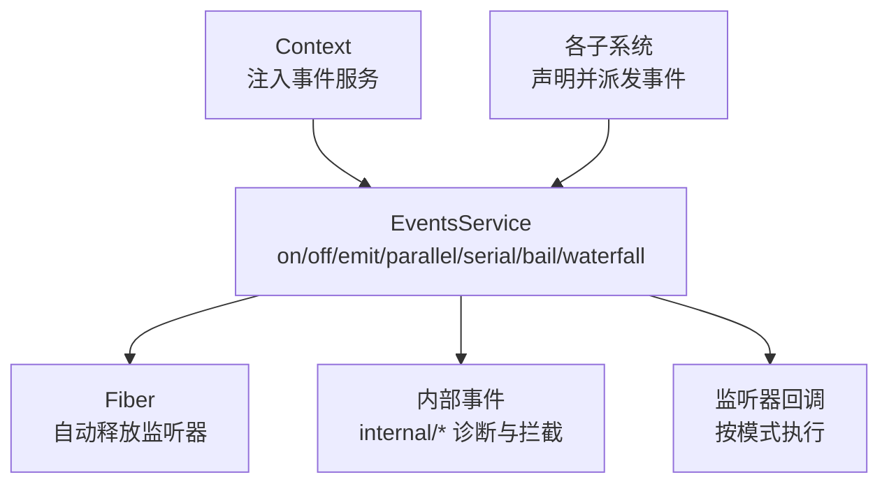
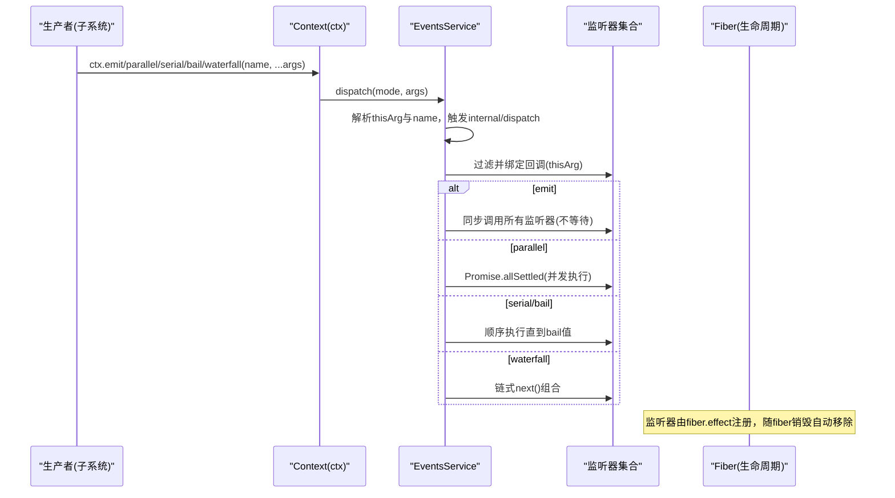
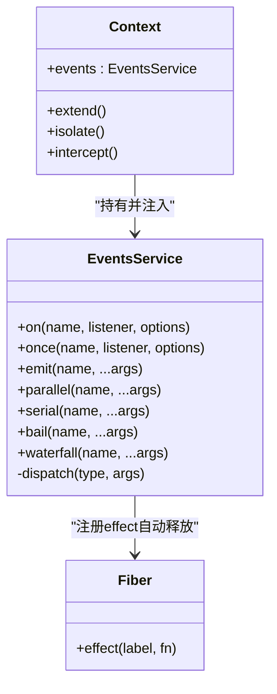

# 事件 API

<cite>
**本文引用的文件**
- [vendor/cordis/src/events.ts](file://vendor/cordis/src/events.ts)
- [vendor/cordis/src/context.ts](file://vendor/cordis/src/context.ts)
- [docs/cordis-api/events.md](file://docs/cordis-api/events.md)
- [docs/cordis-api/events.zh.md](file://docs/cordis-api/events.zh.md)
- [docs/event-producer-consumer.md](file://docs/event-producer-consumer.md)
- [docs/event-producer-consumer.zh.md](file://docs/event-producer-consumer.zh.md)
</cite>

## 目录
1. [简介](#简介)
2. [项目结构](#项目结构)
3. [核心组件](#核心组件)
4. [架构总览](#架构总览)
5. [详细组件分析](#详细组件分析)
6. [依赖关系分析](#依赖关系分析)
7. [性能与异步模型](#性能与异步模型)
8. [故障排查指南](#故障排查指南)
9. [结论](#结论)
10. [附录：命名规范、数据传递与最佳实践](#附录：命名规范数据传递与最佳实践)

## 简介
本文件系统化说明 Harness 的事件 API，覆盖事件的发布/订阅机制、监听注册、触发模式、过滤与优先级、数据传递、错误处理、异步模型、性能考量以及调试与监控方法。文档以 EventsService 为核心，结合 Context 注入的 ctx.on/ctx.emit/ctx.parallel/ctx.serial/ctx.bail/ctx.waterfall/ctx.once 等能力，给出事件驱动架构的实践建议与示例路径。

## 项目结构
事件系统位于 Cordis 内核中，通过 Context 注入到每个插件上下文，并由各子系统声明并消费事件。关键位置如下：
- 事件服务实现：EventsService（分发、监听、生命周期绑定）
- 上下文注入：Context 将 events 暴露为 ctx.events，并将事件方法混入 ctx
- 文档与矩阵：API 文档与生产/消费方矩阵用于全局理解事件生态

图表来源
- [vendor/cordis/src/context.ts:70-84](file://vendor/cordis/src/context.ts#L70-L84)
- [vendor/cordis/src/events.ts:125-156](file://vendor/cordis/src/events.ts#L125-L156)

章节来源
- [vendor/cordis/src/context.ts:70-84](file://vendor/cordis/src/context.ts#L70-L84)
- [vendor/cordis/src/events.ts:125-156](file://vendor/cordis/src/events.ts#L125-L156)

## 核心组件
- EventsService：事件总线，提供多种分发模式与监听管理，支持上下文过滤、优先级控制、自动资源释放。
- Context：应用上下文，持有 events 实例，并通过代理将事件方法混入 ctx，便于在插件中使用 ctx.on/ctx.emit 等。
- Fiber：插件运行单元，事件监听器作为 effect 注册，随 fiber 生命周期自动清理。

章节来源
- [vendor/cordis/src/events.ts:125-319](file://vendor/cordis/src/events.ts#L125-L319)
- [vendor/cordis/src/context.ts:70-84](file://vendor/cordis/src/context.ts#L70-L84)

## 架构总览
事件从生产者（各子系统）通过 ctx 的方法触发，EventsService 根据分发模式调度监听器；监听器可基于上下文过滤器进行筛选，并可设置优先级（prepend）。内部事件 internal/* 提供诊断与拦截点。

图表来源
- [vendor/cordis/src/events.ts:165-243](file://vendor/cordis/src/events.ts#L165-L243)
- [vendor/cordis/src/events.ts:254-302](file://vendor/cordis/src/events.ts#L254-L302)

## 详细组件分析

### EventsService：方法与行为
- on(name, listener, options?)
  - 在当前 fiber 下注册监听器，返回释放函数；支持 prepend/global 选项。
  - 内部通过 fiber.effect 注册，确保生命周期安全。
- once(name, listener, options?)
  - 首次触发后自动注销。
- emit(name, ...args)
  - 同步触发，忽略返回值，不等待监听器完成。
- parallel(name, ...args)
  - 并发触发所有监听器，聚合异常为 AggregateError。
- serial(name, ...args)
  - 顺序等待监听器，遇到“提前终止”值即停止。
- bail(name, ...args)
  - 同步顺序执行，遇到“提前终止”值即停止。
- waterfall(name, ...args)
  - 最后一个参数为 next 续接回调，监听器可决定是否继续后续链。

“提前终止”判定：非 null、非 false、非 undefined 的值视为 bailed。

章节来源
- [vendor/cordis/src/events.ts:119-123](file://vendor/cordis/src/events.ts#L119-L123)
- [vendor/cordis/src/events.ts:165-243](file://vendor/cordis/src/events.ts#L165-L243)
- [vendor/cordis/src/events.ts:288-319](file://vendor/cordis/src/events.ts#L288-L319)

### 上下文与过滤
- Context.filter：可在上下文中定义过滤器，事件分发时会依据该过滤器决定哪些监听器能收到事件。
- EventOptions.global：若为 true，则绕过上下文过滤器检查，始终接收事件。
- EventOptions.prepend：将监听器插入到队列头部，获得更高优先级。

章节来源
- [vendor/cordis/src/context.ts:42-50](file://vendor/cordis/src/context.ts#L42-L50)
- [vendor/cordis/src/events.ts:111-117](file://vendor/cordis/src/events.ts#L111-L117)
- [vendor/cordis/src/events.ts:165-175](file://vendor/cordis/src/events.ts#L165-L175)

### 内部事件与诊断
- internal/listener：监听注册过程，可用于替换或拦截注册逻辑。
- internal/update：配置更新的水流钩子，可用于拦截或修改配置。
- internal/get/set：读写服务时的水流钩子。
- internal/dispatch：对外部事件的分发入口（非 internal/*），可用于全量监控。

章节来源
- [vendor/cordis/src/events.ts:321-352](file://vendor/cordis/src/events.ts#L321-L352)

### 事件类型与声明
- Events 接口定义了框架内置的内部事件类型，包括插件生命周期、状态变更、配置与服务拦截等。
- 各子系统会声明自己的业务事件并在相应流程中派发。

章节来源
- [vendor/cordis/src/events.ts:321-352](file://vendor/cordis/src/events.ts#L321-L352)

## 依赖关系分析
- Context 在构造时创建并注入 EventsService，同时将其方法混入 ctx，使插件可直接使用 ctx.on/ctx.emit 等。
- EventsService 依赖 Fiber 来管理监听器的生命周期，确保插件卸载时自动清理。
- 各子系统通过 ctx 派发事件，监听器可能跨包存在，形成多对多的事件关系。

图表来源
- [vendor/cordis/src/context.ts:70-84](file://vendor/cordis/src/context.ts#L70-L84)
- [vendor/cordis/src/events.ts:254-302](file://vendor/cordis/src/events.ts#L254-L302)

章节来源
- [vendor/cordis/src/context.ts:70-84](file://vendor/cordis/src/context.ts#L70-L84)
- [vendor/cordis/src/events.ts:254-302](file://vendor/cordis/src/events.ts#L254-L302)

## 性能与异步模型
- 分发模式选择
  - emit：最轻量，适合高频、无需等待的通知型事件。
  - parallel：并发执行，适合独立且可并行处理的副作用，注意聚合异常。
  - serial/bail：顺序执行，适合需要短路逻辑的场景（如权限校验、策略拦截）。
  - waterfall：适合链式处理（如请求/响应预处理、日志埋点、审计）。
- 优先级
  - 使用 prepend=true 将监听器置于队列前端，优先执行。
- 上下文过滤
  - 通过 Context.filter 限制监听范围，减少不必要回调。
  - 使用 global=true 强制接收事件，适用于跨域监控或审计。
- 资源管理
  - 监听器通过 fiber.effect 注册，随 fiber 销毁自动释放，避免内存泄漏。
- 异常处理
  - parallel 会将所有失败聚合为 AggregateError，便于统一上报与重试。
  - serial/bail 遇到“提前终止”值立即停止，避免多余开销。

章节来源
- [vendor/cordis/src/events.ts:165-243](file://vendor/cordis/src/events.ts#L165-L243)
- [vendor/cordis/src/events.ts:254-302](file://vendor/cordis/src/events.ts#L254-L302)

## 故障排查指南
- 监听未触发
  - 检查是否在同一 Context 作用域内注册与派发；必要时使用 global 选项。
  - 确认没有 Context.filter 过滤掉目标监听器。
- 监听器未按预期顺序执行
  - 使用 prepend 调整优先级；或通过 waterfall 明确链式顺序。
- 异常被吞掉
  - emit 不会等待监听器，异常需自行捕获；parallel 会聚合异常抛出。
- 内存增长
  - 确保使用 ctx.on 注册的监听器在适当时机释放（默认随 fiber 释放）；避免长期持有闭包引用。
- 调试与监控
  - 监听 internal/dispatch 获取所有外部事件的分发信息（模式、名称、参数、thisArg）。
  - 利用 internal/listener 观察监听器注册情况，定位重复注册或遗漏。

章节来源
- [vendor/cordis/src/events.ts:165-175](file://vendor/cordis/src/events.ts#L165-L175)
- [vendor/cordis/src/events.ts:321-352](file://vendor/cordis/src/events.ts#L321-L352)

## 结论
Harness 的事件系统以 EventsService 为核心，提供丰富的分发模式、灵活的优先级与过滤机制，以及与 Fiber 的生命周期集成，确保在复杂插件系统中可靠、高效地解耦模块间通信。通过合理选择分发模式、利用上下文过滤与内部事件进行监控，可以在保证性能的同时提升可维护性与可观测性。

## 附录：命名规范、数据传递与最佳实践

### 事件命名规范
- 采用分层命名，如 domain/entity/action，便于分类与检索。
- 业务事件建议使用小写加连字符；内部事件以 internal/ 前缀区分。
- 参考仓库中的事件矩阵，遵循既有命名约定，避免冲突。

章节来源
- [docs/event-producer-consumer.md:8-66](file://docs/event-producer-consumer.md#L8-L66)
- [docs/event-producer-consumer.zh.md:10-67](file://docs/event-producer-consumer.zh.md#L10-L67)

### 数据传递
- 事件参数应最小化，仅传递必要数据；复杂对象建议传递标识符，由监听器按需查询。
- 对于需要链式处理的数据，优先使用 waterfall 模式，通过 next 传递上下文。
- 避免在事件中传递易变的大对象，防止意外共享状态导致竞态。

### 错误处理
- 使用 parallel 时捕获 AggregateError，统一上报与降级。
- 使用 serial/bail 时，明确“提前终止”语义，避免误判。
- 在 waterfall 中，若某环节拒绝后续执行，应记录原因并返回合适结果。

### 异步与性能
- 高频通知用 emit；需要并发副作用用 parallel；需要顺序或短路逻辑用 serial/bail；需要链式处理用 waterfall。
- 合理使用 prepend 控制优先级，避免过多监听器造成顺序抖动。
- 通过 Context.filter 缩小监听范围，减少无关回调。

### 实用示例与最佳实践
- 会话级事件：在 session 生命周期中派发 created/disposed/event，供持久化、遥测、标题生成等监听。
- 工具执行链路：使用 tools/pre-execute/tools/execute/tools/post-execute 等事件进行前置校验、执行与后置处理。
- 跨包协作：通过 internal/dispatch 收集全量事件，构建统一监控面板。

章节来源
- [docs/event-producer-consumer.md:8-66](file://docs/event-producer-consumer.md#L8-L66)
- [docs/event-producer-consumer.zh.md:10-67](file://docs/event-producer-consumer.zh.md#L10-L67)