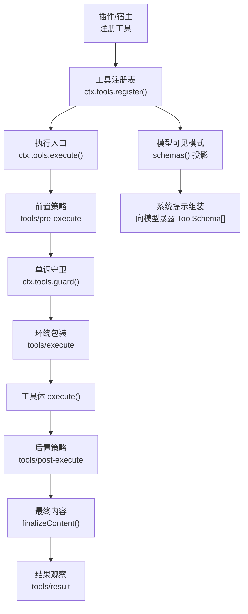
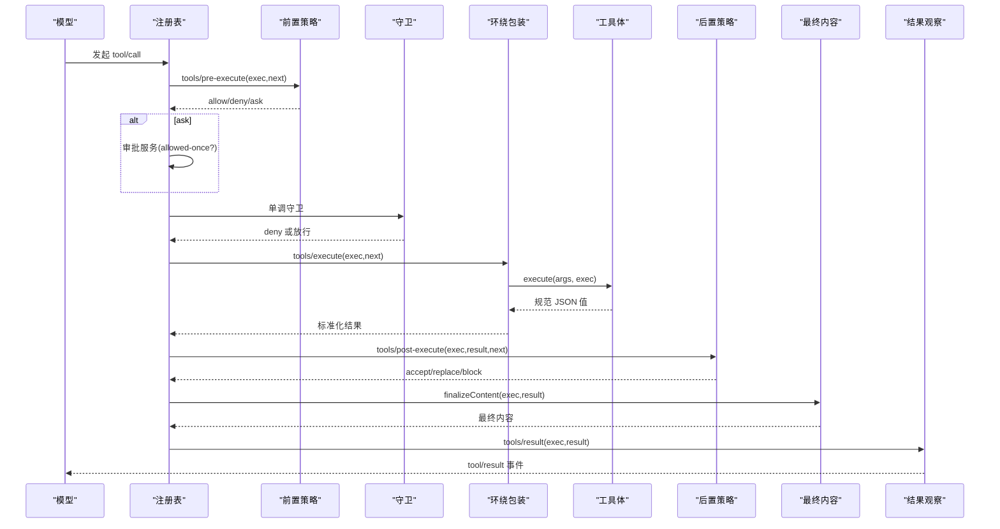
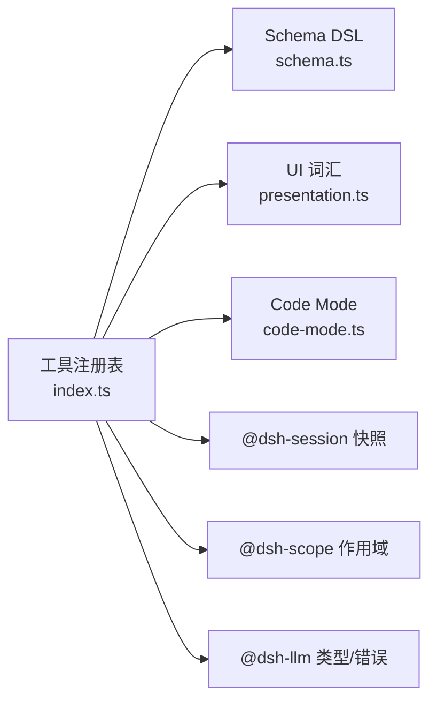

# 工具 API

<cite>
**本文引用的文件**
- [packages/core/tools/src/index.ts](file://packages/core/tools/src/index.ts)
- [packages/core/tools/src/schema.ts](file://packages/core/tools/src/schema.ts)
- [packages/core/tools/src/presentation.ts](file://packages/core/tools/src/presentation.ts)
- [packages/core/tools/src/code-mode.ts](file://packages/core/tools/src/code-mode.ts)
- [packages/core/tools/src/testing.ts](file://packages/core/tools/src/testing.ts)
- [docs/subsystems/tools.md](file://docs/subsystems/tools.md)
- [docs/subsystems/tools.zh.md](file://docs/subsystems/tools.zh.md)
- [docs/tool-catalog.md](file://docs/tool-catalog.md)
- [docs/tool-execution-pipeline.md](file://docs/tool-execution-pipeline.md)
- [docs/cookbook/adding-a-tool.md](file://docs/cookbook/adding-a-tool.md)
- [docs/testing.md](file://docs/testing.md)
</cite>

## 目录
1. [简介](#简介)
2. [项目结构](#项目结构)
3. [核心组件](#核心组件)
4. [架构总览](#架构总览)
5. [详细组件分析](#详细组件分析)
6. [依赖关系分析](#依赖关系分析)
7. [性能与并发](#性能与并发)
8. [权限控制与安全沙箱](#权限控制与安全沙箱)
9. [内置工具清单与使用示例](#内置工具清单与使用示例)
10. [自定义工具开发流程与最佳实践](#自定义工具开发流程与最佳实践)
11. [测试方法与调试技巧](#测试方法与调试技巧)
12. [故障排查](#故障排查)
13. [结论](#结论)

## 简介
本文件面向“工具”子系统，系统性说明工具的注册、调用与执行机制；定义工具的数据契约（参数 schema、返回值规范）、参数校验与结果处理；列出内置工具能力与用法；给出自定义工具的开发流程、权限控制、安全沙箱、性能优化建议；并提供测试方法与调试技巧。

## 项目结构
工具子系统位于核心包中，围绕“注册表 + 执行流水线 + UI 展示词汇”组织：
- 注册与执行管线：packages/core/tools/src/index.ts
- 类型化 Schema DSL 与参数校验：packages/core/tools/src/schema.ts
- UI 呈现意图（卡片）：packages/core/tools/src/presentation.ts
- Code Mode 专用工具与 SDK 生成：packages/core/tools/src/code-mode.ts
- 测试辅助：packages/core/tools/src/testing.ts
- 文档与目录：docs/subsystems/tools.*、docs/tool-catalog.md、docs/tool-execution-pipeline.md、docs/cookbook/adding-a-tool.md、docs/testing.md

图表来源
- [packages/core/tools/src/index.ts:142-200](file://packages/core/tools/src/index.ts#L142-L200)
- [docs/tool-execution-pipeline.md:8-60](file://docs/tool-execution-pipeline.md#L8-L60)

章节来源
- [docs/subsystems/tools.md:9-151](file://docs/subsystems/tools.md#L9-L151)
- [docs/subsystems/tools.zh.md:9-151](file://docs/subsystems/tools.zh.md#L9-L151)

## 核心组件
- 工具定义 ToolDefinition：包含面向模型的 ToolSchema、输出契约 output、执行函数 execute、可选 finalizeContent、timeoutMs、isConcurrencySafe、presentCall/presentResult。
- 统一 JSON 值 Schema DSL：作者侧 ValueSchemaSpec 描述参数与输出类型，编译为受支持的原始 JSON Schema 子集。
- 执行上下文与生命周期：ToolExecutionInput → ToolExecution → ToolDispatchExecution → ToolExecutionResult；支持 deferContext/concludeTurn。
- 扩展点（Waterfall）：tools/pre-execute、tools/execute、tools/post-execute、tools/result；以及 tools/code-dispatch-log。
- UI 呈现：ToolCallView/ToolResultView 中性卡片词汇，供 host/client 映射到具体视图。

章节来源
- [docs/subsystems/tools.md:9-151](file://docs/subsystems/tools.md#L9-L151)
- [docs/subsystems/tools.zh.md:9-151](file://docs/subsystems/tools.zh.md#L9-L151)
- [packages/core/tools/src/index.ts:142-200](file://packages/core/tools/src/index.ts#L142-L200)

## 架构总览
工具执行遵循“可扩展瀑布 + 单调策略”的固定顺序：
- 前置策略：允许/拒绝/询问（可接入审批）。
- 单调守卫：仅能拒绝或放行，不能撤销先前拒绝。
- 环绕包装：超时、重试、指标等。
- 工具体：返回规范 JSON 值。
- 后置策略：接受/替换/阻断/附加上下文。
- 最终内容：工具自有的 finalizeContent 做最后的内容不变量约束。
- 结果观察：不可变、无损 JSON 的最终结果。

图表来源
- [docs/tool-execution-pipeline.md:8-60](file://docs/tool-execution-pipeline.md#L8-L60)
- [packages/core/tools/src/index.ts:142-200](file://packages/core/tools/src/index.ts#L142-L200)

## 详细组件分析

### 工具定义与 Schema DSL
- ToolDefinition 字段：name、description、parameters、output（schema + render + presentationMeta）、execute、finalizeContent、timeoutMs、isConcurrencySafe、presentCall、presentResult。
- 参数 Schema：ParameterSchemaSpec 是隐式开放对象根，属性上标注 required:true 表示必填；ValueSchemaSpec 支持 string/number/integer/boolean/null/array/object/json/oneOf。
- 输出 Schema：valueSchemaSpecToJsonSchema 将作者侧 DSL 编译为受支持的原始 JSON Schema 子集；运行时 validateJsonSchemaValue 强制校验。
- 类型推导：InferArgs/P 与 InferValue<S> 提供精确的类型推断，容器深度限制在 16 层后回退为 JsonValue。

章节来源
- [docs/subsystems/tools.md:98-151](file://docs/subsystems/tools.md#L98-L151)
- [docs/subsystems/tools.zh.md:98-151](file://docs/subsystems/tools.zh.md#L98-L151)
- [packages/core/tools/src/schema.ts](file://packages/core/tools/src/schema.ts)

### 执行上下文与生命周期
- ToolExecutionInput：包含 callId、rootCallId、name、arguments、agent、parent、signal。
- ToolExecution：增加 token、rootCallId；arguments 在进入策略前被物化为无损 JSON 并冻结。
- ToolDispatchExecution：around-dispatch 视图，可替换 signal 但不能移除。
- ToolRunContext：在工具体内可用 deferContext 附加上下文、concludeTurn 标记本轮结束。
- 执行模式：executionMode 返回 parallel/exclusive，用于调度器形成并行组或独占屏障。

章节来源
- [docs/subsystems/tools.md:170-311](file://docs/subsystems/tools.md#L170-L311)
- [docs/subsystems/tools.zh.md:170-311](file://docs/subsystems/tools.zh.md#L170-L311)
- [packages/core/tools/src/index.ts:142-200](file://packages/core/tools/src/index.ts#L142-L200)

### 结果与错误处理
- ToolExecutionResult：成功时 isError:false，携带 value/content/meta/additionalContexts/concludesTurn；失败时 isError:true，携带 error/message/info。
- 规范化与快照：注册表对 body 返回值进行快照、校验、冻结，再交给 render/presentationMeta；任何渲染/投影失败会被转为安全的 isError 结果。
- finalizeContent：最后一次内容转换机会，必须纯且无副作用，确保模型可见内容满足工具自身不变量。

章节来源
- [docs/subsystems/tools.md:327-375](file://docs/subsystems/tools.md#L327-L375)
- [docs/subsystems/tools.zh.md:327-375](file://docs/subsystems/tools.zh.md#L327-L375)

### UI 呈现与卡片
- presentCall/presentResult 返回 card-tagged 渲染意图：generic/terminal/diff/search/read/web 等。
- 中性词汇由 dsh-tools 定义，host/client 各自映射到具体视图；呈现函数必须是纯函数，以支持回放。

章节来源
- [docs/subsystems/tools.md:459-468](file://docs/subsystems/tools.md#L459-L468)
- [docs/subsystems/tools.zh.md:459-468](file://docs/subsystems/tools.zh.md#L459-L468)
- [packages/core/tools/src/presentation.ts](file://packages/core/tools/src/presentation.ts)

### Code Mode 与 run_code
- run_code 是保留传输工具，在 code/both 模式下唯一直接可调用的工具；程序内通过 SDK 绑定调用其他工具，嵌套子调用会进入完整工具管线并关联父结果。
- tools/code-dispatch-log 允许替换持久日志副本中的内容（不影响程序收到的结构化值与模型可见结果）。

章节来源
- [docs/tool-catalog.md:117-147](file://docs/tool-catalog.md#L117-L147)
- [packages/core/tools/src/code-mode.ts](file://packages/core/tools/src/code-mode.ts)
- [packages/core/tools/src/index.ts:177-189](file://packages/core/tools/src/index.ts#L177-L189)

## 依赖关系分析
- 注册表依赖：ScopeKey、Scoped 作用域管理；@deepseek-ai/schemastery 用于参数校验；@deepseek-ai/dsh-session 用于 JSON 快照；@deepseek-ai/dsh-code-runtime 用于 Code Mode 语言与 SDK 生成。
- 事件与钩子：tools/* 事件构成扩展点，监听器按顺序执行，失败被隔离。
- 外部集成：fs/shell/jobs/lsp/web 等通过 ctx 注入，工具实现不直接耦合底层实现。

图表来源
- [packages/core/tools/src/index.ts:1-30](file://packages/core/tools/src/index.ts#L1-L30)

章节来源
- [packages/core/tools/src/index.ts:1-30](file://packages/core/tools/src/index.ts#L1-L30)

## 性能与并发
- isConcurrencySafe：声明工具是否可与兄弟调用并行；仅显式 true 才加入并行组，未知/异常/非 true 均视为独占。
- timeoutMs：声明协作超时预算，由 @deepseek-ai/dsh-tool-call-timeout-policy 在 tools/execute 中执行；工具需正确转发 exec.signal 并在取消时达到静默。
- executionMode：注册表根据 isConcurrencySafe 返回 parallel/exclusive，调度器据此形成滚动池或独占屏障。
- 结果快照与冻结：减少后续处理的拷贝成本，保证观察者一致性。

章节来源
- [docs/subsystems/tools.md:53-74](file://docs/subsystems/tools.md#L53-L74)
- [docs/subsystems/tools.md:243-253](file://docs/subsystems/tools.md#L243-L253)
- [docs/subsystems/tools.zh.md:53-74](file://docs/subsystems/tools.zh.md#L53-L74)
- [docs/subsystems/tools.zh.md:243-253](file://docs/subsystems/tools.zh.md#L243-L253)

## 权限控制与安全沙箱
- 前置策略 tools/pre-execute：可实现 allow/deny/ask；缺少审批支持时 ask 降级为 deny。
- 单调守卫 ctx.tools.guard：在 pre-execute 之后、工具体之前运行；只能拒绝或放行，无法撤销先前拒绝。
- 作用域限制 ToolRestriction：allow/deny 过滤全局工具；作用域内注册不受影响；reserved 名称（如 run_code）不可被覆盖。
- 沙箱：文件系统读写通过 fs/* 事件门控（read-before-write/edit），shell/PTY 执行通过 shell/terminal 后端；Code Mode 下 run_code 作为唯一直调入口，其他工具通过 SDK 重新进入管线。

章节来源
- [docs/subsystems/tools.md:153-172](file://docs/subsystems/tools.md#L153-L172)
- [docs/subsystems/tools.md:376-404](file://docs/subsystems/tools.md#L376-L404)
- [docs/tool-execution-pipeline.md:8-60](file://docs/tool-execution-pipeline.md#L8-L60)
- [docs/tool-catalog.md:117-147](file://docs/tool-catalog.md#L117-L147)

## 内置工具清单与使用示例
以下为部分内置工具及其用途（完整清单见工具目录）：
- bash：执行 bash -c 命令，支持 workdir、timeoutMs、run_in_background；后台任务通过 ctx.jobs 管理。
- pwsh：Windows PowerShell 等价能力，路径与环境变量使用 Windows 风格。
- str_replace_editor：基于字符串匹配的查看/创建/替换/插入编辑。
- fs 工具：edit/read/read_image/write，配合 read-before-write 策略与附件能力。
- fs-search：glob/grep，使用 ripgrep 二进制进行高效搜索。
- terminal_*：终端会话的生命周期管理与发送。
- goal/schedule/workflow/subagent*：目标、计划、工作流、子代理等高级编排能力。
- web_fetch/web_search：网络检索与抓取。
- cordis_*：动态插件定义、查询、运行、停止、删除。
- run_code：Code Mode 下唯一直调入口，程序内通过 SDK 调用其他工具。

使用示例参考：
- 最小工具模板与规则：docs/cookbook/adding-a-tool.md
- 各工具 JSON Schema 与说明：docs/tool-catalog.md

章节来源
- [docs/tool-catalog.md:12-41](file://docs/tool-catalog.md#L12-L41)
- [docs/tool-catalog.md:117-147](file://docs/tool-catalog.md#L117-L147)
- [docs/tool-catalog.md:176-263](file://docs/tool-catalog.md#L176-L263)
- [docs/tool-catalog.md:529-598](file://docs/tool-catalog.md#L529-L598)
- [docs/tool-catalog.md:599-775](file://docs/tool-catalog.md#L599-L775)
- [docs/tool-catalog.md:776-800](file://docs/tool-catalog.md#L776-L800)
- [docs/cookbook/adding-a-tool.md:7-65](file://docs/cookbook/adding-a-tool.md#L7-L65)

## 自定义工具开发流程与最佳实践
- 注册方式：使用 defineTool 声明 name/description/parameters/output/execute，并通过 ctx.tools.register 注册；效果基于 fiber 生命周期，dispose 即注销。
- 参数校验：defineTool 自动校验 arguments；复杂约束需在 execute 内检查。
- 返回值：只返回规范 JSON 值；render 负责模型可见内容；presentationMeta 提供可回放 UI 元数据。
- 长耗时任务：通过 ctx.jobs.start 注册后台任务，返回句柄；前台任务关注 exec.signal。
- 策略与观察：优先使用 tools/pre-execute、guard、tools/execute、tools/post-execute、tools/result，避免把部署策略硬编码进工具。
- Code Mode 友好：visible 工具自动成为 await tools.<name>(args)，调用重新进入管线并返回规范值。
- UI 呈现：presentCall/presentResult 保持纯函数，使用中性卡片词汇。

章节来源
- [docs/cookbook/adding-a-tool.md:7-65](file://docs/cookbook/adding-a-tool.md#L7-L65)
- [docs/cookbook/adding-a-tool.md:67-90](file://docs/cookbook/adding-a-tool.md#L67-L90)
- [docs/subsystems/tools.md:9-151](file://docs/subsystems/tools.md#L9-L151)

## 测试方法与调试技巧
- 测试分层：
  - 单元：vitest 跑 tests/**，覆盖边界、错误路径、事件顺序、并发竞态。
  - 覆盖率：per-file 100% 要求（特定平台例外）。
  - 真实 API e2e：带 key 的端到端场景。
  - 快照：keyless 预期输出，包括传输契约与呈现。
- 工具测试要点：
  - 使用 makeBridgeHarness 等脚本 mock 模型，结合真实工具与执行器验证行为。
  - 恢复测试：区分分块前后失败，证明失败分块不产生消息或工具副作用。
  - 注册表 HMR 安全：测试 fiber dispose 后的清理。
- 调试技巧：
  - 监听 tools/result 获取不可变最终结果。
  - 使用 tools/code-dispatch-log 调整持久日志副本内容（例如超大文本预览）。
  - 利用 finalizeContent 做最后的内容不变量约束，避免 UI 格式化污染模型结果。

章节来源
- [docs/testing.md:1-50](file://docs/testing.md#L1-L50)
- [packages/core/tools/src/testing.ts](file://packages/core/tools/src/testing.ts)
- [packages/core/tools/src/index.ts:177-197](file://packages/core/tools/src/index.ts#L177-L197)

## 故障排查
- UNKNOWN_TOOL：工具不可见或未注册；检查作用域与 restrict 过滤。
- INVALID_ARGS：参数不符合 ParameterSchemaSpec；检查 required、类型、enum/const、oneOf。
- INVALID_TOOL_OUTPUT：execute 返回值或 render/presentationMeta 产物无效；检查 output.schema 与投影逻辑。
- ABORTED_BEFORE_DISPATCH / ABORTED：取消发生在不同阶段；确认工具体是否正确响应 exec.signal。
- 审批失败：ask 未获 allowed-once；检查审批服务可用性与会话状态。
- 沙箱拒绝：文件/进程访问被策略阻止；不要尝试绕过，应调整命令或路径。

章节来源
- [docs/subsystems/tools.md:376-404](file://docs/subsystems/tools.md#L376-L404)
- [docs/tool-execution-pipeline.md:8-60](file://docs/tool-execution-pipeline.md#L8-L60)

## 结论
工具子系统通过统一的 Schema DSL、严格的执行流水线与中性 UI 词汇，实现了高内聚、可扩展、可观测的工具生态。开发者只需关注规范的输入输出与纯呈现逻辑，即可在权限控制、沙箱、并发与性能方面获得一致保障。借助丰富的扩展点与测试体系，既能快速构建业务工具，也能在生产环境中稳定运行。