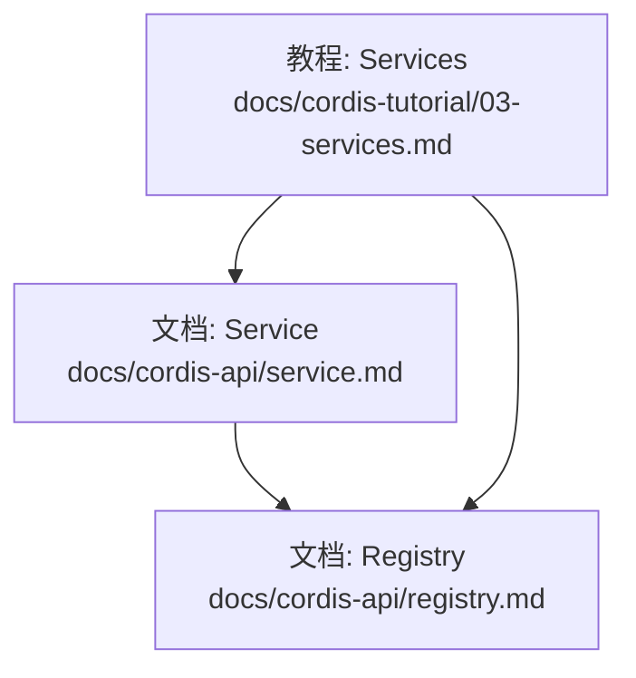
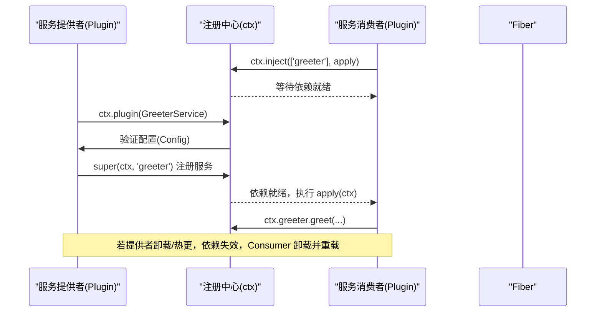
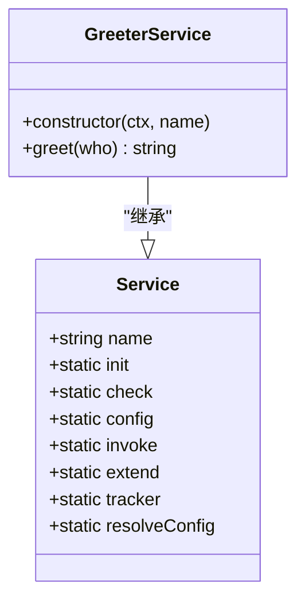
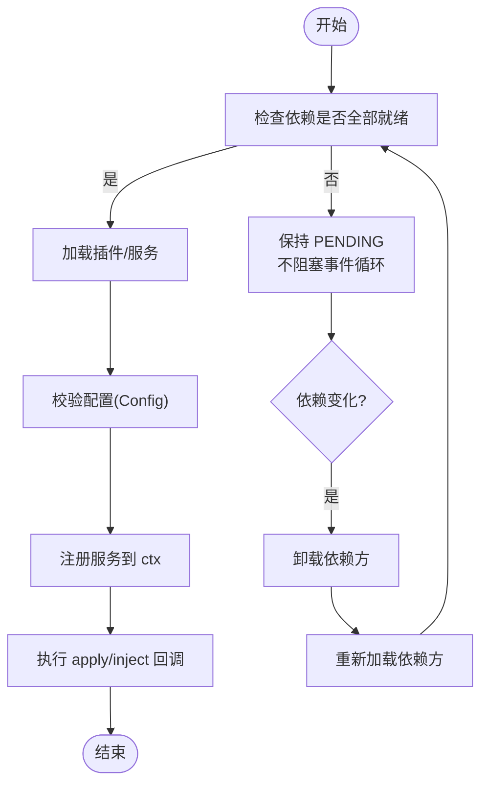
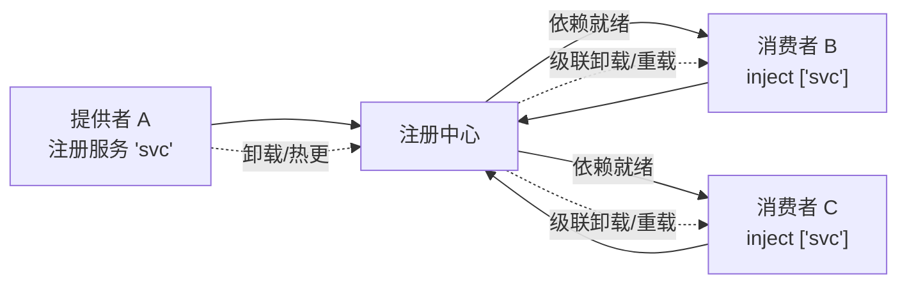

# 服务 API

<cite>
**本文引用的文件**
- [docs/cordis-api/service.md](file://docs/cordis-api/service.md)
- [docs/cordis-api/registry.md](file://docs/cordis-api/registry.md)
- [docs/cordis-tutorial/03-services.md](file://docs/cordis-tutorial/03-services.md)
</cite>

## 目录
1. [简介](#简介)
2. [项目结构](#项目结构)
3. [核心组件](#核心组件)
4. [架构总览](#架构总览)
5. [详细组件分析](#详细组件分析)
6. [依赖关系分析](#依赖关系分析)
7. [性能考量](#性能考量)
8. [故障排查指南](#故障排查指南)
9. [结论](#结论)
10. [附录](#附录)

## 简介
本章节面向服务开发者，系统化说明 Cordis 框架中的“服务”概念：如何定义、注册、声明依赖、处理配置、管理生命周期，以及如何在运行时进行服务发现与替换。文档同时覆盖拦截器（intercept-config）、工厂函数与单例模式在插件与服务中的应用，并给出开发示例、最佳实践、测试方法与性能优化建议。

## 项目结构
围绕服务 API 的核心文档位于 docs/cordis-api 与 docs/cordis-tutorial 中：
- docs/cordis-api/service.md：Service 基类、静态成员与扩展点（init、check、config、invoke、extend、tracker、resolveConfig）。
- docs/cordis-api/registry.md：插件加载、依赖注入（inject）、插件形态（Function/Constructor/Object）与 Inject 类型。
- docs/cordis-tutorial/03-services.md：服务提供与消费示例、依赖追踪、可选依赖、命名约定等实战要点。

图表来源
- [docs/cordis-api/service.md:1-103](file://docs/cordis-api/service.md#L1-L103)
- [docs/cordis-api/registry.md:1-153](file://docs/cordis-api/registry.md#L1-L153)
- [docs/cordis-tutorial/03-services.md:1-99](file://docs/cordis-tutorial/03-services.md#L1-L99)

章节来源
- [docs/cordis-api/service.md:1-103](file://docs/cordis-api/service.md#L1-L103)
- [docs/cordis-api/registry.md:1-153](file://docs/cordis-api/registry.md#L1-L153)
- [docs/cordis-tutorial/03-services.md:1-99](file://docs/cordis-tutorial/03-services.md#L1-L99)

## 核心组件
- Service 基类
  - 用于在 Context 上以名称暴露能力；构造时立即注册，随所属 fiber 自动卸载。
  - 关键静态成员：
    - init：实例方法标记，构造后运行（类插件）。
    - check：可用性谓词，配合 ctx.provide() 使用。
    - config：拦截配置的幻类型参数键。
    - invoke：使服务可被调用（如 ctx.logger()）。
    - extend：派生扩展实例的辅助键。
    - tracker：上下文追踪元数据键。
    - resolveConfig：拦截配置解析辅助。
- Registry（插件与依赖注入）
  - ctx.inject(deps, callback)：当所需服务可用时执行回调；依赖变化时自动重新加载。
  - ctx.plugin(plugin, ...args)：加载插件（函数/类/对象），返回 Fiber。
  - Plugin 形态：Function、Constructor、Object，均支持 name、Config、inject、provide、intercept 等元信息。
  - Inject：声明依赖的数组或对象形式，支持为每个依赖指定拦截配置。

章节来源
- [docs/cordis-api/service.md:1-103](file://docs/cordis-api/service.md#L1-L103)
- [docs/cordis-api/registry.md:1-153](file://docs/cordis-api/registry.md#L1-L153)

## 架构总览
下图展示了服务提供者、消费者与注册中心之间的交互流程，包括依赖就绪检查、插件加载、服务注册与生命周期管理。

图表来源
- [docs/cordis-api/registry.md:1-153](file://docs/cordis-api/registry.md#L1-L153)
- [docs/cordis-api/service.md:1-103](file://docs/cordis-api/service.md#L1-L103)
- [docs/cordis-tutorial/03-services.md:1-99](file://docs/cordis-tutorial/03-services.md#L1-L99)

## 详细组件分析

### Service 基类与扩展方式
- 扩展方式
  - 继承 Service，并在构造函数中调用 super(ctx, name) 完成注册。
  - 通过 TypeScript 模块合并为 Context 添加类型，保证编译期类型安全。
- 生命周期
  - 构造即注册；随所属 fiber 卸载而移除。
  - 可通过静态成员扩展行为：
    - init：构造后钩子。
    - check：条件提供（ctx.provide）。
    - invoke：将服务作为可调用函数挂载。
    - extend：派生扩展实例。
    - tracker：追踪元数据。
    - resolveConfig：解析拦截配置。
- 配置处理
  - 通过 Config 标准校验；拦截配置通过 intercept 声明与 resolveConfig 解析。

图表来源
- [docs/cordis-api/service.md:1-103](file://docs/cordis-api/service.md#L1-L103)
- [docs/cordis-tutorial/03-services.md:1-99](file://docs/cordis-tutorial/03-services.md#L1-L99)

章节来源
- [docs/cordis-api/service.md:1-103](file://docs/cordis-api/service.md#L1-L103)
- [docs/cordis-tutorial/03-services.md:1-99](file://docs/cordis-tutorial/03-services.md#L1-L99)

### 插件与依赖注入（Registry）
- 插件形态
  - Function：接收 (ctx, config)。
  - Constructor：new(ctx, config)。
  - Object：apply(ctx, config)。
- 依赖声明
  - inject 可为数组或对象；对象形式可为每个依赖指定拦截配置。
  - ctx.inject 是快捷方式，等价于 ctx.plugin({ inject, apply })。
- 加载与卸载
  - 依赖缺失时保持 PENDING；依赖变化时自动卸载并重新加载依赖方。
  - 提供者的卸载会级联卸载所有依赖者，避免持有过期引用。

图表来源
- [docs/cordis-api/registry.md:1-153](file://docs/cordis-api/registry.md#L1-L153)
- [docs/cordis-tutorial/03-services.md:1-99](file://docs/cordis-tutorial/03-services.md#L1-L99)

章节来源
- [docs/cordis-api/registry.md:1-153](file://docs/cordis-api/registry.md#L1-L153)
- [docs/cordis-tutorial/03-services.md:1-99](file://docs/cordis-tutorial/03-services.md#L1-L99)

### 服务发现机制与版本兼容性
- 服务发现
  - 通过名称在 Context 上查找；消费者仅依赖名称而非具体实现，便于配置切换提供者。
  - 可选依赖：使用 ctx.get('name') 探测是否存在，避免强耦合。
- 版本兼容
  - 通过拦截配置（intercept-config）与 resolveConfig 对配置进行转换与校验，屏蔽上游变更带来的破坏性更新。
  - 借助 check 谓词与 provide，可按条件提供不同版本的服务实现。

章节来源
- [docs/cordis-api/service.md:1-103](file://docs/cordis-api/service.md#L1-L103)
- [docs/cordis-api/registry.md:1-153](file://docs/cordis-api/registry.md#L1-L153)
- [docs/cordis-tutorial/03-services.md:1-99](file://docs/cordis-tutorial/03-services.md#L1-L99)

### 服务拦截器、工厂函数与单例模式
- 拦截器（intercept-config）
  - 插件通过 intercept 声明消费的拦截配置；通过 resolveConfig 解析并应用。
  - 结合 Config 校验，可在启动前对配置做规范化与降级。
- 工厂函数
  - 使用 ctx.plugin 的函数/对象形态，按需创建服务实例，适合复杂初始化逻辑。
- 单例模式
  - Service 实例在构造时注册一次，由框架管理生命周期；同一名称在同一上下文中为单例。
  - 通过 extend 派生新实例，避免共享状态污染。

章节来源
- [docs/cordis-api/service.md:1-103](file://docs/cordis-api/service.md#L1-L103)
- [docs/cordis-api/registry.md:1-153](file://docs/cordis-api/registry.md#L1-L153)

### 完整示例与最佳实践
- 提供服务
  - 继承 Service，super(ctx, name) 注册；通过 apply 挂载到 ctx。
  - 使用 TypeScript 模块合并为 Context 添加类型，确保类型安全。
- 消费服务
  - 使用 inject 声明必需依赖；或使用 ctx.get 进行可选依赖探测。
  - 依赖变化时，框架会自动卸载并重新加载依赖方，保证一致性。
- 命名规范
  - 服务名全局唯一；建议使用前缀避免冲突。
- 配置与校验
  - 为插件提供 Config 校验；利用 intercept-config 做配置转换与兼容。
- 生命周期
  - 服务随 fiber 生命周期管理；避免在外部持有长引用。

章节来源
- [docs/cordis-tutorial/03-services.md:1-99](file://docs/cordis-tutorial/03-services.md#L1-L99)
- [docs/cordis-api/registry.md:1-153](file://docs/cordis-api/registry.md#L1-L153)
- [docs/cordis-api/service.md:1-103](file://docs/cordis-api/service.md#L1-L103)

## 依赖关系分析
- 松耦合
  - 消费者仅依赖服务名称，不关心具体实现；通过 inject 声明依赖，框架负责调度。
- 动态重连
  - 提供者卸载/热更时，依赖方自动卸载并重建，避免悬挂引用。
- 配置驱动
  - 通过 Config 与 intercept-config 控制行为，无需修改消费者代码即可切换实现。

图表来源
- [docs/cordis-api/registry.md:1-153](file://docs/cordis-api/registry.md#L1-L153)
- [docs/cordis-tutorial/03-services.md:1-99](file://docs/cordis-tutorial/03-services.md#L1-L99)

章节来源
- [docs/cordis-api/registry.md:1-153](file://docs/cordis-api/registry.md#L1-L153)
- [docs/cordis-tutorial/03-services.md:1-99](file://docs/cordis-tutorial/03-services.md#L1-L99)

## 性能考量
- 延迟加载
  - 使用 ctx.inject 仅在依赖就绪时执行回调，减少启动开销。
- 最小化副作用
  - 在 apply 中只做必要注册；昂贵初始化应延迟到首次调用。
- 避免长引用
  - 不要缓存 ctx 上的服务引用；依赖变化时引用可能失效。
- 配置校验前置
  - 尽早失败（Config 校验），避免无效配置进入运行期。
- 合理使用拦截配置
  - 将可变行为外置到 intercept-config，降低代码分支复杂度。

[本节为通用指导，不直接分析具体文件]

## 故障排查指南
- 服务未就绪
  - 检查 inject 声明是否正确；确认提供者已加载且名称一致。
  - 观察 PENDING 状态：依赖缺失时不会阻塞事件循环。
- 依赖变化导致崩溃
  - 避免在外部缓存服务引用；使用 ctx 实时获取。
  - 确保消费者能优雅降级（可选依赖用 ctx.get）。
- 配置错误
  - 检查 Config 校验规则；利用 intercept-config 做兼容转换。
- 热更问题
  - 提供者热更时，依赖方会被卸载并重建；确保无外部强引用。

章节来源
- [docs/cordis-api/registry.md:1-153](file://docs/cordis-api/registry.md#L1-L153)
- [docs/cordis-tutorial/03-services.md:1-99](file://docs/cordis-tutorial/03-services.md#L1-L99)

## 结论
Cordis 的服务体系以“名称 + 依赖声明”为核心，结合插件化加载、拦截配置与严格的配置校验，实现了高内聚、低耦合的可插拔架构。通过 Service 基类的扩展点与 Registry 的生命周期管理，开发者可以灵活地提供、消费和替换服务，同时保证运行时的稳定性与可维护性。遵循本文的最佳实践，可以在保证性能的前提下快速构建可扩展的服务生态。

[本节为总结性内容，不直接分析具体文件]

## 附录
- 术语
  - 服务：在 Context 上以名称暴露的能力。
  - 插件：可被加载的函数/类/对象，具备配置与依赖声明。
  - 拦截配置：对服务行为的细粒度配置，支持转换与兼容。
- 参考
  - Service 基类与扩展点：[docs/cordis-api/service.md](file://docs/cordis-api/service.md)
  - 插件与依赖注入：[docs/cordis-api/registry.md](file://docs/cordis-api/registry.md)
  - 服务教程与示例：[docs/cordis-tutorial/03-services.md](file://docs/cordis-tutorial/03-services.md)