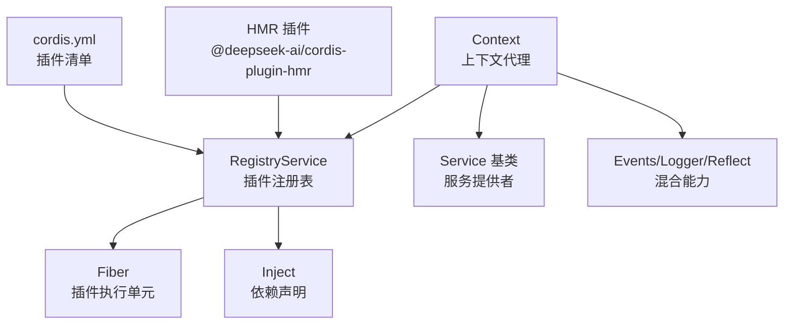
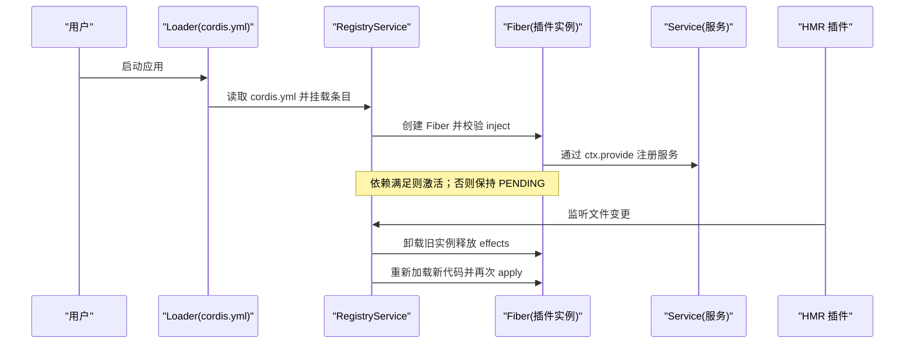
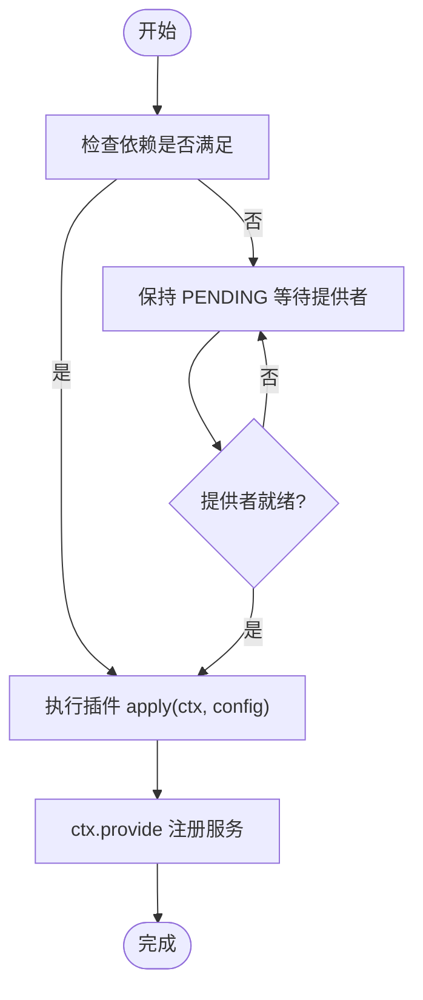
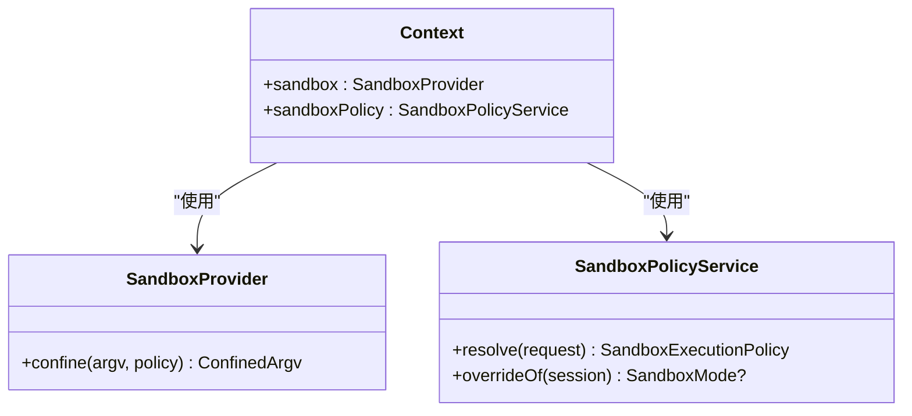
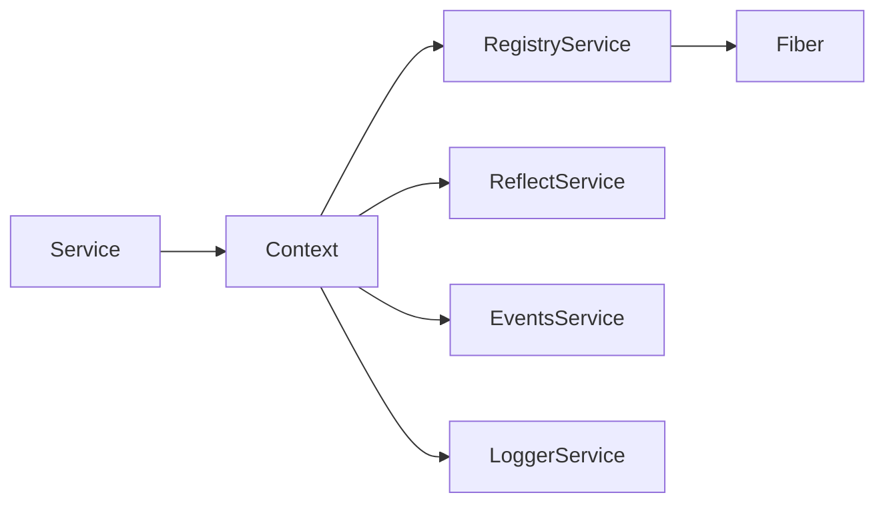

# 注册表 API

<cite>
**本文引用的文件**
- [docs/cordis-api/registry.md](file://docs/cordis-api/registry.md)
- [docs/cordis-api/service.md](file://docs/cordis-api/service.md)
- [docs/cordis-api/context.md](file://docs/cordis-api/context.md)
- [docs/cordis-tutorial/01-first-plugin.md](file://docs/cordis-tutorial/01-first-plugin.md)
- [docs/cordis-tutorial/06-composition-and-hmr.md](file://docs/cordis-tutorial/06-composition-and-hmr.md)
- [docs/subsystems/sandbox.md](file://docs/subsystems/sandbox.md)
- [docs/testing.md](file://docs/testing.md)
</cite>

## 目录
1. [简介](#简介)
2. [项目结构](#项目结构)
3. [核心组件](#核心组件)
4. [架构总览](#架构总览)
5. [详细组件分析](#详细组件分析)
6. [依赖关系分析](#依赖关系分析)
7. [性能考量](#性能考量)
8. [故障排查指南](#故障排查指南)
9. [结论](#结论)
10. [附录](#附录)

## 简介
本文件面向插件开发者与系统集成者，系统化说明 Cordis 注册表 API 的机制与实践，覆盖插件加载、发现、版本管理、生命周期钩子、依赖解析、冲突处理、热重载（HMR）、沙箱隔离与安全机制，并提供完整的插件开发流程、示例路径与测试调试最佳实践。文档以仓库内已生成的 API 文档与教程为依据，确保内容与实际实现一致。

## 项目结构
围绕注册表 API 的相关文档与教程分布在以下位置：
- API 参考：docs/cordis-api/*（Registry、Service、Context 等）
- 教程与实战：docs/cordis-tutorial/*（从“第一个插件”到“组合与 HMR”）
- 子系统安全：docs/subsystems/sandbox.md（进程沙箱策略与模式）
- 测试策略：docs/testing.md（单元、e2e、快照、覆盖率与真实入口路径测试）

图表来源
- [docs/cordis-api/context.md:14-162](file://docs/cordis-api/context.md#L14-L162)
- [docs/cordis-api/registry.md:8-56](file://docs/cordis-api/registry.md#L8-L56)
- [docs/cordis-api/service.md:14-103](file://docs/cordis-api/service.md#L14-L103)
- [docs/cordis-tutorial/06-composition-and-hmr.md:23-59](file://docs/cordis-tutorial/06-composition-and-hmr.md#L23-L59)

章节来源
- [docs/cordis-api/context.md:14-162](file://docs/cordis-api/context.md#L14-L162)
- [docs/cordis-api/registry.md:8-56](file://docs/cordis-api/registry.md#L8-L56)
- [docs/cordis-api/service.md:14-103](file://docs/cordis-api/service.md#L14-L103)
- [docs/cordis-tutorial/06-composition-and-hmr.md:23-59](file://docs/cordis-tutorial/06-composition-and-hmr.md#L23-L59)

## 核心组件
- Context（上下文）：所有服务、事件与生命周期 API 的统一入口；支持 extend/isolate/intercept 创建子作用域，提供 get/set/provide/accessor/mixin 等服务存储与反射能力。
- RegistryService（注册表）：负责插件加载、依赖注入、生命周期管理与 Fiber 编排；暴露 ctx.plugin 与 ctx.inject。
- Service（服务基类）：用于定义可被注册为 named service 的类，构造时自动注册并在 fiber 卸载时清理。
- Inject（依赖声明）：数组或对象形式声明所需服务及拦截配置，驱动依赖解析与等待。
- Fiber（执行单元）：每个插件实例的执行上下文，承载状态、资源与清理逻辑。

章节来源
- [docs/cordis-api/context.md:14-162](file://docs/cordis-api/context.md#L14-L162)
- [docs/cordis-api/registry.md:8-56](file://docs/cordis-api/registry.md#L8-L56)
- [docs/cordis-api/service.md:14-103](file://docs/cordis-api/service.md#L14-L103)

## 架构总览
下图展示了插件从配置到运行、再到热重载的完整流程，以及依赖解析与隔离的作用域边界。

图表来源
- [docs/cordis-tutorial/06-composition-and-hmr.md:23-59](file://docs/cordis-tutorial/06-composition-and-hmr.md#L23-L59)
- [docs/cordis-api/registry.md:8-56](file://docs/cordis-api/registry.md#L8-L56)
- [docs/cordis-api/context.md:286-338](file://docs/cordis-api/context.md#L286-L338)

## 详细组件分析

### 插件加载与发现
- 插件入口形状：函数、类（继承 Service）、或含 apply 的对象。
- 配置驱动：cordis.yml 中的 name 字段指定模块或包名；id 提供稳定标识以便 HMR 精确 diff。
- 并发装载：条目并行启动，顺序由依赖决定而非列表顺序。

章节来源
- [docs/cordis-tutorial/01-first-plugin.md:23-51](file://docs/cordis-tutorial/01-first-plugin.md#L23-L51)
- [docs/cordis-tutorial/06-composition-and-hmr.md:7-21](file://docs/cordis-tutorial/06-composition-and-hmr.md#L7-L21)

### 依赖注入与解析
- ctx.inject(deps, callback)：当依赖可用时执行回调，并在依赖变化时自动卸载并重载。
- ctx.plugin(plugin, ...args)：在当前上下文加载插件，返回 Fiber；await 后完成加载（失败会拒绝）。
- Inject 类型：数组表示无拦截配置的依赖；对象映射服务名到拦截配置。

图表来源
- [docs/cordis-api/registry.md:8-56](file://docs/cordis-api/registry.md#L8-L56)
- [docs/cordis-api/context.md:286-338](file://docs/cordis-api/context.md#L286-L338)

章节来源
- [docs/cordis-api/registry.md:8-56](file://docs/cordis-api/registry.md#L8-L56)
- [docs/cordis-api/context.md:286-338](file://docs/cordis-api/context.md#L286-L338)

### 版本管理与稳定性
- 使用 id 作为稳定标识：便于 HMR 在编辑 cordis.yml 时区分“修改现有条目”和“删除+新增”，从而仅重挂载变更部分。
- disabled 标记：可卸载某插件而不删除其条目，恢复后重新加载。

章节来源
- [docs/cordis-tutorial/06-composition-and-hmr.md:7-21](file://docs/cordis-tutorial/06-composition-and-hmr.md#L7-L21)

### 生命周期钩子与清理
- 插件通过 ctx.provide 注册的服务会在 fiber 卸载时自动注销，唤醒依赖该服务的其他 fiber。
- 通过 effects（见教程第 2 章）进行资源清理；HMR 卸载旧实例时会回滚 effects。

章节来源
- [docs/cordis-api/context.md:286-338](file://docs/cordis-api/context.md#L286-L338)
- [docs/cordis-tutorial/06-composition-and-hmr.md:23-59](file://docs/cordis-tutorial/06-composition-and-hmr.md#L23-L59)

### 冲突处理与作用域隔离
- ctx.isolate(name, label?)：为指定服务创建独立作用域，使不同组/上下文可使用不同实现互不干扰。
- ctx.intercept(name, config)：为下游插件叠加服务拦截配置，合并祖先配置。
- ctx.extend(meta?)：创建携带额外元数据的子上下文，原型继承父上下文属性。

章节来源
- [docs/cordis-api/context.md:14-96](file://docs/cordis-api/context.md#L14-L96)

### 热重载（HMR）支持
- 通过 @deepseek-ai/cordis-plugin-hmr 监听文件变更，触发卸载旧实例并重新加载新代码。
- 依赖 timer 等服务可实现防抖；若依赖未提供，插件将处于 PENDING 状态。

章节来源
- [docs/cordis-tutorial/06-composition-and-hmr.md:23-59](file://docs/cordis-tutorial/06-composition-and-hmr.md#L23-L59)

### 沙箱隔离与安全机制
- 进程级沙箱：通过 ctx.sandbox.confine(argv, policy) 包装 argv，按策略限制文件系统影响。
- 模式与完整性：read-only、workspace-write、danger-full-access；enforcement 可为 full/partial。
- 策略解析：ctx.sandboxPolicy.resolve() 根据会话与部署默认值确定每调用策略。

图表来源
- [docs/subsystems/sandbox.md:9-94](file://docs/subsystems/sandbox.md#L9-L94)
- [docs/subsystems/sandbox.md:152-213](file://docs/subsystems/sandbox.md#L152-L213)

章节来源
- [docs/subsystems/sandbox.md:9-94](file://docs/subsystems/sandbox.md#L9-L94)
- [docs/subsystems/sandbox.md:152-213](file://docs/subsystems/sandbox.md#L152-L213)

### 插件开发完整流程与示例
- 第一步：编写最小插件（函数/对象/类），导出 name 与 apply。
- 第二步：在 cordis.yml 中列出插件条目，使用 id 保证稳定标识。
- 第三步：运行应用（node --import tsx vendor/cordis/bin.js）。
- 第四步：引入 HMR 插件实现热重载，结合 logger/timer 等基础服务。

章节来源
- [docs/cordis-tutorial/01-first-plugin.md:7-51](file://docs/cordis-tutorial/01-first-plugin.md#L7-L51)
- [docs/cordis-tutorial/06-composition-and-hmr.md:23-59](file://docs/cordis-tutorial/06-composition-and-hmr.md#L23-L59)

### 插件测试与调试最佳实践
- 单元测试：每个注册表需包含 HMR 安全性测试（dispose 贡献 fiber，断言清理）。
- 真实入口路径测试：通过 Loader 装配 cordis.yml 启动，避免仅用 ctx.plugin 手工组装。
- 快照测试：对模型/协议/人类可见输出进行键无关快照对比。
- e2e 测试：优先真实实现，仅在昂贵或非确定性边界使用 mock。
- 诊断 PENDING：遍历 ctx.registry.values() 与 fiber.state 定位缺失依赖。

章节来源
- [docs/testing.md:7-49](file://docs/testing.md#L7-L49)
- [docs/cordis-tutorial/06-composition-and-hmr.md:61-110](file://docs/cordis-tutorial/06-composition-and-hmr.md#L61-L110)

## 依赖关系分析
- Context 聚合了 events、logger、reflect、registry 等服务，并通过 mixin 将常用方法混入 ctx。
- RegistryService 基于 Context 的 reflect 层进行服务提供与获取，协调 Fiber 的生命周期。
- Service 基类在构造时向当前 fiber 注册自身，随 fiber 卸载而注销。

图表来源
- [docs/cordis-api/context.md:120-162](file://docs/cordis-api/context.md#L120-L162)
- [docs/cordis-api/service.md:14-103](file://docs/cordis-api/service.md#L14-L103)
- [docs/cordis-api/registry.md:8-56](file://docs/cordis-api/registry.md#L8-L56)

章节来源
- [docs/cordis-api/context.md:120-162](file://docs/cordis-api/context.md#L120-L162)
- [docs/cordis-api/service.md:14-103](file://docs/cordis-api/service.md#L14-L103)
- [docs/cordis-api/registry.md:8-56](file://docs/cordis-api/registry.md#L8-L56)

## 性能考量
- 并发装载：插件条目并行启动，减少冷启动时间；依赖解析避免不必要的阻塞。
- HMR 增量更新：基于 id 的 diff 仅重挂载变更条目，降低重启成本。
- 作用域隔离：isolate/intercept 避免全局污染，提升多租户/多场景下的稳定性。
- 沙箱策略：按调用粒度解析策略，避免全局配置带来的性能与安全风险。

[本节为通用指导，无需特定文件引用]

## 故障排查指南
- 插件始终 PENDING：检查 inject 声明的服务是否被提供；使用 ctx.registry 枚举 fiber 状态定位问题。
- 插件无法加载：确认 cordis.yml 中 name 拼写正确；模块解析失败会通过日志报告而非崩溃。
- HMR 不生效：确保引入 HMR 插件且 root 配置正确；必要时加入 logger/timer 辅助观察。
- 沙箱报错：区分 runner failure 与 denial signatures；根据 enforcement 判断后端能力。

章节来源
- [docs/cordis-tutorial/06-composition-and-hmr.md:61-110](file://docs/cordis-tutorial/06-composition-and-hmr.md#L61-L110)
- [docs/cordis-tutorial/01-first-plugin.md:79-91](file://docs/cordis-tutorial/01-first-plugin.md#L79-L91)
- [docs/subsystems/sandbox.md:96-156](file://docs/subsystems/sandbox.md#L96-L156)

## 结论
Cordis 注册表 API 以 Context 为中心，通过 RegistryService 与 Service 基类构建出高内聚、低耦合的插件生态。借助依赖注入、作用域隔离、HMR 与进程沙箱，系统在保证灵活性的同时提供了强大的可维护性与安全性。遵循本文的开发流程与测试策略，可高效构建可扩展、可观测、可演进的插件化应用。

[本节为总结性内容，无需特定文件引用]

## 附录
- 快速上手：参考“第一个插件”与“组合与 HMR”教程，逐步掌握插件编写、配置与热重载。
- 安全实践：在生产环境启用 read-only/workspace-write 沙箱模式，并根据 enforcement 评估风险。
- 测试建议：优先真实入口路径测试与快照测试，辅以单元与 e2e 用例，确保回归质量。

[本节为补充信息，无需特定文件引用]