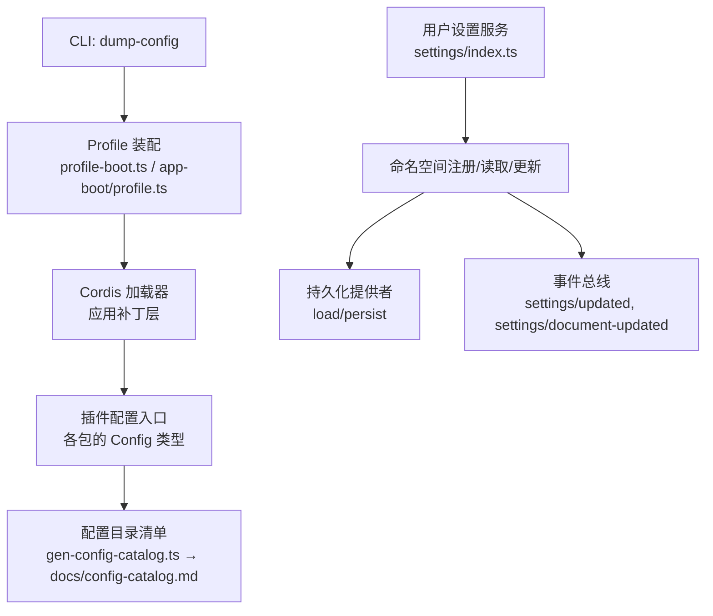
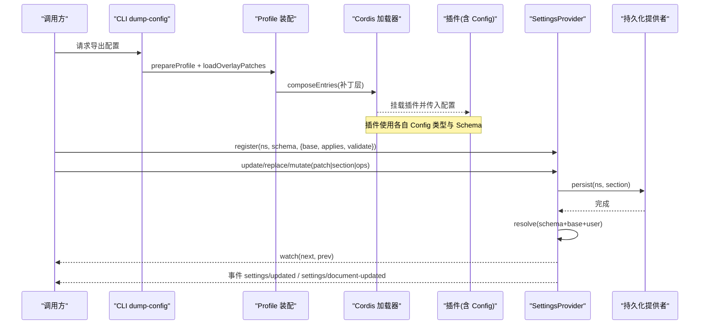
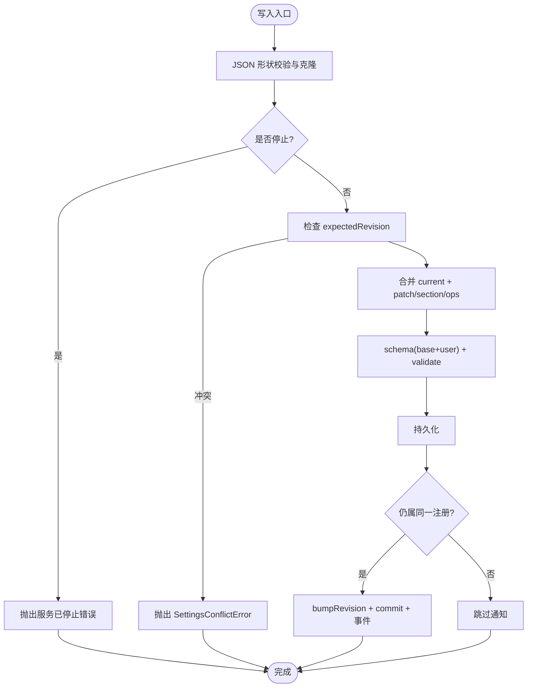
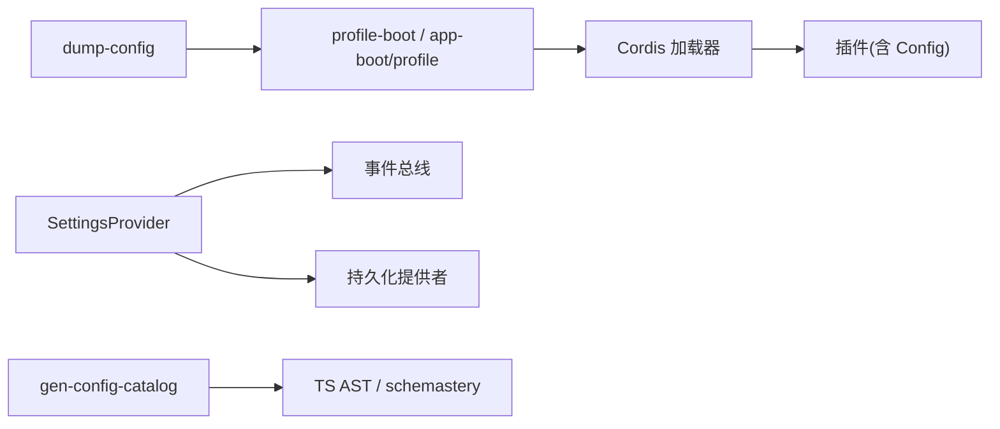

# 配置 API

<cite>
**本文引用的文件**
- [packages/settings/settings/src/index.ts](file://packages/settings/settings/src/index.ts)
- [packages/settings/settings/src/types.ts](file://packages/settings/settings/src/types.ts)
- [scripts/gen-config-catalog.ts](file://scripts/gen-config-catalog.ts)
- [docs/config-catalog.md](file://docs/config-catalog.md)
- [apps/cli/src/dump-config.ts](file://apps/cli/src/dump-config.ts)
- [apps/cli/src/profile-boot.ts](file://apps/cli/src/profile-boot.ts)
- [packages/boot/app-boot/src/profile.ts](file://packages/boot/app-boot/src/profile.ts)
- [scripts/verify-config-source-ownership.ts](file://scripts/verify-config-source-ownership.ts)
</cite>

## 目录
1. [简介](#简介)
2. [项目结构](#项目结构)
3. [核心组件](#核心组件)
4. [架构总览](#架构总览)
5. [详细组件分析](#详细组件分析)
6. [依赖关系分析](#依赖关系分析)
7. [性能考虑](#性能考虑)
8. [故障排查指南](#故障排查指南)
9. [结论](#结论)
10. [附录](#附录)

## 简介
本文件系统化说明 DeepSeek Harness 的配置体系与“配置 API”的使用方式，覆盖以下主题：
- 配置的层次结构与合并策略（包级默认、用户层、环境覆盖、动态热更新）
- 配置文件格式与校验（类型声明、运行时 Schema、文档生成）
- 配置项分组、文档化与类型检查
- 继承与合并规则、权限与安全控制
- 最佳实践与常见问题解决方案
- 配置验证工具与调试方法

## 项目结构
围绕配置能力的关键位置如下：
- 用户设置服务（Settings Provider）：提供命名空间注册、值解析、变更监听、持久化与事件发布
- 配置目录清单（Config Catalog）：自动生成插件可配置项的完整目录，包含类型、JSDoc 与来源
- CLI 配置导出：在不启动进程的情况下输出组合后的配置树
- 配置装配与热重载：Profile 发现、补丁层叠加、HMR 监听与重组合
- 安全校验：禁止在打包配置中内联敏感环境变量

图表来源
- [apps/cli/src/dump-config.ts:1-54](file://apps/cli/src/dump-config.ts#L1-L54)
- [apps/cli/src/profile-boot.ts:1-301](file://apps/cli/src/profile-boot.ts#L1-L301)
- [packages/boot/app-boot/src/profile.ts:1-421](file://packages/boot/app-boot/src/profile.ts#L1-L421)
- [scripts/gen-config-catalog.ts:1-800](file://scripts/gen-config-catalog.ts#L1-L800)
- [packages/settings/settings/src/index.ts:1-800](file://packages/settings/settings/src/index.ts#L1-L800)

章节来源
- [apps/cli/src/dump-config.ts:1-54](file://apps/cli/src/dump-config.ts#L1-L54)
- [apps/cli/src/profile-boot.ts:1-301](file://apps/cli/src/profile-boot.ts#L1-L301)
- [packages/boot/app-boot/src/profile.ts:1-421](file://packages/boot/app-boot/src/profile.ts#L1-L421)
- [scripts/gen-config-catalog.ts:1-800](file://scripts/gen-config-catalog.ts#L1-L800)
- [packages/settings/settings/src/index.ts:1-800](file://packages/settings/settings/src/index.ts#L1-L800)

## 核心组件
- 用户设置服务（SettingsProvider）
  - 命名空间注册与描述：为每个命名空间维护 schema、base 层、用户层、当前值、修订号与生效时机
  - 值解析与合并：按“Schema 默认值 → base → 用户层”顺序合并，并执行自定义 validate
  - 写入路径：update/replace/mutate 三种模式，均进行 JSON 形状校验与序列化克隆
  - 并发与一致性：每命名空间串行写队列；revision 冲突检测；观察者回调有序且隔离
  - 事件：settings/updated（值变化）、settings/document-updated（原始段变化）
- 配置目录清单生成器
  - 扫描所有包入口，提取 Config 类型、JSDoc、引用类型与运行时 Schema 键路径
  - 交叉校验：确保 Schema 中的键都能在类型定义中找到对应成员
  - 输出：docs/config-catalog.md，作为部署轴参考
- CLI 配置导出
  - 将 Profile 的各补丁层（包层、用户层、家目录层、--patch 覆盖层、遥测开关）组合后输出，便于诊断
- Profile 装配与热重载
  - 发现 Profile、解析 bundles、组装补丁层、注入空根配置、监听 cordis.patch.yml 与家目录补丁并重组合
  - 支持遥测开关等命令行派生补丁
- 安全校验
  - 禁止在打包配置中直接内联敏感环境变量形式（如 apiKey/baseURL 等），强制通过凭据通道或环境快照获取

章节来源
- [packages/settings/settings/src/index.ts:1-800](file://packages/settings/settings/src/index.ts#L1-L800)
- [packages/settings/settings/src/types.ts:1-51](file://packages/settings/settings/src/types.ts#L1-L51)
- [scripts/gen-config-catalog.ts:1-800](file://scripts/gen-config-catalog.ts#L1-L800)
- [docs/config-catalog.md:1-800](file://docs/config-catalog.md#L1-L800)
- [apps/cli/src/dump-config.ts:1-54](file://apps/cli/src/dump-config.ts#L1-L54)
- [apps/cli/src/profile-boot.ts:1-301](file://apps/cli/src/profile-boot.ts#L1-L301)
- [packages/boot/app-boot/src/profile.ts:1-421](file://packages/boot/app-boot/src/profile.ts#L1-L421)
- [scripts/verify-config-source-ownership.ts:1-57](file://scripts/verify-config-source-ownership.ts#L1-L57)

## 架构总览
下图展示从 CLI 到插件配置的装配流程，以及用户设置的读写与事件流。

图表来源
- [apps/cli/src/dump-config.ts:1-54](file://apps/cli/src/dump-config.ts#L1-L54)
- [apps/cli/src/profile-boot.ts:1-301](file://apps/cli/src/profile-boot.ts#L1-L301)
- [packages/boot/app-boot/src/profile.ts:1-421](file://packages/boot/app-boot/src/profile.ts#L1-L421)
- [packages/settings/settings/src/index.ts:1-800](file://packages/settings/settings/src/index.ts#L1-L800)

## 详细组件分析

### 用户设置服务（SettingsProvider）
- 命名空间与描述
  - 注册时冻结已解析值，暴露 describe() 返回 schema/value/revisions/base/user/applies 等元信息，供 UI 渲染
- 值解析与合并
  - mergeLayers：对象递归合并，其他类型（含数组）整体替换
  - resolve：先走 schema 默认值，再合并 base，最后合并用户层，并执行 owner 自定义 validate
- 写入与一致性
  - update/replace/mutate：统一进入 write，进行 JSON 形状校验与结构化克隆，避免循环引用与非 JSON 值
  - 每命名空间串行写队列，失败不污染后续写入
  - expectedRevision 冲突检测，抛出 SettingsConflictError
- 观察者与事件
  - watch：按提交顺序串行调用，异常被捕获并记录
  - 事件：settings/updated（值变化）、settings/document-updated（原始段变化，即使值未变也会触发）
- 生命周期
  - init：先 publish 初始文档，dispose 时等待所有写链与观察者收尾

图表来源
- [packages/settings/settings/src/index.ts:577-648](file://packages/settings/settings/src/index.ts#L577-L648)
- [packages/settings/settings/src/index.ts:657-746](file://packages/settings/settings/src/index.ts#L657-L746)

章节来源
- [packages/settings/settings/src/index.ts:1-800](file://packages/settings/settings/src/index.ts#L1-L800)
- [packages/settings/settings/src/types.ts:1-51](file://packages/settings/settings/src/types.ts#L1-L51)

### 配置目录清单（Config Catalog）
- 作用：从包入口提取 Config 类型与 JSDoc，粘贴到 docs/config-catalog.md，形成“部署轴”参考
- 关键能力
  - 类型解析与闭包粘贴：自动收集引用类型，保证 fence 内自包含
  - 成员文档检查：要求每个字段具备 JSDoc 说明
  - Schema 键路径校验：静态遍历 schemastery 表达式，确保每个键都能定位到类型成员
  - 跨包组合：支持 z.intersect 组合多个包的 Config，并展开其键路径
- 使用建议
  - 新增配置项时同步完善 JSDoc 与 Schema
  - 运行 pnpm run gen-config-catalog 与 verify 命令保持文档与代码一致

章节来源
- [scripts/gen-config-catalog.ts:1-800](file://scripts/gen-config-catalog.ts#L1-L800)
- [docs/config-catalog.md:1-800](file://docs/config-catalog.md#L1-L800)

### CLI 配置导出（dump-config）
- 功能：以注释标注每一层的来源，输出组合后的配置树，便于诊断
- 层顺序：包层 → Profile 用户层 → 家目录补丁 → --patch 覆盖层 → 遥测开关
- 适用场景：快速查看最终生效配置、定位覆盖来源

章节来源
- [apps/cli/src/dump-config.ts:1-54](file://apps/cli/src/dump-config.ts#L1-L54)
- [apps/cli/src/profile-boot.ts:1-301](file://apps/cli/src/profile-boot.ts#L1-L301)

### Profile 装配与热重载
- 发现与初始化：根据名称定位 $DSH_HOME/profiles/<name>，不存在则按模板初始化
- 补丁层叠加：bundle patches → profile 用户层 → 家目录补丁 → --patch 覆盖层 → 遥测开关
- 空根配置：每次启动重写空根 cordis.yml，避免重复写入
- 热重载：监听 profile 与家目录补丁文件变化，重新组合并应用到已挂载树
- 遥测开关：基于环境变量禁用特定行 id

章节来源
- [packages/boot/app-boot/src/profile.ts:1-421](file://packages/boot/app-boot/src/profile.ts#L1-L421)
- [apps/cli/src/profile-boot.ts:1-301](file://apps/cli/src/profile-boot.ts#L1-L301)

### 安全与权限控制
- 禁止内联敏感环境变量：打包配置中不得直接使用 !!js 形式的 apiKey/baseURL/authToken/headers 等
- 推荐做法：通过凭据服务或环境快照注入，避免绕过安全通道
- 审计脚本：CI 阶段扫描 shipped 配置，违规即失败

章节来源
- [scripts/verify-config-source-ownership.ts:1-57](file://scripts/verify-config-source-ownership.ts#L1-L57)

## 依赖关系分析
- 组件耦合
  - CLI dump-config 依赖 Profile 装配与补丁加载
  - Profile 装配依赖 Cordis 加载器与补丁合并
  - SettingsProvider 依赖持久化提供者与事件总线
  - 配置目录清单生成器依赖 TypeScript AST 与 schemastery 表达式
- 外部依赖
  - Cordis 框架（上下文、服务、事件、加载器、include）
  - schemastery（运行时 Schema 校验）
  - Node 文件系统与路径工具

图表来源
- [apps/cli/src/dump-config.ts:1-54](file://apps/cli/src/dump-config.ts#L1-L54)
- [apps/cli/src/profile-boot.ts:1-301](file://apps/cli/src/profile-boot.ts#L1-L301)
- [packages/boot/app-boot/src/profile.ts:1-421](file://packages/boot/app-boot/src/profile.ts#L1-L421)
- [packages/settings/settings/src/index.ts:1-800](file://packages/settings/settings/src/index.ts#L1-L800)
- [scripts/gen-config-catalog.ts:1-800](file://scripts/gen-config-catalog.ts#L1-L800)

## 性能考虑
- 值冻结与深比较：解析结果 deepFreeze，减少不必要重渲染与副作用
- 观察者串行化：每个观察者的回调按提交顺序串行执行，避免竞态
- 写队列隔离：单命名空间串行写，失败不影响后续写入
- 只读与不可变：describe 返回 detached 副本，避免外部修改影响内部状态
- 热重载增量：仅对变化的补丁文件重组合，降低开销

[本节为通用指导，无需具体文件引用]

## 故障排查指南
- 常见错误与处理
  - 命名空间未注册：调用 update/replace/mutate 前需先 register
  - 服务已停止：在 dispose 期间写入会抛错，应等待清理完成
  - 只读提供者：writable=false 时无法 in-process 更新
  - 非 JSON 数据：update/replace/mutate 仅接受 JSON 兼容数据，否则拒绝并给出路径
  - 版本冲突：expectedRevision 不匹配时抛出 SettingsConflictError，应重试
  - 无效存储段：publish 时若某命名空间的用户段无效，保留上次有效值并告警
- 调试技巧
  - 使用 dump-config 输出带来源注释的组合配置，定位覆盖来源
  - 订阅 settings/document-updated 监听原始段变化，结合 revision 判断 UI 是否过期
  - 订阅 settings/updated 监听值变化，打印 next/prev 对比差异
  - 使用 gen-config-catalog 与 verify 命令检查类型与 Schema 一致性

章节来源
- [packages/settings/settings/src/index.ts:519-648](file://packages/settings/settings/src/index.ts#L519-L648)
- [packages/settings/settings/src/index.ts:657-746](file://packages/settings/settings/src/index.ts#L657-L746)
- [apps/cli/src/dump-config.ts:1-54](file://apps/cli/src/dump-config.ts#L1-L54)
- [scripts/gen-config-catalog.ts:1-800](file://scripts/gen-config-catalog.ts#L1-L800)

## 结论
DeepSeek Harness 的配置体系通过“分层补丁 + 命名空间设置 + 严格校验 + 热重载”实现了高内聚、可扩展且安全的配置管理：
- 分层清晰：包默认、用户层、家目录层、命令行覆盖、遥测开关
- 类型与文档驱动：Config 类型与 JSDoc 自动生成目录清单，Schema 与类型双向校验
- 安全可控：禁止内联敏感环境变量，凭据与环境快照统一管理
- 可观测与可调试：事件与修订号、配置导出、观察者机制

## 附录

### 配置层次与合并策略
- 层次顺序（由低到高）：
  - 包默认（Schema 默认值与 base）
  - Profile 用户层（cordis.patch.yml）
  - 家目录补丁（$DSH_HOME/cordis.patch.yml）
  - --patch 覆盖层
  - 遥测开关（条件性）
- 合并规则：
  - 对象递归合并，其他类型（含数组）整体替换
  - 用户层缺失键回退至 base/Schema 默认值
  - 运行时 Schema 校验决定最终值形态

章节来源
- [apps/cli/src/profile-boot.ts:121-170](file://apps/cli/src/profile-boot.ts#L121-L170)
- [packages/boot/app-boot/src/profile.ts:405-421](file://packages/boot/app-boot/src/profile.ts#L405-L421)
- [packages/settings/settings/src/index.ts:290-305](file://packages/settings/settings/src/index.ts#L290-L305)

### 环境变量覆盖与动态更新
- 环境变量
  - 遥测开关：DSH_TELEMETRY_DISABLED 可禁用遥测行
  - 凭据与环境快照：通过 ctx.credentials 与 LaunchEnvironmentSnapshot 注入，不在配置中内联
- 动态更新
  - 监听 cordis.patch.yml 与家目录补丁变化，实时重组合并应用到已挂载树
  - 用户设置服务支持 update/replace/mutate 即时更新并持久化

章节来源
- [apps/cli/src/profile-boot.ts:69-83](file://apps/cli/src/profile-boot.ts#L69-L83)
- [apps/cli/src/profile-boot.ts:227-298](file://apps/cli/src/profile-boot.ts#L227-L298)
- [packages/settings/settings/src/index.ts:534-648](file://packages/settings/settings/src/index.ts#L534-L648)

### 配置项分组、文档生成与类型检查
- 分组：每个插件的 Config 类型即一组配置项，可在目录清单中按包名索引
- 文档生成：gen-config-catalog 自动生成 docs/config-catalog.md，包含类型、JSDoc、来源与依赖
- 类型检查：
  - 字段必须具有 JSDoc
  - Schema 键必须在类型定义中存在
  - 跨包组合的键路径会被展开并校验

章节来源
- [scripts/gen-config-catalog.ts:195-213](file://scripts/gen-config-catalog.ts#L195-L213)
- [scripts/gen-config-catalog.ts:719-764](file://scripts/gen-config-catalog.ts#L719-L764)
- [docs/config-catalog.md:1-800](file://docs/config-catalog.md#L1-L800)

### 最佳实践
- 明确分层：将平台相关配置放入 bundle 层，用户偏好放入 profile 或家目录层
- 使用 Schema：为所有配置项提供 Schema，确保运行时校验
- 避免内联敏感信息：通过凭据与服务注入
- 利用事件：订阅 settings/document-updated 感知字段覆盖变化，订阅 settings/updated 响应值变化
- 定期生成与校验：运行 gen-config-catalog 与 verify 保持文档与代码一致

[本节为通用指导，无需具体文件引用]