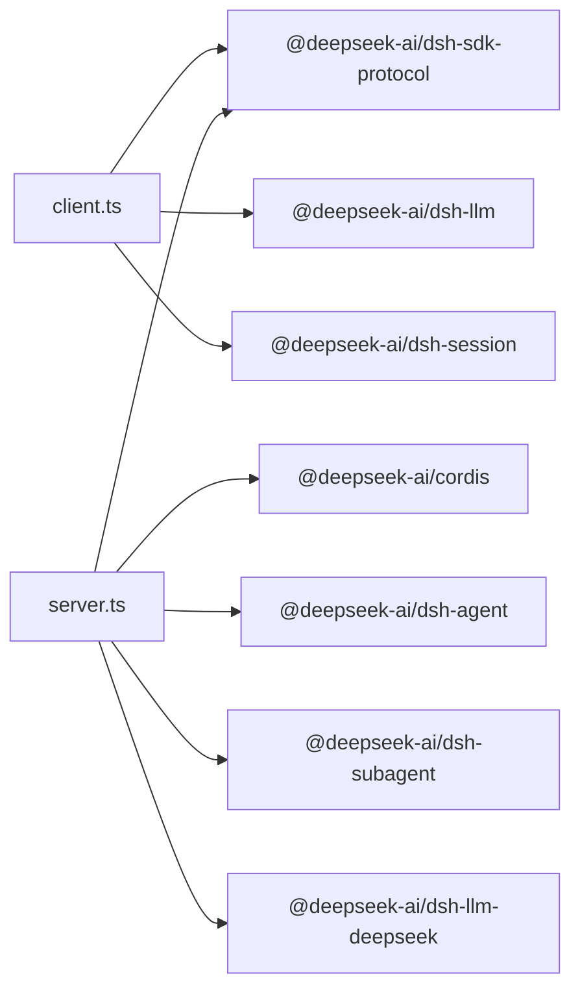

# Node.js SDK

<cite>
**本文引用的文件**
- [packages/sdk/README.md](file://packages/sdk/README.md)
- [packages/sdk/client/src/index.ts](file://packages/sdk/client/src/index.ts)
- [packages/sdk/client/src/api.ts](file://packages/sdk/client/src/api.ts)
- [packages/sdk/client/src/client.ts](file://packages/sdk/client/src/client.ts)
- [packages/sdk/client/src/types.ts](file://packages/sdk/client/src/types.ts)
- [packages/sdk/protocol/src/index.ts](file://packages/sdk/protocol/src/index.ts)
- [packages/sdk/protocol/src/types.ts](file://packages/sdk/protocol/src/types.ts)
- [packages/sdk/server/src/index.ts](file://packages/sdk/server/src/index.ts)
- [packages/sdk/server/src/server.ts](file://packages/sdk/server/src/server.ts)
</cite>

## 目录
1. [简介](#简介)
2. [项目结�](#项目结�)
3. [核心组件](#核心组件)
4. [��总览](#��总览)
5. [详细组件分�](#详细组件分�)
6. [�赖关系分�](#�赖关系分�)
7. [性能�超时�置](#性能�超时�置)
8. [错误处��调试](#错误处��调试)
9. [使用示例�最佳�践](#使用示例�最佳�践)
10. [结论](#结论)

## 简介
本 SDK �供在 Node.js 中驱动 DeepSeek Harness �行时（�进程）的客户端��议层��务端�件。通过标准输入输出上的 JSON-RPC 行�传输，客户端�创建会����消��订阅事件并管�生命周期；�务端�件将请求路由到 Cordis 上下文中的 Agent/Session/Subagent 等能力，并以通知形����行期事件。该设计使 TypeScript � Python SDK 共享�一�议��行时边界，便�跨语言集��自动化编�。

## 项目结�
SDK 由三个�作包组�：
- protocol：定义跨进程通信的 JSON-RPC 类��传输抽象
- client：�装�进程�动��手�会��通知订阅的高/�层 API
- server：作为 Cordis �件暴露 JSON-RPC �务，桥�到宿主�行时

```mermaid
graph TB
subgraph "调用方进程"
A["应用代�"]
B["DeepSeekHarness<br/>高层API"]
C["HarnessClient<br/>JSON-RPC客户端"]
end
subgraph "�行时进程"
D["Cordis Context"]
E["HarnessSdkJsonRpcServer<br/>JSON-RPC�务器"]
F["Agent/Session/Subagent<br/>�行时能力"]
end
A --> B --> C
C < --> |stdio JSON-RPC| E
E --> D --> F
```

图表��
- [packages/sdk/client/src/api.ts:22-119](file://packages/sdk/client/src/api.ts#L22-L119)
- [packages/sdk/client/src/client.ts:184-458](file://packages/sdk/client/src/client.ts#L184-L458)
- [packages/sdk/server/src/index.ts:46-92](file://packages/sdk/server/src/index.ts#L46-L92)
- [packages/sdk/server/src/server.ts:53-241](file://packages/sdk/server/src/server.ts#L53-L241)

章节��
- [packages/sdk/README.md:1-12](file://packages/sdk/README.md#L1-L12)

## 核心组件
- �议层（protocol）
  - 传输：基� stdio 的 JSON-RPC 行�传输
  - 方法：initialize�session/prompt�shutdown
  - 通知：session.event�session.status�subagent.started�subagent.finished
- 客户端（client）
  - 高层：DeepSeekHarness�HarnessSession
  - �层：HarnessClient（�进程管��请求/通知�超时�关闭）
  - 类�：Launch 选项�RunResult�NotificationFilter 等
- �务端（server）
  - �件入�：apply(ctx, config)
  - �务器：HarnessSdkJsonRpcServer（会�创建�事件转��关闭清�）

章节��
- [packages/sdk/protocol/src/index.ts:1-26](file://packages/sdk/protocol/src/index.ts#L1-L26)
- [packages/sdk/protocol/src/types.ts:15-105](file://packages/sdk/protocol/src/types.ts#L15-L105)
- [packages/sdk/client/src/index.ts:1-30](file://packages/sdk/client/src/index.ts#L1-L30)
- [packages/sdk/client/src/types.ts:11-75](file://packages/sdk/client/src/types.ts#L11-L75)
- [packages/sdk/server/src/index.ts:1-93](file://packages/sdk/server/src/index.ts#L1-L93)
- [packages/sdk/server/src/server.ts:1-241](file://packages/sdk/server/src/server.ts#L1-L241)

## ��总览
下图展示一次“��消�并等待空闲�的端到端�程：客户端�起 prompt，�务端入队消�，��以 session.event/session.status 等通知���，直到目标会�进入 idle。

```mermaid
sequenceDiagram
participant App as "应用"
participant H as "DeepSeekHarness/HarnessSession"
participant C as "HarnessClient"
participant T as "JSON-RPC传输"
participant S as "HarnessSdkJsonRpcServer"
participant R as "Cordis/Agent/Session"
App->>H : run(input, options)
H->>C : start()/initialize()
C->>T : initialize(params)
T-->>S : initialize
S-->>T : InitializeResult
T-->>C : InitializeResult
H->>C : prompt(sessionId, contentBlocks)
C->>T : session/prompt
T-->>S : session/prompt
S->>R : followup(user message)
R-->>S : session.event / session.status
S-->>T : notify(...)
T-->>C : notifications
C-->>H : 收集至idle
H-->>App : RunResult{sessionId, finalResponse, events, notifications}
```



图表��
- [packages/sdk/client/src/api.ts:146-194](file://packages/sdk/client/src/api.ts#L146-L194)
- [packages/sdk/client/src/client.ts:268-333](file://packages/sdk/client/src/client.ts#L268-L333)
- [packages/sdk/server/src/server.ts:111-143](file://packages/sdk/server/src/server.ts#L111-L143)
- [packages/sdk/server/src/server.ts:71-103](file://packages/sdk/server/src/server.ts#L71-L103)

## 详细组件分�

### �议层（protocol）
- 传输�错误
  - JsonRpcLineTransport：基� stdio 的行� JSON-RPC 传输
  - JsonRpcResponseError：表示远端返�的�议级错误
- 命�方法�通知
  - 请求：initialize�session/prompt�shutdown
  - 通知：session.event�session.status�subagent.started�subagent.finished
- 关键类�
  - InitializeParams/InitializeResult：�手�数��务器身份
  - SessionPromptParams/SessionPromptResult：�示入队��执
  - SdkRunStatus：ok/error
  - �通知载�：包� sessionId�event�parent/child 关系�stopReason 等

章节��
- [packages/sdk/protocol/src/index.ts:11-25](file://packages/sdk/protocol/src/index.ts#L11-L25)
- [packages/sdk/protocol/src/types.ts:15-105](file://packages/sdk/protocol/src/types.ts#L15-L105)

### 客户端（client）
- HarnessClient（�层）
  - �进程生命周期：start/close，内部维护 stdin/stdout/stderr 管�，EOF→SIGTERM→SIGKILL �收阶梯
  - 请求�超时：request(method, params?, timeoutMs?)，支� per-call 超时� AbortController 放弃
  - 通知订阅：subscribe(filter)�subscribeSessionTree(rootSessionId)，支� next()/tryNext()/async iteration
  - 错误类�：TransportClosedError�RequestTimeoutError�SdkProtocolError
- DeepSeekHarness（高层）
  - �动��手：start() 懒�动�进程并执行 initialize，失败时自动�建客户端并�试（除�已 close）
  - 会���行：session(id?) 打开会�；run(input, options) ���示并收集到 idle，返� RunResult
  - 资�清�：close() 或 await using 确��进程被�收
- 类��数�模�
  - HarnessClientOptions：command/args/cwd/env/requestTimeoutMs/shutdownTimeoutMs/disposeEofGraceMs/disposeGraceMs
  - DeepSeekHarnessOptions：launch + cwd/provider/model/maxTokens
  - RunResult：sessionId/finalResponse/events/notifications
  - NotificationFilter：过滤通知的谓�

```mermaid
classDiagram
class HarnessClient {
+constructor(options)
+start() void
+initialize(params) Promise
+prompt(sessionId, contentBlocks) Promise
+request(method, params?, timeoutMs?) Promise
+subscribe(filter?) NotificationSubscription
+subscribeSessionTree(sessionId) NotificationSubscription
+close() Promise
}
class NotificationSubscription {
+next() Promise
+tryNext() HarnessNotification|undefined
+close() void
}
class DeepSeekHarness {
+constructor(options)
+start() Promise
+session(id?) HarnessSession
+run(input, options?) Promise
+close() Promise
}
class HarnessSession {
+id string
+run(input, options?) Promise
}
DeepSeekHarness --> HarnessClient : "拥有"
DeepSeekHarness --> HarnessSession : "创建"
HarnessSession --> DeepSeekHarness : "�有"
```



图表��
- [packages/sdk/client/src/client.ts:184-458](file://packages/sdk/client/src/client.ts#L184-L458)
- [packages/sdk/client/src/api.ts:22-194](file://packages/sdk/client/src/api.ts#L22-L194)

章节��
- [packages/sdk/client/src/client.ts:184-458](file://packages/sdk/client/src/client.ts#L184-L458)
- [packages/sdk/client/src/api.ts:22-194](file://packages/sdk/client/src/api.ts#L22-L194)
- [packages/sdk/client/src/types.ts:22-75](file://packages/sdk/client/src/types.ts#L22-L75)

### �务端（server）
- �件入� apply(ctx, config)
  - 建立 JsonRpcLineTransport 并�动
  - 注册 onRequest/onNotification，处� shutdown � flush+dispose+exit
- HarnessSdkJsonRpcServer
  - initialize：记录 cwd/provider/model/maxTokens，按需挂载 LLM 适�器
  - prompt：查找或创建会�，校验存活�投递用户消�
  - 事件转�：session/event�agent/status�session/created�subagent/end
  - shutdown：有�释放订阅�会��柄��选 LLM Fiber，��异常

```mermaid
flowchart TD
Start(["收到请求"]) --> M{"方法�?"}
M --> |initialize| Init["�始化cwd/provider/model/maxTokens"]
M --> |session/prompt| Prompt["getOrCreateSession -> followup"]
M --> |shutdown| Shut["performShutdown: 释放订阅/会�/Fiber"]
Init --> End(["返�结�"])
Prompt --> End
Shut --> End
```



图表��
- [packages/sdk/server/src/index.ts:46-92](file://packages/sdk/server/src/index.ts#L46-L92)
- [packages/sdk/server/src/server.ts:111-241](file://packages/sdk/server/src/server.ts#L111-L241)

章节��
- [packages/sdk/server/src/index.ts:1-93](file://packages/sdk/server/src/index.ts#L1-L93)
- [packages/sdk/server/src/server.ts:1-241](file://packages/sdk/server/src/server.ts#L1-L241)

## �赖关系分�
- 客户端�赖
  - node:child_process：�进程管�
  - @deepseek-ai/dsh-sdk-protocol：传输�类�
  - @deepseek-ai/dsh-llm：ContentBlock 类�
  - @deepseek-ai/dsh-session：SessionEvent 类�
- �务端�赖
  - @deepseek-ai/cordis：Context��件机制
  - @deepseek-ai/dsh-sdk-protocol：传输�类�
  - @deepseek-ai/dsh-agent/dsh-session/dsh-subagent：会���代�能力
  - @deepseek-ai/dsh-llm-deepseek：按需挂载默认 LLM 适�器



图表��
- [packages/sdk/client/src/client.ts:15-25](file://packages/sdk/client/src/client.ts#L15-L25)
- [packages/sdk/server/src/server.ts:8-16](file://packages/sdk/server/src/server.ts#L8-L16)

章节��
- [packages/sdk/client/src/client.ts:15-25](file://packages/sdk/client/src/client.ts#L15-L25)
- [packages/sdk/server/src/server.ts:8-16](file://packages/sdk/server/src/server.ts#L8-L16)

## 性能�超时�置
- 请求超时
  - requestTimeoutMs：全局默认；request 支� per-call 覆盖
  - 建议：为长任务设置��上�，��悬挂请求�用资�
- 关闭��收
  - shutdownTimeoutMs：�议 shutdown 交�上�
  - disposeEofGraceMs/disposeGraceMs：stdin EOF � SIGTERM/SIGKILL 确认窗�
  - 建议：根��境调整，确��进程�时�收
- 事件收集
  - subscribeSessionTree：按根会���代�树过滤，�少无关事件处�开销
  - onNotification：在高��场景下���计算，仅�必��盘或指标上报
- 内存�缓冲
  - stderr 尾部�制：防止�外退出时日志过大
  - 通知队列：订阅��内部队列，注��时消费以��积�

[本节为通用指导，�直�分�具体文件]

## 错误处��调试
- 错误类�
  - TransportClosedError：�进程��用（退出�管�关闭�未�动），附带退出�� stderr 尾部
  - RequestTimeoutError：请求超过超时阈值
  - SdkProtocolError：�应�符��议约定（如缺少 messageId）
  - JsonRpcResponseError：远端返�的�议错误（�留 code/data）
- 调试技巧
  - æ�•è�· stderr 尾部：TransportClosedError 中包å�«æœ€è¿‘若干行 stderr，有助äº�定ä½�崩溃å�Ÿå›
  - 打�事件�：订阅 session.event 并观察 agent/inbox/spliced �执，确认消�入队�功
  - 会�状�：监� session.status �化，确认 idle/running 转�
  - �代�链路：利用 subagent.started/finished �建父�关系，�查�代�行为
- 资�清�
  - 始终调用 close() 或使用 await using，确��进程被�收
  - 关闭订阅：��需�时调用 subscription.close()，��残留等待者

章节��
- [packages/sdk/client/src/client.ts:38-65](file://packages/sdk/client/src/client.ts#L38-L65)
- [packages/sdk/client/src/client.ts:301-333](file://packages/sdk/client/src/client.ts#L301-L333)
- [packages/sdk/client/src/client.ts:436-457](file://packages/sdk/client/src/client.ts#L436-L457)
- [packages/sdk/server/src/server.ts:155-181](file://packages/sdk/server/src/server.ts#L155-L181)

## 使用示例�最佳�践
以下为常�使用模��步骤指引（以路径引用代替代�片段）：

- 快速开始：�动��手��行一轮对�
  - �考：[packages/sdk/client/src/api.ts:62-100](file://packages/sdk/client/src/api.ts#L62-L100)
  - �点：�造 DeepSeekHarness，调用 run() 自动完� start()/initialize()，返� RunResult

- 异步会��消���
  - �考：[packages/sdk/client/src/client.ts:268-290](file://packages/sdk/client/src/client.ts#L268-L290)
  - �点：prompt() 立�返� messageId，�续通过事件�确认入队�处�

- 工具调用�事件处�
  - �考：[packages/sdk/server/src/server.ts:71-103](file://packages/sdk/server/src/server.ts#L71-L103)
  - �点：订阅 session.event ��工具执行细节；通过 subagent.* 跟踪�代�

- 文件�作�代�执行（通过�行时工具）
  - 说�：文件�代�执行由�行时�件�供（如 Bash�FS�PTY），SDK 侧通过事件�最终�应观察结�
  - �考：[packages/sdk/server/src/server.ts:111-143](file://packages/sdk/server/src/server.ts#L111-L143)

- �代�调用
  - �考：[packages/sdk/server/src/server.ts:78-103](file://packages/sdk/server/src/server.ts#L78-L103)
  - �点：利用 subagent.started/finished �父/�会�关系进行追踪���

- 错误处��超时
  - �考：[packages/sdk/client/src/client.ts:301-333](file://packages/sdk/client/src/client.ts#L301-L333)
  - �点：�� RequestTimeoutError/TransportClosedError/SdkProtocolError，结� stderr 尾部诊断

- 资�清�
  - �考：[packages/sdk/client/src/api.ts:107-118](file://packages/sdk/client/src/api.ts#L107-L118)
  - �考：[packages/sdk/client/src/client.ts:380-401](file://packages/sdk/client/src/client.ts#L380-L401)
  - �点：使用 close() 或 await using；确�所有订阅被关闭

- 类�定义速查
  - 客户端选项�结�：[packages/sdk/client/src/types.ts:22-75](file://packages/sdk/client/src/types.ts#L22-L75)
  - �议类��方法：[packages/sdk/protocol/src/types.ts:15-105](file://packages/sdk/protocol/src/types.ts#L15-L105)

[本节为使用指�，�直�分�具体文件]

## 结论
本 SDK 通过清晰的三层设计（�议/客户端/�务端）��了跨进程的 Harness �行时�制。客户端�供高层易用 API ��层�活�制，�务端�件将请求安全地映射到 Cordis 上下文的能力。借助完善的错误类��超时�资�管�机制，开�者�以稳定地�建自动化工作���代�编��事件驱动的交互系统。建议在工程中统一�置超时�清�策略，并通过事件�进行观测�调试，以�得更好的�维护性��观测性。