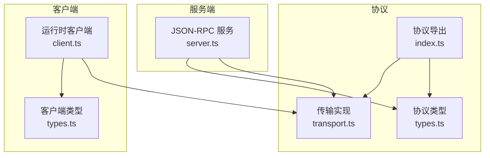
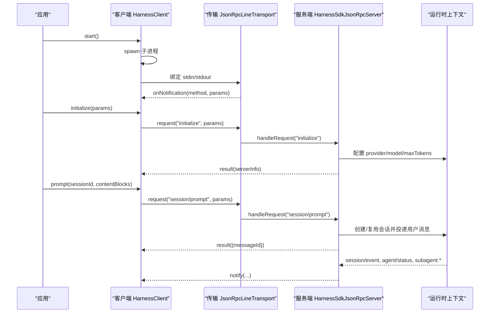
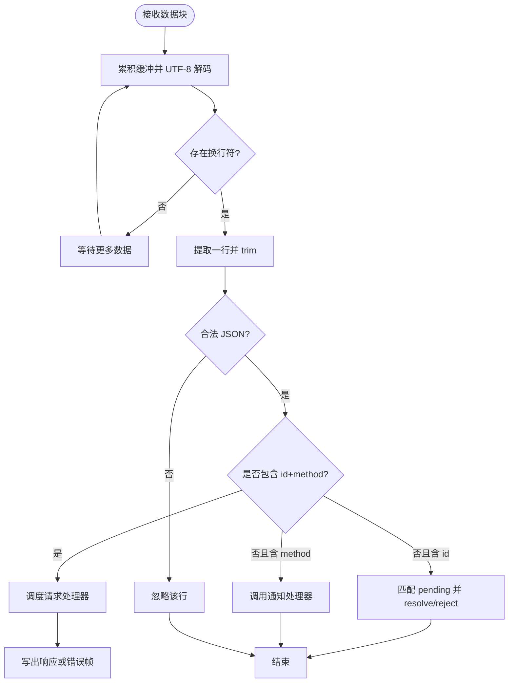
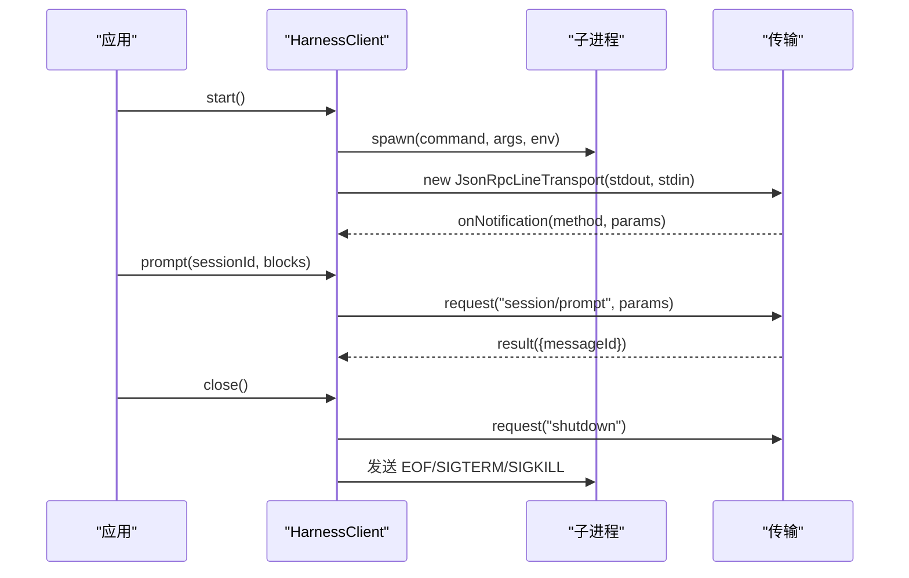
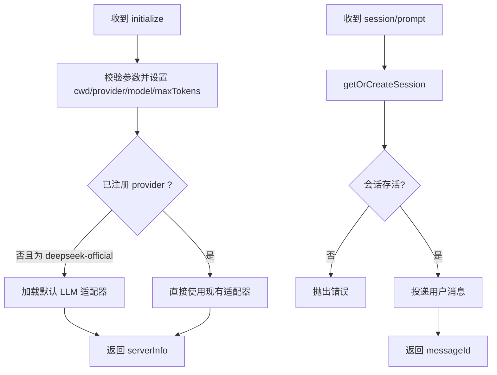
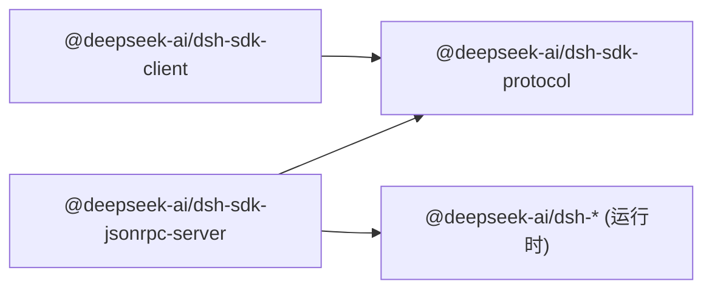

# 协议层

<cite>
**本文引用的文件**
- [packages/sdk/protocol/src/index.ts](file://packages/sdk/protocol/src/index.ts)
- [packages/sdk/protocol/src/transport.ts](file://packages/sdk/protocol/src/transport.ts)
- [packages/sdk/protocol/src/types.ts](file://packages/sdk/protocol/src/types.ts)
- [packages/sdk/protocol/tests/transport.spec.ts](file://packages/sdk/protocol/tests/transport.spec.ts)
- [packages/sdk/client/src/client.ts](file://packages/sdk/client/src/client.ts)
- [packages/sdk/client/src/types.ts](file://packages/sdk/client/src/types.ts)
- [packages/sdk/server/src/server.ts](file://packages/sdk/server/src/server.ts)
</cite>

## 目录
1. [简介](#简介)
2. [项目结构](#项目结构)
3. [核心组件](#核心组件)
4. [架构总览](#架构总览)
5. [详细组件分析](#详细组件分析)
6. [依赖关系分析](#依赖关系分析)
7. [性能考虑](#性能考虑)
8. [故障排查指南](#故障排查指南)
9. [结论](#结论)
10. [附录](#附录)

## 简介
本文件面向 Node.js SDK 的协议层，系统性阐述传输层抽象、消息格式与序列化机制，解释 Transport 接口的设计原理与实现方式，说明协议类型定义、消息路由与错误传播机制，并覆盖 WebSocket、HTTP 等传输方式的适配思路。文档同时提供自定义传输层的开发指南、最佳实践、版本兼容性、安全考量与性能优化策略，并通过具体代码路径展示如何扩展和定制协议行为。

## 项目结构
协议层由三个主要部分组成：
- 协议类型与导出：集中定义 JSON-RPC 方法、参数、结果与通知的类型，以及对外导出的传输能力。
- 传输层：基于换行分隔的 JSON-RPC 2.0 在字节流上实现请求/响应/通知的可靠收发、错误映射与中止支持。
- 客户端与服务端：客户端负责启动运行时子进程、建立传输、发起请求与订阅通知；服务端将运行时事件桥接到协议通知，并将外部请求分发到内部会话与会话代理。



图示来源
- [packages/sdk/protocol/src/index.ts:1-26](file://packages/sdk/protocol/src/index.ts#L1-L26)
- [packages/sdk/protocol/src/types.ts:1-106](file://packages/sdk/protocol/src/types.ts#L1-L106)
- [packages/sdk/protocol/src/transport.ts:1-280](file://packages/sdk/protocol/src/transport.ts#L1-L280)
- [packages/sdk/client/src/client.ts:1-474](file://packages/sdk/client/src/client.ts#L1-L474)
- [packages/sdk/client/src/types.ts:1-75](file://packages/sdk/client/src/types.ts#L1-L75)
- [packages/sdk/server/src/server.ts:1-241](file://packages/sdk/server/src/server.ts#L1-L241)

章节来源
- [packages/sdk/protocol/src/index.ts:1-26](file://packages/sdk/protocol/src/index.ts#L1-L26)
- [packages/sdk/protocol/src/types.ts:1-106](file://packages/sdk/protocol/src/types.ts#L1-L106)
- [packages/sdk/protocol/src/transport.ts:1-280](file://packages/sdk/protocol/src/transport.ts#L1-L280)
- [packages/sdk/client/src/client.ts:1-474](file://packages/sdk/client/src/client.ts#L1-L474)
- [packages/sdk/client/src/types.ts:1-75](file://packages/sdk/client/src/types.ts#L1-L75)
- [packages/sdk/server/src/server.ts:1-241](file://packages/sdk/server/src/server.ts#L1-L241)

## 核心组件
- 传输抽象与实现
  - JsonRpcTransportPeer：定义 request 与 notify 两个出站能力，屏蔽底层 IO。
  - JsonRpcLineTransport：基于可读/可写流的换行分隔 JSON-RPC 2.0 实现，处理帧解析、请求挂起、通知分发、错误映射与中止信号。
- 协议类型
  - 初始化握手：InitializeParams / InitializeResult
  - 会话提示：SessionPromptParams / SessionPromptResult
  - 通知集合：HarnessSdkNotificationMap（session.event、session.status、subagent.started、subagent.finished）
  - 请求集合：HarnessSdkRequestMap（initialize、session/prompt、shutdown）
- 客户端 HarnessClient
  - 管理子进程生命周期、建立传输、发起请求（含超时）、订阅通知（含会话树过滤）。
- 服务端 HarnessSdkJsonRpcServer
  - 注册 JSON-RPC 方法处理器，订阅运行时事件并转换为协议通知，维护会话与资源清理。

章节来源
- [packages/sdk/protocol/src/transport.ts:30-110](file://packages/sdk/protocol/src/transport.ts#L30-L110)
- [packages/sdk/protocol/src/types.ts:15-105](file://packages/sdk/protocol/src/types.ts#L15-L105)
- [packages/sdk/client/src/client.ts:175-474](file://packages/sdk/client/src/client.ts#L175-L474)
- [packages/sdk/server/src/server.ts:48-241](file://packages/sdk/server/src/server.ts#L48-L241)

## 架构总览
SDK 协议采用“进程内/进程外”解耦设计：客户端通过子进程标准输入输出运行一个独立的运行时服务，双方以换行分隔的 JSON-RPC 2.0 通信。客户端负责进程管理与请求/通知编排，服务端负责将运行时事件（会话日志、状态变化、子代理生命周期）广播给客户端。



图示来源
- [packages/sdk/client/src/client.ts:203-260](file://packages/sdk/client/src/client.ts#L203-L260)
- [packages/sdk/protocol/src/transport.ts:121-173](file://packages/sdk/protocol/src/transport.ts#L121-L173)
- [packages/sdk/server/src/server.ts:111-143](file://packages/sdk/server/src/server.ts#L111-L143)
- [packages/sdk/server/src/server.ts:71-103](file://packages/sdk/server/src/server.ts#L71-L103)

## 详细组件分析

### 传输层：JsonRpcTransportPeer 与 JsonRpcLineTransport
- 设计要点
  - 出站抽象：request/notify 统一封装，调用方无需关心帧构造与路由。
  - 入站解析：按行读取、UTF-8 解码、忽略非法帧、区分请求/响应/通知三类帧。
  - 请求挂起：为每个请求分配唯一 id，维护 pending Map，响应到达后 resolve/reject。
  - 错误映射：未找到方法返回 -32601，处理器抛错返回 -32603；结构化 error 对象保留 code/message/data。
  - 中止支持：request 接受 AbortSignal，提前中止会移除 pending 并拒绝。
  - 流式屏障：flush 等待之前所有写入完成，便于上层做同步点。
- 复杂度与性能
  - 解析 O(n) 逐行扫描；pending 查找 O(1)；内存占用与并发请求数线性相关。
  - 使用 StringDecoder 避免多字节字符截断问题。
- 错误与边界
  - 输入关闭或错误时，立即拒绝所有 pending 请求。
  - 写入失败直接拒绝对应请求。
  - 无 handler 的通知被丢弃，符合 JSON-RPC 规范。



图示来源
- [packages/sdk/protocol/src/transport.ts:175-268](file://packages/sdk/protocol/src/transport.ts#L175-L268)

章节来源
- [packages/sdk/protocol/src/transport.ts:17-280](file://packages/sdk/protocol/src/transport.ts#L17-L280)
- [packages/sdk/protocol/tests/transport.spec.ts:14-308](file://packages/sdk/protocol/tests/transport.spec.ts#L14-L308)

### 协议类型与消息路由
- 请求/结果
  - initialize：传递 cwd/provider/model/maxTokens，返回 serverInfo（name/version）。
  - session/prompt：传入 sessionId 与内容块，返回 messageId。
  - shutdown：用于优雅关闭。
- 通知
  - session.event：会话日志事件，携带 sessionId 与完整事件包。
  - session.status：会话整体状态（idle/running）。
  - subagent.started/subagent.finished：子代理生命周期，包含 parent/child 会话关系与运行结果。
- 路由机制
  - 服务端通过 switch 将方法名分派到具体处理器；未知方法抛出异常，由传输层转为 -32601。
  - 通知由运行时事件驱动，服务端统一通过 transport.notify 发出。

```mermaid
classDiagram
class HarnessSdkRequestMap {
+ "initialize" : {params, result}
+ "session/prompt" : {params, result}
+ "shutdown" : {params, result}
}
class HarnessSdkNotificationMap {
+ "session.event"
+ "session.status"
+ "subagent.started"
+ "subagent.finished"
}
class InitializeParams {
+cwd
+provider
+model
+maxTokens?
}
class InitializeResult {
+serverInfo
}
class SessionPromptParams {
+sessionId
+contentBlocks
}
class SessionPromptResult {
+messageId
}
class SessionEventNotification {
+sessionId
+event
}
class SessionStatusNotification {
+sessionId
+status
}
class SubagentStartedNotification {
+parentSessionId
+childSessionId
}
class SubagentFinishedNotification {
+provider
+agentId
+parentSessionId
+childSessionId
+status
+stopReason
+lastAssistantMessage?
}
HarnessSdkRequestMap --> InitializeParams
HarnessSdkRequestMap --> InitializeResult
HarnessSdkRequestMap --> SessionPromptParams
HarnessSdkRequestMap --> SessionPromptResult
HarnessSdkNotificationMap --> SessionEventNotification
HarnessSdkNotificationMap --> SessionStatusNotification
HarnessSdkNotificationMap --> SubagentStartedNotification
HarnessSdkNotificationMap --> SubagentFinishedNotification
```

图示来源
- [packages/sdk/protocol/src/types.ts:15-105](file://packages/sdk/protocol/src/types.ts#L15-L105)

章节来源
- [packages/sdk/protocol/src/types.ts:15-105](file://packages/sdk/protocol/src/types.ts#L15-L105)
- [packages/sdk/server/src/server.ts:190-201](file://packages/sdk/server/src/server.ts#L190-L201)

### 客户端：HarnessClient
- 进程管理
  - 懒启动子进程，绑定 stdio 到传输层，监听 stderr 尾部用于诊断。
  - 退出/关闭时执行 EOF → SIGTERM → SIGKILL 的阶梯式销毁流程。
- 请求与超时
  - request 支持可选超时，内部使用 AbortController 放弃挂起请求。
  - 对协议错误原样抛出 JsonRpcResponseError；对传输/进程错误包装为 TransportClosedError。
- 通知订阅
  - subscribe：按过滤器投递通知，支持 next/tryNext/异步迭代。
  - subscribeSessionTree：基于 subagent.started 构建父子关系，仅投递目标会话及其后代的事件。
- 健壮性
  - 子进程启动失败、stdin 写入 EPIPE、exit/close 事件均被妥善处理，避免悬挂请求。



图示来源
- [packages/sdk/client/src/client.ts:203-260](file://packages/sdk/client/src/client.ts#L203-L260)
- [packages/sdk/client/src/client.ts:301-333](file://packages/sdk/client/src/client.ts#L301-L333)
- [packages/sdk/client/src/client.ts:380-401](file://packages/sdk/client/src/client.ts#L380-L401)

章节来源
- [packages/sdk/client/src/client.ts:175-474](file://packages/sdk/client/src/client.ts#L175-L474)
- [packages/sdk/client/src/types.ts:22-75](file://packages/sdk/client/src/types.ts#L22-L75)

### 服务端：HarnessSdkJsonRpcServer
- 方法实现
  - initialize：校验 maxTokens，设置 cwd/provider/model，按需挂载 LLM 适配器。
  - prompt：获取或创建会话，校验存活，投递用户消息，返回 messageId。
  - shutdown：取消订阅、释放会话与适配器，聚合异常。
- 事件桥接
  - 订阅 session/event、agent/status、session/created、subagent/end，转换为协议通知。
  - 子代理结束仅报告本地子代理，包含 provider、agentId、parent/child 关系与停止原因。
- 会话管理
  - 使用 Map 缓存会话句柄，并发创建时使用 Promise 去重，避免重复创建。



图示来源
- [packages/sdk/server/src/server.ts:111-143](file://packages/sdk/server/src/server.ts#L111-L143)
- [packages/sdk/server/src/server.ts:203-235](file://packages/sdk/server/src/server.ts#L203-L235)

章节来源
- [packages/sdk/server/src/server.ts:48-241](file://packages/sdk/server/src/server.ts#L48-L241)

## 依赖关系分析
- 模块耦合
  - protocol 层不依赖 client/server，保持纯协议与传输实现。
  - client 依赖 protocol 的传输与类型，并管理子进程。
  - server 依赖 protocol 的传输与类型，并集成运行时上下文。
- 外部依赖
  - 运行时事件来自 @deepseek-ai/dsh-session、@deepseek-ai/dsh-subagent 等。
  - 内容块类型来自 @deepseek-ai/dsh-llm。
- 潜在循环
  - 当前结构无循环依赖；协议层作为稳定契约，client/server 分别实现两端。



图示来源
- [packages/sdk/protocol/src/index.ts:1-26](file://packages/sdk/protocol/src/index.ts#L1-L26)
- [packages/sdk/client/src/client.ts:15-25](file://packages/sdk/client/src/client.ts#L15-L25)
- [packages/sdk/server/src/server.ts:8-26](file://packages/sdk/server/src/server.ts#L8-L26)

章节来源
- [packages/sdk/protocol/src/index.ts:1-26](file://packages/sdk/protocol/src/index.ts#L1-L26)
- [packages/sdk/client/src/client.ts:15-25](file://packages/sdk/client/src/client.ts#L15-L25)
- [packages/sdk/server/src/server.ts:8-26](file://packages/sdk/server/src/server.ts#L8-L26)

## 性能考虑
- 传输层
  - 逐行解析避免大对象驻留；pending Map 控制内存增长。
  - flush 提供写入屏障，适合需要顺序保证的场景。
  - 支持 AbortSignal，及时释放挂起请求，减少资源泄漏。
- 客户端
  - 请求超时避免长尾阻塞；stderr 尾部限制防止内存膨胀。
  - 通知订阅队列与 waiters 列表按需消费，避免堆积。
- 服务端
  - 会话创建去重，避免重复工作。
  - 关闭阶段使用 Promise.allSettled 并行释放资源，缩短停机时间。

[本节为通用指导，不直接分析具体文件]

## 故障排查指南
- 常见错误与定位
  - 方法未找到：检查服务端是否注册了对应方法；传输层会返回 -32601。
  - 处理器异常：传输层返回 -32603；客户端捕获 JsonRpcResponseError。
  - 传输关闭：子进程退出或管道关闭会导致请求拒绝；客户端包装为 TransportClosedError 并附带 exit code 与 stderr 尾部。
  - 协议违规：客户端对 initialize/prompt 返回值进行形状校验，不合规抛出 SdkProtocolError。
- 调试建议
  - 启用 stderr 收集，结合 exit code 快速定位崩溃原因。
  - 使用 subscribeSessionTree 聚焦特定会话树，缩小噪音。
  - 通过 flush 确保关键帧落盘后再进行后续操作。

章节来源
- [packages/sdk/protocol/src/transport.ts:226-268](file://packages/sdk/protocol/src/transport.ts#L226-L268)
- [packages/sdk/client/src/client.ts:38-65](file://packages/sdk/client/src/client.ts#L38-L65)
- [packages/sdk/client/src/client.ts:268-289](file://packages/sdk/client/src/client.ts#L268-L289)
- [packages/sdk/client/src/client.ts:451-457](file://packages/sdk/client/src/client.ts#L451-L457)

## 结论
该协议层以轻量、健壮的换行分隔 JSON-RPC 2.0 为基础，提供了清晰的传输抽象、严格的类型契约与完善的错误传播机制。客户端与服务端职责清晰，易于扩展与替换传输层。通过合理的超时、中止与资源回收策略，系统在高负载与异常场景下仍保持稳定。

[本节为总结性内容，不直接分析具体文件]

## 附录

### 传输层抽象与实现要点
- 出站接口
  - request(method, params, signal?)：发送请求并等待响应，支持中止。
  - notify(method, params?)：发送通知，无返回值。
- 入站处理
  - onData/drainLines：按行解析，区分请求/响应/通知。
  - handleIncomingRequest/handleIncomingResponse：路由与匹配 pending。
  - writeError/write：统一写出 JSON-RPC 帧。
- 生命周期
  - start/close：安装/卸载监听器，清理 pending。
  - flush：等待写入完成。

章节来源
- [packages/sdk/protocol/src/transport.ts:30-173](file://packages/sdk/protocol/src/transport.ts#L30-L173)
- [packages/sdk/protocol/src/transport.ts:175-268](file://packages/sdk/protocol/src/transport.ts#L175-L268)

### 协议类型与消息路由
- 请求/结果
  - initialize：建立运行时上下文与默认适配器。
  - session/prompt：投递用户消息并返回 messageId。
  - shutdown：优雅关闭。
- 通知
  - session.event/session.status：会话日志与状态。
  - subagent.started/subagent.finished：子代理生命周期。
- 路由
  - 服务端 switch 分派；未知方法抛出异常。

章节来源
- [packages/sdk/protocol/src/types.ts:15-105](file://packages/sdk/protocol/src/types.ts#L15-L105)
- [packages/sdk/server/src/server.ts:190-201](file://packages/sdk/server/src/server.ts#L190-L201)

### 客户端使用示例（路径指引）
- 启动与初始化
  - 参考：[packages/sdk/client/src/client.ts:203-260](file://packages/sdk/client/src/client.ts#L203-L260)
- 发送提示并获取 messageId
  - 参考：[packages/sdk/client/src/client.ts:283-289](file://packages/sdk/client/src/client.ts#L283-L289)
- 订阅通知与会话树
  - 参考：[packages/sdk/client/src/client.ts:342-372](file://packages/sdk/client/src/client.ts#L342-L372)
- 关闭与资源回收
  - 参考：[packages/sdk/client/src/client.ts:380-401](file://packages/sdk/client/src/client.ts#L380-L401)

### 服务端实现示例（路径指引）
- 方法分派
  - 参考：[packages/sdk/server/src/server.ts:190-201](file://packages/sdk/server/src/server.ts#L190-L201)
- 会话创建与消息投递
  - 参考：[packages/sdk/server/src/server.ts:203-235](file://packages/sdk/server/src/server.ts#L203-L235)
- 事件桥接为通知
  - 参考：[packages/sdk/server/src/server.ts:71-103](file://packages/sdk/server/src/server.ts#L71-L103)

### 自定义传输层开发指南
- 实现 JsonRpcTransportPeer
  - 必须实现 request/notify，遵循 JSON-RPC 2.0 帧格式。
  - 建议使用 UUID 生成唯一 id，维护 pending 映射。
- 适配不同传输
  - WebSocket：将帧序列化为字符串，按消息边界拆分；注意心跳与重连。
  - HTTP：可将请求映射为 POST，响应为 JSON；通知需改为轮询或 SSE。
- 错误与中止
  - 将网络错误映射为 Error；支持 AbortSignal 及时释放资源。
- 测试建议
  - 使用 PassThrough 模拟双向流，验证请求/响应/通知与错误路径。
  - 参考：[packages/sdk/protocol/tests/transport.spec.ts:14-308](file://packages/sdk/protocol/tests/transport.spec.ts#L14-L308)

### 版本兼容性与安全
- 版本兼容
  - serverInfo.name/version 用于识别运行时身份与版本；升级时需保持向后兼容。
  - 新增字段应可选，旧客户端忽略未知字段。
- 安全
  - 环境变量隔离：客户端可通过 env 完全控制子进程环境，避免泄露凭证。
  - 输入校验：服务端对 maxTokens 等参数进行严格校验。
  - 最小权限：仅暴露必要方法与通知，减少攻击面。

[本节为通用指导，不直接分析具体文件]

### 性能优化策略
- 批量与节流
  - 通知高频场景可合并或节流，降低下游压力。
- 背压与限流
  - 利用 flush 控制写入节奏；必要时在上层实现背压。
- 资源回收
  - 关闭阶段并行释放，缩短停机时间；避免悬挂请求。

[本节为通用指导，不直接分析具体文件]