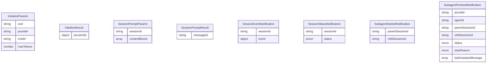
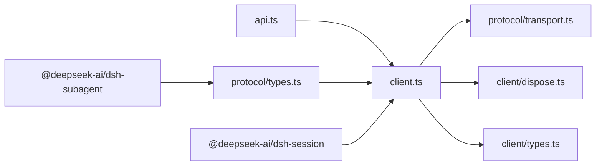

# 客户端 API

<cite>
**本文引用的文件**
- [packages/sdk/client/src/client.ts](file://packages/sdk/client/src/client.ts)
- [packages/sdk/client/src/types.ts](file://packages/sdk/client/src/types.ts)
- [packages/sdk/client/src/api.ts](file://packages/sdk/client/src/api.ts)
- [packages/sdk/protocol/src/types.ts](file://packages/sdk/protocol/src/types.ts)
- [packages/sdk/protocol/src/transport.ts](file://packages/sdk/protocol/src/transport.ts)
- [packages/sdk/client/src/dispose.ts](file://packages/sdk/client/src/dispose.ts)
- [packages/sdk/client/README.zh.md](file://packages/sdk/client/README.zh.md)
</cite>

## 目录
1. [简介](#简介)
2. [项目结�](#项目结�)
3. [核心组件](#核心组件)
4. [��总览](#��总览)
5. [详细组件分�](#详细组件分�)
6. [�赖关系分�](#�赖关系分�)
7. [性能�超时�置](#性能�超时�置)
8. [故障�查指�](#故障�查指�)
9. [结论](#结论)
10. [附录：类�定义�使用示例](#附录类�定义�使用示例)

## 简介
本文件�� Node.js SDK 客户端，系统性说� DeepSeekHarnessClient（� HarnessClient）�高层�装 DeepSeekHarness 的�造��置�生命周期管��异步会�创建�消����工具调用�事件处�机制。�时覆盖��管��错误处��资�清�策略，并�供完整的类�定义说��常�使用模�示例路径，帮助开�者在�进程�行时之上�建稳定��的 Agent 工作�。

## 项目结�
SDK 客户端由三层组�：
- �议层：JSON-RPC 行�传输��议类�定义
- 客户端层：�层 JSON-RPC 客户端 HarnessClient，负责�进程生命周期�请求/通知�订阅
- 高层 API：DeepSeekHarness/HarnessSession，�供 run() 等易用��，�装会��事件收集

```mermaid
graph TB
subgraph "应用"
App["你的应用代�"]
end
subgraph "SDK 客户端"
HSH["DeepSeekHarness<br/>高层API"]
HS["HarnessSession<br/>会��柄"]
HC["HarnessClient<br/>�层客户端"]
TR["JsonRpcLineTransport<br/>JSON-RPC 传输"]
end
subgraph "�行时"
RT["�进程�行时<br/>dsh-jsonrpc-agent"]
end
App --> HSH
HSH --> HS
HSH --> HC
HS --> HC
HC --> TR
TR < --> RT
```

图表��
- [packages/sdk/client/src/api.ts:22-119](file://packages/sdk/client/src/api.ts#L22-L119)
- [packages/sdk/client/src/client.ts:184-458](file://packages/sdk/client/src/client.ts#L184-L458)
- [packages/sdk/protocol/src/transport.ts:62-173](file://packages/sdk/protocol/src/transport.ts#L62-L173)

章节��
- [packages/sdk/client/src/api.ts:22-119](file://packages/sdk/client/src/api.ts#L22-L119)
- [packages/sdk/client/src/client.ts:184-458](file://packages/sdk/client/src/client.ts#L184-L458)
- [packages/sdk/protocol/src/transport.ts:62-173](file://packages/sdk/protocol/src/transport.ts#L62-L173)

## 核心组件
- HarnessClient：�层 JSON-RPC 客户端，拥有�进程生命周期，�� initialize/prompt/request/subscribe/close 等能力
- DeepSeekHarness：高层自有�行 API，�装�动��手�会�创建� run() 活动区间
- HarnessSession：会��柄，�装一次 prompt 到 idle 的活动区间，收集事件�通知
- JsonRpcLineTransport：基� stdio 的 JSON-RPC 2.0 行�传输，支� request/notify/flush
- disposeRuntimeProcess：�进程优雅关闭阶梯（EOF → SIGTERM → SIGKILL）

章节��
- [packages/sdk/client/src/client.ts:184-458](file://packages/sdk/client/src/client.ts#L184-L458)
- [packages/sdk/client/src/api.ts:22-195](file://packages/sdk/client/src/api.ts#L22-L195)
- [packages/sdk/protocol/src/transport.ts:62-173](file://packages/sdk/protocol/src/transport.ts#L62-L173)
- [packages/sdk/client/src/dispose.ts:82-99](file://packages/sdk/client/src/dispose.ts#L82-L99)

## ��总览
下图展示�应用调用到�行时�应的完整�程，包括会�创建��示入队�事件订阅�空闲收敛。

```mermaid
sequenceDiagram
participant A as "应用"
participant H as "DeepSeekHarness"
participant S as "HarnessSession"
participant C as "HarnessClient"
participant T as "JsonRpcLineTransport"
participant R as "�行时�进程"
A->>H : start()
H->>C : start()
H->>C : initialize({cwd, provider, model, maxTokens?})
C->>T : request("initialize", params)
T-->>R : 写入请求帧
R-->>T : 返� InitializeResult
T-->>C : resolve(result)
C-->>H : 完��手
A->>S : run(input, options?)
S->>C : prompt(sessionId, contentBlocks)
C->>T : request("session/prompt", params)
T-->>R : 写入 session/prompt
R-->>T : 返� {messageId}
T-->>C : resolve(messageId)
C-->>S : messageId
S->>C : subscribeSessionTree(sessionId)
loop 等待事件直到 idle
C-->>S : �� session.event / session.status
S->>S : 过滤并收集 events/notifications
end
S-->>A : RunResult{sessionId, finalResponse, events, notifications}
```



图表��
- [packages/sdk/client/src/api.ts:62-119](file://packages/sdk/client/src/api.ts#L62-L119)
- [packages/sdk/client/src/api.ts:146-195](file://packages/sdk/client/src/api.ts#L146-L195)
- [packages/sdk/client/src/client.ts:268-333](file://packages/sdk/client/src/client.ts#L268-L333)
- [packages/sdk/protocol/src/transport.ts:121-156](file://packages/sdk/protocol/src/transport.ts#L121-L156)

## 详细组件分�

### HarnessClient：�层客户端
- �造�选项
  - 通过 HarnessClientOptions 指定 command/args/cwd/env ��类超时
  - 内部维护�进程�传输�stderr 尾部�订阅集��会�父�关系映射
- 生命周期
  - start()：惰性�动�进程，建立 JSON-RPC 传输，监� stderr/exit/close，分�通知
  - initialize(params)：执行�手，校验 serverInfo
  - close()：幂等关闭，先请求 shutdown，�走 EOF→SIGTERM→SIGKILL 阶梯
- 会��消�
  - prompt(sessionId, contentBlocks)：�交用户消�，返� messageId
  - request(method, params?, timeoutMs?)：通用 JSON-RPC 请求，支� per-call 超时�中止信�
- 事件订阅
  - subscribe(filter?)：按过滤器�收通知
  - subscribeSessionTree(sessionId)：�定到�会��其�代（基� subagent.started/finished 血缘）
- 错误�诊断
  - TransportClosedError：�行时��用（退出�stdio 关闭或无法�动）
  - RequestTimeoutError：请求超时
  - SdkProtocolError：�应�符�文档化�议
  - closedError：�� spawn error�exit code�stderr 尾部用�诊断

```mermaid
classDiagram
class HarnessClient {
+constructor(options)
+start() void
+initialize(params) Promise~InitializeResult~
+prompt(sessionId, contentBlocks) Promise~string~
+request(method, params?, timeoutMs?) Promise~unknown~
+subscribe(filter?) NotificationSubscription
+subscribeSessionTree(sessionId) NotificationSubscription
+close() Promise~void~
}
class JsonRpcLineTransport {
+start() void
+request(method, params, signal?) Promise~unknown~
+notify(method, params?) void
+flush() Promise~void~
+close() void
}
class Dispose {
+disposeRuntimeProcess(child, graces) Promise~void~
}
HarnessClient --> JsonRpcLineTransport : "使用"
HarnessClient --> Dispose : "关闭时调用"
```



图表��
- [packages/sdk/client/src/client.ts:184-458](file://packages/sdk/client/src/client.ts#L184-L458)
- [packages/sdk/protocol/src/transport.ts:62-173](file://packages/sdk/protocol/src/transport.ts#L62-L173)
- [packages/sdk/client/src/dispose.ts:82-99](file://packages/sdk/client/src/dispose.ts#L82-L99)

章节��
- [packages/sdk/client/src/client.ts:184-458](file://packages/sdk/client/src/client.ts#L184-L458)

### DeepSeekHarness � HarnessSession：高层 API
- DeepSeekHarness
  - �造：记录 launch 规格�cwd/provider/model/maxTokens
  - start()：惰性�动�进程并完� initialize；失败则�收并�试新�例
  - session(id?)：创建会��柄
  - run(input, options?)：委托给 session.run()
  - close()/Symbol.asyncDispose：终结性关闭
- HarnessSession
  - run(input, options?)：
    - 标准化输入为 ContentBlock[]
    - �起 prompt，�� messageId
    - 订阅会�树，收集 session.event/session.status
    - 等待 agent/inbox/spliced �执确认入队，直至 session.status=idle
    - 返� RunResult{sessionId, finalResponse, events, notifications}

```mermaid
flowchart TD
Start(["开始"]) --> Normalize["标准化输入为内容�"]
Normalize --> Prompt["调用 prompt(sessionId, blocks)"]
Prompt --> Subscribe["订阅会�树"]
Subscribe --> Loop{"收到�执?"}
Loop --> |�| WaitEvent["等待下一个通知"]
WaitEvent --> Loop
Loop --> |是| Collect["收集事件�通知"]
Collect --> CheckIdle{"状�为 idle?"}
CheckIdle --> |�| WaitEvent
CheckIdle --> |是| Return["返� RunResult"]
```



图表��
- [packages/sdk/client/src/api.ts:146-195](file://packages/sdk/client/src/api.ts#L146-L195)

章节��
- [packages/sdk/client/src/api.ts:22-195](file://packages/sdk/client/src/api.ts#L22-L195)

### �议�传输
- �议类�
  - InitializeParams/InitializeResult：进程级�手�数�结�
  - SessionPromptParams/SessionPromptResult：会��示��执
  - 通知：session.event�session.status�subagent.started�subagent.finished
- 传输
  - JsonRpcLineTransport：行� JSON-RPC，支� request/notify/flush/close
  - 错误：JsonRpcResponseError �带 code/message/data



图表��
- [packages/sdk/protocol/src/types.ts:16-98](file://packages/sdk/protocol/src/types.ts#L16-L98)

章节��
- [packages/sdk/protocol/src/types.ts:16-98](file://packages/sdk/protocol/src/types.ts#L16-L98)
- [packages/sdk/protocol/src/transport.ts:18-28](file://packages/sdk/protocol/src/transport.ts#L18-L28)

### 事件�工具调用
- 事件模�
  - session.event：会�日志事件，包� assistant/message 等
  - session.status：会�状� idle/running
  - subagent.started/finished：�代�生命周期�结�
- 工具调用
  - 工具由�行时�件�供，客户端通过事件观察工具调用过程�结�
  - �通过 onNotification �调或 RunResult.notifications ���始通知�列

章节��
- [packages/sdk/protocol/src/types.ts:50-98](file://packages/sdk/protocol/src/types.ts#L50-L98)
- [packages/sdk/client/src/api.ts:146-195](file://packages/sdk/client/src/api.ts#L146-L195)

## �赖关系分�
- 模�耦�
  - api.ts �赖 client.ts 暴露的高层 API
  - client.ts �赖 protocol transport � dispose 模�
  - protocol 层独立�具体��，仅定义传输�类�
- 外部�赖
  - node:child_process：�进程管�
  - @deepseek-ai/dsh-session：SessionEvent 类�
  - @deepseek-ai/dsh-subagent：SubagentStopReason 等



图表��
- [packages/sdk/client/src/api.ts:1-20](file://packages/sdk/client/src/api.ts#L1-L20)
- [packages/sdk/client/src/client.ts:15-25](file://packages/sdk/client/src/client.ts#L15-L25)
- [packages/sdk/protocol/src/types.ts:11-14](file://packages/sdk/protocol/src/types.ts#L11-L14)

章节��
- [packages/sdk/client/src/api.ts:1-20](file://packages/sdk/client/src/api.ts#L1-L20)
- [packages/sdk/client/src/client.ts:15-25](file://packages/sdk/client/src/client.ts#L15-L25)
- [packages/sdk/protocol/src/types.ts:11-14](file://packages/sdk/protocol/src/types.ts#L11-L14)

## 性能�超时�置
- 请求超时
  - HarnessClientOptions.requestTimeoutMs：全局默认
  - request(method, params, timeoutMs?)：�覆盖�次超时
  - 超时以 AbortController 放弃 pending 请求，��累积状�
- 关闭超时
  - shutdownTimeoutMs：�议 shutdown 交�上�
  - disposeEofGraceMs：stdin EOF �等待进程退出的宽�期
  - disposeGraceMs：SIGTERM/SIGKILL �的确认窗�
- 调试技巧
  - �� stderr 尾部（最多�留固定行数），便�定��行时异常
  - 使用 subscribeSessionTree 收集完整事件�列，辅助定�问题
  - 对长时间�行的轮次，��设置 requestTimeoutMs，��阻�

章节��
- [packages/sdk/client/src/client.ts:301-333](file://packages/sdk/client/src/client.ts#L301-L333)
- [packages/sdk/client/src/client.ts:380-401](file://packages/sdk/client/src/client.ts#L380-L401)
- [packages/sdk/client/src/dispose.ts:82-99](file://packages/sdk/client/src/dispose.ts#L82-L99)

## 故障�查指�
- 常�错误
  - TransportClosedError：�行时已退出或无法�动，错误信�包� exit code � stderr 尾部
  - RequestTimeoutError：请求超过�置的超时时间
  - SdkProtocolError：�务端�应�符�文档化�议
  - JsonRpcResponseError：�务端返�的错误帧，�带 code/message/data
- �查步骤
  - 检查�进程是��功�动（spawn 错误会立�传播）
  - 查看 stderr 尾部，定ä½�è¿�行时崩溃å�Ÿå›
  - 使用 subscribeSessionTree 收集事件，确认是�收到 session.status=idle
  - 调整 requestTimeoutMs/shutdownTimeoutMs/dispose* �数，观察行为�化

章节��
- [packages/sdk/client/src/client.ts:38-65](file://packages/sdk/client/src/client.ts#L38-L65)
- [packages/sdk/client/src/client.ts:436-457](file://packages/sdk/client/src/client.ts#L436-L457)
- [packages/sdk/protocol/src/transport.ts:18-28](file://packages/sdk/protocol/src/transport.ts#L18-L28)

## 结论
本 SDK 客户端通过分层设计将�进程生命周期�JSON-RPC 传输�会�语义解耦：底层 HarnessClient �供稳定的���事件通�，高层 DeepSeekHarness/HarnessSession �装常用工作�。借助完善的超时��试（�手失败自动�试）�错误分类�资�清�策略，开�者�以��地驱动 Agent 完�文件�作�代�执行��代�调用等任务。建议在生产�境中显��置超时�关闭策略，并通过事件订阅进行�观测性�调试。

## 附录：类�定义�使用示例

### 类�定义速览
- HarnessClientOptions：command/args/cwd/env/requestTimeoutMs/shutdownTimeoutMs/disposeEofGraceMs/disposeGraceMs
- DeepSeekHarnessOptions：launch/cwd/provider/model/maxTokens
- RunResult：sessionId/finalResponse/events/notifications
- �议类�：InitializeParams/InitializeResult/SessionPromptParams/SessionPromptResult/��通知

章节��
- [packages/sdk/client/src/types.ts:22-74](file://packages/sdk/client/src/types.ts#L22-L74)
- [packages/sdk/protocol/src/types.ts:16-98](file://packages/sdk/protocol/src/types.ts#L16-L98)

### 常�使用模�（示例路径）
- 基本会��消���
  - �考：[packages/sdk/client/README.zh.md:14-22](file://packages/sdk/client/README.zh.md#L14-L22)
- 文件�作（通过�行时工具）
  - �考：[examples/headless-agent/tests/harness.ts:26-35](file://examples/headless-agent/tests/harness.ts#L26-L35)
- 代�执行（bash 工具链）
  - �考：[examples/headless-agent/tests/harness.ts:66-69](file://examples/headless-agent/tests/harness.ts#L66-L69)
- �代�调用�事件观察
  - �考：[packages/sdk/client/src/api.ts:146-195](file://packages/sdk/client/src/api.ts#L146-L195)
  - �考：[packages/sdk/protocol/src/types.ts:66-90](file://packages/sdk/protocol/src/types.ts#L66-L90)
- 超时��试
  - �考：[packages/sdk/client/src/client.ts:301-333](file://packages/sdk/client/src/client.ts#L301-L333)
  - �考：[packages/sdk/client/src/api.ts:62-80](file://packages/sdk/client/src/api.ts#L62-L80)