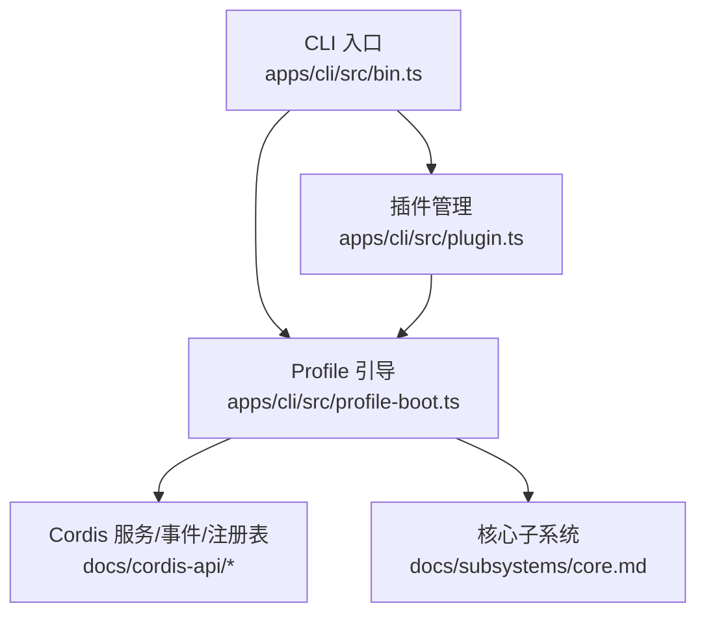
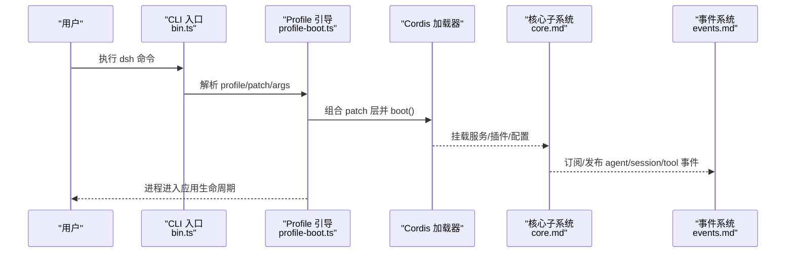
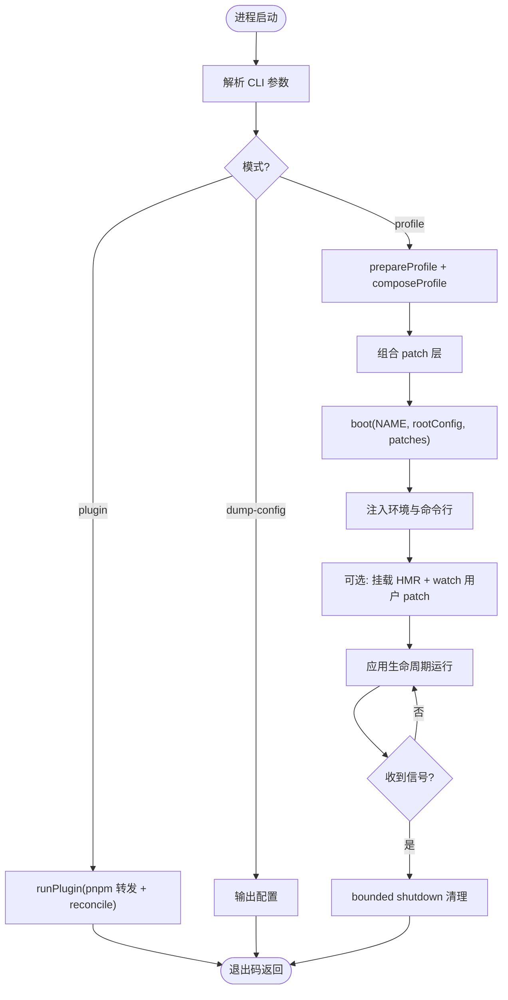
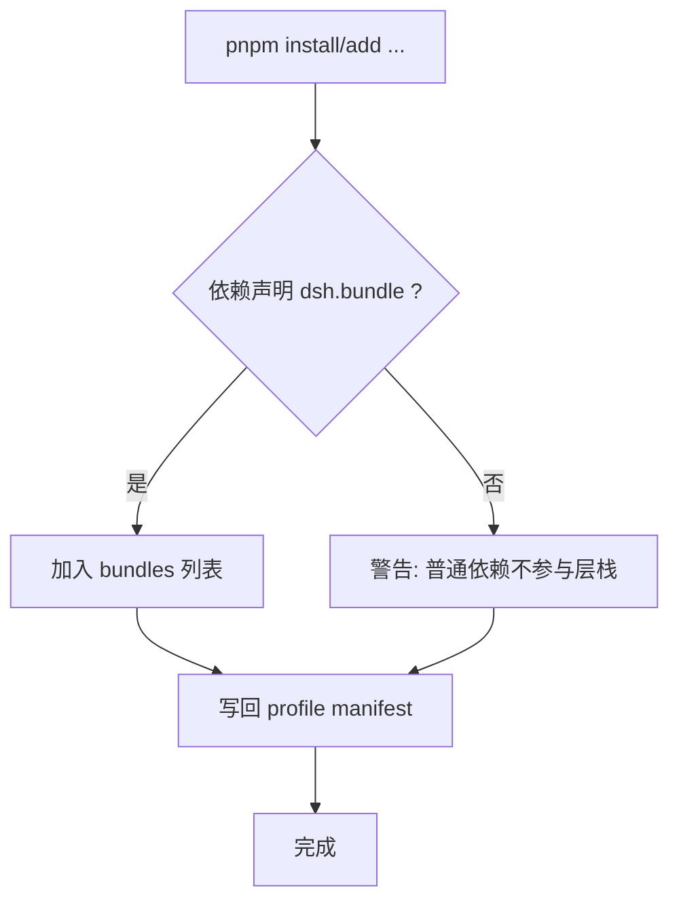
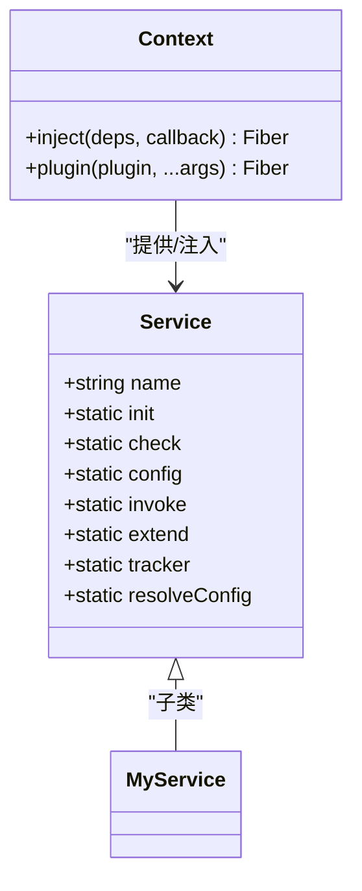
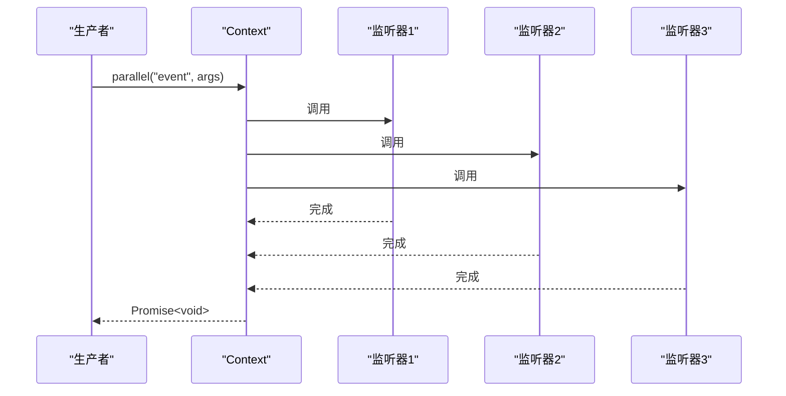
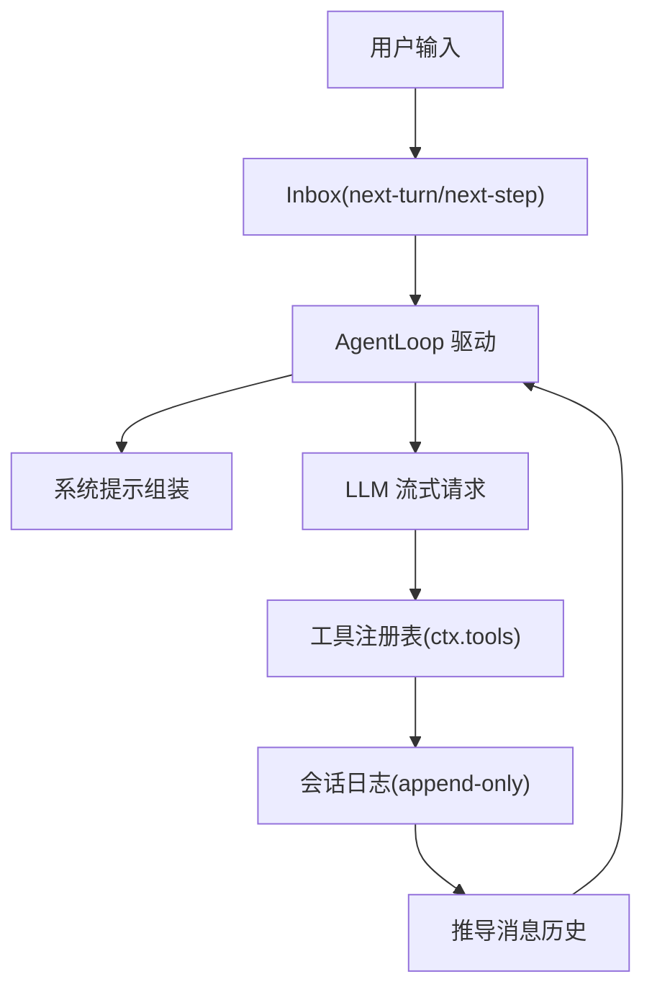
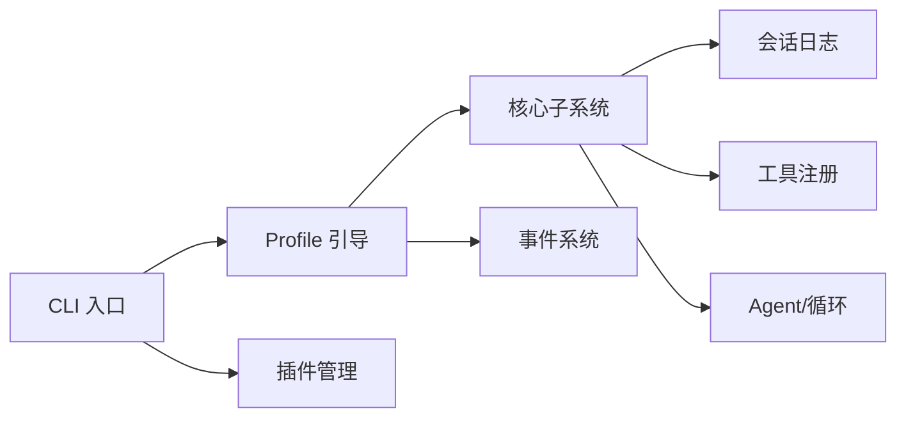

# 服务端 API

<cite>
**本文引用的文件**
- [README.md](file://README.md)
- [bin.ts](file://apps/cli/src/bin.ts)
- [plugin.ts](file://apps/cli/src/plugin.ts)
- [profile-boot.ts](file://apps/cli/src/profile-boot.ts)
- [service.md](file://docs/cordis-api/service.md)
- [events.md](file://docs/cordis-api/events.md)
- [registry.md](file://docs/cordis-api/registry.md)
- [core.md](file://docs/subsystems/core.md)
</cite>

## 目录
1. [简介](#简介)
2. [项目结构](#项目结构)
3. [核心组件](#核心组件)
4. [架构总览](#架构总览)
5. [详细组件分析](#详细组件分析)
6. [依赖关系分析](#依赖关系分析)
7. [性能考虑](#性能考虑)
8. [故障排除指南](#故障排除指南)
9. [结论](#结论)
10. [附录](#附录)

## 简介
本文件面向使用 DeepSeek Harness（dsh）构建 Node.js SDK 服务端的开发者，聚焦“服务端启动、配置与生命周期管理”“插件注册与服务暴露”“权限控制机制”“会话管理、工具注册与事件处理流程”，并提供类型定义说明、最佳实践与排错指南。dsh 采用“一切皆插件”的架构，基于 Cordis 框架进行插件加载、依赖注入、上下文服务与事件分发；CLI 提供 profile 驱动的配置组合与热重载能力，核心子系统负责会话日志、系统提示组装、工具注册与智能体循环。

## 项目结构
- CLI 入口：命令行模式路由到不同子命令（如 profile、plugin、dump-config），按需动态导入实现模块。
- Profile 引导：解析并组合多层 patch（bundle 层、用户层、home 层、overlay 层、遥测开关），挂载根配置，安装失败即停与有界关闭，支持 HMR 热重载。
- 插件管理：通过 pnpm 转发在 profile 目录下安装/更新插件，自动识别声明了 dsh.bundle 的包加入层栈，并在变更后同步 manifest。
- 核心子系统：会话日志、系统提示、工具注册、Agent 接口与默认循环等，构成可插拔的智能体运行时。

**图表来源**
- [bin.ts:1-54](file://apps/cli/src/bin.ts#L1-L54)
- [profile-boot.ts:1-301](file://apps/cli/src/profile-boot.ts#L1-L301)
- [plugin.ts:1-159](file://apps/cli/src/plugin.ts#L1-L159)
- [service.md:1-103](file://docs/cordis-api/service.md#L1-L103)
- [events.md:1-208](file://docs/cordis-api/events.md#L1-L208)
- [registry.md:1-153](file://docs/cordis-api/registry.md#L1-L153)
- [core.md:1-800](file://docs/subsystems/core.md#L1-L800)

**章节来源**
- [README.md:1-58](file://README.md#L1-L58)
- [bin.ts:1-54](file://apps/cli/src/bin.ts#L1-L54)
- [profile-boot.ts:1-301](file://apps/cli/src/profile-boot.ts#L1-L301)
- [plugin.ts:1-159](file://apps/cli/src/plugin.ts#L1-L159)

## 核心组件
- CLI 模式路由：根据参数选择 profile 运行、插件管理或配置转储，避免无关模块被引入。
- Profile 组合器：将 bundle 层、用户层、home 层、overlay 层与遥测开关按序组合，生成最终配置树并支持热重载。
- 插件管理器：封装 pnpm 调用，自动维护 dsh.profile.bundles 列表，确保已安装的 bundle 包参与层栈。
- Cordis 服务与事件：提供 ctx 上的服务注册、依赖注入、事件分发（parallel/emit/serial/bail/waterfall）。
- 核心子系统：Agent/Session/Tools/SystemPrompt 等，形成“会话日志为唯一事实源”的可扩展运行时。

**章节来源**
- [bin.ts:1-54](file://apps/cli/src/bin.ts#L1-L54)
- [profile-boot.ts:105-171](file://apps/cli/src/profile-boot.ts#L105-L171)
- [plugin.ts:59-91](file://apps/cli/src/plugin.ts#L59-L91)
- [events.md:8-208](file://docs/cordis-api/events.md#L8-L208)
- [core.md:1-800](file://docs/subsystems/core.md#L1-L800)

## 架构总览
下图展示从 CLI 到 Profile 引导、再到核心子系统与 Cordis 能力的整体交互。

**图表来源**
- [bin.ts:27-53](file://apps/cli/src/bin.ts#L27-L53)
- [profile-boot.ts:207-300](file://apps/cli/src/profile-boot.ts#L207-L300)
- [events.md:8-208](file://docs/cordis-api/events.md#L8-L208)
- [core.md:1-800](file://docs/subsystems/core.md#L1-L800)

## 详细组件分析

### 启动与生命周期管理
- CLI 模式路由：根据解析后的 invocation.mode 动态导入对应实现，仅当模式有效时才继续执行。
- Profile 引导：
  - 准备 profile：修复共享模块回退、写入空根配置，保证 include 锚点稳定。
  - 组合 patch 层：bundle 层 → 用户层 → home 层 → overlay 层 → 遥测开关。
  - 启动：调用 boot(NAME, rootConfig, patches, hostCtxProvider)，注入环境快照与命令行参数。
  - 信号与关闭：监听 SIGTERM/SIGINT，安装 fail-loud，提供 bounded shutdown。
  - 热重载：若未提供 HMR，则挂载最小化 HMR 并 watch 用户 patch 文件，实时重组合成。

**图表来源**
- [bin.ts:27-53](file://apps/cli/src/bin.ts#L27-L53)
- [profile-boot.ts:98-171](file://apps/cli/src/profile-boot.ts#L98-L171)
- [profile-boot.ts:207-300](file://apps/cli/src/profile-boot.ts#L207-L300)

**章节来源**
- [bin.ts:1-54](file://apps/cli/src/bin.ts#L1-L54)
- [profile-boot.ts:98-171](file://apps/cli/src/profile-boot.ts#L98-L171)
- [profile-boot.ts:207-300](file://apps/cli/src/profile-boot.ts#L207-L300)

### 插件注册与配置层
- 插件发现与层栈：pnpm 安装后，扫描依赖是否声明 dsh.bundle，若是则加入 dsh.profile.bundles 列表，作为 bundle 层参与组合。
- 自动同步：每次成功安装后 reconcile，移除不再声明 bundle 的依赖，新增则追加。
- 路径锚定：对相对路径 spec 进行 cwd 锚定，避免在 profile 目录误解析。
- 错误提示：git 依赖 prepare 脚本被 pnpm 阻止时给出明确指引。

**图表来源**
- [plugin.ts:36-91](file://apps/cli/src/plugin.ts#L36-L91)
- [plugin.ts:120-159](file://apps/cli/src/plugin.ts#L120-L159)

**章节来源**
- [plugin.ts:36-91](file://apps/cli/src/plugin.ts#L36-L91)
- [plugin.ts:120-159](file://apps/cli/src/plugin.ts#L120-L159)

### 服务暴露与依赖注入（Cordis Service）
- 服务基类：继承 Service 的类在构造时立即以 ctx.<name> 形式注册，随 fiber 生命周期自动移除。
- 静态元数据：init/check/config/invoke/extend/tracker/resolveConfig 等符号键用于框架行为扩展。
- 依赖注入：ctx.inject(deps, callback) 等待所需服务可用后执行回调，服务变更时自动卸载并重载。
- 插件形态：函数、类、对象三种入口，均支持 Config 校验、inject/provide/intercept 元数据。

**图表来源**
- [service.md:1-103](file://docs/cordis-api/service.md#L1-L103)
- [registry.md:8-56](file://docs/cordis-api/registry.md#L8-L56)

**章节来源**
- [service.md:1-103](file://docs/cordis-api/service.md#L1-L103)
- [registry.md:8-56](file://docs/cordis-api/registry.md#L8-L56)

### 事件处理流程（并发/串行/瀑布）
- 并发并行：ctx.parallel(name, ...args) 同时运行所有监听器，全部 settle 后返回。
- 同步广播：ctx.emit(name, ...args) 同步触发，忽略返回值。
- 串行短路：ctx.serial(name, ...args) 顺序等待，首个 bail 值终止。
- 同步短路：ctx.bail(name, ...args) 顺序调用，首个非空/非假/非 undefined 值终止。
- 瀑布链：ctx.waterfall(name, ...args) 最后一个参数为 next，监听器可选择调用 next 继续链式处理。
- 监听器注册：ctx.on/once 支持 prepend/global 选项，返回 disposer。

**图表来源**
- [events.md:8-123](file://docs/cordis-api/events.md#L8-L123)

**章节来源**
- [events.md:8-208](file://docs/cordis-api/events.md#L8-L208)

### 会话管理与工具注册（核心子系统）
- 会话日志：append-only SessionEvent 序列，消息历史由日志推导，持久化与恢复由 persistence 子系统负责。
- Agent 接口：统一 send/followup/steer/inject/cancel/whenIdle/runMaintenance 等能力，状态 idle/running。
- 工具注册：ToolDefinition 包含模型可见的 ToolSchema 与 execute 执行函数，以及可选 UI 回调；通过 ctx.tools 注册与调度。
- 预步骤拦截：agent/pre-step 允许在请求派生前修改/拒绝步骤；request-error 可在失败后重试或修复状态。

**图表来源**
- [core.md:1-800](file://docs/subsystems/core.md#L1-L800)

**章节来源**
- [core.md:1-800](file://docs/subsystems/core.md#L1-L800)

### 权限控制与范围隔离
- 发起者作用域：ctx.agents.withInitiator/withoutInitiator 建立/清除发起者边界，用于同进程因果归因与资源归属。
- 预设组合：agentPresets.mount/composeFrom/recompose 将 Agent 绑定到预设的组合，服务通过 isolate 领域对外隐藏，宿主无法直接访问。
- 作用域键：standingKeyFor 提供只读视角下的 scope key，供外部读取器安全访问。

**章节来源**
- [core.md:207-549](file://docs/subsystems/core.md#L207-L549)

## 依赖关系分析
- CLI 依赖 profile-boot 与 plugin 两个核心子模块，分别负责引导与插件管理。
- profile-boot 依赖 Cordis 加载器与 HMR/timer 等可选服务，组合 patch 层并注入环境与命令行。
- 核心子系统依赖 session/system-prompt/tools/agent/agent-loop/scope 等包，形成稳定的内聚分层。

**图表来源**
- [bin.ts:27-53](file://apps/cli/src/bin.ts#L27-L53)
- [profile-boot.ts:207-300](file://apps/cli/src/profile-boot.ts#L207-L300)
- [core.md:1-800](file://docs/subsystems/core.md#L1-L800)

**章节来源**
- [bin.ts:27-53](file://apps/cli/src/bin.ts#L27-L53)
- [profile-boot.ts:207-300](file://apps/cli/src/profile-boot.ts#L207-L300)
- [core.md:1-800](file://docs/subsystems/core.md#L1-L800)

## 性能考虑
- 配置组合克隆：每次 live 重组合成都结构化克隆 patch 对象，避免引用别名导致的热重载污染。
- 事件策略选择：高吞吐场景优先 parallel；需要有序收敛时使用 serial/bail；复杂预处理用 waterfall。
- 工具执行：尽量批量化与缓存结果，减少 I/O 与模型往返；利用 session 日志推导历史，避免重复计算。
- 热重载：仅在必要时启用 HMR，避免频繁重建造成 GC 压力；watch 用户 patch 文件增量更新。

[本节为通用指导，不直接分析具体文件]

## 故障排除指南
- pnpm 未找到：plugin 命令会检测 PATH 中是否存在 pnpm，缺失时给出安装提示并返回特定退出码。
- git 依赖 prepare 脚本被阻止：当安装 git 托管插件失败时，提示在 pnpm-workspace.yaml 中添加 allowBuilds 白名单。
- 遥测开关：设置环境变量可硬禁用遥测行，若组合中不存在该行则跳过补丁。
- 信号与关闭：SIGTERM/SIGINT 触发有界关闭，确保资源释放；fail-loud 会在异常时快速失败便于定位。

**章节来源**
- [plugin.ts:127-159](file://apps/cli/src/plugin.ts#L127-L159)
- [profile-boot.ts:142-171](file://apps/cli/src/profile-boot.ts#L142-L171)
- [profile-boot.ts:211-225](file://apps/cli/src/profile-boot.ts#L211-L225)

## 结论
本文档梳理了 dsh 服务端的启动流程、配置组合、插件管理与核心子系统协作方式，结合 Cordis 的服务与事件机制，提供了可扩展、可观测、可热重载的智能体运行时基础。通过合理选择事件策略、工具执行策略与热重载策略，可以在保证正确性的前提下获得良好性能与可维护性。

[本节为总结性内容，不直接分析具体文件]

## 附录

### 类型定义速查（来自 Cordis API）
- 服务基类与静态元数据：见 service.md。
- 事件分发模式与监听器注册：见 events.md。
- 插件形态、依赖注入与注册表：见 registry.md。
- 核心子系统中的 Agent/Session/Tools 类型与事件：见 core.md。

**章节来源**
- [service.md:1-103](file://docs/cordis-api/service.md#L1-L103)
- [events.md:1-208](file://docs/cordis-api/events.md#L1-L208)
- [registry.md:1-153](file://docs/cordis-api/registry.md#L1-L153)
- [core.md:1-800](file://docs/subsystems/core.md#L1-L800)