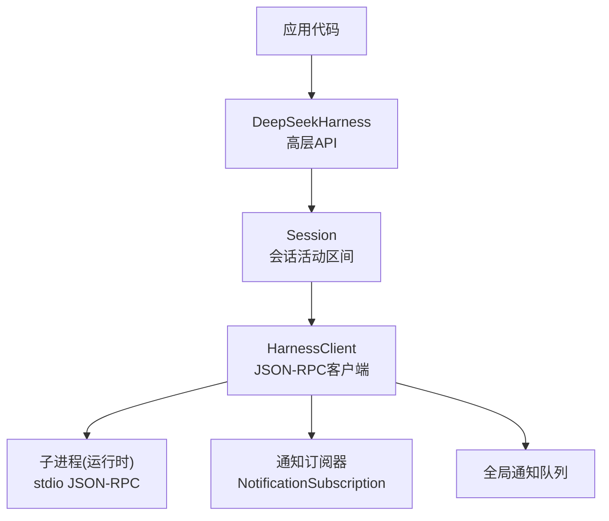
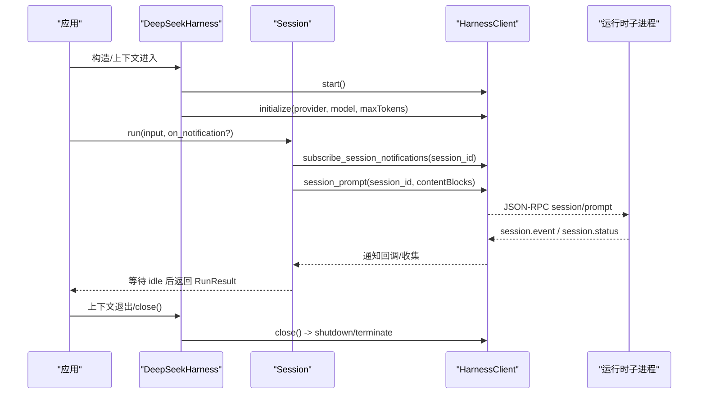
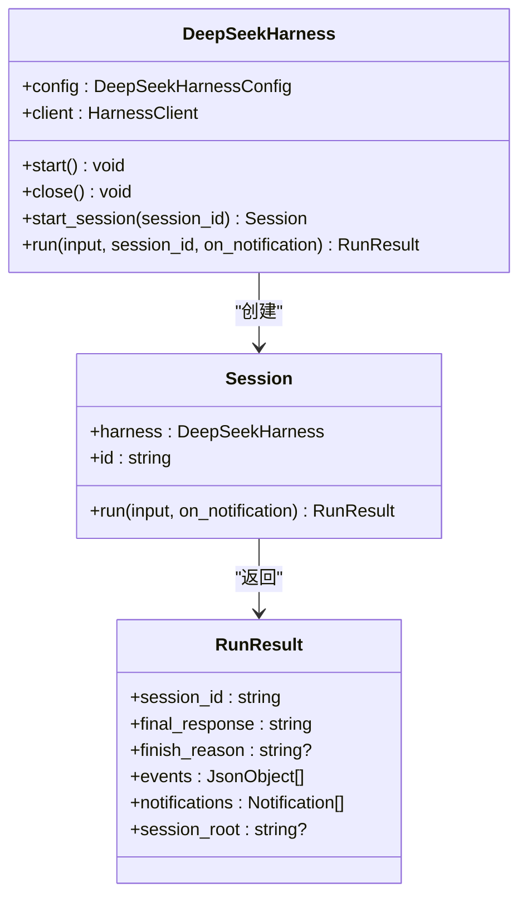
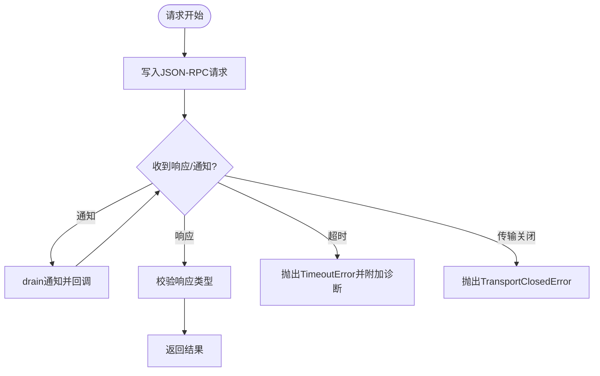
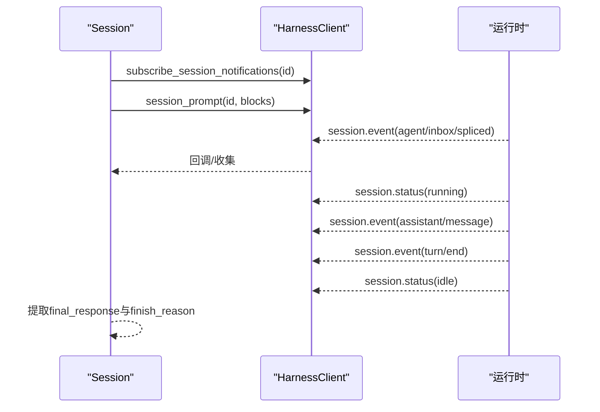
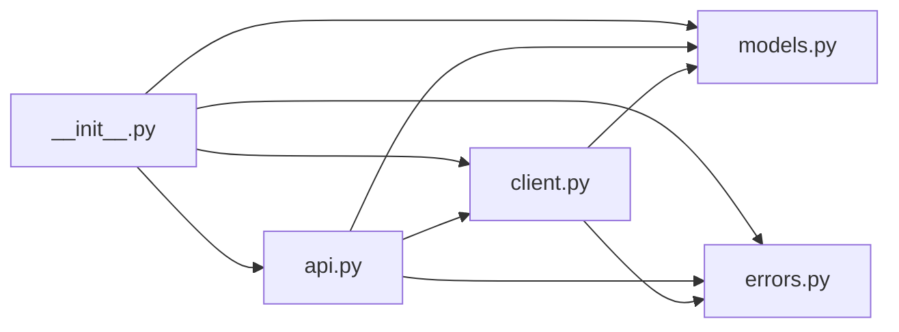
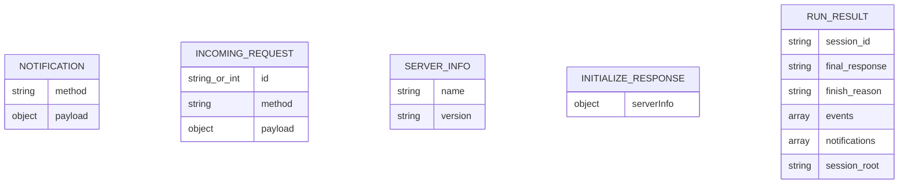

# Python SDK

<cite>
**本文引用的文件**
- [__init__.py](file://python/sdk/src/deepseek_harness/__init__.py)
- [api.py](file://python/sdk/src/deepseek_harness/api.py)
- [client.py](file://python/sdk/src/deepseek_harness/client.py)
- [models.py](file://python/sdk/src/deepseek_harness/models.py)
- [errors.py](file://python/sdk/src/deepseek_harness/errors.py)
- [README.md](file://python/sdk/README.md)
- [minimal.py](file://examples/jsonrpc-agent/minimal.py)
- [test_client.py](file://python/sdk/tests/test_client.py)
</cite>

## 目录
1. [简介](#简介)
2. [项目结构](#项目结构)
3. [核心组件](#核心组件)
4. [架构总览](#架构总览)
5. [详细组件分析](#详细组件分析)
6. [依赖关系分析](#依赖关系分析)
7. [性能与并发特性](#性能与并发特性)
8. [配置、环境变量与认证](#配置环境变量与认证)
9. [数据模型说明](#数据模型说明)
10. [使用示例与最佳实践](#使用示例与最佳实践)
11. [异常处理与故障排查](#异常处理与故障排查)
12. [结论](#结论)

## 简介
本 SDK 提供同步的 Python 接口，通过 JSON-RPC over stdio 驱动 DeepSeek Harness 运行时进程，完成会话管理、消息处理与工具调用。它支持：
- 启动并复用本地运行时子进程
- 基于会话的活动区间（从收件箱回执到下一次空闲）
- 收集事件、通知与最终响应
- 灵活的配置与环境变量注入
- 可扩展的 LLM 提供商路由（由 Cordis 配置决定）

## 项目结构
Python SDK 位于 python/sdk/src/deepseek_harness，核心模块如下：
- __init__.py：对外暴露 API、客户端、错误与数据模型
- api.py：高层 API（DeepSeekHarness、Session、RunResult、配置）
- client.py：底层 JSON-RPC 客户端（进程管理、请求/通知路由、超时控制）
- models.py：通用数据类型（Notification、IncomingRequest、InitializeResponse 等）
- errors.py：SDK 与传输层异常类型

图表来源
- [api.py:48-183](file://python/sdk/src/deepseek_harness/api.py#L48-L183)
- [client.py:37-210](file://python/sdk/src/deepseek_harness/client.py#L37-L210)

章节来源
- [__init__.py:1-20](file://python/sdk/src/deepseek_harness/__init__.py#L1-L20)
- [api.py:13-183](file://python/sdk/src/deepseek_harness/api.py#L13-L183)
- [client.py:24-210](file://python/sdk/src/deepseek_harness/client.py#L24-L210)

## 核心组件
- DeepSeekHarnessConfig：配置运行时参数（provider、model、max_tokens、cwd、runtime_cwd、session_root、cordis、env、runtime_bin、launch_args_override、request_timeout_seconds、shutdown_timeout_seconds、base_url、api_key）
- RunResult：一次 run() 的结果（session_id、final_response、finish_reason、events、notifications、session_root）
- DeepSeekHarness：可复用的同步 SDK，负责启动/关闭运行时、创建 Session、执行 turn
- Session：封装一次“从 prompt 到 idle”的活动区间，收集事件与通知，返回 RunResult
- HarnessClient：底层 JSON-RPC 客户端，管理子进程、读写 stdio、请求/通知路由、超时与诊断
- NotificationSubscription：会话级或全局通知订阅，支持上下文管理器与 drain
- 数据模型：Notification、IncomingRequest、ServerInfo、InitializeResponse、Json* 类型别名
- 异常：HarnessError、TransportClosedError、SdkProtocolError、JsonRpcError

章节来源
- [api.py:13-46](file://python/sdk/src/deepseek_harness/api.py#L13-L46)
- [api.py:48-183](file://python/sdk/src/deepseek_harness/api.py#L48-L183)
- [client.py:24-210](file://python/sdk/src/deepseek_harness/client.py#L24-L210)
- [models.py:8-33](file://python/sdk/src/deepseek_harness/models.py#L8-L33)
- [errors.py:4-24](file://python/sdk/src/deepseek_harness/errors.py#L4-L24)

## 架构总览
SDK 采用“高层 API + 低层客户端 + 子进程运行时”的分层设计：
- 高层 API 提供易用的 run()/start_session() 语义，自动管理会话生命周期
- 低层客户端负责 JSON-RPC 通信、通知过滤、子进程生命周期与超时
- 运行时通过 stdio 接收 JSON-RPC 消息，执行 agent 流程，推送 session.event/session.status 等通知

图表来源
- [api.py:97-183](file://python/sdk/src/deepseek_harness/api.py#L97-L183)
- [client.py:63-155](file://python/sdk/src/deepseek_harness/client.py#L63-L155)

## 详细组件分析

### DeepSeekHarness 与 Session
- 职责
  - 管理运行时生命周期（懒启动、初始化、关闭）
  - 创建 Session 并执行 turn
  - 将输入标准化为内容块列表
  - 等待收件箱回执与 idle 状态，提取 final_response 与 finish_reason
- 关键行为
  - 支持上下文管理器模式
  - 支持传入 provider/model/max_tokens/cordis/env 等
  - 自动注入 DSH_CWD、DSH_SESSION_ROOT、DSH_CORDIS_CONFIG、DEEPSEEK_BASE_URL、DEEPSEEK_API_KEY
  - 通过 Session.run() 收集 events 与 notifications，返回 RunResult

图表来源
- [api.py:13-46](file://python/sdk/src/deepseek_harness/api.py#L13-L46)
- [api.py:48-183](file://python/sdk/src/deepseek_harness/api.py#L48-L183)

章节来源
- [api.py:48-183](file://python/sdk/src/deepseek_harness/api.py#L48-L183)

### HarnessClient：JSON-RPC 客户端
- 职责
  - 启动/关闭子进程，读取 stdout/stderr
  - 发送 JSON-RPC 请求，等待响应或错误
  - 分发通知到订阅者或全局队列
  - 维护会话父子关系以支持子代理树的通知过滤
  - 提供 next_request/respond 用于桥接上游请求
- 关键机制
  - 线程安全：读/写锁、队列、字典保护
  - 超时：请求超时与关闭超时，附带诊断信息（退出码、stderr 尾部）
  - 通知过滤：按 sessionId 与 subagent 父子关系过滤
  - 默认配置注入：当使用捆绑运行时且未显式设置 cordis 时，注入内置配置路径

图表来源
- [client.py:157-296](file://python/sdk/src/deepseek_harness/client.py#L157-L296)
- [client.py:318-422](file://python/sdk/src/deepseek_harness/client.py#L318-L422)

章节来源
- [client.py:37-210](file://python/sdk/src/deepseek_harness/client.py#L37-L210)
- [client.py:228-296](file://python/sdk/src/deepseek_harness/client.py#L228-L296)
- [client.py:318-422](file://python/sdk/src/deepseek_harness/client.py#L318-L422)

### 通知与事件处理
- 通知来源
  - session.event：包含 agent/inbox/spliced、assistant/message、turn/end 等事件
  - session.status：会话状态变化（running/idle）
  - subagent.started/finished：子代理生命周期
- 过滤规则
  - 仅收集当前会话及其已知后代的通知
  - 忽略其他会话的通知，避免污染
- 事件提取
  - final_response：最后一个 assistant/message 中的文本拼接
  - finish_reason：最后一个 turn/end 的 data.reason.kind

图表来源
- [api.py:132-183](file://python/sdk/src/deepseek_harness/api.py#L132-L183)
- [client.py:460-504](file://python/sdk/src/deepseek_harness/client.py#L460-L504)

章节来源
- [api.py:132-183](file://python/sdk/src/deepseek_harness/api.py#L132-L183)
- [client.py:460-504](file://python/sdk/src/deepseek_harness/client.py#L460-L504)

## 依赖关系分析
- 模块耦合
  - api.py 依赖 client.py、models.py、errors.py
  - client.py 依赖 models.py、errors.py
  - __init__.py 聚合导出所有公共符号
- 外部依赖
  - 子进程运行时（可通过 deepseek-harness-runtime-bin 解析）
  - 环境变量 DEEPSEEK_API_KEY、DEEPSEEK_BASE_URL、DSH_*
  - Pydantic 用于 InitializeResponse 等模型校验

图表来源
- [__init__.py:1-20](file://python/sdk/src/deepseek_harness/__init__.py#L1-L20)
- [api.py:1-11](file://python/sdk/src/deepseek_harness/api.py#L1-L11)
- [client.py:1-19](file://python/sdk/src/deepseek_harness/client.py#L1-L19)

章节来源
- [__init__.py:1-20](file://python/sdk/src/deepseek_harness/__init__.py#L1-L20)
- [api.py:1-11](file://python/sdk/src/deepseek_harness/api.py#L1-L11)
- [client.py:1-19](file://python/sdk/src/deepseek_harness/client.py#L1-L19)

## 性能与并发特性
- 子进程复用：DeepSeekHarness 在实例生命周期内复用同一运行时，减少启动开销
- 异步通知：通过后台 reader 线程持续消费 stdout，非阻塞地分发通知
- 超时控制：请求超时与关闭超时，失败时附带 stderr 尾部与退出码便于定位
- 资源释放：close() 会尝试 graceful shutdown，必要时 terminate/kill，确保子进程回收
- 并发安全：读写分离锁、队列与字典保护，避免竞争条件

[本节为通用指导，不直接分析具体文件]

## 配置、环境变量与认证
- 配置项（DeepSeekHarnessConfig）
  - provider：选择 Cordis 中注册的提供商路由
  - model：模型标识，由提供商适配器解析
  - max_tokens：可选每请求输出 token 上限
  - cwd/runtime_cwd：工作目录与运行时目录（解析为绝对路径）
  - session_root：会话根目录（注入 DSH_SESSION_ROOT）
  - cordis：Cordis 配置文件路径（注入 DSH_CORDIS_CONFIG）
  - env：额外环境变量注入
  - runtime_bin/bridge_bin/launch_args_override：运行时入口与启动参数覆盖
  - request_timeout_seconds/shutdown_timeout_seconds：请求与关闭超时
  - base_url/api_key：分别注入 DEEPSEEK_BASE_URL/DEEPSEEK_API_KEY
- 环境变量
  - DEEPSEEK_API_KEY：OpenAI 兼容端点凭据
  - DEEPSEEK_BASE_URL：OpenAI 兼容端点地址
  - DSH_CWD：工作目录
  - DSH_SESSION_ROOT：会话日志目录
  - DSH_CORDIS_CONFIG：Cordis 配置路径（可由 SDK 自动注入）
  - DSH_MODEL/DSH_SYSTEM_PROMPT/DSH_CONTEXT_WINDOW/DSH_MAX_TOKENS_AS_SUCCESS：运行时行为开关
- 认证机制
  - 通过 DEEPSEEK_API_KEY 与 DEEPSEEK_BASE_URL 指向 OpenAI 兼容后端
  - 也可通过自定义 Cordis 配置挂载其他提供商（如 pi-ai），并在其内部配置凭据与端点

章节来源
- [api.py:13-36](file://python/sdk/src/deepseek_harness/api.py#L13-L36)
- [api.py:56-83](file://python/sdk/src/deepseek_harness/api.py#L56-L83)
- [client.py:424-454](file://python/sdk/src/deepseek_harness/client.py#L424-L454)
- [README.md:5-49](file://python/sdk/README.md#L5-L49)
- [examples/jsonrpc-agent/README.md:16-29](file://examples/jsonrpc-agent/README.md#L16-L29)

## 数据模型说明
- JsonScalar/JsonValue/JsonObject：基础 JSON 类型别名，用于 payload 与事件结构
- Notification：method + payload，表示一条通知
- IncomingRequest：id + method + payload，表示来自运行时的请求（可用于桥接）
- ServerInfo/InitializeResponse：initialize 响应中的服务器信息与元数据
- RunResult：一次 run() 的完整结果，包括最终响应、结束原因、事件与通知

图表来源
- [models.py:8-33](file://python/sdk/src/deepseek_harness/models.py#L8-L33)
- [api.py:38-46](file://python/sdk/src/deepseek_harness/api.py#L38-L46)

章节来源
- [models.py:8-33](file://python/sdk/src/deepseek_harness/models.py#L8-L33)
- [api.py:38-46](file://python/sdk/src/deepseek_harness/api.py#L38-L46)

## 使用示例与最佳实践
- 基础用法：一次性任务
  - 使用上下文管理器启动/关闭 harness，调用 run() 获取最终响应
  - 参考路径：[minimal.py:16-39](file://examples/jsonrpc-agent/minimal.py#L16-L39)
- 高级用法：自定义提供商与模型
  - 通过 provider/model/max_tokens 指定，结合 cordis 配置加载插件
  - 参考路径：[README.md:29-41](file://python/sdk/README.md#L29-L41)
- 集成模式：桥接上游请求
  - 使用 next_request/respond 转发运行时的请求（如 llm.request）
  - 参考路径：[test_client.py:658-693](file://python/sdk/tests/test_client.py#L658-L693)
- 通知处理：on_notification 回调
  - 在 run() 中注册回调，实时处理 session.event/session.status/subagent.*
  - 参考路径：[test_client.py:127-163](file://python/sdk/tests/test_client.py#L127-L163)
- 资源释放：始终使用上下文管理器或显式 close()
  - 确保子进程被正确回收，避免僵尸进程
  - 参考路径：[client.py:87-116](file://python/sdk/src/deepseek_harness/client.py#L87-L116)

章节来源
- [minimal.py:16-39](file://examples/jsonrpc-agent/minimal.py#L16-L39)
- [README.md:29-49](file://python/sdk/README.md#L29-L49)
- [test_client.py:127-163](file://python/sdk/tests/test_client.py#L127-L163)
- [test_client.py:658-693](file://python/sdk/tests/test_client.py#L658-L693)
- [client.py:87-116](file://python/sdk/src/deepseek_harness/client.py#L87-L116)

## 异常处理与故障排查
- 异常类型
  - TransportClosedError：运行时子进程退出或 stdout 关闭
  - SdkProtocolError：运行时发送不符合协议的数据（如 turn/end 缺少 reason.kind）
  - JsonRpcError：运行时返回 JSON-RPC 错误响应
  - TimeoutError：请求超时，附带诊断信息（退出码、stderr 尾部）
- 常见场景
  - 初始化失败：会自动关闭运行时并抛出异常
  - 请求无响应：超时后抛出 TimeoutError，包含诊断信息
  - 关闭无响应：shutdown 超时后强制 terminate/kill
- 调试建议
  - 检查 stderr 尾部与退出码
  - 确认环境变量与 Cordis 配置是否正确注入
  - 使用最小化 fake_runtime 脚本验证通信链路

章节来源
- [errors.py:4-24](file://python/sdk/src/deepseek_harness/errors.py#L4-L24)
- [api.py:225-242](file://python/sdk/src/deepseek_harness/api.py#L225-L242)
- [client.py:87-116](file://python/sdk/src/deepseek_harness/client.py#L87-L116)
- [client.py:228-296](file://python/sdk/src/deepseek_harness/client.py#L228-L296)
- [client.py:318-422](file://python/sdk/src/deepseek_harness/client.py#L318-L422)
- [test_client.py:720-783](file://python/sdk/tests/test_client.py#L720-L783)

## 结论
该 Python SDK 提供了稳定、可复用的同步接口来驱动 DeepSeek Harness 运行时。通过分层设计与严格的协议校验，实现了可靠的会话管理、消息处理与工具调用。配合灵活的环境变量与 Cordis 配置，可轻松集成不同 LLM 提供商。建议在生产环境中使用上下文管理器管理生命周期，合理设置超时与诊断收集，以获得更好的稳定性与可观测性。