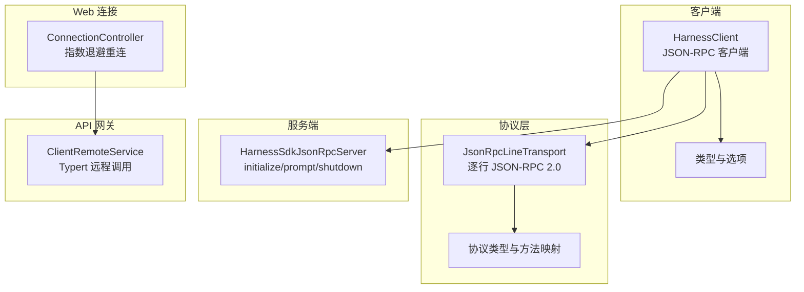
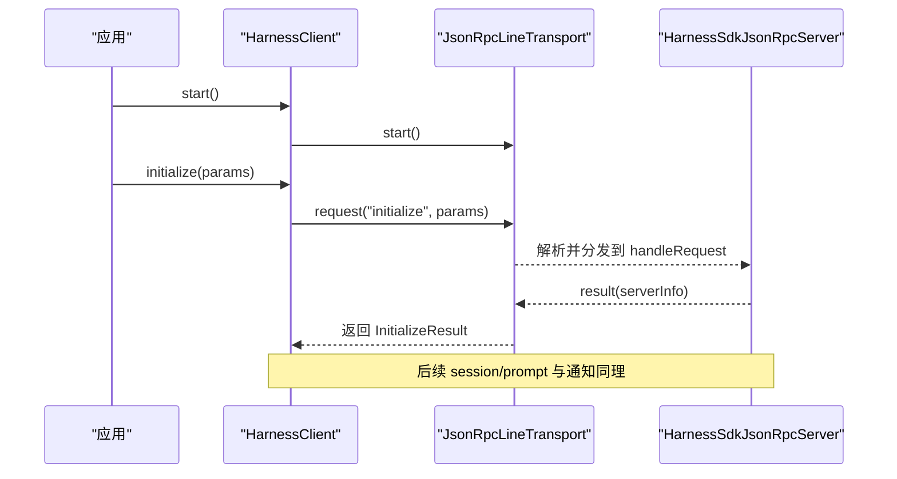
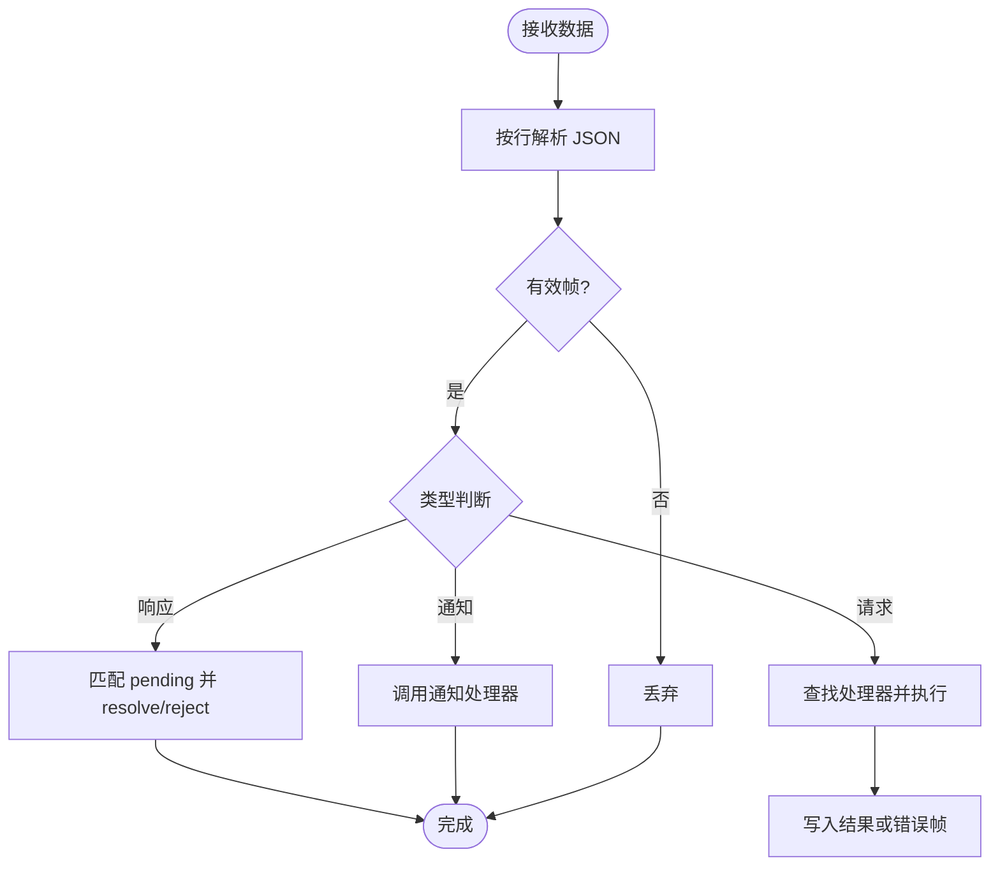
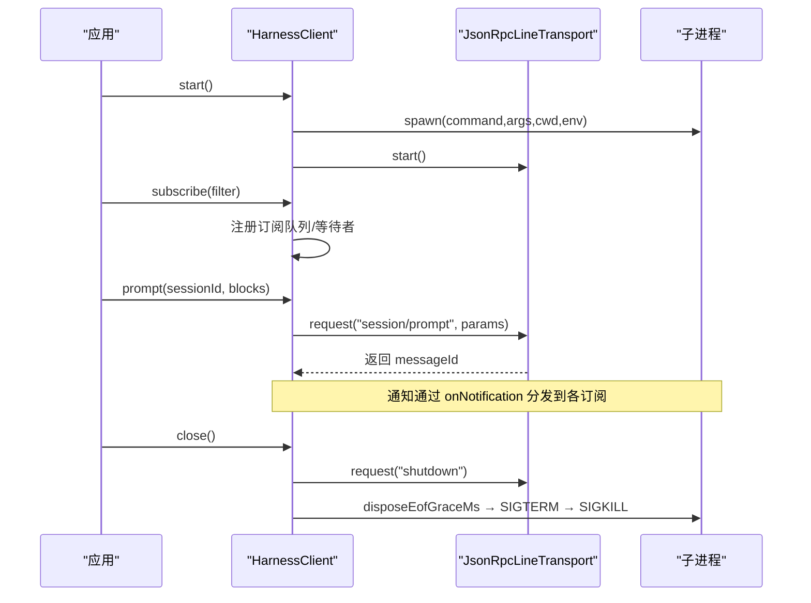
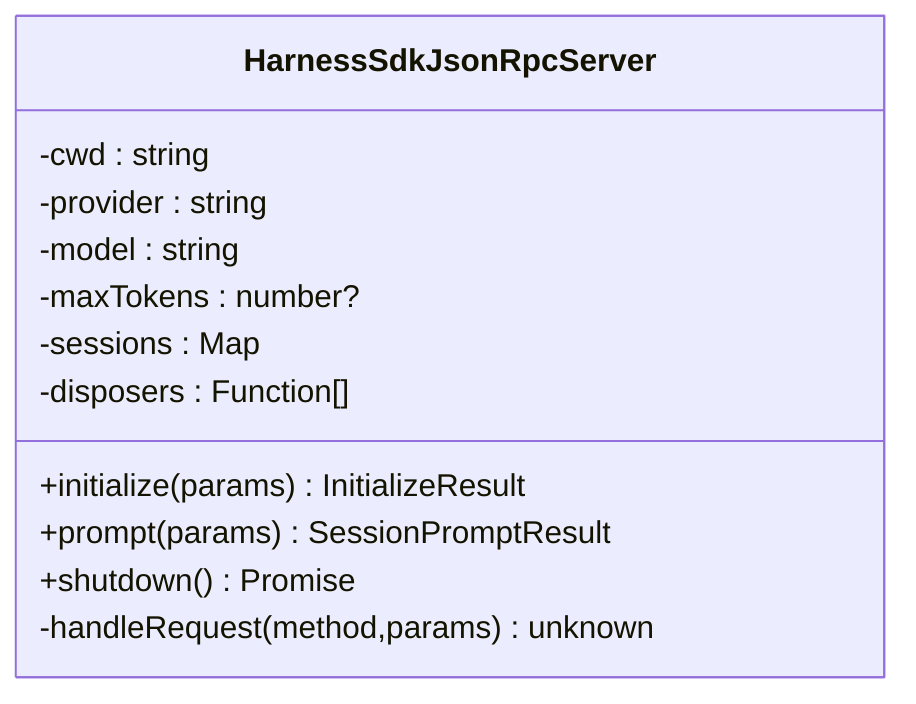
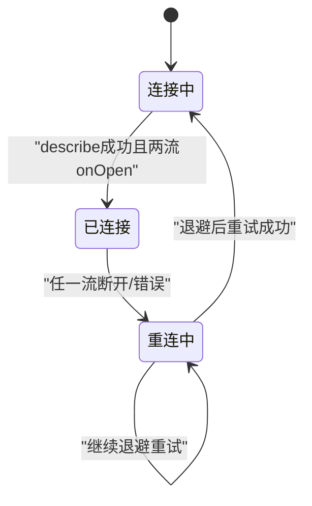
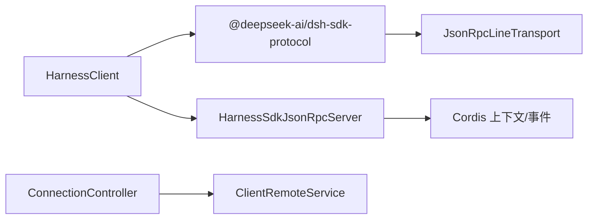

# SDK 协议规范

<cite>
**本文引用的文件**
- [packages/sdk/protocol/src/types.ts](file://packages/sdk/protocol/src/types.ts)
- [packages/sdk/protocol/src/transport.ts](file://packages/sdk/protocol/src/transport.ts)
- [packages/sdk/client/src/client.ts](file://packages/sdk/client/src/client.ts)
- [packages/sdk/client/src/types.ts](file://packages/sdk/client/src/types.ts)
- [packages/sdk/server/src/server.ts](file://packages/sdk/server/src/server.ts)
- [packages/client/connection/src/client/connection.ts](file://packages/client/connection/src/client/connection.ts)
- [packages/api/gateway/src/client/index.ts](file://packages/api/gateway/src/client/index.ts)
- [docs/api-gateway.md](file://docs/api-gateway.md)
- [docs/cordis-api/events.md](file://docs/cordis-api/events.md)
</cite>

## 目录
1. [简介](#简介)
2. [项目结构](#项目结构)
3. [核心组件](#核心组件)
4. [架构总览](#架构总览)
5. [详细组件分析](#详细组件分析)
6. [依赖关系分析](#依赖关系分析)
7. [性能考虑](#性能考虑)
8. [故障排查指南](#故障排查指南)
9. [结论](#结论)
10. [附录](#附录)

## 简介
本规范定义 DeepSeek Harness SDK 的客户端与服务端通信协议，覆盖 JSON-RPC 2.0 帧格式、方法/通知契约、事件系统、连接与重连策略、错误码与处理策略、安全与性能建议，以及版本兼容性与迁移指引。SDK 运行时通过子进程 stdio 上的“逐行 JSON”传输进行通信；Web 侧通过 Connection 层提供带指数退避的重连能力；API Gateway 提供基于 Typert 的远程调用通道（与 SDK 协议并存）。

## 项目结构
- 协议定义：位于 packages/sdk/protocol，包含类型与传输实现。
- 客户端：packages/sdk/client，负责启动运行时子进程、建立 JSON-RPC 会话、订阅事件。
- 服务端：packages/sdk/server，实现 initialize/prompt/shutdown 方法与事件转发。
- Web 连接：packages/client/connection，封装多路流连接、握手与断线重连。
- API 网关：packages/api/gateway，提供 RPC 远端调用（与 SDK 协议互补）。

图表来源
- [packages/sdk/client/src/client.ts:184-333](file://packages/sdk/client/src/client.ts#L184-L333)
- [packages/sdk/protocol/src/transport.ts:62-173](file://packages/sdk/protocol/src/transport.ts#L62-L173)
- [packages/sdk/protocol/src/types.ts:15-105](file://packages/sdk/protocol/src/types.ts#L15-L105)
- [packages/sdk/server/src/server.ts:53-201](file://packages/sdk/server/src/server.ts#L53-L201)
- [packages/client/connection/src/client/connection.ts:61-169](file://packages/client/connection/src/client/connection.ts#L61-L169)
- [packages/api/gateway/src/client/index.ts:88-415](file://packages/api/gateway/src/client/index.ts#L88-L415)

章节来源
- [packages/sdk/protocol/src/types.ts:1-106](file://packages/sdk/protocol/src/types.ts#L1-L106)
- [packages/sdk/protocol/src/transport.ts:1-280](file://packages/sdk/protocol/src/transport.ts#L1-L280)
- [packages/sdk/client/src/client.ts:1-474](file://packages/sdk/client/src/client.ts#L1-L474)
- [packages/sdk/client/src/types.ts:1-75](file://packages/sdk/client/src/types.ts#L1-L75)
- [packages/sdk/server/src/server.ts:1-241](file://packages/sdk/server/src/server.ts#L1-L241)
- [packages/client/connection/src/client/connection.ts:1-203](file://packages/client/connection/src/client/connection.ts#L1-L203)
- [packages/api/gateway/src/client/index.ts:1-589](file://packages/api/gateway/src/client/index.ts#L1-L589)
- [docs/api-gateway.md:1-165](file://docs/api-gateway.md#L1-L165)

## 核心组件
- 协议类型与方法映射：定义 initialize/session/prompt/shutdown 请求与 session.event/session.status/subagent.started/subagent.finished 通知。
- 传输层：基于换行分隔的 JSON-RPC 2.0，支持请求/响应/通知、错误帧、挂起请求管理与关闭清理。
- 客户端 HarnessClient：管理子进程生命周期、发起请求、订阅通知、超时控制、关闭流程。
- 服务端 HarnessSdkJsonRpcServer：维护会话、创建 Agent、转发事件、处理 shutdown。
- Web 连接 ConnectionController：双流连接、描述握手、指数退避重连、状态广播。
- API 网关 ClientRemoteService：将业务服务暴露为远程方法，统一序列化与校验。

章节来源
- [packages/sdk/protocol/src/types.ts:15-105](file://packages/sdk/protocol/src/types.ts#L15-L105)
- [packages/sdk/protocol/src/transport.ts:62-268](file://packages/sdk/protocol/src/transport.ts#L62-L268)
- [packages/sdk/client/src/client.ts:184-458](file://packages/sdk/client/src/client.ts#L184-L458)
- [packages/sdk/server/src/server.ts:53-201](file://packages/sdk/server/src/server.ts#L53-L201)
- [packages/client/connection/src/client/connection.ts:61-169](file://packages/client/connection/src/client/connection.ts#L61-L169)
- [packages/api/gateway/src/client/index.ts:88-415](file://packages/api/gateway/src/client/index.ts#L88-L415)

## 架构总览
SDK 通信由三层组成：
- 应用层：客户端/服务端的方法与通知语义（initialize、session/prompt、shutdown 等）。
- 传输层：JSON-RPC 2.0 逐行帧，承载请求、响应与通知。
- 连接层：子进程 stdio（Node）或 Web 连接（ConnectionController），负责生命周期与重连。

图表来源
- [packages/sdk/client/src/client.ts:203-275](file://packages/sdk/client/src/client.ts#L203-L275)
- [packages/sdk/protocol/src/transport.ts:121-173](file://packages/sdk/protocol/src/transport.ts#L121-L173)
- [packages/sdk/server/src/server.ts:111-125](file://packages/sdk/server/src/server.ts#L111-L125)

## 详细组件分析

### 协议类型与方法映射
- 请求方法
  - initialize：传入工作目录、provider、model、可选 maxTokens；返回 serverInfo（name/version）。
  - session/prompt：传入 sessionId 与 contentBlocks；返回 messageId。
  - shutdown：无参；用于优雅关闭。
- 通知（服务端→客户端）
  - session.event：携带 sessionId 与 SessionEvent。
  - session.status：sessionId 与状态 idle/running。
  - subagent.started：parentSessionId 与 childSessionId。
  - subagent.finished：包含 provider、agentId、parentSessionId、childSessionId、status、stopReason、可选 lastAssistantMessage。

章节来源
- [packages/sdk/protocol/src/types.ts:15-105](file://packages/sdk/protocol/src/types.ts#L15-L105)

### 传输层：JSON-RPC 2.0 逐行帧
- 帧格式：每行一个 JSON 对象；含 id+method 为请求，仅 id 为响应，仅 method 为通知。
- 参数归一化：params 非对象时归一化为 {}。
- 错误处理：未找到方法返回 -32601；处理器异常返回 -32603；客户端收到 error 字段则抛出 JsonRpcResponseError。
- 生命周期：start/close 管理监听器；flush 等待写回调；输入结束或错误会拒绝所有 pending 请求。
- 取消：request 支持 AbortSignal，中止后移除 pending 并拒绝。

图表来源
- [packages/sdk/protocol/src/transport.ts:175-268](file://packages/sdk/protocol/src/transport.ts#L175-L268)

章节来源
- [packages/sdk/protocol/src/transport.ts:1-280](file://packages/sdk/protocol/src/transport.ts#L1-L280)

### 客户端 HarnessClient
- 子进程管理：spawn、stderr 收集、exit/close 事件处理、流收敛。
- 请求与超时：封装 transport.request，支持 per-call 超时与 AbortSignal。
- 通知订阅：subscribe/filter 过滤；subscribeSessionTree 基于 subagent.started/finalized 构建父子关系树。
- 关闭流程：先尝试 protocol shutdown，再走 EOF→SIGTERM→SIGKILL 阶梯回收。

图表来源
- [packages/sdk/client/src/client.ts:203-401](file://packages/sdk/client/src/client.ts#L203-L401)
- [packages/sdk/protocol/src/transport.ts:121-173](file://packages/sdk/protocol/src/transport.ts#L121-L173)

章节来源
- [packages/sdk/client/src/client.ts:1-474](file://packages/sdk/client/src/client.ts#L1-L474)
- [packages/sdk/client/src/types.ts:1-75](file://packages/sdk/client/src/types.ts#L1-L75)

### 服务端 HarnessSdkJsonRpcServer
- 初始化：记录 cwd/provider/model/maxTokens；按需挂载 LLM 适配器；返回 serverInfo。
- 会话：getOrCreateSession 保证幂等；prompt 验证存活后投递用户消息。
- 事件转发：订阅 session/event、agent/status、session/created、subagent/end，转换为 JSON-RPC 通知。
- 关闭：聚合清理会话、适配器与订阅，失败聚合为 AggregateError。

图表来源
- [packages/sdk/server/src/server.ts:53-201](file://packages/sdk/server/src/server.ts#L53-L201)

章节来源
- [packages/sdk/server/src/server.ts:1-241](file://packages/sdk/server/src/server.ts#L1-L241)

### Web 连接与重连策略
- 连接模型：同时打开 mux/host 两条流，等待 onOpen 与 describe 成功后进入 connected。
- 重连策略：失败后进入 reconnecting，使用指数退避（base * factor^attempt，上限 cap），加抖动。
- 状态广播：去重发送 connected/reconnecting 状态变化。
- 流泵：逐个投递 envelope，遇到 stream/error 或异常即结束当前 generation 并触发重连。

图表来源
- [packages/client/connection/src/client/connection.ts:61-169](file://packages/client/connection/src/client/connection.ts#L61-L169)

章节来源
- [packages/client/connection/src/client/connection.ts:1-203](file://packages/client/connection/src/client/connection.ts#L1-L203)

### API 网关（与 SDK 协议并存）
- 编程模型：通过 @Remote/@RemoteScope 声明远端方法，生成 Host/Client 契约。
- 调用路径：Client 通过 connection.rpc.call('/api', '<namespace>/<method>', {args}, signal) 发起调用。
- 校验与解析：严格 codec 校验参数与返回值；lookup 与 Context 绑定在运行时解析。
- 职责边界：Gateway 仅负责 Remote 数据协议与调度；流式/分页等需另外的数据协议。

章节来源
- [packages/api/gateway/src/client/index.ts:88-415](file://packages/api/gateway/src/client/index.ts#L88-L415)
- [docs/api-gateway.md:1-165](file://docs/api-gateway.md#L1-L165)

## 依赖关系分析
- 客户端依赖协议类型与传输实现，并通过子进程 stdio 与服务端交互。
- 服务端依赖 Cordis 上下文与会话/Agent/子代理事件，将其桥接到 JSON-RPC 通知。
- Web 连接独立于 SDK 协议，提供通用连接与重连能力；API 网关在其之上提供 RPC 远端调用。
- 事件系统：Cordis 事件机制用于内部事件分发；SDK 协议将关键事件以通知形式暴露给外部客户端。

图表来源
- [packages/sdk/client/src/client.ts:184-333](file://packages/sdk/client/src/client.ts#L184-L333)
- [packages/sdk/protocol/src/transport.ts:62-173](file://packages/sdk/protocol/src/transport.ts#L62-L173)
- [packages/sdk/server/src/server.ts:71-103](file://packages/sdk/server/src/server.ts#L71-L103)
- [packages/client/connection/src/client/connection.ts:61-169](file://packages/client/connection/src/client/connection.ts#L61-L169)
- [packages/api/gateway/src/client/index.ts:88-415](file://packages/api/gateway/src/client/index.ts#L88-L415)

章节来源
- [docs/cordis-api/events.md:1-208](file://docs/cordis-api/events.md#L1-L208)

## 性能考虑
- 传输层
  - 逐行解析与缓冲合并，避免频繁分配；write 使用字符串拼接后一次性写入。
  - flush 提供写屏障，便于上层协调批量输出。
- 客户端
  - 请求级超时与 AbortSignal 结合，避免悬挂请求占用资源。
  - 子进程 stderr 尾部限制，防止内存增长。
- 服务端
  - 会话创建缓存与并发保护（pending creation map）。
  - 关闭阶段并行清理，减少停机时间。
- Web 连接
  - 指数退避+抖动降低雪崩风险；streamOpenTimeout 防止卡死。
  - sink 异常隔离，避免业务逻辑影响连接层稳定性。

[本节为通用指导，不直接分析具体文件]

## 故障排查指南
- 常见错误码
  - -32601：方法未找到（服务端未注册或未实现）。
  - -32603：处理器异常（服务端实现抛错）。
  - 自定义错误：客户端收到 error.code/message/data 时抛出 JsonRpcResponseError。
- 客户端错误
  - TransportClosedError：子进程退出、stdio 关闭或从未启动。
  - RequestTimeoutError：请求超过 requestTimeoutMs。
  - SdkProtocolError：服务端返回不符合协议的结构（如 initialize 缺少 serverInfo）。
- 诊断信息
  - 捕获 exit code 与 stderr 尾部，辅助定位运行时崩溃。
  - 订阅失败时检查 filter 是否抛出异常（会终止该订阅）。

章节来源
- [packages/sdk/protocol/src/transport.ts:17-28](file://packages/sdk/protocol/src/transport.ts#L17-L28)
- [packages/sdk/protocol/src/transport.ts:226-258](file://packages/sdk/protocol/src/transport.ts#L226-L258)
- [packages/sdk/client/src/client.ts:38-65](file://packages/sdk/client/src/client.ts#L38-L65)
- [packages/sdk/client/src/client.ts:301-333](file://packages/sdk/client/src/client.ts#L301-L333)
- [packages/sdk/client/src/client.ts:451-457](file://packages/sdk/client/src/client.ts#L451-L457)

## 结论
本规范明确了 SDK 的 JSON-RPC 2.0 通信协议、方法/通知契约、事件桥接、连接与重连策略、错误处理与安全注意事项。客户端与服务端通过稳定类型与传输实现解耦，Web 连接提供健壮的连接管理，API 网关提供统一的远端调用通道。遵循本规范可实现跨语言、跨进程的可靠通信与可观测性。

[本节为总结，不直接分析具体文件]

## 附录

### 事件系统设计
- 事件类型：session.event、session.status、subagent.started、subagent.finished。
- 订阅机制：客户端通过 subscribe(filter) 或 subscribeSessionTree(sessionId) 获取相关事件。
- 发布模式：服务端订阅 Cordis 事件并转换为 JSON-RPC 通知推送至客户端。

章节来源
- [packages/sdk/protocol/src/types.ts:50-98](file://packages/sdk/protocol/src/types.ts#L50-L98)
- [packages/sdk/server/src/server.ts:71-103](file://packages/sdk/server/src/server.ts#L71-L103)
- [docs/cordis-api/events.md:1-208](file://docs/cordis-api/events.md#L1-L208)

### API 版本兼容性矩阵与迁移指南
- 版本标识：initialize 返回 serverInfo.version；客户端应据此做能力探测与降级。
- 兼容性原则
  - 新增字段：向后兼容，旧客户端忽略未知字段。
  - 删除字段：向前兼容，新客户端提供默认值或兼容分支。
  - 方法变更：保留旧方法别名或提供迁移期双轨实现。
- 迁移步骤
  - 升级服务端并设置 serverInfo.version。
  - 客户端根据版本选择行为分支（如 maxTokensAsSuccess 的策略差异）。
  - 灰度发布与回滚预案：通过配置开关控制新旧行为。

章节来源
- [packages/sdk/protocol/src/types.ts:27-31](file://packages/sdk/protocol/src/types.ts#L27-L31)
- [packages/sdk/server/src/server.ts:111-125](file://packages/sdk/server/src/server.ts#L111-L125)

### 网络层面的安全考虑
- 子进程隔离：通过 spawn 限制环境变量与工作目录，最小权限运行。
- 传输安全：生产环境建议使用受信任通道（如 TLS 包裹的 WebSocket 或本地套接字）。
- 输入校验：服务端对 initialize.maxTokens 等参数进行严格校验，拒绝非法值。
- 错误泄露：对外错误仅暴露必要信息，避免敏感细节外泄。

章节来源
- [packages/sdk/client/src/client.ts:203-210](file://packages/sdk/client/src/client.ts#L203-L210)
- [packages/sdk/server/src/server.ts:111-119](file://packages/sdk/server/src/server.ts#L111-L119)

### 性能优化建议
- 批处理与缓冲：利用 flush 对齐写操作，减少系统调用次数。
- 超时与取消：合理设置 requestTimeoutMs，及时释放资源。
- 重连策略：调整 backoffBaseMs/backoffFactor/backoffMaxMs 以适应不同网络环境。
- 事件节流：客户端可对高频事件进行采样或聚合展示。

[本节为通用指导，不直接分析具体文件]