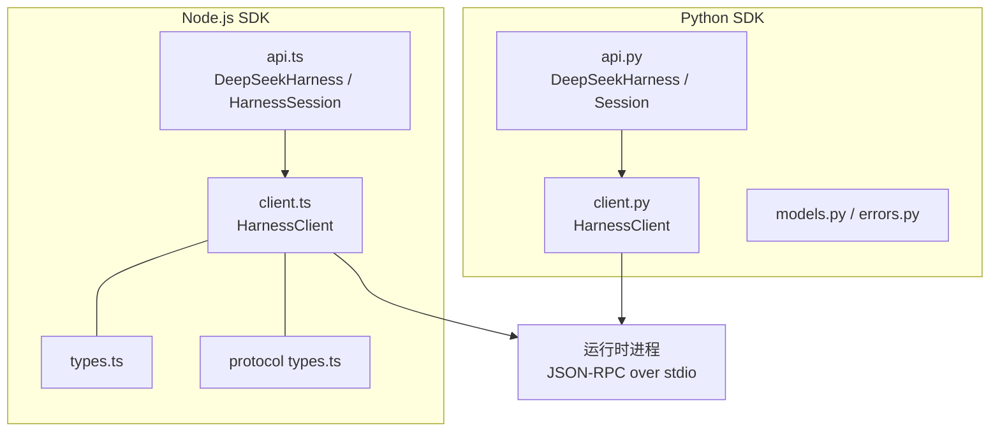
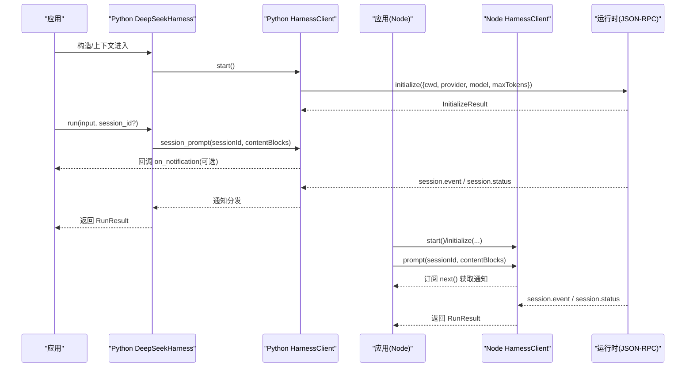
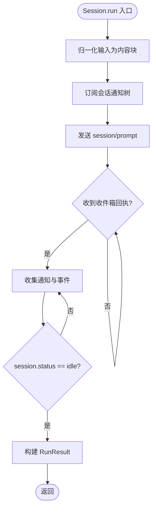
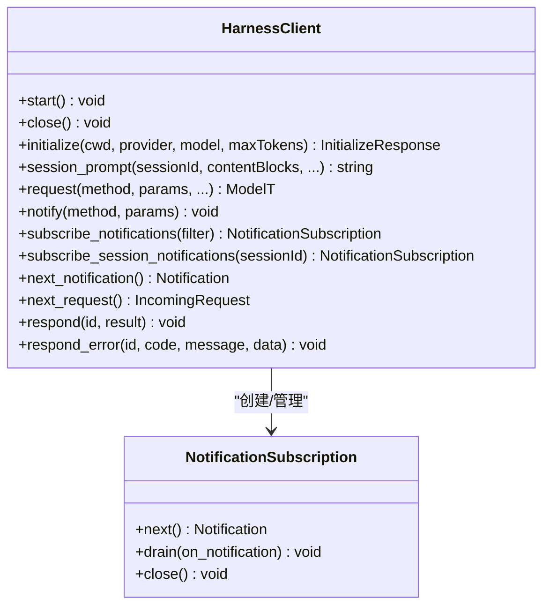
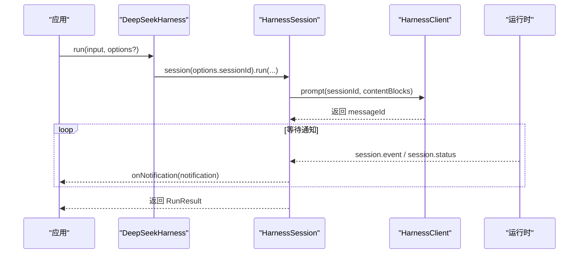
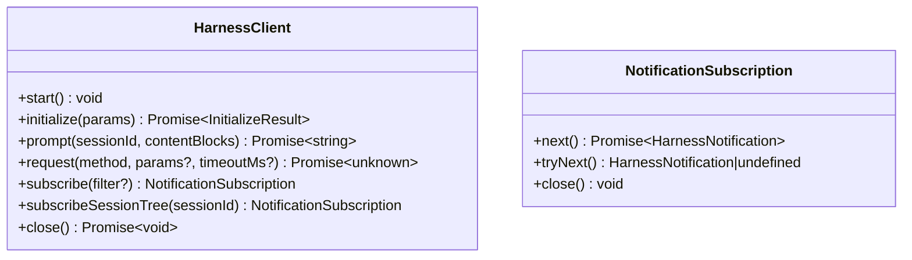
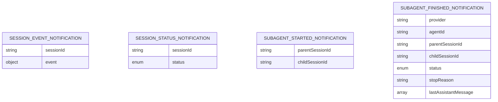
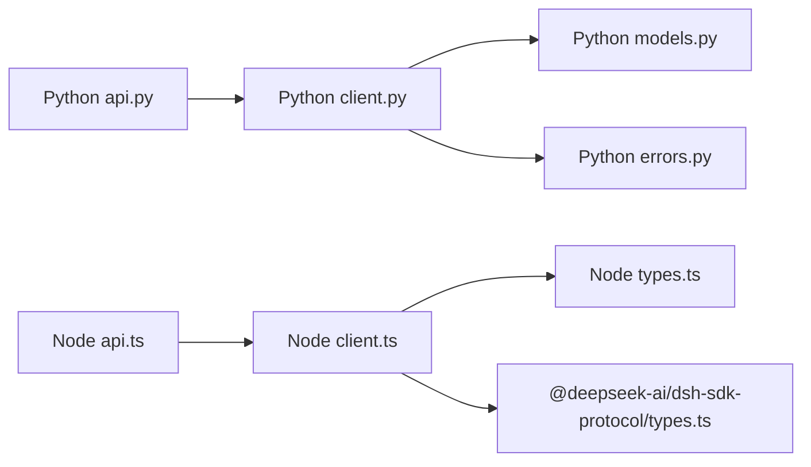

# SDK 参考

<cite>
**本文引用的文件**
- [python/sdk/src/deepseek_harness/__init__.py](file://python/sdk/src/deepseek_harness/__init__.py)
- [python/sdk/src/deepseek_harness/api.py](file://python/sdk/src/deepseek_harness/api.py)
- [python/sdk/src/deepseek_harness/client.py](file://python/sdk/src/deepseek_harness/client.py)
- [python/sdk/src/deepseek_harness/models.py](file://python/sdk/src/deepseek_harness/models.py)
- [python/sdk/src/deepseek_harness/errors.py](file://python/sdk/src/deepseek_harness/errors.py)
- [python/sdk/README.md](file://python/sdk/README.md)
- [examples/jsonrpc-agent/minimal.py](file://examples/jsonrpc-agent/minimal.py)
- [packages/sdk/client/src/index.ts](file://packages/sdk/client/src/index.ts)
- [packages/sdk/client/src/types.ts](file://packages/sdk/client/src/types.ts)
- [packages/sdk/client/src/client.ts](file://packages/sdk/client/src/client.ts)
- [packages/sdk/client/src/api.ts](file://packages/sdk/client/src/api.ts)
- [packages/sdk/protocol/src/types.ts](file://packages/sdk/protocol/src/types.ts)
</cite>

## 目录
1. [简介](#简介)
2. [项目结构](#项目结构)
3. [核心组件](#核心组件)
4. [架构总览](#架构总览)
5. [详细组件分析](#详细组件分析)
6. [依赖关系分析](#依赖关系分析)
7. [性能与资源管理](#性能与资源管理)
8. [故障排查指南](#故障排查指南)
9. [结论](#结论)
10. [附录：版本兼容、弃用与迁移](#附录版本兼容弃用与迁移)

## 简介
本参考文档面向 DeepSeek Harness 的 Python SDK 与 Node.js SDK，提供完整的公共 API 说明、异步模型、错误处理、资源管理与最佳实践。两个 SDK 通过 JSON-RPC over stdio 驱动同一运行时进程，Python 侧使用子进程与线程队列，Node.js 侧使用 child_process 与事件流；两者在高层语义上保持一致：启动运行时、初始化握手、会话提示、订阅通知、等待空闲并返回结果。

## 项目结构
- Python SDK
  - 入口导出：deepseek_harness.__init__
  - 高层 API：DeepSeekHarness、Session、RunResult、配置对象
  - 低层客户端：HarnessClient（JSON-RPC over stdio）
  - 数据模型与异常：models.py、errors.py
- Node.js SDK
  - 模块导出：@deepseek-ai/dsh-sdk-client
  - 类型定义：types.ts
  - 协议契约：@deepseek-ai/dsh-sdk-protocol/types.ts
  - 低层客户端：client.ts
  - 高层 API：api.ts（DeepSeekHarness、HarnessSession）

**图示来源**
- [python/sdk/src/deepseek_harness/api.py:48-124](file://python/sdk/src/deepseek_harness/api.py#L48-L124)
- [python/sdk/src/deepseek_harness/client.py:37-185](file://python/sdk/src/deepseek_harness/client.py#L37-L185)
- [packages/sdk/client/src/api.ts:22-119](file://packages/sdk/client/src/api.ts#L22-L119)
- [packages/sdk/client/src/client.ts:184-383](file://packages/sdk/client/src/client.ts#L184-L383)
- [packages/sdk/protocol/src/types.ts:15-105](file://packages/sdk/protocol/src/types.ts#L15-L105)

**章节来源**
- [python/sdk/src/deepseek_harness/__init__.py:1-19](file://python/sdk/src/deepseek_harness/__init__.py#L1-L19)
- [packages/sdk/client/src/index.ts:1-30](file://packages/sdk/client/src/index.ts#L1-L30)

## 核心组件
- Python SDK
  - DeepSeekHarness：高层同步 API，管理运行时生命周期，支持上下文管理器
  - Session：会话级 run(input, on_notification)，收集事件与通知，返回 RunResult
  - HarnessConfig / DeepSeekHarnessConfig：运行时与环境注入配置
  - HarnessClient：低层 JSON-RPC 客户端，负责子进程、读写线程、通知分发、超时与关闭
  - 数据模型：Notification、IncomingRequest、InitializeResponse、ServerInfo
  - 异常：HarnessError、TransportClosedError、SdkProtocolError、JsonRpcError
- Node.js SDK
  - DeepSeekHarness：高层异步 API，管理运行时生命周期，支持 async disposable
  - HarnessSession：会话级 run(input, options)，收集事件与通知，返回 RunResult
  - HarnessClientOptions / HarnessClient：运行时启动、请求、通知订阅、关闭流程
  - 类型：ContentBlock、RunResult、HarnessNotification、NotificationFilter
  - 协议类型：initialize/session/prompt/shutdown 及四类通知

**章节来源**
- [python/sdk/src/deepseek_harness/api.py:13-183](file://python/sdk/src/deepseek_harness/api.py#L13-L183)
- [python/sdk/src/deepseek_harness/client.py:24-210](file://python/sdk/src/deepseek_harness/client.py#L24-L210)
- [python/sdk/src/deepseek_harness/models.py:8-33](file://python/sdk/src/deepseek_harness/models.py#L8-L33)
- [python/sdk/src/deepseek_harness/errors.py:4-24](file://python/sdk/src/deepseek_harness/errors.py#L4-L24)
- [packages/sdk/client/src/types.ts:11-75](file://packages/sdk/client/src/types.ts#L11-L75)
- [packages/sdk/client/src/api.ts:22-195](file://packages/sdk/client/src/api.ts#L22-L195)
- [packages/sdk/client/src/client.ts:184-383](file://packages/sdk/client/src/client.ts#L184-L383)
- [packages/sdk/protocol/src/types.ts:15-105](file://packages/sdk/protocol/src/types.ts#L15-L105)

## 架构总览
两个 SDK 共享同一运行时协议：
- 启动：调用 start() 或构造时惰性启动，创建子进程并通过 stdio 建立 JSON-RPC 传输
- 初始化：发送 initialize，携带 cwd/provider/model/maxTokens
- 会话提示：session/prompt，返回 messageId，随后通过 session.event 与 session.status 推进
- 通知：session.event、session.status、subagent.started、subagent.finished
- 关闭：shutdown 请求后按 EOF→SIGTERM→SIGKILL 阶梯回收进程

**图示来源**
- [python/sdk/src/deepseek_harness/api.py:97-124](file://python/sdk/src/deepseek_harness/api.py#L97-L124)
- [python/sdk/src/deepseek_harness/client.py:117-155](file://python/sdk/src/deepseek_harness/client.py#L117-L155)
- [packages/sdk/client/src/api.ts:62-119](file://packages/sdk/client/src/api.ts#L62-L119)
- [packages/sdk/client/src/client.ts:268-290](file://packages/sdk/client/src/client.ts#L268-L290)
- [packages/sdk/protocol/src/types.ts:15-105](file://packages/sdk/protocol/src/types.ts#L15-L105)

## 详细组件分析

### Python SDK 高层 API：DeepSeekHarness 与 Session
- DeepSeekHarness
  - 构造：接受 DeepSeekHarnessConfig 或关键字参数；内部设置 cwd/runtime_cwd/env，并创建 HarnessClient
  - 生命周期：start() 惰性启动并 initialize；close() 安全关闭；支持 with 上下文
  - 便捷方法：run(input, session_id?, on_notification?) 委托给 Session.run
- Session
  - run(input, on_notification?)：归一化输入为内容块，订阅会话通知树，等待收件箱回执与 idle 状态，提取 final_response 与 finish_reason
  - 事件解析：从 assistant/message 拼接文本；从 turn/end 提取 reason.kind，缺失则抛出 SdkProtocolError

**图示来源**
- [python/sdk/src/deepseek_harness/api.py:127-183](file://python/sdk/src/deepseek_harness/api.py#L127-L183)
- [python/sdk/src/deepseek_harness/api.py:199-243](file://python/sdk/src/deepseek_harness/api.py#L199-L243)

**章节来源**
- [python/sdk/src/deepseek_harness/api.py:48-183](file://python/sdk/src/deepseek_harness/api.py#L48-L183)

### Python SDK 低层客户端：HarnessClient
- 进程管理：start() 启动子进程，读取 stdout/stderr；close() 发送 shutdown 并按需 terminate/kill
- 请求与响应：request(method, params, response_model, timeout_seconds, ...) 封装 JSON-RPC 请求与超时
- 通知系统：subscribe_notifications(filter?) 与 subscribe_session_tree(session_id)；NotificationSubscription 提供 next()/drain()
- 会话关系：记录 subagent.started 父子关系，过滤属于根会话及其后代的通知
- 诊断：失败时附加 stderr 尾部与退出码信息

**图示来源**
- [python/sdk/src/deepseek_harness/client.py:37-210](file://python/sdk/src/deepseek_harness/client.py#L37-L210)
- [python/sdk/src/deepseek_harness/client.py:507-546](file://python/sdk/src/deepseek_harness/client.py#L507-L546)

**章节来源**
- [python/sdk/src/deepseek_harness/client.py:63-116](file://python/sdk/src/deepseek_harness/client.py#L63-L116)
- [python/sdk/src/deepseek_harness/client.py:117-210](file://python/sdk/src/deepseek_harness/client.py#L117-L210)
- [python/sdk/src/deepseek_harness/client.py:228-309](file://python/sdk/src/deepseek_harness/client.py#L228-L309)
- [python/sdk/src/deepseek_harness/client.py:318-397](file://python/sdk/src/deepseek_harness/client.py#L318-L397)
- [python/sdk/src/deepseek_harness/client.py:424-504](file://python/sdk/src/deepseek_harness/client.py#L424-L504)

### Node.js SDK 高层 API：DeepSeekHarness 与 HarnessSession
- DeepSeekHarness
  - 构造：接收 DeepSeekHarnessOptions（launch + provider/model/cwd/maxTokens）
  - 生命周期：start() 惰性启动并 initialize；close() 释放；支持 await using
  - 便捷方法：run(input, options?) 委托给 HarnessSession.run
- HarnessSession
  - run(input, options?)：归一化输入，订阅会话树，等待收件箱回执与 idle，提取 finalResponse
  - 事件校验：validatedSessionEvent 对 assistant/message 的内容块进行严格校验

**图示来源**
- [packages/sdk/client/src/api.ts:22-119](file://packages/sdk/client/src/api.ts#L22-L119)
- [packages/sdk/client/src/api.ts:132-195](file://packages/sdk/client/src/api.ts#L132-L195)
- [packages/sdk/client/src/client.ts:268-290](file://packages/sdk/client/src/client.ts#L268-L290)

**章节来源**
- [packages/sdk/client/src/api.ts:22-195](file://packages/sdk/client/src/api.ts#L22-L195)

### Node.js SDK 低层客户端：HarnessClient
- 进程管理：start() 使用 child_process.spawn，维护 stderr 尾行；close() 发送 shutdown 并执行 EOF→SIGTERM→SIGKILL 回收
- 请求与响应：request(method, params?, timeoutMs?) 基于 JsonRpcLineTransport；超时抛出 RequestTimeoutError
- 通知系统：subscribe(filter?) 与 subscribeSessionTree(sessionId)；NotificationSubscription 提供 next()/tryNext()/close()
- 会话关系：记录 subagent.started 父子关系，过滤属于根会话及其后代的通知

**图示来源**
- [packages/sdk/client/src/client.ts:184-383](file://packages/sdk/client/src/client.ts#L184-L383)
- [packages/sdk/client/src/client.ts:342-372](file://packages/sdk/client/src/client.ts#L342-L372)

**章节来源**
- [packages/sdk/client/src/client.ts:203-260](file://packages/sdk/client/src/client.ts#L203-L260)
- [packages/sdk/client/src/client.ts:268-333](file://packages/sdk/client/src/client.ts#L268-L333)
- [packages/sdk/client/src/client.ts:380-401](file://packages/sdk/client/src/client.ts#L380-L401)

### 协议与数据模型
- 协议方法
  - initialize：传入 cwd、provider、model、maxTokens；返回 serverInfo
  - session/prompt：传入 sessionId、contentBlocks；返回 messageId
  - shutdown：无参；用于优雅关闭
- 通知类型
  - session.event：包含 sessionId 与 event 信封
  - session.status：sessionId 与 status（idle/running）
  - subagent.started：parentSessionId、childSessionId
  - subagent.finished：provider、agentId、parentSessionId、childSessionId、status、stopReason、lastAssistantMessage?

**图示来源**
- [packages/sdk/protocol/src/types.ts:50-98](file://packages/sdk/protocol/src/types.ts#L50-L98)

**章节来源**
- [packages/sdk/protocol/src/types.ts:15-105](file://packages/sdk/protocol/src/types.ts#L15-L105)

### 示例与最佳实践
- Python 最小示例：通过命令行参数与配置文件运行一次对话
  - 路径参考：[examples/jsonrpc-agent/minimal.py](file://examples/jsonrpc-agent/minimal.py)
- Python 安装与快速开始：
  - 安装 deepseek-harness-sdk，默认无需指定可执行路径；使用 with 上下文确保进程回收
  - 路径参考：[python/sdk/README.md](file://python/sdk/README.md)
- Node.js 使用模式：
  - 通过 launch.command 指定运行时可执行；使用 requestTimeoutMs 控制单次请求超时；使用 subscribeSessionTree 监听会话树通知

**章节来源**
- [examples/jsonrpc-agent/minimal.py:16-39](file://examples/jsonrpc-agent/minimal.py#L16-L39)
- [python/sdk/README.md:1-52](file://python/sdk/README.md#L1-L52)

## 依赖关系分析
- Python SDK
  - api.py 依赖 client.py、models.py、errors.py
  - client.py 依赖 models.py、errors.py，并使用 subprocess、threading、queue
- Node.js SDK
  - api.ts 依赖 client.ts、types.ts
  - client.ts 依赖 @deepseek-ai/dsh-sdk-protocol、node:child_process、dispose 工具
  - 类型与协议由 protocol/types.ts 统一约束

**图示来源**
- [python/sdk/src/deepseek_harness/api.py:1-11](file://python/sdk/src/deepseek_harness/api.py#L1-L11)
- [python/sdk/src/deepseek_harness/client.py:1-19](file://python/sdk/src/deepseek_harness/client.py#L1-L19)
- [packages/sdk/client/src/api.ts:1-15](file://packages/sdk/client/src/api.ts#L1-L15)
- [packages/sdk/client/src/client.ts:15-25](file://packages/sdk/client/src/client.ts#L15-L25)
- [packages/sdk/protocol/src/types.ts:1-14](file://packages/sdk/protocol/src/types.ts#L1-L14)

**章节来源**
- [python/sdk/src/deepseek_harness/api.py:1-11](file://python/sdk/src/deepseek_harness/api.py#L1-L11)
- [packages/sdk/client/src/index.ts:1-30](file://packages/sdk/client/src/index.ts#L1-L30)

## 性能与资源管理
- 进程复用
  - Python：DeepSeekHarness 持有单个 HarnessClient，多次 run 复用同一子进程
  - Node：DeepSeekHarness 同样复用 HarnessClient，避免重复启动开销
- 超时与终止
  - Python：request_timeout_seconds 控制请求等待；shutdown_timeout_seconds 控制关闭超时
  - Node：requestTimeoutMs 控制请求超时；shutdownTimeoutMs、disposeEofGraceMs、disposeGraceMs 控制关闭阶梯
- 通知与事件
  - 两者均支持 on_notification 回调与订阅器；Python 使用 queue，Node 使用 Promise/队列混合
  - 会话树过滤：仅收集根会话及其后代的通知，避免污染
- 资源清理
  - Python：with 上下文或显式 close()；子进程 stdin/stdout/stderr 安全关闭
  - Node：await using 或显式 close()；EOF→SIGTERM→SIGKILL 回收

**章节来源**
- [python/sdk/src/deepseek_harness/api.py:48-111](file://python/sdk/src/deepseek_harness/api.py#L48-L111)
- [python/sdk/src/deepseek_harness/client.py:63-116](file://python/sdk/src/deepseek_harness/client.py#L63-L116)
- [packages/sdk/client/src/api.ts:22-119](file://packages/sdk/client/src/api.ts#L22-L119)
- [packages/sdk/client/src/client.ts:184-401](file://packages/sdk/client/src/client.ts#L184-L401)

## 故障排查指南
- 常见异常
  - Python
    - TransportClosedError：运行时子进程退出或 stdout 关闭
    - SdkProtocolError：运行时数据不符合协议（如 turn/end 缺少 reason.kind）
    - JsonRpcError：运行时返回 JSON-RPC 错误响应
  - Node
    - TransportClosedError：运行时不可用或已关闭
    - RequestTimeoutError：请求超时
    - SdkProtocolError：运行时返回不符合协议的结果（如 session/prompt 未返回 messageId）
- 诊断信息
  - Python：关闭或超时时附加 stderr 尾部与退出码
  - Node：closedError 包含 spawn error、exit code、stderr tail
- 调试建议
  - 启用 on_notification 观察 session.event 与 session.status
  - 检查 cwd 与 runtime_cwd 是否解析为绝对路径
  - 确认 DSH_CORDIS_CONFIG 指向正确的 Cordis 配置
  - 对于长时间任务，合理设置 requestTimeoutMs/request_timeout_seconds

**章节来源**
- [python/sdk/src/deepseek_harness/errors.py:4-24](file://python/sdk/src/deepseek_harness/errors.py#L4-L24)
- [python/sdk/src/deepseek_harness/client.py:399-422](file://python/sdk/src/deepseek_harness/client.py#L399-L422)
- [packages/sdk/client/src/client.ts:38-65](file://packages/sdk/client/src/client.ts#L38-L65)
- [packages/sdk/client/src/client.ts:451-457](file://packages/sdk/client/src/client.ts#L451-L457)

## 结论
Python 与 Node.js SDK 提供了对称的高层 API 与一致的低层协议实现，便于跨语言集成与复用。通过会话树通知、严格的协议校验与完善的资源管理，开发者可以稳定地驱动 DeepSeek Harness 运行时完成多轮对话与复杂任务。建议在工程中结合 on_notification 与 RunResult.events 进行可观测性建设，并依据任务特性配置合适的超时与关闭策略。

## 附录：版本兼容、弃用与迁移
- 版本兼容性
  - Python SDK 与 Node SDK 共享同一运行时协议；协议类型在 @deepseek-ai/dsh-sdk-protocol/types.ts 中统一定义
  - Python 与 Node 的 initialize/session/prompt/shutdown 方法与通知类型保持一致
- 弃用与迁移
  - 当前代码库未发现明确的弃用标记；如需升级，优先关注协议类型变更与运行时行为变化
  - 迁移建议：保持 on_notification 与 RunResult.notifications/events 的使用方式，以兼容未来扩展
- 集成注意事项
  - 环境变量：DEEPSEEK_BASE_URL、DEEPSEEK_API_KEY、DSH_CWD、DSH_SESSION_ROOT、DSH_CORDIS_CONFIG
  - 工作目录：cwd 与 runtime_cwd 必须解析为绝对路径，避免双重相对路径问题
  - 配置注入：当使用 bundled 运行时且未显式设置 DSH_CORDIS_CONFIG 时，SDK 会注入默认配置

**章节来源**
- [packages/sdk/protocol/src/types.ts:15-105](file://packages/sdk/protocol/src/types.ts#L15-L105)
- [python/sdk/src/deepseek_harness/client.py:424-454](file://python/sdk/src/deepseek_harness/client.py#L424-L454)
- [python/sdk/README.md:27-52](file://python/sdk/README.md#L27-L52)