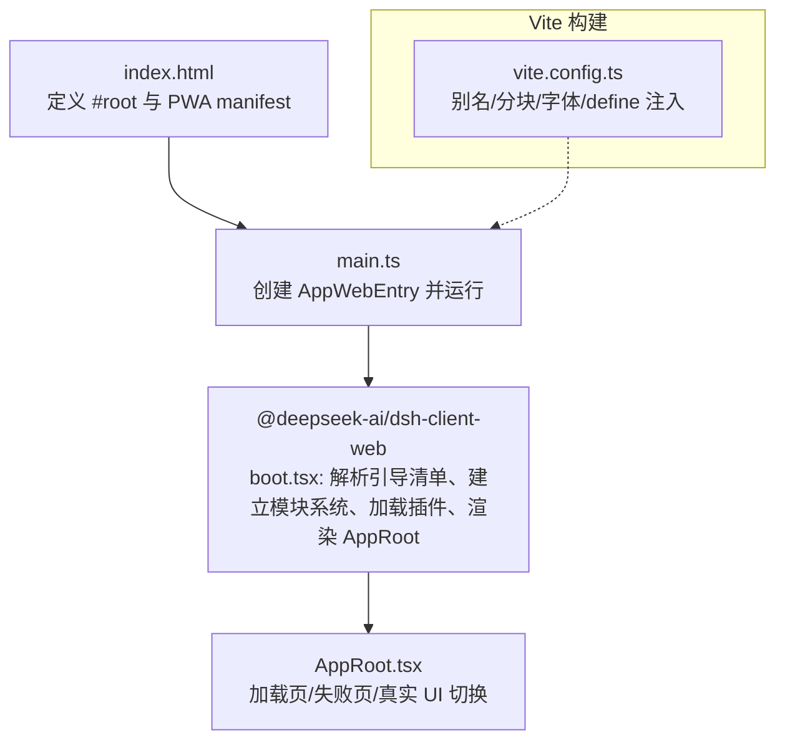
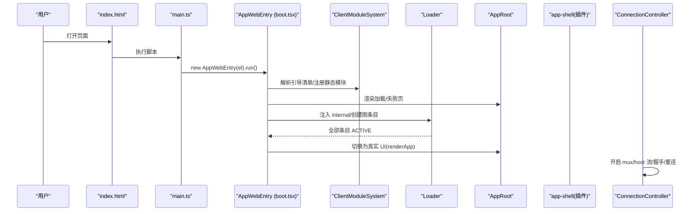
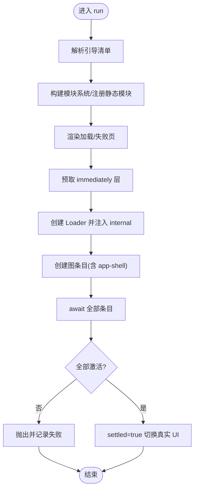
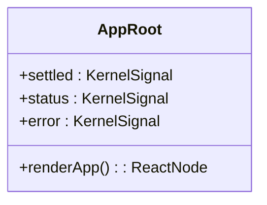
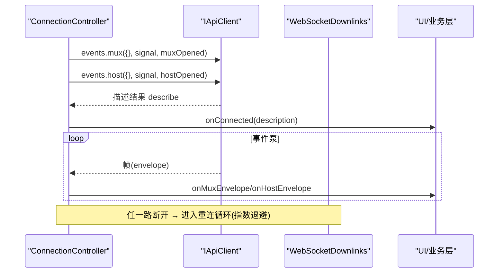
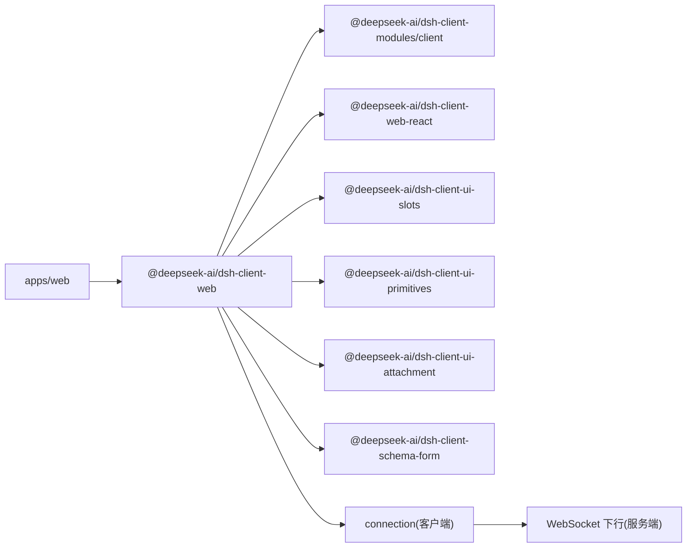

# Web 界面

<cite>
**本文引用的文件**
- [apps/web/package.json](file://apps/web/package.json)
- [apps/web/vite.config.ts](file://apps/web/vite.config.ts)
- [apps/web/index.html](file://apps/web/index.html)
- [apps/web/src/main.ts](file://apps/web/src/main.ts)
- [packages/client/web/src/boot.tsx](file://packages/client/web/src/boot.tsx)
- [packages/client/web/src/AppRoot.tsx](file://packages/client/web/src/AppRoot.tsx)
- [packages/client/connection/src/client/connection.ts](file://packages/client/connection/src/client/connection.ts)
- [packages/client/connection/src/websocket-downlink.ts](file://packages/client/connection/src/websocket-downlink.ts)
- [packages/client/ui-theme/src/index.ts](file://packages/client/ui-theme/src/index.ts)
- [packages/client/ui-theme/src/theme-settings.ts](file://packages/client/ui-theme/src/theme-settings.ts)
</cite>

## 目录
1. [简介](#简介)
2. [项目结构](#项目结构)
3. [核心组件](#核心组件)
4. [架构总览](#架构总览)
5. [详细组件分析](#详细组件分析)
6. [依赖分析](#依赖分析)
7. [性能考虑](#性能考虑)
8. [故障排查指南](#故障排查指南)
9. [结论](#结论)
10. [附录](#附录)

## 简介
本文件全面介绍 DeepSeek Harness 的 Web 前端界面，聚焦基于 Vite 的前端工程化、React 组件与状态管理、实时通信（WebSocket）连接管理与消息处理、主题与可访问性、扩展方式、开发工作流（热重载/调试/测试），以及性能优化与用户体验改进建议。文档以仓库实际代码为依据，提供可视化图示与源码路径引用，便于快速定位实现细节。

## 项目结构
Web 应用位于 apps/web，采用 Vite + React 构建，入口仅负责挂载并委托给壳库 @deepseek-ai/dsh-client-web；真正的启动、模块系统、插件装配与 UI 渲染在 packages/client/web 中完成。Vite 配置对产物分块、字体资源、别名与浏览器环境适配做了专门优化。

图表来源
- [apps/web/index.html:1-15](file://apps/web/index.html#L1-L15)
- [apps/web/src/main.ts:1-11](file://apps/web/src/main.ts#L1-L11)
- [packages/client/web/src/boot.tsx:1-239](file://packages/client/web/src/boot.tsx#L1-L239)
- [packages/client/web/src/AppRoot.tsx:1-61](file://packages/client/web/src/AppRoot.tsx#L1-L61)
- [apps/web/vite.config.ts:1-161](file://apps/web/vite.config.ts#L1-L161)

章节来源
- [apps/web/package.json:1-52](file://apps/web/package.json#L1-L52)
- [apps/web/vite.config.ts:1-161](file://apps/web/vite.config.ts#L1-L161)
- [apps/web/index.html:1-15](file://apps/web/index.html#L1-L15)
- [apps/web/src/main.ts:1-11](file://apps/web/src/main.ts#L1-L11)
- [packages/client/web/src/boot.tsx:1-239](file://packages/client/web/src/boot.tsx#L1-L239)
- [packages/client/web/src/AppRoot.tsx:1-61](file://packages/client/web/src/AppRoot.tsx#L1-L61)

## 核心组件
- 启动内核：AppWebEntry 负责解析引导清单、初始化模块系统、注册静态模块、并行预取 immediately 层、挂载 Loader、创建图条目、等待激活并完成“全量扫描”，最终将 UI 切换到真实界面。
- 根组件：AppRoot 根据 boot 状态展示加载或失败信息，并在 boot 完成后调用 renderApp 渲染由 app-shell 提供的真实 UI。
- 连接控制器：ConnectionController 维护双通道（mux/host）事件流的生命周期，包含指数退避重连、握手超时、状态去抖上报等。
- WebSocket 下行：WebSocketDownlinks 在服务端完成协议升级与帧泵送，确保只允许服务端到浏览器的下行流量。

章节来源
- [packages/client/web/src/boot.tsx:68-239](file://packages/client/web/src/boot.tsx#L68-L239)
- [packages/client/web/src/AppRoot.tsx:16-61](file://packages/client/web/src/AppRoot.tsx#L16-L61)
- [packages/client/connection/src/client/connection.ts:1-203](file://packages/client/connection/src/client/connection.ts#L1-L203)
- [packages/client/connection/src/websocket-downlink.ts:1-154](file://packages/client/connection/src/websocket-downlink.ts#L1-L154)

## 架构总览
Web 前端通过 Vite 构建，入口极薄，真正逻辑集中在壳库。壳库使用 Cordis 插件体系与自定义 ClientModuleSystem 进行模块装配与加载，UI 由 React 驱动，并通过连接层与后端保持双向能力（上行 HTTP RPC，下行 WebSocket 事件）。

图表来源
- [apps/web/index.html:1-15](file://apps/web/index.html#L1-L15)
- [apps/web/src/main.ts:1-11](file://apps/web/src/main.ts#L1-L11)
- [packages/client/web/src/boot.tsx:97-208](file://packages/client/web/src/boot.tsx#L97-L208)
- [packages/client/web/src/AppRoot.tsx:28-61](file://packages/client/web/src/AppRoot.tsx#L28-L61)
- [packages/client/connection/src/client/connection.ts:107-169](file://packages/client/connection/src/client/connection.ts#L107-L169)

## 详细组件分析

### 启动与装配（AppWebEntry）
- 职责：解析 window.__DSH_BOOT__ 中的 BootManifest，构建 ClientModuleSystem，注册 shell 自有模块（app-shell 与 modules 客户端），挂载 React Root，预取 immediately 层，创建 Loader 并生成所有图条目，等待全部激活后切换 UI。
- 错误处理：启动期异常不会直接崩溃页面，而是记录到 error signal，AppRoot 显示失败报告；同时保留加载态以便诊断。
- 关键流程：prefetchImmediateTier → runPluginBoot → loader.await → assertEntriesActive → settled.set(true)。

图表来源
- [packages/client/web/src/boot.tsx:97-239](file://packages/client/web/src/boot.tsx#L97-L239)

章节来源
- [packages/client/web/src/boot.tsx:68-239](file://packages/client/web/src/boot.tsx#L68-L239)

### 根组件与状态门控（AppRoot）
- 职责：订阅 kernel 信号（settled/status/error），在未就绪时展示加载或失败卡片；就绪后调用 renderApp 渲染真实界面。
- 状态管理：通过 useSyncExternalStore 订阅外部 store，避免重复渲染；失败态会列出失败的条目 ID 与错误信息。

图表来源
- [packages/client/web/src/AppRoot.tsx:16-61](file://packages/client/web/src/AppRoot.tsx#L16-L61)

章节来源
- [packages/client/web/src/AppRoot.tsx:1-61](file://packages/client/web/src/AppRoot.tsx#L1-L61)

### 实时通信机制（WebSocket 与连接控制）
- 连接控制器（ConnectionController）
  - 维护两路事件流（mux/host），在握手成功后触发 onConnected；断开后进入 reconnecting 并按指数退避重试。
  - 提供 backoffBaseMs/backoffFactor/backoffMaxMs/streamOpenTimeoutMs 等可调参数，默认值内置。
  - 状态上报去抖，sink 抛错隔离，保证连接层稳定。
- 服务端 WebSocket 下行（WebSocketDownlinks）
  - 仅支持服务端→浏览器下行，禁止客户端上行；收到客户端消息即关闭连接。
  - 统一封装帧发送与错误帧，生命周期内自动清理。

图表来源
- [packages/client/connection/src/client/connection.ts:107-203](file://packages/client/connection/src/client/connection.ts#L107-L203)
- [packages/client/connection/src/websocket-downlink.ts:51-138](file://packages/client/connection/src/websocket-downlink.ts#L51-L138)

章节来源
- [packages/client/connection/src/client/connection.ts:1-203](file://packages/client/connection/src/client/connection.ts#L1-L203)
- [packages/client/connection/src/websocket-downlink.ts:1-154](file://packages/client/connection/src/websocket-downlink.ts#L1-L154)

### 主题与样式定制
- 主题包位置：packages/client/ui-theme，提供主题设置、样式与引导注入点。
- 典型能力：外观设置行、设计令牌、滚动条样式、语法高亮样式等。
- 集成方式：通过主题包的 index 暴露的接口与 settings-store 进行运行时主题切换与持久化。

章节来源
- [packages/client/ui-theme/src/index.ts](file://packages/client/ui-theme/src/index.ts)
- [packages/client/ui-theme/src/theme-settings.ts](file://packages/client/ui-theme/src/theme-settings.ts)

### 响应式设计与无障碍
- 视口与 PWA：index.html 声明 viewport 与 manifest.webmanifest，支持移动端基础适配与渐进式增强。
- 可访问性：建议在新增组件时遵循语义化标签、键盘导航、焦点管理与 ARIA 属性；结合主题包的可访问性样式基线。

章节来源
- [apps/web/index.html:1-15](file://apps/web/index.html#L1-L15)

### 扩展 Web 界面（添加新组件/页面）
- 推荐方式：以插件形式接入，通过壳库的模块系统与 Loader 动态加载，避免修改壳库核心。
- 步骤概览：
  1) 在宿主图（host graph）中新增一个图条目（bundle），导出必要的服务/插槽。
  2) 在插件中注册 UI 插槽或命令，按需挂载到现有布局。
  3) 若需新的路由/页面，通过 app-shell 提供的路由能力或布局槽位嵌入。
  4) 利用主题包进行样式定制，遵循设计令牌。
- 注意：shell 自足规则要求加载页不依赖插件；新增功能应通过插件边界引入。

[本节为概念性说明，不直接分析具体文件]

### 前端开发工作流（热重载/调试/测试）
- 开发与构建
  - 使用 Vite 开发服务器与构建管线；apps/web/vite.config.ts 定义了别名、分块策略与 define 注入，确保浏览器环境与插件 HMR 兼容。
  - 构建产物按 assets/langs、assets/fonts 等分组，利于缓存与增量更新。
- 调试
  - 启用 sourcemap 便于断点调试；浏览器控制台可查看连接层日志与启动失败报告。
  - 连接层提供 onStateChange 回调，便于观察 connected/reconnecting 状态变化。
- 测试
  - 单元测试与快照测试：vitest 用于单元与快照验证。
  - E2E 测试：Playwright 覆盖关键交互场景（如聊天、终端、设置等）。
  - 启动阶段可通过 seams 注入 loadBundle 以替换网络行为，便于离线测试。

章节来源
- [apps/web/vite.config.ts:92-161](file://apps/web/vite.config.ts#L92-L161)
- [packages/client/web/src/boot.tsx:150-158](file://packages/client/web/src/boot.tsx#L150-L158)
- [packages/client/connection/src/client/connection.ts:171-203](file://packages/client/connection/src/client/connection.ts#L171-L203)

## 依赖分析
- 应用层依赖：apps/web 仅依赖 React、React DOM 与 dsh-client-web；其余能力来自 workspace 内的 client-* 包。
- 构建期依赖：Vite、@vitejs/plugin-react、TypeScript、Playwright、Vitest。
- 运行时依赖：Cordis 插件体系、ClientModuleSystem、连接层（HTTP/RPC/WebSocket）。

图表来源
- [apps/web/package.json:28-49](file://apps/web/package.json#L28-L49)
- [apps/web/vite.config.ts:138-149](file://apps/web/vite.config.ts#L138-L149)
- [packages/client/connection/src/websocket-downlink.ts:51-138](file://packages/client/connection/src/websocket-downlink.ts#L51-L138)

章节来源
- [apps/web/package.json:1-52](file://apps/web/package.json#L1-L52)
- [apps/web/vite.config.ts:138-149](file://apps/web/vite.config.ts#L138-L149)

## 性能考虑
- 分块与缓存
  - 将数学/高亮/Markdown 解析等重型依赖放入 vendor chunk，减少主包体积；语法高亮语言按需懒加载，独立 lang 分块。
  - 字体资源归类至 assets/fonts，提升缓存命中率。
- 启动优化
  - immediately 层预取工厂注册，避免同步 require 边导致的阻塞；Loader 创建与条目生成并发执行，缩短首屏时间。
  - 严格握手超时保护，防止无响应的载体导致连接永久挂起。
- 运行时优化
  - 连接层 sink 异常隔离，避免业务层错误影响连接稳定性。
  - 状态上报去抖，减少不必要的 UI 刷新。
- 建议
  - 新增重型依赖时评估是否放入 vendor 或懒加载。
  - 对长列表/大文档使用虚拟滚动与增量渲染。
  - 合理使用主题与 CSS Modules，避免全局样式污染。

[本节为通用性能指导，不直接分析具体文件]

## 故障排查指南
- 启动失败
  - 现象：AppRoot 显示“Failed to load plugins”及失败条目列表。
  - 排查：检查引导清单、模块系统注册、Loader 条目是否全部 ACTIVE；查看控制台错误与启动日志。
  - 相关实现：启动失败会被捕获并写入 error signal，AppRoot 展示失败报告。
- 连接问题
  - 现象：UI 显示 reconnecting；控制台出现重试日志。
  - 排查：确认后端 WebSocket 可用、代理未拦截；检查 streamOpenTimeoutMs 是否过短；查看 onStateChange 状态变化。
  - 相关实现：ConnectionController 的指数退避与超时保护；WebSocketDownlinks 拒绝非法上行消息。
- 构建与 HMR
  - 现象：Vite 预览模式被拒绝；HMR 不生效。
  - 排查：必须通过 dsh web 启动；确保 dev:web 与 dsh web 同时运行以获得插件级 HMR；检查 vite.config.ts 的 rejectStandaloneServe 插件。

章节来源
- [packages/client/web/src/AppRoot.tsx:28-61](file://packages/client/web/src/AppRoot.tsx#L28-L61)
- [packages/client/web/src/boot.tsx:135-143](file://packages/client/web/src/boot.tsx#L135-L143)
- [packages/client/connection/src/client/connection.ts:132-169](file://packages/client/connection/src/client/connection.ts#L132-L169)
- [packages/client/connection/src/websocket-downlink.ts:104-116](file://packages/client/connection/src/websocket-downlink.ts#L104-L116)
- [apps/web/vite.config.ts:11-19](file://apps/web/vite.config.ts#L11-L19)

## 结论
DeepSeek Harness 的 Web 前端以极简入口配合强大的壳库与插件体系，实现了模块化、可扩展且高性能的界面。Vite 构建策略保障了加载性能与缓存效率；连接层提供了健壮的实时通信与重连机制；主题与样式体系支持灵活定制。通过插件化扩展与完善的测试/调试工具链，团队可以高效迭代并持续优化用户体验。

## 附录
- 常用命令
  - 开发：pnpm dsh web（配合 pnpm run dev:web 获得插件级 HMR）
  - 构建：pnpm build（Vite 构建）
- 关键路径
  - 入口：apps/web/src/main.ts
  - 启动内核：packages/client/web/src/boot.tsx
  - 根组件：packages/client/web/src/AppRoot.tsx
  - 连接层：packages/client/connection/src/client/connection.ts
  - 服务端下行：packages/client/connection/src/websocket-downlink.ts
  - 主题：packages/client/ui-theme/src/index.ts

[本节为补充信息，不直接分析具体文件]