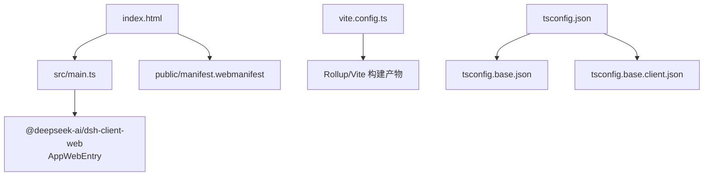
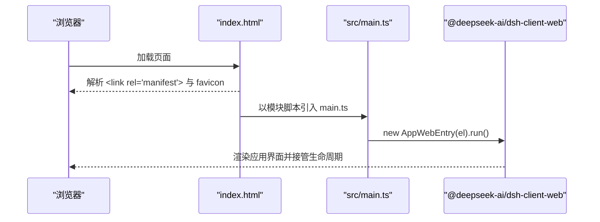
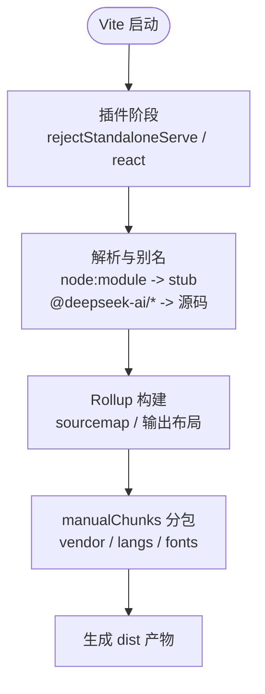
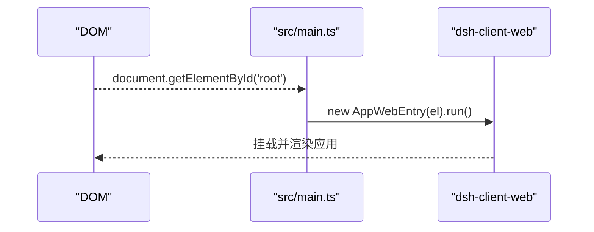
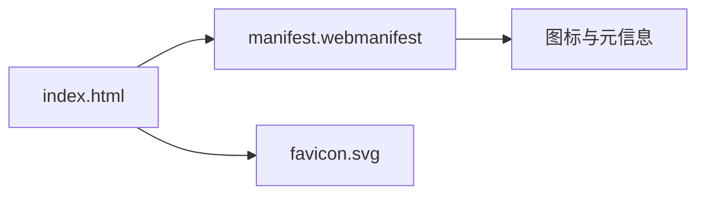
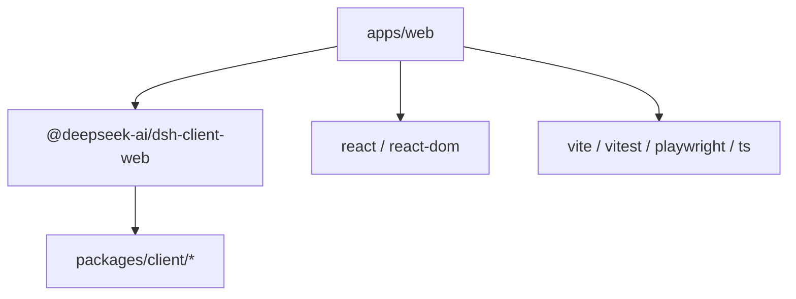

# 前端架构

<cite>
**本文引用的文件**
- [apps/web/package.json](file://apps/web/package.json)
- [apps/web/vite.config.ts](file://apps/web/vite.config.ts)
- [apps/web/src/main.ts](file://apps/web/src/main.ts)
- [apps/web/src/node-module-stub.ts](file://apps/web/src/node-module-stub.ts)
- [apps/web/tsconfig.json](file://apps/web/tsconfig.json)
- [tsconfig.base.json](file://tsconfig.base.json)
- [tsconfig.base.client.json](file://tsconfig.base.client.json)
- [apps/web/index.html](file://apps/web/index.html)
- [apps/web/public/manifest.webmanifest](file://apps/web/public/manifest.webmanifest)
- [apps/web/tests/pwa-manifest.e2e.ts](file://apps/web/tests/pwa-manifest.e2e.ts)
</cite>

## 目录
1. [简介](#简介)
2. [项目结构](#项目结构)
3. [核心组件](#核心组件)
4. [架构总览](#架构总览)
5. [详细组件分析](#详细组件分析)
6. [依赖关系分析](#依赖关系分析)
7. [性能考量](#性能考量)
8. [故障排查指南](#故障排查指南)
9. [结论](#结论)
10. [附录](#附录)

## 简介
本文件系统性梳理 DeepSeek Harness Web 界面的前端架构，聚焦基于 Vite 的构建与开发体验、应用入口初始化流程、模块加载与依赖管理、TypeScript 编译配置与 Node.js 模块存根处理、PWA 支持（manifest 与服务工作者集成方式），以及开发与调试环境配置与性能优化策略。目标是帮助开发者快速理解并高效扩展该 Web 前端。

## 项目结构
Web 前端位于 apps/web 子工程，采用“薄壳 + 库”的组织方式：
- index.html：页面入口，声明 PWA manifest 与图标，挂载 #root 容器，并以模块脚本引入 main.ts。
- src/main.ts：极薄的启动器，仅负责查找 DOM 节点并调用 shell 库提供的 AppWebEntry 进行运行。
- vite.config.ts：Vite 构建与开发服务器配置，包含插件、Rollup 输出布局、手动分包、别名与 define 常量注入等。
- tsconfig.json：针对 web 工程的 TypeScript 配置，继承基础配置，限定类型与引用范围。
- public/manifest.webmanifest：PWA 清单，定义名称、作用域、显示模式与图标。
- package.json：脚本命令、依赖与开发依赖，声明以 @deepseek-ai/dsh-client-web 为核心的依赖关系。

**图表来源**
- [apps/web/index.html:1-15](file://apps/web/index.html#L1-L15)
- [apps/web/src/main.ts:1-11](file://apps/web/src/main.ts#L1-L11)
- [apps/web/vite.config.ts:1-161](file://apps/web/vite.config.ts#L1-L161)
- [apps/web/tsconfig.json:1-107](file://apps/web/tsconfig.json#L1-L107)
- [tsconfig.base.json:1-280](file://tsconfig.base.json#L1-L280)
- [tsconfig.base.client.json:1-12](file://tsconfig.base.client.json#L1-L12)
- [apps/web/public/manifest.webmanifest:1-17](file://apps/web/public/manifest.webmanifest#L1-L17)

**章节来源**
- [apps/web/index.html:1-15](file://apps/web/index.html#L1-L15)
- [apps/web/package.json:1-52](file://apps/web/package.json#L1-L52)
- [apps/web/vite.config.ts:1-161](file://apps/web/vite.config.ts#L1-L161)
- [apps/web/src/main.ts:1-11](file://apps/web/src/main.ts#L1-L11)
- [apps/web/tsconfig.json:1-107](file://apps/web/tsconfig.json#L1-L107)
- [apps/web/public/manifest.webmanifest:1-17](file://apps/web/public/manifest.webmanifest#L1-L17)

## 核心组件
- 应用入口 main.ts：定位 #root 元素并实例化 AppWebEntry.run()，将渲染与生命周期委托给 dsh-client-web 库。
- Vite 构建系统：通过自定义插件阻止独立 serve，启用 React 插件；精细控制 Rollup 输出布局与分包策略；通过 alias 将包名映射到源码路径；通过 define 注入常量以适配浏览器环境。
- TypeScript 配置：继承基础配置，设置 ES2024/DOM 目标与严格选项；通过 references 引用 client 相关工程；排除宿主侧 e2e 测试以避免上下文污染。
- PWA 清单：在 index.html 中链接 manifest.webmanifest，定义应用元数据与全屏显示模式；E2E 测试校验产物完整性。

**章节来源**
- [apps/web/src/main.ts:1-11](file://apps/web/src/main.ts#L1-L11)
- [apps/web/vite.config.ts:1-161](file://apps/web/vite.config.ts#L1-L161)
- [apps/web/tsconfig.json:1-107](file://apps/web/tsconfig.json#L1-L107)
- [apps/web/public/manifest.webmanifest:1-17](file://apps/web/public/manifest.webmanifest#L1-L17)
- [apps/web/tests/pwa-manifest.e2e.ts:1-36](file://apps/web/tests/pwa-manifest.e2e.ts#L1-L36)

## 架构总览
Web 前端采用“薄入口 + 库驱动”的架构：HTML 仅负责挂载点与资源声明；main.ts 作为最小启动器；实际 UI、会话、工具链与插件装配均在 @deepseek-ai/dsh-client-web 中完成。Vite 负责开发服务器、热重载与生产构建，并通过别名与常量注入屏蔽 Node 差异，确保浏览器端正确运行。

**图表来源**
- [apps/web/index.html:1-15](file://apps/web/index.html#L1-L15)
- [apps/web/src/main.ts:1-11](file://apps/web/src/main.ts#L1-L11)

## 详细组件分析

### Vite 构建系统与开发服务器
- 插件与保护：
  - 自定义插件 rejectStandaloneServe：当以 Vite 直接 serve 时抛出错误，强制通过 dsh web 启动，避免缺少引导清单导致运行时异常。
  - React 插件：启用 JSX 转换与 React 相关能力。
- 构建输出与分包：
  - 源映射开启，便于调试。
  - 输出布局：主 chunk 与 vendor 置于 assets/ 根目录；语法高亮懒加载 grammar 分块置于 assets/langs/；字体资源置于 assets/fonts/。
  - manualChunks：按 npm 包名精确划分 vendor 包集合，并将特定 boot 语法文件归入 vendor，其余语法保持懒加载。
  - 资源命名：字体按扩展名路由至 fonts 目录，其他静态资源统一命名规则。
- 解析与别名：
  - 将 workspace 内的 client 相关包名映射到源码路径，使 CSS 走 Vite 管线而非预编译产物。
  - 将 node:module 映射到本地存根，屏蔽 Node 专属 API。
- 常量注入：
  - 通过 define 注入 process.versions.node、process.execArgv、process.env.CORDIS_SHARED 等，使 vendored loader 在浏览器环境下安全分支。

**图表来源**
- [apps/web/vite.config.ts:1-161](file://apps/web/vite.config.ts#L1-L161)

**章节来源**
- [apps/web/vite.config.ts:1-161](file://apps/web/vite.config.ts#L1-L161)

### 应用入口与初始化流程
- main.ts 职责极简：获取 #root 元素并创建 AppWebEntry 实例后执行 run()，所有装载、模块表填充、插件装配与根组件门控逻辑由 dsh-client-web 提供。
- 该设计降低耦合，便于在不同宿主环境中复用同一套 shell 逻辑。

**图表来源**
- [apps/web/src/main.ts:1-11](file://apps/web/src/main.ts#L1-L11)

**章节来源**
- [apps/web/src/main.ts:1-11](file://apps/web/src/main.ts#L1-L11)

### TypeScript 配置与编译选项
- 继承基础配置：
  - 目标与模块：ES2024、esnext 模块、bundler 解析。
  - 严格模式：strict、noUncheckedIndexedAccess、exactOptionalPropertyTypes、noImplicitOverride、noFallthroughCasesInSwitch、noUnusedLocals、noUnusedParameters。
  - 声明与增量：declaration、sourceMap、declarationMap、composite、incremental。
  - 类型与环境：lib 包含 ES2024、DOM、DOM.Iterable；types 包含 node。
- 工程范围：
  - include：src、tests。
  - exclude：大量 e2e 测试文件，避免与宿主侧 Context 合并冲突。
  - references：引用 packages/client/web 与 packages/client/modules，保证类型联动。
- 客户端基线：
  - tsconfig.base.client.json 为客户端共享基线，关闭 ambient node types，保留 React JSX 与 DOM lib。

**章节来源**
- [apps/web/tsconfig.json:1-107](file://apps/web/tsconfig.json#L1-L107)
- [tsconfig.base.json:1-280](file://tsconfig.base.json#L1-L280)
- [tsconfig.base.client.json:1-12](file://tsconfig.base.client.json#L1-L12)

### Node.js 模块存根处理
- 目的：vendored loader 内部存在对 node:module 的导入，浏览器环境不可用。
- 方案：通过 Vite resolve.alias 将 node:module 指向 src/node-module-stub.ts，暴露 createRequire 抛错函数与 LoadHookContext 类型占位，确保编译期与运行期均不会尝试使用 Node 专属能力。

**章节来源**
- [apps/web/vite.config.ts:129-149](file://apps/web/vite.config.ts#L129-L149)
- [apps/web/src/node-module-stub.ts:1-13](file://apps/web/src/node-module-stub.ts#L1-L13)

### PWA 支持与 Manifest 配置
- 页面集成：index.html 通过 link 标签引入 /manifest.webmanifest，并设置 favicon。
- Manifest 内容：定义 id、name、short_name、start_url、scope、display(fullscreen)、icons（SVG）。
- 质量保障：E2E 测试断言 index.html 包含 manifest 链接，且构建产物中的 manifest 内容与预期一致。

**图表来源**
- [apps/web/index.html:1-15](file://apps/web/index.html#L1-L15)
- [apps/web/public/manifest.webmanifest:1-17](file://apps/web/public/manifest.webmanifest#L1-L17)
- [apps/web/tests/pwa-manifest.e2e.ts:1-36](file://apps/web/tests/pwa-manifest.e2e.ts#L1-L36)

**章节来源**
- [apps/web/index.html:1-15](file://apps/web/index.html#L1-L15)
- [apps/web/public/manifest.webmanifest:1-17](file://apps/web/public/manifest.webmanifest#L1-L17)
- [apps/web/tests/pwa-manifest.e2e.ts:1-36](file://apps/web/tests/pwa-manifest.e2e.ts#L1-L36)

### 服务工作者集成说明
- 当前仓库未在服务端或构建配置中显式注册 Service Worker；PWA 安装能力由 manifest 提供。
- 若需离线缓存或后台同步，可在后续步骤引入 SW 并在 index.html 中注册；当前架构已具备 manifest 基础，便于平滑扩展。

[本节为概念性说明，不直接分析具体代码文件]

## 依赖关系分析
- 运行时依赖：React、ReactDOM。
- 核心依赖：@deepseek-ai/dsh-client-web（shell 库），UI 与功能由该库提供。
- 开发依赖：Vite、@vitejs/plugin-react、TypeScript、Playwright、Vitest、fflate 等。
- 工作区引用：通过 workspace:^ 引用多个 client 与 host 相关包，Vite alias 将其映射到源码路径，利于调试与样式管线。

**图表来源**
- [apps/web/package.json:1-52](file://apps/web/package.json#L1-L52)
- [apps/web/vite.config.ts:129-149](file://apps/web/vite.config.ts#L129-L149)

**章节来源**
- [apps/web/package.json:1-52](file://apps/web/package.json#L1-L52)
- [apps/web/vite.config.ts:129-149](file://apps/web/vite.config.ts#L129-L149)

## 性能考量
- 分包与缓存优化：
  - 将数学、高亮、Markdown 解析等重型但变更低频的依赖放入 vendor 包，提升长期缓存命中率。
  - 语法高亮的语言包按需懒加载，避免首屏体积膨胀。
  - 字体资源单独分组，减少无关资源干扰。
- 构建产物组织：
  - 主包与 vendor 包分离，修改 shell 代码仅重哈希 index，不影响 vendor 缓存。
  - 开启 source map，便于生产问题定位。
- 资源压缩与传输：
  - 借助 Vite/Rollup 默认优化；可按需引入 gzip/brotli 压缩与 CDN 缓存策略。
- 首屏优化建议：
  - 继续维持 vendor 包稳定，避免频繁升级大型依赖。
  - 谨慎新增同步依赖，优先使用动态 import 实现懒加载。
  - 利用浏览器缓存与 HTTP 缓存头，结合版本化文件名。

[本节提供通用指导，不直接分析具体代码文件]

## 故障排查指南
- 独立启动报错：
  - 现象：直接使用 Vite serve 启动时报错，提示非独立应用。
  - 原因：自定义插件 rejectStandaloneServe 阻止无引导清单的运行环境。
  - 解决：通过 dsh web 启动，或在安装后的包中使用 dsh web。
- 找不到 #root：
  - 现象：main.ts 抛出缺失 #root 的错误。
  - 原因：index.html 未正确渲染挂载点。
  - 解决：确认 index.html 中存在 id=root 的容器。
- Node 模块不可用：
  - 现象：运行期出现 node:module 相关错误。
  - 原因：浏览器环境不应访问 Node 模块。
  - 解决：确保 Vite alias 已将 node:module 映射到 stub，并检查是否有绕过别名的直接 require。
- PWA 清单不一致：
  - 现象：构建产物 manifest 与预期不符。
  - 原因：清单被修改或未正确复制。
  - 解决：参考 E2E 测试断言，确保 manifest 字段完整一致。

**章节来源**
- [apps/web/vite.config.ts:11-19](file://apps/web/vite.config.ts#L11-L19)
- [apps/web/src/main.ts:8-10](file://apps/web/src/main.ts#L8-L10)
- [apps/web/src/node-module-stub.ts:1-13](file://apps/web/src/node-module-stub.ts#L1-L13)
- [apps/web/tests/pwa-manifest.e2e.ts:1-36](file://apps/web/tests/pwa-manifest.e2e.ts#L1-L36)

## 结论
DeepSeek Harness Web 前端以“薄入口 + 库驱动”为核心，依托 Vite 提供高效的开发与构建体验，并通过精细的分包策略与别名/常量注入，确保在浏览器环境中稳定运行。TypeScript 配置严谨，PWA 清单完备，具备良好的可维护性与扩展性。建议在后续演进中持续保持 vendor 包稳定性、推进懒加载与资源优化，并根据需要引入服务工作者以实现离线能力。

## 附录
- 常用命令：
  - 开发：pnpm dev（通过 dsh web 启动）
  - 构建：pnpm build（生成 dist 产物）
  - 监听：pnpm watch（增量构建）
- 关键路径：
  - 入口：apps/web/src/main.ts
  - 构建：apps/web/vite.config.ts
  - 类型：apps/web/tsconfig.json
  - PWA：apps/web/public/manifest.webmanifest

[本节为概览性信息，不直接分析具体代码文件]