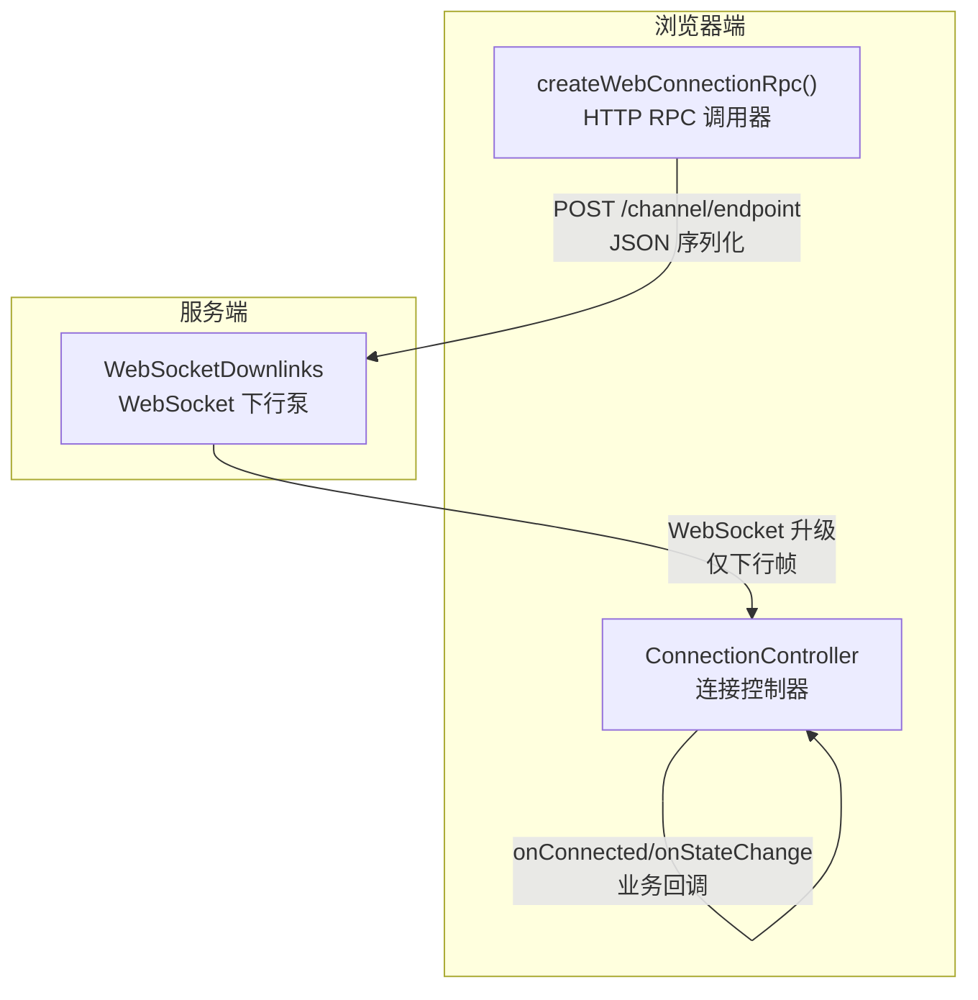
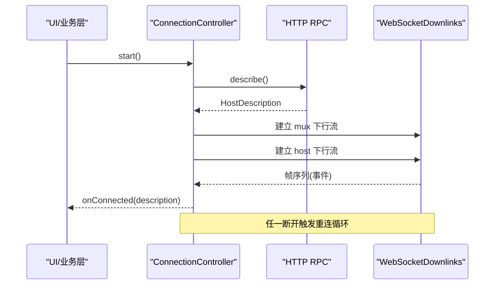
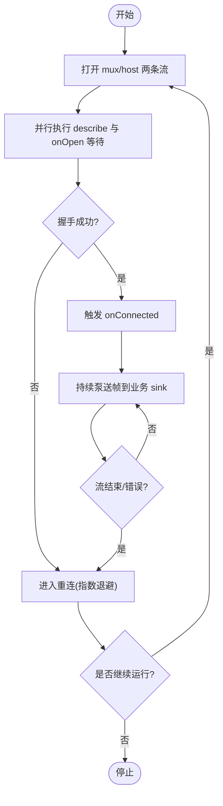
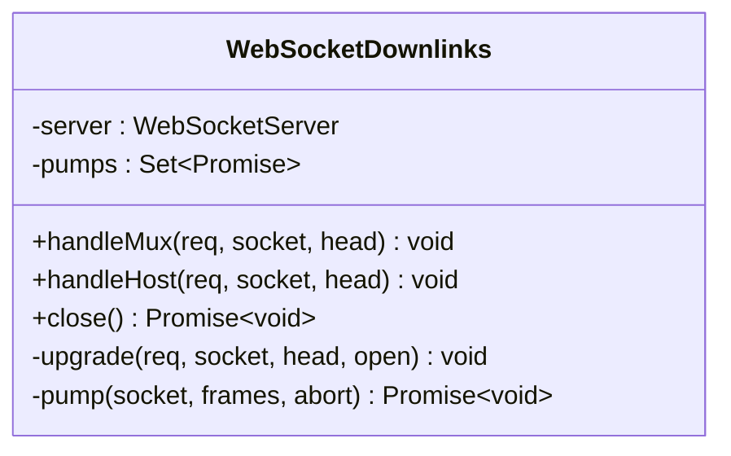
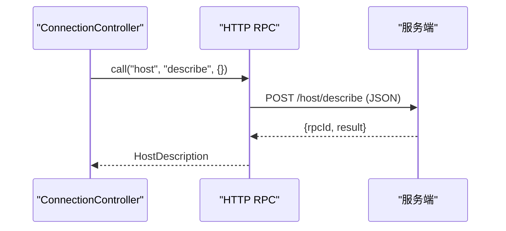
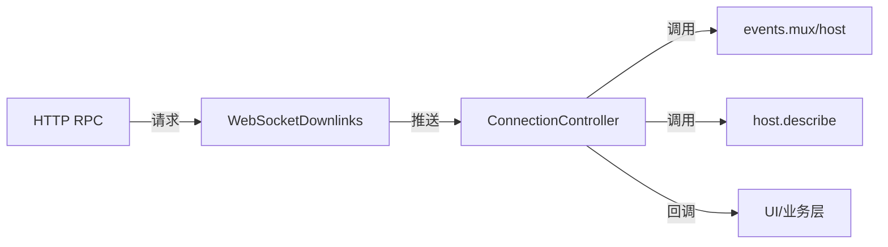

# 实时通信

<cite>
**本文引用的文件**
- [packages/client/connection/src/websocket-downlink.ts](file://packages/client/connection/src/websocket-downlink.ts)
- [packages/client/connection/src/client/connection.ts](file://packages/client/connection/src/client/connection.ts)
- [packages/client/connection/src/client/rpc.ts](file://packages/client/connection/src/client/rpc.ts)
</cite>

## 目录
1. [简介](#简介)
2. [项目结构](#项目结构)
3. [核心组件](#核心组件)
4. [架构总览](#架构总览)
5. [详细组件分析](#详细组件分析)
6. [依赖关系分析](#依赖关系分析)
7. [性能考虑](#性能考虑)
8. [故障排查指南](#故障排查指南)
9. [结论](#结论)
10. [附录](#附录)

## 简介
本文件聚焦 Web 界面的实时通信机制，围绕 WebSocket 连接的建立、管理与重连策略展开，并文档化消息协议格式（事件类型、数据结构与序列化方式）、会话状态同步、断线重连与数据一致性保障、错误处理与异常恢复、客户端与服务器端的通信模式（请求-响应与事件订阅），以及扩展自定义消息类型与处理逻辑的方法。同时给出性能优化建议，包括消息批处理、连接池管理与内存优化。

## 项目结构
本项目在客户端侧提供两类关键能力：
- 基于 HTTP 的通用 RPC 调用通道，用于请求-响应式交互与握手描述。
- 基于 WebSocket 的双向流通道，承载两个下行事件流（mux 与 host），由服务端主动推送，客户端仅消费。

图表来源
- [packages/client/connection/src/client/rpc.ts:19-48](file://packages/client/connection/src/client/rpc.ts#L19-L48)
- [packages/client/connection/src/websocket-downlink.ts:51-137](file://packages/client/connection/src/websocket-downlink.ts#L51-L137)
- [packages/client/connection/src/client/connection.ts:61-169](file://packages/client/connection/src/client/connection.ts#L61-L169)

章节来源
- [packages/client/connection/src/client/rpc.ts:1-64](file://packages/client/connection/src/client/rpc.ts#L1-L64)
- [packages/client/connection/src/websocket-downlink.ts:1-154](file://packages/client/connection/src/websocket-downlink.ts#L1-L154)
- [packages/client/connection/src/client/connection.ts:1-203](file://packages/client/connection/src/client/connection.ts#L1-L203)

## 核心组件
- ConnectionController（连接控制器）
  - 负责打开两条事件流（mux 与 host），执行严格握手（describe + onOpen），管理连接生命周期与指数退避重连，统一对外暴露连接状态与事件分发。
- WebSocketDownlinks（服务端下行链路）
  - 持有 WebSocketServer，对每个升级后的连接进行“仅下行”约束，将服务端的异步事件流泵入 WebSocket，并在异常时发送统一的 stream/error 帧。
- createWebConnectionRpc（HTTP RPC 调用器）
  - 提供浏览器端发起 HTTP POST 请求的能力，封装请求 ID、目标校验、响应体解析与一致性校验，用于 describe 等请求-响应场景。

章节来源
- [packages/client/connection/src/client/connection.ts:1-203](file://packages/client/connection/src/client/connection.ts#L1-L203)
- [packages/client/connection/src/websocket-downlink.ts:1-154](file://packages/client/connection/src/websocket-downlink.ts#L1-L154)
- [packages/client/connection/src/client/rpc.ts:1-64](file://packages/client/connection/src/client/rpc.ts#L1-L64)

## 架构总览
下图展示了从浏览器到服务器的完整通信路径：浏览器通过 HTTP 发起 describe 完成握手；随后建立两条仅下行的 WebSocket 流，分别承载 mux 与 host 事件；连接控制器维护连接状态并重连。

图表来源
- [packages/client/connection/src/client/connection.ts:107-169](file://packages/client/connection/src/client/connection.ts#L107-L169)
- [packages/client/connection/src/client/rpc.ts:19-48](file://packages/client/connection/src/client/rpc.ts#L19-L48)
- [packages/client/connection/src/websocket-downlink.ts:64-137](file://packages/client/connection/src/websocket-downlink.ts#L64-L137)

## 详细组件分析

### 连接控制器（ConnectionController）
- 职责
  - 启动/停止连接循环，维护 generation/attempt 计数。
  - 并发打开两条事件流，等待双方 onOpen 或超时后认为就绪。
  - 通过 describe 完成单向可达性验证，成功后触发 onConnected。
  - 任一事件流结束或出错进入重连流程，使用指数退避+抖动。
  - 对业务 sink 异常隔离，避免业务层抛错影响连接层。
- 关键行为
  - 严格握手：describe 成功 + 两条流的 onOpen 到达或超时。
  - 状态去抖：仅在状态变化时通知 UI。
  - 重试策略：backoffBaseMs/backoffFactor/backoffMaxMs/streamOpenTimeoutMs。

图表来源
- [packages/client/connection/src/client/connection.ts:61-169](file://packages/client/connection/src/client/connection.ts#L61-L169)

章节来源
- [packages/client/connection/src/client/connection.ts:1-203](file://packages/client/connection/src/client/connection.ts#L1-L203)

### 服务端下行链路（WebSocketDownlinks）
- 职责
  - 接受 HTTP 升级请求，创建 WebSocket 实例。
  - 强制“仅下行”语义：首次收到任何客户端消息即关闭连接。
  - 将服务端的异步事件流泵入 WebSocket，失败时发送统一的 stream/error 帧。
  - 统一管理所有连接的生命周期，支持优雅关闭。
- 关键行为
  - 拒绝不受信任的升级请求。
  - 使用 AbortSignal 控制生命周期，确保资源释放。
  - 对发送失败与 socket 丢失做容错处理。

图表来源
- [packages/client/connection/src/websocket-downlink.ts:51-137](file://packages/client/connection/src/websocket-downlink.ts#L51-L137)

章节来源
- [packages/client/connection/src/websocket-downlink.ts:1-154](file://packages/client/connection/src/websocket-downlink.ts#L1-L154)

### HTTP RPC 调用器（createWebConnectionRpc）
- 职责
  - 构造并发送 client-request 类型的 JSON 请求。
  - 校验目标 channel/endpoint 合法性。
  - 解析 serverResponseSchema，校验 rpcId 一致性。
- 适用场景
  - describe 等请求-响应式调用，作为握手与元信息获取通道。

图表来源
- [packages/client/connection/src/client/rpc.ts:19-48](file://packages/client/connection/src/client/rpc.ts#L19-L48)

章节来源
- [packages/client/connection/src/client/rpc.ts:1-64](file://packages/client/connection/src/client/rpc.ts#L1-L64)

## 依赖关系分析
- ConnectionController 依赖：
  - IApiClient.events.mux/host：获取两条事件流。
  - IApiClient.host.describe：获取主机描述。
  - 配置项：退避参数与流打开超时。
- WebSocketDownlinks 依赖：
  - ApiProxy.events.mux/host：服务端事件源。
  - ws 库：WebSocketServer 与连接管理。
- createWebConnectionRpc 依赖：
  - fetch API：发起 HTTP 请求。
  - schema 校验：serverResponseSchema。

图表来源
- [packages/client/connection/src/client/connection.ts:107-169](file://packages/client/connection/src/client/connection.ts#L107-L169)
- [packages/client/connection/src/websocket-downlink.ts:64-137](file://packages/client/connection/src/websocket-downlink.ts#L64-L137)
- [packages/client/connection/src/client/rpc.ts:19-48](file://packages/client/connection/src/client/rpc.ts#L19-L48)

章节来源
- [packages/client/connection/src/client/connection.ts:1-203](file://packages/client/connection/src/client/connection.ts#L1-L203)
- [packages/client/connection/src/websocket-downlink.ts:1-154](file://packages/client/connection/src/websocket-downlink.ts#L1-L154)
- [packages/client/connection/src/client/rpc.ts:1-64](file://packages/client/connection/src/client/rpc.ts#L1-L64)

## 性能考虑
- 连接与重连
  - 指数退避与抖动：避免雪崩与风暴，降低重试压力。
  - 流打开超时：防止代理或服务端不触发 onOpen 导致阻塞。
- 消息处理
  - 仅下行流：减少上行带宽占用与冲突。
  - Sink 异常隔离：业务层错误不影响连接泵与重连。
- 内存与资源
  - 使用 AbortController 管理生命周期，及时释放监听与定时器。
  - 服务端维护 pumps 集合，确保 close 时等待所有泵完成。
- 可扩展优化（建议）
  - 消息批处理：在业务层聚合高频小消息，降低 UI 渲染压力。
  - 连接池管理：多会话场景复用底层连接或按会话分片。
  - 背压与节流：当 sink 处理慢时，可引入队列与限流策略。

[本节为通用性能指导，不直接分析具体文件]

## 故障排查指南
- 常见症状与定位
  - 无法建立连接：检查 describe 是否返回 ok，确认 channel/endpoint 合法。
  - 连接频繁断开：关注 stream/error 帧与服务端日志，确认网络与代理行为。
  - UI 长时间无响应：检查 onOpen 是否超时，调整 streamOpenTimeoutMs。
- 错误处理策略
  - 客户端：连接层捕获异常并进入重连；sink 异常被隔离记录。
  - 服务端：发生异常时发送统一的 stream/error 帧，保证客户端可感知。
- 恢复方案
  - 自动重连：指数退避直至稳定。
  - 状态同步：onConnected 后由上层根据 HostDescription 触发再同步。

章节来源
- [packages/client/connection/src/client/connection.ts:132-169](file://packages/client/connection/src/client/connection.ts#L132-L169)
- [packages/client/connection/src/websocket-downlink.ts:118-137](file://packages/client/connection/src/websocket-downlink.ts#L118-L137)
- [packages/client/connection/src/client/rpc.ts:39-46](file://packages/client/connection/src/client/rpc.ts#L39-L46)

## 结论
该实时通信方案以“HTTP 请求-响应 + WebSocket 仅下行流”的组合实现高可靠、低耦合的会话通信。连接控制器负责握手、状态管理与重连；服务端下行链路负责事件泵与异常上报；HTTP RPC 提供描述与元信息查询。整体设计具备良好的可观测性与可恢复性，适合复杂 Web 界面下的长连接场景。

[本节为总结性内容，不直接分析具体文件]

## 附录

### 消息协议与序列化
- 传输载体
  - HTTP：application/json，用于请求-响应（如 describe）。
  - WebSocket：JSON 字符串化的帧，仅允许服务端→客户端方向。
- 帧与信封
  - 客户端请求：client-request（含 rpcId、method、payload）。
  - 服务端响应：serverResponse（含 rpcId、result）。
  - 事件流帧：包含 type 字段的事件类型与 payload 数据。
  - 错误帧：stream/error，携带 code/message/details。
- 序列化与校验
  - 客户端对响应体进行 schema 校验，并校验 rpcId 一致性。
  - 服务端在异常时统一发送 stream/error 帧，确保客户端可识别。

章节来源
- [packages/client/connection/src/client/rpc.ts:21-46](file://packages/client/connection/src/client/rpc.ts#L21-L46)
- [packages/client/connection/src/websocket-downlink.ts:23-44](file://packages/client/connection/src/websocket-downlink.ts#L23-L44)

### 会话状态同步与数据一致性
- 握手阶段：describe 成功后才认为连接可用，避免“半开”状态。
- 流就绪：两条流的 onOpen 到达或超时后才触发 onConnected。
- 断线重连：任一事件流结束即进入重连；重连后由上层依据 HostDescription 进行再同步，确保数据一致性。

章节来源
- [packages/client/connection/src/client/connection.ts:132-169](file://packages/client/connection/src/client/connection.ts#L132-L169)

### 扩展自定义消息类型与处理逻辑
- 新增事件类型
  - 在服务端事件源中定义新的 type 与 payload 结构。
  - 客户端在对应 sink 中按 type 分支处理。
- 新增 RPC 端点
  - 在 createWebConnectionRpc 的目标白名单内添加新 endpoint。
  - 服务端实现对应方法，保持请求/响应契约一致。

章节来源
- [packages/client/connection/src/client/rpc.ts:19-48](file://packages/client/connection/src/client/rpc.ts#L19-L48)
- [packages/client/connection/src/client/connection.ts:178-192](file://packages/client/connection/src/client/connection.ts#L178-L192)