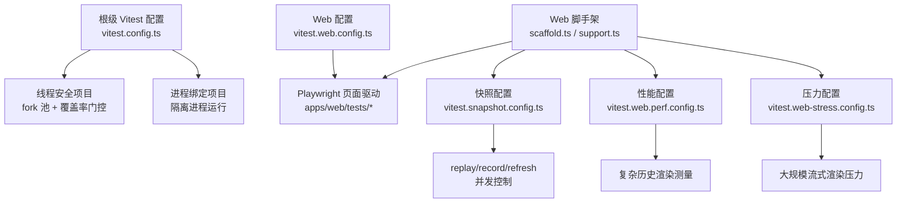
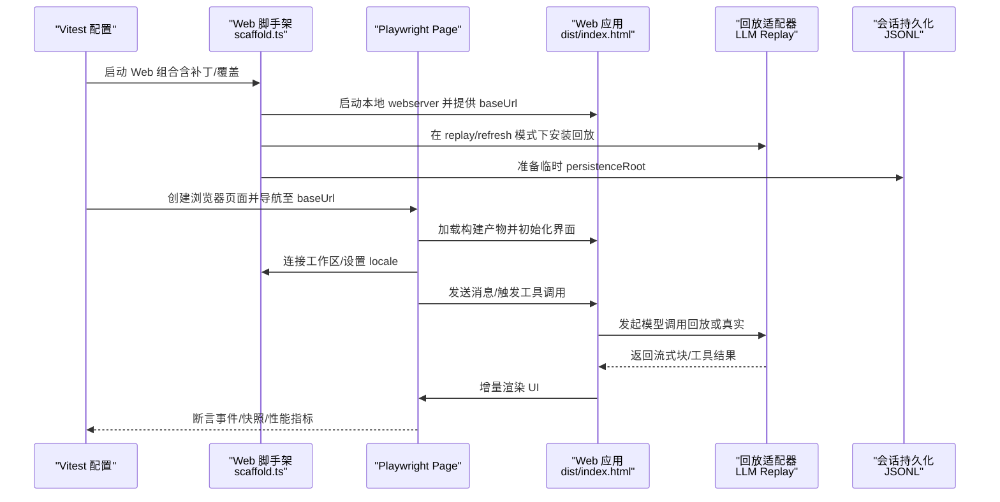
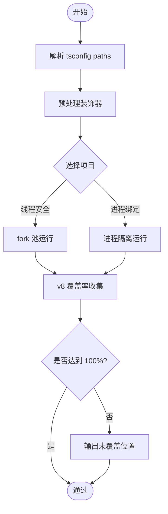
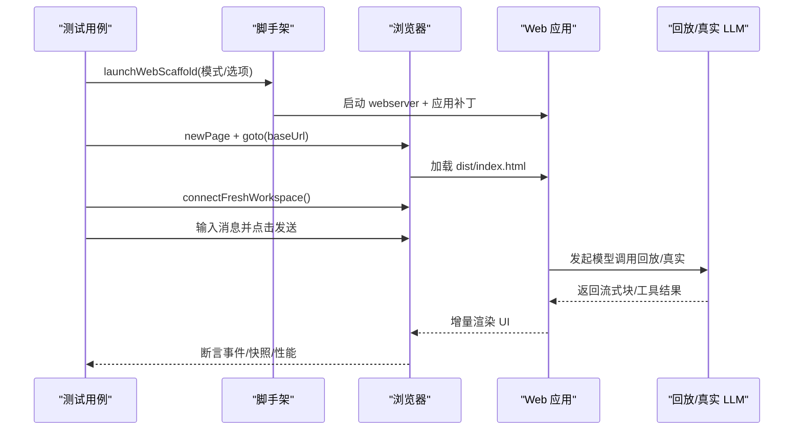
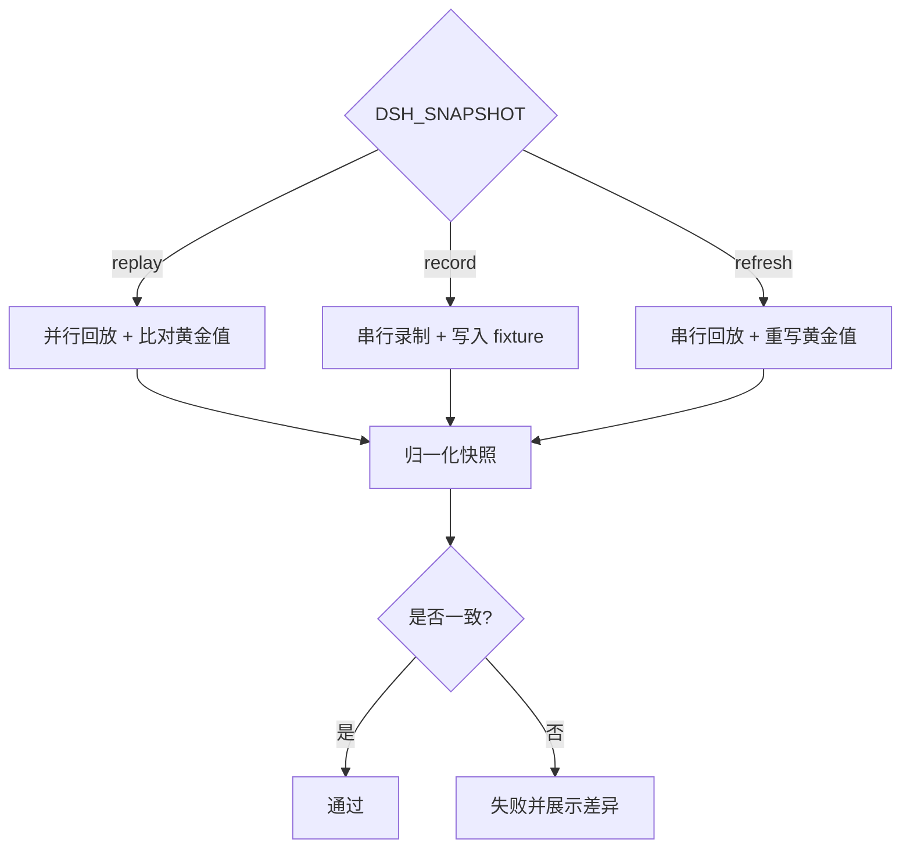
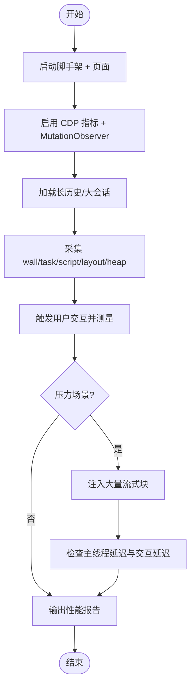
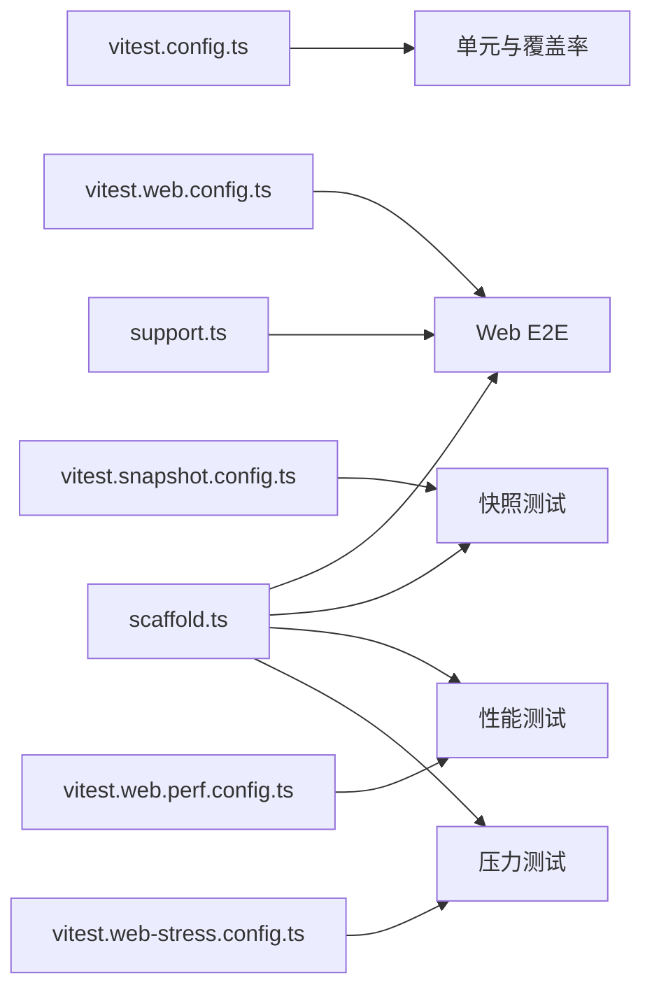

# 测试与调试

<cite>
**本文引用的文件**
- [vitest.config.ts](file://vitest.config.ts)
- [vitest.e2e.config.ts](file://vitest.e2e.config.ts)
- [vitest.shared.ts](file://vitest.shared.ts)
- [vitest.web.config.ts](file://vitest.web.config.ts)
- [vitest.snapshot.config.ts](file://vitest.snapshot.config.ts)
- [vitest.web-stress.config.ts](file://vitest.web-stress.config.ts)
- [vitest.web.perf.config.ts](file://vitest.web.perf.config.ts)
- [apps/web/tests/support.ts](file://apps/web/tests/support.ts)
- [apps/web/tests/scaffold.ts](file://apps/web/tests/scaffold.ts)
- [apps/web/tests/chat-continuous-conversation.e2e.ts](file://apps/web/tests/chat-continuous-conversation.e2e.ts)
- [apps/web/tests/complex-history.perf.ts](file://apps/web/tests/complex-history.perf.ts)
- [apps/web/stress-tests/reasoning-chunks.stress.ts](file://apps/web/stress-tests/reasoning-chunks.stress.ts)
- [apps/web/package.json](file://apps/web/package.json)
</cite>

## 目录
1. [简介](#简介)
2. [项目结构](#项目结构)
3. [核心组件](#核心组件)
4. [架构总览](#架构总览)
5. [详细组件分析](#详细组件分析)
6. [依赖关系分析](#依赖关系分析)
7. [性能考量](#性能考量)
8. [故障排查指南](#故障排查指南)
9. [结论](#结论)
10. [附录](#附录)

## 简介
本文件系统化介绍 Web 界面的测试与调试方法，覆盖单元测试框架配置（Vitest）、端到端测试策略（Playwright）、快照测试（视觉回归与组件状态验证）、性能与压力测试、调试技巧（浏览器开发者工具、网络请求监控、性能分析）、测试数据管理（模拟数据与夹具组织），以及持续集成与质量门禁的落地方式。内容基于仓库中实际配置文件与测试实现进行说明，帮助读者快速搭建并维护稳定的 Web 测试体系。

## 项目结构
Web 测试围绕多套 Vitest 配置与 Playwright 驱动的端到端/快照/性能/压力测试展开：
- 根级 Vitest 配置负责单元与覆盖率门控；按“线程安全”和“进程绑定”两类用例拆分执行，确保稳定性与覆盖率统计准确。
- Web 专用配置用于真实前端构建产物交互、回放模式与快照对比。
- 快照配置支持 replay/record/refresh 三种模式，控制并发与写入安全。
- 性能与压力测试通过独立配置引入，避免污染常规 CI 流水线。
- apps/web 提供 Playwright 脚手架与支撑函数，统一启动宿主、工作区、会话持久化与回放后端。

**图表来源**
- [vitest.config.ts:117-159](file://vitest.config.ts#L117-L159)
- [vitest.web.config.ts:16-35](file://vitest.web.config.ts#L16-L35)
- [vitest.snapshot.config.ts:39-68](file://vitest.snapshot.config.ts#L39-L68)
- [vitest.web.perf.config.ts:1-16](file://vitest.web.perf.config.ts#L1-L16)
- [vitest.web-stress.config.ts:1-16](file://vitest.web-stress.config.ts#L1-L16)
- [apps/web/tests/scaffold.ts:294-626](file://apps/web/tests/scaffold.ts#L294-L626)
- [apps/web/tests/support.ts:1-136](file://apps/web/tests/support.ts#L1-L136)

**章节来源**
- [vitest.config.ts:117-283](file://vitest.config.ts#L117-L283)
- [vitest.web.config.ts:16-35](file://vitest.web.config.ts#L16-L35)
- [vitest.snapshot.config.ts:39-68](file://vitest.snapshot.config.ts#L39-L68)
- [vitest.web.perf.config.ts:1-16](file://vitest.web.perf.config.ts#L1-L16)
- [vitest.web-stress.config.ts:1-16](file://vitest.web-stress.config.ts#L1-L16)
- [apps/web/tests/scaffold.ts:294-626](file://apps/web/tests/scaffold.ts#L294-L626)
- [apps/web/tests/support.ts:1-136](file://apps/web/tests/support.ts#L1-L136)

## 核心组件
- 单元测试与覆盖率
  - 双项目划分：线程安全与进程绑定，分别以 fork 模式运行，避免共享状态干扰。
  - 覆盖率采用 v8 提供者，严格 100% 每文件阈值，配合自定义报告输出未覆盖位置。
  - 通过 tsconfig paths 解析工作区导入，避免加载构建产物导致重复模块实例。
- Web 端到端与快照
  - 使用 Playwright 驱动真实构建产物，结合内置 webserver 行与临时工作区/持久化根。
  - 支持 replay/record/refresh 模式：replay 无密钥稳定回放；record 读取密钥录制；refresh 重写黄金值。
  - 会话种子通过 JSONL 格式注入，保证语义正确性与可复现性。
- 性能与压力测试
  - 性能测试通过 CDP 指标与 MutationObserver 采集 DOM 变更、任务耗时、内存等。
  - 压力测试通过大量流式块（如 10 万条）验证主线程响应与交互延迟预算。

**章节来源**
- [vitest.config.ts:117-283](file://vitest.config.ts#L117-L283)
- [vitest.e2e.config.ts:31-57](file://vitest.e2e.config.ts#L31-L57)
- [vitest.snapshot.config.ts:39-68](file://vitest.snapshot.config.ts#L39-L68)
- [apps/web/tests/scaffold.ts:294-626](file://apps/web/tests/scaffold.ts#L294-L626)
- [apps/web/tests/complex-history.perf.ts:519-580](file://apps/web/tests/complex-history.perf.ts#L519-L580)
- [apps/web/stress-tests/reasoning-chunks.stress.ts:46-153](file://apps/web/stress-tests/reasoning-chunks.stress.ts#L46-L153)

## 架构总览
下图展示从测试入口到宿主装配、会话回放、浏览器交互与断言的整体流程。

**图表来源**
- [apps/web/tests/scaffold.ts:294-626](file://apps/web/tests/scaffold.ts#L294-L626)
- [apps/web/tests/chat-continuous-conversation.e2e.ts:171-203](file://apps/web/tests/chat-continuous-conversation.e2e.ts#L171-L203)
- [vitest.web.config.ts:16-35](file://vitest.web.config.ts#L16-L35)

## 详细组件分析

### 单元测试与覆盖率（Vitest）
- 项目划分与执行策略
  - “线程安全”项目：包含大多数 spec，使用 fork 池提升稳定性。
  - “进程绑定”项目：仅包含进程相关用例，单独隔离以避免全局状态竞争。
- 路径解析与装饰器支持
  - 通过 tsconfig base 的 paths 映射，确保源码解析一致。
  - 预转换 TypeScript 装饰器，兼容测试环境。
- 覆盖率门控
  - v8 提供者，100% 语句/分支/函数/行覆盖率，逐文件检查。
  - 排除类型文件、bin/worker 入口及尚未由 jsdom 覆盖的客户端 UI 区域。
  - 自定义报告输出未覆盖位置，便于定位改进点。

**图表来源**
- [vitest.config.ts:117-283](file://vitest.config.ts#L117-L283)
- [vitest.shared.ts:1-43](file://vitest.shared.ts#L1-L43)

**章节来源**
- [vitest.config.ts:117-283](file://vitest.config.ts#L117-L283)
- [vitest.shared.ts:1-43](file://vitest.shared.ts#L1-L43)

### 端到端测试（Playwright）
- 脚手架能力
  - 启动真实 Web 组合，应用基础与 Web 表面补丁，隔离工作区与持久化根。
  - 支持 agent presets、工具模式、遥测导出、可信主机等选项。
  - 在 replay/refresh 模式下安装回放适配器，record 模式需要密钥。
- 会话种子与回放
  - 通过 JSONL 注入会话事件，确保语义正确且可复现。
  - 支持 child fixtures、override 文件与 pacing 控制，模拟真实流式体验。
- 浏览器交互
  - 统一语言与视口设置，自动连接工作区，失败时保存截图证据。
  - 监听控制台警告与错误，保障断言稳健性。

**图表来源**
- [apps/web/tests/scaffold.ts:294-626](file://apps/web/tests/scaffold.ts#L294-L626)
- [apps/web/tests/support.ts:1-136](file://apps/web/tests/support.ts#L1-L136)
- [apps/web/tests/chat-continuous-conversation.e2e.ts:171-203](file://apps/web/tests/chat-continuous-conversation.e2e.ts#L171-L203)

**章节来源**
- [apps/web/tests/scaffold.ts:294-626](file://apps/web/tests/scaffold.ts#L294-L626)
- [apps/web/tests/support.ts:1-136](file://apps/web/tests/support.ts#L1-L136)
- [apps/web/tests/chat-continuous-conversation.e2e.ts:171-342](file://apps/web/tests/chat-continuous-conversation.e2e.ts#L171-L342)

### 快照测试（视觉回归与组件状态）
- 模式与并发
  - replay：默认无密钥回放，比较已提交黄金值。
  - record：读取密钥录制，生成会话 fixture。
  - refresh：回放并重写当前黄金值。
  - 并发控制：replay 可并行，record/refresh 串行以保证写入安全。
- 规范化与稳定性
  - 对 aria 快照进行归一化，替换 UUID、路径敏感信息与时间相关值。
  - 会话 ID、cwd、rpcId 等占位符标准化，减少无关差异。
- 适用场景
  - 组件状态验证、UI 视觉回归、协议输出与转录一致性。

**图表来源**
- [vitest.snapshot.config.ts:39-68](file://vitest.snapshot.config.ts#L39-L68)
- [apps/web/tests/scaffold.ts:778-800](file://apps/web/tests/scaffold.ts#L778-L800)

**章节来源**
- [vitest.snapshot.config.ts:39-68](file://vitest.snapshot.config.ts#L39-L68)
- [apps/web/tests/scaffold.ts:778-800](file://apps/web/tests/scaffold.ts#L778-L800)

### 性能测试与压力测试
- 性能测试
  - 通过 CDP 获取 Chromium 指标（任务时长、脚本时长、布局、样式重算、节点数、堆内存）。
  - 使用 MutationObserver 统计 DOM 变更批次与记录数，评估渲染效率。
  - 用户交互探针测量点击到 DOM 插入再到绘制的耗时。
- 压力测试
  - 大规模流式块（如 10 万条）注入，验证主线程延迟预算与交互响应。
  - 心跳采样与交互延迟断言，确保长时间高负载下仍保持可用。

**图表来源**
- [apps/web/tests/complex-history.perf.ts:519-580](file://apps/web/tests/complex-history.perf.ts#L519-L580)
- [apps/web/tests/complex-history.perf.ts:582-617](file://apps/web/tests/complex-history.perf.ts#L582-L617)
- [apps/web/stress-tests/reasoning-chunks.stress.ts:46-153](file://apps/web/stress-tests/reasoning-chunks.stress.ts#L46-L153)

**章节来源**
- [apps/web/tests/complex-history.perf.ts:519-617](file://apps/web/tests/complex-history.perf.ts#L519-L617)
- [apps/web/stress-tests/reasoning-chunks.stress.ts:46-153](file://apps/web/stress-tests/reasoning-chunks.stress.ts#L46-L153)

### 调试技巧
- 浏览器开发者工具
  - 使用 Playwright 打开 headful 模式观察界面行为。
  - 通过控制台监听警告与错误，结合失败截图定位问题。
- 网络请求监控
  - 回放模式下无需真实网络；record 模式需配置密钥与端点。
  - 可通过 CDP 捕获请求/响应，辅助分析 API 行为。
- 性能分析
  - 利用 CDP 指标与 Performance API 测量关键路径。
  - 使用 MutationObserver 跟踪 DOM 变更，识别渲染瓶颈。

**章节来源**
- [apps/web/tests/support.ts:112-136](file://apps/web/tests/support.ts#L112-L136)
- [apps/web/tests/scaffold.ts:294-353](file://apps/web/tests/scaffold.ts#L294-L353)
- [apps/web/tests/complex-history.perf.ts:519-580](file://apps/web/tests/complex-history.perf.ts#L519-L580)

### 测试数据管理（模拟数据与夹具）
- 会话夹具
  - JSONL 格式存储会话事件，支持占位符替换与消息 ID 稳定化。
  - 通过 seedSession/seedBlankSession 注入，确保语义正确。
- 回放覆盖
  - 使用 replay.override.json 指定流式块或工具调用序列。
  - 支持 child fixtures 与 pacing，模拟真实流式体验。
- 组织方式
  - 每个场景拥有独立的临时工作区与持久化根，避免交叉影响。
  - 固定 agent presets 与工具模式，保证黄金值稳定。

**章节来源**
- [apps/web/tests/scaffold.ts:651-776](file://apps/web/tests/scaffold.ts#L651-L776)
- [apps/web/tests/chat-continuous-conversation.e2e.ts:133-140](file://apps/web/tests/chat-continuous-conversation.e2e.ts#L133-L140)

### 持续集成与质量门禁
- 质量门禁
  - 单元测试覆盖率 100% 每文件门控，未达标则失败。
  - 快照测试在 CI 中以 replay 模式比对黄金值，防止 UI 漂移。
- 自动化流程
  - 多配置分离：单元、E2E、快照、性能、压力各自独立运行。
  - 环境变量控制：DSH_SNAPSHOT、DSH_E2E_MAX_WORKERS 等调节行为与并发。
- 密钥与凭据
  - E2E 与快照 record 模式支持 .env 或环境变量注入密钥。
  - 无密钥环境下自动跳过真实模型调用，确保 CI 稳定。

**章节来源**
- [vitest.config.ts:160-283](file://vitest.config.ts#L160-L283)
- [vitest.e2e.config.ts:31-57](file://vitest.e2e.config.ts#L31-L57)
- [vitest.snapshot.config.ts:39-68](file://vitest.snapshot.config.ts#L39-L68)

## 依赖关系分析
- 配置层
  - vitest.config.ts 定义单元与覆盖率；vitest.web.config.ts 定义 Web E2E；vitest.snapshot.config.ts 定义快照；vitest.web.perf.config.ts 与 vitest.web-stress.config.ts 定义性能与压力。
- 运行层
  - scaffold.ts 提供 Web 组合装配、回放安装、会话种子注入。
  - support.ts 提供浏览器页面创建、工作区连接、失败截图等通用能力。
- 测试层
  - chat-continuous-conversation.e2e.ts 演示连续对话的 E2E 流程。
  - complex-history.perf.ts 演示长历史渲染的性能测量。
  - reasoning-chunks.stress.ts 演示大规模流式渲染的压力测试。

**图表来源**
- [vitest.config.ts:117-283](file://vitest.config.ts#L117-L283)
- [vitest.web.config.ts:16-35](file://vitest.web.config.ts#L16-L35)
- [vitest.snapshot.config.ts:39-68](file://vitest.snapshot.config.ts#L39-L68)
- [vitest.web.perf.config.ts:1-16](file://vitest.web.perf.config.ts#L1-L16)
- [vitest.web-stress.config.ts:1-16](file://vitest.web-stress.config.ts#L1-L16)
- [apps/web/tests/scaffold.ts:294-626](file://apps/web/tests/scaffold.ts#L294-L626)
- [apps/web/tests/support.ts:1-136](file://apps/web/tests/support.ts#L1-L136)

**章节来源**
- [apps/web/package.json:22-50](file://apps/web/package.json#L22-L50)
- [apps/web/tests/scaffold.ts:294-626](file://apps/web/tests/scaffold.ts#L294-L626)
- [apps/web/tests/support.ts:1-136](file://apps/web/tests/support.ts#L1-L136)

## 性能考量
- 并发与资源
  - E2E 与快照通过环境变量控制并发，避免共享配额争用。
  - 性能与压力测试独立配置，不污染常规 CI。
- 渲染与内存
  - 使用 CDP 指标与 MutationObserver 监控 DOM 变更与内存增长。
  - 通过归一化快照与占位符替换，减少无关波动。
- 流式渲染
  - pacing 控制流式块速率，模拟真实用户体验。
  - 压力测试验证主线程延迟预算，确保交互响应。

**章节来源**
- [vitest.e2e.config.ts:31-57](file://vitest.e2e.config.ts#L31-L57)
- [vitest.snapshot.config.ts:39-68](file://vitest.snapshot.config.ts#L39-L68)
- [apps/web/tests/complex-history.perf.ts:519-580](file://apps/web/tests/complex-history.perf.ts#L519-L580)
- [apps/web/stress-tests/reasoning-chunks.stress.ts:46-153](file://apps/web/stress-tests/reasoning-chunks.stress.ts#L46-L153)

## 故障排查指南
- 常见问题
  - 构建产物缺失：运行前需先构建 Web 应用，否则 E2E 会抛出明确错误。
  - 密钥缺失：record 模式需要 DEEPSEEK_API_KEY，否则中止。
  - 端口冲突：使用操作系统分配的随机端口，避免冲突。
- 诊断手段
  - 失败截图：保存完整页面截图，便于定位 UI 问题。
  - 控制台监听：捕获警告与错误，结合会话事件断言。
  - CDP 指标：分析任务时长、脚本时长、布局与内存变化。
- 清理与隔离
  - 每次测试使用独立工作区与持久化根，避免交叉影响。
  - 清理临时目录与环境变量，确保下次运行干净。

**章节来源**
- [apps/web/tests/support.ts:34-55](file://apps/web/tests/support.ts#L34-L55)
- [apps/web/tests/scaffold.ts:294-353](file://apps/web/tests/scaffold.ts#L294-L353)
- [apps/web/tests/chat-continuous-conversation.e2e.ts:205-215](file://apps/web/tests/chat-continuous-conversation.e2e.ts#L205-L215)

## 结论
本项目构建了完整的 Web 测试与调试体系：以 Vitest 为核心的单元测试与覆盖率门控，以 Playwright 驱动的端到端与快照测试，辅以性能与压力测试，确保功能正确性、视觉稳定性与运行时性能。通过脚手架与夹具管理，测试具备高可复现性与强隔离性；通过环境变量与多配置分离，CI 流程稳定可靠。建议在新功能开发中优先补充单元与快照测试，逐步提升覆盖率与回归防护能力。

## 附录
- 常用命令
  - 运行单元与覆盖率：使用根级 Vitest 配置。
  - 运行 Web E2E：使用 vitest.web.config.ts。
  - 运行快照：使用 vitest.snapshot.config.ts，并通过 DSH_SNAPSHOT 控制模式。
  - 运行性能测试：使用 vitest.web.perf.config.ts。
  - 运行压力测试：使用 vitest.web-stress.config.ts。
- 环境变量
  - DSH_SNAPSHOT：replay/record/refresh。
  - DSH_E2E_MAX_WORKERS：E2E 并发数。
  - DEEPSEEK_API_KEY：record 模式密钥。

**章节来源**
- [vitest.config.ts:117-283](file://vitest.config.ts#L117-L283)
- [vitest.e2e.config.ts:31-57](file://vitest.e2e.config.ts#L31-L57)
- [vitest.snapshot.config.ts:39-68](file://vitest.snapshot.config.ts#L39-L68)
- [vitest.web.perf.config.ts:1-16](file://vitest.web.perf.config.ts#L1-L16)
- [vitest.web-stress.config.ts:1-16](file://vitest.web-stress.config.ts#L1-L16)