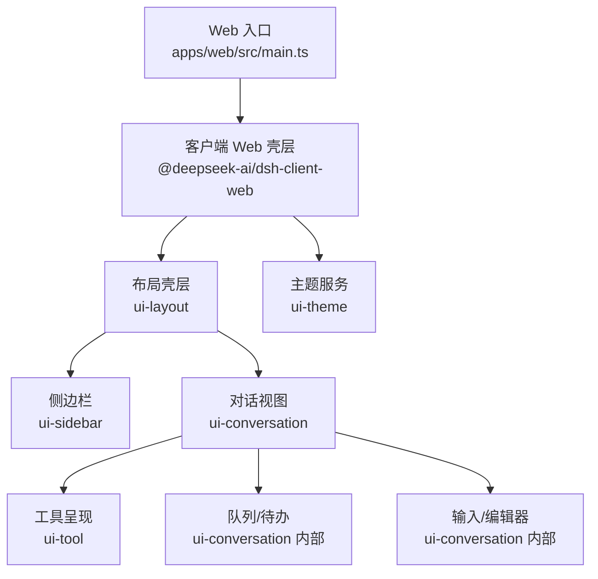
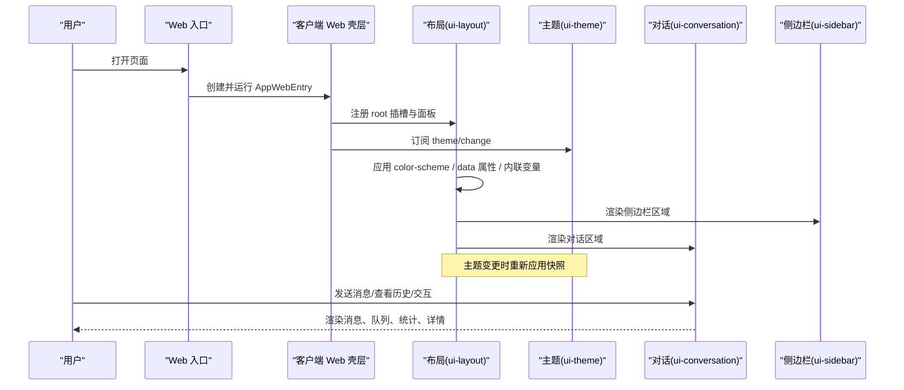
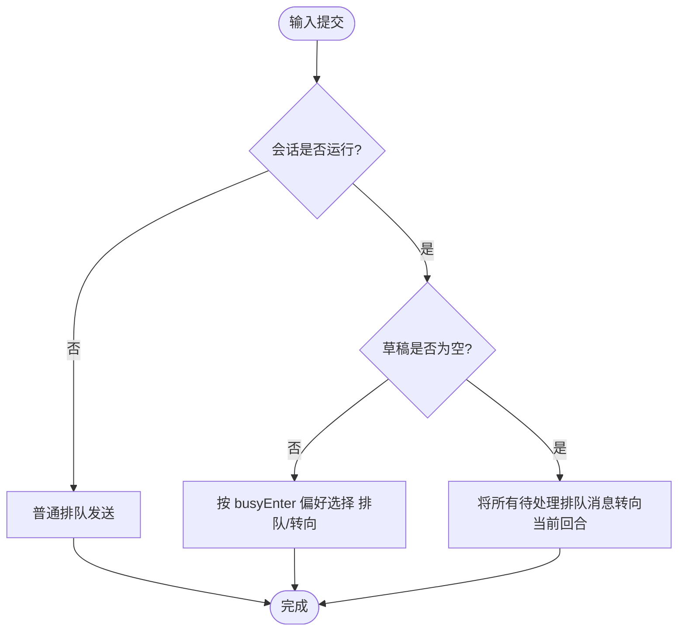
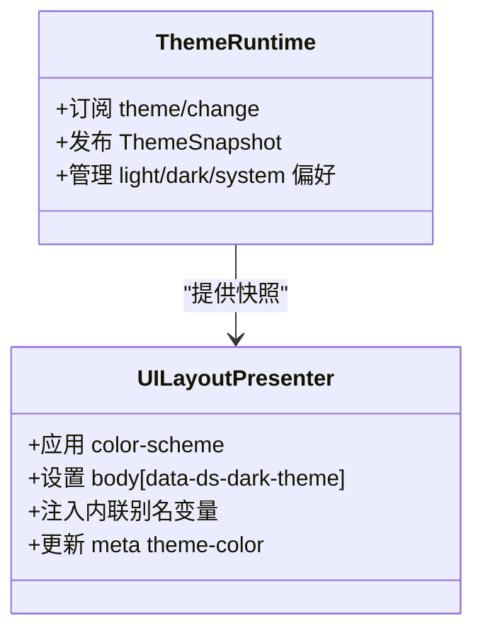
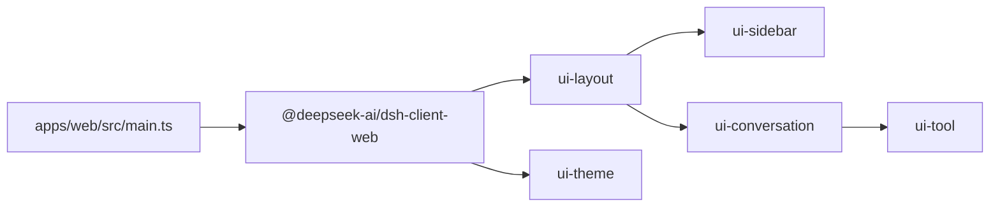

# 用户界面组件

<cite>
**本文引用的文件**
- [apps/web/src/main.ts](file://apps/web/src/main.ts)
- [packages/client/ui-conversation/README.md](file://packages/client/ui-conversation/README.md)
- [packages/client/ui-sidebar/README.md](file://packages/client/ui-sidebar/README.md)
- [packages/client/ui-theme/README.md](file://packages/client/ui-theme/README.md)
- [packages/client/ui-layout/README.md](file://packages/client/ui-layout/README.md)
- [docs/web-styling.md](file://docs/web-styling.md)
- [docs/testing.md](file://docs/testing.md)
</cite>

## 目录
1. [简介](#简介)
2. [项目结构](#项目结构)
3. [核心组件](#核心组件)
4. [架构总览](#架构总览)
5. [详细组件分析](#详细组件分析)
6. [依赖关系分析](#依赖关系分析)
7. [性能考量](#性能考量)
8. [故障排查指南](#故障排查指南)
9. [结论](#结论)
10. [附录](#附录)

## 简介
本文件面向 Web 界面的用户界面组件体系，聚焦聊天界面、编辑器（输入与队列）、侧边栏等关键 UI 组件的结构与职责；说明组件间通信与状态共享方案；文档化样式系统与主题定制能力（CSS 变量、主题切换、响应式行为）；阐述无障碍访问支持（键盘导航、屏幕阅读器、WCAG 合规要点）；给出端到端测试策略（含视觉回归）；并提供扩展指南，帮助添加新的 UI 元素与交互模式。

## 项目结构
Web 应用以极薄入口启动，实际装配与挂载逻辑位于客户端 Web 壳层中。UI 由多个独立包组成：布局壳层、主题服务、会话对话视图、侧边栏、以及一系列领域插件（如工具呈现、工作区、设置等）。样式系统集中在 ui-theme，ui-layout 负责将主题快照应用到文档并管理三列布局。

图表来源
- [apps/web/src/main.ts:1-11](file://apps/web/src/main.ts#L1-L11)
- [packages/client/ui-layout/README.md:1-24](file://packages/client/ui-layout/README.md#L1-L24)
- [packages/client/ui-theme/README.md:1-27](file://packages/client/ui-theme/README.md#L1-L27)
- [packages/client/ui-sidebar/README.md:1-32](file://packages/client/ui-sidebar/README.md#L1-L32)
- [packages/client/ui-conversation/README.md:1-68](file://packages/client/ui-conversation/README.md#L1-L68)

章节来源
- [apps/web/src/main.ts:1-11](file://apps/web/src/main.ts#L1-L11)
- [packages/client/ui-layout/README.md:1-24](file://packages/client/ui-layout/README.md#L1-L24)
- [packages/client/ui-theme/README.md:1-27](file://packages/client/ui-theme/README.md#L1-L27)
- [packages/client/ui-sidebar/README.md:1-32](file://packages/client/ui-sidebar/README.md#L1-L32)
- [packages/client/ui-conversation/README.md:1-68](file://packages/client/ui-conversation/README.md#L1-L68)

## 核心组件
- 布局壳层（ui-layout）
  - 提供三列 AppFrame（侧边栏、对话、详情），管理面板几何与让渡链，挂载主题演示器，将主题快照应用到文档根节点。
  - 通过 owner-share 暴露 collapsed/width 等布局状态，业务数据通过标准 hooks/actions 获取。
- 主题服务（ui-theme）
  - 维护 --dsw-* 静态刻度与语义别名、排版、动效、渐变、阴影、滚动条样式与明暗偏好。
  - 发布不可变 ThemeSnapshot，ui-layout 负责将其应用到 DOM（color-scheme、data 属性、内联变量）。
- 侧边栏（ui-sidebar）
  - 品牌标识、新建会话、折叠控制、滚动区域座位、底部设置座位。
  - 折叠动画与滚动条可见性策略，保持内容宽度不变淡出进入轨道。
- 对话视图（ui-conversation）
  - 会话骨架（头部/标签/输入框/空态）、聊天视图（分组步骤摘要、流式尾部隔离、回合状态）、输入停靠（队列行与计划条）、详情外壳。
  - 消息类型丰富：上下文注入、召回会话、思考行、重试行、工具调用、审批面板、用户气泡、转向提示等。
  - 统计行、上下文占用环、图片摄入、模型体验相关展示（不发起请求）。
  - 通过注册表机制扩展聊天节点与视图槽位。

章节来源
- [packages/client/ui-layout/README.md:1-24](file://packages/client/ui-layout/README.md#L1-L24)
- [packages/client/ui-theme/README.md:1-27](file://packages/client/ui-theme/README.md#L1-L27)
- [packages/client/ui-sidebar/README.md:1-32](file://packages/client/ui-sidebar/README.md#L1-L32)
- [packages/client/ui-conversation/README.md:1-68](file://packages/client/ui-conversation/README.md#L1-L68)

## 架构总览
Web 应用从入口初始化壳层，壳层装配布局、主题与会话插件。布局负责页面结构与主题应用；主题服务提供可订阅的快照；对话视图承载会话历史与实时流；侧边栏组织会话与工作区；各功能通过插槽与注册表组合。

图表来源
- [apps/web/src/main.ts:1-11](file://apps/web/src/main.ts#L1-L11)
- [packages/client/ui-layout/README.md:1-24](file://packages/client/ui-layout/README.md#L1-L24)
- [packages/client/ui-theme/README.md:1-27](file://packages/client/ui-theme/README.md#L1-L27)
- [packages/client/ui-sidebar/README.md:1-32](file://packages/client/ui-sidebar/README.md#L1-L32)
- [packages/client/ui-conversation/README.md:1-68](file://packages/client/ui-conversation/README.md#L1-L68)

## 详细组件分析

### 聊天界面（ui-conversation）
- 结构与职责
  - 会话骨架：头部、标签页、输入框、空态。
  - 聊天视图：分组步骤摘要、流式尾部隔离、回合状态、重试行、思考行、上下文注入/召回、工具调用、审批面板、用户气泡、转向提示。
  - 输入停靠：队列行与计划条（TodoDock/QueueDock）。
  - 详情外壳：工具调用详情。
- 通信与状态
  - 会话级 UI 状态在 chat store 中管理；InputHub 拥有输入机并镜像草稿到存储。
  - 通过 useSession/useSessions/useWorkspaces 等标准钩子获取全局状态；store faces 与 inject factories 提供其余状态与回调。
  - 聊天节点为注册贡献而非集中开关；通过 conversation.chat.node 键分派到对应渲染器。
- 交互细节
  - 图片摄入：粘贴与整页拖拽，受 host imageLimits 限制。
  - 统计行：token 用量、缓存命中率、TTFT、吞吐、时长等来自 sessionStats 投影。
  - 上下文占用：环形进度与 breakdown 面板，基于 contextPressure/contextBreakdown 投影。
  - 键盘提交：根据 busyEnter 偏好分配 Enter/Cmd+Enter 的行为（排队或转向）。
  - 审批接管：ApprovalPanel 覆盖输入区等待审批，完成后恢复。
- 可访问性
  - 使用 DisclosureRow 等原语提供可展开/折叠的上下文信息。
  - 队列头暴露 aria-expanded/aria-controls，列表高度受限且可滚动。
  - 保留键盘焦点可见性与减少动效行为。

图表来源
- [packages/client/ui-conversation/README.md:1-68](file://packages/client/ui-conversation/README.md#L1-L68)

章节来源
- [packages/client/ui-conversation/README.md:1-68](file://packages/client/ui-conversation/README.md#L1-L68)

### 编辑器与输入（ui-conversation 内部）
- 输入区
  - 单会话输入机驱动文本域、占位符、附件与命令触发。
  - 支持图片摄入与限额校验；无工作区时锁定输入并引导选择工作区。
- 队列与计划
  - TodoDock：计划条，读取 todos 投影，隐藏空列表，默认折叠显示计数。
  - QueueDock：队列停靠，空时隐藏，单行直接显示，多行折叠头，展开后限高滚动。
- 键盘与无障碍
  - Shift+Enter 换行；Enter/Cmd+Enter 根据偏好与运行态决定行为。
  - 队列头与列表项具备 ARIA 属性，编辑/删除/严格转向操作可访问。

章节来源
- [packages/client/ui-conversation/README.md:1-68](file://packages/client/ui-conversation/README.md#L1-L68)

### 侧边栏（ui-sidebar）
- 结构与职责
  - 品牌标识、新建会话、折叠控制、滚动区域座位、底部设置座位。
  - 折叠动画：保持展开内容宽度淡出，控件平移进入 56px 轨道。
  - 滚动条可见性：指针离开时透明化，离开后保留 2s 可见。
- 交互与可访问性
  - 折叠过渡遵循 reduced-motion 禁用。
  - 底部设置座位固定于底部，共享列宽状态。

章节来源
- [packages/client/ui-sidebar/README.md:1-32](file://packages/client/ui-sidebar/README.md#L1-L32)

### 主题与样式系统（ui-theme + web-styling）
- 所有权与规则
  - ui-theme 拥有 --dsw-* 静态刻度、语义别名、排版、动效、渐变、阴影、滚动条样式与明暗偏好。
  - ui-layout 应用主题快照到文档（color-scheme、data 属性、内联变量）。
  - 组件样式使用 CSS Modules 与 clsx；特性组件仅消费语义别名，不定义全局主题。
- 滚动条契约
  - scrollbar.css 绑定 body 上的滚动条颜色变量；提升表面（菜单/弹出/对话框）可重绑为 l2 背景色。
  - 非 WebKit 引擎走标准属性路径，WebKit 走伪元素路径，二者互斥。
- 主题切换
  - 主题服务发布不可变快照；HTTP 服务器可在 <body> 后立即注入初始偏好，避免闪烁。
  - 远程浏览器无法访问特权设置 API，选择保持进程本地。

图表来源
- [packages/client/ui-theme/README.md:1-27](file://packages/client/ui-theme/README.md#L1-L27)
- [packages/client/ui-layout/README.md:1-24](file://packages/client/ui-layout/README.md#L1-L24)
- [docs/web-styling.md:1-26](file://docs/web-styling.md#L1-L26)

章节来源
- [packages/client/ui-theme/README.md:1-27](file://packages/client/ui-theme/README.md#L1-L27)
- [packages/client/ui-layout/README.md:1-24](file://packages/client/ui-layout/README.md#L1-L24)
- [docs/web-styling.md:1-26](file://docs/web-styling.md#L1-L26)

### 布局壳层（ui-layout）
- 三列框架
  - 侧边栏、对话、详情三列；拖拽手柄与让渡链；details 可收缩至零宽自动关闭。
  - 主题演示器挂载于布局，确保 color-scheme 与主题变量在首屏前生效。
- 面板几何
  - 侧边栏最小 56px 轨道；details 关闭时零宽；会话切换时 details 重置。
  - 面板几何为瞬态，刷新恢复默认。

章节来源
- [packages/client/ui-layout/README.md:1-24](file://packages/client/ui-layout/README.md#L1-L24)

## 依赖关系分析
- 入口依赖客户端 Web 壳层；壳层装配布局、主题与会话插件。
- 布局依赖主题服务以应用快照；对话视图依赖布局提供的会话与插槽；侧边栏依赖布局的区域座位。
- 对话视图内部通过注册表与插槽扩展聊天节点与输入扩展；工具呈现由 ui-tool 提供。

图表来源
- [apps/web/src/main.ts:1-11](file://apps/web/src/main.ts#L1-L11)
- [packages/client/ui-layout/README.md:1-24](file://packages/client/ui-layout/README.md#L1-L24)
- [packages/client/ui-theme/README.md:1-27](file://packages/client/ui-theme/README.md#L1-L27)
- [packages/client/ui-sidebar/README.md:1-32](file://packages/client/ui-sidebar/README.md#L1-L32)
- [packages/client/ui-conversation/README.md:1-68](file://packages/client/ui-conversation/README.md#L1-L68)

章节来源
- [apps/web/src/main.ts:1-11](file://apps/web/src/main.ts#L1-L11)
- [packages/client/ui-layout/README.md:1-24](file://packages/client/ui-layout/README.md#L1-L24)
- [packages/client/ui-theme/README.md:1-27](file://packages/client/ui-theme/README.md#L1-L27)
- [packages/client/ui-sidebar/README.md:1-32](file://packages/client/ui-sidebar/README.md#L1-L32)
- [packages/client/ui-conversation/README.md:1-68](file://packages/client/ui-conversation/README.md#L1-L68)

## 性能考量
- 对话视图
  - 流式尾部隔离与压缩（compaction）保证长会话可读性与性能；压缩行仅在悬停或键盘聚焦时展开。
  - 统计行基于宿主投影，分页与压缩不影响数字准确性；缺失时序或采样点会优雅降级。
- 侧边栏
  - 折叠动画与滚动条可见性策略减少重排与视觉抖动。
- 主题与样式
  - 主题快照不可变，ui-layout 批量应用，避免频繁 DOM 写入。
  - 滚动条双路径（标准属性与伪元素）避免跨引擎差异导致的回退开销。

[本节为通用指导，无需特定文件引用]

## 故障排查指南
- 主题未生效
  - 检查 ui-theme 是否发布快照，ui-layout 是否正确应用 color-scheme 与 data 属性。
  - 确认 HTTP 服务器是否在 <body> 后注入初始偏好，避免闪烁。
- 滚动条异常
  - 核对 scrollbar.css 顺序与提升表面的重绑变量；确保非 WebKit 与 WebKit 路径均正确。
- 输入被锁定
  - 检查是否有 blocks 标记会话不可发送；确认工作区选择流程与输入机状态。
- 队列/计划不显示
  - 确认投影数据存在；TodoDock/QueueDock 在空时隐藏属正常行为。
- 视觉回归失败
  - 使用 snapshot 测试对比预期输出；必要时记录/刷新快照并审查差异。

章节来源
- [packages/client/ui-theme/README.md:1-27](file://packages/client/ui-theme/README.md#L1-L27)
- [packages/client/ui-layout/README.md:1-24](file://packages/client/ui-layout/README.md#L1-L24)
- [packages/client/ui-conversation/README.md:1-68](file://packages/client/ui-conversation/README.md#L1-L68)
- [docs/testing.md:1-50](file://docs/testing.md#L1-L50)

## 结论
该 Web UI 组件体系以布局壳层与主题服务为核心，围绕对话视图与侧边栏构建丰富的交互体验。通过插槽与注册表实现可扩展的聊天节点与输入扩展；样式系统统一于 ui-theme，ui-layout 负责应用与布局管理。测试策略覆盖单元、真实 API e2e、快照与 Web 浏览器快照，保障行为与视觉稳定性。无障碍方面强调键盘可达、ARIA 属性与减少动效兼容。整体设计兼顾性能、可维护性与扩展性。

[本节为总结，无需特定文件引用]

## 附录

### 无障碍访问支持要点
- 键盘导航
  - 输入区支持 Enter/Cmd+Enter/Shift+Enter；队列与计划条支持键盘展开/折叠与操作。
- 屏幕阅读器
  - 队列头暴露 aria-expanded/aria-controls；DisclosureRow 提供可展开上下文信息。
- WCAG 合规
  - 保留焦点可见性；尊重 reduced-motion；避免仅凭颜色传达信息；使用语义化结构与 ARIA 增强。

章节来源
- [packages/client/ui-conversation/README.md:1-68](file://packages/client/ui-conversation/README.md#L1-L68)
- [docs/web-styling.md:1-26](file://docs/web-styling.md#L1-L26)

### 组件测试策略
- 层级
  - 单元测试：vitest 覆盖包与示例规范；每个注册需 HMR 安全测试。
  - 覆盖率门禁：每文件 100% 覆盖源文件。
  - 真实 API e2e：带密钥测试，自跳过以保证 CI 绿色。
  - 快照测试：关键输出与呈现；ACP 场景与 Web 浏览器快照。
- Web 浏览器快照
  - Chromium 对比 apps/web/tests/snapshots/；CI 强制只读回放；本地记录/刷新并审查差异。

章节来源
- [docs/testing.md:1-50](file://docs/testing.md#L1-L50)

### 组件扩展指南
- 添加新的聊天节点
  - 声明 typed ChatNodeDataMap 键；在 conversationEvents 上注册 ConversationNodeDefinition；在 conversation.chat.node 上注册匹配键的渲染器。
  - 参考“添加对话节点”食谱，关注稳定事件 id、追加/前置回放、Location 数据与渲染器约束。
- 添加输入扩展
  - 使用会话级插槽（conversation.input.*）注册左侧/右侧/覆盖/停靠扩展；遵循 slot 契约与 owner 生命周期。
- 自定义主题
  - 在 ui-theme 中添加或修改共享 token；特性组件消费语义别名；更新公共样式契约引用。
- 视觉回归
  - 新增非平凡呈现变化时，增加快照场景；使用 test:snapshot:record/test:snapshot:refresh 记录并审查差异。

章节来源
- [packages/client/ui-conversation/README.md:1-68](file://packages/client/ui-conversation/README.md#L1-L68)
- [docs/web-styling.md:1-26](file://docs/web-styling.md#L1-L26)
- [docs/testing.md:1-50](file://docs/testing.md#L1-L50)