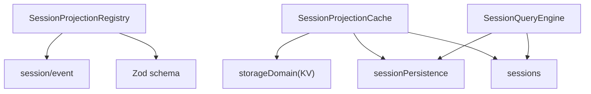

# 会�投影

<cite>
**本文引用的文件**
- [packages/session/session-projection/src/index.ts](file://packages/session/session-projection/src/index.ts)
- [packages/session/session-projection-cache/src/index.ts](file://packages/session/session-projection-cache/src/index.ts)
- [packages/llm/token-meter/src/projection.ts](file://packages/llm/token-meter/src/projection.ts)
- [packages/session-query/session-query/src/index.ts](file://packages/session-query/session-query/src/index.ts)
- [docs/subsystems/session-projection.md](file://docs/subsystems/session-projection.md)
- [docs/subsystems/session-query.md](file://docs/subsystems/session-query.md)
</cite>

## 目录
1. [简介](#简介)
2. [项目结�](#项目结�)
3. [核心组件](#核心组件)
4. [��总览](#��总览)
5. [详细组件分�](#详细组件分�)
6. [�赖关系分�](#�赖关系分�)
7. [性能考�](#性能考�)
8. [故障�查指�](#故障�查指�)
9. [结论](#结论)
10. [附录：自定义投影开�指�](#附录自定义投影开�指�)

## 简介
本文件系统化�述“会�投影��系统的设计���。投影将�始会�事件转�为�读的业务对象，�供一致��缓存���久化的当�值视图；��查询能力，为上层�供高效的数�访问��。文档覆盖以下�点：
- 投影的概念�作用：如何把事件�折��业务�用的整体值
- 投影注册表：驱动机制��更通知�懒加载�动��载
- 投影缓存：策略�失效�自愈�冷读路径
- 统计信�：以投影方�收集�计算（如 Token 用��上下文�力）
- 查询��：基�会�查询的过滤�全文检索�关系追踪
- 扩展性：如何编写自定义投影并优化性能

## 项目结�
会�投影由三个关键部分��：
- 投影注册表�驱动器：订阅会�事件，按��纯函数�进状�，�供快照�检查点
- 投影�久化缓存：对�个会�的投影状���盘�冷读��
- 会�查询：在“首选�时�的逻辑会�语料上�供过滤��索�关系�窗�读�

```mermaid
graph TB
A["会�事件�<br/>session/event"] --> B["投影注册表<br/>SessionProjectionRegistry"]
B --> C["投影快照/检查点<br/>snapshot / checkpoint"]
C --> D["�久化缓存�务<br/>SessionProjectionCache"]
D --> E["冷读��<br/>coldSnapshot + restore"]
B --> F["�更通知<br/>onChanged"]
G["会�查询引�<br/>SessionQueryEngine"] --> H["过滤/�索/关系/窗�"]
D -.-> G
```

图表��
- [packages/session/session-projection/src/index.ts:171-425](file://packages/session/session-projection/src/index.ts#L171-L425)
- [packages/session/session-projection-cache/src/index.ts:71-197](file://packages/session/session-projection-cache/src/index.ts#L71-L197)
- [packages/session-query/session-query/src/index.ts:81-357](file://packages/session-query/session-query/src/index.ts#L81-L357)

章节��
- [docs/subsystems/session-projection.md:1-263](file://docs/subsystems/session-projection.md#L1-L263)
- [docs/subsystems/session-query.md:1-496](file://docs/subsystems/session-query.md#L1-L496)

## 核心组件
- 投影定义�类�表
  - �个领域贡献一个 ProjectionDefinition，包� key�schema�init�apply�view�stateVersion
  - SessionProjectionMap 是全局�扩展的类�表，承载所有键到值的映射
- 投影注册表
  - 订阅 session/event，对�个已注册��进行 eager apply
  - 维护 per-session 的水��元（UnitCell），支�懒�建�引用计数
  - �供 snapshot�checkpoint�restoreFloor�viewCheckpoint�restore�onChanged
- 投影�久化缓存
  - 写�模�：按事件数或时间间隔节�，并在 turn/end �会�释放时强制�盘
  - 冷读路径：�缓存行 + �久化尾部�放 + 注册表��，失败软处�并自愈
- 会�查询
  - 统一抽象：列表�过滤�全文检索�关系追踪�窗�读�
  - �投影解耦，但��用会�事件��逻辑会�视图

章节��
- [packages/session/session-projection/src/index.ts:34-128](file://packages/session/session-projection/src/index.ts#L34-L128)
- [packages/session/session-projection/src/index.ts:171-425](file://packages/session/session-projection/src/index.ts#L171-L425)
- [packages/session/session-projection-cache/src/index.ts:71-197](file://packages/session/session-projection-cache/src/index.ts#L71-L197)
- [packages/session-query/session-query/src/index.ts:81-357](file://packages/session-query/session-query/src/index.ts#L81-L357)

## ��总览
投影系统�循“框�驱动�领域计算�的分工：
- 框�负责订阅事件�维护水��触�快照��更通知
- 领域�关注纯函数：init/apply/view � schema/stateVersion
- 缓存层��冷�动�崩溃��的性能�一致性
- 查询层�供��业务的过滤�检索�关系能力

```mermaid
sequenceDiagram
participant S as "会�"
participant R as "投影注册表"
participant U as "投影��"
participant C as "�久化缓存"
participant Q as "会�查询"
S-->>R : "session/event"
R->>U : "apply(state, event)"
alt 状�引用�化
R-->>R : "更新水��缓存�元"
R-->>Q : "onChanged(key, value, seq)"
end
Note over R,C : "turn/end 或阈值触� write"
R-->>C : "checkpoint(session)"
C-->>C : "put(id, identity, rows)"
Q-->>S : "list/filter/search/trace"
```

图表��
- [packages/session/session-projection/src/index.ts:171-425](file://packages/session/session-projection/src/index.ts#L171-L425)
- [packages/session/session-projection-cache/src/index.ts:201-239](file://packages/session/session-projection-cache/src/index.ts#L201-L239)
- [packages/session-query/session-query/src/index.ts:134-357](file://packages/session-query/session-query/src/index.ts#L134-L357)

## 详细组件分�

### 投影���类�表
- 投影��必须满足：
  - init/apply/view �为�步纯函数
  - state 必须是� JSON �列化的普通对象（用��久化）
  - 未关心的事件需返�相�状�引用，��下游无效工作
- SessionProjectionMap 通过模�声�扩展，新�键�新�投影

```mermaid
classDiagram
class ProjectionDefinition {
+key
+schema
+init()
+apply(state, event)
+view(state)
+stateVersion
}
class SessionProjectionMap
class UnitCell {
+state
+observedSeq
}
ProjectionDefinition --> SessionProjectionMap : "映射键"
SessionProjectionMap --> UnitCell : "�会��键"
```

图表��
- [packages/session/session-projection/src/index.ts:34-128](file://packages/session/session-projection/src/index.ts#L34-L128)
- [packages/session/session-projection/src/index.ts:130-153](file://packages/session/session-projection/src/index.ts#L130-L153)

章节��
- [packages/session/session-projection/src/index.ts:34-128](file://packages/session/session-projection/src/index.ts#L34-L128)

### 投影注册表：驱动�快照���
- 驱动：监� session/event，对所有注册��执行 apply，仅在状�引用�化时触��更通知
- 快照：snapshot 返�一致的 asOfSeq � values，values � schema 校验
- 检查点：checkpoint 产出 (ver, seq, val) 行，val 为结�化克隆，��泄露内部引用
- ��：restore 使用 checkpoint + 尾部事件�放，检测日志收缩并拒��安全��
- 懒�建：首次访问�会��键时，� init 开始折���

```mermaid
flowchart TD
Start(["注册/事件到达"]) --> Build{"是�已有�元?"}
Build -- � --> FoldInit["� init 折���"]
Build -- 是 --> Apply["apply(state, event)"]
FoldInit --> Apply
Apply --> Changed{"引用是��化?"}
Changed -- 是 --> Notify["通知 onChanged(带 schema 校验)"]
Changed -- � --> End(["结�"])
Notify --> End
```

图表��
- [packages/session/session-projection/src/index.ts:387-425](file://packages/session/session-projection/src/index.ts#L387-L425)
- [packages/session/session-projection/src/index.ts:248-282](file://packages/session/session-projection/src/index.ts#L248-L282)
- [packages/session/session-projection/src/index.ts:355-385](file://packages/session/session-projection/src/index.ts#L355-L385)

章节��
- [packages/session/session-projection/src/index.ts:171-425](file://packages/session/session-projection/src/index.ts#L171-L425)

### 投影缓存：写�模��冷读路径
- 写�模�：
  - �事件递� pending，达到阈值或超过时间间隔则写入
  - 两个强制�盘点：turn/end �会�释放（detach）
  - 写入失败软处�，�影�主路径
- 冷读路径：
  - 先�试 cachedSnapshot（零 I/O）
  - �则 readFrom ��尾部事件，调用 registry.restore �放
  - 身份校验确�记录���一生命周期
  - ���写�更近的检查点，下次冷读更快

```mermaid
sequenceDiagram
participant L as "调用方"
participant C as "缓存�务"
participant P as "�久化"
participant R as "注册表"
L->>C : "coldSnapshot(id)"
C->>C : "cachedSnapshot(meta)?"
alt 命中缓存
C-->>L : "asOfSeq/values"
else 未命中
C->>P : "readFrom(id, floor)"
P-->>C : "events, meta"
C->>R : "restore(checkpoint, events, baseSeq)"
R-->>C : "snapshot + refreshed checkpoint"
C-->>L : "snapshot"
C->>C : "putSoft(id, identity, rows)"
end
```

图表��
- [packages/session/session-projection-cache/src/index.ts:119-197](file://packages/session/session-projection-cache/src/index.ts#L119-L197)
- [packages/session/session-projection-cache/src/index.ts:201-239](file://packages/session/session-projection-cache/src/index.ts#L201-L239)

章节��
- [packages/session/session-projection-cache/src/index.ts:71-197](file://packages/session/session-projection-cache/src/index.ts#L71-L197)
- [packages/session/session-projection-cache/src/index.ts:201-281](file://packages/session/session-projection-cache/src/index.ts#L201-L281)

### 统计信�的投影�收集�计算
- 以投影为����跨事件的统计�，例如 Token 用��上下文�力�上下文��等
- 这些投影通过 SessionProjectionMap 扩展键暴露给客户端，作为“完整当�值�
- 优势：无需订阅事件，直�读�最终结�；适� UI 展示�决策�考

```mermaid
graph LR
E["会�事件"] --> T["Token 用�投影<br/>TokenUsageProjection"]
E --> P["上下文�力投影<br/>ContextPressureProjection"]
E --> B["上下文��投影<br/>ContextBreakdownProjection"]
T --> V["SessionProjectionMap[tokenUsage]"]
P --> V
B --> V
```

图表��
- [packages/llm/token-meter/src/projection.ts:13-77](file://packages/llm/token-meter/src/projection.ts#L13-L77)

章节��
- [packages/llm/token-meter/src/projection.ts:13-77](file://packages/llm/token-meter/src/projection.ts#L13-L77)

### 查询��：过滤�全文检索�关系追踪
- 会�查询�供：
  - 列表�过滤：基�元数���用性�件
  - 全文检索：跨会���会�的事件级�索
  - 关系追踪：父�会�谱系�事件替�链�引用关系
  - 窗�读�：围绕目标事件的上下文窗�
- �投影解耦，但共享会�事件�，便�组�使用

```mermaid
flowchart TD
Q["查询请求"] --> F["过滤/分页/游标"]
Q --> S["全文检索"]
Q --> T["关系追踪"]
Q --> W["窗�读�"]
F --> R["结�集"]
S --> R
T --> R
W --> R
```

图表��
- [packages/session-query/session-query/src/index.ts:134-357](file://packages/session-query/session-query/src/index.ts#L134-L357)

章节��
- [docs/subsystems/session-query.md:1-496](file://docs/subsystems/session-query.md#L1-L496)
- [packages/session-query/session-query/src/index.ts:81-357](file://packages/session-query/session-query/src/index.ts#L81-L357)

## �赖关系分�
- 投影注册表�赖：
  - Cordis 上下文��务机制
  - 会�事件�（session/event）
  - Zod 类�校验（schema）
- 缓存�务�赖：
  - 存储域（KV 表）
  - 会��久化（readFrom/flush）
  - 会��务（sessions）
- 查询引��赖：
  - 会��务��久化
  - 标题折��文档���过滤�追踪工具

图表��
- [packages/session/session-projection/src/index.ts:171-222](file://packages/session/session-projection/src/index.ts#L171-L222)
- [packages/session/session-projection-cache/src/index.ts:71-89](file://packages/session/session-projection-cache/src/index.ts#L71-L89)
- [packages/session-query/session-query/src/index.ts:81-105](file://packages/session-query/session-query/src/index.ts#L81-L105)

章节��
- [packages/session/session-projection/src/index.ts:171-222](file://packages/session/session-projection/src/index.ts#L171-L222)
- [packages/session/session-projection-cache/src/index.ts:71-89](file://packages/session/session-projection-cache/src/index.ts#L71-L89)
- [packages/session-query/session-query/src/index.ts:81-105](file://packages/session-query/session-query/src/index.ts#L81-L105)

## 性能考�
- 投影��
  - �� apply �步且轻�，未�化事件返�相�引用以��下游开销
  - view 输出尽��且稳定，�少�列化�传输�本
- 注册表
  - 懒æ�„建å�•å…ƒï¼Œé�¿å…�æ— è°“çš„å�†å�²æŠ˜å�
  - 引用计数管�多�件挂载�一键的生命周期
- 缓存
  - 写�节����盘频�；turn/end � detach ��强一致点
  - 冷读路径优先使用缓存，失败��退到�久化尾部�放
- 查询
  - 过滤�全文检索结�游标分页，�制�次�应大�
  - 窗�读��制 before/after 范围，防止过大负载

[本节为通用指导，�直�分�具体文件]

## 故障�查指�
- 常�错误�定�
  - stateVersion �匹�：��时丢弃旧行，需�头�放
  - 日志收缩：restore 检测到水�越界，�求� seq 0 �新读�
  - 身份�一致：缓存记录�当�会�生命周期�符，视为无关记录
  - 写失败：缓存写入失败软处�，日志告警，下次自动自愈
- 建议步骤
  - 检查投影��的 stateVersion 是��状�结��更而�级
  - 确认缓存�置（writeEveryEvents�writeIntervalMs）是���
  - 查看�久化 readFrom 返�的尾部事件是��预期一致
  - 通过 onChanged 订阅定�具体键的�更时机� seq

章节��
- [packages/session/session-projection/src/index.ts:194-221](file://packages/session/session-projection/src/index.ts#L194-L221)
- [packages/session/session-projection/src/index.ts:355-385](file://packages/session/session-projection/src/index.ts#L355-L385)
- [packages/session/session-projection-cache/src/index.ts:119-197](file://packages/session/session-projection-cache/src/index.ts#L119-L197)
- [packages/session/session-projection-cache/src/index.ts:246-281](file://packages/session/session-projection-cache/src/index.ts#L246-L281)

## 结论
会�投影系统将事件�转化为稳定��缓存���久化的业务视图，并通过查询能力�供高效的数�访问。其设计强调：
- 纯函数驱动的投影��，�责清晰�易�测试�扩展
- 注册表的懒�建�引用计数，兼顾性能�生命周期管�
- 缓存的写�模��冷读路径，�障一致性���能力
- 查询的解耦�组�，支�丰富的业务场景

## 附录：自定义投影开�指�
- 步骤
  - 在 SessionProjectionMap 中扩展键，定义值类�
  - �� ProjectionDefinition：
    - init：空日志的�始状�
    - apply：根�事件���进状�，未�化返��引用
    - view：将内部状�转为对外��的 wire 值
    - schema：对 view 输出进行校验
    - stateVersion：当状�结�或折�语义�化时递�
  - 在�件中注册该��，并�选择订阅 onChanged ���更
- 最佳�践
  - �� apply �步�幂等，��副作用
  - 最�化 view 输出体积，��大对象频��列化
  - ��使用 stateVersion，确�缓存行�被误用
  - 在高频事件中尽�返���引用，�少下游通知
  - 结�查询能力，将��计算下沉到投影，��查询效�

章节��
- [packages/session/session-projection/src/index.ts:34-128](file://packages/session/session-projection/src/index.ts#L34-L128)
- [packages/session/session-projection/src/index.ts:194-221](file://packages/session/session-projection/src/index.ts#L194-L221)
- [packages/llm/token-meter/src/projection.ts:13-77](file://packages/llm/token-meter/src/projection.ts#L13-L77)