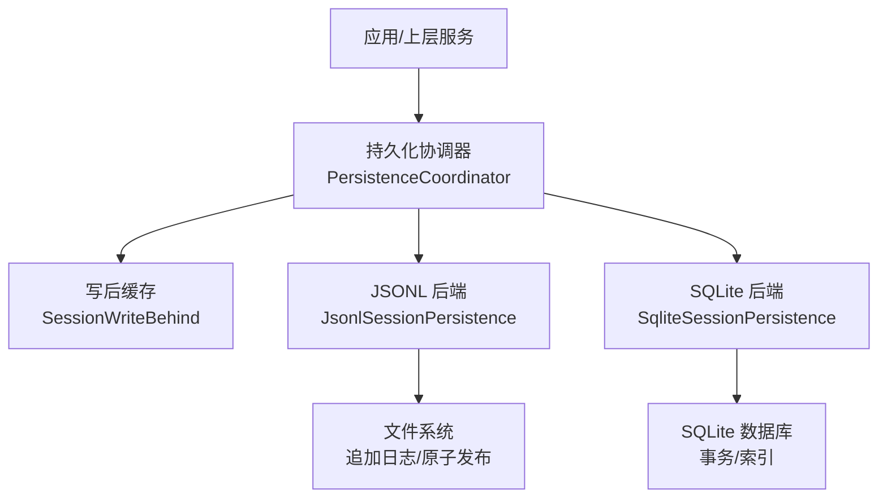
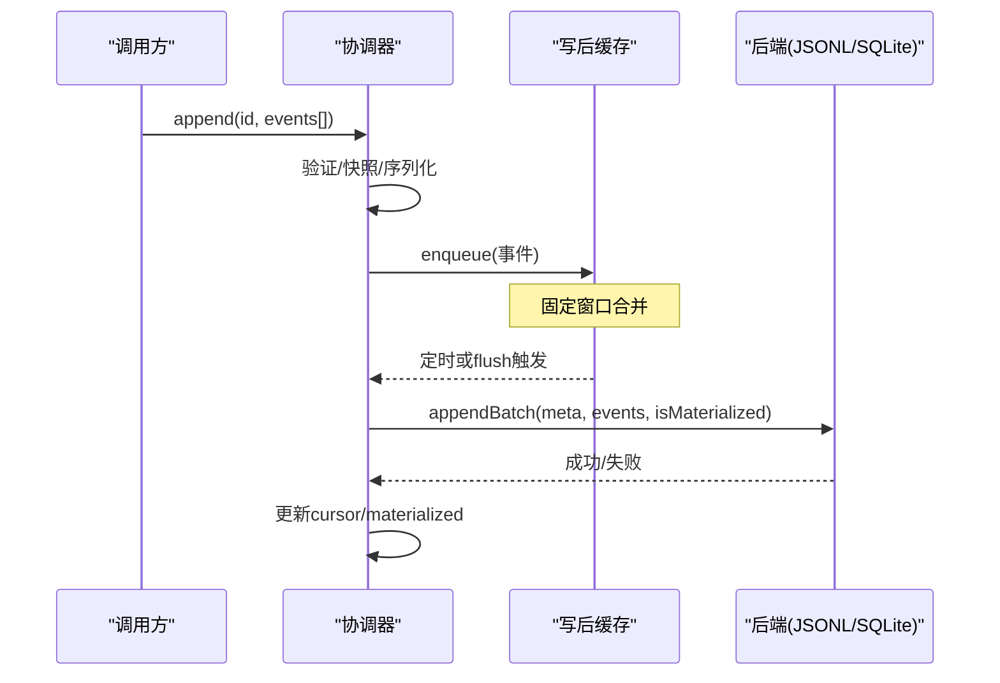
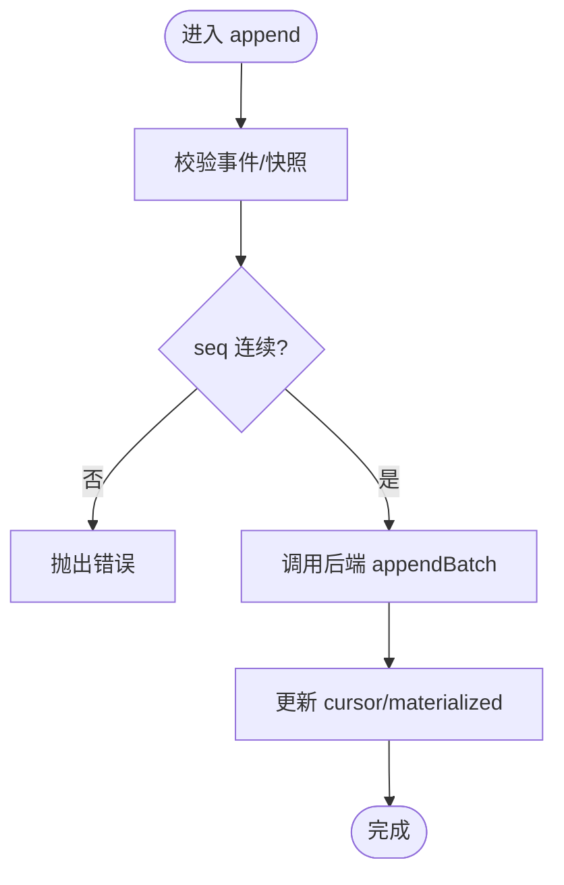
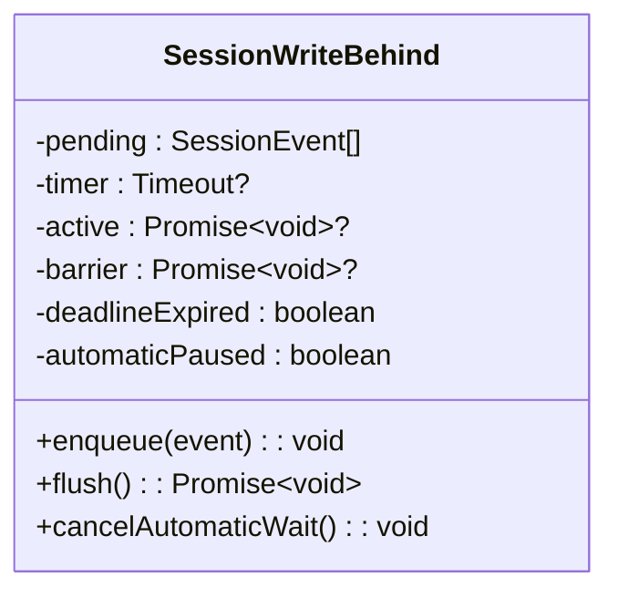
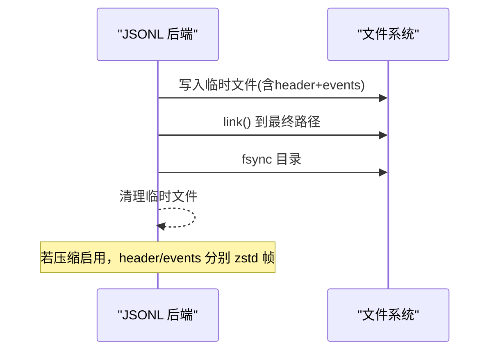
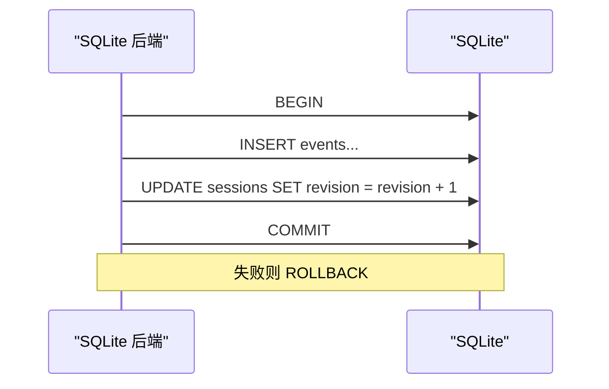
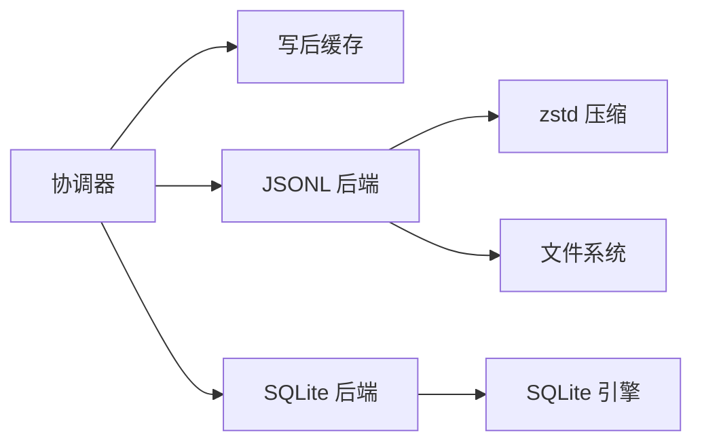

# 会话持久化

<cite>
**本文引用的文件**
- [coordinator.ts](file://packages/session/session-persistence/src/coordinator.ts)
- [write-behind.ts](file://packages/session/session-persistence/src/write-behind.ts)
- [index.ts（JSONL）](file://packages/session/session-persistence-jsonl/src/index.ts)
- [format.ts（JSONL）](file://packages/session/session-persistence-jsonl/src/format.ts)
- [zstd.ts（JSONL）](file://packages/session/session-persistence-jsonl/src/zstd.ts)
- [index.ts（SQLite）](file://packages/session/session-persistence-sqlite/src/index.ts)
- [schema.ts（SQLite）](file://packages/session/session-persistence-sqlite/src/schema.ts)
</cite>

## 目录
1. [简介](#简介)
2. [项目结构](#项目结构)
3. [核心组件](#核心组件)
4. [架构总览](#架构总览)
5. [详细组件分析](#详细组件分析)
6. [依赖关系分析](#依赖关系分析)
7. [性能考量](#性能考量)
8. [故障排查指南](#故障排查指南)
9. [结论](#结论)
10. [附录：迁移与最佳实践](#附录：迁移与最佳实践)

## 简介
本文件深入解析会话数据持久化的实现架构，重点说明协调器模式的设计原理、写后缓存、批量写入与数据一致性保证机制；对比 JSONL 与 SQLite 两种存储后端的特点与适用场景；阐述存储格式设计与版本兼容性策略；文档化数据压缩算法的使用（特别是 zstd 的集成与优化）；并给出持久化层的配置选项、性能调优参数、故障恢复机制以及存储后端迁移指南与最佳实践。

## 项目结构
会话持久化由“协调器 + 写后缓存 + 多后端”的分层架构组成：
- 协调器（session-persistence）：统一编排创建、追加、准备/提交、加载、检查、读取后缀、回收等流程，屏蔽后端差异。
- 写后缓存（session-persistence）：为每个活跃会话维护固定窗口的批量写入控制器，确保顺序、幂等与可恢复。
- 后端实现：
  - JSONL（session-persistence-jsonl）：每会话一个追加型日志文件，支持可选的 zstd 压缩与打包行。
  - SQLite（session-persistence-sqlite）：将会话头与事件映射为表行，提供按 seq 的 seek 能力。

图表来源
- [coordinator.ts:588-625](file://packages/session/session-persistence/src/coordinator.ts#L588-L625)
- [write-behind.ts:22-33](file://packages/session/session-persistence/src/write-behind.ts#L22-L33)
- [index.ts（JSONL）:121-164](file://packages/session/session-persistence-jsonl/src/index.ts#L121-L164)
- [index.ts（SQLite）:99-138](file://packages/session/session-persistence-sqlite/src/index.ts#L99-L138)

章节来源
- [coordinator.ts:588-800](file://packages/session/session-persistence/src/coordinator.ts#L588-L800)
- [write-behind.ts:1-160](file://packages/session/session-persistence/src/write-behind.ts#L1-L160)
- [index.ts（JSONL）:1-200](file://packages/session/session-persistence-jsonl/src/index.ts#L1-L200)
- [index.ts（SQLite）:1-200](file://packages/session/session-persistence-sqlite/src/index.ts#L1-L200)

## 核心组件
- 持久化协调器（PersistenceCoordinator）
  - 职责：统一创建/追加/准备/提交/加载/检查/读取后缀/回收；维护 per-id 串行链；管理冷读准备缓存；处理崩溃修复序列；保障 append-only 与连续 seq 契约。
  - 关键设计：
    - 写路径监听与批处理窗口（通过 write-behind）。
    - 准备态（preparation）+ 提交（commit）分离，避免并发冲突。
    - 对旧格式事件的迁移与拒绝策略，保证向前兼容。
- 写后缓存（SessionWriteBehind）
  - 职责：为单个活跃会话维护待写队列、固定时间窗口的批量触发、后台写入失败重试与暂停、显式 flush 屏障。
  - 特性：结构化克隆事件、自动/手动双通道、失败时回滚到队列并保持有序。
- JSONL 后端
  - 职责：实现 PersistenceBackend 的文件级读写；支持 zstd 压缩、打包行、原子发布、断尾修复、只读列表仅解析首行。
  - 关键点：每会话独立文件；首次写入原子发布；读取时校验 header frame；支持 raw artifact 导出。
- SQLite 后端
  - 职责：实现 PersistenceBackend 的 DB 级读写；支持 loadStoredFrom 按 seq 读取后缀；单库多会话；事务内原子追加与修复。
  - 关键点：journal_mode 可配；revision/incarnation 用于一致性；torn tail 以 seq 标记删除。

章节来源
- [coordinator.ts:83-215](file://packages/session/session-persistence/src/coordinator.ts#L83-L215)
- [write-behind.ts:8-33](file://packages/session/session-persistence/src/write-behind.ts#L8-L33)
- [index.ts（JSONL）:59-83](file://packages/session/session-persistence-jsonl/src/index.ts#L59-L83)
- [index.ts（SQLite）:69-92](file://packages/session/session-persistence-sqlite/src/index.ts#L69-L92)

## 架构总览
协调器作为“控制平面”，后端作为“数据平面”。协调器负责：
- 生命周期：create/prepare/load/inspect/readFrom/list/close。
- 一致性：append-only、seq 连续性、事务性（SQLite）、原子发布（JSONL）。
- 恢复：检测 torn tail，调用 commitRepair 截断并补全 closing events。
- 缓存：prepared session 缓存减少冷启动开销；write-behind 降低 I/O 抖动。

图表来源
- [coordinator.ts:669-710](file://packages/session/session-persistence/src/coordinator.ts#L669-L710)
- [write-behind.ts:45-115](file://packages/session/session-persistence/src/write-behind.ts#L45-L115)
- [index.ts（JSONL）:421-429](file://packages/session/session-persistence-jsonl/src/index.ts#L421-L429)
- [index.ts（SQLite）:284-302](file://packages/session/session-persistence-sqlite/src/index.ts#L284-L302)

## 详细组件分析

### 协调器模式与一致性保证
- 写路径串行化：per-id 的 Promise 链保证同一会话的写入不交错。
- 追加契约：严格校验 event.seq 连续；首次写入原子发布（JSONL）或事务提交（SQLite）。
- 准备/提交：prepare 构建不可变视图，commit 完成发布；支持外部持续写入时的重试收敛。
- 崩溃恢复：load 阶段检测 torn tail，返回 tornMarker；commitRepair 截断并追加合成 closing events。
- 版本兼容：对不支持的事件类型直接拒绝；对历史形状进行迁移；未知类型在加载侧拒绝，避免阻塞在线写入。

图表来源
- [coordinator.ts:669-710](file://packages/session/session-persistence/src/coordinator.ts#L669-L710)

章节来源
- [coordinator.ts:588-800](file://packages/session/session-persistence/src/coordinator.ts#L588-L800)

### 写后缓存（批量写入与失败恢复）
- 固定窗口：基于 maxDelayMs 的定时器合并事件，减少 I/O 次数。
- 后台写入：超时后启动后台写入；若已有活动写入则记录 deadlineExpired，完成后继续。
- 失败处理：写入失败将批次重新入队，暂停自动调度并上报背景失败；显式 flush 等待所有工作完成。
- 幂等与顺序：每次从 pending 中取出完整前缀写入，失败不会丢失已提交部分。

图表来源
- [write-behind.ts:22-33](file://packages/session/session-persistence/src/write-behind.ts#L22-L33)
- [write-behind.ts:45-159](file://packages/session/session-persistence/src/write-behind.ts#L45-L159)

章节来源
- [write-behind.ts:1-160](file://packages/session/session-persistence/src/write-behind.ts#L1-L160)

### JSONL 后端：格式、压缩与原子发布
- 存储格式：
  - 每会话一个追加型日志文件；首行为 header；后续为事件行。
  - 可选“打包行”将连续的 assistant/chunk 类事件压缩为更少的行，体积显著减小。
- 压缩：
  - 默认使用 zstd 分帧；header 与事件体分别成帧；读取时逐帧解码，支持大文件流式处理与定期 yield 避免阻塞事件循环。
  - 支持 none 关闭压缩。
- 原子发布：
  - 首次写入先写临时文件，再 link/link+fsync 发布，防止半写覆盖；POSIX 与 Win32 分别实现。
- 断尾修复：
  - 扫描 zstd frames，若尾部不完整，尝试解压恢复部分事件；返回 tornMarker（字节偏移与恢复事件），由协调器调用 commitRepair 截断并补齐 closing events。
- 只读优化：
  - list 仅读取首行 header；raw artifact 可导出原始文本（含 packed rows）。

图表来源
- [index.ts（JSONL）:513-592](file://packages/session/session-persistence-jsonl/src/index.ts#L513-L592)
- [index.ts（JSONL）:618-632](file://packages/session/session-persistence-jsonl/src/index.ts#L618-L632)
- [index.ts（JSONL）:347-419](file://packages/session/session-persistence-jsonl/src/index.ts#L347-L419)

章节来源
- [index.ts（JSONL）:1-200](file://packages/session/session-persistence-jsonl/src/index.ts#L1-L200)
- [index.ts（JSONL）:208-345](file://packages/session/session-persistence-jsonl/src/index.ts#L208-L345)
- [index.ts（JSONL）:421-701](file://packages/session/session-persistence-jsonl/src/index.ts#L421-L701)

### SQLite 后端：事务、seek 与版本标识
- 存储模型：sessions 表保存元数据；events 表保存事件；revision/incarnation 标识版本演进。
- 事务原子性：appendBatch 在一个事务内插入事件并更新 revision；失败回滚。
- 后缀读取：loadStoredFrom 直接 SELECT seq >= fromSeq，按后缀规模缩放。
- 断尾修复：tornMarker 为 seq；commitRepair 删除该 seq 及之后的行，并插入 closing events。
- Journal 模式：支持 wal/delete/truncate/persist，适配不同文件系统。

图表来源
- [index.ts（SQLite）:284-302](file://packages/session/session-persistence-sqlite/src/index.ts#L284-L302)
- [index.ts（SQLite）:309-338](file://packages/session/session-persistence-sqlite/src/index.ts#L309-L338)

章节来源
- [index.ts（SQLite）:206-365](file://packages/session/session-persistence-sqlite/src/index.ts#L206-L365)
- [schema.ts（SQLite）:1-200](file://packages/session/session-persistence-sqlite/src/schema.ts#L1-L200)

### 数据压缩与优化（zstd）
- 帧边界：header 与事件体各自独立帧，便于单独校验与恢复。
- 解码优化：逐帧解码并在长耗时处 scheduler.yield，避免阻塞事件循环。
- 体积优化：packChunks 将连续 chunk 事件打包为更少行，实测显著减小日志体积。
- 可读性：raw artifact 始终输出逻辑上的 session.jsonl 内容，隐藏物理编码细节。

章节来源
- [index.ts（JSONL）:37-44](file://packages/session/session-persistence-jsonl/src/index.ts#L37-L44)
- [index.ts（JSONL）:252-282](file://packages/session/session-persistence-jsonl/src/index.ts#L252-L282)
- [index.ts（JSONL）:347-419](file://packages/session/session-persistence-jsonl/src/index.ts#L347-L419)
- [format.ts（JSONL）:1-200](file://packages/session/session-persistence-jsonl/src/format.ts#L1-L200)
- [zstd.ts（JSONL）:1-200](file://packages/session/session-persistence-jsonl/src/zstd.ts#L1-L200)

### 版本兼容与迁移策略
- 格式版本：会话头携带版本；加载时若高于当前构建版本，明确提示升级 harness；低于且无升级路径则拒绝。
- 事件迁移：对历史事件形状（如 steering/message、turn/start/end、旧消息结构）进行迁移；无法识别的类型在加载侧拒绝。
- 向后兼容：append 侧拒绝不受支持的旧事件类型，避免污染日志；read 侧尽可能迁移或拒绝。

章节来源
- [coordinator.ts:47-81](file://packages/session/session-persistence/src/coordinator.ts#L47-L81)
- [coordinator.ts:273-557](file://packages/session/session-persistence/src/coordinator.ts#L273-L557)

## 依赖关系分析
- 协调器依赖：
  - 会话领域对象（Session/SessionEvent/SessionHeader）与快照工具。
  - 写后控制器（SessionWriteBehind）。
  - 后端接口（PersistenceBackend），具体由 JSONL/SQLite 实现。
- JSONL 后端依赖：
  - 文件系统 API、路径计算、压缩模块（zstd）、平台特定发布逻辑。
- SQLite 后端依赖：
  - Node sqlite 原生绑定、schema 定义、事务与查询。

图表来源
- [coordinator.ts:588-625](file://packages/session/session-persistence/src/coordinator.ts#L588-L625)
- [index.ts（JSONL）:121-164](file://packages/session/session-persistence-jsonl/src/index.ts#L121-L164)
- [index.ts（SQLite）:99-138](file://packages/session/session-persistence-sqlite/src/index.ts#L99-L138)

章节来源
- [coordinator.ts:588-800](file://packages/session/session-persistence/src/coordinator.ts#L588-L800)
- [index.ts（JSONL）:121-200](file://packages/session/session-persistence-jsonl/src/index.ts#L121-L200)
- [index.ts（SQLite）:99-200](file://packages/session/session-persistence-sqlite/src/index.ts#L99-L200)

## 性能考量
- 批量写入窗口（writeBatchMaxDelayMs）：增大可减少 I/O 次数，但增加延迟；建议根据吞吐与延迟目标调优。
- 冷读缓存（preparedSessionCacheSize）：提高可复用未发布会话的准备结果，加速 resume 与 inspect。
- JSONL 压缩：zstd 默认开启，显著降低磁盘占用；大日志解码时分帧 yield，避免卡顿。
- SQLite journal_mode：WAL 适合高并发与网络挂载受限环境外的场景；必要时切换为 delete/truncate/persist。
- 后缀读取：SQLite 支持 loadStoredFrom，按 seq 范围读取，适合长会话增量回放。

[本节为通用性能指导，不直接分析具体文件]

## 故障排查指南
- 格式不支持：
  - 现象：加载时报错提示版本过高或过低。
  - 处理：升级 harness 或确认存在升级路径；查看定位信息（JSONL 会附带原始日志路径）。
- 数据损坏：
  - JSONL：zstd 帧损坏或 header 非法；检查 readFirstZstdLine/readStableFile 流程。
  - SQLite：唯一约束冲突或事务失败；检查 appendBatch 事务与 rollback。
- 断尾恢复：
  - JSONL：tornMarker 包含 truncateTo 与 recoveredEvents；commitRepair 会截断并补齐 closing events。
  - SQLite：tornMarker 为 seq；commitRepair 删除尾部并插入 closing events。
- 写入失败：
  - 写后缓存会将失败批次重新入队并暂停自动调度；检查 reportBackgroundFailure 回调与系统资源。

章节来源
- [coordinator.ts:47-81](file://packages/session/session-persistence/src/coordinator.ts#L47-L81)
- [index.ts（JSONL）:347-419](file://packages/session/session-persistence-jsonl/src/index.ts#L347-L419)
- [index.ts（SQLite）:309-338](file://packages/session/session-persistence-sqlite/src/index.ts#L309-L338)
- [write-behind.ts:138-159](file://packages/session/session-persistence/src/write-behind.ts#L138-L159)

## 结论
该持久化方案通过协调器模式将“控制面”与“数据面”解耦，结合写后缓存与多后端实现，提供了高性能、强一致性与可恢复的会话日志存储。JSONL 适合可移植与人类可读的场景，SQLite 适合随机访问与高效后缀读取。统一的版本兼容与断尾恢复机制保障了跨版本与异常场景下的稳定性。

[本节为总结性内容，不直接分析具体文件]

## 附录：迁移与最佳实践
- 选择后端：
  - JSONL：需要可移植、可人工检查、最小依赖；默认启用 zstd 压缩与 packChunks 以获得更小体积。
  - SQLite：需要按 seq 快速回放、复杂查询、更高写入吞吐；合理设置 journal_mode。
- 配置建议：
  - preparedSessionCacheSize：根据冷启动频率与内存预算调整。
  - writeBatchMaxDelayMs：平衡延迟与吞吐；生产环境建议适度增大以减少 I/O。
  - JSONL compression：默认 zstd；如需最大可读性可设为 none。
  - SQLite journalMode：默认 wal；网络挂载或共享内存受限环境切换为 delete/truncate/persist。
- 迁移步骤：
  - 从 JSONL 迁移到 SQLite：
    - 列出所有会话（list），逐个 prepare/load 获取不可变视图。
    - 在 SQLite 中通过 appendBatch 写入事件；利用事务保证一致性。
    - 验证 revision 与完整性后切换读取端指向 SQLite。
  - 从 SQLite 迁移到 JSONL：
    - 遍历 sessions 与 events，按序生成 JSONL 行；首次写入采用原子发布。
    - 校验 header 与事件完整性；必要时启用 packChunks 与 zstd。
- 最佳实践：
  - 保持 append-only 与 seq 连续性；避免并发乱序写入。
  - 使用 prepare/commit 模式进行重要变更，避免中间状态暴露。
  - 监控 background failure 回调，及时处理底层 I/O 问题。
  - 定期评估 preparedSessionCacheSize 与 writeBatchMaxDelayMs，依据负载调优。

[本节为通用指导，不直接分析具体文件]