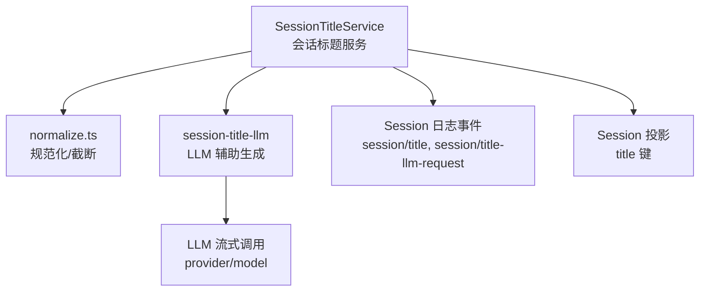
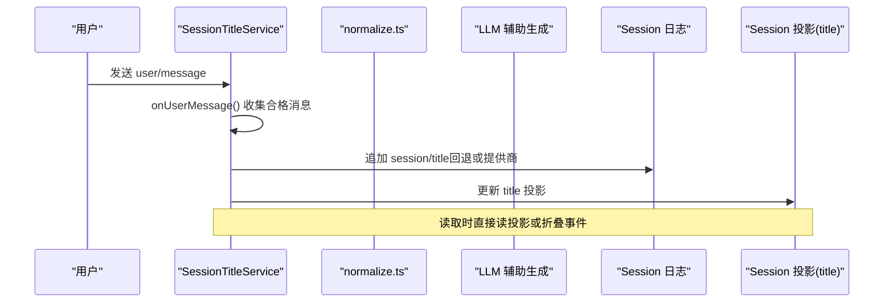
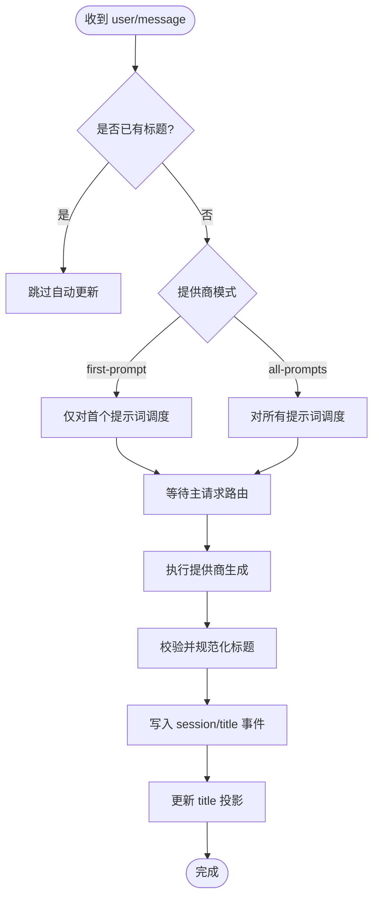
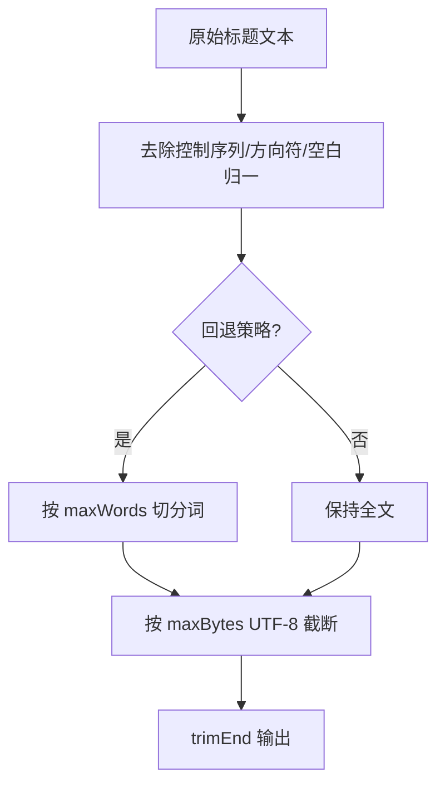
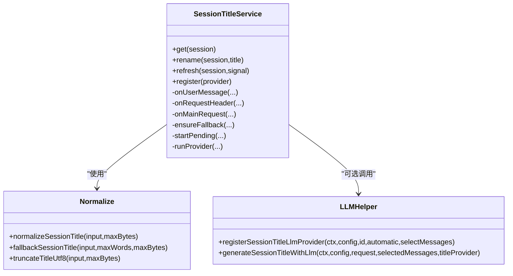
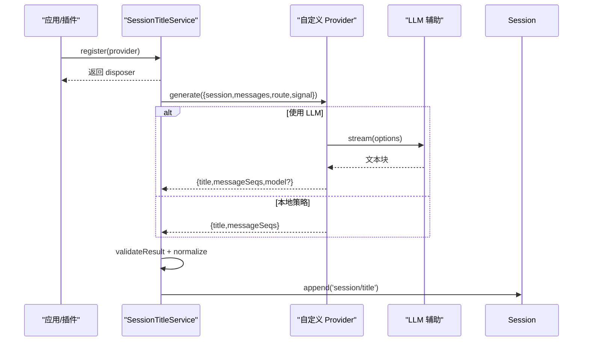
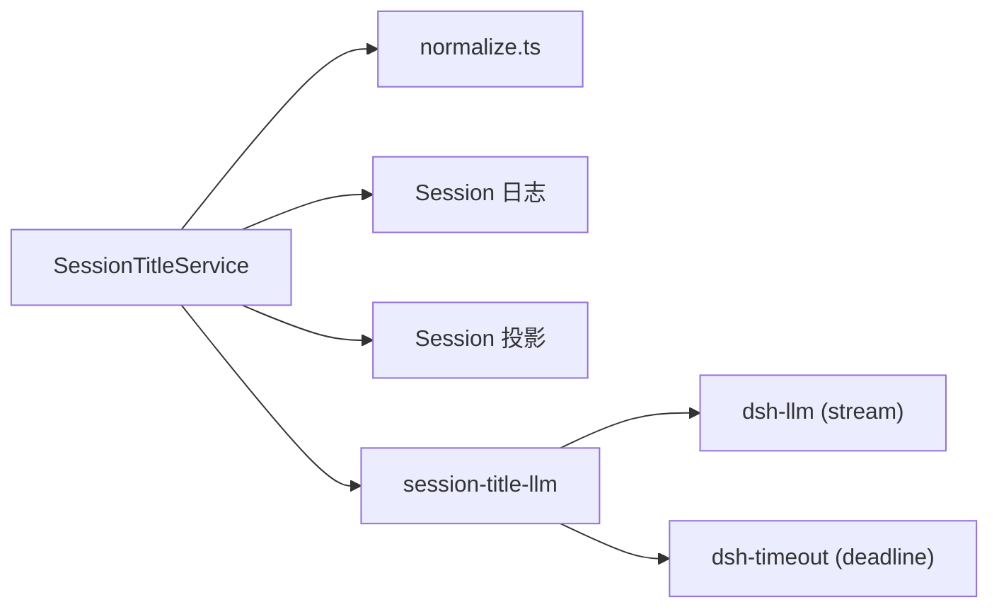

# 会话标题管理

<cite>
**本文引用的文件**
- [packages/session/session-title/src/index.ts](file://packages/session/session-title/src/index.ts)
- [packages/session/session-title/src/normalize.ts](file://packages/session/session-title/src/normalize.ts)
- [packages/session/session-title-llm/src/index.ts](file://packages/session/session-title-llm/src/index.ts)
- [examples/acp-agent/session-title.cordis.yml](file://examples/acp-agent/session-title.cordis.yml)
- [packages/session/session-title/tests/session-title.spec.ts](file://packages/session/session-title/tests/session-title.spec.ts)
- [docs/subsystems/session-title.md](file://docs/subsystems/session-title.md)
</cite>

## 目录
1. [简介](#简介)
2. [项目结构](#项目结构)
3. [核心组件](#核心组件)
4. [架构总览](#架构总览)
5. [详细组件分析](#详细组件分析)
6. [依赖关系分析](#依赖关系分析)
7. [性能与优化](#性能与优化)
8. [故障排查指南](#故障排查指南)
9. [结论](#结论)
10. [附录：配置与最佳实践](#附录：配置与最佳实践)

## 简介
本文件系统性说明会话标题的自动生成与管理机制，覆盖三种生成策略（基于首个提示词、所有提示词、LLM智能生成）、标题规范化规则与算法、存储与检索的性能优化策略（日志事件折叠、投影缓存、去重与并发控制）、自定义标题生成器的接入方式、不同策略的适用场景与性能特征，以及配置选项与最佳实践。

## 项目结构
- 标题服务与持久化
  - 服务入口与生命周期、事件监听、工作调度、结果验证与落盘：[packages/session/session-title/src/index.ts](file://packages/session/session-title/src/index.ts)
  - 标题文本规范化与截断工具：[packages/session/session-title/src/normalize.ts](file://packages/session/session-title/src/normalize.ts)
- LLM 辅助生成
  - 共享 LLM 调用封装、超时、系统提示、消息框定与请求记录：[packages/session/session-title-llm/src/index.ts](file://packages/session/session-title-llm/src/index.ts)
- 示例与测试
  - 通过 Cordis 装配注册“首个提示词”LLM 提供商：[examples/acp-agent/session-title.cordis.yml](file://examples/acp-agent/session-title.cordis.yml)
  - 单元测试覆盖规范化、回退、折叠与事件追加行为：[packages/session/session-title/tests/session-title.spec.ts](file://packages/session/session-title/tests/session-title.spec.ts)
- 子系统文档
  - 公开 API、类型契约与事件声明：[docs/subsystems/session-title.md](file://docs/subsystems/session-title.md)

**图表来源**
- [packages/session/session-title/src/index.ts:261-341](file://packages/session/session-title/src/index.ts#L261-L341)
- [packages/session/session-title/src/normalize.ts:21-74](file://packages/session/session-title/src/normalize.ts#L21-L74)
- [packages/session/session-title-llm/src/index.ts:153-169](file://packages/session/session-title-llm/src/index.ts#L153-L169)
- [packages/session/session-title-llm/src/index.ts:229-294](file://packages/session/session-title-llm/src/index.ts#L229-L294)

**章节来源**
- [packages/session/session-title/src/index.ts:261-341](file://packages/session/session-title/src/index.ts#L261-L341)
- [packages/session/session-title/src/normalize.ts:21-74](file://packages/session/session-title/src/normalize.ts#L21-L74)
- [packages/session/session-title-llm/src/index.ts:153-169](file://packages/session/session-title-llm/src/index.ts#L153-L169)
- [docs/subsystems/session-title.md:1-205](file://docs/subsystems/session-title.md#L1-L205)

## 核心组件
- SessionTitleService
  - 负责监听用户消息、请求头与主请求，调度回退标题与异步提供商生成；维护每个会话的工作状态、版本与取消信号；提供 get/rename/refresh/register 等 API。
- 规范化模块 normalize.ts
  - 清理终端控制序列、方向控制符、空白字符，按 UTF-8 字节预算安全截断，保证标题一致性与可读性。
- LLM 辅助生成模块
  - 提供 registerSessionTitleLlmProvider 与 generateSessionTitleWithLlm，统一系统提示、输入框定、超时、输出限制与失败原因映射，并记录精确的辅助请求事件。

**章节来源**
- [packages/session/session-title/src/index.ts:261-793](file://packages/session/session-title/src/index.ts#L261-L793)
- [packages/session/session-title/src/normalize.ts:21-74](file://packages/session/session-title/src/normalize.ts#L21-L74)
- [packages/session/session-title-llm/src/index.ts:153-169](file://packages/session/session-title-llm/src/index.ts#L153-L169)
- [packages/session/session-title-llm/src/index.ts:229-294](file://packages/session/session-title-llm/src/index.ts#L229-L294)

## 架构总览
会话标题由“日志即真相”的事件驱动：任何标题变更都以事件形式写入会话日志，并通过 foldSessionTitle 进行最新值折叠；同时提供 title 投影用于高效读取。自动生成的触发时机由注册的提供商模式决定（首个提示词或所有提示词），并在主请求路由确定后执行。

**图表来源**
- [packages/session/session-title/src/index.ts:319-341](file://packages/session/session-title/src/index.ts#L319-L341)
- [packages/session/session-title/src/index.ts:461-486](file://packages/session/session-title/src/index.ts#L461-L486)
- [packages/session/session-title/src/index.ts:754-789](file://packages/session/session-title/src/index.ts#L754-L789)

## 详细组件分析

### 生成策略与触发时机
- 基于首个提示词的回退策略
  - 当会话尚无标题且存在首个合格人类文本消息时，使用 fallbackSessionTitle 从首条消息提取前若干词并按 UTF-8 字节上限截断，立即写入 session/title 事件。
  - 优点：零延迟、无外部依赖、稳定可复现。
  - 缺点：信息量有限，可能不够准确。
- 基于所有提示词的 LLM 智能生成
  - 提供商模式为 all-prompts 时，每次新的人类提示都会触发一次生成；或在首个提示词模式下，等待主请求路由确认后再执行。
  - 优点：语义更丰富、语言自适应、可读性更好。
  - 缺点：有网络与模型调用开销，需超时与失败处理。
- 首个提示词的 LLM 智能生成
  - 通过示例装配注册 first-prompt 提供商，在首个提示词出现后尽快启动生成，兼顾时效与质量。

**图表来源**
- [packages/session/session-title/src/index.ts:461-515](file://packages/session/session-title/src/index.ts#L461-L515)
- [packages/session/session-title/src/index.ts:517-583](file://packages/session/session-title/src/index.ts#L517-L583)
- [examples/acp-agent/session-title.cordis.yml:1-20](file://examples/acp-agent/session-title.cordis.yml#L1-L20)

**章节来源**
- [packages/session/session-title/src/index.ts:461-583](file://packages/session/session-title/src/index.ts#L461-L583)
- [examples/acp-agent/session-title.cordis.yml:1-20](file://examples/acp-agent/session-title.cordis.yml#L1-L20)

### 标题规范化规则与算法
- 清理内容
  - 移除 OSC/CSI/ESC 控制序列、C0/C1 控制字符、方向与不可见控制符，压缩空白并 trim。
- 长度限制
  - 按 UTF-8 字节预算安全截断，不拆分 Unicode 码点；最终再 trimEnd。
- 回退策略
  - 从首条合格消息切分词，先按词数上限截取，再按字节上限截断。

**图表来源**
- [packages/session/session-title/src/normalize.ts:21-74](file://packages/session/session-title/src/normalize.ts#L21-L74)

**章节来源**
- [packages/session/session-title/src/normalize.ts:21-74](file://packages/session/session-title/src/normalize.ts#L21-L74)
- [packages/session/session-title/tests/session-title.spec.ts:23-36](file://packages/session/session-title/tests/session-title.spec.ts#L23-L36)

### 存储与检索：日志折叠与投影缓存
- 日志即真相
  - 所有标题变更以 session/title 事件追加；foldSessionTitle 取最后一个事件作为当前快照，确保幂等与可回放。
- 投影缓存
  - 服务注册 title 投影键，apply 仅在 session/title 事件时更新，view 直接返回字符串或 null，避免重复折叠计算。
- 去重与并发
  - 每个会话维护 revision、pending、active 与 AbortSignal；supersede 会中止旧任务并递增版本号，防止竞态。
  - ensureFallback 对同一会话的去重，避免重复写入。

**图表来源**
- [packages/session/session-title/src/index.ts:261-793](file://packages/session/session-title/src/index.ts#L261-L793)
- [packages/session/session-title/src/normalize.ts:21-74](file://packages/session/session-title/src/normalize.ts#L21-L74)
- [packages/session/session-title-llm/src/index.ts:153-169](file://packages/session/session-title-llm/src/index.ts#L153-L169)
- [packages/session/session-title-llm/src/index.ts:229-294](file://packages/session/session-title-llm/src/index.ts#L229-L294)

**章节来源**
- [packages/session/session-title/src/index.ts:304-317](file://packages/session/session-title/src/index.ts#L304-L317)
- [packages/session/session-title/src/index.ts:754-789](file://packages/session/session-title/src/index.ts#L754-L789)
- [docs/subsystems/session-title.md:9-63](file://docs/subsystems/session-title.md#L9-L63)

### 自定义标题生成器
- 接口契约
  - 实现 SessionTitleProvider：包含 id、automatic（first-prompt 或 all-prompts）与 generate(request) 方法。
  - request 包含 session、messages（本次修订的合格人类消息）、route（主请求路由，可选）与 signal（取消）。
  - 返回 SessionTitleProviderResult：title、messageSeqs（必须来自本次请求的消息 seq）、model（可选，提供方/模型标识）。
- 注册方式
  - 通过 ctx.sessionTitle.register(provider) 注册唯一提供商；服务会在生命周期结束时中止其待处理与活跃任务。
- LLM 快速接入
  - 使用 registerSessionTitleLlmProvider 传入配置、id、automatic 与 selectMessages，即可将 LLM 能力包装为标准提供商。

**图表来源**
- [packages/session/session-title/src/index.ts:434-459](file://packages/session/session-title/src/index.ts#L434-L459)
- [packages/session/session-title/src/index.ts:550-583](file://packages/session/session-title/src/index.ts#L550-L583)
- [packages/session/session-title-llm/src/index.ts:153-169](file://packages/session/session-title-llm/src/index.ts#L153-L169)
- [packages/session/session-title-llm/src/index.ts:229-294](file://packages/session/session-title-llm/src/index.ts#L229-L294)

**章节来源**
- [packages/session/session-title/src/index.ts:122-159](file://packages/session/session-title/src/index.ts#L122-L159)
- [packages/session/session-title/src/index.ts:434-459](file://packages/session/session-title/src/index.ts#L434-L459)
- [packages/session/session-title-llm/src/index.ts:153-169](file://packages/session/session-title-llm/src/index.ts#L153-L169)

### 不同策略的适用场景与性能特征
- 首个提示词回退
  - 适用：需要即时显示标题、无外部依赖的场景。
  - 性能：O(1) 时间，极低内存；无网络开销。
- 首个提示词 LLM
  - 适用：希望尽早获得高质量标题，但可接受短暂延迟。
  - 性能：首次调用有网络与模型开销；后续刷新受策略影响。
- 所有提示词 LLM
  - 适用：对话较长、主题频繁变化，需要持续更新的标题。
  - 性能：每次新提示均触发调用，成本较高；适合后台异步与超时保护。

**章节来源**
- [packages/session/session-title/src/index.ts:461-515](file://packages/session/session-title/src/index.ts#L461-L515)
- [packages/session/session-title-llm/src/index.ts:229-294](file://packages/session/session-title-llm/src/index.ts#L229-L294)

## 依赖关系分析
- 内部依赖
  - SessionTitleService 依赖 normalize.ts 进行文本清洗与截断；依赖 Session 日志事件进行持久化与折叠；可选依赖 session-title-llm 进行智能生成。
  - LLM 辅助模块依赖 dsh-llm 的 BlockAssembler、createUserMessage 与流式调用；使用 @deepseek-ai/dsh-timeout 提供 deadline。
- 外部集成
  - 通过 provider/model 路由选择具体模型；通过 Cordis 上下文注入 sessions、sessionProjections、llm 等服务。

**图表来源**
- [packages/session/session-title/src/index.ts:261-341](file://packages/session/session-title/src/index.ts#L261-L341)
- [packages/session/session-title-llm/src/index.ts:1-23](file://packages/session/session-title-llm/src/index.ts#L1-L23)
- [packages/session/session-title-llm/src/index.ts:229-294](file://packages/session/session-title-llm/src/index.ts#L229-L294)

**章节来源**
- [packages/session/session-title/src/index.ts:261-341](file://packages/session/session-title/src/index.ts#L261-L341)
- [packages/session/session-title-llm/src/index.ts:1-23](file://packages/session/session-title-llm/src/index.ts#L1-L23)

## 性能与优化
- 索引与缓存
  - 投影键 title：O(1) 读取，避免每次折叠事件；仅在 session/title 事件时更新。
  - 事件折叠：foldSessionTitle 仅查找最后一个事件，时间复杂度 O(n)，但 n 通常很小。
- 去重与并发控制
  - 每个会话维护 revision、pending、active 与 AbortSignal；supersede 中止旧任务，避免重复生成。
  - ensureFallback 对同一会话的去重，避免重复写入。
- 资源与超时
  - LLM 辅助调用使用 deadline 控制端到端超时；finish reason 映射为明确错误，便于上层重试或降级。
- 输入限制
  - 框架层对 maxInputBytes、maxOutputTokens 进行严格校验，防止过大请求导致性能问题。

**章节来源**
- [packages/session/session-title/src/index.ts:304-317](file://packages/session/session-title/src/index.ts#L304-L317)
- [packages/session/session-title/src/index.ts:664-680](file://packages/session/session-title/src/index.ts#L664-L680)
- [packages/session/session-title/src/index.ts:754-789](file://packages/session/session-title/src/index.ts#L754-L789)
- [packages/session/session-title-llm/src/index.ts:229-294](file://packages/session/session-title-llm/src/index.ts#L229-L294)

## 故障排查指南
- 常见错误与定位
  - 标题为空：normalize 后为空会被拒绝；检查输入是否仅含控制字符或空白。
  - messageSeqs 非法：必须为有序、唯一且属于本次请求的消息 seq；检查提供商返回值。
  - 路由缺失：未记录主请求路由且未配置 provider/model 时会报错；需在配置中成对提供或使用已记录的 route。
  - 超时与终止：SESSION_TITLE_TIMEOUT_CODE 表示辅助请求超时；finishError 会将异常原因标准化。
- 调试建议
  - 查看 session/title 与 session/title-llm-request 事件，确认生成来源、消息范围与模型路由。
  - 使用 refresh 显式重试，或 rename 锁定标题以停止自动更新。

**章节来源**
- [packages/session/session-title/src/index.ts:585-632](file://packages/session/session-title/src/index.ts#L585-L632)
- [packages/session/session-title-llm/src/index.ts:200-218](file://packages/session/session-title-llm/src/index.ts#L200-L218)
- [packages/session/session-title-llm/src/index.ts:171-183](file://packages/session/session-title-llm/src/index.ts#L171-L183)

## 结论
该方案以“日志即真相”为核心，结合确定性回退与可选 LLM 智能生成，提供了高可用、可追踪、可扩展的会话标题管理能力。通过严格的规范化、投影缓存与并发控制，在保证一致性与可读性的同时，实现了良好的性能与可维护性。

## 附录：配置与最佳实践
- 关键配置项
  - SessionTitleService.Config
    - fallbackMaxWords：回退策略的最大词数
    - fallbackMaxBytes：回退策略的最大 UTF-8 字节数
    - maxTitleBytes：任意接受标题的最大 UTF-8 字节数
  - SessionTitleLlmConfig
    - targetWords：非 CJK 目标词数
    - targetCjkCharacters：CJK 目标字符数
    - maxInputBytes：用户提示最大字节数
    - maxOutputTokens：输出 token 上限
    - timeoutMs：端到端超时毫秒数
    - provider/model：可选的显式路由（需成对提供）
- 最佳实践
  - 默认启用首个提示词回退，确保即时可见标题。
  - 根据业务需求选择 first-prompt 或 all-prompts 模式；长对话建议使用 all-prompts 并设置合理超时。
  - 始终设置合理的 maxTitleBytes，避免过长标题影响 UI。
  - 使用 rename 锁定标题以停止自动更新；使用 refresh 显式重试或恢复自动更新。
  - 监控 session/title 与 session/title-llm-request 事件，以便审计与排障。

**章节来源**
- [packages/session/session-title/src/index.ts:78-86](file://packages/session/session-title/src/index.ts#L78-L86)
- [packages/session/session-title-llm/src/index.ts:50-83](file://packages/session/session-title-llm/src/index.ts#L50-L83)
- [examples/acp-agent/session-title.cordis.yml:1-20](file://examples/acp-agent/session-title.cordis.yml#L1-L20)
- [packages/session/session-title/tests/session-title.spec.ts:38-161](file://packages/session/session-title/tests/session-title.spec.ts#L38-L161)
- [docs/subsystems/session-title.md:156-204](file://docs/subsystems/session-title.md#L156-L204)