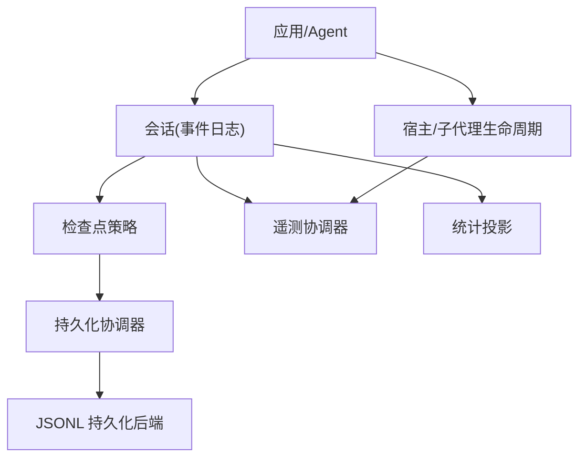
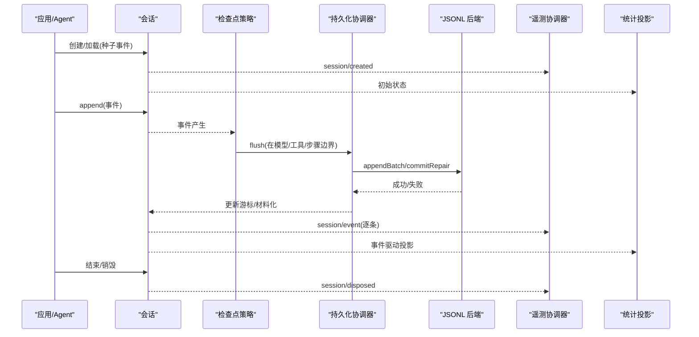
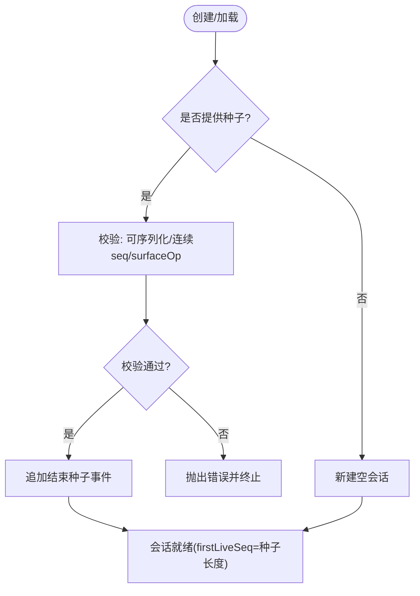
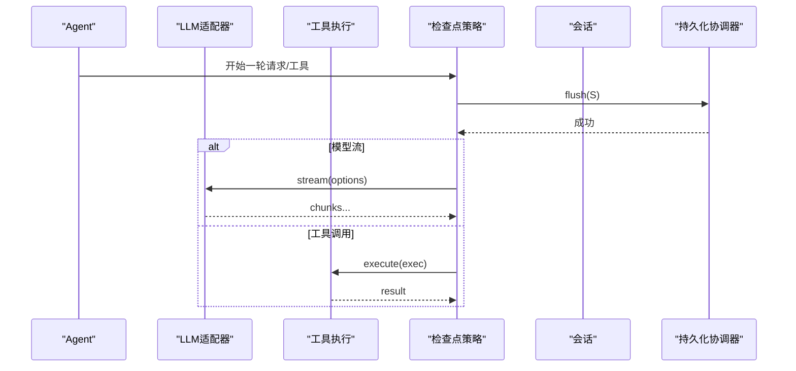
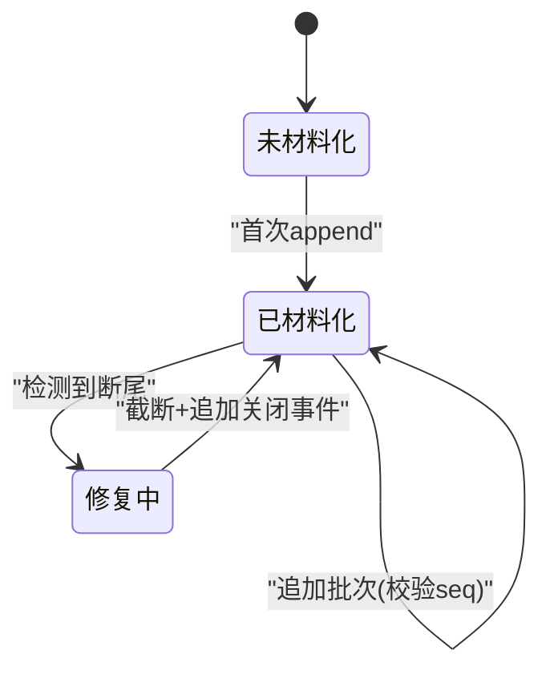
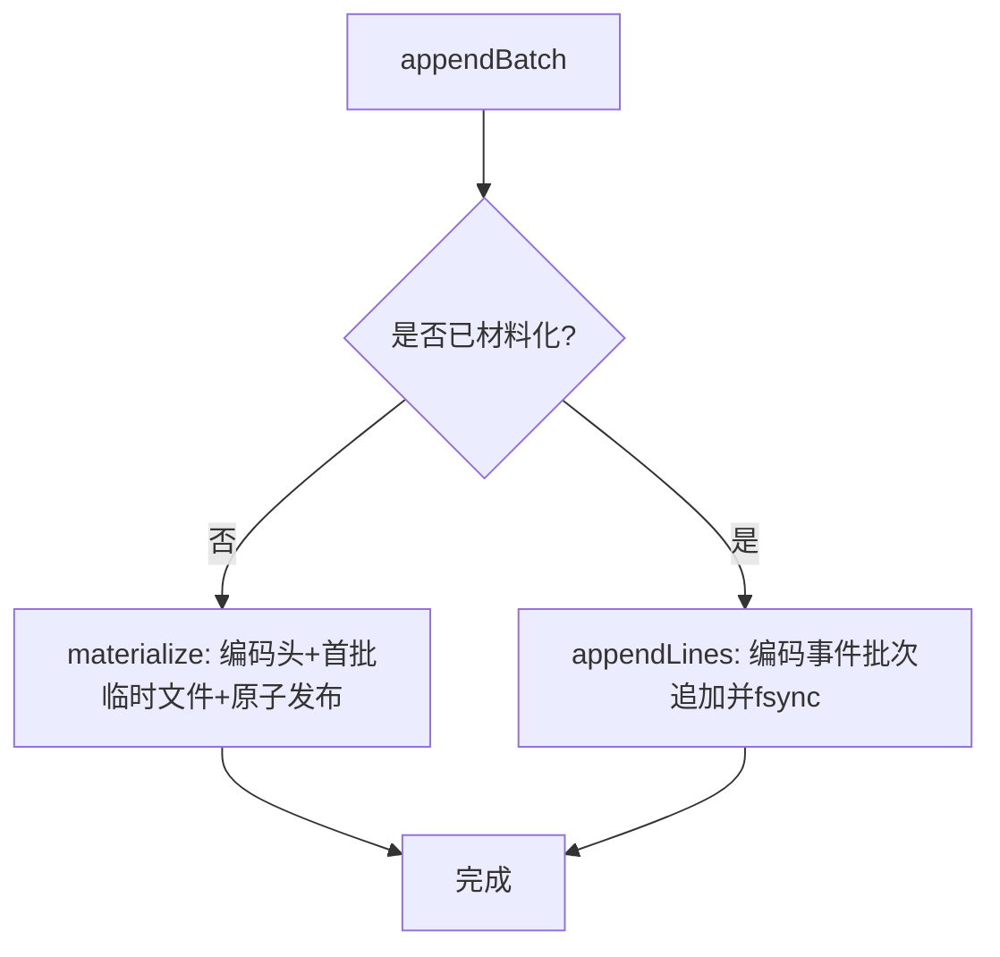
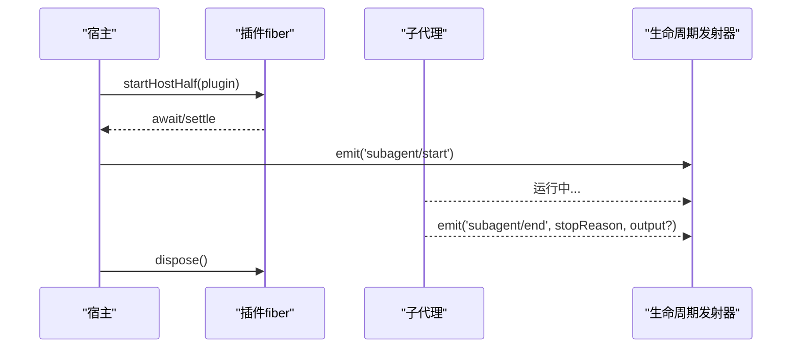
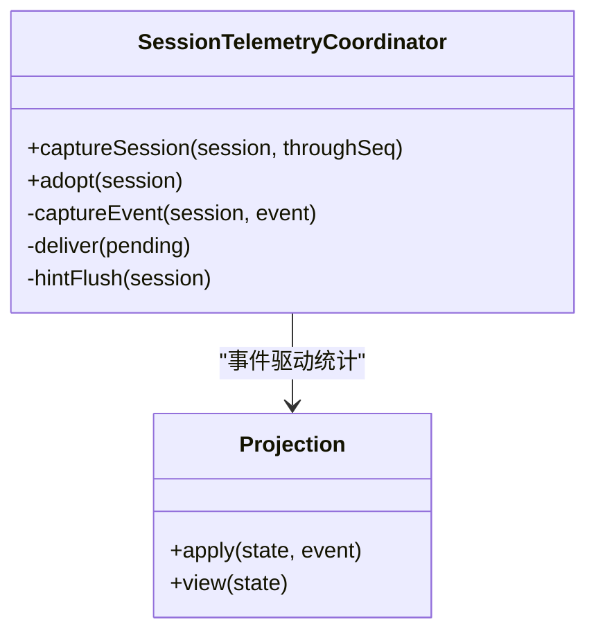
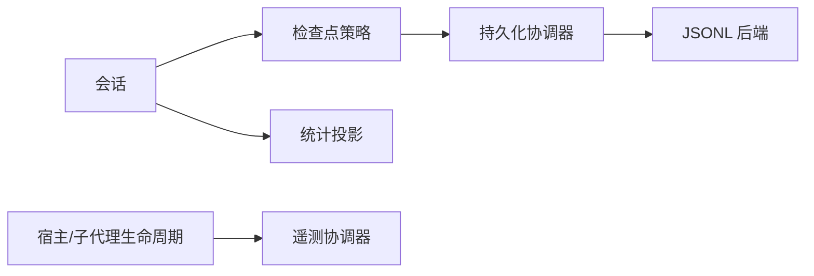

# 会话生命周期

<cite>
**本文引用的文件**
- [packages/core/session/tests/session.spec.ts](file://packages/core/session/tests/session.spec.ts)
- [packages/session/session-checkpoint-policy/src/index.ts](file://packages/session/session-checkpoint-policy/src/index.ts)
- [packages/session/session-persistence/src/coordinator.ts](file://packages/session/session-persistence/src/coordinator.ts)
- [packages/session/session-persistence-jsonl/src/index.ts](file://packages/session/session-persistence-jsonl/src/index.ts)
- [packages/extensions/cordis-host-runner/src/lifecycle.ts](file://packages/extensions/cordis-host-runner/src/lifecycle.ts)
- [packages/subagent/subagent/src/lifecycle.ts](file://packages/subagent/subagent/src/lifecycle.ts)
- [packages/session/session-telemetry/src/coordinator.ts](file://packages/session/session-telemetry/src/coordinator.ts)
- [packages/session/session-stats/src/projection.ts](file://packages/session/session-stats/src/projection.ts)
</cite>

## 目录
1. [简介](#简介)
2. [项目结构](#项目结构)
3. [核心组件](#核心组件)
4. [架构总览](#架构总览)
5. [详细组件分析](#详细组件分析)
6. [依赖关系分析](#依赖关系分析)
7. [性能考量](#性能考量)
8. [故障排查指南](#故障排查指南)
9. [结论](#结论)
10. [附录](#附录)

## 简介
本文件系统化阐述会话生命周期的管理机制，覆盖创建、初始化、运行、暂停/恢复与销毁等阶段；说明检查点策略的触发条件、数据结构与存储方式；文档化状态转换规则、异常处理与错误恢复机制；并给出配置选项、自定义扩展点以及监控调试最佳实践，帮助开发者理解与优化会话管理流程。

## 项目结构
围绕“会话”的核心实现分布在以下模块：
- 会话事件与表面视图：通过事件日志驱动消息派生，保证追加不可变性与可重放性。
- 检查点策略：在模型请求、工具调用、步骤边界进行语义检查点，确保崩溃恢复一致性。
- 持久化协调器：统一缓冲、序列化、采用、修复与处置编排，屏蔽后端差异。
- JSONL 持久化后端：以追加式文件（可选压缩）落地会话头与事件流，支持断尾修复。
- 宿主/子代理生命周期：对外暴露 start/end 生命周期边，支撑遥测与统计。
- 遥测与统计：对会话事件进行投影、脱敏与上报，提供运行时观测能力。

图表来源
- [packages/session/session-checkpoint-policy/src/index.ts:63-83](file://packages/session/session-checkpoint-policy/src/index.ts#L63-L83)
- [packages/session/session-persistence/src/coordinator.ts:588-710](file://packages/session/session-persistence/src/coordinator.ts#L588-L710)
- [packages/session/session-persistence-jsonl/src/index.ts:121-200](file://packages/session/session-persistence-jsonl/src/index.ts#L121-L200)
- [packages/session/session-telemetry/src/coordinator.ts:60-126](file://packages/session/session-telemetry/src/coordinator.ts#L60-L126)
- [packages/session/session-stats/src/projection.ts:88-184](file://packages/session/session-stats/src/projection.ts#L88-L184)
- [packages/subagent/subagent/src/lifecycle.ts:133-162](file://packages/subagent/subagent/src/lifecycle.ts#L133-L162)

章节来源
- [packages/session/session-checkpoint-policy/src/index.ts:63-83](file://packages/session/session-checkpoint-policy/src/index.ts#L63-L83)
- [packages/session/session-persistence/src/coordinator.ts:588-710](file://packages/session/session-persistence/src/coordinator.ts#L588-L710)
- [packages/session/session-persistence-jsonl/src/index.ts:121-200](file://packages/session/session-persistence-jsonl/src/index.ts#L121-L200)
- [packages/session/session-telemetry/src/coordinator.ts:60-126](file://packages/session/session-telemetry/src/coordinator.ts#L60-L126)
- [packages/session/session-stats/src/projection.ts:88-184](file://packages/session/session-stats/src/projection.ts#L88-L184)
- [packages/subagent/subagent/src/lifecycle.ts:133-162](file://packages/subagent/subagent/src/lifecycle.ts#L133-L162)

## 核心组件
- 会话事件与表面视图：通过 append 追加事件，deriveMessages 从事件日志派生用户可见的消息历史；严格校验事件数据可 JSON 序列化、seq 连续、surfaceOp 标记等。
- 检查点策略：在 llm/stream、tools/execute、agent/pre-step 三个边界执行 flush，确保请求前、工具调用前、每步开始前已落盘。
- 持久化协调器：维护 per-session 写入队列、游标、懒创建、冷读缓存、准备态与提交；负责追加批次的序列号连续性校验、旧格式迁移、断尾修复。
- JSONL 后端：按 session 维度组织目录与文件，支持 zstd 压缩、打包行、原子发布、断尾恢复、只读列表与定位。
- 宿主/子代理生命周期：对外发射 subagent/start/end 等事件，封装启动失败清理、缺失服务诊断。
- 遥测协调器：订阅 session/event、session/disposed、agent/error，投影为记录并投递到后端，支持 live/on-demand 两种捕获模式。
- 统计投影：基于 step/start→assistant/message/tool/call→tool/result/step/end 等边界计算轮次、步骤、首字延迟、解码耗时等指标。

章节来源
- [packages/core/session/tests/session.spec.ts:23-141](file://packages/core/session/tests/session.spec.ts#L23-L141)
- [packages/session/session-checkpoint-policy/src/index.ts:63-83](file://packages/session/session-checkpoint-policy/src/index.ts#L63-L83)
- [packages/session/session-persistence/src/coordinator.ts:669-710](file://packages/session/session-persistence/src/coordinator.ts#L669-L710)
- [packages/session/session-persistence-jsonl/src/index.ts:421-444](file://packages/session/session-persistence-jsonl/src/index.ts#L421-L444)
- [packages/extensions/cordis-host-runner/src/lifecycle.ts:22-45](file://packages/extensions/cordis-host-runner/src/lifecycle.ts#L22-L45)
- [packages/subagent/subagent/src/lifecycle.ts:133-162](file://packages/subagent/subagent/src/lifecycle.ts#L133-L162)
- [packages/session/session-telemetry/src/coordinator.ts:60-126](file://packages/session/session-telemetry/src/coordinator.ts#L60-L126)
- [packages/session/session-stats/src/projection.ts:88-184](file://packages/session/session-stats/src/projection.ts#L88-L184)

## 架构总览
下图展示会话从创建到销毁的关键路径：创建时注册监听与准备态；运行中通过检查点策略在关键边界落盘；持久化协调器串行化写入并维护游标；JSONL 后端负责物理落盘与修复；遥测与统计实时投影事件；子代理/宿主生命周期对外暴露运行边。

图表来源
- [packages/session/session-checkpoint-policy/src/index.ts:63-83](file://packages/session/session-checkpoint-policy/src/index.ts#L63-L83)
- [packages/session/session-persistence/src/coordinator.ts:669-710](file://packages/session/session-persistence/src/coordinator.ts#L669-L710)
- [packages/session/session-persistence-jsonl/src/index.ts:421-444](file://packages/session/session-persistence-jsonl/src/index.ts#L421-L444)
- [packages/session/session-telemetry/src/coordinator.ts:60-126](file://packages/session/session-telemetry/src/coordinator.ts#L60-L126)
- [packages/session/session-stats/src/projection.ts:88-184](file://packages/session/session-stats/src/projection.ts#L88-L184)

## 详细组件分析

### 会话创建与初始化
- 创建入口：通过 Session.create 接受会话 ID 与可选种子事件；若提供种子，会验证其可 JSON 序列化、seq 连续、surfaceOp 标记等，并在内部追加“结束种子”事件以标记冷启动边界。
- 消息派生：deriveMessages 仅从事件日志推导用户可见消息，原始 chunk 不进入历史；对注入上下文与用户消息做规范化呈现。
- 安全与不变量：拒绝非 JSON 可序列化数据、稀疏数组、循环引用、非法 surface metadata；对 seed 与 append 均做一次性快照，避免后续修改污染日志。

图表来源
- [packages/core/session/tests/session.spec.ts:116-156](file://packages/core/session/tests/session.spec.ts#L116-L156)
- [packages/core/session/tests/session.spec.ts:471-561](file://packages/core/session/tests/session.spec.ts#L471-L561)

章节来源
- [packages/core/session/tests/session.spec.ts:116-156](file://packages/core/session/tests/session.spec.ts#L116-L156)
- [packages/core/session/tests/session.spec.ts:471-561](file://packages/core/session/tests/session.spec.ts#L471-L561)

### 运行期检查点策略
- 触发时机：
  - 模型流式请求前：在 llm/stream 中先 flush 当前会话，再发起下游请求，确保请求前缀已持久化。
  - 顶级工具调用前：在 tools/execute 中先 flush，若信号已中止则返回“调度前中止”结果，阻止副作用。
  - 每步开始前：在 agent/pre-step 中 flush，确保上一步响应/结果已落盘。
- 失败策略：检查点失败即关闭下游（fail-closed），不会继续派发模型或工具副作用。

图表来源
- [packages/session/session-checkpoint-policy/src/index.ts:63-83](file://packages/session/session-checkpoint-policy/src/index.ts#L63-L83)

章节来源
- [packages/session/session-checkpoint-policy/src/index.ts:63-83](file://packages/session/session-checkpoint-policy/src/index.ts#L63-L83)

### 持久化协调器与会话状态机
- 状态要素：
  - meta：会话头（id、cwd、parentSession、seedLength 等）。
  - cursor：期望的下一个 seq（存储端日志长度）。
  - materialized：是否已创建物理工件。
  - owner：绑定到哪个活会话实例（用于冲突检测）。
- 关键操作：
  - create：注册元数据，惰性创建；若已有持久化工件则拒绝重复创建。
  - append：批量追加前校验 JSON 可序列化与 seq 连续性；首次写入原子材料化；成功后推进 cursor 并失效冷缓存。
  - prepare/load/inspect：准备态与只读视图，支持 revision 重试与外部并发写保护。
  - commitRepair：截断断尾并追加合成关闭事件，保证一致性。
- 兼容与迁移：内置对旧版 turn/start/end、steering/message、request/header-delta 等事件的迁移与拒绝逻辑。

图表来源
- [packages/session/session-persistence/src/coordinator.ts:217-252](file://packages/session/session-persistence/src/coordinator.ts#L217-L252)
- [packages/session/session-persistence/src/coordinator.ts:669-710](file://packages/session/session-persistence/src/coordinator.ts#L669-L710)
- [packages/session/session-persistence-jsonl/src/index.ts:421-444](file://packages/session/session-persistence-jsonl/src/index.ts#L421-L444)

章节来源
- [packages/session/session-persistence/src/coordinator.ts:217-252](file://packages/session/session-persistence/src/coordinator.ts#L217-L252)
- [packages/session/session-persistence/src/coordinator.ts:669-710](file://packages/session/session-persistence/src/coordinator.ts#L669-L710)
- [packages/session/session-persistence-jsonl/src/index.ts:421-444](file://packages/session/session-persistence-jsonl/src/index.ts#L421-L444)

### JSONL 后端：结构与存储
- 文件布局：每个会话一个追加式文件，包含一行头部（JSON）与若干事件行；支持 zstd 压缩与“打包行”压缩连续 chunk。
- 原子发布：首次写入使用临时文件 + link/publish 原子替换，确保幂等与防覆盖。
- 断尾恢复：解析完整帧与最后一个不完整帧，提取可恢复事件，交由协调器追加关闭事件。
- 只读能力：readRaw 返回原始文本（含压缩帧），list/readFrom 支持高效扫描与后缀读取。

图表来源
- [packages/session/session-persistence-jsonl/src/index.ts:421-444](file://packages/session/session-persistence-jsonl/src/index.ts#L421-L444)
- [packages/session/session-persistence-jsonl/src/index.ts:513-526](file://packages/session/session-persistence-jsonl/src/index.ts#L513-L526)
- [packages/session/session-persistence-jsonl/src/index.ts:651-689](file://packages/session/session-persistence-jsonl/src/index.ts#L651-L689)

章节来源
- [packages/session/session-persistence-jsonl/src/index.ts:121-200](file://packages/session/session-persistence-jsonl/src/index.ts#L121-L200)
- [packages/session/session-persistence-jsonl/src/index.ts:421-444](file://packages/session/session-persistence-jsonl/src/index.ts#L421-L444)
- [packages/session/session-persistence-jsonl/src/index.ts:513-526](file://packages/session/session-persistence-jsonl/src/index.ts#L513-L526)
- [packages/session/session-persistence-jsonl/src/index.ts:651-689](file://packages/session/session-persistence-jsonl/src/index.ts#L651-L689)

### 宿主与子代理生命周期
- 宿主半程：startHostHalf 启动受保护的插件 fiber，捕获启动失败并清理；missingServices 报告尚未满足的 inject 服务。
- 子代理运行：observeRun/createActivationObserver 在子代理生命周期边界发射 start/end，聚合最终输出与停止原因；epochStopReason 依据事件与消费工作折叠得出准确终止语义。

图表来源
- [packages/extensions/cordis-host-runner/src/lifecycle.ts:22-45](file://packages/extensions/cordis-host-runner/src/lifecycle.ts#L22-L45)
- [packages/subagent/subagent/src/lifecycle.ts:133-162](file://packages/subagent/subagent/src/lifecycle.ts#L133-L162)
- [packages/subagent/subagent/src/lifecycle.ts:175-217](file://packages/subagent/subagent/src/lifecycle.ts#L175-L217)
- [packages/subagent/subagent/src/lifecycle.ts:235-260](file://packages/subagent/subagent/src/lifecycle.ts#L235-L260)

章节来源
- [packages/extensions/cordis-host-runner/src/lifecycle.ts:22-45](file://packages/extensions/cordis-host-runner/src/lifecycle.ts#L22-L45)
- [packages/subagent/subagent/src/lifecycle.ts:133-162](file://packages/subagent/subagent/src/lifecycle.ts#L133-L162)
- [packages/subagent/subagent/src/lifecycle.ts:175-217](file://packages/subagent/subagent/src/lifecycle.ts#L175-L217)
- [packages/subagent/subagent/src/lifecycle.ts:235-260](file://packages/subagent/subagent/src/lifecycle.ts#L235-L260)

### 遥测与统计
- 遥测协调器：
  - 捕获模式：live（订阅 session/event、session/disposed、agent/error）或 on-demand（按需回放）。
  - 投影与脱敏：对 assistant/chunk 去重（每 turn:step 仅首块），生成带属性与严重级别的记录，经 waterfalls 脱敏后投递后端。
  - 关闭标记：在 session/disposed 或协调器析构时发送 shutdown 记录。
- 统计投影：
  - 指标：turns、steps、llmMs、toolMs、ttftMs、decodeMs、decodeTokens 等。
  - 边界：step/start→assistant/message 计模型时间；tool/call→tool/result 计工具时间；assistant/chunk 首 token 计 TTFT。

图表来源
- [packages/session/session-telemetry/src/coordinator.ts:60-126](file://packages/session/session-telemetry/src/coordinator.ts#L60-L126)
- [packages/session/session-telemetry/src/coordinator.ts:179-221](file://packages/session/session-telemetry/src/coordinator.ts#L179-L221)
- [packages/session/session-stats/src/projection.ts:88-184](file://packages/session/session-stats/src/projection.ts#L88-L184)

章节来源
- [packages/session/session-telemetry/src/coordinator.ts:60-126](file://packages/session/session-telemetry/src/coordinator.ts#L60-L126)
- [packages/session/session-telemetry/src/coordinator.ts:179-221](file://packages/session/session-telemetry/src/coordinator.ts#L179-L221)
- [packages/session/session-stats/src/projection.ts:88-184](file://packages/session/session-stats/src/projection.ts#L88-L184)

## 依赖关系分析
- 会话与检查点策略：会话事件驱动策略监听；策略依赖 sessions 服务进行 flush。
- 策略与持久化协调器：策略通过 ctx.sessions.flush 触发协调器的批写入。
- 协调器与 JSONL 后端：协调器调用 PersistenceBackend 接口；JSONL 实现具体文件 I/O、压缩、断尾修复。
- 生命周期与遥测：宿主/子代理生命周期发射事件，遥测协调器订阅并投影。
- 统计投影：纯函数式 fold，依赖事件顺序与边界，无副作用。

图表来源
- [packages/session/session-checkpoint-policy/src/index.ts:63-83](file://packages/session/session-checkpoint-policy/src/index.ts#L63-L83)
- [packages/session/session-persistence/src/coordinator.ts:588-710](file://packages/session/session-persistence/src/coordinator.ts#L588-L710)
- [packages/session/session-persistence-jsonl/src/index.ts:121-200](file://packages/session/session-persistence-jsonl/src/index.ts#L121-L200)
- [packages/subagent/subagent/src/lifecycle.ts:133-162](file://packages/subagent/subagent/src/lifecycle.ts#L133-L162)
- [packages/session/session-telemetry/src/coordinator.ts:60-126](file://packages/session/session-telemetry/src/coordinator.ts#L60-L126)
- [packages/session/session-stats/src/projection.ts:88-184](file://packages/session/session-stats/src/projection.ts#L88-L184)

章节来源
- [packages/session/session-checkpoint-policy/src/index.ts:63-83](file://packages/session/session-checkpoint-policy/src/index.ts#L63-L83)
- [packages/session/session-persistence/src/coordinator.ts:588-710](file://packages/session/session-persistence/src/coordinator.ts#L588-L710)
- [packages/session/session-persistence-jsonl/src/index.ts:121-200](file://packages/session/session-persistence-jsonl/src/index.ts#L121-L200)
- [packages/subagent/subagent/src/lifecycle.ts:133-162](file://packages/subagent/subagent/src/lifecycle.ts#L133-L162)
- [packages/session/session-telemetry/src/coordinator.ts:60-126](file://packages/session/session-telemetry/src/coordinator.ts#L60-L126)
- [packages/session/session-stats/src/projection.ts:88-184](file://packages/session/session-stats/src/projection.ts#L88-L184)

## 性能考量
- 批写入与延迟合并：协调器支持 writeBatchMaxDelayMs 控制批窗口，减少频繁 fsync。
- 冷读缓存：preparedSessionCacheSize 控制冷会话准备态缓存，加速 resume/load。
- 压缩与打包：JSONL 后端支持 zstd 压缩与连续 chunk 打包，显著减小日志体积。
- 流式解码分片：zstd 解码按帧 yield，避免长阻塞。
- 统计投影最小化：仅对关键边界计数，避免全量遍历开销。

[本节为通用指导，无需特定文件来源]

## 故障排查指南
- 事件校验失败：
  - 非 JSON 可序列化数据、稀疏数组、循环引用会被拒绝；请检查事件 data 与 surfaceOp。
  - 种子事件需满足连续 seq 与 surfaceOp 标记，否则构造失败。
- 版本不兼容：
  - 旧格式事件（如 request/header-delta、mode/set）将被拒绝；升级 harness 或迁移数据。
- 断尾恢复：
  - JSONL 后端在读取到不完整帧时会返回 tornMarker，协调器将截断并追加关闭事件；若反复失败，检查磁盘空间与权限。
- 启动冲突：
  - 动态插件名称冲突会提示替换前先停止旧实例；使用 missingServices 检查未满足的 inject。
- 遥测/统计异常：
  - 遥测后端失败被隔离，不影响主循环；可通过日志定位 record 投递失败。

章节来源
- [packages/core/session/tests/session.spec.ts:471-561](file://packages/core/session/tests/session.spec.ts#L471-L561)
- [packages/session/session-persistence/src/coordinator.ts:273-290](file://packages/session/session-persistence/src/coordinator.ts#L273-L290)
- [packages/session/session-persistence-jsonl/src/index.ts:310-345](file://packages/session/session-persistence-jsonl/src/index.ts#L310-L345)
- [packages/extensions/cordis-host-runner/src/lifecycle.ts:22-45](file://packages/extensions/cordis-host-runner/src/lifecycle.ts#L22-L45)
- [packages/session/session-telemetry/src/coordinator.ts:256-267](file://packages/session/session-telemetry/src/coordinator.ts#L256-L267)

## 结论
该会话生命周期以“事件日志 + 检查点 + 协调器 + 后端”的分层设计，实现了高可靠、可恢复、可扩展的会话管理。通过严格的校验与迁移、原子化的持久化、细粒度的检查点与完善的遥测统计，既保证了崩溃恢复的一致性，又提供了丰富的运行时观测能力。建议在生产环境中合理配置批写入与压缩策略，结合遥测与统计持续优化性能与稳定性。

[本节为总结，无需特定文件来源]

## 附录

### 配置选项（节选）
- JSONL 后端：
  - root：会话文件根目录（必填）。
  - packChunks：是否打包连续 chunk（默认开启）。
  - compression：物理编码 none/zstd（默认 zstd）。
  - preparedSessionCacheSize：冷会话准备态缓存大小。
  - writeBatchMaxDelayMs：批写入最大延迟窗口。
- 协调器：
  - preparedSessionCacheSize：同上，传入协调器。
  - writeBatchMaxDelayMs：同上，传入协调器。

章节来源
- [packages/session/session-persistence-jsonl/src/index.ts:59-83](file://packages/session/session-persistence-jsonl/src/index.ts#L59-L83)
- [packages/session/session-persistence-jsonl/src/index.ts:126-133](file://packages/session/session-persistence-jsonl/src/index.ts#L126-L133)
- [packages/session/session-persistence/src/coordinator.ts:84-89](file://packages/session/session-persistence/src/coordinator.ts#L84-L89)

### 自定义扩展点
- 检查点策略：通过 ctx.on('llm/stream' | 'tools/execute' | 'agent/pre-step') 插入自定义逻辑。
- 持久化后端：实现 PersistenceBackend 接口，接入协调器。
- 遥测：挂载 session-telemetry/record 水线进行脱敏；选择 live/on-demand 捕获模式。
- 统计：实现 ProjectionDefinition 对事件进行投影计算。

章节来源
- [packages/session/session-checkpoint-policy/src/index.ts:63-83](file://packages/session/session-checkpoint-policy/src/index.ts#L63-L83)
- [packages/session/session-persistence/src/coordinator.ts:117-215](file://packages/session/session-persistence/src/coordinator.ts#L117-L215)
- [packages/session/session-telemetry/src/coordinator.ts:213-215](file://packages/session/session-telemetry/src/coordinator.ts#L213-L215)
- [packages/session/session-stats/src/projection.ts:88-184](file://packages/session/session-stats/src/projection.ts#L88-L184)