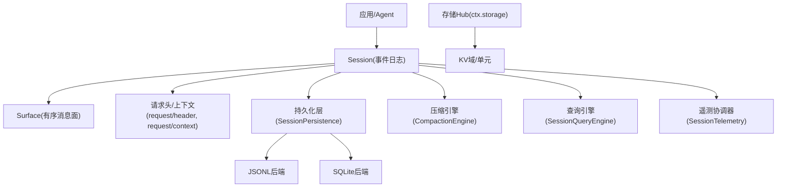
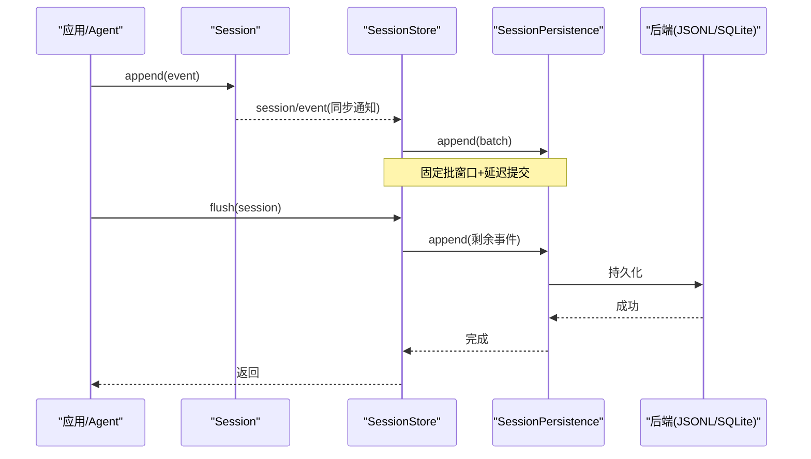
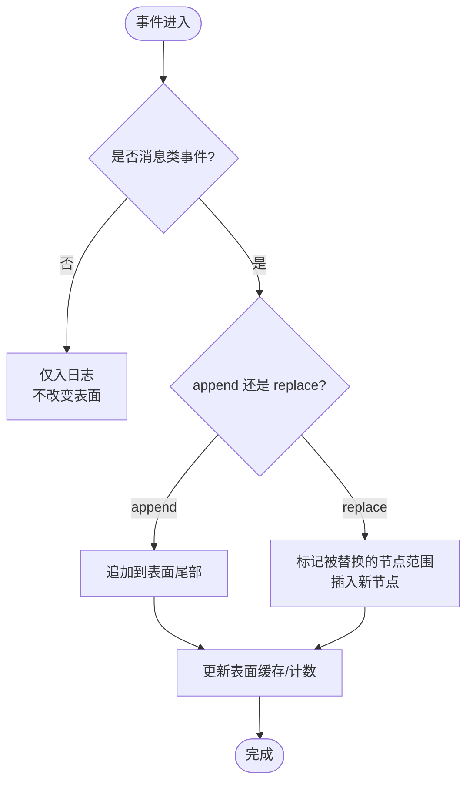
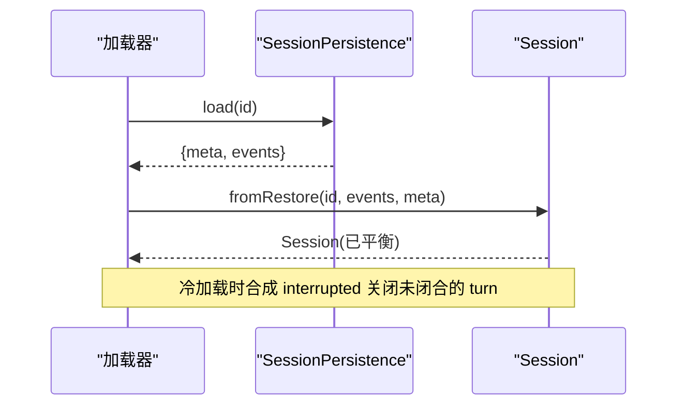
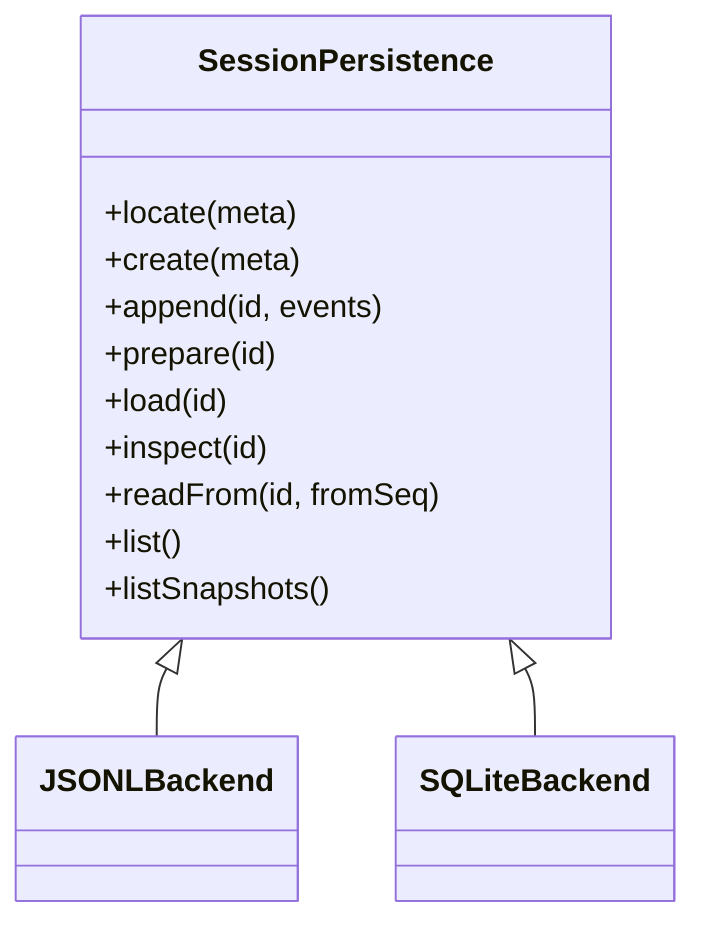
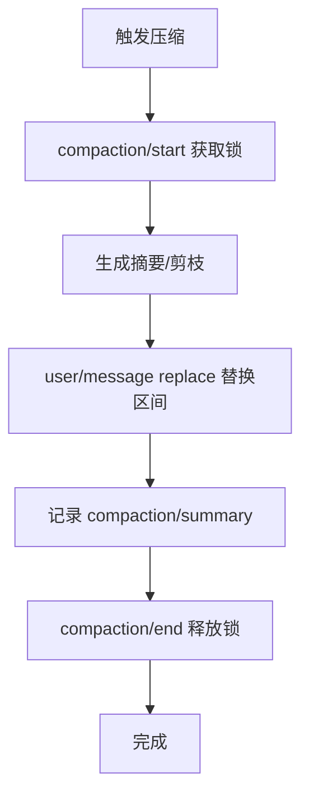
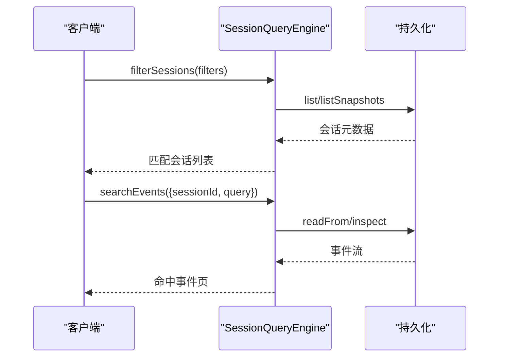
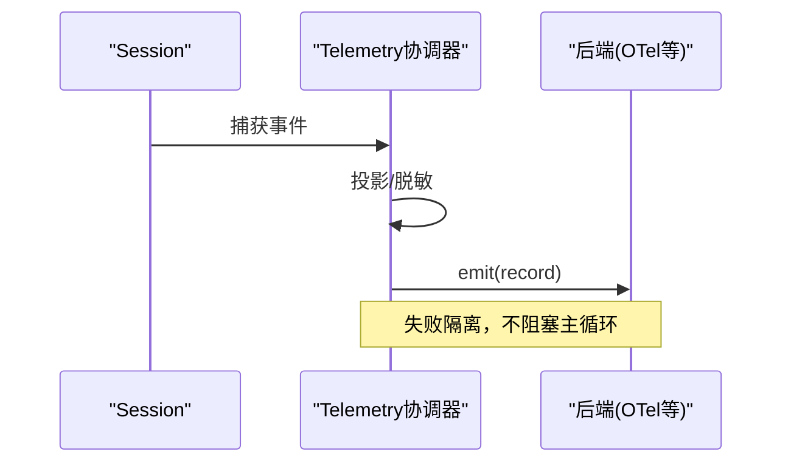
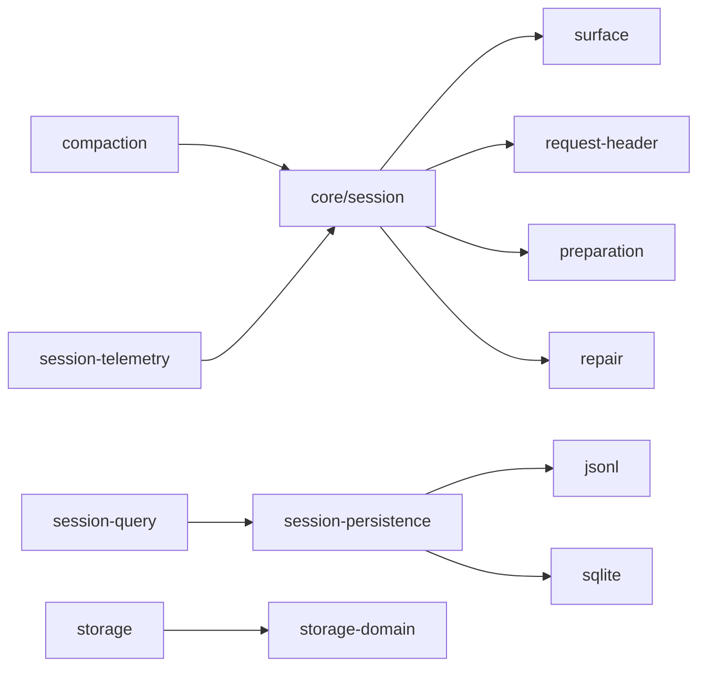

# 会话管理

<cite>
**本文引用的文件**
- [packages/core/session/src/types.ts](file://packages/core/session/src/types.ts)
- [packages/core/session/src/index.ts](file://packages/core/session/src/index.ts)
- [packages/core/session/src/surface.ts](file://packages/core/session/src/surface.ts)
- [packages/core/session/src/request-header.ts](file://packages/core/session/src/request-header.ts)
- [packages/core/session/src/preparation.ts](file://packages/core/session/src/preparation.ts)
- [packages/core/session/src/repair.ts](file://packages/core/session/src/repair.ts)
- [packages/session/session-persistence/src/index.ts](file://packages/session/session-persistence/src/index.ts)
- [packages/session/session-persistence-jsonl/src/index.ts](file://packages/session/session-persistence-jsonl/src/index.ts)
- [packages/session/session-persistence-sqlite/src/index.ts](file://packages/session/session-persistence-sqlite/src/index.ts)
- [packages/storage/storage/src/backend.ts](file://packages/storage/storage/src/backend.ts)
- [packages/storage/storage-domain/src/spec.ts](file://packages/storage/storage-domain/src/spec.ts)
- [packages/storage/storage-domain/src/events.ts](file://packages/storage/storage-domain/src/events.ts)
- [packages/compaction/compaction/src/index.ts](file://packages/compaction/compaction/src/index.ts)
- [packages/compaction/compaction-tool-result-pruner/src/index.ts](file://packages/compaction/compaction-tool-result-pruner/src/index.ts)
- [packages/session-query/session-query/src/index.ts](file://packages/session-query/session-query/src/index.ts)
- [packages/session-query/session-query/src/types.ts](file://packages/session-query/session-query/src/types.ts)
- [packages/session/session-telemetry/src/index.ts](file://packages/session/session-telemetry/src/index.ts)
- [docs/subsystems/session.md](file://docs/subsystems/session.md)
- [docs/subsystems/persistence.md](file://docs/subsystems/persistence.md)
- [docs/subsystems/storage.md](file://docs/subsystems/storage.md)
- [docs/subsystems/compaction.md](file://docs/subsystems/compaction.md)
- [docs/subsystems/session-query.md](file://docs/subsystems/session-query.md)
- [docs/subsystems/session-telemetry.md](file://docs/subsystems/session-telemetry.md)
</cite>

## 目录
1. [简介](#简介)
2. [项目结构](#项目结构)
3. [核心组件](#核心组件)
4. [架构总览](#架构总览)
5. [详细组件分析](#详细组件分析)
6. [依赖关系分析](#依赖关系分析)
7. [性能与内存优化](#性能与内存优化)
8. [故障排查指南](#故障排查指南)
9. [结论](#结论)
10. [附录：最佳实践与监控调试](#附录最佳实践与监控调试)

## 简介
本文件系统性地介绍会话（Session）管理的设计与实现，覆盖以下主题：
- 会话生命周期、状态管理与数据持久化机制
- 事件产生、传播与处理流程
- 会话恢复与重建过程
- 存储后端选择与配置、压缩与清理策略
- 会话查询与过滤、远程访问与共享
- 并发控制、数据安全与内存使用优化
- 监控与调试工具使用方法

该设计以“事件溯源”为核心：会话是仅追加的有类型事件日志，模型消息历史由日志派生；持久化负责将日志安全地落盘并支持崩溃恢复。

## 项目结构
与会话管理相关的代码与文档主要分布在以下位置：
- 核心会话定义与API：packages/core/session
- 持久化抽象与实现：packages/session/session-persistence*
- 通用存储子系统：packages/storage/*
- 压缩与清理：packages/compaction/*
- 查询与检索：packages/session-query/*
- 遥测与审计：packages/session/session-telemetry*
- 子系统文档：docs/subsystems/*

图表来源
- [packages/core/session/src/index.ts:363-519](file://packages/core/session/src/index.ts#L363-L519)
- [packages/session/session-persistence/src/index.ts:248-380](file://packages/session/session-persistence/src/index.ts#L248-L380)
- [packages/compaction/compaction/src/index.ts:130-191](file://packages/compaction/compaction/src/index.ts#L130-L191)
- [packages/session-query/session-query/src/index.ts:369-490](file://packages/session-query/session-query/src/index.ts#L369-L490)
- [packages/session/session-telemetry/src/index.ts:138-157](file://packages/session/session-telemetry/src/index.ts#L138-L157)
- [docs/subsystems/session.md:1-125](file://docs/subsystems/session.md#L1-L125)
- [docs/subsystems/persistence.md:1-20](file://docs/subsystems/persistence.md#L1-L20)

章节来源
- [docs/subsystems/session.md:1-125](file://docs/subsystems/session.md#L1-L125)
- [docs/subsystems/persistence.md:1-20](file://docs/subsystems/persistence.md#L1-L20)

## 核心组件
- Session（会话）：仅追加的事件日志，维护有序的消息表面（surface），提供 deriveMessages() 等派生能力。
- 事件体系（SessionEventMap/SessionEvent）：包含 turn/step/user/assistant/tool 等事件，以及 log-only 的 compaction/*、request/* 等。
- 持久化（SessionPersistence）：抽象服务 + JSONL/SQLite 后端，负责 append/load/inspect/readFrom/list/listSnapshots 等。
- 存储（Storage Hub）：非会话日志的通用 KV 存储，按 domain/unit 组织。
- 压缩（CompactionEngine）：对历史进行摘要压缩，替换 surface 节点，记录 compaction/* 事件。
- 查询（SessionQueryEngine）：跨会话/单会话的过滤、全文检索、血缘追踪、事件窗口读取。
- 遥测（SessionTelemetry）：捕获会话事件并转发到后端（如 OpenTelemetry），支持脱敏流水线。

章节来源
- [packages/core/session/src/types.ts:21-177](file://packages/core/session/src/types.ts#L21-L177)
- [packages/core/session/src/index.ts:363-519](file://packages/core/session/src/index.ts#L363-L519)
- [packages/session/session-persistence/src/index.ts:248-380](file://packages/session/session-persistence/src/index.ts#L248-L380)
- [packages/storage/storage/src/backend.ts:26-47](file://packages/storage/storage/src/backend.ts#L26-L47)
- [packages/compaction/compaction/src/index.ts:130-191](file://packages/compaction/compaction/src/index.ts#L130-L191)
- [packages/session-query/session-query/src/index.ts:369-490](file://packages/session-query/session-query/src/index.ts#L369-L490)
- [packages/session/session-telemetry/src/index.ts:138-157](file://packages/session/session-telemetry/src/index.ts#L138-L157)

## 架构总览
会话管理的整体架构围绕“事件溯源 + 可插拔后端”展开：
- 写入路径：调用方通过 Session.append(type, data, opts?) 追加事件；store 订阅 session/event 异步批写至持久化后端；session/flush 作为顺序与错误观察检查点。
- 读取路径：load/inspect 从后端恢复逻辑会话，必要时在冷启动时补全中断的 turn/end；readFrom 支持增量拉取；query 提供过滤与全文检索。
- 压缩路径：自动或手动触发，生成 summary 并替换 surface 区间，记录 compaction/* 事件。
- 查询路径：统一接口 list/filter/search/trace/window，屏蔽后端差异。
- 遥测路径：捕获事件并投递到后端，支持 redact 流水线。

图表来源
- [packages/core/session/src/index.ts:617-745](file://packages/core/session/src/index.ts#L617-L745)
- [packages/session/session-persistence/src/index.ts:288-323](file://packages/session/session-persistence/src/index.ts#L288-L323)
- [docs/subsystems/persistence.md:9-19](file://docs/subsystems/persistence.md#L9-L19)

章节来源
- [docs/subsystems/persistence.md:9-19](file://docs/subsystems/persistence.md#L9-L19)
- [packages/core/session/src/index.ts:617-745](file://packages/core/session/src/index.ts#L617-L745)

## 详细组件分析

### 会话事件与表面（SessionEventMap / Surface）
- 事件类型：turn/start、turn/end、step/start、step/end、user/message、assistant/chunk、assistant/message、tool/call、tool/result、todo/write、request/header、request/context、session/end-seed 等。
- 表面（Surface）：仅 user/message、assistant/message、tool/result 参与有序消息面；replace 操作可替换一段 surface 节点（用于压缩）。
- 派生历史：deriveMessages() 基于 surface 节点映射为 Message[]，缓存且深冻结，避免重复计算与外部修改。

图表来源
- [docs/subsystems/session.md:251-357](file://docs/subsystems/session.md#L251-L357)
- [packages/core/session/src/surface.ts](file://packages/core/session/src/surface.ts)

章节来源
- [docs/subsystems/session.md:9-125](file://docs/subsystems/session.md#L9-L125)
- [docs/subsystems/session.md:251-357](file://docs/subsystems/session.md#L251-L357)
- [packages/core/session/src/surface.ts](file://packages/core/session/src/surface.ts)

### 会话生命周期与恢复
- 创建：ctx.sessions.create(id?, options?) 支持 seed 与 meta，构造 SessionHeader 并进入 store。
- 准备与恢复：prepare(id, options) 接受普通创建选项或来自持久化的 RestoredSessionOptions；fromRestore 用于恢复已验证的 detached 事件与元数据。
- 恢复与修复：load/inspect 在冷加载时平衡中断的 turn，必要时合成 interrupted 结束；HMR 或 live id 场景不注入 synthetic 边界。
- 首活序列：firstLiveSeq 与 session/end-seed 区分种子历史与本次进程产生的事件。

图表来源
- [packages/core/session/src/index.ts:417-427](file://packages/core/session/src/index.ts#L417-L427)
- [packages/core/session/src/preparation.ts](file://packages/core/session/src/preparation.ts)
- [packages/core/session/src/repair.ts](file://packages/core/session/src/repair.ts)
- [docs/subsystems/persistence.md:13-19](file://docs/subsystems/persistence.md#L13-L19)

章节来源
- [packages/core/session/src/index.ts:417-427](file://packages/core/session/src/index.ts#L417-L427)
- [docs/subsystems/persistence.md:13-19](file://docs/subsystems/persistence.md#L13-L19)

### 持久化后端与格式
- 抽象接口：locate/create/append/prepare/load/inspect/readFrom/list/listSnapshots。
- 后端实现：
  - JSONL：每会话一个逻辑 JSONL 文件，默认压缩帧存储，原子写入，支持原始文本读取。
  - SQLite：每事件一行，字段与事件一一对应，无并行 schema。
- 格式拒绝：版本不匹配直接拒绝，未知必需事件拒绝而非静默跳过。
- 批写与刷新：session/event 同步通知，后台批写；session/flush 作为顺序与错误观察检查点。

图表来源
- [packages/session/session-persistence/src/index.ts:248-380](file://packages/session/session-persistence/src/index.ts#L248-L380)
- [packages/session/session-persistence-jsonl/src/index.ts](file://packages/session/session-persistence-jsonl/src/index.ts)
- [packages/session/session-persistence-sqlite/src/index.ts](file://packages/session/session-persistence-sqlite/src/index.ts)
- [docs/subsystems/persistence.md:231-237](file://docs/subsystems/persistence.md#L231-L237)

章节来源
- [docs/subsystems/persistence.md:231-237](file://docs/subsystems/persistence.md#L231-L237)
- [packages/session/session-persistence/src/index.ts:248-380](file://packages/session/session-persistence/src/index.ts#L248-L380)

### 压缩与清理（Compaction）
- 事件：compaction/start、compaction/summary、compaction/end 为 log-only，summary 通过 user/message 的 replace 操作替换 surface 区间。
- 触发：压力（pressure）、上下文溢出（context-overflow）、手动 compactNow、指定区域 compactRegion。
- 结果：返回 compactionId、start/summary/end seq、summary 内容、被替换的 range 与 seqs、token 估算。
- 工具结果剪枝：可选 pruner 减少大 tool result 的体积，保留 rich-block 顺序。

图表来源
- [docs/subsystems/compaction.md:9-23](file://docs/subsystems/compaction.md#L9-L23)
- [packages/compaction/compaction/src/index.ts:130-191](file://packages/compaction/compaction/src/index.ts#L130-L191)
- [packages/compaction/compaction-tool-result-pruner/src/index.ts:203-233](file://packages/compaction/compaction-tool-result-pruner/src/index.ts#L203-L233)

章节来源
- [docs/subsystems/compaction.md:9-23](file://docs/subsystems/compaction.md#L9-L23)
- [packages/compaction/compaction/src/index.ts:130-191](file://packages/compaction/compaction/src/index.ts#L130-L191)
- [packages/compaction/compaction-tool-result-pruner/src/index.ts:203-233](file://packages/compaction/compaction-tool-result-pruner/src/index.ts#L203-L233)

### 查询与过滤（Session Query）
- 过滤器：会话级（id、cwd、created-at、parent、availability）与事件级（seq、time、type、surface、text）组合 AND/OR。
- 全文检索：searchSessions、searchEvents，支持游标分页。
- 血缘与关系：traceSession 追溯祖先/后代；traceEvent 追踪替换链与源事件引用。
- 窗口读取：readEvent 返回目标事件及前后上下文。

图表来源
- [docs/subsystems/session-query.md:103-218](file://docs/subsystems/session-query.md#L103-L218)
- [packages/session-query/session-query/src/index.ts:369-490](file://packages/session-query/session-query/src/index.ts#L369-L490)

章节来源
- [docs/subsystems/session-query.md:103-218](file://docs/subsystems/session-query.md#L103-L218)
- [packages/session-query/session-query/src/index.ts:369-490](file://packages/session-query/session-query/src/index.ts#L369-L490)

### 遥测与审计（Session Telemetry）
- 记录：将会话事件映射为 SessionTelemetryRecord，channel 分为 ledger（对应日志）与 ops（操作信号）。
- 后端：emit/shutdown 最小契约，flush 可选；支持 sharing 披露策略。
- 脱敏：session-telemetry/record 瀑布式监听，仅影响导出副本，不改写原始日志。

图表来源
- [docs/subsystems/session-telemetry.md:9-58](file://docs/subsystems/session-telemetry.md#L9-L58)
- [packages/session/session-telemetry/src/index.ts:138-157](file://packages/session/session-telemetry/src/index.ts#L138-L157)

章节来源
- [docs/subsystems/session-telemetry.md:9-58](file://docs/subsystems/session-telemetry.md#L9-L58)
- [packages/session/session-telemetry/src/index.ts:138-157](file://packages/session/session-telemetry/src/index.ts#L138-L157)

## 依赖关系分析
- Session 依赖 surface、request-header 等内部模块，维护消息面与请求头折叠。
- 持久化层解耦于具体介质，JSONL/SQLite 实现同一契约。
- 压缩引擎依赖 Session 与 LLM 能力，产出 summary 并通过 surface replace 落地。
- 查询引擎屏蔽后端差异，提供一致 API。
- 存储子系统为其他非会话数据提供 KV 能力，与会话日志分离。

图表来源
- [packages/core/session/src/index.ts](file://packages/core/session/src/index.ts)
- [packages/session/session-persistence/src/index.ts](file://packages/session/session-persistence/src/index.ts)
- [packages/compaction/compaction/src/index.ts](file://packages/compaction/compaction/src/index.ts)
- [packages/session-query/session-query/src/index.ts](file://packages/session-query/session-query/src/index.ts)
- [packages/storage/storage/src/backend.ts](file://packages/storage/storage/src/backend.ts)

章节来源
- [packages/core/session/src/index.ts](file://packages/core/session/src/index.ts)
- [packages/session/session-persistence/src/index.ts](file://packages/session/session-persistence/src/index.ts)
- [packages/storage/storage/src/backend.ts](file://packages/storage/storage/src/backend.ts)

## 性能与内存优化
- 批写与刷新：session/event 同步通知，后台固定窗口批写；session/flush 作为检查点，避免阻塞主循环。
- 表面缓存：deriveMessages() 首次投影后缓存，replace 时重建，降低重复计算。
- 压缩与剪枝：自动/手动压缩减少历史体积；可选工具结果剪枝降低大输出占用。
- 后端选择：JSONL 适合人类可读与原始文本需求；SQLite 适合频繁更新与随机访问。
- 版本与拒绝：格式版本严格拒绝，避免迁移成本与误读风险。

[本节为通用指导，无需特定文件来源]

## 故障排查指南
- 格式不支持：当后端检测到版本不匹配或无法解释的事件类型时，抛出明确错误（升级方向或构建不支持）。
- 损坏与恢复：冷加载时若发现未闭合的 turn，会合成 interrupted 结束；已提交的前缀不会被截断。
- 批写失败：后台写入失败会保留事件并暂停自动重试；显式 flush 立即重试并通过 agent/error 与日志报告。
- 查询失败：提供稳定错误码分类（无效参数、索引失败、源冲突等），便于定位问题。
- 遥测失败：emit 抛错被隔离并记录，不影响主循环；shutdown 确保队列排空。

章节来源
- [docs/subsystems/persistence.md:92-99](file://docs/subsystems/persistence.md#L92-L99)
- [docs/subsystems/persistence.md:13-19](file://docs/subsystems/persistence.md#L13-L19)
- [docs/subsystems/session-query.md:333-357](file://docs/subsystems/session-query.md#L333-L357)
- [docs/subsystems/session-telemetry.md:124-127](file://docs/subsystems/session-telemetry.md#L124-L127)

## 结论
会话管理系统以事件溯源为基础，结合可插拔持久化、压缩、查询与遥测，提供了高内聚、低耦合、可扩展的会话管理能力。其设计强调：
- 不可变日志与派生视图分离
- 明确的批写与刷新检查点
- 崩溃恢复与格式拒绝策略
- 统一的查询与血缘追踪
- 灵活的遥测与脱敏

这些特性共同保障了会话在复杂工作负载下的可靠性、可观测性与可维护性。

[本节为总结，无需特定文件来源]

## 附录：最佳实践与监控调试

### 会话生命周期与状态管理
- 使用 ctx.sessions.create/prepare/enter/announce 管理会话生命周期，确保发布钩子与存储挂载顺序正确。
- 通过 firstLiveSeq 与 session/end-seed 区分种子历史与本次进程事件。
- 在 turn 边界进行 checkpoint 与 flush，保证一致性。

章节来源
- [packages/core/session/src/index.ts:617-745](file://packages/core/session/src/index.ts#L617-L745)
- [docs/subsystems/session.md:583-591](file://docs/subsystems/session.md#L583-L591)

### 数据持久化与恢复
- 选择 JSONL 或 SQLite 后端，依据读写模式与可移植性需求。
- 利用 inspect 进行只读检查，prepare/load 进行恢复与发布。
- 关注格式版本与事件完整性，避免未知必需事件导致恢复失败。

章节来源
- [docs/subsystems/persistence.md:231-237](file://docs/subsystems/persistence.md#L231-L237)
- [packages/session/session-persistence/src/index.ts:298-323](file://packages/session/session-persistence/src/index.ts#L298-L323)

### 压缩与清理策略
- 启用自动压缩（pressure/context-overflow）与手动压缩（compactNow/compactRegion）。
- 配合工具结果剪枝减少大输出占用。
- 关注 compaction/* 事件，确保锁与替换区间正确。

章节来源
- [docs/subsystems/compaction.md:60-88](file://docs/subsystems/compaction.md#L60-L88)
- [packages/compaction/compaction-tool-result-pruner/src/index.ts:203-233](file://packages/compaction/compaction-tool-result-pruner/src/index.ts#L203-L233)

### 查询与过滤
- 使用 filterSessions/filterEvents 进行精确筛选；searchSessions/searchEvents 进行全文检索。
- 利用 traceSession/traceEvent 进行血缘与关系分析。
- 使用 readEvent 获取事件窗口，辅助调试。

章节来源
- [docs/subsystems/session-query.md:103-218](file://docs/subsystems/session-query.md#L103-L218)
- [packages/session-query/session-query/src/index.ts:369-490](file://packages/session-query/session-query/src/index.ts#L369-L490)

### 远程访问与共享
- 会话本身为本地对象，但可通过持久化后端暴露 artifact（JSONL 路径）供外部读取。
- 遥测后端可披露共享策略（full/feedback-only/disabled），用于前端提示。
- 查询引擎屏蔽后端差异，便于上层聚合展示。

章节来源
- [docs/subsystems/persistence.md:21-24](file://docs/subsystems/persistence.md#L21-L24)
- [docs/subsystems/session-telemetry.md:59-72](file://docs/subsystems/session-telemetry.md#L59-L72)

### 并发控制与数据安全
- 批写与 flush 保证顺序与错误可见性；listener 失败隔离。
- 事件数据必须 JSON 可序列化，append 时校验，防止非法数据进入日志。
- 遥测脱敏仅影响导出副本，不改动原始日志。

章节来源
- [docs/subsystems/persistence.md:9-19](file://docs/subsystems/persistence.md#L9-L19)
- [docs/subsystems/session.md:601-605](file://docs/subsystems/session.md#L601-L605)
- [docs/subsystems/session-telemetry.md:124-127](file://docs/subsystems/session-telemetry.md#L124-L127)

### 监控与调试工具
- 使用 session/created、session/disposed 观察会话生命周期。
- 使用 session/event 与 session/flush 观察写入与检查点。
- 使用 query 的 trace 与 window 功能定位事件关系与上下文。
- 使用遥测流水线的 record 监听进行脱敏与自定义上报。

章节来源
- [packages/core/session/src/index.ts:751-800](file://packages/core/session/src/index.ts#L751-L800)
- [docs/subsystems/session-query.md:259-331](file://docs/subsystems/session-query.md#L259-L331)
- [docs/subsystems/session-telemetry.md:161-191](file://docs/subsystems/session-telemetry.md#L161-L191)