# 会��测

<cite>
**本文引用的文件**
- [packages/session/session-telemetry/src/index.ts](file://packages/session/session-telemetry/src/index.ts)
- [packages/session/session-telemetry/src/coordinator.ts](file://packages/session/session-telemetry/src/coordinator.ts)
- [packages/session/session-telemetry/README.md](file://packages/session/session-telemetry/README.md)
- [packages/session/session-telemetry-otel/src/index.ts](file://packages/session/session-telemetry-otel/src/index.ts)
- [packages/session/session-telemetry-otel/README.md](file://packages/session/session-telemetry-otel/README.md)
- [apps/cli/src/profile-boot.ts](file://apps/cli/src/profile-boot.ts)
- [examples/headless-agent/tests/fixtures/session-telemetry-otel.cordis.yml](file://examples/headless-agent/tests/fixtures/session-telemetry-otel.cordis.yml)
</cite>

## 目录
1. [简介](#简介)
2. [项目结�](#项目结�)
3. [核心组件](#核心组件)
4. [��总览](#��总览)
5. [详细组件分�](#详细组件分�)
6. [�赖关系分�](#�赖关系分�)
7. [性能考�](#性能考�)
8. [故障�除指�](#故障�除指�)
9. [结论](#结论)
10. [附录](#附录)

## 简介
本文件全�介� DeepSeek Harness 的“会��测�能力：�采集点�数�格��处��传输�程，到 OpenTelemetry 集��数�脱��安全机制��测�调器�责（������性能优化），以��置自定义��障方法。系统以“能力���方�将采集侧��端导出解耦：采集侧负责事件投影�逻辑记录�建�水��脱��最��端契约；OTel �端仅负责将记录�入 OTLP 日志管线，批处���试�队列�丢失策略由 SDK 决定。

## 项目结�
- 采集契约��调器：�� session-telemetry 包，定义逻辑记录��端�����模�（�时/按需）�手递游标等。
- OTel �端��：�� session-telemetry-otel 包，基� OTel JS SDK 的 LoggerProvider + BatchLogRecordProcessor + OTLP/HTTP 导出器，映射记录并管�生命周期关闭。
- CLI �动开关：通过�境���制�测行是��用，便�在�动层统一开关�测。
- 示例�置：headless 测试用 cordis �置演示如何挂载�测�件�自定义脱�规则。

```mermaid
graph TB
A["会�事件�<br/>session/event"] --> B["�调器<br/>SessionTelemetryCoordinator"]
B --> C["脱�水�<br/>session-telemetry/record"]
C --> D["�端��<br/>SessionTelemetrySink.emit"]
D --> E["OTel �端<br/>OpenTelemetrySessionBackend"]
E --> F["LoggerProvider<br/>BatchLogRecordProcessor"]
F --> G["OTLP/HTTP 导出器"]
```

图表��
- [packages/session/session-telemetry/src/coordinator.ts:74-126](file://packages/session/session-telemetry/src/coordinator.ts#L74-L126)
- [packages/session/session-telemetry/src/index.ts:148-176](file://packages/session/session-telemetry/src/index.ts#L148-L176)
- [packages/session/session-telemetry-otel/src/index.ts:197-236](file://packages/session/session-telemetry-otel/src/index.ts#L197-L236)

章节��
- [packages/session/session-telemetry/README.md:1-50](file://packages/session/session-telemetry/README.md#L1-L50)
- [packages/session/session-telemetry-otel/README.md:1-57](file://packages/session/session-telemetry-otel/README.md#L1-L57)

## 核心组件
- 逻辑记录�会�共享状�
  - 逻辑记录包�通�（ledger/ops）�时间戳�预映射严�级别�最�身份�性�完整负载体。
  - 共享状�声�了部署选择的分享策略（full / feedback-only / disabled），用��用户界�披露。
- �端契约
  - emit：�阻�入队，必须�步调用�阻�主循�。
  - flush：�选�示，多数�端���，交由 SDK 批处�节�。
  - shutdown：等待�端管线�默，失败被包容且�影�应用销�。
- �调器
  - 支� live � on-demand 两���模�。
  - 维护�会�的手递游标� chunk ��集�，确�����个 turn/step 的首个 chunk。
  - 将 agent/error 总线事件中继为 ops 记录。
- OTel �端
  - �造 LoggerProvider�BatchLogRecordProcessor�OTLP/HTTP 导出器。
  - 将逻辑记录映射为 OTel 日志�目，按 channel 分��� instrumentation scope。
  - �供 mode 选择�严格的�数校验�关闭超时�护。

章节��
- [packages/session/session-telemetry/src/index.ts:47-176](file://packages/session/session-telemetry/src/index.ts#L47-L176)
- [packages/session/session-telemetry/src/coordinator.ts:22-126](file://packages/session/session-telemetry/src/coordinator.ts#L22-L126)
- [packages/session/session-telemetry-otel/src/index.ts:43-128](file://packages/session/session-telemetry-otel/src/index.ts#L43-L128)

## ��总览
下图展示了�会�事件到 OTLP 导出的端到端�程，包括���投影�脱��分��导出。

```mermaid
sequenceDiagram
participant S as "会�"
participant C as "�调器"
participant W as "脱�水�"
participant B as "�端(OTel)"
participant P as "LoggerProvider"
participant X as "OTLP导出器"
S->>C : "session/event"
C->>C : "固定chunk投影/��"
C->>W : "记录(�attributes/body)"
W-->>C : "脱��记录"
C->>B : "emit(record)"
B->>P : "logger.emit()"
P->>X : "批�导出"
Note over C,B : "flush()为�选�示，通常���"
```

图表��
- [packages/session/session-telemetry/src/coordinator.ts:179-226](file://packages/session/session-telemetry/src/coordinator.ts#L179-L226)
- [packages/session/session-telemetry-otel/src/index.ts:219-236](file://packages/session/session-telemetry-otel/src/index.ts#L219-L236)

## 详细组件分�

### �调器（SessionTelemetryCoordinator）
- �责
  - 订阅会�事件�关键生命周期事件，完� adoption�project�redact�deliver。
  - 维护 per-session 的 chunk ��集�� handoff cursor，�� at-most-once 语义。
  - 将 agent/error 总线事件转�为 ops 记录。
  - 支� on-demand �放：仅在�馈触�时读�规范日志�缀进行��。
- 关键�程
  - ��事件：assistant/chunk 仅首�通过；其他事件�样传递。
  - 严�级别映射：tool/result.isError 或 turn/end 错误�因映射为 error，其余 info。
  - 身份�性：session.id�event.type�event.seq，以��选 cwd�parent_id�seed_length。
  - 关闭路径：在 fiber 销�阶段为�存活会��出 shutdown 标记，�调用�端 shutdown。

```mermaid
flowchart TD
Start(["进入 captureEvent"]) --> CheckChunk{"是� assistant/chunk?"}
CheckChunk --> |是| Dedup{"是�已�该 turn:step?"}
Dedup --> |是| Drop["丢弃���"]
Dedup --> |�| Build["�建逻辑记录<br/>channel=ledger, attributes, body"]
CheckChunk --> |�| Build
Build --> Redact["�行脱�水�"]
Redact --> Deliver["emit(record) 并�进游标"]
Deliver --> End(["返�"])
```

图表��
- [packages/session/session-telemetry/src/coordinator.ts:179-226](file://packages/session/session-telemetry/src/coordinator.ts#L179-L226)
- [packages/session/session-telemetry/src/coordinator.ts:284-319](file://packages/session/session-telemetry/src/coordinator.ts#L284-L319)

章节��
- [packages/session/session-telemetry/src/coordinator.ts:60-126](file://packages/session/session-telemetry/src/coordinator.ts#L60-L126)
- [packages/session/session-telemetry/src/coordinator.ts:179-226](file://packages/session/session-telemetry/src/coordinator.ts#L179-L226)
- [packages/session/session-telemetry/src/coordinator.ts:284-319](file://packages/session/session-telemetry/src/coordinator.ts#L284-L319)

### �端契约�共享状�（SessionTelemetryBackend/Sink）
- 契约
  - emit：�阻�入队，异常被�调器包容。
  - flush：�选，fire-and-forget，多数�端���。
  - shutdown：等待�端管线�默，失败仅告警。
- 共享状�
  - sharing：full / feedback-only / disabled，供 UI 披露当�分享策略。

章节��
- [packages/session/session-telemetry/src/index.ts:89-176](file://packages/session/session-telemetry/src/index.ts#L89-L176)

### OTel �端（OpenTelemetrySessionBackend）
- �责
  - 根� mode 选择行为：FULL �时导出；FEEDBACK_ONLY 仅在�馈事件�放；DISABLED 本地�留。
  - �造 OTel 资�（service.name/version�user.id），创建两个 logger（ledger/ops）。
  - 严格校验 exporter.url�processor.maxExportBatchSize�shutdownTimeoutMillis。
  - 关闭时带超时�护，�� transport 挂起导致进程无法退出。
- 字段映射
  - time → timestamp/observedTimestamp
  - severity → severityNumber/severityText
  - body/attributes é€�ä¼
- 安全���
  - 凭��出�在会�事件中，因此�会��测泄露。
  - 脱�由水�规则负责；默认无内置规则，需部署方挂载。

```mermaid
classDiagram
class SessionTelemetryBackend {
+sharing : string
+emit(record) : void
+flush() : void?
+shutdown() : Promise<void>
}
class OpenTelemetrySessionBackend {
-provider : LoggerProvider?
-directEmit : function
-shutdownTimeoutMillis : number
+emit(record) : void
+shutdown() : Promise<void>
}
class SessionTelemetryCoordinator {
+captureSession(session, throughSeq?) : void
}
SessionTelemetryBackend <|-- OpenTelemetrySessionBackend
OpenTelemetrySessionBackend --> SessionTelemetryCoordinator : "组�(模�相关)"
```

图表��
- [packages/session/session-telemetry/src/index.ts:148-176](file://packages/session/session-telemetry/src/index.ts#L148-L176)
- [packages/session/session-telemetry-otel/src/index.ts:147-236](file://packages/session/session-telemetry-otel/src/index.ts#L147-L236)

章节��
- [packages/session/session-telemetry-otel/src/index.ts:147-299](file://packages/session/session-telemetry-otel/src/index.ts#L147-L299)
- [packages/session/session-telemetry-otel/README.md:1-57](file://packages/session/session-telemetry-otel/README.md#L1-L57)

### 脱�水�（session-telemetry/record）
- 扩展点：部署�挂载监�器对 outbound 记录进行转�或替�；未挂载则�传。
- 执行时机：live 模�在 append 时；on-demand 模�在�放规范日志时。
- 安全性：仅作用�导出副本，�修改规范日志；抛出异常的监�器会丢弃该�记录（fail-closed）。

章节��
- [packages/session/session-telemetry/src/index.ts:24-44](file://packages/session/session-telemetry/src/index.ts#L24-L44)
- [packages/session/session-telemetry/src/coordinator.ts:205-215](file://packages/session/session-telemetry/src/coordinator.ts#L205-L215)
- [packages/session/session-telemetry/README.md:21-24](file://packages/session/session-telemetry/README.md#L21-L24)

### 指标采集点�数�格�
- 采集点
  - session/event：所有会�事件（助手消��工具结��turn 开始/结�等）。
  - agent/error：通过总线中继为 ops 记录。
  - 生命周期：session/disposed ��调器销�阶段输出 shutdown 标记。
- 数�格�
  - channel：ledger（镜�会�日志）或 ops（�作信�）。
  - time：Unix 毫秒时间戳。
  - severity：info/warn/error（error �自 tool/result.isError�turn/end 错误�因�agent-error）。
  - attributes：最�身份�性（session.id�event.type�event.seq ��选 header 信�）。
  - body：完整 event.data 深拷�（或 op payload）。

章节��
- [packages/session/session-telemetry/src/index.ts:47-87](file://packages/session/session-telemetry/src/index.ts#L47-L87)
- [packages/session/session-telemetry/src/coordinator.ts:284-319](file://packages/session/session-telemetry/src/coordinator.ts#L284-L319)
- [packages/session/session-telemetry/README.md:33-36](file://packages/session/session-telemetry/README.md#L33-L36)

### �测�调器的作用（������性能优化）
- ��：将多�事件（会�事件�agent/error�生命周期）统一为逻辑记录。
- ��：固定 chunk 投影，仅首个 assistant/chunk 通过；手递游标����。
- 性能：
  - ��路径零 I/O，仅内存�作�结�化克隆。
  - flush 为�选�示，��阻�主循�。
  - on-demand 模��少常驻监��内存�用。

章节��
- [packages/session/session-telemetry/src/coordinator.ts:60-126](file://packages/session/session-telemetry/src/coordinator.ts#L60-L126)
- [packages/session/session-telemetry/src/coordinator.ts:172-226](file://packages/session/session-telemetry/src/coordinator.ts#L172-L226)
- [packages/session/session-telemetry/README.md:17-20](file://packages/session/session-telemetry/README.md#L17-L20)

### OpenTelemetry 集��导出
- 集��点
  - LoggerProvider + BatchLogRecordProcessor + OTLP/HTTP 导出器。
  - 资��性：service.name/version�user.id（匿� ID）。
  - � scope：ledger � ops 分别使用�� logger。
- 导出目标
  - 通过 exporter.url 指定 OTLP 日志端点；headers�timeout�compression 等�传给 SDK。
- 关闭�护
  - shutdownTimeoutMillis �制 provider.shutdown 等待时间，�� transport 挂死。

章节��
- [packages/session/session-telemetry-otel/src/index.ts:197-236](file://packages/session/session-telemetry-otel/src/index.ts#L197-L236)
- [packages/session/session-telemetry-otel/src/index.ts:274-299](file://packages/session/session-telemetry-otel/src/index.ts#L274-L299)
- [packages/session/session-telemetry-otel/README.md:34-42](file://packages/session/session-telemetry-otel/README.md#L34-L42)

### 数�脱��安全处�机制
- 默认无内置规则：未挂载监�器时，导出内容��始��副本。
- 部署方责任：在 session-telemetry/record 水�挂载脱�规则，过滤�感字段。
- 凭�隔离：模�凭��在会�事件中，�会��测泄露。
- �馈模�下的快照：FEEDBACK_ONLY ��留�测副本，仅在�馈时�放规范日志并按当时规则脱�。

章节��
- [packages/session/session-telemetry/README.md:21-24](file://packages/session/session-telemetry/README.md#L21-L24)
- [packages/session/session-telemetry/README.md:45-50](file://packages/session/session-telemetry/README.md#L45-L50)
- [packages/session/session-telemetry-otel/README.md:36-39](file://packages/session/session-telemetry-otel/README.md#L36-L39)

### �测�置的自定义指�
- 模�选择
  - FULL：�时导出全部记录。
  - FEEDBACK_ONLY：仅在记录�馈时�放并导出�缀。
  - DISABLED：默认，��造 SDK 管线，本地�留。
- 导出器�置
  - exporter.url：必需（除 DISABLED），必须为 http(s)。
  - 其他字段（headers�timeout�compression 等）�传给 SDK。
- 处�器�置
  - processor：�传给 BatchLogRecordProcessor；maxExportBatchSize 必须为正整数。
- 关闭超时
  - shutdownTimeoutMillis：正有�数，默认 3000ms。
- CLI �动开关
  - 通过�境�� DSH_TELEMETRY_DISABLED 注入补��用�测行。

章节��
- [packages/session/session-telemetry-otel/README.md:7-34](file://packages/session/session-telemetry-otel/README.md#L7-L34)
- [examples/headless-agent/tests/fixtures/session-telemetry-otel.cordis.yml:26-32](file://examples/headless-agent/tests/fixtures/session-telemetry-otel.cordis.yml#L26-L32)
- [apps/cli/src/profile-boot.ts:56-77](file://apps/cli/src/profile-boot.ts#L56-L77)
- [apps/cli/src/profile-boot.ts:168-169](file://apps/cli/src/profile-boot.ts#L168-L169)

## �赖关系分�
- 耦��内�
  - �调器��端通过最�契约�耦�；�端�替�（如未�其他导出器）。
  - OTel �端仅关注映射�生命周期，�关心��细节。
- 外部�赖
  - OTel JS SDK（sdk-logs�exporter-logs-otlp-http�resources）。
  - 匿�用户 ID（dsh-anonymous-user-id）。
- 潜在循��赖
  - 通过 Service 注册� Context 注入��直�循�；�调器由�端�造，���引用�端内部��。

```mermaid
graph LR
Coord["�调器"] --> Sink["�端��"]
Sink --> OTel["OTel �端"]
OTel --> SDK["OTel SDK"]
OTel --> Res["资�(user.id)"]
```

图表��
- [packages/session/session-telemetry/src/coordinator.ts:60-126](file://packages/session/session-telemetry/src/coordinator.ts#L60-L126)
- [packages/session/session-telemetry-otel/src/index.ts:197-236](file://packages/session/session-telemetry-otel/src/index.ts#L197-L236)

章节��
- [packages/session/session-telemetry/src/index.ts:148-176](file://packages/session/session-telemetry/src/index.ts#L148-L176)
- [packages/session/session-telemetry-otel/src/index.ts:147-236](file://packages/session/session-telemetry-otel/src/index.ts#L147-L236)

## 性能考�
- ��路径零 I/O：仅内存�作�结�化克隆，��阻�主循�。
- 固定 chunk 投影：大幅����输出的冗余数��。
- 批处��导出节�：由 SDK 的 BatchLogRecordProcessor �制，�通过 processor.scheduledDelayMillis 等调优。
- 关闭超时：防止 transport 挂起拖慢进程退出。

[本节为通用指导，�直�分�具体文件]

## 故障�除指�
- 常�问题
  - exporter.url 缺失或�议�法：加载时报错，检查 URL 是�为 http(s)。
  - maxExportBatchSize �正整数：加载时报错，修正为正整数。
  - shutdown 超时：若超过 shutdownTimeoutMillis，provider.shutdown 将被放弃，�能丢失尾部记录。
  - �馈模�下无导出：确认 mode � DISABLED，且存在 feedback/record 事件触��放。
- 定�建议
  - �用 console 日志观察警告信�。
  - 检查是�挂载了 session-telemetry/record 监�器（影�脱�）。
  - 核对 CLI �境�� DSH_TELEMETRY_DISABLED 是��外�用了�测。

章节��
- [packages/session/session-telemetry-otel/src/index.ts:170-195](file://packages/session/session-telemetry-otel/src/index.ts#L170-L195)
- [packages/session/session-telemetry-otel/src/index.ts:274-299](file://packages/session/session-telemetry-otel/src/index.ts#L274-L299)
- [apps/cli/src/profile-boot.ts:56-77](file://apps/cli/src/profile-boot.ts#L56-L77)

## 结论
会��测以最�契约��确边界��了高内���耦�的采集�导出体系。�调器负责���投影����脱�调度；OTel �端专注映射�生命周期管�。通过模�选择�严格校验�关闭超时，系统在�用性�性能�安全性之间�得平衡。部署方�通过水�规则� SDK �数定制满足多样化需求。

## 附录
- 快速上手
  - 在 Cordis �置中挂载 @deepseek-ai/dsh-session-telemetry-otel，设置 mode � exporter.url。
  - 如需脱�，挂载 session-telemetry/record 监�器。
  - 通过 DSH_TELEMETRY_DISABLED 在�动层统一�用�测。

章节��
- [examples/headless-agent/tests/fixtures/session-telemetry-otel.cordis.yml:26-32](file://examples/headless-agent/tests/fixtures/session-telemetry-otel.cordis.yml#L26-L32)
- [packages/session/session-telemetry-otel/README.md:7-34](file://packages/session/session-telemetry-otel/README.md#L7-L34)
- [apps/cli/src/profile-boot.ts:168-169](file://apps/cli/src/profile-boot.ts#L168-L169)