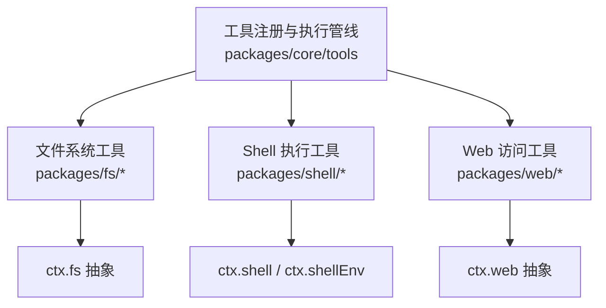
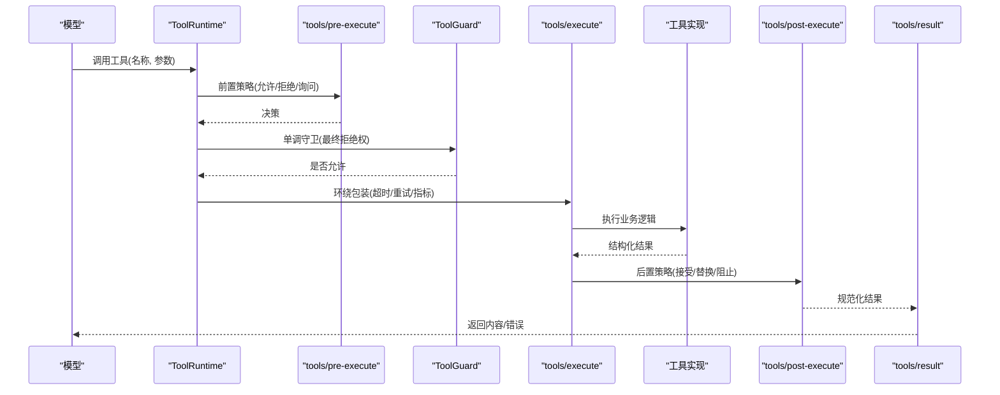
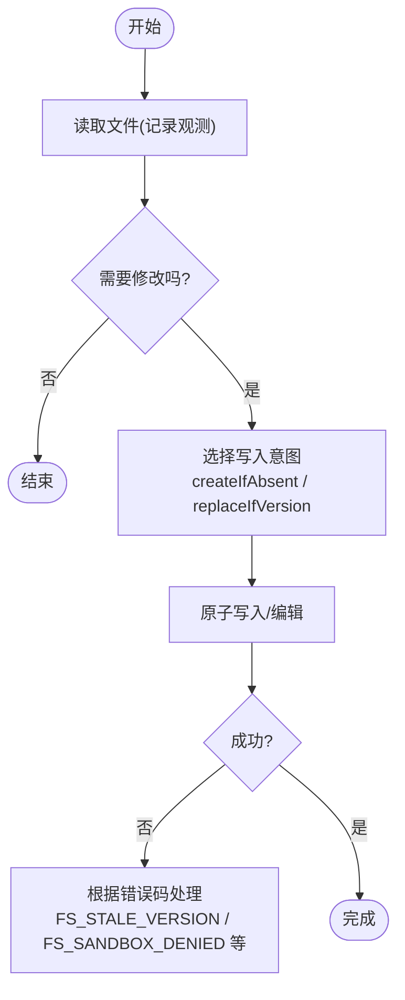
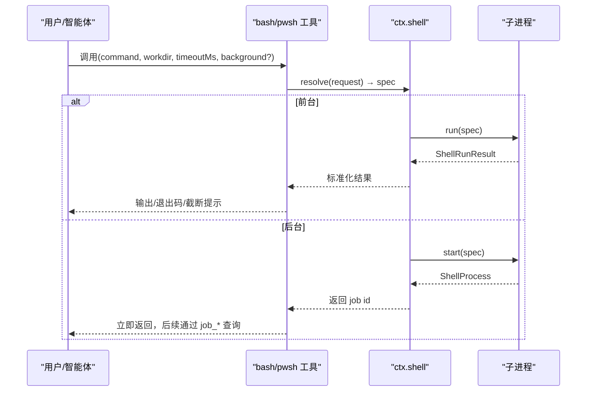
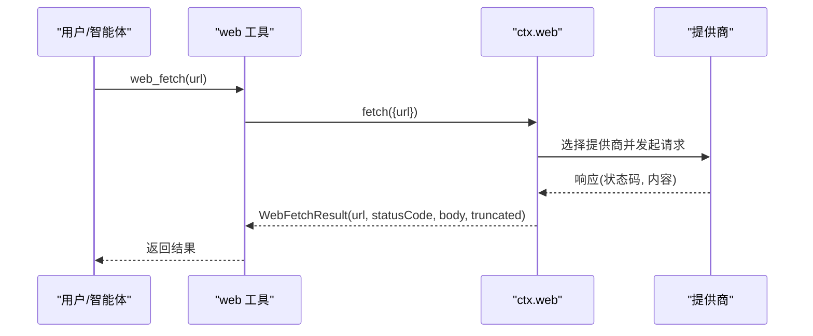
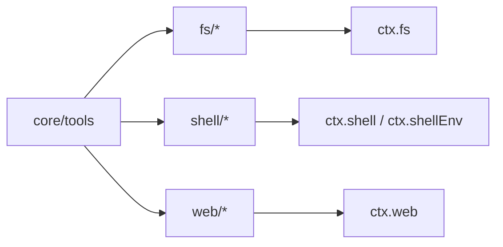

# 内置工具集

<cite>
**本文引用的文件**
- [docs/subsystems/tools.md](file://docs/subsystems/tools.md)
- [docs/subsystems/tools.zh.md](file://docs/subsystems/tools.zh.md)
- [docs/tool-catalog.md](file://docs/tool-catalog.md)
- [docs/subsystems/filesystem.md](file://docs/subsystems/filesystem.md)
- [docs/subsystems/shell.md](file://docs/subsystems/shell.md)
- [docs/subsystems/web.md](file://docs/subsystems/web.md)
- [examples/acp-agent/fs.cordis.yml](file://examples/acp-agent/fs.cordis.yml)
- [examples/acp-agent/web.cordis.yml](file://examples/acp-agent/web.cordis.yml)
</cite>

## 目录
1. [简介](#简介)
2. [项目结构](#项目结构)
3. [核心组件](#核心组件)
4. [架构总览](#架构总览)
5. [详细组件分析](#详细组件分析)
6. [依赖关系分析](#依赖关系分析)
7. [性能与资源管理](#性能与资源管理)
8. [故障排查指南](#故障排查指南)
9. [结论](#结论)
10. [附录：常用工具速查](#附录常用工具速查)

## 简介
本章节面向智能体开发者，系统介绍 DeepSeek Harness 的内置工具集，覆盖三类核心能力：
- 文件系统操作：读取、写入、编辑、搜索（glob/grep）
- 代码执行：Shell 命令（bash/pwsh）、Python/TypeScript 代码执行（run_code）
- 网络请求：Web 搜索与网页抓取（web_search/web_fetch）

文档将说明每个工具的参数定义、返回值格式、错误处理机制、权限控制、执行环境与安全限制，并提供最佳实践与常见任务示例。

## 项目结构
DeepSeek Harness 的工具以“插件包 + 服务抽象 + 模型可见 schema”的方式组织：
- 工具注册与执行管线：位于 core/tools，提供 ToolDefinition、ToolRuntime、事件水线（pre-execute/execute/post-execute/result）等
- 具体工具实现：按能力分属不同包（fs、shell、web 等），通过 ctx.* 暴露服务抽象
- 模型可见 schema 目录：由生成脚本产出，集中描述各工具对外参数与行为

图表来源
- [docs/subsystems/tools.md:9-151](file://docs/subsystems/tools.md#L9-L151)
- [docs/subsystems/filesystem.md:5-10](file://docs/subsystems/filesystem.md#L5-L10)
- [docs/subsystems/shell.md:1-15](file://docs/subsystems/shell.md#L1-L15)
- [docs/subsystems/web.md:1-12](file://docs/subsystems/web.md#L1-L12)

章节来源
- [docs/subsystems/tools.md:9-151](file://docs/subsystems/tools.md#L9-L151)
- [docs/tool-catalog.md:1-42](file://docs/tool-catalog.md#L1-L42)

## 核心组件
- 工具注册表与执行流水线：ToolDefinition、ToolRuntime.execute、工具事件水线（tools/pre-execute、tools/execute、tools/post-execute、tools/result）
- 统一 JSON Schema DSL：用于声明参数与输出类型，保证模型可见字段安全隔离
- 作用域与权限：ToolRestriction、ToolGuard、审批策略（ask/deny/allow）
- UI 呈现：presentCall/presentResult 渲染意图（terminal/diff/read/search/web 等）

章节来源
- [docs/subsystems/tools.md:9-151](file://docs/subsystems/tools.md#L9-L151)
- [docs/subsystems/tools.zh.md:9-151](file://docs/subsystems/tools.zh.md#L9-L151)

## 架构总览
下图展示了从模型调用到具体工具执行的端到端流程，以及关键的安全与权限拦截点。

图表来源
- [docs/subsystems/tools.md:170-404](file://docs/subsystems/tools.md#L170-L404)
- [docs/subsystems/tools.zh.md:170-404](file://docs/subsystems/tools.zh.md#L170-L404)

## 详细组件分析

### 文件系统工具（读、写、编辑、搜索）
- 工具集合
  - read：读取 UTF-8 文本，支持 offset/limit 行窗口
  - write：创建或覆盖 UTF-8 文本
  - edit：精确字面量替换，支持 replace_all
  - str_replace_editor：view/create/str_replace/insert 组合式编辑器
  - glob：路径匹配查找文件
  - grep：基于 ripgrep 的内容搜索
  - read_image：读取图像文件（需模型支持图片输入）

- 参数与返回
  - read：file_path, offset, limit → 返回带行号的内容与 totalLines
  - write：file_path, content → 返回写入结果（含版本信息）
  - edit：file_path, old_string, new_string, replace_all → 返回 before/after 与版本
  - str_replace_editor：command 枚举 + path 及可选参数 → 返回视图或变更结果
  - glob：pattern, path → 返回匹配路径列表（可能截断并保存完整列表）
  - grep：pattern, path, include → 返回分组匹配行（可能截断并保存完整列表）
  - read_image：file_path → 返回图像数据（受路由能力约束）

- 错误处理
  - 使用稳定错误码（如 FS_NOT_FOUND、FS_PERMISSION_DENIED、FS_SANDBOX_DENIED、FS_STALE_VERSION 等）
  - 读前写后观察策略：read-before-write/edit 由 fs 观测策略插件保障
  - 大文件/二进制：readBytes 强制 maxBytes 上限，避免无界缓冲

- 权限与安全
  - 沙箱模式：write/edit 可携带 sandboxPolicy；被拒绝时返回 FS_SANDBOX_DENIED
  - 版本守卫：edit/write 可传入 FsVersion 防止并发冲突
  - 工作区边界：相对路径解析基于会话工作区

- 执行环境与资源
  - 无 timeoutMs：文件系统 I/O 不设置超时，仅支持取消信号
  - 流式读取：streamText 支持大文件分段消费
  - 原子写入：writeText/editText 原子发布，配合版本守卫

- 使用示例与最佳实践
  - 先 read 再 write/edit：利用 fs 观测策略确保一致性
  - 使用 glob/grep 定位目标后再编辑，减少误改
  - 对大文件优先使用 streamText 或限定 offset/limit
  - 在沙箱模式下，遇到 FS_SANDBOX_DENIED 应调整策略或路径

章节来源
- [docs/tool-catalog.md:599-774](file://docs/tool-catalog.md#L599-L774)
- [docs/subsystems/filesystem.md:114-275](file://docs/subsystems/filesystem.md#L114-L275)
- [docs/subsystems/filesystem.md:288-426](file://docs/subsystems/filesystem.md#L288-L426)
- [examples/acp-agent/fs.cordis.yml:1-18](file://examples/acp-agent/fs.cordis.yml#L1-L18)

#### 文件系统读前写后策略流程图

图表来源
- [docs/subsystems/filesystem.md:114-179](file://docs/subsystems/filesystem.md#L114-L179)
- [docs/subsystems/filesystem.md:240-275](file://docs/subsystems/filesystem.md#L240-L275)

### Shell 命令与 PowerShell 执行（bash/pwsh）
- 工具集合
  - bash：执行 bash -c 命令，支持 workdir、timeoutMs、run_in_background
  - pwsh：Windows 下执行 pwsh -Command，语义与 bash 一致

- 参数与返回
  - command：必选
  - description：必选（UI 展示）
  - workdir：工作目录（默认会话工作区）
  - timeoutMs：超时毫秒数（由执行器应用默认与上限）
  - run_in_background：后台运行，返回 job id，通过 job_* 工具收集/停止

- 错误处理
  - 非零退出码报告为 [exit code: N]
  - 沙箱拒绝报告 [sandbox: file access denied under <mode> mode]
  - 长输出尾部截断，完整输出保存到 spill 文件并报告路径
  - Windows 强制终止返回 [exit code: 1]，视为中断而非失败

- 权限与安全
  - 沙箱模式：由 SandboxExecutionPolicy 决定；受限模式会拒绝文件操作
  - 环境变量：DSH_* 变量由 Harness 注入，不可被普通 env 覆盖
  - 进程隔离：每次调用启动新进程，状态不跨调用持久化

- 执行环境与资源
  - 前台运行：ShellRunResult 包含 exitCode/signal/timedOut/aborted/timeoutMs/stdout/stderr
  - 后台运行：ShellProcess 提供 readOutput()/kill() 与 done 生命周期
  - 输出截断：CollectedOutput 支持 spill 恢复

- 使用示例与最佳实践
  - 短命令前台执行，长任务用 run_in_background 并通过 job_* 管理
  - 指定 workdir 避免 cd 带来的状态泄漏
  - 合理设置 timeoutMs，避免长时间阻塞
  - 遇到沙箱拒绝时，调整策略或改用只读命令

章节来源
- [docs/tool-catalog.md:176-263](file://docs/tool-catalog.md#L176-L263)
- [docs/subsystems/shell.md:1-104](file://docs/subsystems/shell.md#L1-L104)
- [docs/subsystems/shell.md:105-221](file://docs/subsystems/shell.md#L105-L221)
- [docs/subsystems/shell.md:231-303](file://docs/subsystems/shell.md#L231-L303)

#### Shell 执行时序图

图表来源
- [docs/subsystems/shell.md:13-104](file://docs/subsystems/shell.md#L13-L104)
- [docs/subsystems/shell.md:167-221](file://docs/subsystems/shell.md#L167-L221)

### Web 访问（搜索与抓取）
- 工具集合
  - web_search：搜索引擎查询，返回 sources[] 与可选 content
  - web_fetch：获取 URL 内容，返回 statusCode、body（html/text）、truncated

- 参数与返回
  - web_search：query, maxResults → WebSearchResult（content?, sources[], truncated）
  - web_fetch：url → WebFetchResult（url, statusCode, body{kind,content}, truncated）

- 错误处理
  - 选择失败：WEB_PROVIDER_UNAVAILABLE / WEB_PROVIDER_AMBIGUOUS / WEB_PROVIDER_CONFIGURED_MISSING
  - 传输错误：WEB_INVALID_URL / WEB_BLOCKED_URL / WEB_FETCH_TOO_LARGE / WEB_FETCH_TIMEOUT / WEB_UNSUPPORTED_CONTENT_TYPE
  - 非 2xx 响应：仍为结果，statusCode 作为资源状态的一部分

- 权限与安全
  - 本地 HTTP 后端仅接受 HTTP(S)，拒绝凭据，限制重定向次数与字节/字符/时间
  - 不主动阻断私有网络目标，部署时需评估风险
  - 提供商可用性检查为本地快速判断，不做网络探测

- 执行环境与资源
  - 提供商选择：配置 id 或自动选择唯一可用提供商
  - 结果裁剪：seam 层强制 maxResults，超出则 truncated=true
  - 解码分类：body.kind 为 html 或 text，便于上层渲染

- 使用示例与最佳实践
  - 明确 searchProvider/fetchProvider 以避免歧义
  - 对 web_fetch 设置合理的超时与大小限制
  - 对敏感内部网络，谨慎启用 web_fetch

章节来源
- [docs/tool-catalog.md:41-41](file://docs/tool-catalog.md#L41-L41)
- [docs/subsystems/web.md:13-133](file://docs/subsystems/web.md#L13-L133)
- [docs/subsystems/web.md:142-198](file://docs/subsystems/web.md#L142-L198)
- [examples/acp-agent/web.cordis.yml:1-22](file://examples/acp-agent/web.cordis.yml#L1-L22)

#### Web 抓取时序图

图表来源
- [docs/subsystems/web.md:70-133](file://docs/subsystems/web.md#L70-L133)
- [docs/subsystems/web.md:142-198](file://docs/subsystems/web.md#L142-L198)

### 代码执行（run_code）
- 工具概述
  - run_code：执行 TypeScript 程序体（async function 主体），通过 tools.* 调用其他工具
  - 在 Code Mode 下，run_code 是注册表保留的传输通道，嵌套调用重新进入完整工具管道

- 参数与返回
  - code：程序体字符串
  - description：简要描述（UI 展示）
  - 返回：程序打印或返回的内容（由工具渲染）

- 执行环境与安全
  - 嵌套调用：每个子调度通过 tools/code-dispatch-log 可替换日志副本
  - 并发：最多 maxParallelSubCalls 个并发子调用
  - 策略：受全局工具过滤与权限策略约束

章节来源
- [docs/tool-catalog.md:117-148](file://docs/tool-catalog.md#L117-L148)
- [docs/subsystems/tools.md:255-281](file://docs/subsystems/tools.md#L255-L281)

## 依赖关系分析
- 工具注册与执行依赖 core/tools 提供的 ToolRuntime 与事件水线
- 文件系统依赖 ctx.fs 抽象与 fs 观测策略插件
- Shell 依赖 ctx.shell 抽象与 subprocess 服务
- Web 依赖 ctx.web 抽象与提供商注册

图表来源
- [docs/subsystems/tools.md:9-151](file://docs/subsystems/tools.md#L9-L151)
- [docs/subsystems/filesystem.md:5-10](file://docs/subsystems/filesystem.md#L5-L10)
- [docs/subsystems/shell.md:1-15](file://docs/subsystems/shell.md#L1-L15)
- [docs/subsystems/web.md:1-12](file://docs/subsystems/web.md#L1-L12)

章节来源
- [docs/subsystems/tools.md:9-151](file://docs/subsystems/tools.md#L9-L151)

## 性能与资源管理
- 工具执行模式
  - parallel/exclusive：根据 isConcurrencySafe 分类，形成并行组或独占屏障
  - 超时预算：timeoutMs 由工具声明并由 dsh-tool-call-timeout-policy 强制执行（不发送到模型）

- 资源限制
  - Shell：stdoutMaxBytes 限制前台输出捕获；后台进程输出可 spill 到文件
  - Web：maxResults 限制搜索结果数量；fetch 限制字节/字符/时间
  - 文件系统：readBytes 强制 maxBytes；streamText 支持大文件流式消费

- 取消与中止
  - 所有工具均支持 AbortSignal；工具实现需协作中止并在 quiescence 后结算
  - 工具执行管线在 pre/execute/post/result 阶段传播取消信号

章节来源
- [docs/subsystems/tools.md:53-74](file://docs/subsystems/tools.md#L53-L74)
- [docs/subsystems/shell.md:18-104](file://docs/subsystems/shell.md#L18-L104)
- [docs/subsystems/web.md:13-133](file://docs/subsystems/web.md#L13-L133)
- [docs/subsystems/filesystem.md:272-275](file://docs/subsystems/filesystem.md#L272-L275)

## 故障排查指南
- 文件系统
  - FS_NOT_FOUND：目标不存在，先 stat/lstat 确认
  - FS_PERMISSION_DENIED：主机内核拒绝，检查权限
  - FS_SANDBOX_DENIED：沙箱策略拒绝，调整策略或路径
  - FS_STALE_VERSION：并发冲突，重新读取最新内容并带版本守卫

- Shell
  - 超时/中止：检查 timedOut/aborted 标志与 signal
  - 沙箱拒绝：查看 ShellSandboxInfo.denied 与 enforcement
  - 输出截断：通过 spill 路径获取完整输出

- Web
  - 提供商不可用/歧义：检查 searchProvider/fetchProvider 配置与可用提供商
  - 网络错误：根据 WebError.code 分支处理（DNS/TLS/超时/过大等）
  - 非 2xx 响应：statusCode 作为资源状态，结合 body 判断业务含义

章节来源
- [docs/subsystems/filesystem.md:244-275](file://docs/subsystems/filesystem.md#L244-L275)
- [docs/subsystems/shell.md:141-166](file://docs/subsystems/shell.md#L141-L166)
- [docs/subsystems/web.md:120-133](file://docs/subsystems/web.md#L120-L133)

## 结论
DeepSeek Harness 的内置工具集以“抽象服务 + 插件实现 + 模型可见 schema”的模式提供统一的工具执行体验。通过工具注册表、事件水线与权限守卫，系统在安全性、可观测性与可扩展性之间取得平衡。文件系统、Shell 与 Web 三大类工具覆盖了智能体的常见外部交互需求，并提供了完善的错误处理、资源管理与沙箱控制。建议在实际使用中遵循“读前写后”、“显式工作目录”、“合理超时与大小限制”、“沙箱最小权限”的最佳实践。

## 附录：常用工具速查
- 文件系统
  - read：file_path, offset, limit
  - write：file_path, content
  - edit：file_path, old_string, new_string, replace_all
  - str_replace_editor：command(view/create/str_replace/insert), path, 可选参数
  - glob：pattern, path
  - grep：pattern, path, include
  - read_image：file_path（需模型支持图片）

- Shell
  - bash：command, description, workdir, timeoutMs, run_in_background
  - pwsh：同 bash（Windows 环境）

- Web
  - web_search：query, maxResults
  - web_fetch：url

章节来源
- [docs/tool-catalog.md:176-774](file://docs/tool-catalog.md#L176-L774)