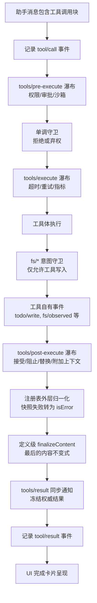
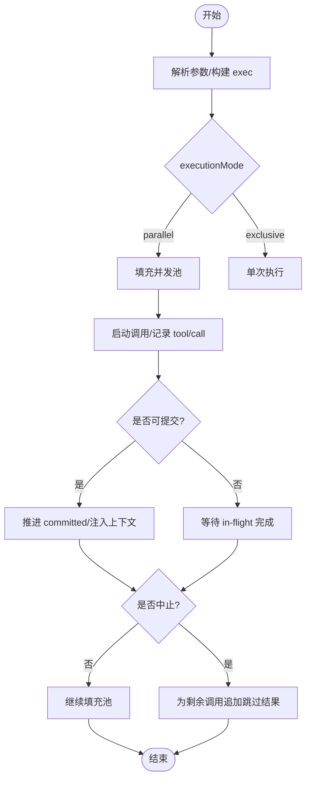
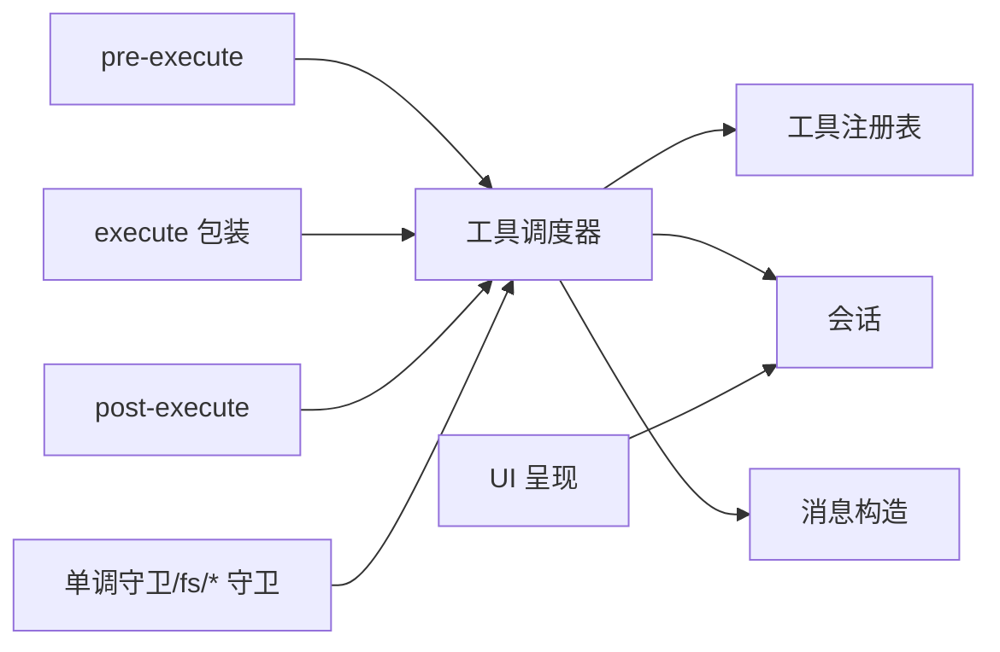

# 工具执行管道

<cite>
**本文引用的文件**
- [工具执行管道文档](file://docs/tool-execution-pipeline.md)
- [工具调用调度器](file://packages/core/agent-loop/src/tool-calls.ts)
- [工具系统文档](file://docs/subsystems/tools.i18n.yaml)
- [工具系统文档（英文）](file://docs/subsystems/tools.md)
- [拦截与钩子说明](file://docs/cordis-tutorial/04-events.md)
- [会话事件类型定义](file://packages/session/session/src/events.ts)
- [工具结果消息构造](file://packages/llm/dsh-llm/src/messages.ts)
</cite>

## 目录
1. [简介](#简介)
2. [项目结构](#项目结构)
3. [核心组件](#核心组件)
4. [架构总览](#架构总览)
5. [详细组件分析](#详细组件分析)
6. [依赖关系分析](#依赖关系分析)
7. [性能考量](#性能考量)
8. [故障排查指南](#故障排查指南)
9. [结论](#结论)
10. [附录](#附录)

## 简介
本文件系统性阐述“工具执行管道”的完整生命周期：从助手消息中的工具调用块被识别，到最终向模型返回单一、不可变的结果；贯穿权限审批、沙箱、文件系统守卫、超时重试、指标采集、结果重写、最终内容归一化、以及 UI 呈现。重点解释中间件机制（waterfall）、错误处理管道、优先级与并发控制、资源分配策略，以及如何扩展执行管道以添加新的处理步骤和拦截器。

## 项目结构
- 文档层：提供高层流程图与语义说明，明确各阶段职责与顺序。
- 实现层：调度器负责将一组工具调用按模式（独占/并行）组织为组，维护有序提交、并发池、中止与失败恢复。
- 集成层：通过会话事件记录 tool/call 与 tool/result，并通过消息构造函数生成面向模型的结果消息。



图表来源
- [工具执行管道文档:1-63](file://docs/tool-execution-pipeline.md#L1-L63)
- [工具调用调度器:164-245](file://packages/core/agent-loop/src/tool-calls.ts#L164-L245)

章节来源
- [工具执行管道文档:1-63](file://docs/tool-execution-pipeline.md#L1-L63)
- [工具调用调度器:1-290](file://packages/core/agent-loop/src/tool-calls.ts#L1-L290)

## 核心组件
- 工具调用调度器：负责解析参数、分组（独占/并行）、启动调用、有序提交、中止与失败恢复、合成跳过结果。
- Waterfall 中间件：pre-execute、execute、post-execute 三段式可插拔管线，支持短路、包装、恢复与增强。
- 文件系统守卫：在工具写入前进行意图校验，限制仅允许的工具写入路径与操作。
- 结果归一化与最终化：注册表外层对快照失败做统一转换，定义级 finalizeContent 保证内容不变式，tools/result 输出冻结结果。
- 会话事件与消息：tool/call 与 tool/result 成对记录，附带 turn/step 与调用 ID，确保回放一致性。

章节来源
- [工具调用调度器:19-100](file://packages/core/agent-loop/src/tool-calls.ts#L19-L100)
- [工具执行管道文档:1-63](file://docs/tool-execution-pipeline.md#L1-L63)

## 架构总览
下图展示一次工具调用的端到端流程，包括中间件、守卫、结果归一化与 UI 呈现。

```mermaid
sequenceDiagram
participant Model as "模型"
participant Loop as "AgentLoop"
participant Sched as "工具调度器"
participant Pre as "tools/pre-execute"
participant Guard as "单调守卫"
participant Exec as "tools/execute"
participant Tool as "工具体"
participant FS as "fs/* 守卫"
participant Post as "tools/post-execute"
participant Reg as "注册表归一化"
participant Def as "finalizeContent"
participant Result as "tools/result"
participant UI as "UI"
Model->>Loop : 助手消息含工具调用块
Loop->>Sched : executeToolCalls(...)
Sched->>Sched : 解析参数/分组/并发�
Sched->>Pre : 准备并执行 pre-execute
Pre-->>Sched : 允许/拒绝/请求审批
alt 拒绝或审批未通过
Sched->>Post : 进入 post-executedeny 路径
else 允许
Sched->>Guard : 单调守卫决策
Guard-->>Sched : 允许/拒绝
alt 拒绝
Sched->>Post : 进入 post-executedeny 路径
else 允许
Sched->>Exec : 包装超时/重试/指标
Exec->>Tool : 执行工具体
Tool->>FS : 写入意图校验
FS-->>Tool : 允许/拒绝
Tool-->>Exec : 返回结果
Exec-->>Sched : 返回 outcome
end
end
Sched->>Post : 统一进入 post-execute
Post-->>Reg : 结果进入外层归一化
Reg-->>Def : 调用 finalizeContent
Def-->>Result : 输出冻结结果
Result-->>Model : 记录 tool/result 事件
Result-->>UI : 呈现完成卡片
```

图表来源
- [工具执行管道文档:1-63](file://docs/tool-execution-pipeline.md#L1-L63)
- [工具调用调度器:164-245](file://packages/core/agent-loop/src/tool-calls.ts#L164-L245)

## 详细组件分析

### 工具调用调度器（并发与优先级）
- 输入解析：将模型提供的参数解析为 JSON，非法时回退为文本，空输入映射为空对象。
- 分组与模式：根据 executionMode 决定独占或并行；后续元素在开始时会重新评估模式，以便注册表变更产生屏障。
- 并发池：使用最大并行数限制 in-flight 数量，按就绪顺序启动，避免饥饿。
- 有序提交：committed 指针仅在连续模型序位置推进，保证结果与上下文注入的顺序性。
- 中止与失败：
  - 外部中止：停止新启动，等待已启动调用完成，为未启动调用追加合成跳过结果。
  - 内部调度失败：停止新分发，等待所有 in-flight 完成，抛出首个失败且不伪造结果。
- 上下文注入：每个结果可能携带 additionalContexts，按 FIFO 注入下一轮，保持调用/结果邻接。



图表来源
- [工具调用调度器:121-245](file://packages/core/agent-loop/src/tool-calls.ts#L121-L245)

章节来源
- [工具调用调度器:19-100](file://packages/core/agent-loop/src/tool-calls.ts#L19-L100)
- [工具调用调度器:121-245](file://packages/core/agent-loop/src/tool-calls.ts#L121-L245)

### Waterfall 中间件机制（pre/execute/post）
- tools/pre-execute：用于权限检查、审批交互、沙箱初始化等前置逻辑；可短路拒绝或请求一次性审批。
- tools/execute：用于包装工具执行的横切关注点，如超时、重试、指标采集、日志埋点；不改变业务语义。
- tools/post-execute：用于结果后处理，如接受/阻止/替换结果、附加面向模型的上下文；即使 deny 路径也会触发，便于统一观测与增强。
- 组合方式：监听器可通过 next() 委托下游，或通过短路返回；prepend 可调整注册顺序以覆盖默认策略。

章节来源
- [工具执行管道文档:1-63](file://docs/tool-execution-pipeline.md#L1-L63)
- [拦截与钩子说明:1-200](file://docs/cordis-tutorial/04-events.md#L1-L200)

### 文件系统守卫（fs/* 意图）
- 守卫时机：在工具体执行期间，任何 fs/* 写入前进行意图校验，确保仅允许的工具写入生效。
- 策略归属：由特定策略监听器占据单槽位，遵循“先注册者胜”的约定；若部署配置不当，可能出现策略旁路。
- 安全边界：cwd 不等于沙箱；如需路径包含约束，需由后端或 tools/execute 上的权限/沙箱插件强制执行。

章节来源
- [工具执行管道文档:1-63](file://docs/tool-execution-pipeline.md#L1-L63)
- [工具系统文档（英文）:1-200](file://docs/subsystems/tools.md#L1-L200)

### 结果归一化与最终化
- 注册表外层归一化：将候选结果的快照失败统一转换为 isError，保证上层可见一致的错误形态。
- 定义级 finalizeContent：作为最后的内容不变式保障，确保输出内容满足契约。
- tools/result：同步通知，输出冻结、不可变的权威结果，供 UI 与回放使用。

章节来源
- [工具执行管道文档:1-63](file://docs/tool-execution-pipeline.md#L1-L63)

### 会话事件与消息
- tool/call：在工具执行前记录，包含 turn、step、callId、name、arguments。
- tool/result：在有序提交时记录，包含 message（由消息构造函数生成）、error.info、meta（私有呈现负载）。
- 消息构造：createToolResultMessage 将 content、isError 等封装为模型可读的消息。

章节来源
- [工具调用调度器:248-289](file://packages/core/agent-loop/src/tool-calls.ts#L248-L289)
- [工具结果消息构造:1-200](file://packages/llm/dsh-llm/src/messages.ts#L1-L200)

## 依赖关系分析
- 调度器依赖：
  - 工具注册表：获取 executionMode、prepare/dispatch/finalize/finish。
  - 会话：追加 tool/call 与 tool/result 事件。
  - 消息构造：生成 tool/result 的 message。
- Waterfall 依赖：
  - 监听器注册：pre/execute/post 三段式，支持 prepend 与 next() 委托。
  - 策略与守卫：权限、审批、沙箱、fs/* 意图守卫。
- UI 依赖：
  - 读取 tool/call 与 tool/result 事件，渲染待处理与完成卡片。



图表来源
- [工具调用调度器:164-245](file://packages/core/agent-loop/src/tool-calls.ts#L164-L245)
- [工具执行管道文档:1-63](file://docs/tool-execution-pipeline.md#L1-L63)

章节来源
- [工具调用调度器:164-245](file://packages/core/agent-loop/src/tool-calls.ts#L164-L245)
- [工具执行管道文档:1-63](file://docs/tool-execution-pipeline.md#L1-L63)

## 性能考量
- 并发控制：通过 maxParallelToolCalls 限制 in-flight 数量，避免资源耗尽；在 parallel 模式下，后续元素会在启动前重新评估模式，确保屏障语义。
- 有序提交：committed 推进保证结果与上下文注入顺序，减少模型侧歧义。
- 中止与失败：
  - 外部中止：快速停止新分发，等待已启动调用完成，为未启动调用追加跳过结果，保证回放一致性。
  - 内部调度失败：不伪造结果，直接传播首个失败，避免污染状态。
- 指标与重试：在 tools/execute 中集中实现，避免侵入工具体，便于统一观测与优化。

章节来源
- [工具调用调度器:121-245](file://packages/core/agent-loop/src/tool-calls.ts#L121-L245)

## 故障排查指南
- 常见错误定位：
  - 权限/审批拒绝：检查 pre-execute 与单调守卫的监听器顺序与策略；确认审批流是否可用。
  - 文件系统写入失败：检查 fs/* 意图守卫策略是否允许目标路径；确认 cwd 与包含约束。
  - 超时/重试：检查 execute 包装器的超时阈值与重试策略；观察指标与日志。
  - 结果异常：查看注册表外层归一化与 finalizeContent 的输出；确认 tools/result 的冻结结果。
- 诊断手段：
  - 会话事件：通过 tool/call 与 tool/result 事件回放，核对调用与结果邻接关系。
  - 指标采集：在 execute 包装中增加耗时、错误码、重试次数等指标。
  - 日志埋点：在 pre/execute/post 关键节点记录上下文与决策依据。

章节来源
- [工具执行管道文档:1-63](file://docs/tool-execution-pipeline.md#L1-L63)
- [工具调用调度器:248-289](file://packages/core/agent-loop/src/tool-calls.ts#L248-L289)

## 结论
工具执行管道通过三段式 waterfall 与严格的有序提交机制，实现了权限、沙箱、文件系统守卫、超时重试、指标采集、结果归一化与 UI 呈现的解耦与可观测。调度器在保证并发与优先级的同时，提供了健壮的中止与失败恢复能力。扩展管道时，应优先通过 pre/execute/post 监听器与守卫策略进行增强，避免侵入工具体，确保模型可见与已记录的一致性。

## 附录
- 扩展建议：
  - 新增拦截器：在 pre/execute/post 注册监听器，使用 next() 委托下游，必要时短路返回。
  - 调整策略顺序：使用 prepend 调整监听器顺序，覆盖默认策略。
  - 自定义守卫：在 fs/* 意图处实现策略监听器，确保路径包含与安全边界。
  - 指标与重试：在 execute 包装中集中实现，便于统一观测与优化。