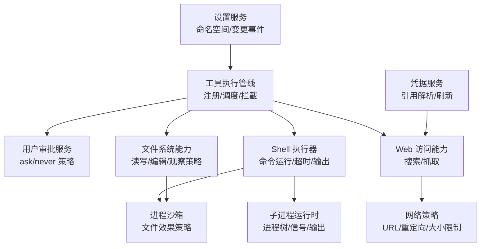
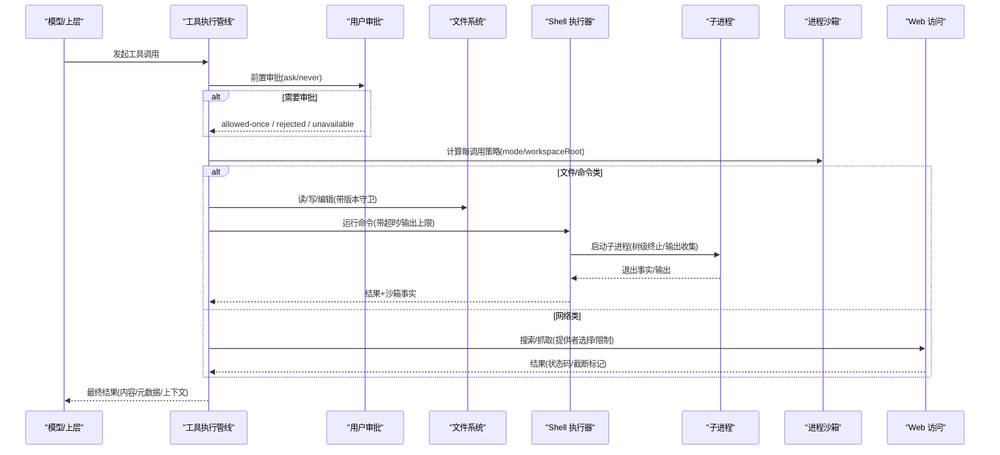
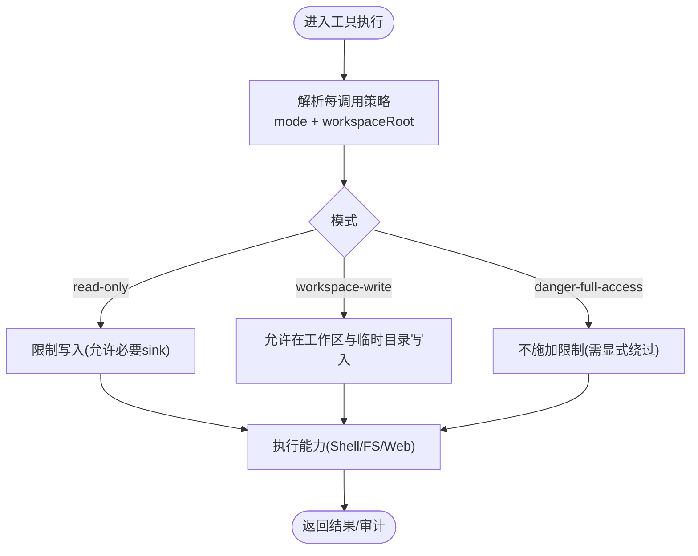
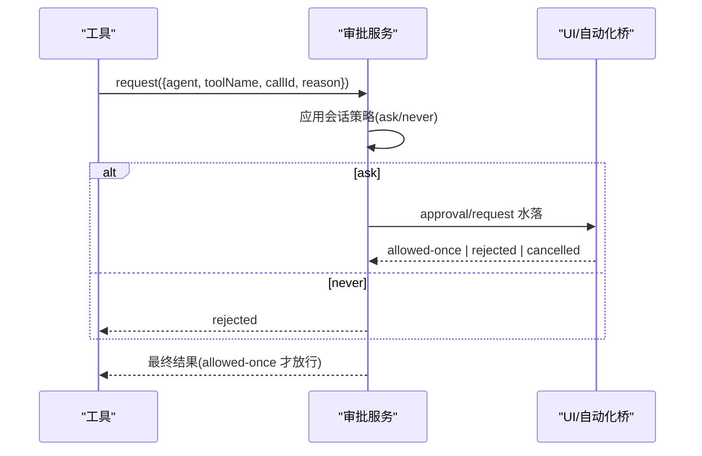
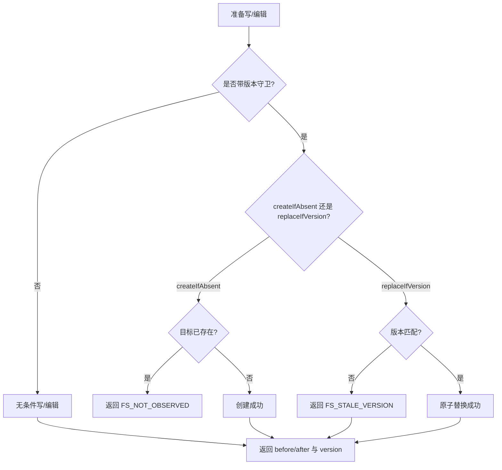
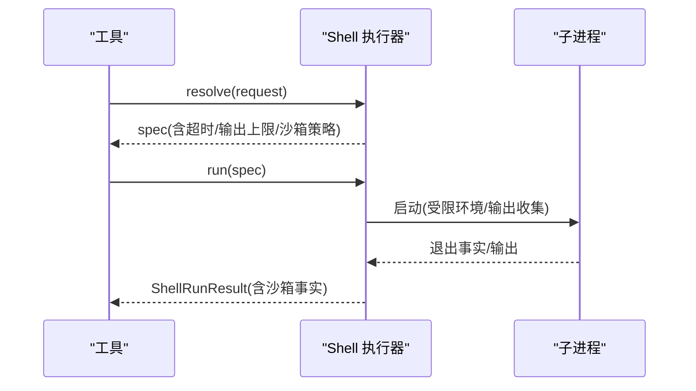
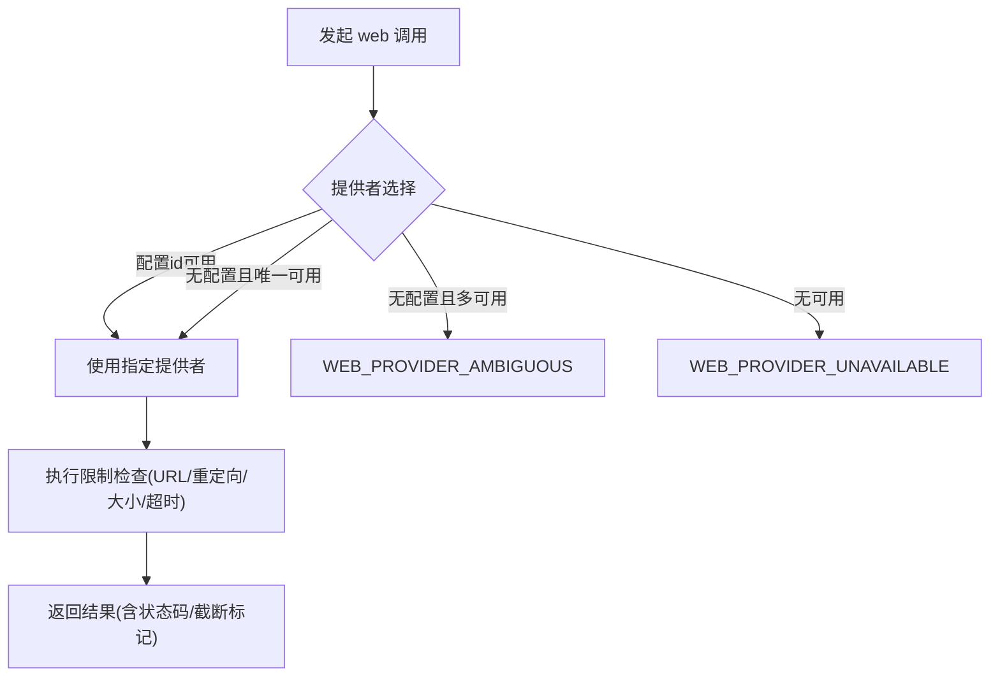
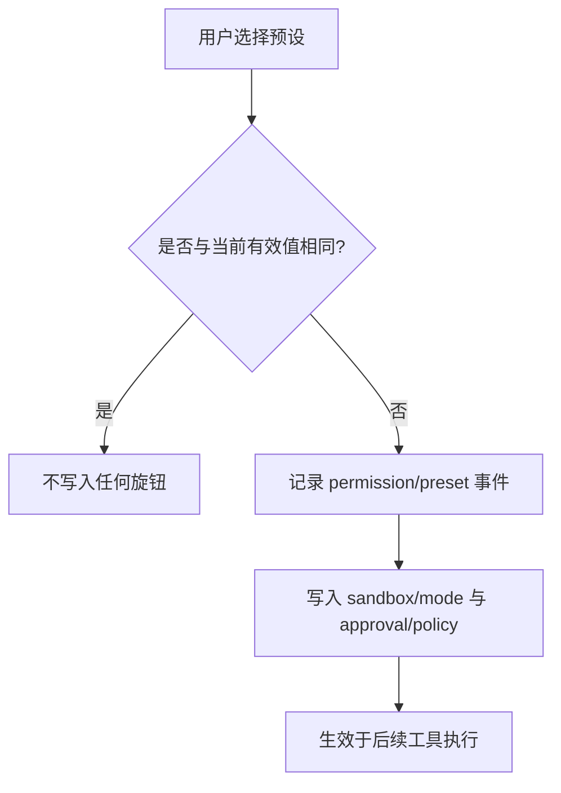
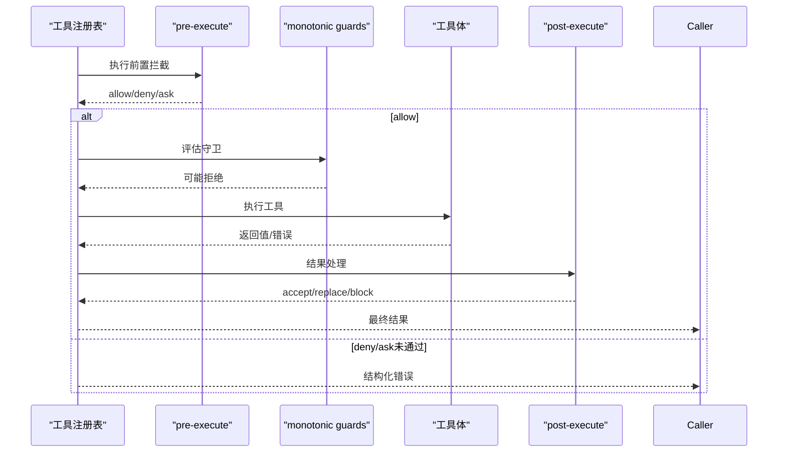
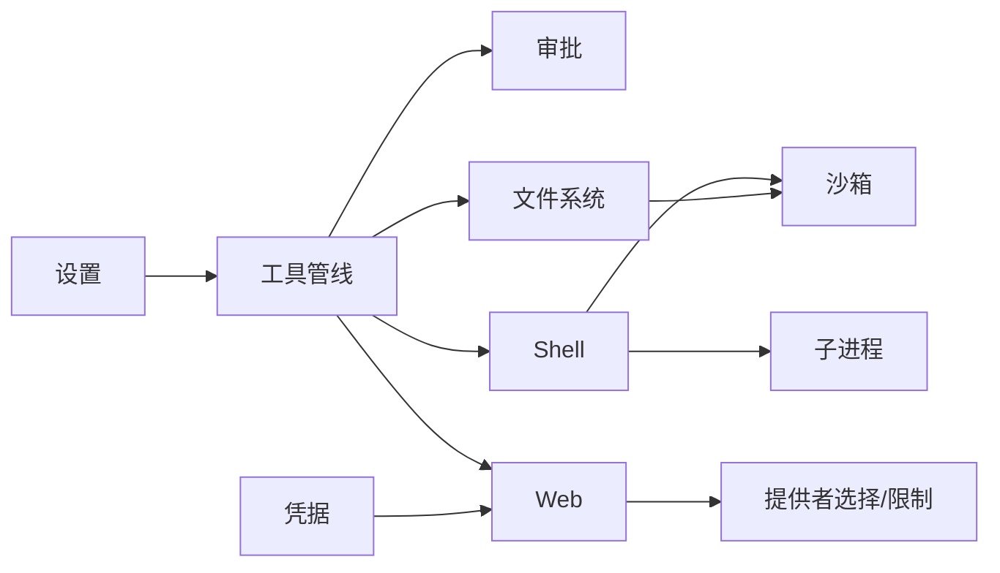

# 工具权限与安全

<cite>
**本文引用的文件**
- [sandbox.md](file://docs/subsystems/sandbox.md)
- [permission-presets.md](file://docs/subsystems/permission-presets.md)
- [approval.md](file://docs/subsystems/approval.md)
- [tools.md](file://docs/subsystems/tools.md)
- [filesystem.md](file://docs/subsystems/filesystem.md)
- [shell.md](file://docs/subsystems/shell.md)
- [subprocess.md](file://docs/subsystems/subprocess.md)
- [web.md](file://docs/subsystems/web.md)
- [credentials.md](file://docs/subsystems/credentials.md)
- [settings.md](file://docs/subsystems/settings.md)
</cite>

## 目录
1. [简介](#简介)
2. [项目结构](#项目结构)
3. [核心组件](#核心组件)
4. [架构总览](#架构总览)
5. [详细组件分析](#详细组件分析)
6. [依赖关系分析](#依赖关系分析)
7. [性能与资源保护](#性能与资源保护)
8. [故障排查指南](#故障排查指南)
9. [结论](#结论)
10. [附录：安全最佳实践清单](#附录：安全最佳实践清单)

## 简介
本文件系统性阐述工具系统的权限控制与安全机制，覆盖以下方面：
- 执行沙箱隔离原理：文件系统访问控制、网络请求限制、系统资源保护。
- 权限预设系统：为不同场景配置合适的权限策略（如只读工作区、危险全量访问）。
- 敏感操作审批流程：文件修改、命令执行、外部服务调用的安全控制。
- 安全最佳实践：输入验证、输出过滤、异常处理、审计日志。
- 恶意行为检测与响应：如何识别并阻断异常调用，以及事件响应机制。

## 项目结构
围绕“工具—能力—执行”的安全边界，仓库将安全相关能力拆分为多个子系统文档与实现：
- 工具执行管线与注册表：定义工具契约、执行流水线、前置/后置拦截点。
- 进程沙箱：封装跨平台子进程隔离策略（Linux bwrap/Landlock、macOS Seatbelt、Windows ACL）。
- 用户审批：对敏感操作的“询问/拒绝/允许一次”决策流。
- 文件系统：读写编辑的原子性、版本守卫、观察式策略。
- Shell 执行：命令执行的超时、输出截断、环境变量清洗、沙箱模式注入。
- 子进程：统一的进程生命周期、树级终止、输出收集与溢出转储。
- Web 访问：搜索与抓取的能力抽象、提供者选择、URL/重定向/大小限制。
- 凭据与设置：密钥管理、配置分层与变更事件。

图表来源
- [tools.md:170-405](file://docs/subsystems/tools.md#L170-L405)
- [approval.md:31-89](file://docs/subsystems/approval.md#L31-L89)
- [filesystem.md:114-186](file://docs/subsystems/filesystem.md#L114-L186)
- [shell.md:13-103](file://docs/subsystems/shell.md#L13-L103)
- [subprocess.md:89-174](file://docs/subsystems/subprocess.md#L89-L174)
- [sandbox.md:9-43](file://docs/subsystems/sandbox.md#L9-L43)
- [web.md:120-133](file://docs/subsystems/web.md#L120-L133)
- [settings.md:18-64](file://docs/subsystems/settings.md#L18-L64)
- [credentials.md:18-50](file://docs/subsystems/credentials.md#L18-L50)

章节来源
- [tools.md:1-721](file://docs/subsystems/tools.md#L1-L721)
- [sandbox.md:1-219](file://docs/subsystems/sandbox.md#L1-L219)
- [approval.md:1-171](file://docs/subsystems/approval.md#L1-L171)
- [filesystem.md:1-496](file://docs/subsystems/filesystem.md#L1-L496)
- [shell.md:1-304](file://docs/subsystems/shell.md#L1-L304)
- [subprocess.md:1-325](file://docs/subsystems/subprocess.md#L1-L325)
- [web.md:1-200](file://docs/subsystems/web.md#L1-L200)
- [credentials.md:1-134](file://docs/subsystems/credentials.md#L1-L134)
- [settings.md:1-311](file://docs/subsystems/settings.md#L1-L311)

## 核心组件
- 工具执行管线：提供 pre-execute/guard/post-execute 等拦截点，支持并行/独占调度、超时、结果替换与内容最终化。
- 用户审批：按会话策略决定“询问/拒绝”，仅允许“允许一次”放行；未就绪时失败关闭。
- 进程沙箱：以“文件效果策略”约束子进程的文件系统访问，区分 full/partial 强制程度。
- 文件系统：原子写/编辑、版本守卫、观察式策略（读前写/编辑），错误码可路由。
- Shell 执行：请求/规格分离、超时/中止分类、输出截断与溢出转储、受控环境变量。
- 子进程：统一进程树管理、SIGTERM→grace→SIGKILL 终止、收集式输出与偏移读取。
- Web 访问：搜索/抓取能力抽象，提供者选择规则、URL/重定向/大小限制、结构化错误。
- 凭据与设置：密钥引用解析（每次操作重新解析）、配置分层与变更事件、敏感字段脱敏。

章节来源
- [tools.md:170-405](file://docs/subsystems/tools.md#L170-L405)
- [approval.md:31-89](file://docs/subsystems/approval.md#L31-L89)
- [sandbox.md:9-43](file://docs/subsystems/sandbox.md#L9-L43)
- [filesystem.md:114-186](file://docs/subsystems/filesystem.md#L114-L186)
- [shell.md:13-103](file://docs/subsystems/shell.md#L13-L103)
- [subprocess.md:89-174](file://docs/subsystems/subprocess.md#L89-L174)
- [web.md:120-133](file://docs/subsystems/web.md#L120-L133)
- [credentials.md:18-50](file://docs/subsystems/credentials.md#L18-L50)
- [settings.md:18-64](file://docs/subsystems/settings.md#L18-L64)

## 架构总览
下图展示工具调用从入口到执行、审批、沙箱与能力层的全链路安全控制点。

图表来源
- [tools.md:170-405](file://docs/subsystems/tools.md#L170-L405)
- [approval.md:31-89](file://docs/subsystems/approval.md#L31-L89)
- [sandbox.md:41-94](file://docs/subsystems/sandbox.md#L41-L94)
- [filesystem.md:114-186](file://docs/subsystems/filesystem.md#L114-L186)
- [shell.md:13-103](file://docs/subsystems/shell.md#L13-L103)
- [subprocess.md:89-174](file://docs/subsystems/subprocess.md#L89-L174)
- [web.md:120-133](file://docs/subsystems/web.md#L120-L133)

## 详细组件分析

### 进程沙箱与文件系统访问控制
- 模式与强制程度：read-only、workspace-write、danger-full-access；full/partial 表示后端能完全或部分保证承诺。
- 每调用策略：基于会话 cwd 与工作区根，携带 sessionId，避免共享状态污染。
- 失败分类：区分“被沙箱拒绝”和“沙箱运行器失败”，前者是正常防护，后者是基础设施问题。
- 与 Shell/FS 集成：Shell 执行与 FS 写/编辑均传入策略，由后端按模式限制文件效果。

图表来源
- [sandbox.md:9-43](file://docs/subsystems/sandbox.md#L9-L43)
- [sandbox.md:41-94](file://docs/subsystems/sandbox.md#L41-L94)
- [shell.md:141-165](file://docs/subsystems/shell.md#L141-L165)
- [filesystem.md:398-426](file://docs/subsystems/filesystem.md#L398-L426)

章节来源
- [sandbox.md:1-219](file://docs/subsystems/sandbox.md#L1-L219)
- [shell.md:13-103](file://docs/subsystems/shell.md#L13-L103)
- [filesystem.md:114-186](file://docs/subsystems/filesystem.md#L114-L186)

### 用户审批与敏感操作审批流程
- 策略：ask（委派回答者）或 never（直接拒绝）；不可用则失败关闭。
- 请求体：包含 agent、toolName、callId、reason、signal；不重复携带参数，避免漂移。
- 审计：每个 ask/decided 成对记录，不入模型对话，但可用于回放与审计。
- 典型敏感操作：文件修改、命令执行、外部服务调用在 pre-execute 阶段触发审批。

图表来源
- [approval.md:31-89](file://docs/subsystems/approval.md#L31-L89)
- [approval.md:104-140](file://docs/subsystems/approval.md#L104-L140)
- [tools.md:376-405](file://docs/subsystems/tools.md#L376-L405)

章节来源
- [approval.md:1-171](file://docs/subsystems/approval.md#L1-L171)
- [tools.md:376-405](file://docs/subsystems/tools.md#L376-L405)

### 文件系统：原子写/编辑与版本守卫
- 目标标识：FsTarget/FsVersion 为不透明键与版本令牌，禁止消费者解析。
- 写意图：createIfAbsent/replaceIfVersion；缺失/过期分别返回 FS_NOT_OBSERVED/FS_STALE_VERSION。
- 编辑：原子替换，先校验版本再匹配文本，缺失也视为 FS_STALE_VERSION。
- 观察策略：fs/observed 记录存在/不存在，驱动后续写/编辑决策。

图表来源
- [filesystem.md:114-186](file://docs/subsystems/filesystem.md#L114-L186)
- [filesystem.md:244-271](file://docs/subsystems/filesystem.md#L244-L271)

章节来源
- [filesystem.md:1-496](file://docs/subsystems/filesystem.md#L1-L496)

### Shell 执行：命令执行与系统资源保护
- 请求/规格分离：resolve 填充默认值与上限，start/run 使用完整规格。
- 超时与中止：timedOut 与 aborted 独立报告，避免误判成功。
- 输出限制：stdoutMaxBytes 截断并保留尾部，溢出转储至安全路径。
- 环境变量：DSH_* 受控注入，普通 env 合并后仍不能覆盖受管变量。
- 沙箱事实：返回 mode/denied/enforcement/runnerFailed，便于上层判定。

图表来源
- [shell.md:13-103](file://docs/subsystems/shell.md#L13-L103)
- [shell.md:105-165](file://docs/subsystems/shell.md#L105-L165)
- [subprocess.md:89-174](file://docs/subsystems/subprocess.md#L89-L174)

章节来源
- [shell.md:1-304](file://docs/subsystems/shell.md#L1-L304)
- [subprocess.md:1-325](file://docs/subsystems/subprocess.md#L1-L325)

### Web 访问：网络请求限制与提供者选择
- 能力抽象：search/fetch 共用 ctx.web，统一选择策略与错误词汇。
- 提供者选择：按配置 id 或可用数量自动选择；歧义/不可用返回结构化错误。
- 限制：URL 合法性、重定向限制、字节/字符上限、超时；非 2xx 仍为结果而非错误。
- 私有网络注意：本地 fetch 不阻止内网目标，需谨慎启用。

图表来源
- [web.md:120-133](file://docs/subsystems/web.md#L120-L133)
- [web.md:148-196](file://docs/subsystems/web.md#L148-L196)

章节来源
- [web.md:1-200](file://docs/subsystems/web.md#L1-L200)

### 权限预设系统：为不同场景配置合适策略
- 预设表：将 sandbox/mode 与 approval/policy 组合为命名预设，默认包含“工作区写入+询问”和“危险全量+从不询问”。
- 当前预设推导：基于会话有效模式与审批策略，优先保留用户上次选择，否则回退声明顺序。
- 切换：set(session, name) 仅当实际值变化时才写入底层 setter，并记录 permission/preset 事件。

图表来源
- [permission-presets.md:9-48](file://docs/subsystems/permission-presets.md#L9-L48)
- [permission-presets.md:64-69](file://docs/subsystems/permission-presets.md#L64-L69)
- [permission-presets.md:84-126](file://docs/subsystems/permission-presets.md#L84-L126)

章节来源
- [permission-presets.md:1-132](file://docs/subsystems/permission-presets.md#L1-L132)

### 工具执行管线：前置/后置拦截与内容最终化
- 前置：tools/pre-execute 允许 deny/ask/allow；missing approval 使 ask 转为拒绝。
- 守卫：monotonic guards 只能减少权限，不能恢复。
- 后置：tools/post-execute 可接受/替换/阻塞结果；finalizeContent 用于最终内容投影。
- 并发：isConcurrencySafe 决定并行/独占；registry 维护执行模式。

图表来源
- [tools.md:170-405](file://docs/subsystems/tools.md#L170-L405)
- [tools.md:478-570](file://docs/subsystems/tools.md#L478-L570)

章节来源
- [tools.md:1-721](file://docs/subsystems/tools.md#L1-L721)

### 凭据与设置：最小暴露与动态刷新
- 凭据：引用式存储，每次操作重新解析，空值视为未配置；变更事件通知 UI。
- 设置：命名空间注册、分层解析（schema/base/user）、变更事件、敏感字段脱敏。

章节来源
- [credentials.md:1-134](file://docs/subsystems/credentials.md#L1-L134)
- [settings.md:1-311](file://docs/subsystems/settings.md#L1-L311)

## 依赖关系分析
- 工具管线依赖审批、沙箱、文件系统、Shell、Web 等能力；各能力通过明确接口与事件协作。
- Shell 依赖子进程与沙箱；FS 依赖沙箱策略与观察式策略；Web 依赖提供者选择与限制策略。
- 设置与凭据贯穿配置与密钥管理，影响上述能力的行为与可用性。

图表来源
- [tools.md:170-405](file://docs/subsystems/tools.md#L170-L405)
- [shell.md:13-103](file://docs/subsystems/shell.md#L13-L103)
- [filesystem.md:114-186](file://docs/subsystems/filesystem.md#L114-L186)
- [web.md:120-133](file://docs/subsystems/web.md#L120-L133)
- [settings.md:18-64](file://docs/subsystems/settings.md#L18-L64)
- [credentials.md:18-50](file://docs/subsystems/credentials.md#L18-L50)

章节来源
- [tools.md:1-721](file://docs/subsystems/tools.md#L1-L721)
- [shell.md:1-304](file://docs/subsystems/shell.md#L1-L304)
- [filesystem.md:1-496](file://docs/subsystems/filesystem.md#L1-L496)
- [web.md:1-200](file://docs/subsystems/web.md#L1-L200)
- [settings.md:1-311](file://docs/subsystems/settings.md#L1-L311)
- [credentials.md:1-134](file://docs/subsystems/credentials.md#L1-L134)

## 性能与资源保护
- 输出截断与溢出转储：Shell/子进程对 stdout/stderr 进行有界收集，溢出时保留尾部并提供完整转储路径，避免内存膨胀。
- 超时与中止：Shell 与 Web 均支持超时与取消，确保长时间任务可控释放资源。
- 沙箱强制程度：partial/full 提示后端保障范围，必要时拒绝执行以保证绝对边界。
- 并发与独占：工具可声明 isConcurrencySafe，由注册表决定并行或独占，避免竞争条件。

章节来源
- [shell.md:105-165](file://docs/subsystems/shell.md#L105-L165)
- [subprocess.md:89-174](file://docs/subsystems/subprocess.md#L89-L174)
- [web.md:120-133](file://docs/subsystems/web.md#L120-L133)
- [tools.md:243-253](file://docs/subsystems/tools.md#L243-L253)

## 故障排查指南
- 沙箱不可用：当 confined 模式无可用后端时抛出 SANDBOX_UNAVAILABLE；前台执行直接报错，后台作业记录 runnerFailed。
- 文件操作错误：FS_NOT_FOUND/FS_PERMISSION_DENIED/FS_SANDBOX_DENIED/FS_STALE_VERSION/FS_NOT_OBSERVED 等稳定错误码，便于重试/权限/UI 分支。
- 审批不可用：缺少或抛出的回答者导致 unavailable，fail-closed 拒绝。
- Web 提供者错误：WEB_PROVIDER_UNAVAILABLE/AMBIGUOUS/CONFIGURED_MISSING/UNAVAILABLE 等结构化错误，便于定位配置与可用性。
- 输出丢失：CollectedOutput.truncated=true 时通过 spillPath 获取完整流，结合 lossy 标志判断可读性。

章节来源
- [sandbox.md:152-157](file://docs/subsystems/sandbox.md#L152-L157)
- [filesystem.md:244-271](file://docs/subsystems/filesystem.md#L244-L271)
- [approval.md:21-29](file://docs/subsystems/approval.md#L21-L29)
- [web.md:126-133](file://docs/subsystems/web.md#L126-L133)
- [subprocess.md:176-208](file://docs/subsystems/subprocess.md#L176-L208)

## 结论
该工具系统通过“工具管线—审批—沙箱—能力层”的分层设计，实现了细粒度的权限控制与安全防护：
- 沙箱以“文件效果策略”为核心，配合 full/partial 强制程度，确保进程隔离的可预期性。
- 审批以会话策略为基础，提供 ask/never 两种模式，并对敏感操作进行审计。
- 文件系统与 Shell 提供原子性、版本守卫、超时与输出限制，防止资源滥用与数据损坏。
- Web 访问通过提供者选择与严格限制，降低网络侧风险。
- 凭据与设置提供最小暴露与动态刷新，支撑安全配置与密钥管理。

## 附录：安全最佳实践清单
- 输入验证
  - 工具参数使用 schema 严格校验，非法参数立即拒绝。
  - 文件系统路径使用前 lstat 检查类型，避免符号链接越权。
- 输出过滤
  - 对大输出采用截断与溢出转储，UI 呈现时隐藏敏感片段。
  - Web 抓取结果按内容类型分类渲染，避免执行任意代码。
- 异常处理
  - 审批不可用、沙箱不可用、提供者不可用等场景 fail-closed。
  - 使用稳定错误码分支处理，避免字符串解析脆弱逻辑。
- 审计日志
  - 审批 ask/decided 成对记录；工具执行前后事件可追踪。
  - 设置/凭据变更事件用于 UI 刷新与合规审计。
- 恶意行为检测与响应
  - 监控高频失败与异常模式（如大量 FS_SANDBOX_DENIED）。
  - 对可疑工具调用启用更严格的沙箱模式与审批策略。
  - 建立告警与熔断：检测到异常时降级为 read-only 并暂停高风险能力。