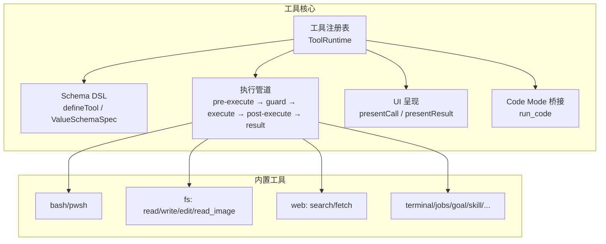
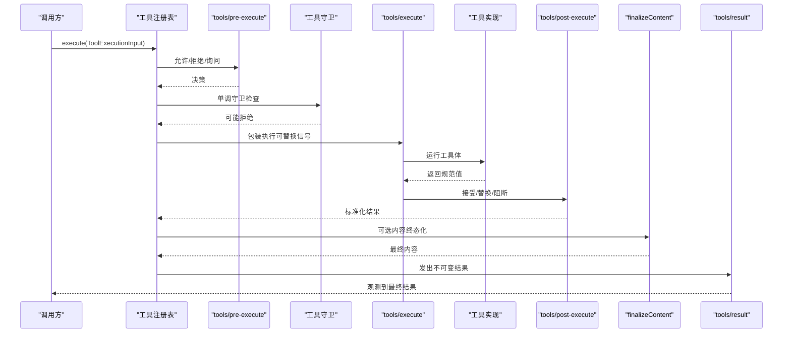
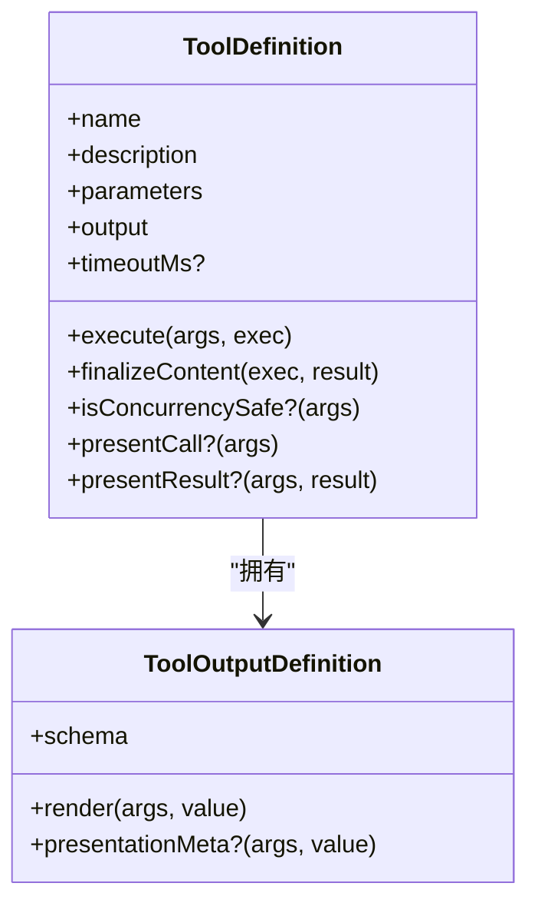
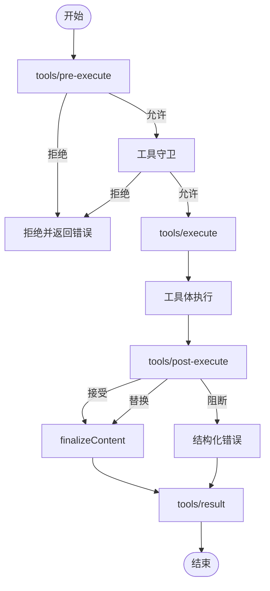
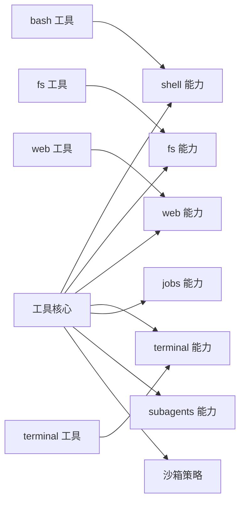

# 工具生态系统

<cite>
**本文引用的文件**
- [packages/core/tools/src/index.ts](file://packages/core/tools/src/index.ts)
- [packages/core/tools/src/schema.ts](file://packages/core/tools/src/schema.ts)
- [packages/core/tools/src/presentation.ts](file://packages/core/tools/src/presentation.ts)
- [packages/core/tools/src/code-mode.ts](file://packages/core/tools/src/code-mode.ts)
- [docs/subsystems/tools.md](file://docs/subsystems/tools.md)
- [docs/tool-catalog.md](file://docs/tool-catalog.md)
- [docs/cookbook/adding-a-tool.md](file://docs/cookbook/adding-a-tool.md)
- [packages/shell/tool-bash/src/index.ts](file://packages/shell/tool-bash/src/index.ts)
- [packages/fs/tool-fs/src/index.ts](file://packages/fs/tool-fs/src/index.ts)
- [packages/web/tool-web/src/index.ts](file://packages/web/tool-web/src/index.ts)
- [docs/subsystems/sandbox.md](file://docs/subsystems/sandbox.md)
</cite>

## 目录
1. [简介](#简介)
2. [项目结构](#项目结构)
3. [核心组件](#核心组件)
4. [架构总览](#架构总览)
5. [详细组件分析](#详细组件分析)
6. [依赖关系分析](#依赖关系分析)
7. [性能考虑](#性能考虑)
8. [故障排查指南](#故障排查指南)
9. [结论](#结论)
10. [附录](#附录)

## 简介
本文件系统性介绍 DeepSeek Harness 的工具生态系统：工具如何定义、注册与执行；内置工具集的功能与用法；如何创建自定义工具（接口、参数校验、错误处理、权限控制）；文件系统、代码执行、网络请求等常用工具的实践；以及外部服务集成、监控调试与最佳实践。文档面向不同技术背景的读者，提供从概念到代码级的分层说明与图示。

## 项目结构
- 工具核心在 packages/core/tools，提供工具注册表、统一 JSON Schema DSL、执行管道、UI 呈现词汇和 Code Mode 桥接。
- 各功能域以“tool-*”包形式实现具体工具（如 bash、fs、web、terminal、goal、jobs 等）。
- 文档位于 docs 下，包含子系统说明、工具目录、Cookbook 教程等。

图表来源
- [packages/core/tools/src/index.ts:1-200](file://packages/core/tools/src/index.ts#L1-L200)
- [docs/subsystems/tools.md:9-97](file://docs/subsystems/tools.md#L9-L97)

章节来源
- [docs/subsystems/tools.md:9-97](file://docs/subsystems/tools.md#L9-L97)
- [docs/tool-catalog.md:12-41](file://docs/tool-catalog.md#L12-L41)

## 核心组件
- ToolDefinition：一个已注册工具的完整契约，包含模型可见的 schema、输出声明、execute 函数、可选 finalizeContent、超时预算、并发安全标记、UI 呈现方法等。
- 统一 JSON Schema DSL：作者侧统一的参数与输出类型描述，编译为受控的原始 JSON Schema 子集，支持标量、数组、对象、oneOf、enum/const 等。
- 执行管道：tools/pre-execute（允许/拒绝/询问）→ 单调守卫 → tools/execute（可替换信号）→ tools/post-execute（接受/替换/阻断）→ finalizeContent → tools/result（最终不可变结果）。
- UI 呈现：通过 card-tagged 的 ToolCallView/ToolResultView 描述待执行与已完成状态，跨宿主/客户端渲染。
- Code Mode 桥接：在 code 模式下，run_code 是唯一直接可调用的工具，内部程序通过 SDK 调用其他工具并重新进入完整工具管道。

章节来源
- [docs/subsystems/tools.md:9-97](file://docs/subsystems/tools.md#L9-L97)
- [docs/subsystems/tools.md:98-151](file://docs/subsystems/tools.md#L98-L151)
- [docs/subsystems/tools.md:170-404](file://docs/subsystems/tools.md#L170-L404)
- [docs/subsystems/tools.md:459-468](file://docs/subsystems/tools.md#L459-L468)
- [docs/tool-catalog.md:119-147](file://docs/tool-catalog.md#L119-L147)

## 架构总览
下图展示一次工具调用的端到端流程，包括策略、守卫、执行、后置处理与结果观察。

图表来源
- [packages/core/tools/src/index.ts:142-200](file://packages/core/tools/src/index.ts#L142-L200)
- [docs/subsystems/tools.md:170-404](file://docs/subsystems/tools.md#L170-L404)

## 详细组件分析

### 工具定义与注册（defineTool + 注册表）
- defineTool 将参数 schema 与输出 schema 绑定到 execute 与 render/presentationMeta，自动推断类型并在运行时校验参数。
- 注册表维护全局与作用域可见性，schemas() 仅暴露模型可见字段，避免泄露执行回调。
- 支持 isConcurrencySafe 分类，用于并行调度；支持 timeoutMs 协作式超时预算。

图表来源
- [docs/subsystems/tools.md:9-97](file://docs/subsystems/tools.md#L9-L97)
- [docs/subsystems/tools.md:98-151](file://docs/subsystems/tools.md#L98-L151)

章节来源
- [docs/subsystems/tools.md:9-97](file://docs/subsystems/tools.md#L9-L97)
- [docs/subsystems/tools.md:98-151](file://docs/subsystems/tools.md#L98-L151)

### 执行管道与扩展点
- pre-execute：允许/拒绝/询问，缺失审批能力时询问转为拒绝。
- 守卫：单调拒绝，后续监听无法撤销。
- execute：around-dispatch，可替换信号但不可移除；用于超时、重试、指标收集。
- post-execute：接受/替换/阻断，可附加上下文或修正反馈。
- finalizeContent：工具级最终内容投影，保证幂等与可重放。
- result：最终不可变结果，供观测与持久化。

图表来源
- [docs/subsystems/tools.md:170-404](file://docs/subsystems/tools.md#L170-L404)
- [packages/core/tools/src/index.ts:142-200](file://packages/core/tools/src/index.ts#L142-L200)

章节来源
- [docs/subsystems/tools.md:170-404](file://docs/subsystems/tools.md#L170-L404)

### 统一 JSON Schema 与参数校验
- 作者使用 ValueSchemaSpec 描述参数与输出，编译为受控 JSON Schema 子集。
- 运行时 validateArgs 严格校验参数，不匹配则抛出 INVALID_ARGS。
- 输出值经 validateJsonSchemaValue 验证，非法则抛出 INVALID_TOOL_OUTPUT。

章节来源
- [docs/subsystems/tools.md:98-151](file://docs/subsystems/tools.md#L98-L151)
- [docs/subsystems/tools.md:406-457](file://docs/subsystems/tools.md#L406-L457)

### UI 呈现与卡片
- presentCall 描述待执行卡片（generic/terminal/diff/search/read/web）。
- presentResult 描述完成卡片，支持 diff、search、read、web 等专用视图。
- 纯函数设计，可在流式与回放中安全复用。

章节来源
- [docs/subsystems/tools.md:459-468](file://docs/subsystems/tools.md#L459-L468)

### Code Mode 与 run_code
- 在 code/both 模式下，run_code 是唯一的直接工具；程序内通过 SDK 调用其他工具，重新进入完整工具管道。
- 每个嵌套调用被链接到外层结果，便于追踪与审计。

章节来源
- [docs/tool-catalog.md:119-147](file://docs/tool-catalog.md#L119-L147)
- [packages/core/tools/src/code-mode.ts](file://packages/core/tools/src/code-mode.ts)

### 内置工具概览与用法
- bash/pwsh：执行命令，支持工作目录、超时、后台运行；可结合 jobs 管理长任务；沙箱模式限制文件访问。
- fs：read/write/edit/read_image；读前写策略由事件门插件保障；read_image 需图像输入能力。
- web：web_search/web_fetch；可配置超时与输出上限；失败时返回结构化错误。
- terminal：打开/关闭/读写终端会话；可与 jobs 配合后台发送。
- goal/skill/jobs/lsp/session-query/subagent/workflow 等：按领域封装复杂能力。

章节来源
- [docs/tool-catalog.md:12-41](file://docs/tool-catalog.md#L12-L41)
- [docs/tool-catalog.md:176-263](file://docs/tool-catalog.md#L176-L263)
- [docs/tool-catalog.md:599-715](file://docs/tool-catalog.md#L599-L715)
- [docs/tool-catalog.md:716-775](file://docs/tool-catalog.md#L716-L775)
- [docs/tool-catalog.md:776-800](file://docs/tool-catalog.md#L776-L800)

### 自定义工具开发指南
- 最小形态：通过 defineTool 注册 name/description/parameters/output/execute；参数自动校验，输出必须为规范 JSON 值。
- execute 契约：只返回规范值；抛错或非法输出会转为 isError；遵循 exec.signal 取消；可使用 deferContext/concludeTurn。
- 长任务：通过 ctx.jobs.start 注册后台任务，返回句柄；前台任务耦合 exec.signal。
- 策略与观察：优先使用 pre-execute/guard/execute/post-execute/result 扩展点，而非在工具体内硬编码策略。
- UI 呈现：实现 presentCall/presentResult 与 presentationMeta，保持纯函数与可重放。

章节来源
- [docs/cookbook/adding-a-tool.md:7-66](file://docs/cookbook/adding-a-tool.md#L7-L66)
- [docs/cookbook/adding-a-tool.md:67-90](file://docs/cookbook/adding-a-tool.md#L67-L90)
- [docs/subsystems/tools.md:170-404](file://docs/subsystems/tools.md#L170-L404)

### 权限控制与沙箱
- 沙箱模式：read-only/workspace-write/danger-full-access；进程级文件效果约束，平台后端实现差异报告 enforcement 完整性。
- 每调用解析策略：基于会话 cwd 与工作区根；支持显式覆盖；provider 选择与缓存属于本地提供者。
- 工具层集成：bash 工具根据 executor 的沙箱模式决定是否启用升级路径（sandbox_permissions + justification），并在被拒后引导重试。

章节来源
- [docs/subsystems/sandbox.md:9-39](file://docs/subsystems/sandbox.md#L9-L39)
- [docs/subsystems/sandbox.md:41-94](file://docs/subsystems/sandbox.md#L41-L94)
- [docs/subsystems/sandbox.md:96-157](file://docs/subsystems/sandbox.md#L96-L157)
- [packages/shell/tool-bash/src/index.ts:55-93](file://packages/shell/tool-bash/src/index.ts#L55-L93)

### 文件系统操作工具详解
- read：读取文本文件，支持偏移与行数限制，行长度与字节上限可配置；大文件流式读取。
- write：创建或覆盖 UTF-8 文本文件。
- edit：精确替换文本，支持全部替换；读前写策略由事件门插件保障。
- read_image：读取图片并返回图像本身，需要当前模型具备图像输入能力。

章节来源
- [packages/fs/tool-fs/src/index.ts:1-80](file://packages/fs/tool-fs/src/index.ts#L1-L80)
- [docs/tool-catalog.md:599-715](file://docs/tool-catalog.md#L599-L715)

### 代码执行工具详解
- run_code：在 code/both 模式下唯一可直接调用的工具；程序体通过 SDK 调用其他工具；每次嵌套调用被记录并可替换日志副本。
- 适合复杂编排、批量处理、条件分支等场景；注意输出大小与溢出策略。

章节来源
- [docs/tool-catalog.md:119-147](file://docs/tool-catalog.md#L119-L147)
- [packages/core/tools/src/code-mode.ts](file://packages/core/tools/src/code-mode.ts)

### 网络请求工具详解
- web_search：搜索并返回结构化来源，可配置最大结果数与超时。
- web_fetch：抓取网页内容，可配置输出字符上限与超时；无 provider 时仍可见但执行时报错。
- 建议设置合理超时与输出上限，避免阻塞与内存压力。

章节来源
- [packages/web/tool-web/src/index.ts:1-92](file://packages/web/tool-web/src/index.ts#L1-L92)
- [docs/tool-catalog.md:41-41](file://docs/tool-catalog.md#L41-L41)

### 外部服务与 API 集成
- 通过 ctx.* 能力抽象（如 shell、fs、web、lsp、subagents、workflowEngine 等）接入外部服务，屏蔽后端差异。
- 工具层仅关注 schema、校验、呈现与错误映射；provider 选择与生命周期由宿主/插件管理。
- 对于动态能力（如 Cordis 动态包），可通过 cordis_define/run/inspect 等工具进行在线装配与查询。

章节来源
- [docs/tool-catalog.md:23-41](file://docs/tool-catalog.md#L23-L41)
- [docs/subsystems/tools.md:474-574](file://docs/subsystems/tools.md#L474-L574)

### 监控与调试
- 预执行/执行/后置执行/结果事件：通过 tools/pre-execute、tools/execute、tools/post-execute、tools/result 钩子进行指标采集、重试、审计与可视化。
- Code Mode 子分发日志：tools/code-dispatch-log 可替换持久化日志副本，便于定位问题。
- 工具错误：未知工具、参数非法、输出非法均会转为结构化错误，便于上层统一处理。

章节来源
- [docs/subsystems/tools.md:576-720](file://docs/subsystems/tools.md#L576-L720)
- [docs/subsystems/tools.md:170-404](file://docs/subsystems/tools.md#L170-L404)

## 依赖关系分析
- 工具核心依赖：Cordis Context、Scope、LLM 类型、Session 快照、System Prompt、Code Runtime 等。
- 工具包依赖：各自所需的能力抽象（shell、fs、web、terminal、jobs、subagents 等）。
- 沙箱依赖：进程级文件效果约束，平台后端实现差异。

图表来源
- [packages/core/tools/src/index.ts:1-200](file://packages/core/tools/src/index.ts#L1-L200)
- [docs/tool-catalog.md:12-41](file://docs/tool-catalog.md#L12-L41)
- [docs/subsystems/sandbox.md:9-39](file://docs/subsystems/sandbox.md#L9-L39)

章节来源
- [packages/core/tools/src/index.ts:1-200](file://packages/core/tools/src/index.ts#L1-L200)
- [docs/tool-catalog.md:12-41](file://docs/tool-catalog.md#L12-L41)
- [docs/subsystems/sandbox.md:9-39](file://docs/subsystems/sandbox.md#L9-L39)

## 性能考虑
- 超时与取消：为耗时工具设置 timeoutMs，并在 execute 中及时响应 exec.signal。
- 输出上限：对 web_fetch 与 read 等工具配置合理的字符/行数/字节上限，避免内存膨胀。
- 后台任务：长任务通过 jobs 管理，前台仅持有句柄；后台任务使用自身取消信号，避免被外层取消误杀。
- 并行调度：对 isConcurrencySafe 为 true 的工具，可并行执行以提升吞吐。
- 流式与大文件：fs 工具支持流式读取，减少一次性加载开销。

[本节为通用指导，无需特定文件引用]

## 故障排查指南
- 参数非法：检查 parameters 与 required 字段，确保传入值符合 ValueSchemaSpec。
- 输出非法：确保 output.schema 与实际返回值一致，避免返回非 JSON 或不符合约束的值。
- 权限拒绝：查看沙箱模式与 denial signatures，必要时在同一轮次申请升级（bash 工具提供明确指引）。
- 工具不可用：确认对应能力已挂载（如 attachments、web、lsp），否则执行时报结构化错误。
- 超时与中断：检查 timeoutMs 与 exec.signal 的处理逻辑，确保资源清理与退出。
- 日志与观测：利用 tools/* 事件与 tool/call、tool/result 事件进行定位与审计。

章节来源
- [docs/subsystems/tools.md:170-404](file://docs/subsystems/tools.md#L170-L404)
- [docs/subsystems/tools.md:576-720](file://docs/subsystems/tools.md#L576-L720)
- [docs/subsystems/sandbox.md:96-157](file://docs/subsystems/sandbox.md#L96-L157)

## 结论
DeepSeek Harness 的工具生态系统以强类型、可扩展的执行管道为核心，提供统一的参数与输出校验、安全的沙箱约束、丰富的内置工具与清晰的 UI 呈现约定。通过 pre-execute/guard/execute/post-execute/result 等扩展点，开发者可以灵活实现权限控制、超时重试、指标采集与审计。遵循最佳实践（参数校验、输出规范化、超时与取消、输出上限、后台任务、纯函数呈现）可显著提升安全性与性能。借助 ctx.* 能力抽象，外部服务与 API 可无缝集成到工具系统中，并通过事件机制进行监控与调试。

[本节为总结，无需特定文件引用]

## 附录
- 快速上手：参考 Cookbook 添加第一个工具，理解 defineTool 的最小形态与 execute 契约。
- 工具目录：查阅工具目录获取所有 shipped 工具的 schema 与说明。
- 沙箱与权限：了解进程沙箱模式与升级路径，确保命令执行安全。
- 事件与观测：订阅 tools/* 事件，构建监控与诊断面板。

章节来源
- [docs/cookbook/adding-a-tool.md:7-66](file://docs/cookbook/adding-a-tool.md#L7-L66)
- [docs/tool-catalog.md:12-41](file://docs/tool-catalog.md#L12-L41)
- [docs/subsystems/sandbox.md:9-39](file://docs/subsystems/sandbox.md#L9-L39)
- [docs/subsystems/tools.md:576-720](file://docs/subsystems/tools.md#L576-L720)