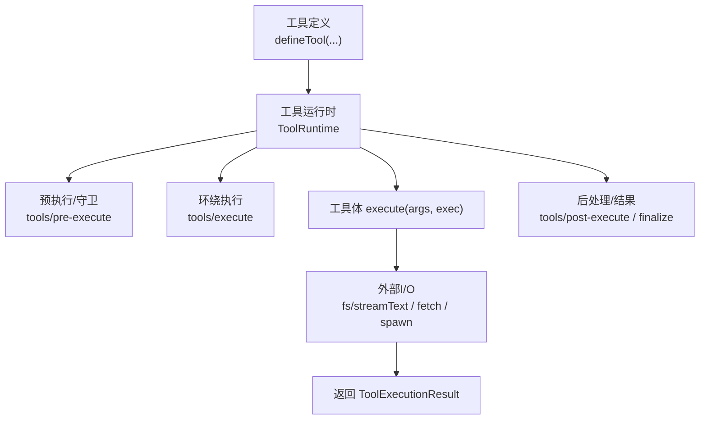
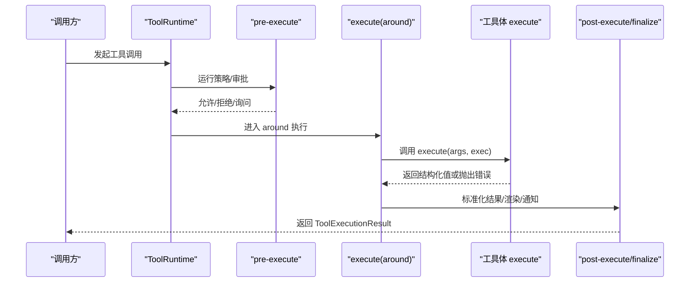
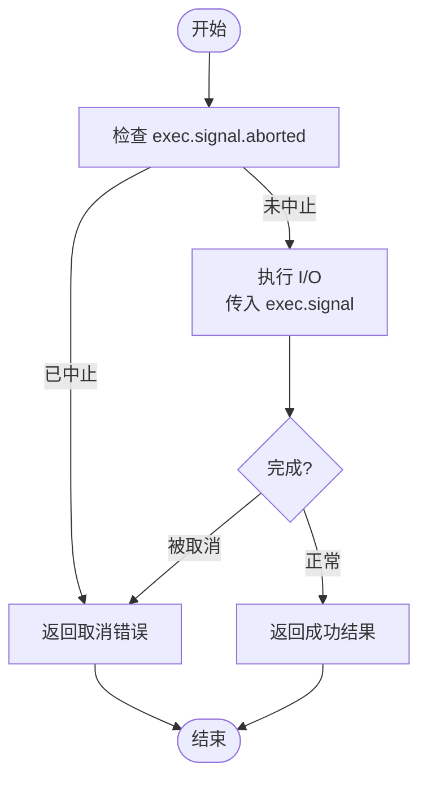
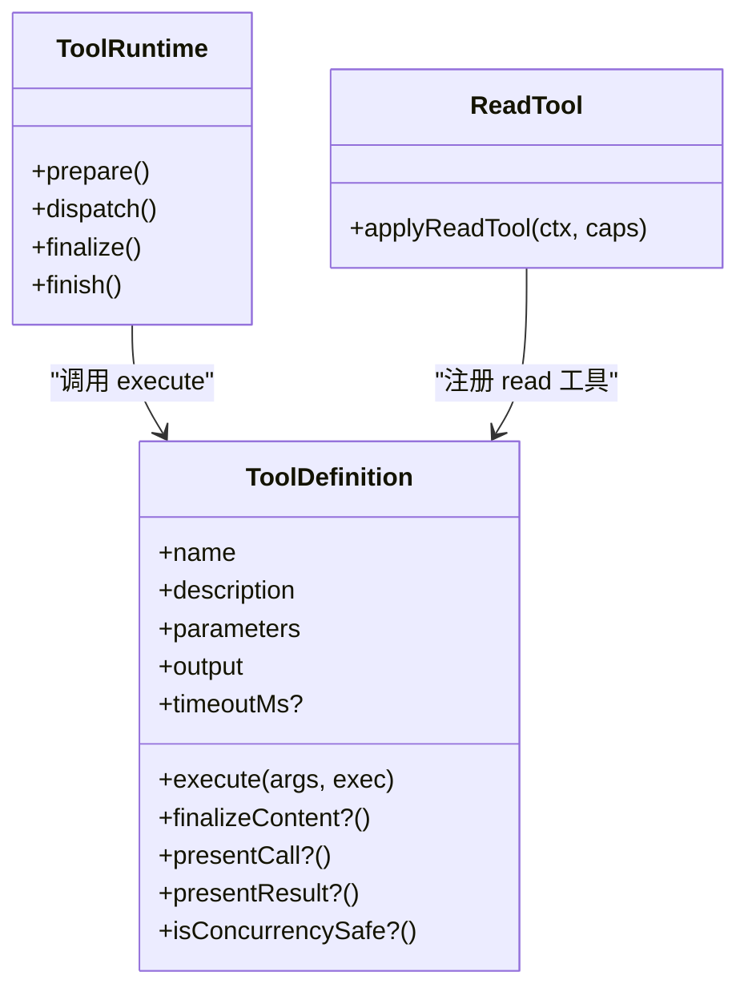

# execute函数规范

<cite>
**本文引用的文件**
- [packages/core/tools/src/index.ts](file://packages/core/tools/src/index.ts)
- [packages/core/tools/src/schema.ts](file://packages/core/tools/src/schema.ts)
- [packages/fs/tool-fs/src/read.ts](file://packages/fs/tool-fs/src/read.ts)
- [packages/core/tools/src/code-mode.ts](file://packages/core/tools/src/code-mode.ts)
- [packages/core/agent-loop/tests/cancel.spec.ts](file://packages/core/agent-loop/tests/cancel.spec.ts)
</cite>

## 目录
1. [简介](#简介)
2. [项目结构](#项目结构)
3. [核心组件](#核心组件)
4. [架构总览](#架构总览)
5. [详细组件分析](#详细组件分析)
6. [依赖关系分析](#依赖关系分析)
7. [性能考量](#性能考量)
8. [故障排查指南](#故障排查指南)
9. [结论](#结论)
10. [附录：常见场景示例与最佳实践](#附录：常见场景示例与最佳实践)

## 简介
本规范围绕工具执行入口 execute 的契约进行说明，覆盖函数签名、参数类型推断、返回值约束、同步与异步处理、任务取消（exec.signal）的正确用法，以及错误处理的最佳实践。文档同时给出文件读取、命令执行、API调用等典型场景的实现要点与参考路径，帮助开发者在统一框架下编写健壮、可观测、可取消的工具实现。

## 项目结构
- 工具注册与执行管线位于 core/tools 包，提供 defineTool、ToolDefinition、ToolRunContext、ToolExecutionResult 等核心类型与生命周期钩子。
- 文件系统工具（read/write/edit）作为具体工具实现，展示如何声明 schema、输出投影、呈现视图，并在 execute 中正确使用 exec.signal 进行流式读取与取消。
- Code Mode 将模型侧的“代码模式”包装为 run_code 工具，内部会创建子调度并传递/替换 exec.signal，用于演示嵌套执行与信号融合。
- 测试用例覆盖取消、并发、超时等边界行为，便于理解契约与异常路径。

图表来源
- [packages/core/tools/src/index.ts:221-288](file://packages/core/tools/src/index.ts#L221-L288)
- [packages/core/tools/src/index.ts:451-460](file://packages/core/tools/src/index.ts#L451-L460)
- [packages/core/tools/src/index.ts:555-580](file://packages/core/tools/src/index.ts#L555-L580)

章节来源
- [packages/core/tools/src/index.ts:221-288](file://packages/core/tools/src/index.ts#L221-L288)
- [packages/core/tools/src/index.ts:451-460](file://packages/core/tools/src/index.ts#L451-L460)
- [packages/core/tools/src/index.ts:555-580](file://packages/core/tools/src/index.ts#L555-L580)

## 核心组件
- 工具定义接口 ToolDefinition
  - name/description/parameters：描述工具元数据与入参 JSON Schema。
  - output.schema/render/presentationMeta：成功结果的规范化结构与渲染。
  - execute(args, exec)：核心执行逻辑，必须遵守取消与返回值约束。
  - finalizeContent/presentCall/presentResult/isConcurrencySafe/timeoutMs：可选能力，分别用于内容最终化、UI呈现、并发安全标注、协作超时。
- 执行上下文 ToolRunContext
  - 继承自 ToolExecutionInput，包含 callId/name/arguments/signal 等。
  - 提供 deferContext/concludeTurn 等扩展能力。
- 执行结果 ToolExecutionResult
  - 联合类型：成功（isError=false，含 value/content/meta 等）或失败（isError=true，含 error）。
- 取消信号 AbortSignal
  - 通过 exec.signal 传入；工具体及所有 I/O 必须监听或转发该信号，确保及时退出。

章节来源
- [packages/core/tools/src/index.ts:221-288](file://packages/core/tools/src/index.ts#L221-L288)
- [packages/core/tools/src/index.ts:314-424](file://packages/core/tools/src/index.ts#L314-L424)
- [packages/core/tools/src/index.ts:555-580](file://packages/core/tools/src/index.ts#L555-L580)

## 架构总览
工具执行由 ToolRuntime 编排，经历 pre-execute、execute（around）、post-execute、finalize/result 等阶段。execute 是工具体实际工作区，负责：
- 使用 exec.signal 进行取消感知
- 返回符合 output.schema 的 JSON 值
- 通过 output.render 生成面向模型的 content
- 可选择性设置 concludesTurn 以结束当前轮次

图表来源
- [packages/core/tools/src/index.ts:142-175](file://packages/core/tools/src/index.ts#L142-L175)
- [packages/core/tools/src/index.ts:451-460](file://packages/core/tools/src/index.ts#L451-L460)
- [packages/core/tools/src/index.ts:555-580](file://packages/core/tools/src/index.ts#L555-L580)

## 详细组件分析

### 函数签名与类型推断
- 工具定义通过 defineTool 声明 parameters 与 output.schema，框架据此推断 execute 的入参与返回值类型。
- execute 的 args 为已校验后的类型化参数；返回值需满足 output.schema 的约束。
- 若未声明 output.schema，则无法获得严格的返回值推断与校验。

章节来源
- [packages/core/tools/src/schema.ts:500-536](file://packages/core/tools/src/schema.ts#L500-L536)
- [packages/core/tools/src/schema.ts:545-618](file://packages/core/tools/src/schema.ts#L545-L618)

### 返回值约束与内容投影
- 成功结果：isError=false，value 必须可通过 output.schema 验证；content 由 output.render 生成；meta 可由 presentationMeta 提供。
- 失败结果：isError=true，error.message 为人类可读信息，info 可携带结构化错误码。
- 工具可将 concludesTurn=true 标记为本轮终止点。

章节来源
- [packages/core/tools/src/index.ts:211-219](file://packages/core/tools/src/index.ts#L211-L219)
- [packages/core/tools/src/index.ts:290-302](file://packages/core/tools/src/index.ts#L290-L302)
- [packages/core/tools/src/index.ts:555-580](file://packages/core/tools/src/index.ts#L555-L580)

### 同步与异步操作
- execute 应为异步函数，所有阻塞或长耗时操作应使用 Promise 或流式 API。
- 对于可能长时间运行的 I/O，必须检查或转发 exec.signal，避免资源泄漏。
- 对纯计算且无共享状态的操作，可配合 isConcurrencySafe 提升并行度。

章节来源
- [packages/core/tools/src/index.ts:221-288](file://packages/core/tools/src/index.ts#L221-L288)

### 使用 exec.signal 进行任务取消
- 所有外部 I/O（网络、进程、文件流）都应接收并传播 exec.signal。
- 当上游取消时，工具应及时中止并返回失败结果（通常由框架映射为 ABORTED/ABORTED_BEFORE_DISPATCH）。
- 在 Code Mode 中，run_code 会为子调度创建新的信号并与外层融合，确保取消语义正确。

图表来源
- [packages/core/tools/src/code-mode.ts:339-340](file://packages/core/tools/src/code-mode.ts#L339-L340)
- [packages/core/tools/src/code-mode.ts:640](file://packages/core/tools/src/code-mode.ts#L640)
- [packages/core/agent-loop/tests/cancel.spec.ts:821-823](file://packages/core/agent-loop/tests/cancel.spec.ts#L821-L823)

章节来源
- [packages/core/tools/src/code-mode.ts:339-340](file://packages/core/tools/src/code-mode.ts#L339-L340)
- [packages/core/tools/src/code-mode.ts:640](file://packages/core/tools/src/code-mode.ts#L640)
- [packages/core/agent-loop/tests/cancel.spec.ts:821-823](file://packages/core/agent-loop/tests/cancel.spec.ts#L821-L823)

### 错误处理最佳实践
- 优先抛出结构化错误（如 HarnessError 子类），以便框架识别并转换为 ToolExecutionFailure。
- 对输入校验失败，使用框架提供的 ToolArgsError（由 defineTool 自动触发）。
- 对业务错误，尽量返回 isError=true 的结果，而非仅抛异常，以便 UI 与日志一致。
- 对不可恢复错误（如未知工具、输出不合法），由框架抛出特定错误类。

章节来源
- [packages/core/tools/src/index.ts:468-522](file://packages/core/tools/src/index.ts#L468-L522)
- [packages/core/tools/src/schema.ts:585-589](file://packages/core/tools/src/schema.ts#L585-L589)

## 依赖关系分析
- ToolRuntime 依赖工具定义与事件管线（pre/execute/post/result），并通过 ToolDefinition.execute 驱动具体实现。
- 文件系统工具依赖 ctx.fs 服务，并以流式方式读取大文件，体现 exec.signal 的正确传播。
- Code Mode 作为复合工具，管理子调度的信号融合与并发上限。

图表来源
- [packages/core/tools/src/index.ts:221-288](file://packages/core/tools/src/index.ts#L221-L288)
- [packages/core/tools/src/index.ts:451-460](file://packages/core/tools/src/index.ts#L451-L460)
- [packages/fs/tool-fs/src/read.ts:69-208](file://packages/fs/tool-fs/src/read.ts#L69-L208)

章节来源
- [packages/core/tools/src/index.ts:221-288](file://packages/core/tools/src/index.ts#L221-L288)
- [packages/core/tools/src/index.ts:451-460](file://packages/core/tools/src/index.ts#L451-L460)
- [packages/fs/tool-fs/src/read.ts:69-208](file://packages/fs/tool-fs/src/read.ts#L69-L208)

## 性能考量
- 大文件读取采用流式处理，避免一次性加载到内存。
- 合理设置 timeoutMs，结合协作取消，防止长任务占用资源。
- 对无副作用的读操作，标记 isConcurrencySafe=true，提升并行吞吐。
- 控制 run_code 的 maxParallelSubCalls，避免子调用风暴。

章节来源
- [packages/fs/tool-fs/src/read.ts:142-151](file://packages/fs/tool-fs/src/read.ts#L142-L151)
- [packages/core/tools/src/index.ts:248-269](file://packages/core/tools/src/index.ts#L248-L269)
- [packages/core/tools/src/index.ts:666-674](file://packages/core/tools/src/index.ts#L666-L674)

## 故障排查指南
- 工具未注册：框架抛出 UNKNOWN_TOOL 错误，检查工具是否已注册或通过 code mode 间接暴露。
- 输出不合法：抛出 INVALID_TOOL_OUTPUT，核对 output.schema 与实际返回值。
- 取消未生效：确认所有 I/O 均接收并传播 exec.signal，且在循环/等待处检查 signal.aborted。
- 超时未触发：检查是否设置了 timeoutMs，并确保工具体能响应取消信号。

章节来源
- [packages/core/tools/src/index.ts:488-522](file://packages/core/tools/src/index.ts#L488-L522)
- [packages/core/tools/src/index.ts:248-269](file://packages/core/tools/src/index.ts#L248-L269)

## 结论
execute 是工具的核心执行点，必须遵循统一的签名、类型推断、返回值约束与取消契约。通过 output.schema/render 保证结果可序列化与可呈现；通过 exec.signal 实现可中断的异步流程；通过结构化错误与 post 阶段保障可观测性与一致性。遵循本规范可实现稳定、高效、易维护的工具生态。

## 附录：常见场景示例与最佳实践

### 文件读取（read）
- 关键点
  - 使用 ctx.fs.streamText 或 ctx.fs.readText，并传入 exec.signal。
  - 根据文件大小选择流式或整块读取，限制最大行数与字节数。
  - 通过 output.render 生成文本内容，presentationMeta 保留结构化窗口供 UI 回放。
- 参考路径
  - [packages/fs/tool-fs/src/read.ts:69-208](file://packages/fs/tool-fs/src/read.ts#L69-L208)

### 命令执行（shell/子进程）
- 关键点
  - 启动子进程后，将 exec.signal 传递给子进程或监听其 abort 事件以终止。
  - 捕获标准输出/错误，按 chunk 或行推送，避免内存膨胀。
  - 对超时与取消做双重保护：timeoutMs 与 exec.signal。
- 建议实现位置
  - 可在自定义工具中封装 shell 调用，复用 ToolDefinition 与 ToolExecutionResult。

### API 调用（HTTP/Fetch）
- 关键点
  - 使用支持 AbortSignal 的网络库发起请求，传入 exec.signal。
  - 对响应体进行分块读取或流式解析，及时释放资源。
  - 将网络错误映射为 ToolExecutionFailure，包含 message 与 info。
- 建议实现位置
  - 自定义工具中封装 HTTP 客户端，统一错误与重试策略。

### 取消与超时的协同
- 使用 timeoutMs 声明协作超时，框架会在 around 层注入取消。
- 工具体仍需主动检查 exec.signal，确保在阻塞点快速退出。
- 参考测试用例中的取消断言与行为。

章节来源
- [packages/core/agent-loop/tests/cancel.spec.ts:821-823](file://packages/core/agent-loop/tests/cancel.spec.ts#L821-L823)