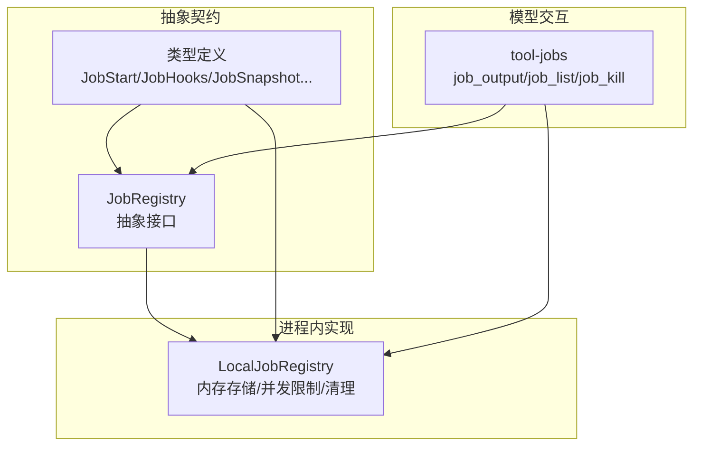
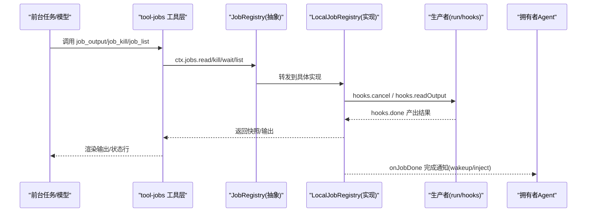
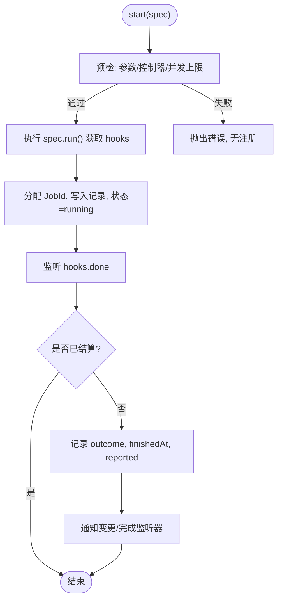
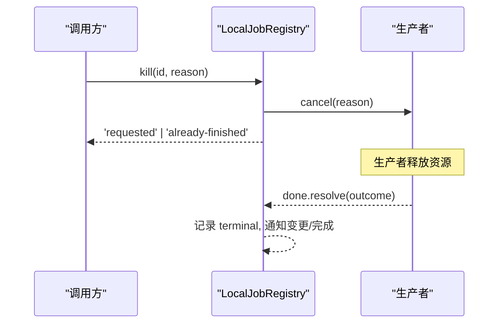
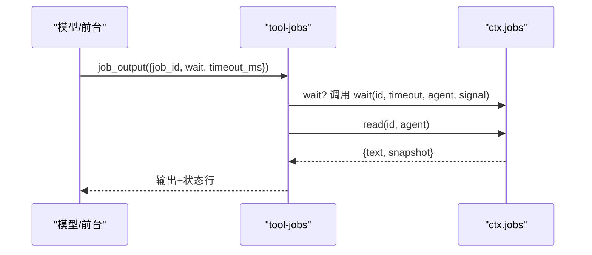
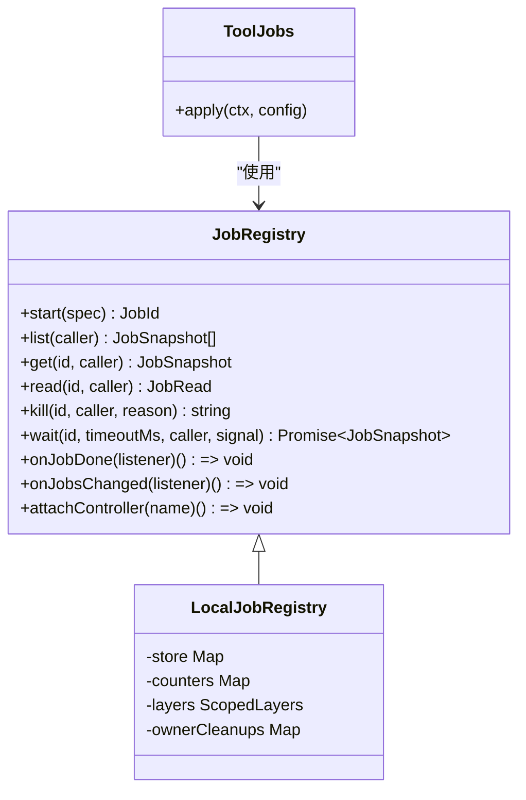

# 后台作业管理

<cite>
**本文引用的文件**
- [jobs.md](file://docs/subsystems/jobs.md)
- [jobs.zh.md](file://docs/subsystems/jobs.zh.md)
- [index.ts（抽象接口）](file://packages/jobs/jobs/src/index.ts)
- [types.ts（类型定义）](file://packages/jobs/jobs/src/types.ts)
- [index.ts（本地实现）](file://packages/jobs/jobs-local/src/index.ts)
- [index.ts（工具层）](file://packages/jobs/tool-jobs/src/index.ts)
- [background-job-admission.cordis.yml](file://examples/acp-agent/background-job-admission.cordis.yml)
</cite>

## 目录
1. [简介](#简介)
2. [项目结构](#项目结构)
3. [核心组件](#核心组件)
4. [架构总览](#架构总览)
5. [详细组件分析](#详细组件分析)
6. [依赖关系分析](#依赖关系分析)
7. [性能与容量控制](#性能与容量控制)
8. [故障排查指南](#故障排查指南)
9. [结论](#结论)
10. [附录：完整示例与最佳实践](#附录完整示例与最佳实践)

## 简介
本章节面向“后台作业”的端到端使用与管理，覆盖以下目标：
- 如何使用 ctx.jobs.start 注册长时间运行的任务，包括作业配置、生命周期管理与状态跟踪。
- 作业的取消机制、资源清理与错误处理。
- 作业 ID 的生成与管理方式。
- 在前台任务中如何获取后台作业的状态与控制接口。
- 提供文件处理、数据导出、批量操作等场景的完整示例路径与调用流程说明。

## 项目结构
后台作业能力由三层组成：
- 抽象契约层：定义 JobRegistry 抽象类与统一类型，暴露 ctx.jobs 能力。
- 进程内实现层：LocalJobRegistry 维护内存中的作业记录、授权、并发限制、等待/通知、服务销毁时的清理。
- 模型交互层：tool-jobs 插件将作业能力暴露为 job_output、job_list、job_kill 三个工具，并负责完成通知投递与输出截断。

图表来源
- [index.ts（抽象接口）:62-176](file://packages/jobs/jobs/src/index.ts#L62-L176)
- [types.ts:1-161](file://packages/jobs/jobs/src/types.ts#L1-L161)
- [index.ts（本地实现）:91-129](file://packages/jobs/jobs-local/src/index.ts#L91-L129)
- [index.ts（工具层）:205-260](file://packages/jobs/tool-jobs/src/index.ts#L205-L260)

章节来源
- [jobs.md:1-291](file://docs/subsystems/jobs.md#L1-L291)
- [jobs.zh.md:1-291](file://docs/subsystems/jobs.zh.md#L1-L291)

## 核心组件
- 抽象接口 JobRegistry：定义 start/list/get/read/kill/wait/onJobDone/onJobsChanged/attachController 等方法，规定所有权、隔离、结算顺序与控制器挂载语义。
- 类型体系：JobKindMap、JobStatus、JobStart、JobHooks、JobOutcome、JobSnapshot、JobRead、JobDoneListener、JobsChangedListener 等。
- 本地实现 LocalJobRegistry：进程内内存存储、按 owner 会话隔离访问、并发上限控制、waiter 集合与通知、服务/owner 销毁时强制清理。
- 工具层 tool-jobs：对外暴露 job_output/job_list/job_kill，完成通知投递（wakeup/inject），输出字节上限裁剪，系统提示引导。

章节来源
- [index.ts（抽象接口）:62-176](file://packages/jobs/jobs/src/index.ts#L62-L176)
- [types.ts:1-161](file://packages/jobs/jobs/src/types.ts#L1-L161)
- [index.ts（本地实现）:91-129](file://packages/jobs/jobs-local/src/index.ts#L91-L129)
- [index.ts（工具层）:205-403](file://packages/jobs/tool-jobs/src/index.ts#L205-L403)

## 架构总览
下图展示了从“前台任务”到“后台作业”的完整调用链：前台通过工具层调用 ctx.jobs 的 read/kill/wait，底层由 LocalJobRegistry 维护状态并驱动生产者 Hook；作业完成后通过 onJobDone 通知投递给拥有者 Agent。

图表来源
- [index.ts（工具层）:302-401](file://packages/jobs/tool-jobs/src/index.ts#L302-L401)
- [index.ts（抽象接口）:73-176](file://packages/jobs/jobs/src/index.ts#L73-L176)
- [index.ts（本地实现）:131-228](file://packages/jobs/jobs-local/src/index.ts#L131-L228)
- [index.ts（本地实现）:416-440](file://packages/jobs/jobs-local/src/index.ts#L416-L440)

## 详细组件分析

### 作业注册与生命周期
- 注册入口：ctx.jobs.start(spec)，spec 包含 kind、label、可选 outputLimitBytes、可选 owner、以及同步启动器 run()。
- 预检与准入：校验参数、检查是否有控制器服务于该 owner、统计当前活跃作业数是否超过上限。
- 身份与 ID：按 kind 递增计数生成 <kind>-N 的 JobId，作为可预测但需授权控制的标识。
- 生命周期：running → stopping（被 kill 或 teardown）→ completed/killed/failed；done 在资源释放后 resolve。
- 完成结算：首次结算优先，标记 reported，释放 waiters，通知变更监听器，最后通知完成监听器。

图表来源
- [index.ts（本地实现）:131-189](file://packages/jobs/jobs-local/src/index.ts#L131-L189)
- [index.ts（本地实现）:416-440](file://packages/jobs/jobs-local/src/index.ts#L416-L440)

章节来源
- [types.ts:41-91](file://packages/jobs/jobs/src/types.ts#L41-L91)
- [index.ts（抽象接口）:73-82](file://packages/jobs/jobs/src/index.ts#L73-L82)
- [index.ts（本地实现）:131-189](file://packages/jobs/jobs-local/src/index.ts#L131-L189)

### 状态跟踪与消费视图
- JobSnapshot：只读投影，包含 id、kind、label、outputLimitBytes、ownerSession、status、detail、startedAt、finishedAt、reported。
- JobRead：流式作业返回自上次读取以来的增量文本；最终输出型作业在未结算时为空，结算后幂等返回最终输出。
- 报告位 reported：当 kill/read/wait/teardown cancel 已经报告或承诺报告终止状态时为真，用于抑制重复完成通知。

章节来源
- [types.ts:93-140](file://packages/jobs/jobs/src/types.ts#L93-L140)
- [index.ts（本地实现）:192-213](file://packages/jobs/jobs-local/src/index.ts#L192-L213)

### 取消、资源清理与错误处理
- 取消：ctx.jobs.kill(id, caller?, reason?) 立即请求终止，并将作业置为 stopping 且 reported；生产者的 cancel 必须同步、幂等并最终让 done  settle。
- 资源清理：producer 负责释放资源；registry 在 owner 或服务销毁时对所有活跃作业发起 teardown 取消，若 cancel 抛错则仅强制失败记录并告警。
- 错误处理：
  - 生产者 done 拒绝会被捕获并转为 failed。
  - wait 支持超时与 AbortSignal，区分超时与主动中止。
  - 访问控制：对 owned 作业，非 owner 调用会抛错。

图表来源
- [index.ts（本地实现）:215-228](file://packages/jobs/jobs-local/src/index.ts#L215-L228)
- [index.ts（本地实现）:466-531](file://packages/jobs/jobs-local/src/index.ts#L466-L531)
- [types.ts:71-91](file://packages/jobs/jobs/src/types.ts#L71-L91)

章节来源
- [index.ts（本地实现）:215-228](file://packages/jobs/jobs-local/src/index.ts#L215-L228)
- [index.ts（本地实现）:466-531](file://packages/jobs/jobs-local/src/index.ts#L466-L531)
- [types.ts:71-91](file://packages/jobs/jobs/src/types.ts#L71-L91)

### 作业 ID 的生成与管理
- 生成规则：<kind>-N，kind 来自 JobKindMap 扩展；同一 kind 下单调递增。
- 管理要点：ID 可预测，安全边界基于 session 授权而非保密性；list/get/read/kill 均进行 caller 与 owner 的匹配校验。

章节来源
- [jobs.md:7-22](file://docs/subsystems/jobs.md#L7-L22)
- [jobs.zh.md:7-22](file://docs/subsystems/jobs.zh.md#L7-L22)
- [index.ts（本地实现）:150-154](file://packages/jobs/jobs-local/src/index.ts#L150-L154)
- [index.ts（本地实现）:356-359](file://packages/jobs/jobs-local/src/index.ts#L356-L359)

### 前台任务中的状态与控制接口
- 列出作业：job_list → ctx.jobs.list(caller)
- 读取输出：job_output → ctx.jobs.read(id, caller)；可选 wait + timeout_ms
- 取消作业：job_kill → ctx.jobs.kill(id, caller, reason?)
- 完成通知：onJobDone 自动投递到拥有者（idle 时 wakeup，busy 时 inject），受 completionDelivery 与 maxConsecutiveWakes 控制。

图表来源
- [index.ts（工具层）:302-340](file://packages/jobs/tool-jobs/src/index.ts#L302-L340)
- [index.ts（抽象接口）:122-133](file://packages/jobs/jobs/src/index.ts#L122-L133)

章节来源
- [index.ts（工具层）:302-401](file://packages/jobs/tool-jobs/src/index.ts#L302-L401)
- [index.ts（抽象接口）:84-133](file://packages/jobs/jobs/src/index.ts#L84-L133)

## 依赖关系分析
- 抽象契约与实现解耦：JobRegistry 仅定义方法签名与语义；LocalJobRegistry 提供进程内实现。
- 作用域与控制器：tool-jobs 通过 attachController('tool-jobs') 使生产者可在其作用域内启动作业；未挂载控制器时 start 会拒绝。
- 通知与可见集：onJobDone 与 onJobsChanged 按 owner 的作用域链投递，避免跨 preset 污染。

图表来源
- [index.ts（抽象接口）:62-176](file://packages/jobs/jobs/src/index.ts#L62-L176)
- [index.ts（本地实现）:91-129](file://packages/jobs/jobs-local/src/index.ts#L91-L129)
- [index.ts（工具层）:205-260](file://packages/jobs/tool-jobs/src/index.ts#L205-L260)

章节来源
- [index.ts（抽象接口）:62-176](file://packages/jobs/jobs/src/index.ts#L62-L176)
- [index.ts（本地实现）:91-129](file://packages/jobs/jobs-local/src/index.ts#L91-L129)
- [index.ts（工具层）:205-260](file://packages/jobs/tool-jobs/src/index.ts#L205-L260)

## 性能与容量控制
- 并发上限：LocalJobRegistry 默认每个 exact owner 最多 10 个 running/stopping 作业；可通过配置调整。
- 输出大小限制：JobStart.outputLimitBytes 限制单次模型可见的完成通知或输出读取的 UTF-8 字节上限；tool-jobs 会在渲染时截断并追加省略提示。
- 等待上限：tool-jobs 的 waitTimeoutMs 与 maxWaitTimeoutMs 限制 job_output 的阻塞时长，防止长轮询滥用。
- 唤醒预算：completionDelivery='wakeup' 时，maxConsecutiveWakes 限制连续唤醒次数，避免自我激化循环。

章节来源
- [index.ts（本地实现）:31-37](file://packages/jobs/jobs-local/src/index.ts#L31-L37)
- [index.ts（本地实现）:92-98](file://packages/jobs/jobs-local/src/index.ts#L92-L98)
- [index.ts（工具层）:31-53](file://packages/jobs/tool-jobs/src/index.ts#L31-L53)
- [index.ts（工具层）:111-167](file://packages/jobs/tool-jobs/src/index.ts#L111-L167)

## 故障排查指南
- 无法启动作业：检查是否已 attachController；确认 owner 在当前作用域有控制器服务。
- 权限错误：确保调用方为作业 owner 或作业为 unowned；否则 get/read/kill 会抛错。
- 并发超限：达到 per-owner 上限时会拒绝新作业；先 kill 或等待已有作业结算。
- 等待超时：wait 超时返回运行态快照；如需继续等待请再次调用。
- 完成通知未送达：检查 reported 标志；若已被其他消费者报告或 teardown 已标记，不会重复投递。
- 生产者异常：done 拒绝会被捕获并转为 failed；查看 detail 定位原因。

章节来源
- [index.ts（本地实现）:131-148](file://packages/jobs/jobs-local/src/index.ts#L131-L148)
- [index.ts（本地实现）:199-213](file://packages/jobs/jobs-local/src/index.ts#L199-L213)
- [index.ts（本地实现）:230-279](file://packages/jobs/jobs-local/src/index.ts#L230-L279)
- [index.ts（本地实现）:416-440](file://packages/jobs/jobs-local/src/index.ts#L416-L440)

## 结论
后台作业子系统通过抽象契约、进程内实现与模型工具层的分层设计，提供了安全的作业注册、可控的生命周期、细粒度的状态跟踪与完善的取消/清理/错误处理机制。借助 job_output/job_list/job_kill 三件套，前台任务可以稳定地编排与观测长时间运行的工作负载，并通过输出字节上限与等待上限保障整体稳定性。

## 附录：完整示例与最佳实践

### 示例一：文件处理（流式输出）
- 生产者：run() 启动文件处理任务，hooks.readOutput 持续返回增量文本，hooks.done 在资源释放后 resolve。
- 前台：job_output(job_id, wait=true, timeout_ms=...) 轮询或阻塞等待；job_list 查看作业列表；job_kill 取消耗时任务。
- 参考路径
  - 类型与契约：[types.ts:41-91](file://packages/jobs/jobs/src/types.ts#L41-L91)
  - 本地实现 read/kill/wait：[index.ts（本地实现）:205-279](file://packages/jobs/jobs-local/src/index.ts#L205-L279)
  - 工具层 job_output/job_list/job_kill：[index.ts（工具层）:302-401](file://packages/jobs/tool-jobs/src/index.ts#L302-L401)

### 示例二：数据导出（最终输出）
- 生产者：无需 readOutput，仅在 done 中返回最终输出字符串。
- 前台：job_output 在未结算时返回空文本，结算后幂等返回最终输出；配合 statusLine 展示完成状态。
- 参考路径
  - 最终输出语义：[types.ts:130-140](file://packages/jobs/jobs/src/types.ts#L130-L140)
  - 工具层渲染与截断：[index.ts（工具层）:111-167](file://packages/jobs/tool-jobs/src/index.ts#L111-L167)

### 示例三：批量操作（并发与限流）
- 配置：通过 tasks.maxConcurrentJobsPerOwner 限制每 owner 并发；示例见 overlay 配置。
- 行为：超出上限时 start 直接拒绝；建议先 job_list 查看活跃作业，必要时 job_kill 释放槽位。
- 参考路径
  - 配置与默认值：[index.ts（本地实现）:31-37](file://packages/jobs/jobs-local/src/index.ts#L31-L37)
  - 示例配置：[background-job-admission.cordis.yml:19-21](file://examples/acp-agent/background-job-admission.cordis.yml#L19-L21)

### 最佳实践清单
- 始终为作业设置清晰的 label 与 kind，便于追踪与审计。
- 合理设置 outputLimitBytes，避免大输出导致消息过大。
- 使用 job_output 的 wait 与 timeout 组合，避免忙轮询。
- 在 owner 作用域内启动作业，确保生命周期与清理正确。
- 及时调用 job_list 与 job_kill 管理长期运行的任务。
- 利用 onJobDone 完成通知，减少轮询开销。

章节来源
- [background-job-admission.cordis.yml:19-21](file://examples/acp-agent/background-job-admission.cordis.yml#L19-L21)
- [index.ts（工具层）:302-401](file://packages/jobs/tool-jobs/src/index.ts#L302-L401)
- [index.ts（本地实现）:31-37](file://packages/jobs/jobs-local/src/index.ts#L31-L37)