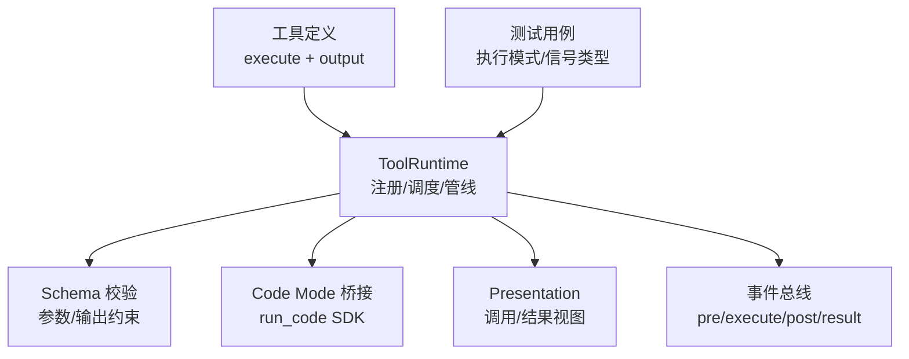
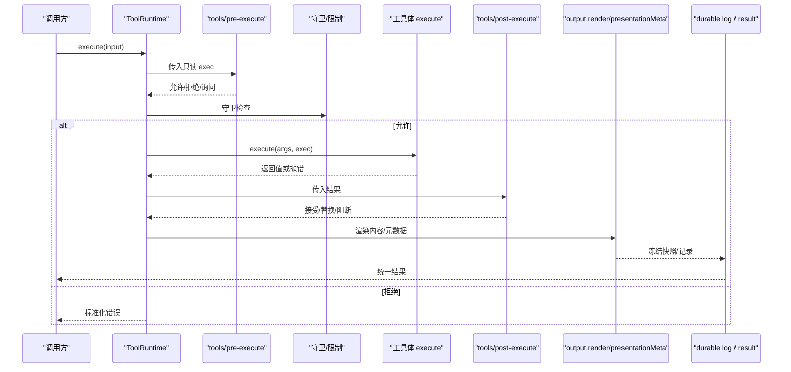
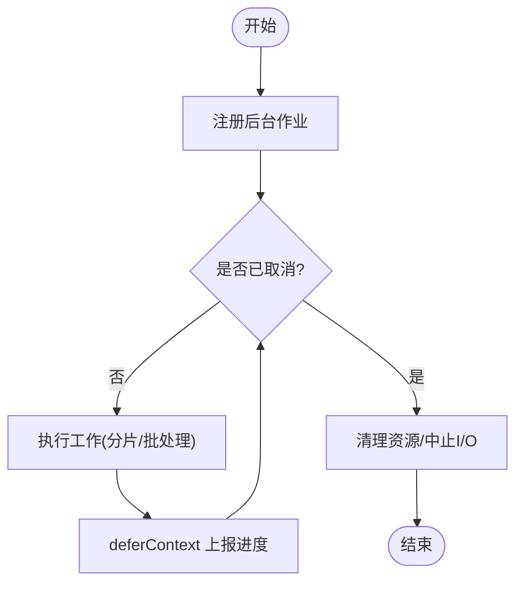
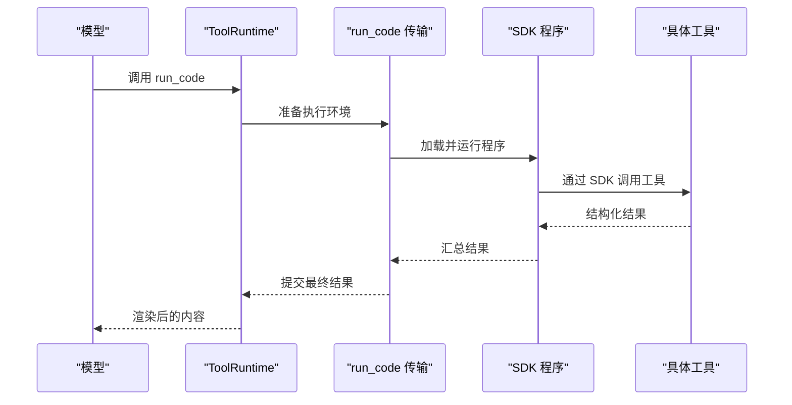
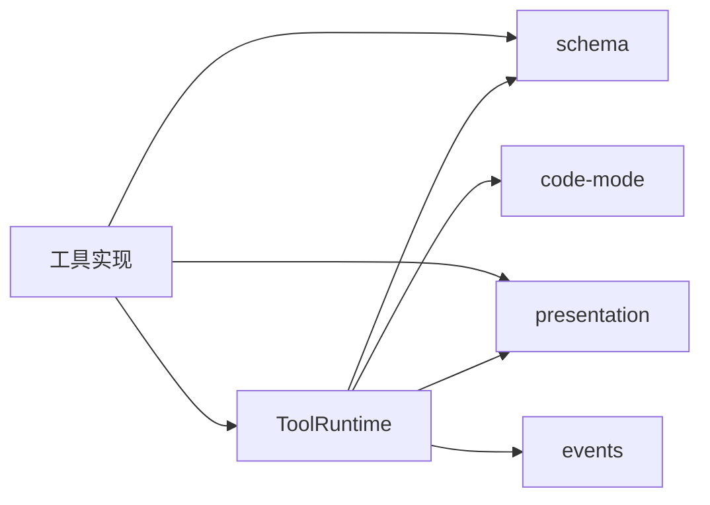

# 工具实现指南

<cite>
**本文引用的文件**
- [packages/core/tools/src/index.ts](file://packages/core/tools/src/index.ts)
- [packages/core/tools/src/types.ts](file://packages/core/tools/src/types.ts)
- [packages/core/tools/tests/execution-mode.spec.ts](file://packages/core/tools/tests/execution-mode.spec.ts)
- [packages/core/tools/tests/execution-signal-types.spec.ts](file://packages/core/tools/tests/execution-signal-types.spec.ts)
- [packages/core/tools/src/code-mode.ts](file://packages/core/tools/src/code-mode.ts)
- [packages/core/tools/src/schema.ts](file://packages/core/tools/src/schema.ts)
- [packages/core/tools/src/presentation.ts](file://packages/core/tools/src/presentation.ts)
- [packages/core/tools/src/ts-types.ts](file://packages/core/tools/src/ts-types.ts)
- [packages/core/tools/src/py-types.ts](file://packages/core/tools/src/py-types.ts)
- [packages/jobs/tool-jobs/tests/tool-jobs.spec.ts](file://packages/jobs/tool-jobs/tests/tool-jobs.spec.ts)
- [packages/fs/tool-fs/tests/tools.spec.ts](file://packages/fs/tool-fs/tests/tools.spec.ts)
- [docs/subsystems/tools.md](file://docs/subsystems/tools.md)
- [docs/subsystems/jobs.md](file://docs/subsystems/jobs.md)
- [docs/subsystems/shell.md](file://docs/subsystems/shell.md)
</cite>

## 目录
1. [简介](#简介)
2. [项目结构](#项目结构)
3. [核心组件](#核心组件)
4. [架构总览](#架构总览)
5. [详细组件分析](#详细组件分析)
6. [依赖关系分析](#依赖关系分析)
7. [性能考量](#性能考量)
8. [故障排查指南](#故障排查指南)
9. [结论](#结论)
10. [附录](#附录)

## 简介
本指南面向需要在 deepseek-harness 中实现“工具”的开发者，聚焦以下目标：
- 深入讲解 execute 函数的实现规范：参数处理、错误处理策略、异步与取消支持。
- 解释 exec 对象的用法：信号（AbortSignal）传播、上下文注入、以及 token/执行标识管理。
- 说明长时间运行任务的处理方式：后台作业注册、取消机制、状态管理与进度报告。
- 提供从简单文件操作到复杂业务逻辑封装的完整示例路径。
- 指导如何处理流式响应、进度上报与资源清理。

## 项目结构
工具子系统位于 packages/core/tools，围绕 ToolRuntime 构建统一的注册、调度与执行管线；同时通过 code-mode 提供“代码模式”的 SDK 桥接能力，并通过 schema/presentation 等模块完成参数校验、模型可见性描述与 UI 呈现。

图表来源
- [packages/core/tools/src/index.ts:787-1200](file://packages/core/tools/src/index.ts#L787-L1200)
- [packages/core/tools/src/code-mode.ts](file://packages/core/tools/src/code-mode.ts)
- [packages/core/tools/src/schema.ts](file://packages/core/tools/src/schema.ts)
- [packages/core/tools/src/presentation.ts](file://packages/core/tools/src/presentation.ts)

章节来源
- [packages/core/tools/src/index.ts:787-1200](file://packages/core/tools/src/index.ts#L787-L1200)

## 核心组件
- ToolDefinition：工具契约，包含 name/description/parameters/output.execute/finalizeContent/presentCall/presentResult/isConcurrencySafe/timeoutMs 等。
- ToolExecutionInput/ToolExecution/ToolRunContext：一次调用的输入、执行期只读视图、以及可延后上下文/结束本轮的工具体上下文。
- ToolExecutionResult：成功/失败的可区分联合类型，统一 content/value/meta/additionalContexts/concludesTurn。
- ToolRuntime：注册表与执行管线，提供 register/restrict/guard/schemas/execute 等能力，并暴露 pre/execute/post/result 事件水线。
- Code Mode 桥接：在 code 模式下以 run_code 作为唯一入口，内部再分发到具体工具。

章节来源
- [packages/core/tools/src/index.ts:221-460](file://packages/core/tools/src/index.ts#L221-L460)
- [packages/core/tools/src/index.ts:787-1200](file://packages/core/tools/src/index.ts#L787-L1200)

## 架构总览
下图展示一次工具调用从进入 ToolRuntime 到返回结果的完整流程，包括参数校验、策略水线、工具体执行、结果投影与持久化。

图表来源
- [packages/core/tools/src/index.ts:137-208](file://packages/core/tools/src/index.ts#L137-L208)
- [packages/core/tools/src/index.ts:555-600](file://packages/core/tools/src/index.ts#L555-L600)

## 详细组件分析

### execute 函数实现规范
- 参数处理
  - 入参由 schema 严格校验，确保 lossless JSON；工具体接收到的 args 是已解析且不可变的值。
  - 输出必须声明 output.schema，并在最终阶段进行校验与投影。
- 错误处理策略
  - 未知工具抛出结构化错误（UNKNOWN_TOOL）。
  - 工具体抛错会被捕获为 ToolExecutionFailure，并生成标准化的 message/info。
  - 输出投影失败会转换为 ToolOutputError，携带违规信息。
- 异步与取消
  - 工具体必须观察 exec.signal（AbortSignal），并在取消时尽快达到静默点。
  - 管线会在 around 包装层融合 caller 的取消信号，保证外部取消能穿透到工具体。
  - 若工具声明 timeoutMs，将由策略层在超时后触发取消。
- 并发与并行
  - isConcurrencySafe 决定该调用是否可与兄弟调用并行；未声明或返回非 true 则默认独占。
  - 测试覆盖了分类器异常、非法参数、原始定义传参等边界。

章节来源
- [packages/core/tools/src/index.ts:221-288](file://packages/core/tools/src/index.ts#L221-L288)
- [packages/core/tools/src/index.ts:468-522](file://packages/core/tools/src/index.ts#L468-L522)
- [packages/core/tools/src/index.ts:555-600](file://packages/core/tools/src/index.ts#L555-L600)
- [packages/core/tools/tests/execution-mode.spec.ts:27-141](file://packages/core/tools/tests/execution-mode.spec.ts#L27-L141)

### exec 对象用法：信号、上下文与令牌
- 信号（AbortSignal）
  - 所有只读视图（ToolExecutionInput/ToolExecution/ToolRunContext）都强制要求 AbortSignal，且不可被移除或替换为 undefined。
  - only tools/execute 的 around 包装可替换信号，但仍需保留其存在性。
- 上下文注入
  - ToolRunContext.deferContext 可在工具体内延后追加用户消息（如子调用上下文），在最终结果提交时一并发出。
  - concludeTurn 可将当前结果标记为“终止本轮”，用于控制会话轮次。
- 令牌与身份
  - 每次执行由注册表分配 token，嵌套调用通过 parent 令牌关联父执行，便于追踪与审计。
  - rootCallId 始终指向根模型请求，便于跨层级归因。

章节来源
- [packages/core/tools/src/index.ts:304-424](file://packages/core/tools/src/index.ts#L304-L424)
- [packages/core/tools/tests/execution-signal-types.spec.ts:1-104](file://packages/core/tools/tests/execution-signal-types.spec.ts#L1-L104)

### 长时间运行任务：后台作业、取消与状态
- 后台作业注册
  - 使用 jobs 工具将耗时任务注册为后台作业，避免阻塞主循环。
  - 作业具备生命周期与状态查询能力，适合批处理、长耗时 I/O。
- 取消机制
  - 作业应监听 exec.signal，收到取消后尽快释放资源并退出。
  - 对于无法中断的外部进程/网络请求，应在外层做超时与取消转发。
- 状态管理与进度报告
  - 通过 deferContext 周期性上报进度片段，使 UI/日志可观测。
  - 最终结果经 output.render 投影为模型可读内容，并冻结快照用于持久化。

图表来源
- [packages/jobs/tool-jobs/tests/tool-jobs.spec.ts](file://packages/jobs/tool-jobs/tests/tool-jobs.spec.ts)
- [packages/core/tools/src/index.ts:404-424](file://packages/core/tools/src/index.ts#L404-L424)

章节来源
- [packages/jobs/tool-jobs/tests/tool-jobs.spec.ts](file://packages/jobs/tool-jobs/tests/tool-jobs.spec.ts)
- [docs/subsystems/jobs.md](file://docs/subsystems/jobs.md)

### 流式响应、进度报告与资源清理
- 流式响应
  - 工具体可通过多次 deferContext 推送增量内容，UI 可实时渲染。
  - 注意保持每条消息的幂等性与可重放性。
- 进度报告
  - 建议按固定间隔或关键里程碑上报，避免过度刷屏。
  - 进度内容应为 lossless JSON 片段，便于回放与审计。
- 资源清理
  - 在 finally 块中关闭句柄、断开连接、删除临时文件。
  - 对可取消的 I/O 务必监听 exec.signal，及时中断。

章节来源
- [packages/core/tools/src/index.ts:404-424](file://packages/core/tools/src/index.ts#L404-L424)

### 代码模式（Code Mode）与 run_code 桥接
- 在 code 模式下，模型仅可直接调用 run_code，SDK 生成的提示会引导其在程序内调用工具。
- ToolRuntime 会按需创建 run_code 传输工具，负责将 SDK 内的工具调用桥接到原生执行管线。
- 支持 TypeScript/Python 两种语言渲染，运行时语言需在配置中可用。

图表来源
- [packages/core/tools/src/index.ts:855-1001](file://packages/core/tools/src/index.ts#L855-L1001)
- [packages/core/tools/src/code-mode.ts](file://packages/core/tools/src/code-mode.ts)

章节来源
- [packages/core/tools/src/index.ts:855-1001](file://packages/core/tools/src/index.ts#L855-L1001)
- [packages/core/tools/src/code-mode.ts](file://packages/core/tools/src/code-mode.ts)

### 参数与输出校验、呈现
- 参数校验
  - 使用 schema 模块提供的 valueSchemaSpecToJsonSchema/validateArgs 等能力，确保入参符合预期。
- 输出投影
  - output.render 将结构化值转为 ContentBlock[]，供模型消费。
  - presentationMeta 可选，用于 UI 的二次呈现。
- 安全与可重放
  - 所有投影结果会被冻结并序列化快照，保证回放一致性与安全性。

章节来源
- [packages/core/tools/src/schema.ts](file://packages/core/tools/src/schema.ts)
- [packages/core/tools/src/presentation.ts](file://packages/core/tools/src/presentation.ts)
- [packages/core/tools/src/ts-types.ts](file://packages/core/tools/src/ts-types.ts)
- [packages/core/tools/src/py-types.ts](file://packages/core/tools/src/py-types.ts)

## 依赖关系分析
- ToolRuntime 依赖：
  - schema：参数/输出校验
  - presentation：调用/结果视图
  - code-mode：run_code 传输与 SDK 渲染
  - events：pre/execute/post/result 水线与 result 事件
- 工具实现依赖：
  - 工具体通过 ToolRunContext 访问 exec、deferContext、concludeTurn。
  - 通过 output.render 产出模型可读内容。

图表来源
- [packages/core/tools/src/index.ts:787-1200](file://packages/core/tools/src/index.ts#L787-L1200)

章节来源
- [packages/core/tools/src/index.ts:787-1200](file://packages/core/tools/src/index.ts#L787-L1200)

## 性能考量
- 并发控制
  - 合理声明 isConcurrencySafe，让可并行的工具获得更高吞吐。
  - 对共享状态加锁或使用无共享设计，避免竞态。
- 超时与取消
  - 为长耗时工具设置 timeoutMs，结合 exec.signal 快速回收资源。
- 投影成本
  - output.render 应保持纯函数与低开销，避免在大对象上重复计算。
- 日志与快照
  - 谨慎上报大量进度，避免阻塞主循环与放大存储。

[本节为通用指导，不直接分析具体文件]

## 故障排查指南
- 常见错误
  - 未知工具：检查名称是否正确注册，或在 code 模式下是否通过 run_code 调用。
  - 输出无效：确认 output.schema 与实际返回值匹配，避免非 lossless JSON。
  - 取消未生效：确认工具体监听了 exec.signal，并在关键节点检查取消状态。
- 定位方法
  - 通过 tools/result 事件获取冻结的最终结果快照。
  - 借助 tools/code-dispatch-start/code-dispatch 事件追踪子调用时序。
  - 使用 schemas() 核对模型可见的工具集合是否与预期一致。

章节来源
- [packages/core/tools/src/index.ts:137-208](file://packages/core/tools/src/index.ts#L137-L208)
- [packages/core/tools/src/index.ts:494-522](file://packages/core/tools/src/index.ts#L494-L522)

## 结论
本指南梳理了 deepseek-harness 工具子系统的核心实现要点：以 ToolRuntime 为中心的注册与执行管线、严格的参数与输出校验、完善的取消与超时机制、以及 code mode 下的 SDK 桥接。遵循本文规范可实现健壮、可观测、可维护的工具，既能承载简单文件操作，也能支撑复杂的后台作业与流式交互。

[本节为总结，不直接分析具体文件]

## 附录
- 参考文档
  - 工具子系统概览与最佳实践
  - 作业子系统的使用与状态管理
  - Shell 工具的执行与取消

章节来源
- [docs/subsystems/tools.md](file://docs/subsystems/tools.md)
- [docs/subsystems/jobs.md](file://docs/subsystems/jobs.md)
- [docs/subsystems/shell.md](file://docs/subsystems/shell.md)