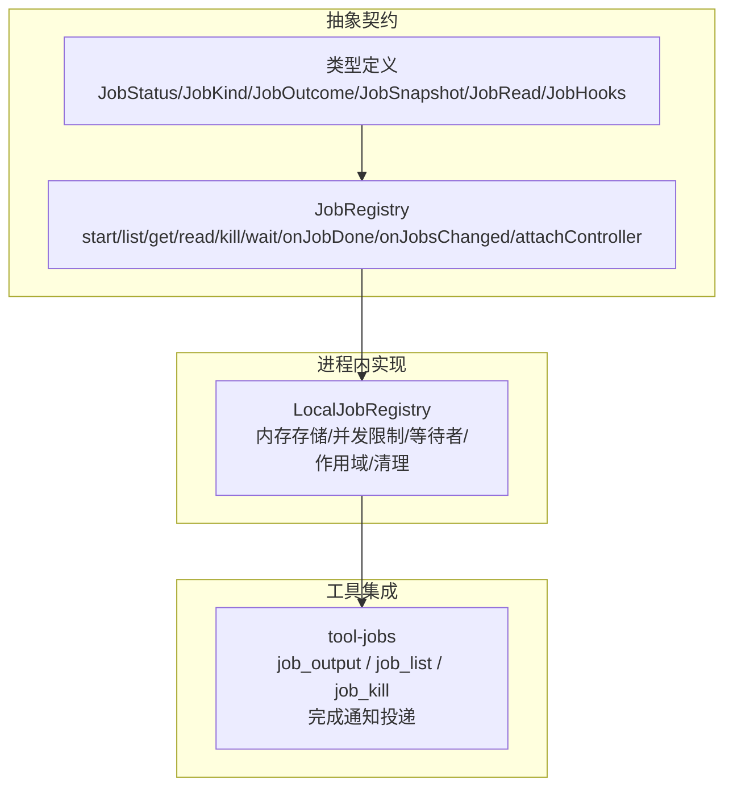
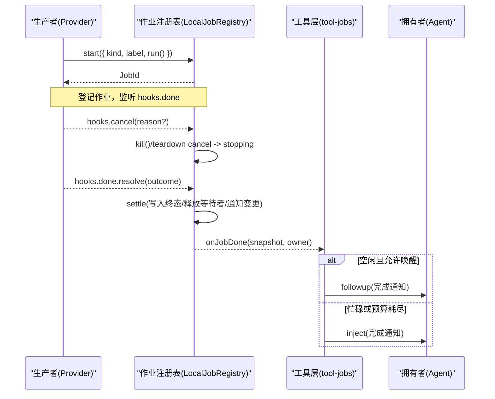
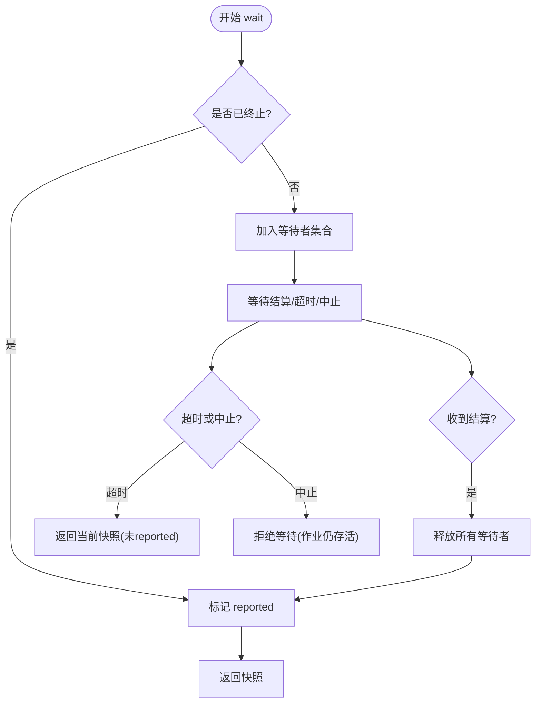
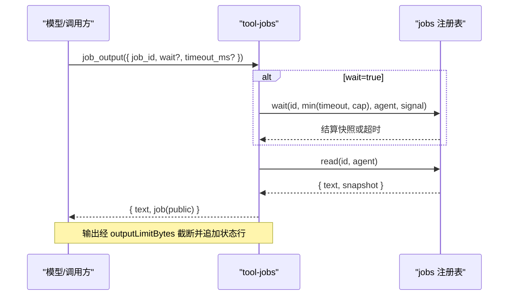

# 异步操作处理

<cite>
**本文引用的文件**
- [packages/jobs/jobs/src/index.ts](file://packages/jobs/jobs/src/index.ts)
- [packages/jobs/jobs/src/types.ts](file://packages/jobs/jobs/src/types.ts)
- [packages/jobs/jobs-local/src/index.ts](file://packages/jobs/jobs-local/src/index.ts)
- [packages/jobs/tool-jobs/src/index.ts](file://packages/jobs/tool-jobs/src/index.ts)
- [packages/jobs/jobs-local/tests/jobs.spec.ts](file://packages/jobs/jobs-local/tests/jobs.spec.ts)
- [packages/jobs/tool-jobs/tests/tool-jobs.spec.ts](file://packages/jobs/tool-jobs/tests/tool-jobs.spec.ts)
</cite>

## 目录
1. [简介](#简介)
2. [项目结构](#项目结构)
3. [核心组件](#核心组件)
4. [架构总览](#架构总览)
5. [详细组件分析](#详细组件分析)
6. [依赖关系分析](#依赖关系分析)
7. [性能考量](#性能考量)
8. [故障排查指南](#故障排查指南)
9. [结论](#结论)
10. [附录：常见异步场景示例](#附录常见异步场景示例)

## 简介
本章节聚焦于工具与后台作业中的异步操作处理，围绕 Promise/Async-Await、长时间运行任务的生命周期管理（注册、执行、取消、超时、资源清理）、进度跟踪与完成通知进行系统化说明。该仓库通过抽象的“作业注册表”接口与进程内实现，配合面向模型的工具层，提供统一的后台任务能力，覆盖文件下载、API调用、批处理等典型异步场景。

## 项目结构
- 抽象契约层：定义作业生命周期、状态、快照、回调与注册表接口。
- 进程内实现：在内存中维护作业记录、并发限制、等待者队列、作用域隔离与清理。
- 工具集成层：暴露 job_output/job_list/job_kill 三个工具，负责读取输出、列出作业、请求取消，并处理完成通知投递。
- 测试用例：覆盖并发限制、等待/超时、取消、作用域隔离、清理与通知顺序等关键行为。

图表来源
- [packages/jobs/jobs/src/index.ts:62-177](file://packages/jobs/jobs/src/index.ts#L62-L177)
- [packages/jobs/jobs/src/types.ts:13-161](file://packages/jobs/jobs/src/types.ts#L13-L161)
- [packages/jobs/jobs-local/src/index.ts:91-129](file://packages/jobs/jobs-local/src/index.ts#L91-L129)
- [packages/jobs/tool-jobs/src/index.ts:205-403](file://packages/jobs/tool-jobs/src/index.ts#L205-L403)

章节来源
- [packages/jobs/jobs/src/index.ts:62-177](file://packages/jobs/jobs/src/index.ts#L62-L177)
- [packages/jobs/jobs/src/types.ts:13-161](file://packages/jobs/jobs/src/types.ts#L13-L161)
- [packages/jobs/jobs-local/src/index.ts:91-129](file://packages/jobs/jobs-local/src/index.ts#L91-L129)
- [packages/jobs/tool-jobs/src/index.ts:205-403](file://packages/jobs/tool-jobs/src/index.ts#L205-L403)

## 核心组件
- 作业注册表抽象（JobRegistry）：定义 start、list、get、read、kill、wait、onJobDone、onJobsChanged、attachController 等能力，规范作业身份、所有者隔离、生命周期与完成监听。
- 类型体系（types）：统一 JobStatus、JobKind、JobOutcome、JobSnapshot、JobRead、JobHooks 等数据结构，确保生产者、注册表与控制器之间的契约一致。
- 进程内实现（LocalJobRegistry）：以 Map 存储作业记录，按 exact owner 或共享 unowned bucket 计数并发；支持 wait 超时与 AbortSignal；在作用域链上隔离监听器与可见集变化通知；在服务与所有者销毁时统一取消与清理。
- 工具集成（tool-jobs）：对外暴露 job_output、job_list、job_kill 工具，封装输出截断、状态行渲染、完成通知投递（wakeup/inject），并提供可配置的等待上限与连续唤醒预算。

章节来源
- [packages/jobs/jobs/src/index.ts:62-177](file://packages/jobs/jobs/src/index.ts#L62-L177)
- [packages/jobs/jobs/src/types.ts:13-161](file://packages/jobs/jobs/src/types.ts#L13-L161)
- [packages/jobs/jobs-local/src/index.ts:91-129](file://packages/jobs/jobs-local/src/index.ts#L91-L129)
- [packages/jobs/tool-jobs/src/index.ts:205-403](file://packages/jobs/tool-jobs/src/index.ts#L205-L403)

## 架构总览
作业从生产者通过 JobStart.run 返回 JobHooks，由 LocalJobRegistry 登记为 TrackedTask，并在 done 决议后进入 settle 流程：写入终态、释放等待者、通知变更与完成监听。tool-jobs 将作业能力暴露给模型侧工具，并通过 onJobDone 将未报告的完成消息投递到拥有者的收件箱或唤醒空闲所有者。

图表来源
- [packages/jobs/jobs-local/src/index.ts:131-190](file://packages/jobs/jobs-local/src/index.ts#L131-L190)
- [packages/jobs/jobs-local/src/index.ts:215-279](file://packages/jobs/jobs-local/src/index.ts#L215-L279)
- [packages/jobs/jobs-local/src/index.ts:416-440](file://packages/jobs/jobs-local/src/index.ts#L416-L440)
- [packages/jobs/tool-jobs/src/index.ts:279-300](file://packages/jobs/tool-jobs/src/index.ts#L279-L300)

## 详细组件分析

### 作业注册表抽象（JobRegistry）
- 职责：定义作业启动、查询、读取、取消、等待、监听与控制器附加的契约；保证先决校验失败不留下任何作业或资源；结算遵循“首次获胜”原则。
- 关键点：
  - start(spec): 预检访问、验证、所有者清理与实现准入，成功后不可失败。
  - read(id): 流式作业返回自上次读取后的增量；最终输出型作业在未结算前为空，结算后幂等返回。
  - kill(id): 请求取消，标记 stopping 与 reported；若已终止则直接返回 already-finished。
  - wait(id, timeoutMs, caller, signal): 支持超时与外部中止信号；超时不会取消作业本身。
  - onJobDone/onJobsChanged: 基于作用域的监听器，仅向所属作用域链内的监听器投递。
  - attachController(name): 控制器的存在是生产者能否启动作业的前提。

章节来源
- [packages/jobs/jobs/src/index.ts:62-177](file://packages/jobs/jobs/src/index.ts#L62-L177)
- [packages/jobs/jobs/src/types.ts:41-91](file://packages/jobs/jobs/src/types.ts#L41-L91)

### 类型与数据模型
- JobStatus: running | stopping | completed | killed | failed
- JobKindMap: 可扩展的作业种类（如 bash、subagent）
- JobOutcome: 终态结果（status/detail/output）
- JobSnapshot: 只读投影（id/kind/label/status/detail/startedAt/finishedAt/reported）
- JobRead: { text, snapshot }
- JobHooks: { cancel, done, readOutput? }

章节来源
- [packages/jobs/jobs/src/types.ts:13-161](file://packages/jobs/jobs/src/types.ts#L13-L161)

### 进程内实现（LocalJobRegistry）
- 并发限制：每个 exact owner 或 unowned bucket 有最大活跃数（默认 10），可通过配置调整。
- 等待机制：wait 使用 deadline 与 AbortSignal 组合，区分超时与主动中止；同一 tick 内结算优先于 abort 释放，避免吞掉通知。
- 作用域隔离：通过 ScopedLayers 将控制器、完成监听与变更监听按注册作用域分层，保证跨 preset 的隔离。
- 所有权清理：当 Agent 作用域销毁时，自动取消其拥有的作业并等待结算，然后从可见集中移除。
- 服务销毁：关闭监听器、取消所有作业、等待结算、清空 store 并通知变更。

图表来源
- [packages/jobs/jobs-local/src/index.ts:230-279](file://packages/jobs/jobs-local/src/index.ts#L230-L279)
- [packages/jobs/jobs-local/src/index.ts:416-440](file://packages/jobs/jobs-local/src/index.ts#L416-L440)

章节来源
- [packages/jobs/jobs-local/src/index.ts:91-129](file://packages/jobs/jobs-local/src/index.ts#L91-L129)
- [packages/jobs/jobs-local/src/index.ts:131-190](file://packages/jobs/jobs-local/src/index.ts#L131-L190)
- [packages/jobs/jobs-local/src/index.ts:215-279](file://packages/jobs/jobs-local/src/index.ts#L215-L279)
- [packages/jobs/jobs-local/src/index.ts:416-440](file://packages/jobs/jobs-local/src/index.ts#L416-L440)
- [packages/jobs/jobs-local/src/index.ts:467-500](file://packages/jobs/jobs-local/src/index.ts#L467-L500)

### 工具集成（tool-jobs）
- 工具能力：
  - job_output: 读取作业输出（流式增量或最终输出），支持 wait=true 阻塞直到结算或超时；输出受 outputLimitBytes 限制。
  - job_list: 列出可见作业（包含未拥有作业）。
  - job_kill: 请求取消，立即返回 outcome，作业随后结算为 killed。
- 完成通知：
  - 对空闲拥有者可唤醒（followup），否则注入（inject）；支持 quiet/wakeup 模式与连续唤醒预算。
- 输出截断：
  - 对 job_output 与 job_kill 的结果应用 producer 指定的字节上限，保持状态行与必要动作文本。

图表来源
- [packages/jobs/tool-jobs/src/index.ts:302-340](file://packages/jobs/tool-jobs/src/index.ts#L302-L340)
- [packages/jobs/tool-jobs/src/index.ts:362-401](file://packages/jobs/tool-jobs/src/index.ts#L362-L401)
- [packages/jobs/jobs-local/src/index.ts:230-279](file://packages/jobs/jobs-local/src/index.ts#L230-L279)

章节来源
- [packages/jobs/tool-jobs/src/index.ts:205-403](file://packages/jobs/tool-jobs/src/index.ts#L205-L403)

## 依赖关系分析
- 抽象契约与实现解耦：JobRegistry 作为 seam，LocalJobRegistry 提供进程内实现；插件可替换实现。
- 作用域与隔离：通过 dsh-scope 的作用域链，控制器与监听器按注册上下文分层，避免跨 preset 污染。
- 工具与作业解耦：tool-jobs 仅依赖 jobs 抽象，不感知具体实现细节。
- 外部依赖：dsh-timeout 提供 deadline/timeoutOf；dsh-output-retention 用于输出尾部/头部保留；schemastery 用于配置校验。

图表来源
- [packages/jobs/jobs/src/types.ts:13-161](file://packages/jobs/jobs/src/types.ts#L13-L161)
- [packages/jobs/jobs/src/index.ts:62-177](file://packages/jobs/jobs/src/index.ts#L62-L177)
- [packages/jobs/jobs-local/src/index.ts:91-129](file://packages/jobs/jobs-local/src/index.ts#L91-L129)
- [packages/jobs/tool-jobs/src/index.ts:205-403](file://packages/jobs/tool-jobs/src/index.ts#L205-L403)

章节来源
- [packages/jobs/jobs/src/index.ts:62-177](file://packages/jobs/jobs/src/index.ts#L62-L177)
- [packages/jobs/jobs-local/src/index.ts:91-129](file://packages/jobs/jobs-local/src/index.ts#L91-L129)
- [packages/jobs/tool-jobs/src/index.ts:205-403](file://packages/jobs/tool-jobs/src/index.ts#L205-L403)

## 性能考量
- 并发限制：按 exact owner 或 unowned bucket 限制活跃作业数量，防止资源耗尽；可通过配置调优。
- 等待与超时：wait 使用 deadline 与 AbortSignal，避免无界等待；超时不会取消作业，仅结束等待。
- 输出截断：producer 指定 outputLimitBytes，工具层在渲染前截断，减少传输与展示开销。
- 通知成本：完成通知在 idle 时可唤醒，但受连续唤醒预算限制，避免自我激发的无限循环。
- 作用域隔离：监听器与作用层按注册上下文分发，避免跨作用域重复通知。

[本节为通用指导，无需特定文件引用]

## 故障排查指南
- 无法启动作业：检查是否已 attachController；若无控制器，start 会抛出错误。
- 等待超时：确认 wait 的 timeout 与 maxWaitTimeoutMs 配置；超时不会取消作业，需单独 kill。
- 取消无效：确认作业尚未终止；若已终止，kill 返回 already-finished。
- 通知未送达：检查 completionDelivery 模式与连续唤醒预算；busy 所有者会注入而非唤醒。
- 作用域问题：确认监听器注册的作用域与作业拥有者作用域匹配；跨 preset 不会互相看到通知。
- 服务卸载：服务 dispose 时会取消所有作业并等待结算；若 cancel 抛错，会强制失败记录并告警。

章节来源
- [packages/jobs/jobs-local/tests/jobs.spec.ts:118-160](file://packages/jobs/jobs-local/tests/jobs.spec.ts#L118-L160)
- [packages/jobs/jobs-local/tests/jobs.spec.ts:448-557](file://packages/jobs/jobs-local/tests/jobs.spec.ts#L448-L557)
- [packages/jobs/jobs-local/tests/jobs.spec.ts:856-921](file://packages/jobs/jobs-local/tests/jobs.spec.ts#L856-L921)
- [packages/jobs/tool-jobs/tests/tool-jobs.spec.ts:556-682](file://packages/jobs/tool-jobs/tests/tool-jobs.spec.ts#L556-L682)

## 结论
该异步作业子系统通过清晰的抽象契约、健壮的进程内实现与友好的工具层，提供了完整的后台任务管理能力：支持 Promise/Async-Await 编程模型、长时间任务的生命周期管理、进度与完成通知、取消与超时控制、资源清理与作用域隔离。结合 tool-jobs 的输出截断与通知策略，能够稳定支撑文件下载、API 调用、批处理等常见异步场景。

[本节为总结性内容，无需特定文件引用]

## 附录：常见异步场景示例
以下示例以“如何在该系统中实现”的角度给出步骤指引，代码片段路径指向对应实现位置，便于对照理解。

- 文件下载（流式输出）
  - 生产者：实现 JobHooks.readOutput 分段返回下载进度；done 在全部完成后决议。
  - 消费者：使用 job_output 轮询或 wait=true 阻塞直到结算；注意 outputLimitBytes 限制。
  - 参考路径
    - [作业类型与钩子:41-91](file://packages/jobs/jobs/src/types.ts#L41-L91)
    - [进程内读取与结算:205-213](file://packages/jobs/jobs-local/src/index.ts#L205-L213)
    - [工具读取与截断:302-340](file://packages/jobs/tool-jobs/src/index.ts#L302-L340)

- API 调用（最终输出）
  - 生产者：不实现 readOutput，仅在 done 中返回 output；适合一次性结果。
  - 消费者：job_output 在未结算前返回空，结算后幂等返回最终结果。
  - 参考路径
    - [最终输出语义:301-312](file://packages/jobs/jobs-local/tests/jobs.spec.ts#L301-L312)
    - [工具输出渲染:324-338](file://packages/jobs/tool-jobs/src/index.ts#L324-L338)

- 批处理任务（多阶段进度）
  - 生产者：每阶段调用 readOutput 推送进度；必要时在 detail 中携带阶段信息。
  - 消费者：job_output 获取增量；job_list 查看整体状态；必要时 job_kill 中断。
  - 参考路径
    - [增量读取与报告:274-289](file://packages/jobs/jobs-local/tests/jobs.spec.ts#L274-L289)
    - [列表与状态行:342-360](file://packages/jobs/tool-jobs/src/index.ts#L342-L360)

- 取消与超时
  - 取消：调用 job_kill，作业进入 stopping，随后结算为 killed。
  - 超时：job_output 的 wait=true 配合 timeout_ms，超时会返回当前快照且不取消作业。
  - 参考路径
    - [取消流程:215-228](file://packages/jobs/jobs-local/src/index.ts#L215-L228)
    - [等待与超时:230-279](file://packages/jobs/jobs-local/src/index.ts#L230-L279)
    - [工具超时上限:330-339](file://packages/jobs/tool-jobs/src/index.ts#L330-L339)

- 资源清理与生命周期
  - 所有者销毁：自动取消其拥有的作业并等待结算，从可见集中移除。
  - 服务销毁：关闭监听器、取消所有作业、等待结算、清空存储并通知变更。
  - 参考路径
    - [所有者清理:467-475](file://packages/jobs/jobs-local/src/index.ts#L467-L475)
    - [服务销毁:481-500](file://packages/jobs/jobs-local/src/index.ts#L481-L500)