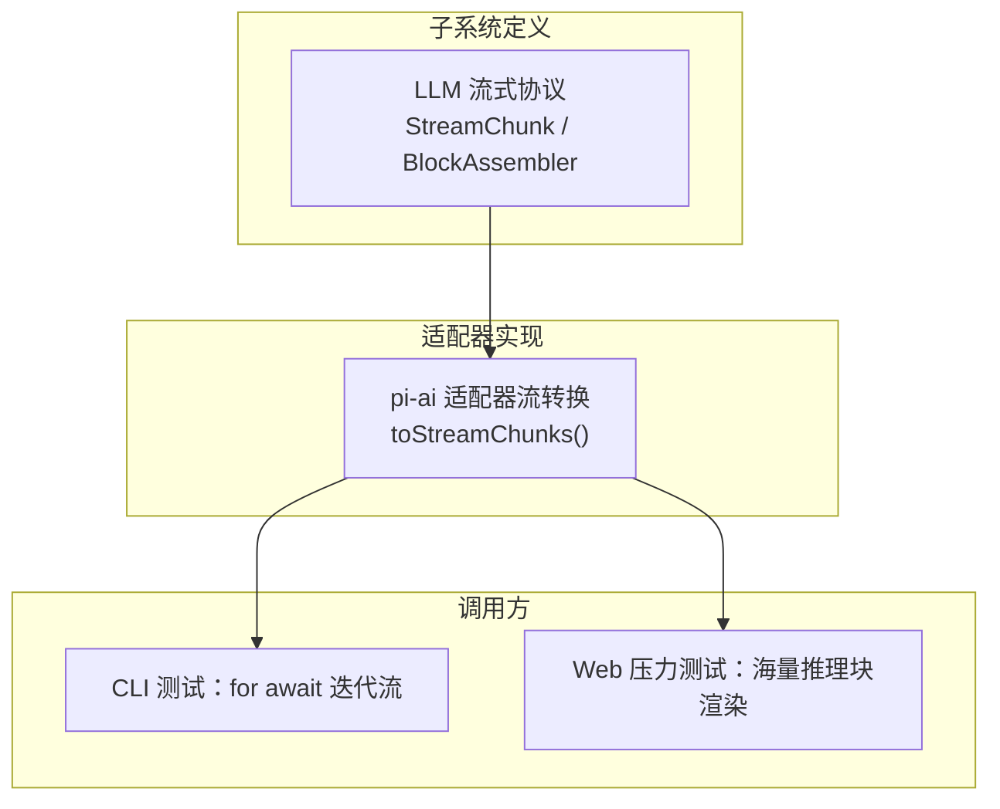
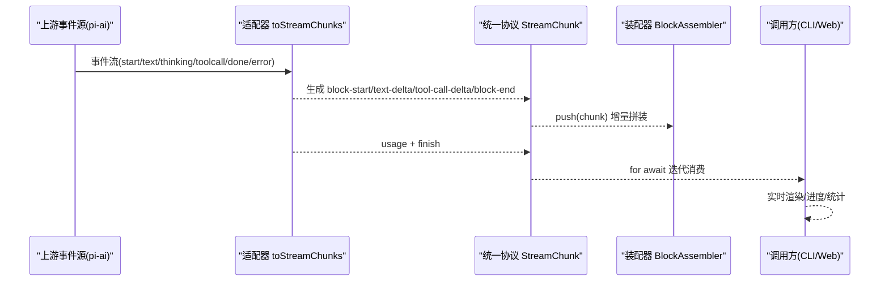
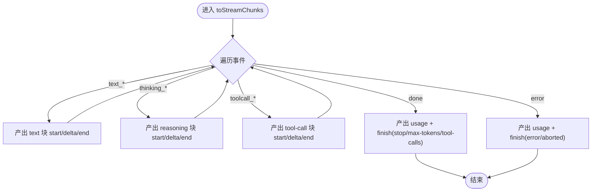
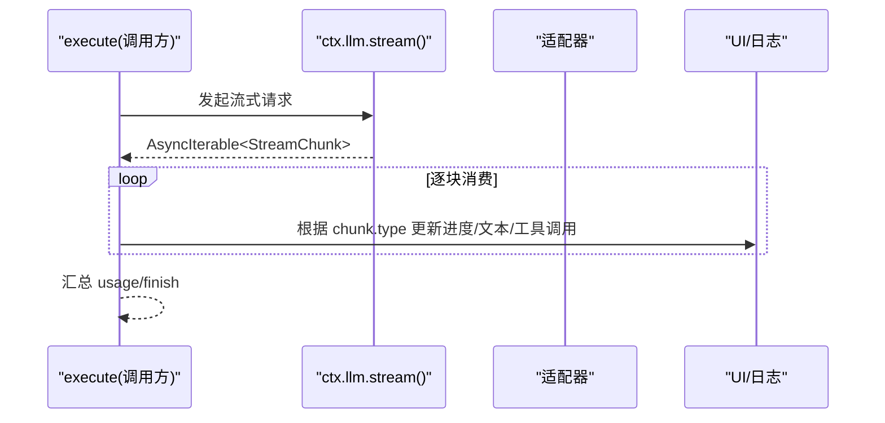

# 流式响应处理

<cite>
**本文引用的文件**
- [llm-streaming.md](file://docs/subsystems/llm-streaming.md)
- [stream.ts](file://packages/llm/llm-pi-ai/src/stream.ts)
- [built-bin.e2e.ts](file://apps/cli/tests/built-bin.e2e.ts)
- [reasoning-chunks.stress.ts](file://apps/web/stress-tests/reasoning-chunks.stress.ts)
</cite>

## 目录
1. [简介](#简介)
2. [项目结构](#项目结构)
3. [核心组件](#核心组件)
4. [架构总览](#架构总览)
5. [详细组件分析](#详细组件分析)
6. [依赖关系分析](#依赖关系分析)
7. [性能与内存管理](#性能与内存管理)
8. [故障排查指南](#故障排查指南)
9. [结论](#结论)
10. [附录：示例与最佳实践](#附录示例与最佳实践)

## 简介
本文件聚焦“流式响应”的处理方法，围绕如何在执行流程中实现流式输出（进度报告、中间结果推送、实时反馈），以及大文件分块读取、长文本分段输出、大量数据分页处理的策略。同时给出缓冲策略、内存管理与性能优化建议，并提供日志输出、进度条、实时搜索等实际交互的实现思路与参考路径。

## 项目结构
本项目在子系统文档中定义了统一的 LLM 流式协议与装配器，并在适配器层将不同上游事件流转换为统一协议；CLI 与 Web 测试展示了消费端如何迭代流式数据并渲染到界面或终端。

图表来源
- [llm-streaming.md:154-308](file://docs/subsystems/llm-streaming.md#L154-L308)
- [stream.ts:124-208](file://packages/llm/llm-pi-ai/src/stream.ts#L124-L208)
- [built-bin.e2e.ts:168-174](file://apps/cli/tests/built-bin.e2e.ts#L168-L174)
- [reasoning-chunks.stress.ts:40-126](file://apps/web/stress-tests/reasoning-chunks.stress.ts#L40-L126)

章节来源
- [llm-streaming.md:154-308](file://docs/subsystems/llm-streaming.md#L154-L308)
- [stream.ts:124-208](file://packages/llm/llm-pi-ai/src/stream.ts#L124-L208)
- [built-bin.e2e.ts:168-174](file://apps/cli/tests/built-bin.e2e.ts#L168-L174)
- [reasoning-chunks.stress.ts:40-126](file://apps/web/stress-tests/reasoning-chunks.stress.ts#L40-L126)

## 核心组件
- 流式协议 StreamChunk：以 block-start/text-delta/tool-call-delta/block-end/usage/finish 等片段描述一次模型调用的增量输出，支持多类型内容块交错。
- 装配器 BlockAssembler：将 StreamChunk 流逐步组装为完整的 ContentBlock、用量统计与结束原因，供上层消费。
- 适配器 toStreamChunks：将具体上游事件流（如 pi-ai）映射为统一 StreamChunk，并在结束时产出 usage 与 finish。
- 调用方消费模式：通过 for-await-of 迭代流，边接收边渲染/统计/上报，避免整段等待。

章节来源
- [llm-streaming.md:154-308](file://docs/subsystems/llm-streaming.md#L154-L308)
- [stream.ts:124-208](file://packages/llm/llm-pi-ai/src/stream.ts#L124-L208)

## 架构总览
下图展示从上游事件到统一流式协议，再到消费端的完整链路。适配器负责“协议归一化”，装配器负责“增量拼装”，调用方负责“实时呈现”。

图表来源
- [stream.ts:124-208](file://packages/llm/llm-pi-ai/src/stream.ts#L124-L208)
- [llm-streaming.md:154-308](file://docs/subsystems/llm-streaming.md#L154-L308)

## 详细组件分析

### 适配器流转换（pi-ai → StreamChunk）
- 事件到片段的映射：text_start→block-start(text)，text_delta→text-delta，text_end→block-end(text)；thinking/thinking_delta/thinking_end 同理；toolcall_start/delta/end 对应 tool-call 的起始、参数增量与完成块。
- 终止与错误：done 事件产出 usage 与 finish；error 事件同样产出 usage 与 finish（错误语义）。
- 上下文溢出与空响应：根据上下文窗口与 stopReason 映射为 CONTEXT_WINDOW_EXCEEDED 或 EMPTY_RESPONSE 等错误码。

图表来源
- [stream.ts:124-208](file://packages/llm/llm-pi-ai/src/stream.ts#L124-L208)

章节来源
- [stream.ts:124-208](file://packages/llm/llm-pi-ai/src/stream.ts#L124-L208)

### 流式协议与装配器
- StreamChunk 是闭联合集，新增变体需在各消费处显式处理，保证类型安全。
- BlockAssembler 容忍 delta-only 协议，对已关闭索引的后续 delta 忽略，防止畸形流导致内存膨胀或状态错乱。
- 使用 blocks()/message()/usage/finish 获取最终结果，无需自行拼装。

章节来源
- [llm-streaming.md:154-308](file://docs/subsystems/llm-streaming.md#L154-L308)

### 调用方：在 execute 中实现流式输出
- CLI 侧通过 for-await-of 迭代 ctx.llm.stream(...) 返回的流，按 chunk.type 分类累积文本、工具调用参数等，边到边渲染。
- Web 侧压力测试验证了在高吞吐推理块场景下保持浏览器响应性，适合用于进度条、实时搜索等交互。

图表来源
- [built-bin.e2e.ts:168-174](file://apps/cli/tests/built-bin.e2e.ts#L168-L174)
- [llm-streaming.md:154-308](file://docs/subsystems/llm-streaming.md#L154-L308)

章节来源
- [built-bin.e2e.ts:168-174](file://apps/cli/tests/built-bin.e2e.ts#L168-L174)
- [llm-streaming.md:154-308](file://docs/subsystems/llm-streaming.md#L154-L308)

## 依赖关系分析
- 适配器依赖统一协议定义（StreamChunk、FinishReason、TokenUsage 等）。
- 调用方依赖适配器产出的流，并通过装配器或直接消费增量进行渲染。
- Web 压力测试依赖同一套流式接口，确保大规模增量数据的稳定渲染。

图表来源
- [llm-streaming.md:154-308](file://docs/subsystems/llm-streaming.md#L154-L308)
- [stream.ts:124-208](file://packages/llm/llm-pi-ai/src/stream.ts#L124-L208)
- [reasoning-chunks.stress.ts:40-126](file://apps/web/stress-tests/reasoning-chunks.stress.ts#L40-L126)

章节来源
- [llm-streaming.md:154-308](file://docs/subsystems/llm-streaming.md#L154-L308)
- [stream.ts:124-208](file://packages/llm/llm-pi-ai/src/stream.ts#L124-L208)
- [reasoning-chunks.stress.ts:40-126](file://apps/web/stress-tests/reasoning-chunks.stress.ts#L40-L126)

## 性能与内存管理
- 增量消费：优先使用 for-await-of 逐块处理，避免整段拼接导致的峰值内存。
- 合理缓冲：对高频小块的 UI 更新做节流/合并，减少重排；对工具调用参数可先累积再在 block-end 时一次性提交。
- 大文件/长文本：采用分块读取与分段输出，结合进度回调与断点续传标记，便于恢复与可视化。
- 大量数据分页：后端按页推送，前端按需加载与虚拟滚动，避免一次性渲染全部条目。
- 超时与空闲保护：传输层应设置合理的 idleTimeout，避免长时间无进展占用资源。
- 错误快速失败：遇到异常尽快中止流，释放资源，避免僵尸任务。

[本节提供通用指导，不直接分析具体文件]

## 故障排查指南
- 空响应：当模型返回停止但无内容块时，视为可重试的错误（EMPTY_RESPONSE），应在上层捕获并重试或提示用户。
- 上下文溢出：当检测到上下文窗口超限（CONTEXT_WINDOW_EXCEEDED），应触发压缩/裁剪历史或提示用户精简输入。
- 传输中断：网络/连接异常归类为 TRANSPORT/TIMEOUT，应记录诊断信息并考虑重试或降级。
- 流未正常结束：若上游事件流在没有 done/error 的情况下结束，适配器会抛出 STREAM_CLOSED，需在上层捕获并清理。

章节来源
- [stream.ts:39-62](file://packages/llm/llm-pi-ai/src/stream.ts#L39-L62)
- [stream.ts:73-113](file://packages/llm/llm-pi-ai/src/stream.ts#L73-L113)
- [stream.ts:196-208](file://packages/llm/llm-pi-ai/src/stream.ts#L196-L208)

## 结论
通过统一的 StreamChunk 协议与 BlockAssembler 装配器，项目实现了跨适配器的流式能力；调用方可在 execute 中以 for-await-of 的方式实现进度报告、中间结果推送与实时反馈。配合合理的缓冲、分页与错误处理策略，可在大文件、长文本与海量数据场景下保持低延迟与高稳定性。

[本节为总结，不直接分析具体文件]

## 附录：示例与最佳实践
- 日志输出：在每次收到 text-delta/reasoning-delta 时追加到日志面板，并按块边界刷新。
- 进度条：基于 usage 与预估 token 数估算进度；或在工具调用阶段显示步骤进度。
- 实时搜索：将查询结果按块推送，前端即时渲染搜索结果列表，支持滚动与去重。
- 大文件分块：服务端按固定大小分块读取并推送，客户端累积写入本地缓存，完成后合并。
- 长文本分段：按段落或句子切分输出，提升可读性与首屏速度。
- 大量数据分页：后端分页推送，前端按需加载下一页，必要时启用虚拟列表。

[本节为概念性说明，不直接分析具体文件]