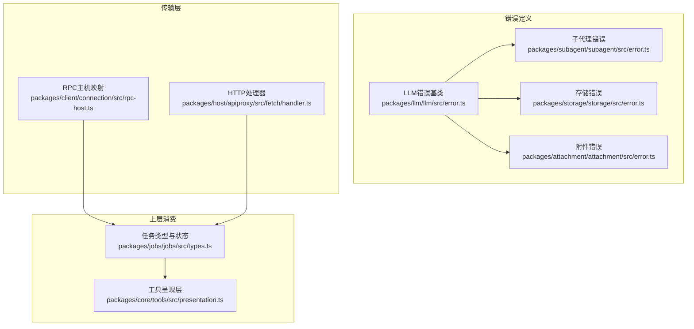
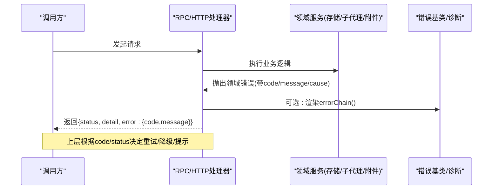
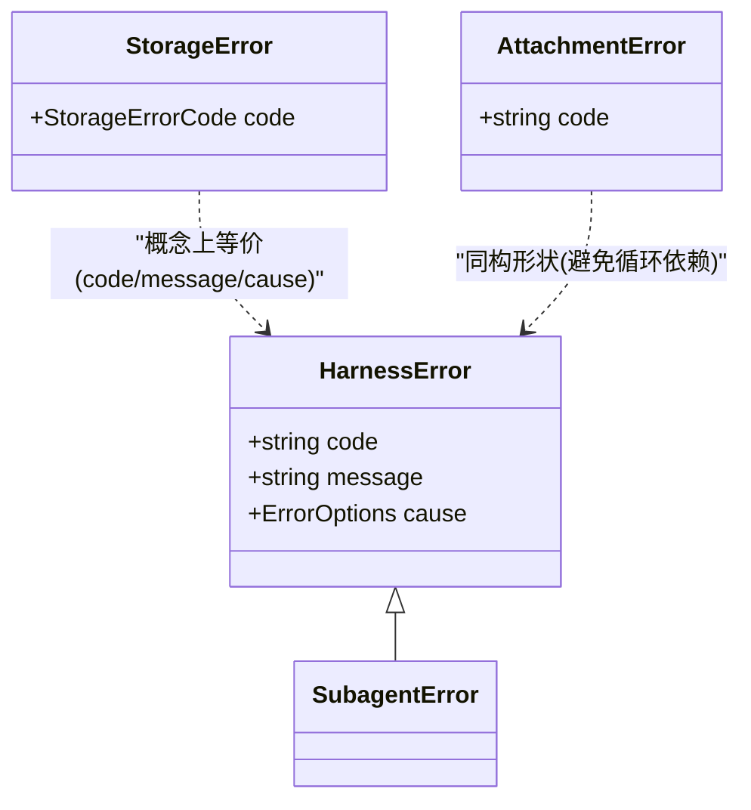

# 错误处理策略

<cite>
**本文引用的文件**
- [packages/llm/llm/src/error.ts](file://packages/llm/llm/src/error.ts)
- [packages/subagent/subagent/src/error.ts](file://packages/subagent/subagent/src/error.ts)
- [packages/storage/storage/src/error.ts](file://packages/storage/storage/src/error.ts)
- [packages/attachment/attachment/src/error.ts](file://packages/attachment/attachment/src/error.ts)
- [packages/client/connection/src/rpc-host.ts](file://packages/client/connection/src/rpc-host.ts)
- [packages/host/apiproxy/src/fetch/handler.ts](file://packages/host/apiproxy/src/fetch/handler.ts)
- [packages/jobs/jobs/src/types.ts](file://packages/jobs/jobs/src/types.ts)
- [packages/core/tools/src/presentation.ts](file://packages/core/tools/src/presentation.ts)
- [apps/cli/tests/dsh-badge.snapshot.ts](file://apps/cli/tests/dsh-badge.snapshot.ts)
</cite>

## 目录
1. [简介](#简介)
2. [项目结构](#项目结构)
3. [核心组件](#核心组件)
4. [架构总览](#架构总览)
5. [详细组件分析](#详细组件分析)
6. [依赖关系分析](#依赖关系分析)
7. [性能与可靠性考虑](#性能与可靠性考虑)
8. [故障排查指南](#故障排查指南)
9. [结论](#结论)
10. [附录](#附录)

## 简介
本文件系统性说明该工具的错误处理策略，覆盖参数验证错误、运行时错误、网络错误等类型；解释抛出异常与返回错误状态的区别，何时使用 isError 标志；定义错误信息的标准化格式与调试信息规范；并展示重试机制、降级处理与用户友好提示的实现方法。目标是让开发者在不同边界（RPC、HTTP、工具执行、存储、子代理等）都能以一致的方式表达、传播和处理错误。

## 项目结构
错误处理在仓库中以“领域化”的方式组织：每个子系统提供自己的错误类型或复用统一的基类，并在跨进程/跨边界的传输层进行统一包装与映射。关键位置包括：
- LLM/通用错误基类与诊断渲染：packages/llm/llm/src/error.ts
- 子代理错误：packages/subagent/subagent/src/error.ts
- 存储错误：packages/storage/storage/src/error.ts
- 附件错误：packages/attachment/attachment/src/error.ts
- RPC/HTTP 错误映射：packages/client/connection/src/rpc-host.ts、packages/host/apiproxy/src/fetch/handler.ts
- 任务状态与详情：packages/jobs/jobs/src/types.ts
- 工具呈现层：packages/core/tools/src/presentation.ts
- 测试快照中的 isError 标志示例：apps/cli/tests/dsh-badge.snapshot.ts

图表来源
- [packages/llm/llm/src/error.ts:1-164](file://packages/llm/llm/src/error.ts#L1-L164)
- [packages/subagent/subagent/src/error.ts:1-16](file://packages/subagent/subagent/src/error.ts#L1-L16)
- [packages/storage/storage/src/error.ts:1-36](file://packages/storage/storage/src/error.ts#L1-L36)
- [packages/attachment/attachment/src/error.ts:1-27](file://packages/attachment/attachment/src/error.ts#L1-L27)
- [packages/client/connection/src/rpc-host.ts:180-190](file://packages/client/connection/src/rpc-host.ts#L180-L190)
- [packages/host/apiproxy/src/fetch/handler.ts:185-195](file://packages/host/apiproxy/src/fetch/handler.ts#L185-L195)
- [packages/jobs/jobs/src/types.ts:30-40](file://packages/jobs/jobs/src/types.ts#L30-L40)
- [packages/core/tools/src/presentation.ts:375-390](file://packages/core/tools/src/presentation.ts#L375-L390)

章节来源
- [packages/llm/llm/src/error.ts:1-164](file://packages/llm/llm/src/error.ts#L1-L164)
- [packages/storage/storage/src/error.ts:1-36](file://packages/storage/storage/src/error.ts#L1-L36)
- [packages/attachment/attachment/src/error.ts:1-27](file://packages/attachment/attachment/src/error.ts#L1-L27)
- [packages/subagent/subagent/src/error.ts:1-16](file://packages/subagent/subagent/src/error.ts#L1-L16)
- [packages/client/connection/src/rpc-host.ts:180-190](file://packages/client/connection/src/rpc-host.ts#L180-L190)
- [packages/host/apiproxy/src/fetch/handler.ts:185-195](file://packages/host/apiproxy/src/fetch/handler.ts#L185-L195)
- [packages/jobs/jobs/src/types.ts:30-40](file://packages/jobs/jobs/src/types.ts#L30-L40)
- [packages/core/tools/src/presentation.ts:375-390](file://packages/core/tools/src/presentation.ts#L375-L390)

## 核心组件
- 统一错误基类与诊断渲染
  - 提供稳定的机器可路由 code、人类可读 message，以及 cause 链支持。
  - 提供 errorChain 将异常及其 cause、AggregateError 成员渲染为单一字符串，便于日志与通知显示。
  - 提供 isHarnessError 用于边界处类型收窄。
- 领域错误类型
  - SubagentError：继承自统一基类，用于子代理相关失败。
  - StorageError：存储域错误，包含稳定的 code 枚举，便于消费者分支处理。
  - AttachmentError：为避免循环依赖而独立实现与 HarnessError 同构的错误形状，确保跨进程/跨边界稳定传输。
- 传输层错误映射
  - RPC 主机与 HTTP 处理器在捕获到未处理异常时，返回统一的 500 响应体，避免泄露内部堆栈。
- 任务状态与详情
  - jobs 类型中定义了 status 与 detail 字段，detail 可用于承载“退出码”“max-tokens”等上下文相关的状态信息。
- 工具呈现层
  - 工具调用结果中包含 httpStatus 等字段，便于上层根据状态码决定重试或降级。

章节来源
- [packages/llm/llm/src/error.ts:1-164](file://packages/llm/llm/src/error.ts#L1-L164)
- [packages/subagent/subagent/src/error.ts:1-16](file://packages/subagent/subagent/src/error.ts#L1-L16)
- [packages/storage/storage/src/error.ts:1-36](file://packages/storage/storage/src/error.ts#L1-L36)
- [packages/attachment/attachment/src/error.ts:1-27](file://packages/attachment/attachment/src/error.ts#L1-L27)
- [packages/client/connection/src/rpc-host.ts:180-190](file://packages/client/connection/src/rpc-host.ts#L180-L190)
- [packages/host/apiproxy/src/fetch/handler.ts:185-195](file://packages/host/apiproxy/src/fetch/handler.ts#L185-L195)
- [packages/jobs/jobs/src/types.ts:30-40](file://packages/jobs/jobs/src/types.ts#L30-L40)
- [packages/core/tools/src/presentation.ts:375-390](file://packages/core/tools/src/presentation.ts#L375-L390)

## 架构总览
错误从底层抛出后，沿调用链向上传播，最终在传输层被转换为稳定的协议消息（RPC/HTTP），再由上层消费方根据 code/status/detail 决定重试、降级或提示用户。

图表来源
- [packages/client/connection/src/rpc-host.ts:180-190](file://packages/client/connection/src/rpc-host.ts#L180-L190)
- [packages/host/apiproxy/src/fetch/handler.ts:185-195](file://packages/host/apiproxy/src/fetch/handler.ts#L185-L195)
- [packages/llm/llm/src/error.ts:100-164](file://packages/llm/llm/src/error.ts#L100-L164)

## 详细组件分析

### 统一错误基类与诊断渲染（LLM）
- 设计要点
  - 所有 HarnessError 子类携带稳定的 code，供程序化路由；message 面向人类阅读。
  - 通过 ErrorOptions.cause 支持错误链，便于保留原始原因。
  - 提供 isContextWindowExceededError、isQuotaExceededError 等识别函数，用于上游按语义分类错误（如上下文超限、配额耗尽）。
  - errorChain 将异常、AggregateError 成员与 cause 链渲染为单行文本，适合日志与通知。
- 适用场景
  - 网络错误、模型适配器错误、认证/凭据错误、空响应等均可归一化为 HarnessError 或其子类。
- 建议
  - 在边界处（RPC/HTTP）统一捕获未知错误，包装为带 code 的错误并返回。
  - 对可重试错误（如临时网络问题）与不可重试错误（如无效凭据）分别设置 code，以便上层决策。

章节来源
- [packages/llm/llm/src/error.ts:1-164](file://packages/llm/llm/src/error.ts#L1-L164)

### 子代理错误
- 设计要点
  - SubagentError 继承自 HarnessError，保持统一的 code/message/cause 契约。
- 适用场景
  - 子代理生命周期、通信、执行过程中的失败。

章节来源
- [packages/subagent/subagent/src/error.ts:1-16](file://packages/subagent/subagent/src/error.ts#L1-L16)

### 存储错误
- 设计要点
  - StorageError 使用稳定的 code 枚举（如 backend-not-found、form-not-mounted、duplicate-backend、version-mismatch、malformed-medium、closed），便于精确分支处理。
- 适用场景
  - 存储后端初始化、挂载、版本兼容、介质解析、关闭后的操作等。

章节来源
- [packages/storage/storage/src/error.ts:1-36](file://packages/storage/storage/src/error.ts#L1-L36)

### 附件错误
- 设计要点
  - 为避免与 LLM 包产生循环依赖，AttachmentError 独立实现与 HarnessError 同构的形状（code/message/cause），保证跨进程/跨边界稳定传输。
- 适用场景
  - 图片/附件读取、校验、序列化等失败。

章节来源
- [packages/attachment/attachment/src/error.ts:1-27](file://packages/attachment/attachment/src/error.ts#L1-L27)

### RPC/HTTP 错误映射
- 设计要点
  - 当处理器捕获到未处理异常时，返回 500 响应体，内容包含简要错误描述，避免泄露内部细节。
- 适用场景
  - 所有远程调用入口的统一兜底错误处理。

章节来源
- [packages/client/connection/src/rpc-host.ts:180-190](file://packages/client/connection/src/rpc-host.ts#L180-L190)
- [packages/host/apiproxy/src/fetch/handler.ts:185-195](file://packages/host/apiproxy/src/fetch/handler.ts#L185-L195)

### 任务状态与详情
- 设计要点
  - jobs 类型中 status 表示任务完成态（如 completed/failed），detail 用于承载与具体 kind 相关的状态信息（例如“exit code: 3”“max-tokens”）。
- 适用场景
  - 工具执行、后台作业、子任务的状态上报与展示。

章节来源
- [packages/jobs/jobs/src/types.ts:30-40](file://packages/jobs/jobs/src/types.ts#L30-L40)

### 工具呈现层
- 设计要点
  - 工具调用结果中包含 httpStatus 等字段，便于上层根据状态码判断是否需要重试或降级。
- 适用场景
  - 工具调用的外部资源访问（如 HTTP 获取）失败时的反馈。

章节来源
- [packages/core/tools/src/presentation.ts:375-390](file://packages/core/tools/src/presentation.ts#L375-L390)

### 参数验证错误、运行时错误、网络错误的处理差异
- 参数验证错误
  - 应在入口处尽早校验，抛出带有明确 code 的错误（如 INVALID_ARGS），避免进入后续流程。
- 运行时错误
  - 由业务逻辑抛出的异常应包装为领域错误（如 StorageError/SubagentError），并附带 cause 链。
- 网络错误
  - 在传输层捕获后，尽量还原为领域错误；若无法还原，则返回统一 500 响应，并在 detail 中保留必要上下文。

章节来源
- [packages/llm/llm/src/error.ts:1-164](file://packages/llm/llm/src/error.ts#L1-L164)
- [packages/storage/storage/src/error.ts:1-36](file://packages/storage/storage/src/error.ts#L1-L36)
- [packages/client/connection/src/rpc-host.ts:180-190](file://packages/client/connection/src/rpc-host.ts#L180-L190)
- [packages/host/apiproxy/src/fetch/handler.ts:185-195](file://packages/host/apiproxy/src/fetch/handler.ts#L185-L195)

### 抛出异常与返回错误状态的区别；何时使用 isError
- 抛出异常
  - 适用于同步/异步调用链内的错误传播，保留完整 cause 链，便于诊断。
- 返回错误状态
  - 适用于跨进程/跨边界的协议消息（RPC/HTTP），使用 {status, detail, error:{code,message}} 形式，避免语言特定的异常传播。
- isError 标志
  - 在测试与快照中可见 isError 字段用于标识结果是否失败；上层可根据该标志快速区分成功/失败路径，并结合 code 做细粒度处理。

章节来源
- [apps/cli/tests/dsh-badge.snapshot.ts:40-120](file://apps/cli/tests/dsh-badge.snapshot.ts#L40-L120)
- [packages/jobs/jobs/src/types.ts:30-40](file://packages/jobs/jobs/src/types.ts#L30-L40)

### 错误信息的标准化格式与调试信息
- 标准化字段
  - code：稳定的机器可路由代码，用于分支处理。
  - message：人类可读的描述，不包含敏感信息。
  - cause：原始错误链，便于定位根因。
  - detail：任务级详情（如退出码、限流提示）。
- 调试信息
  - 使用 errorChain 将异常链渲染为单行文本，便于日志与通知。
  - 在网络错误场景下，尽量保留 provider 的 code/type/message 片段，以便识别上下文超限、配额耗尽等语义。

章节来源
- [packages/llm/llm/src/error.ts:100-164](file://packages/llm/llm/src/error.ts#L100-L164)
- [packages/jobs/jobs/src/types.ts:30-40](file://packages/jobs/jobs/src/types.ts#L30-L40)

### 重试机制、降级处理与用户友好提示
- 重试机制
  - 基于 code 与状态码判定是否可重试：临时网络错误、速率限制可重试；无效凭据、上下文超限通常不可重试。
  - 结合 jobs 的 detail 字段记录“max-tokens”等上下文，辅助上层决定是否截断并重试。
- 降级处理
  - 当某后端不可用（如 storage backend-not-found）时，切换到备用后端或回退到本地模式。
  - 工具调用失败时，根据 httpStatus 选择缓存结果或提示用户稍后重试。
- 用户友好提示
  - 将 code 映射为用户可读的提示文案，避免直接暴露技术细节。
  - 对于“输出令牌限制”等场景，提示用户继续对话以恢复生成。

章节来源
- [packages/llm/llm/src/error.ts:24-100](file://packages/llm/llm/src/error.ts#L24-L100)
- [packages/storage/storage/src/error.ts:6-15](file://packages/storage/storage/src/error.ts#L6-L15)
- [packages/core/tools/src/presentation.ts:375-390](file://packages/core/tools/src/presentation.ts#L375-L390)
- [packages/jobs/jobs/src/types.ts:30-40](file://packages/jobs/jobs/src/types.ts#L30-L40)

## 依赖关系分析
- 低耦合高内聚
  - 各领域的错误类型仅依赖必要的基类或自身定义，避免循环依赖（如 AttachmentError 独立实现）。
- 明确的传输契约
  - RPC/HTTP 层统一将异常转换为 {status, detail, error} 结构，确保跨进程一致性。
- 可观测性
  - 通过 errorChain 与 jobs.detail，提升可观测性与排障效率。

图表来源
- [packages/llm/llm/src/error.ts:1-22](file://packages/llm/llm/src/error.ts#L1-L22)
- [packages/subagent/subagent/src/error.ts:7-15](file://packages/subagent/subagent/src/error.ts#L7-L15)
- [packages/storage/storage/src/error.ts:6-35](file://packages/storage/storage/src/error.ts#L6-L35)
- [packages/attachment/attachment/src/error.ts:1-27](file://packages/attachment/attachment/src/error.ts#L1-L27)

章节来源
- [packages/llm/llm/src/error.ts:1-164](file://packages/llm/llm/src/error.ts#L1-L164)
- [packages/subagent/subagent/src/error.ts:1-16](file://packages/subagent/subagent/src/error.ts#L1-L16)
- [packages/storage/storage/src/error.ts:1-36](file://packages/storage/storage/src/error.ts#L1-L36)
- [packages/attachment/attachment/src/error.ts:1-27](file://packages/attachment/attachment/src/error.ts#L1-L27)

## 性能与可靠性考虑
- 错误渲染成本
  - errorChain 会遍历 cause 链与 AggregateError 成员，建议在高频路径中谨慎使用，或在日志级别控制输出。
- 重试风暴
  - 对可重试错误实施指数退避与上限控制，避免雪崩。
- 降级优先
  - 在检测到特定错误（如后端不可用）时立即切换降级路径，减少失败传播。

[本节为通用指导，不直接分析具体文件]

## 故障排查指南
- 快速定位
  - 查看返回的 error.code 与 jobs.detail，确定错误类别与上下文。
  - 使用 errorChain 打印完整异常链，定位根因。
- 常见问题
  - 上下文超限：依据 isContextWindowExceededError 识别，采取截断或分片策略。
  - 配额耗尽：依据 isQuotaExceededError 识别，提示用户充值或等待。
  - 存储后端问题：根据 StorageErrorCode 切换后端或修复配置。
- 日志与监控
  - 在 RPC/HTTP 层记录统一错误摘要，避免泄露敏感信息。
  - 将 detail 中的关键信息（如退出码、max-tokens）纳入指标与告警。

章节来源
- [packages/llm/llm/src/error.ts:24-164](file://packages/llm/llm/src/error.ts#L24-L164)
- [packages/storage/storage/src/error.ts:6-35](file://packages/storage/storage/src/error.ts#L6-L35)
- [packages/jobs/jobs/src/types.ts:30-40](file://packages/jobs/jobs/src/types.ts#L30-L40)

## 结论
该工具采用“统一基类 + 领域错误 + 传输层映射”的分层错误处理策略，通过稳定的 code、人类可读的 message、完整的 cause 链与任务级 detail，实现了跨进程/跨边界的可靠错误传播。上层可据此实现精准的重试、降级与用户友好提示，同时借助 errorChain 提升可观测性与排障效率。

[本节为总结，不直接分析具体文件]

## 附录
- 最佳实践清单
  - 始终为错误设置稳定的 code，避免基于 message 文本分支。
  - 在传输层统一捕获未知异常，返回 500 并附带简要描述。
  - 对可重试与不可重试错误进行分类，配合重试与降级策略。
  - 使用 errorChain 输出诊断信息，但注意性能与隐私。
  - 对用户可见的提示进行本地化与去技术化，聚焦可操作建议。

[本节为补充说明，不直接分析具体文件]