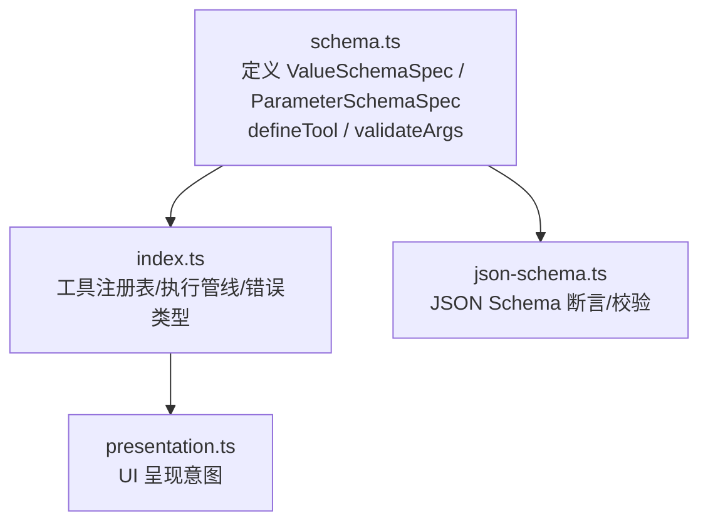
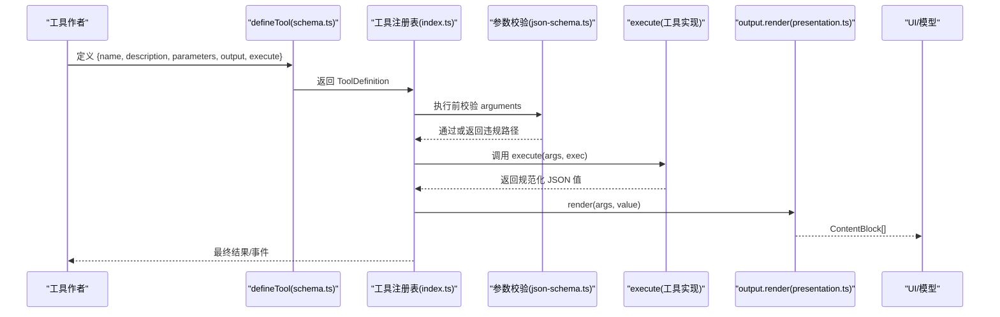
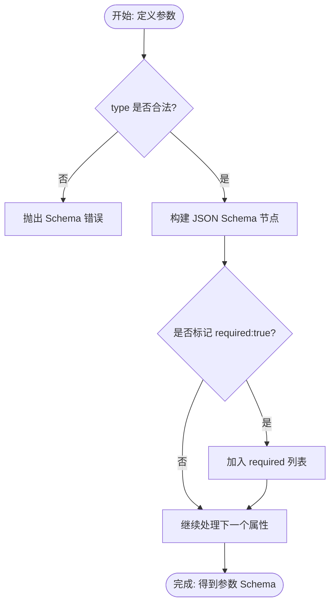
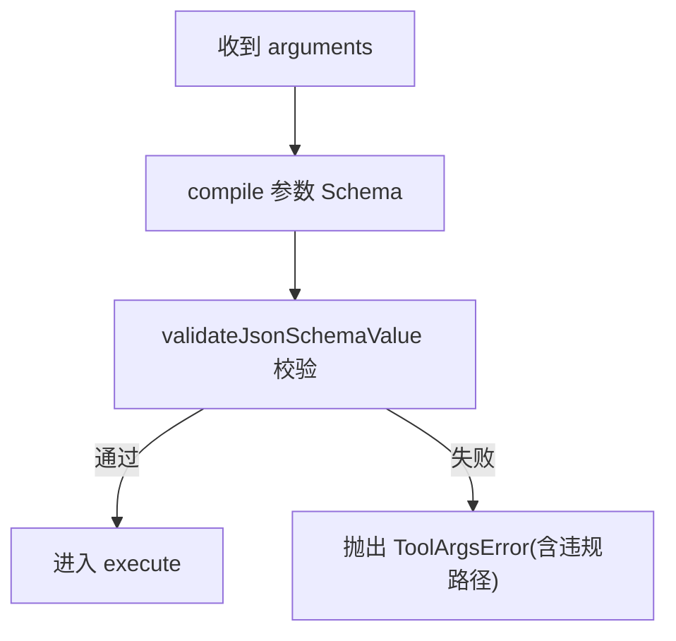
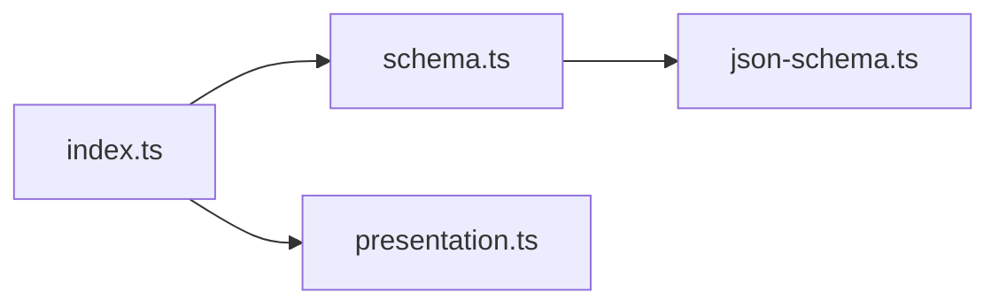

# 工具接口设计

<cite>
**本文引用的文件**
- [packages/core/tools/src/schema.ts](file://packages/core/tools/src/schema.ts)
- [packages/core/tools/src/index.ts](file://packages/core/tools/src/index.ts)
- [packages/core/tools/src/presentation.ts](file://packages/core/tools/src/presentation.ts)
- [packages/core/tools/src/json-schema.ts](file://packages/core/tools/src/json-schema.ts)
- [docs/cookbook/adding-a-tool.md](file://docs/cookbook/adding-a-tool.md)
</cite>

## 目录
1. [简介](#简介)
2. [项目结构](#项目结构)
3. [核心组件](#核心组件)
4. [架构总览](#架构总览)
5. [详细组件分析](#详细组件分析)
6. [依赖关系分析](#依赖关系分析)
7. [性能考虑](#性能考虑)
8. [故障排查指南](#故障排查指南)
9. [结论](#结论)
10. [附录](#附录)

## 简介
本文件面向工具作者，系统化说明自定义工具的接口设计规范与最佳实践。重点覆盖：
- 工具函数签名设计原则（名称、描述、参数、输出、执行体）
- 参数类型定义规范（ParameterSchemaSpec）
- 返回值格式约定（ValueSchemaSpec）
- 参数验证机制
- 输出渲染器实现要求（render、presentationMeta、presentCall、presentResult）
- 版本兼容性与向后兼容性策略
- 通过具体代码路径示例展示必填参数、可选参数、嵌套对象参数的声明方法

## 项目结构
与工具接口设计直接相关的核心位于 packages/core/tools 包中：
- schema.ts：统一的值级 Schema DSL、参数 Schema 编译、参数校验、defineTool 工厂
- index.ts：工具注册表、执行管线、错误模型、运行时上下文、呈现模式等
- presentation.ts：UI 呈现意图（ToolCallView / ToolResultView）
- json-schema.ts：底层 JSON Schema 断言与校验

**图示来源**
- [packages/core/tools/src/schema.ts:1-120](file://packages/core/tools/src/schema.ts#L1-L120)
- [packages/core/tools/src/index.ts:210-290](file://packages/core/tools/src/index.ts#L210-L290)
- [packages/core/tools/src/presentation.ts:1-200](file://packages/core/tools/src/presentation.ts#L1-L200)
- [packages/core/tools/src/json-schema.ts:1-120](file://packages/core/tools/src/json-schema.ts#L1-L120)

**章节来源**
- [packages/core/tools/src/schema.ts:1-120](file://packages/core/tools/src/schema.ts#L1-L120)
- [packages/core/tools/src/index.ts:210-290](file://packages/core/tools/src/index.ts#L210-L290)

## 核心组件
- 值级 Schema 与参数 Schema
  - ValueSchemaSpec：统一描述任意 JSON 值的根节点类型（string/number/integer/boolean/null/array/object/json/oneOf）
  - ParameterSchemaSpec：隐式开放的对象根，键为属性名，值为 ValueSchemaSpec；required 仅允许 true 标记必填
- defineTool
  - 将 name/description/parameters/output/execute 等组合成可注册的 ToolDefinition
  - 在 execute 前对 arguments 进行严格校验，失败抛出结构化错误
- 输出定义 ToolOutputDefinition
  - schema：成功返回值的 JSON Schema
  - render：将已校验的 args 与 value 投影为模型可见内容（ContentBlock[]）
  - presentationMeta：可选，生成可重放的 UI 元数据（JsonValue）
- 执行上下文与生命周期
  - ToolExecutionInput/ToolRunContext：包含 callId、name、arguments、signal、agent、parent、deferContext、concludeTurn 等
  - 执行管线：pre-execute → guard → around-dispatch → body → post-execute → finalizeContent → result 事件

**章节来源**
- [packages/core/tools/src/schema.ts:12-106](file://packages/core/tools/src/schema.ts#L12-L106)
- [packages/core/tools/src/schema.ts:482-536](file://packages/core/tools/src/schema.ts#L482-L536)
- [packages/core/tools/src/index.ts:211-288](file://packages/core/tools/src/index.ts#L211-L288)
- [packages/core/tools/src/index.ts:314-421](file://packages/core/tools/src/index.ts#L314-L421)

## 架构总览
下图展示了从工具定义到执行与结果呈现的关键流程。

**图示来源**
- [packages/core/tools/src/schema.ts:482-536](file://packages/core/tools/src/schema.ts#L482-L536)
- [packages/core/tools/src/schema.ts:545-617](file://packages/core/tools/src/schema.ts#L545-L617)
- [packages/core/tools/src/index.ts:1532-1560](file://packages/core/tools/src/index.ts#L1532-L1560)
- [packages/core/tools/src/index.ts:211-288](file://packages/core/tools/src/index.ts#L211-L288)

## 详细组件分析

### 参数类型定义规范（ParameterSchemaSpec）
- 根对象是隐式开放的，即未声明的属性不会导致“未知字段”错误；但每个属性的 required 必须显式为 true 才表示必填
- 支持标量（string/number/integer/boolean/null）、数组（items 可指定元素类型）、对象（properties + additionalProperties 必须显式布尔）、json（任意 JSON 值）、oneOf（至少两个分支）
- 注解字段（description/title/default/examples）会被投影到 JSON Schema 并用于类型推断与文档
- 编译过程会收集 required 列表并生成标准 JSON Schema；同时提供 TypeScript 类型推断（InferArgs/InferValue）

**图示来源**
- [packages/core/tools/src/schema.ts:177-430](file://packages/core/tools/src/schema.ts#L177-L430)

**章节来源**
- [packages/core/tools/src/schema.ts:23-106](file://packages/core/tools/src/schema.ts#L23-L106)
- [packages/core/tools/src/schema.ts:416-458](file://packages/core/tools/src/schema.ts#L416-L458)

### 返回值格式约定（ValueSchemaSpec）
- 返回值必须是“可无损 JSON 序列化”的值；执行体返回后由注册表快照、校验、冻结，再交给 render
- 支持标量、数组、对象、null、json、oneOf；对象需显式声明 additionalProperties 以控制开放性
- 若返回不满足 schema，将抛出结构化输出错误（包含违规路径）

**章节来源**
- [packages/core/tools/src/index.ts:512-553](file://packages/core/tools/src/index.ts#L512-L553)
- [packages/core/tools/src/schema.ts:23-95](file://packages/core/tools/src/schema.ts#L23-L95)

### 工具名称与描述的定义方式
- name：唯一标识，不可重复；保留名（如 run_code）禁止注册
- description：人类可读的描述，发送给模型，影响模型选择工具的能力
- 两者均作为模型可见的 Schema 字段被注入系统提示

**章节来源**
- [packages/core/tools/src/index.ts:1037-1061](file://packages/core/tools/src/index.ts#L1037-L1061)
- [packages/core/tools/src/index.ts:1255-1267](file://packages/core/tools/src/index.ts#L1255-L1267)

### 参数验证机制
- 在 execute 之前，使用 compile 后的参数 Schema 对传入的 arguments 进行严格校验
- 校验失败抛出 ToolArgsError，携带按顺序遍历的路径化违规信息
- 校验基于 JSON Schema 子集，确保跨语言/跨环境一致性

**图示来源**
- [packages/core/tools/src/schema.ts:472-480](file://packages/core/tools/src/schema.ts#L472-L480)
- [packages/core/tools/src/schema.ts:545-589](file://packages/core/tools/src/schema.ts#L545-L589)

**章节来源**
- [packages/core/tools/src/schema.ts:460-480](file://packages/core/tools/src/schema.ts#L460-L480)
- [packages/core/tools/src/schema.ts:545-589](file://packages/core/tools/src/schema.ts#L545-L589)

### 输出渲染器的实现要求
- render：纯函数，接收已校验的 args 与 value，返回模型可见的 ContentBlock[]
- presentationMeta：可选，生成可重放、可持久化的 UI 元数据（JsonValue），供 presentResult 使用
- presentCall/presentResult：可选，分别定义待执行与已完成状态的 UI 卡片（ToolCallView/ToolResultView）
- 呈现相关回调必须“纯且无副作用”，因为会在实时流式与日志回放中运行；若参数不匹配（例如旧版日志），应软失败回退到通用卡片

**章节来源**
- [packages/core/tools/src/index.ts:211-219](file://packages/core/tools/src/index.ts#L211-L219)
- [packages/core/tools/src/index.ts:270-288](file://packages/core/tools/src/index.ts#L270-L288)
- [packages/core/tools/src/schema.ts:482-536](file://packages/core/tools/src/schema.ts#L482-L536)

### 工具函数签名设计原则
- 输入：args 由 Schema 强约束，类型安全；exec 提供执行身份、取消信号、上下文延后能力
- 输出：只返回“规范化 JSON 值”，不要返回文本块；文本由 render 负责
- 取消：必须监听并响应 exec.signal
- 幂等与并发：如需并行，实现 isConcurrencySafe 并保证线程/进程安全
- 错误：基础设施错误抛异常；业务非理想状态用 value 表达，由 render 解释

**章节来源**
- [packages/core/tools/src/index.ts:221-288](file://packages/core/tools/src/index.ts#L221-L288)
- [docs/cookbook/adding-a-tool.md:40-65](file://docs/cookbook/adding-a-tool.md#L40-L65)

### 代码示例（以路径引用代替代码片段）
- 最小工具示例（含必填/可选参数、字符串/数字类型、文本渲染）
  - [添加工具参考（英文）:7-38](file://docs/cookbook/adding-a-tool.md#L7-L38)
- 复杂对象参数（嵌套对象、additionalProperties、枚举/常量）
  - [值级 Schema 与对象节点定义:64-95](file://packages/core/tools/src/schema.ts#L64-L95)
  - [对象属性编译与 required 收集:365-381](file://packages/core/tools/src/schema.ts#L365-L381)
- oneOf 联合类型（精确一选）
  - [oneOf 节点定义与编译:79-82](file://packages/core/tools/src/schema.ts#L79-L82)
  - [oneOf 编译逻辑:340-357](file://packages/core/tools/src/schema.ts#L340-L357)
- 输出渲染与 UI 呈现
  - [输出定义与渲染契约:211-219](file://packages/core/tools/src/index.ts#L211-L219)
  - [UI 呈现意图类型导出:109-135](file://packages/core/tools/src/index.ts#L109-L135)

**章节来源**
- [docs/cookbook/adding-a-tool.md:7-38](file://docs/cookbook/adding-a-tool.md#L7-L38)
- [packages/core/tools/src/schema.ts:64-95](file://packages/core/tools/src/schema.ts#L64-L95)
- [packages/core/tools/src/schema.ts:340-357](file://packages/core/tools/src/schema.ts#L340-L357)
- [packages/core/tools/src/index.ts:211-219](file://packages/core/tools/src/index.ts#L211-L219)
- [packages/core/tools/src/index.ts:109-135](file://packages/core/tools/src/index.ts#L109-L135)

### 版本兼容性与向后兼容性考虑
- 参数 Schema 的隐式开放根：新增可选字段不会破坏已有调用；必填字段新增会触发校验失败，建议通过版本化或迁移策略逐步引入
- 输出 Schema：新增字段不影响消费者读取旧字段；删除字段需评估下游消费方
- 呈现层：presentCall/presentResult 对历史日志中的旧参数做软校验，不匹配时回退到通用卡片，避免回放崩溃
- 工具名与保留名：保留名（如 run_code）禁止注册或遮蔽，防止未来扩展冲突
- 执行管线：finalizeContent 在调用开始时快照，避免后续替换导致的时序问题；取消语义区分“调度前中止”和“调度后中止”

**章节来源**
- [packages/core/tools/src/schema.ts:96-106](file://packages/core/tools/src/schema.ts#L96-L106)
- [packages/core/tools/src/schema.ts:594-615](file://packages/core/tools/src/schema.ts#L594-L615)
- [packages/core/tools/src/index.ts:1037-1061](file://packages/core/tools/src/index.ts#L1037-L1061)
- [packages/core/tools/src/index.ts:1517-1525](file://packages/core/tools/src/index.ts#L1517-L1525)

## 依赖关系分析
- schema.ts 依赖 json-schema.ts 进行底层 JSON Schema 断言与校验
- index.ts 聚合 schema.ts 的 defineTool/校验能力，并提供执行管线、错误类型、注册表
- presentation.ts 提供 UI 呈现意图类型，被 index.ts 导出给工具作者与宿主

**图示来源**
- [packages/core/tools/src/schema.ts:1-10](file://packages/core/tools/src/schema.ts#L1-L10)
- [packages/core/tools/src/index.ts:21-28](file://packages/core/tools/src/index.ts#L21-L28)

**章节来源**
- [packages/core/tools/src/schema.ts:1-10](file://packages/core/tools/src/schema.ts#L1-L10)
- [packages/core/tools/src/index.ts:21-28](file://packages/core/tools/src/index.ts#L21-L28)

## 性能考虑
- 参数与输出 Schema 编译采用任务图迭代而非递归，避免栈溢出
- 执行前参数校验一次性完成，减少 execute 内部负担
- 输出值与呈现元数据会进行快照与冻结，确保可重放与线程安全
- 并发优化：通过 isConcurrencySafe 声明可并行的工具，结合调度器提升吞吐

[本节为通用指导，无需特定文件来源]

## 故障排查指南
- 参数校验失败：检查 ParameterSchemaSpec 的 type/enum/const/required 是否正确；查看 ToolArgsError 的 violations 定位路径
- 输出不符合 Schema：检查 execute 返回值结构与 ValueSchemaSpec 一致；关注 ToolOutputError 的违规信息
- 呈现回调报错：确保 presentCall/presentResult 为纯函数且不依赖外部状态；旧参数下应返回 undefined 走通用卡片
- 取消与超时：确认 execute 正确监听 exec.signal；必要时设置 timeoutMs 并通过 around 包装实现超时

**章节来源**
- [packages/core/tools/src/schema.ts:460-480](file://packages/core/tools/src/schema.ts#L460-L480)
- [packages/core/tools/src/index.ts:512-553](file://packages/core/tools/src/index.ts#L512-L553)
- [packages/core/tools/src/schema.ts:594-615](file://packages/core/tools/src/schema.ts#L594-L615)

## 结论
- 使用 ValueSchemaSpec/ParameterSchemaSpec 统一描述输入输出，获得强类型与跨端一致性
- 通过 defineTool 集中管理工具契约，利用执行管线保障参数校验、取消、呈现与观测
- 遵循“返回值规范化、渲染分离、呈现纯函数”的设计原则，可获得更好的可维护性与可回放性
- 通过合理的 Schema 演进与呈现软校验，兼顾功能增强与向后兼容

[本节为总结性内容，无需特定文件来源]

## 附录
- 快速核对清单
  - 参数：type 明确、required 仅 true、枚举/常量使用 enum/const
  - 对象：properties 内嵌子 Schema，additionalProperties 显式布尔
  - 联合：oneOf 至少两个分支，避免与 type 混用
  - 执行：只返回 JSON 值；监听 exec.signal；基础设施错误抛异常
  - 输出：schema 与 render 一致；presentationMeta 可重放；present* 纯函数
  - 兼容：新增可选字段优先；删除字段评估影响；保留名不占用

[本节为补充说明，无需特定文件来源]