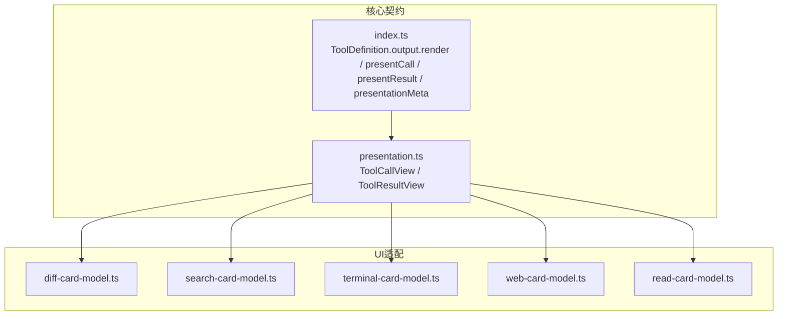
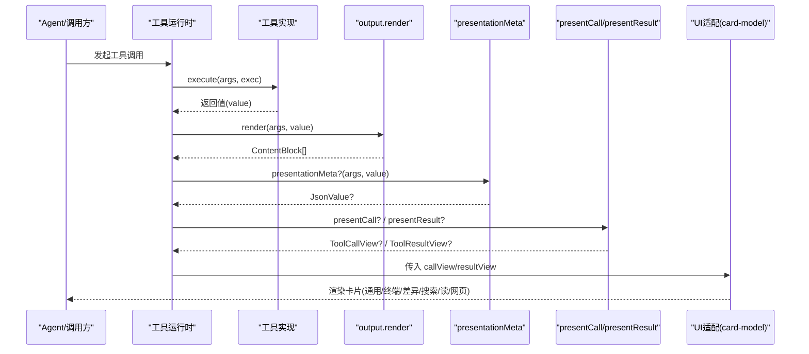
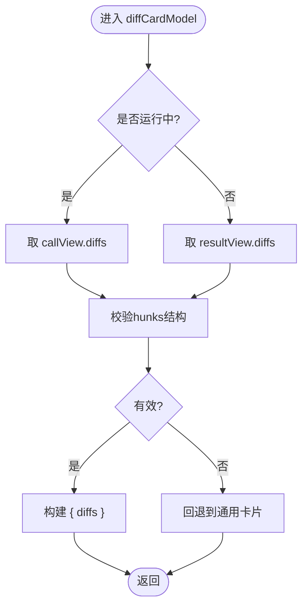
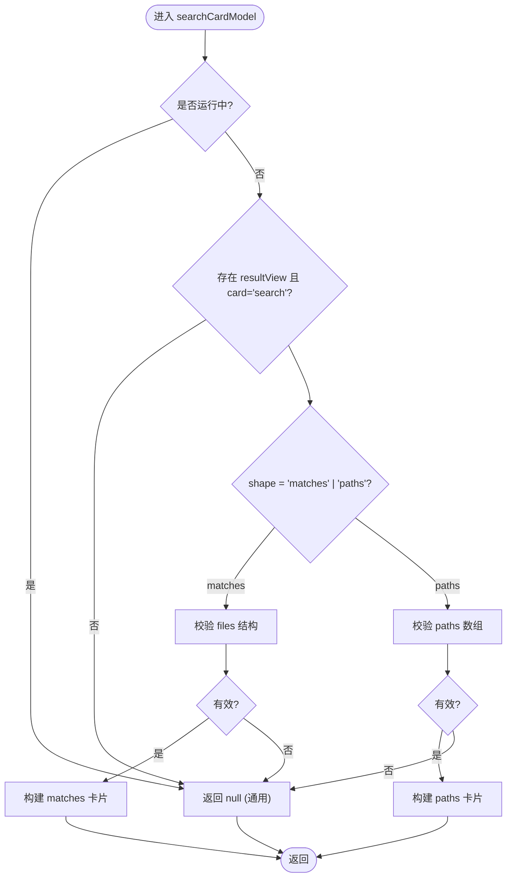
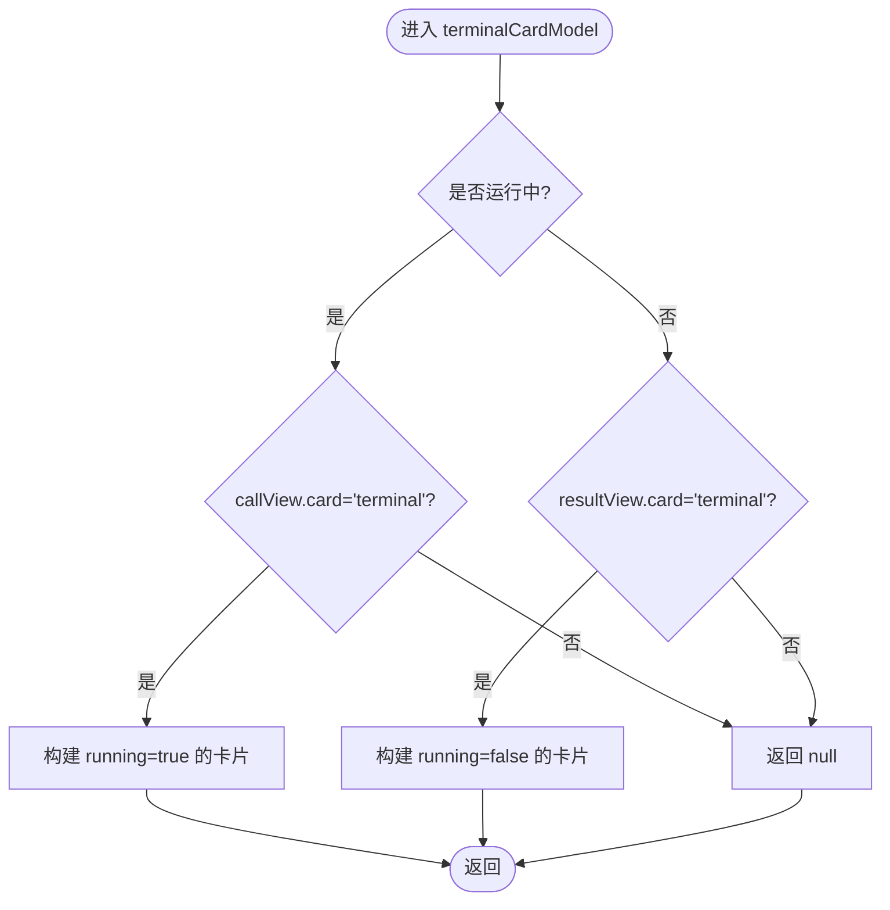
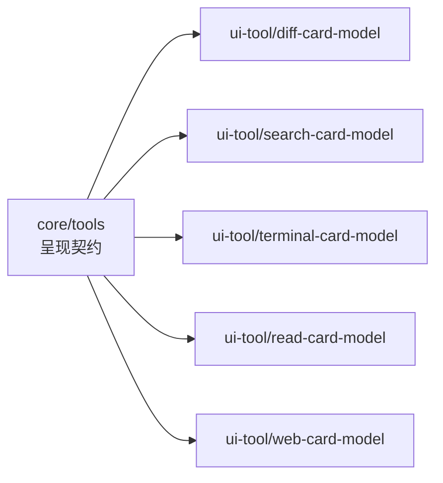

# UI渲染与呈现

<cite>
**本文引用的文件**
- [packages/core/tools/src/presentation.ts](file://packages/core/tools/src/presentation.ts)
- [packages/core/tools/src/index.ts](file://packages/core/tools/src/index.ts)
- [packages/client/ui-tool/src/client/tool/models/diff-card-model.ts](file://packages/client/ui-tool/src/client/tool/models/diff-card-model.ts)
- [packages/client/ui-tool/src/client/tool/models/search-card-model.ts](file://packages/client/ui-tool/src/client/tool/models/search-card-model.ts)
- [packages/client/ui-tool/src/client/tool/models/terminal-card-model.ts](file://packages/client/ui-tool/src/client/tool/models/terminal-card-model.ts)
- [packages/client/ui-tool/src/client/tool/models/web-card-model.ts](file://packages/client/ui-tool/src/client/tool/models/web-card-model.ts)
- [packages/client/ui-tool/src/client/tool/models/read-card-model.ts](file://packages/client/ui-tool/src/client/tool/models/read-card-model.ts)
</cite>

## 目录
1. [简介](#简介)
2. [项目结构](#项目结构)
3. [核心组件](#核心组件)
4. [架构总览](#架构总览)
5. [详细组件分析](#详细组件分析)
6. [依赖关系分析](#依赖关系分析)
7. [性能考虑](#性能考虑)
8. [故障排查指南](#故障排查指南)
9. [结论](#结论)
10. [附录](#附录)

## 简介
本文件系统性说明工具的UI渲染与呈现机制，重点解释：
- output.render 的工作原理与模型可见内容的生成
- card-tagged render intent（通用、终端、差异、搜索、网页等）的概念与用法
- presentCall 与 presentResult 的实现要点，包括调用状态与结果状态的呈现
- presentationMeta 的作用，用于持久化可重放的数据
- 不同UI卡片的完整实现示例与最佳实践

## 项目结构
围绕“工具定义—执行—呈现”的链路，仓库将呈现契约与UI适配解耦：
- 核心呈现契约：在 core/tools 中定义 ToolCallView / ToolResultView 的 union 类型，以及 ToolDefinition.output.render、presentCall、presentResult、presentationMeta 等接口
- UI适配层：在 client/ui-tool 中为每种卡片提供纯推导函数，将快照中的 callView/resultView 映射到具体 UI 原语所需的 props

图表来源
- [packages/core/tools/src/presentation.ts:1-390](file://packages/core/tools/src/presentation.ts#L1-L390)
- [packages/core/tools/src/index.ts:211-287](file://packages/core/tools/src/index.ts#L211-L287)
- [packages/client/ui-tool/src/client/tool/models/diff-card-model.ts:1-98](file://packages/client/ui-tool/src/client/tool/models/diff-card-model.ts#L1-L98)
- [packages/client/ui-tool/src/client/tool/models/search-card-model.ts:1-161](file://packages/client/ui-tool/src/client/tool/models/search-card-model.ts#L1-L161)
- [packages/client/ui-tool/src/client/tool/models/terminal-card-model.ts:1-220](file://packages/client/ui-tool/src/client/tool/models/terminal-card-model.ts#L1-L220)
- [packages/client/ui-tool/src/client/tool/models/web-card-model.ts:1-75](file://packages/client/ui-tool/src/client/tool/models/web-card-model.ts#L1-L75)
- [packages/client/ui-tool/src/client/tool/models/read-card-model.ts:1-77](file://packages/client/ui-tool/src/client/tool/models/read-card-model.ts#L1-L77)

章节来源
- [packages/core/tools/src/presentation.ts:1-390](file://packages/core/tools/src/presentation.ts#L1-L390)
- [packages/core/tools/src/index.ts:211-287](file://packages/core/tools/src/index.ts#L211-L287)

## 核心组件
- 呈现契约（ToolCallView / ToolResultView）
  - 通过 card 标签区分不同卡片类型：generic、terminal、diff、search、read、web
  - 每个变体携带最小必要字段，供UI桥接器统一处理
- 工具定义（ToolDefinition）
  - output.render：将执行返回的JSON值转换为模型可见的ContentBlock[]
  - presentCall：可选，描述“待执行”的UI呈现（调用状态）
  - presentResult：可选，描述“已完成”的UI呈现（结果状态）
  - presentationMeta：可选，输出声明中的纯投影，用于持久化并参与回放
- UI适配（各card-model）
  - 从冻结快照中读取 callView/resultView，推导出对应UI原语的props
  - 对未知或损坏数据做安全降级，回退到通用卡片

章节来源
- [packages/core/tools/src/index.ts:211-287](file://packages/core/tools/src/index.ts#L211-L287)
- [packages/core/tools/src/presentation.ts:1-390](file://packages/core/tools/src/presentation.ts#L1-L390)

## 架构总览
下图展示一次工具调用的端到端流程：从工具定义到UI呈现。

图表来源
- [packages/core/tools/src/index.ts:211-287](file://packages/core/tools/src/index.ts#L211-L287)
- [packages/core/tools/src/presentation.ts:1-390](file://packages/core/tools/src/presentation.ts#L1-L390)

## 详细组件分析

### output.render：模型可见内容生成
- 职责：将工具返回的JSON值转换为模型可见的ContentBlock[]，作为最终文本/结构化内容
- 位置与契约：由 ToolDefinition.output.render 定义，并在工具执行后由运行时调用
- 与呈现的关系：render负责“模型可见内容”，而presentCall/presentResult负责“UI呈现”。两者可独立演进

章节来源
- [packages/core/tools/src/index.ts:211-219](file://packages/core/tools/src/index.ts#L211-L219)

### card-tagged render intent：通用、终端、差异、搜索、读、网页
- 通用（generic）
  - 默认卡片，包含标题、类别、原始输入摘要、附加内容块、跟随的文件位置
  - 适用于未声明专用呈现的工具或错误路径
- 终端（terminal）
  - 用于前台命令执行，包含命令、工作目录、运行中/退出码/信号、输出
  - 支持相对cwd解析与UNC路径归一化
- 差异（diff）
  - 用于文件创建/编辑/覆盖，包含按文件的旧/新文本片段
  - 运行期使用call-time diffs，结算后用result diffs替换
- 搜索（search）
  - 结果时呈现，分为“匹配行分组”和“路径列表”两种形状
  - 携带截断与总数信息，必要时暴露恢复定位器
- 读（read）
  - 结果时呈现带行号的文件窗口，含语言提示与总行数
  - 通过presentationMeta传递无法从文本重建的结构信息
- 网页（web）
  - 搜索结果与抓取结果的结构化呈现，包含来源、答案、状态码、截断标记

章节来源
- [packages/core/tools/src/presentation.ts:46-390](file://packages/core/tools/src/presentation.ts#L46-L390)

### presentCall 与 presentResult：调用状态与结果状态
- presentCall
  - 可选；基于参数生成“待执行”视图（ToolCallView），用于流式/回放时的即时呈现
  - 必须是纯函数，无副作用
- presentResult
  - 可选；基于参数与结果（content、是否错误、meta）生成“已完成”视图（ToolResultView）
  - 若省略则保留待执行标题并以原始结果内容呈现
- 与UI适配
  - UI侧根据 block.callView / block.resultView 选择对应的card-model进行props推导

章节来源
- [packages/core/tools/src/index.ts:270-287](file://packages/core/tools/src/index.ts#L270-L287)
- [packages/core/tools/src/presentation.ts:132-139](file://packages/core/tools/src/presentation.ts#L132-L139)

### presentationMeta：持久化可重放的数据
- 作用：由 output.presentationMeta 计算，随会话日志持久化，供 presentResult 在回放时读取
- 典型用途：
  - read：传递path/offset/lang/totalLines等无法从文本重建的信息
  - web：传递WebSource等结构化来源
- 约束：必须可JSON序列化，且仅对顶层调用计算

章节来源
- [packages/core/tools/src/index.ts:211-219](file://packages/core/tools/src/index.ts#L211-L219)
- [packages/core/tools/src/presentation.ts:269-318](file://packages/core/tools/src/presentation.ts#L269-L318)

### 各卡片类型的UI实现示例

#### 差异卡片（diff）
- 行为：
  - 运行期：从 callView.diffs 提取hunks，渲染预期变更
  - 结算后：用 resultView.diffs 替换，显示实际应用的上下文hunk或整文件diff
- 健壮性：对缺失/非法diffs做校验，失败回退到通用卡片

图表来源
- [packages/client/ui-tool/src/client/tool/models/diff-card-model.ts:38-98](file://packages/client/ui-tool/src/client/tool/models/diff-card-model.ts#L38-L98)

章节来源
- [packages/client/ui-tool/src/client/tool/models/diff-card-model.ts:1-98](file://packages/client/ui-tool/src/client/tool/models/diff-card-model.ts#L1-L98)

#### 搜索卡片（search）
- 行为：
  - 仅结果时存在；根据 shape 区分“匹配行分组”与“路径列表”
  - 携带 truncated/total，必要时暴露 recovery 文本以恢复被截断的行
- 健壮性：对 files/paths 做严格校验，未知shape或损坏数据回退通用卡片

图表来源
- [packages/client/ui-tool/src/client/tool/models/search-card-model.ts:77-161](file://packages/client/ui-tool/src/client/tool/models/search-card-model.ts#L77-L161)

章节来源
- [packages/client/ui-tool/src/client/tool/models/search-card-model.ts:1-161](file://packages/client/ui-tool/src/client/tool/models/search-card-model.ts#L1-L161)

#### 终端卡片（terminal）
- 行为：
  - 运行期：显示命令、工作目录（支持相对cwd解析）、running状态
  - 结算后：显示输出、退出码/信号，并决定是否失败
- 健壮性：未知card或丢失call头时仍能渲染（命令回退为空，cwd可能不可知）

图表来源
- [packages/client/ui-tool/src/client/tool/models/terminal-card-model.ts:156-220](file://packages/client/ui-tool/src/client/tool/models/terminal-card-model.ts#L156-L220)

章节来源
- [packages/client/ui-tool/src/client/tool/models/terminal-card-model.ts:1-220](file://packages/client/ui-tool/src/client/tool/models/terminal-card-model.ts#L1-L220)

#### 读卡片（read）
- 行为：
  - 仅结果时存在；展示文件路径、行窗口、总行数、语言提示
  - 标签优先使用title，否则相对化路径
- 健壮性：运行期或未知card均回退通用卡片

章节来源
- [packages/client/ui-tool/src/client/tool/models/read-card-model.ts:1-77](file://packages/client/ui-tool/src/client/tool/models/read-card-model.ts#L1-L77)

#### 网页卡片（web）
- 行为：
  - 仅结果时存在；区分 search/fetch
  - search：来源列表、可选答案、截断标记
  - fetch：最终URL、HTTP状态码、截断标记
- 健壮性：未知kind回退通用卡片

章节来源
- [packages/client/ui-tool/src/client/tool/models/web-card-model.ts:1-75](file://packages/client/ui-tool/src/client/tool/models/web-card-model.ts#L1-L75)

## 依赖关系分析
- 核心契约与UI适配的耦合点在于 card 标签与字段约定
- UI适配层对未知/损坏数据采取“安全降级”策略，避免崩溃
- 终端卡片的cwd解析依赖会话工作区根路径，确保相对路径正确显示

图表来源
- [packages/core/tools/src/presentation.ts:1-390](file://packages/core/tools/src/presentation.ts#L1-L390)
- [packages/client/ui-tool/src/client/tool/models/diff-card-model.ts:1-98](file://packages/client/ui-tool/src/client/tool/models/diff-card-model.ts#L1-L98)
- [packages/client/ui-tool/src/client/tool/models/search-card-model.ts:1-161](file://packages/client/ui-tool/src/client/tool/models/search-card-model.ts#L1-L161)
- [packages/client/ui-tool/src/client/tool/models/terminal-card-model.ts:1-220](file://packages/client/ui-tool/src/client/tool/models/terminal-card-model.ts#L1-L220)
- [packages/client/ui-tool/src/client/tool/models/read-card-model.ts:1-77](file://packages/client/ui-tool/src/client/tool/models/read-card-model.ts#L1-L77)
- [packages/client/ui-tool/src/client/tool/models/web-card-model.ts:1-75](file://packages/client/ui-tool/src/client/tool/models/web-card-model.ts#L1-L75)

## 性能考虑
- 呈现推导均为纯函数，便于缓存与复用
- 大结果（如搜索/终端输出）采用截断与展开策略，减少首屏渲染压力
- 差异卡片在运行期与结算后分别使用call/result diffs，避免重复计算
- 终端cwd解析仅在需要时进行，并对路径段进行轻量归一化

## 故障排查指南
- 现象：卡片未显示或回退到通用卡片
  - 检查是否存在有效的 callView/resultView 且 card 标签匹配
  - 对于search/diff等强结构卡片，确认files/paths/diffs等字段完整
- 现象：终端工作目录显示异常
  - 确认sessionCwd是否正确传入，relative cwd是否能被正确解析
- 现象：read/web卡片缺少结构化信息
  - 检查 output.presentationMeta 是否正确生成并随事件持久化
  - 确认 presentResult 能从 meta 中恢复所需字段

章节来源
- [packages/client/ui-tool/src/client/tool/models/search-card-model.ts:77-161](file://packages/client/ui-tool/src/client/tool/models/search-card-model.ts#L77-L161)
- [packages/client/ui-tool/src/client/tool/models/diff-card-model.ts:38-98](file://packages/client/ui-tool/src/client/tool/models/diff-card-model.ts#L38-L98)
- [packages/client/ui-tool/src/client/tool/models/terminal-card-model.ts:77-131](file://packages/client/ui-tool/src/client/tool/models/terminal-card-model.ts#L77-L131)
- [packages/core/tools/src/presentation.ts:269-318](file://packages/core/tools/src/presentation.ts#L269-L318)

## 结论
- output.render 负责生成模型可见内容，presentCall/presentResult 负责UI呈现，二者解耦且互补
- card-tagged render intent 提供了统一的呈现契约，使UI能跨工具一致地渲染不同意图
- presentationMeta 使得无法从文本重建的结构信息得以持久化与回放
- UI适配层通过严格的校验与安全降级，保证在不同版本与网络环境下稳定呈现

## 附录
- 术语对照
  - 调用状态：pending state，对应 ToolCallView
  - 结果状态：completed state，对应 ToolResultView
  - 呈现元数据：presentationMeta，用于持久化与回放
- 参考路径
  - 呈现契约：packages/core/tools/src/presentation.ts
  - 工具定义与执行管线：packages/core/tools/src/index.ts
  - UI适配实现：packages/client/ui-tool/src/client/tool/models/*