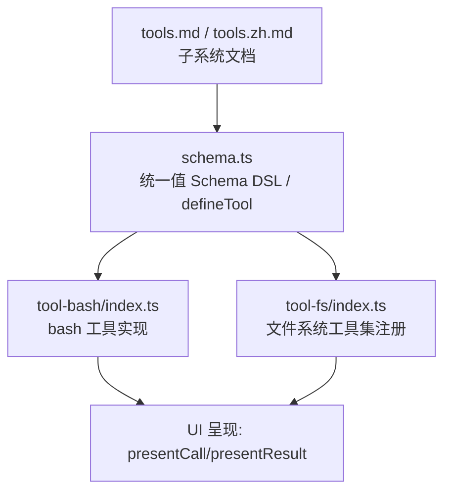
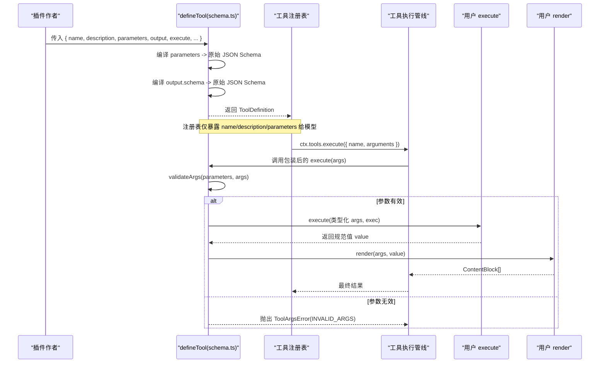
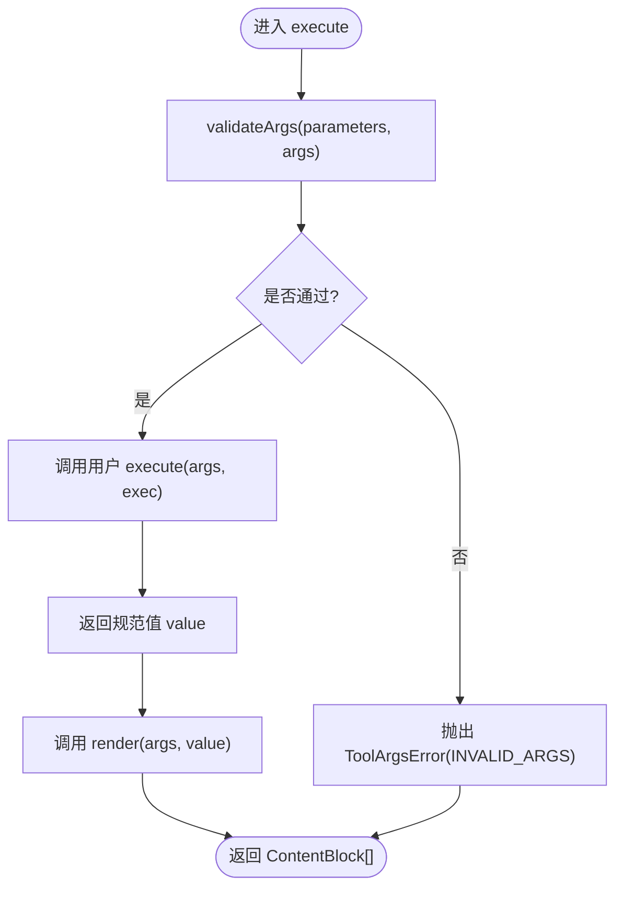
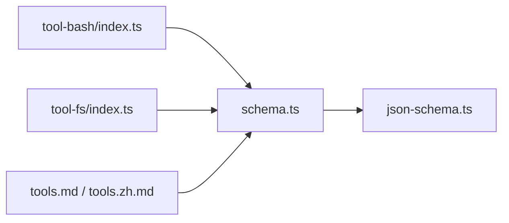

# 工具定义与参数模式

<cite>
**本文引用的文件**
- [packages/core/tools/src/schema.ts](file://packages/core/tools/src/schema.ts)
- [packages/core/tools/tests/schema.spec.ts](file://packages/core/tools/tests/schema.spec.ts)
- [packages/shell/tool-bash/src/index.ts](file://packages/shell/tool-bash/src/index.ts)
- [packages/fs/tool-fs/src/index.ts](file://packages/fs/tool-fs/src/index.ts)
- [docs/subsystems/tools.md](file://docs/subsystems/tools.md)
- [docs/subsystems/tools.zh.md](file://docs/subsystems/tools.zh.md)
</cite>

## 目录
1. [简介](#简介)
2. [项目结构](#项目结构)
3. [核心组件](#核心组件)
4. [架构总览](#架构总览)
5. [详细组件分析](#详细组件分析)
6. [依赖关系分析](#依赖关系分析)
7. [性能考量](#性能考量)
8. [故障排查指南](#故障排查指南)
9. [结论](#结论)
10. [附录](#附录)

## 简介
本文面向插件作者，系统说明如何在 deepseek-harness 中通过 defineTool 声明工具、如何编写 ParameterSchemaSpec 描述输入参数、如何通过 output.schema 约束输出值并实现 render/presentationMeta 渲染函数。同时解释参数校验机制、执行期的类型安全保证，以及 UI 呈现的 ToolCallView/ToolResultView 设计原则。文末提供完整示例路径与常见问题定位方法。

## 项目结构
围绕“工具定义与参数模式”的关键代码集中在 core/tools 的 schema 模块，并在具体工具包（如 bash、fs）中以 defineTool 的方式落地使用。文档子系统提供了完整的类型契约与 API 说明。



图表来源
- [packages/core/tools/src/schema.ts:482-617](file://packages/core/tools/src/schema.ts#L482-L617)
- [packages/shell/tool-bash/src/index.ts:242-393](file://packages/shell/tool-bash/src/index.ts#L242-L393)
- [packages/fs/tool-fs/src/index.ts:54-79](file://packages/fs/tool-fs/src/index.ts#L54-L79)
- [docs/subsystems/tools.md:9-151](file://docs/subsystems/tools.md#L9-L151)

章节来源
- [packages/core/tools/src/schema.ts:482-617](file://packages/core/tools/src/schema.ts#L482-L617)
- [docs/subsystems/tools.md:9-151](file://docs/subsystems/tools.md#L9-L151)

## 核心组件
- defineTool：统一的工具定义入口，负责编译参数 schema、输出 schema、注入 execute/render/presentationMeta/presentCall/presentResult/isConcurrencySafe 等能力，并提供运行时参数校验与类型收窄。
- ParameterSchemaSpec：隐式开放的对象根，属性以 ValueSchemaSpec 描述；required 仅支持 true，用于标记必填字段。
- ValueSchemaSpec：统一的值级 schema 词汇表，支持 string/number/integer/boolean/null/array/object/json/oneOf，标量支持 enum/const，对象必须显式声明 additionalProperties。
- output.schema：对工具成功返回值进行强制校验的原始 JSON Schema 子集；render 将已验证的值投影为模型可见内容；presentationMeta 提供顶层调用的可回放展示元数据。
- 执行期类型安全：execute 接收 InferArgs<S> 类型化的参数；output.render/presentationMeta 接收 InferValue<NoInfer<O>> 类型化的值；未通过 validateArgs 的参数会抛出 ToolArgsError。

章节来源
- [packages/core/tools/src/schema.ts:98-175](file://packages/core/tools/src/schema.ts#L98-L175)
- [packages/core/tools/src/schema.ts:432-458](file://packages/core/tools/src/schema.ts#L432-L458)
- [packages/core/tools/src/schema.ts:482-617](file://packages/core/tools/src/schema.ts#L482-L617)
- [docs/subsystems/tools.md:98-151](file://docs/subsystems/tools.md#L98-L151)

## 架构总览
defineTool 在注册时完成三件事：
- 编译 parameters → 原始 JSON Schema（隐式开放对象根 + required 收集）
- 编译 output.schema → 原始 JSON Schema（受支持的子集）
- 包装 execute 与展示回调：执行前校验参数，渲染时按类型收窄调用用户实现



图表来源
- [packages/core/tools/src/schema.ts:545-617](file://packages/core/tools/src/schema.ts#L545-L617)
- [docs/subsystems/tools.md:170-172](file://docs/subsystems/tools.md#L170-L172)

## 详细组件分析

### ParameterSchemaSpec 语法与约束
- 参数根是隐式开放对象：无需声明 type:'object'，直接以键值对定义属性。
- 每个属性为 ValueSchemaSpec，并可附加 required: true 表示必填。
- 显式 object 节点必须声明 additionalProperties: true | false，避免意外继承默认开放语义。
- 标量支持 enum/const，且值必须与节点类型一致。
- oneOf 至少两个分支，且不能与 type 混用。
- 编译过程拒绝不支持的键、循环引用、稀疏数组、非 JSON 值的 default/examples 等。

章节来源
- [packages/core/tools/src/schema.ts:23-106](file://packages/core/tools/src/schema.ts#L23-L106)
- [packages/core/tools/src/schema.ts:331-413](file://packages/core/tools/src/schema.ts#L331-L413)
- [packages/core/tools/tests/schema.spec.ts:36-112](file://packages/core/tools/tests/schema.spec.ts#L36-L112)

### output.schema 设计与渲染函数
- output.schema 使用受支持的原始 JSON Schema 子集，确保所有成功返回值均可被严格校验。
- render(args, value)：纯函数，将已验证的 value 投影为模型可见的 ContentBlock[]。
- presentationMeta?(args, value)：可选，仅顶层调用计算，用于回放友好的展示元数据。
- 若 render/presentationMeta 抛出或产出非法内容，会被转为 JSON 安全的 isError 结果，保障下游稳定。

章节来源
- [packages/core/tools/src/schema.ts:482-536](file://packages/core/tools/src/schema.ts#L482-L536)
- [docs/subsystems/tools.md:13-23](file://docs/subsystems/tools.md#L13-L23)

### 参数验证与执行期类型安全
- 参数验证：validateArgs 基于编译后的 parameters 运行 JSON Schema 校验，失败抛出 ToolArgsError（INVALID_ARGS）。
- 类型收窄：defineTool 利用 InferArgs/S 与 InferValue/O 将 execute 与 render/presentationMeta 的参数/返回值精确类型化，IDE 提示与编译期检查生效。
- 展示回调软校验：presentCall/presentResult 在回放场景下若参数不匹配则回退到通用卡片，避免抛错。

章节来源
- [packages/core/tools/src/schema.ts:460-480](file://packages/core/tools/src/schema.ts#L460-L480)
- [packages/core/tools/src/schema.ts:545-617](file://packages/core/tools/src/schema.ts#L545-L617)
- [packages/core/tools/tests/schema.spec.ts:142-187](file://packages/core/tools/tests/schema.spec.ts#L142-L187)

### 完整工具定义示例（bash 工具）
- 名称与描述：name='bash'，description 动态拼接背景执行开关与沙箱升级指引。
- 参数：command、description 必填；timeoutMs、workdir 可选；根据配置与策略条件性加入 run_in_background、sandbox_permissions、justification。
- 输出：oneOf 区分 background/foreground，分别携带 jobId 或进程结果字段；stdout/stderr 包含 text/truncated/spillPath。
- 渲染：render 将后台启动与前台结果分别转换为文本块；presentCall/presentResult 提供终端/通用卡片视图。
- 执行：先校验业务约束（命令非空、超时正数、沙箱升级配对），再决定前台执行或后台任务注册；处理中止信号与错误映射。

章节来源
- [packages/shell/tool-bash/src/index.ts:70-93](file://packages/shell/tool-bash/src/index.ts#L70-L93)
- [packages/shell/tool-bash/src/index.ts:242-393](file://packages/shell/tool-bash/src/index.ts#L242-L393)

### 文件系统工具集（read/write/edit/read_image）
- 通过 apply(ctx, config) 注册一组工具，读取配置并应用 readLimit/readMaxBytes 等限制。
- 条件注册 read_image：仅在挂载 attachments 时注册，避免无持久化能力的部署出现不可恢复状态。
- 写操作共享沙箱控制器，结合策略服务进行访问控制与拒绝标记映射。

章节来源
- [packages/fs/tool-fs/src/index.ts:24-41](file://packages/fs/tool-fs/src/index.ts#L24-L41)
- [packages/fs/tool-fs/src/index.ts:54-79](file://packages/fs/tool-fs/src/index.ts#L54-L79)

### 类图：工具定义与相关类型
```mermaid
classDiagram
class DefineToolOptions {
+string name
+string description
+ParameterSchemaSpec parameters
+{ schema, render, presentationMeta? } output
+number timeoutMs?
+isConcurrencySafe?(args) boolean?
+execute(args, exec) Promise
+finalizeContent?(exec, result) ContentBlock[]?
+presentCall?(args) ToolCallView?
+presentResult?(args, result) ToolResultView?
}
class ToolDefinition {
+string name
+string description
+Record parameters
+ToolOutputDefinition output
+execute(args, exec) Promise
+finalizeContent?(exec, result) ContentBlock[]?
+timeoutMs? number
+isConcurrencySafe?(args) boolean?
+presentCall?(args) ToolCallView?
+presentResult?(args, result) ToolResultView?
}
class ToolOutputDefinition {
+JsonSchemaNode schema
+render(args, value) ContentBlock[]
+presentationMeta?(args, value) JsonValue?
}
DefineToolOptions --> ToolDefinition : "defineTool() 生成"
ToolDefinition --> ToolOutputDefinition : "拥有"
```

图表来源
- [packages/core/tools/src/schema.ts:482-536](file://packages/core/tools/src/schema.ts#L482-L536)
- [packages/core/tools/src/schema.ts:545-617](file://packages/core/tools/src/schema.ts#L545-L617)

### 流程图：参数校验与执行分支


图表来源
- [packages/core/tools/src/schema.ts:585-589](file://packages/core/tools/src/schema.ts#L585-L589)

## 依赖关系分析
- schema.ts 依赖 json-schema.ts 提供的原始 JSON Schema 校验与断言，确保 author DSL 编译产物符合受支持子集。
- tool-bash 依赖 defineTool 与工具呈现类型，组合 shell/jobs/sandbox/systemPrompt 等能力。
- tool-fs 依赖 fs 抽象与附件存储，条件注册 read_image。
- 文档子系统提供类型契约与 API 参考，保持源码与文档同步。



图表来源
- [packages/core/tools/src/schema.ts:1-9](file://packages/core/tools/src/schema.ts#L1-L9)
- [packages/shell/tool-bash/src/index.ts:11-28](file://packages/shell/tool-bash/src/index.ts#L11-L28)
- [packages/fs/tool-fs/src/index.ts:8-17](file://packages/fs/tool-fs/src/index.ts#L8-L17)
- [docs/subsystems/tools.md:1-7](file://docs/subsystems/tools.md#L1-L7)

章节来源
- [packages/core/tools/src/schema.ts:1-9](file://packages/core/tools/src/schema.ts#L1-L9)
- [packages/shell/tool-bash/src/index.ts:11-28](file://packages/shell/tool-bash/src/index.ts#L11-L28)
- [packages/fs/tool-fs/src/index.ts:8-17](file://packages/fs/tool-fs/src/index.ts#L8-L17)
- [docs/subsystems/tools.md:1-7](file://docs/subsystems/tools.md#L1-L7)

## 性能考量
- 编译期推断上限：InferValue 在 16 层容器后回退为 JsonValue，避免类型实例化栈耗尽；运行时校验仍遍历完整 schema，兼顾性能与正确性。
- 深度 oneOf 编译：采用任务队列而非递归，避免栈溢出，支持极深嵌套。
- 展示回调软校验：回放场景下 presentCall/presentResult 对参数不匹配直接回退通用视图，避免异常开销。

章节来源
- [packages/core/tools/src/schema.ts:149-175](file://packages/core/tools/src/schema.ts#L149-L175)
- [packages/core/tools/tests/schema.spec.ts:114-129](file://packages/core/tools/tests/schema.spec.ts#L114-L129)
- [packages/core/tools/src/schema.ts:594-615](file://packages/core/tools/src/schema.ts#L594-L615)

## 故障排查指南
- 参数不合法：检查 parameters 中各属性的类型、enum/const 是否与节点类型一致；确认 required 仅允许 true；对象节点必须显式 additionalProperties。
- oneOf 错误：确保至少两个分支，且不能与 type 混用；oneOf 数组需为稠密数组。
- 循环引用：避免 properties/items 自引用导致 circular 报错。
- 输出值无效：检查 output.schema 约束与 render 返回值；若 render/presentationMeta 抛出，将被转为 isError 结果。
- 后台执行不可用：确认 enableRunInBackground 配置与 jobs 服务已加载；否则 run_in_background 将被拒绝。

章节来源
- [packages/core/tools/tests/schema.spec.ts:60-112](file://packages/core/tools/tests/schema.spec.ts#L60-L112)
- [packages/shell/tool-bash/src/index.ts:349-357](file://packages/shell/tool-bash/src/index.ts#L349-L357)
- [packages/core/tools/src/schema.ts:460-480](file://packages/core/tools/src/schema.ts#L460-L480)

## 结论
通过 defineTool 与统一的 ValueSchemaSpec/ParameterSchemaSpec，deepseek-harness 实现了从参数声明、输出约束到执行期类型安全的完整闭环。配合 output.schema 与 render/presentationMeta，既能保证模型请求的稳定性，又能提供丰富的 UI 呈现能力。实际工具（如 bash、fs）展示了如何组合配置、策略与服务，构建健壮的工具链。

## 附录
- 快速上手清单
  - 使用 defineTool 声明 name/description/parameters/output/execute。
  - 在 parameters 中使用 ValueSchemaSpec 描述每个参数，必填加 required: true。
  - 在 output.schema 中声明成功返回值的 JSON Schema 子集，并实现 render。
  - 如需 UI 定制，实现 presentCall/presentResult；如需顶层元数据，实现 presentationMeta。
  - 遇到参数错误，优先检查 schema 合法性与枚举/常量类型一致性。

- 参考路径
  - 工具子系统文档：[docs/subsystems/tools.md](file://docs/subsystems/tools.md)
  - 中文文档：[docs/subsystems/tools.zh.md](file://docs/subsystems/tools.zh.md)
  - 统一 schema DSL 与 defineTool：[packages/core/tools/src/schema.ts](file://packages/core/tools/src/schema.ts)
  - bash 工具实现示例：[packages/shell/tool-bash/src/index.ts](file://packages/shell/tool-bash/src/index.ts)
  - 文件系统工具集注册：[packages/fs/tool-fs/src/index.ts](file://packages/fs/tool-fs/src/index.ts)
  - 单元测试覆盖边界与类型推断：[packages/core/tools/tests/schema.spec.ts](file://packages/core/tools/tests/schema.spec.ts)