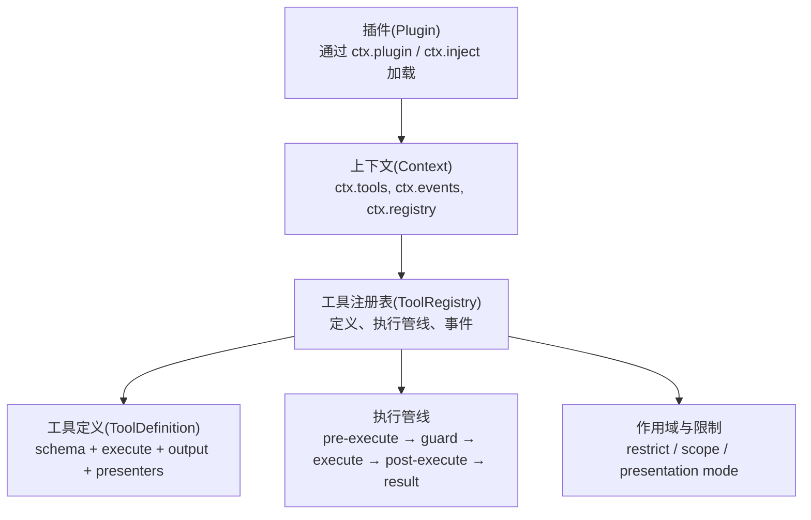
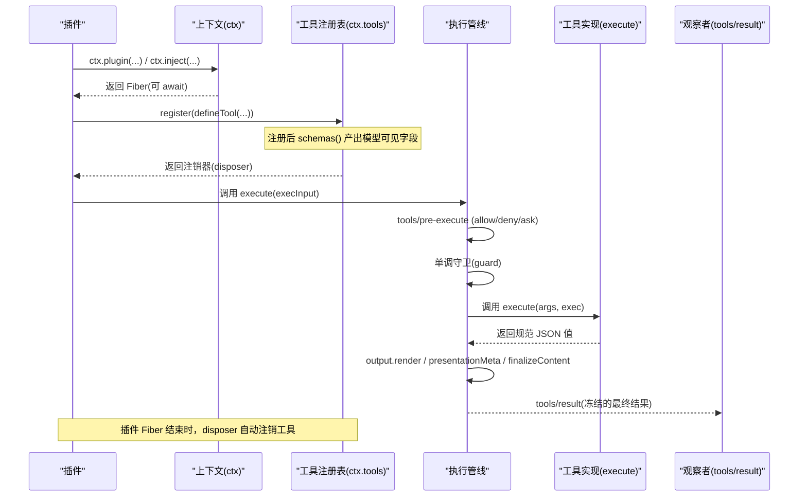
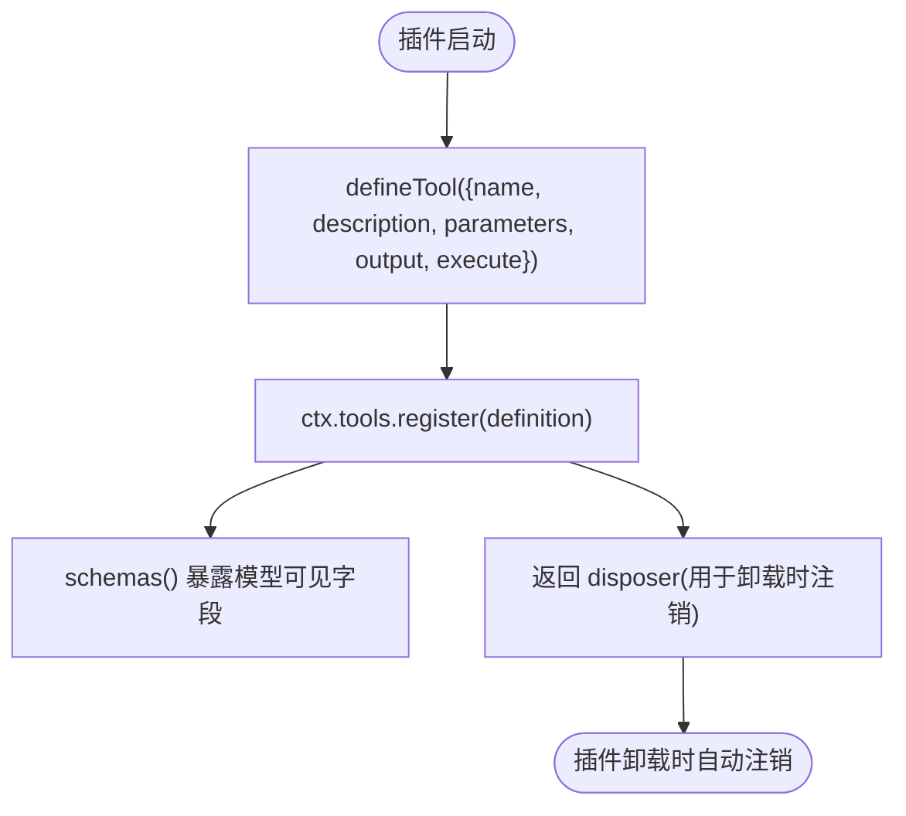
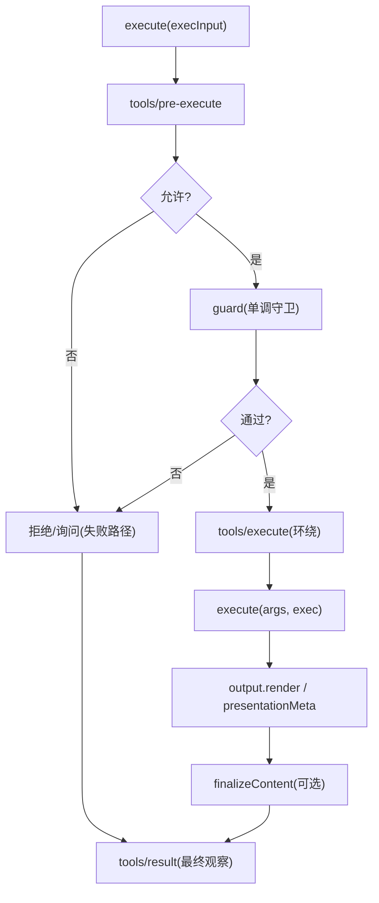
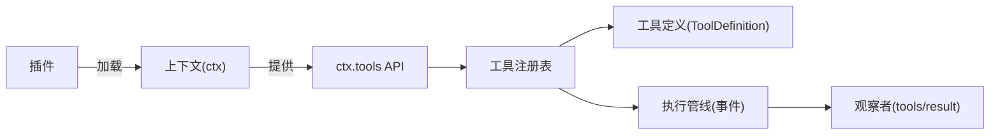

# 工具注册与集成

<cite>
**本文引用的文件**
- [packages/core/tools/src/index.ts](file://packages/core/tools/src/index.ts)
- [packages/core/tools/src/schema.ts](file://packages/core/tools/src/schema.ts)
- [docs/subsystems/tools.md](file://docs/subsystems/tools.md)
- [docs/cordis-api/registry.md](file://docs/cordis-api/registry.md)
- [docs/cordis-api/context.md](file://docs/cordis-api/context.md)
- [docs/cookbook/adding-a-tool.md](file://docs/cookbook/adding-a-tool.md)
</cite>

## 目录
1. [简介](#简介)
2. [项目结构](#项目结构)
3. [核心组件](#核心组件)
4. [架构总览](#架构总览)
5. [详细组件分析](#详细组件分析)
6. [依赖关系分析](#依赖关系分析)
7. [性能考量](#性能考量)
8. [故障排查指南](#故障排查指南)
9. [结论](#结论)
10. [附录：集成示例](#附录集成示例)

## 简介
本文件系统性说明 DeepSeek Harness 中“工具”的注册与集成机制，覆盖以下主题：
- 如何通过 defineTool 创建工具实例，并在插件中使用 ctx.tools.register 完成注册。
- 工具生命周期管理，包括插件卸载时自动注销。
- 工具的配置选项、依赖注入与作用域隔离（含可见性过滤）。
- 将多个工具组织为工具包、版本管理与发布策略。
- 实际集成示例：CLI、Web、Python SDK 的接入方式。

## 项目结构
围绕工具的核心代码位于 packages/core/tools，文档位于 docs 子目录；Cordis 插件与上下文能力在 vendor/cordis 中提供，并通过 docs/cordis-api 暴露给使用者。

图表来源
- [packages/core/tools/src/index.ts:137-200](file://packages/core/tools/src/index.ts#L137-L200)
- [docs/subsystems/tools.md:478-574](file://docs/subsystems/tools.md#L478-L574)
- [docs/cordis-api/registry.md:8-56](file://docs/cordis-api/registry.md#L8-L56)
- [docs/cordis-api/context.md:14-96](file://docs/cordis-api/context.md#L14-L96)

章节来源
- [packages/core/tools/src/index.ts:137-200](file://packages/core/tools/src/index.ts#L137-L200)
- [docs/subsystems/tools.md:478-574](file://docs/subsystems/tools.md#L478-L574)
- [docs/cordis-api/registry.md:8-56](file://docs/cordis-api/registry.md#L8-L56)
- [docs/cordis-api/context.md:14-96](file://docs/cordis-api/context.md#L14-L96)

## 核心组件
- defineTool：统一参数/输出 Schema DSL，类型推断与运行时校验，生成 ToolDefinition。
- ToolDefinition：模型可见的 ToolSchema 加上 execute、output、可选 finalizeContent、timeoutMs、isConcurrencySafe、presentCall/presentResult。
- ctx.tools：工具注册表与执行管线，提供 register、schemas、execute、guard、restrict、get、executionMode、presentAs 等能力。
- 执行管线：tools/pre-ex允许/拒绝/询问 → 单调守卫(guard) → tools/execute 环绕包装 → tools/post-execute 结果替换/阻断 → finalizeContent → tools/result 最终观察。
- 作用域与限制：ToolRestriction 对全局工具进行 allow/deny 过滤；scoped 注册可遮蔽全局；presentAs 切换呈现模式。

章节来源
- [docs/subsystems/tools.md:9-96](file://docs/subsystems/tools.md#L9-L96)
- [docs/subsystems/tools.md:153-168](file://docs/subsystems/tools.md#L153-L168)
- [docs/subsystems/tools.md:170-404](file://docs/subsystems/tools.md#L170-L404)
- [docs/subsystems/tools.md:478-574](file://docs/subsystems/tools.md#L478-L574)
- [packages/core/tools/src/index.ts:137-200](file://packages/core/tools/src/index.ts#L137-L200)

## 架构总览
下图展示从插件到工具执行的端到端流程，以及关键扩展点。

图表来源
- [docs/subsystems/tools.md:170-404](file://docs/subsystems/tools.md#L170-L404)
- [docs/subsystems/tools.md:478-574](file://docs/subsystems/tools.md#L478-L574)
- [docs/cordis-api/registry.md:8-56](file://docs/cordis-api/registry.md#L8-L56)

## 详细组件分析

### 使用 defineTool 创建工具并注册
- 在插件中声明 name 与 inject（如 ['tools']），在 apply(ctx) 中调用 ctx.tools.register(defineTool({...}))。
- defineTool 会基于 parameters/output 做类型推断与运行时校验，确保 args/value 符合 Schema。
- 注册是“效果式”的：插件 Fiber 被卸载时，返回的 disposer 会被调用，工具自动注销。

图表来源
- [docs/cookbook/adding-a-tool.md:7-39](file://docs/cookbook/adding-a-tool.md#L7-L39)
- [docs/subsystems/tools.md:478-574](file://docs/subsystems/tools.md#L478-L574)

章节来源
- [docs/cookbook/adding-a-tool.md:7-39](file://docs/cookbook/adding-a-tool.md#L7-L39)
- [docs/subsystems/tools.md:478-574](file://docs/subsystems/tools.md#L478-L574)

### 工具执行管线与生命周期
- 入口：ctx.tools.execute(execInput)，其中包含 callId、name、arguments、signal 等。
- 阶段顺序：
  - tools/pre-execute：允许/拒绝/请求审批。
  - 单调守卫(guard)：最终不可逆的拒绝。
  - tools/execute：超时、重试、指标等环绕逻辑。
  - tools/post-execute：接受/替换内容或值、附加上下文、阻断。
  - finalizeContent：工具自定义最终内容投影（仅顶层调用）。
  - tools/result：最终冻结结果的只读观察。
- 取消与超时：exec.signal 贯穿全程；timeoutMs 由外部策略包装执行。
- 并发控制：isConcurrencySafe 决定是否可以与兄弟调用并行。

图表来源
- [docs/subsystems/tools.md:170-404](file://docs/subsystems/tools.md#L170-L404)

章节来源
- [docs/subsystems/tools.md:170-404](file://docs/subsystems/tools.md#L170-L404)

### 配置选项、依赖注入与作用域隔离
- 依赖注入：插件通过 ctx.inject(['tools'], callback) 声明依赖，服务可用后再运行回调；也可用 ctx.plugin 直接加载。
- 作用域隔离：
  - ctx.isolate(name, label)：为某服务创建独立作用域，避免互相影响。
  - ctx.intercept(name, config)：为特定服务注入拦截配置。
  - ctx.extend(meta)：创建携带额外元数据的子上下文。
- 工具可见性：
  - ctx.tools.restrict({allow, deny})：对全局工具集进行 allow/deny 过滤，scoped 注册不受限。
  - ctx.tools.presentAs(mode)：切换呈现模式，影响模型看到的工具集合。
  - ctx.tools.get/schemas：按作用域查询可见的工具定义与模型可见 schema。

章节来源
- [docs/cordis-api/registry.md:8-56](file://docs/cordis-api/registry.md#L8-L56)
- [docs/cordis-api/context.md:14-96](file://docs/cordis-api/context.md#L14-L96)
- [docs/subsystems/tools.md:153-168](file://docs/subsystems/tools.md#L153-L168)
- [docs/subsystems/tools.md:478-574](file://docs/subsystems/tools.md#L478-L574)

### 工具包组织、版本管理与发布
- 组织方式：
  - 每个工具以 defineTool 定义，插件内集中注册；可按功能域拆分为多个插件/包。
  - 通过 ctx.tools.schemas(scope) 聚合模型可见的工具列表，便于系统提示组装。
- 版本管理建议：
  - 工具名作为稳定标识；变更参数/行为需遵循语义化版本，必要时引入兼容层。
  - 使用 restrict 逐步灰度/回滚工具可见性。
  - 通过 tools/change 事件监听工具集变化，驱动 UI/提示更新。
- 发布策略：
  - 将工具打包为独立 npm 包，对外暴露插件函数；宿主通过 ctx.plugin 加载。
  - 在 CI 中验证 schemas() 输出与类型生成产物一致性。

章节来源
- [docs/subsystems/tools.md:470-574](file://docs/subsystems/tools.md#L470-L574)
- [docs/cookbook/adding-a-tool.md:39-66](file://docs/cookbook/adding-a-tool.md#L39-L66)

### 工具呈现与 UI 契约
- presentCall/presentResult：纯函数，基于 args/result 返回 card-tagged 视图意图（generic/terminal/diff/search/read/web）。
- output.render：面向模型的文本/结构化内容；presentationMeta：持久化 UI 所需元数据。
- finalizeContent：仅在顶层调用生效，用于最终内容裁剪或增强。

章节来源
- [docs/subsystems/tools.md:459-468](file://docs/subsystems/tools.md#L459-L468)
- [docs/cookbook/adding-a-tool.md:67-89](file://docs/cookbook/adding-a-tool.md#L67-L89)

## 依赖关系分析
- 插件依赖 Cordis 上下文与注册表（ctx.plugin/inject）。
- 工具实现依赖 dsh-tools 提供的 defineTool、Schema DSL、执行管线事件。
- 宿主侧通过 ctx.tools 暴露注册表能力；UI/Agent 通过 schemas()/get 获取可见工具。

图表来源
- [docs/cordis-api/registry.md:8-56](file://docs/cordis-api/registry.md#L8-L56)
- [docs/subsystems/tools.md:478-574](file://docs/subsystems/tools.md#L478-L574)

章节来源
- [docs/cordis-api/registry.md:8-56](file://docs/cordis-api/registry.md#L8-L56)
- [docs/subsystems/tools.md:478-574](file://docs/subsystems/tools.md#L478-L574)

## 性能考量
- 参数与返回值采用 lossless-JSON 快照与冻结，减少后续处理开销并确保一致性。
- isConcurrencySafe 允许将无副作用的工具并行调度，提升吞吐。
- timeoutMs 配合 tools/execute 包装，避免长尾任务阻塞。
- finalizeContent 与 presenters 为纯函数，避免在回放/流式中产生副作用。

章节来源
- [docs/subsystems/tools.md:170-404](file://docs/subsystems/tools.md#L170-L404)

## 故障排查指南
- 未知工具：调用不存在的工具名会返回 UNKNOWN_TOOL 错误，检查名称与可见性（restrict/presentAs）。
- 参数非法：抛出 INVALID_ARGS，核对 parameters 与 required 标注。
- 输出非法：抛出 INVALID_TOOL_OUTPUT，核对 output.schema 与 execute 返回值。
- 取消/超时：确认 execute 内部正确响应 exec.signal；必要时设置 timeoutMs。
- 权限拒绝：检查 tools/pre-execute 与 guard 是否返回拒绝原因。
- 回放崩溃：presentCall/presentResult 必须为纯函数，避免读取会话状态或时钟。

章节来源
- [docs/subsystems/tools.md:170-404](file://docs/subsystems/tools.md#L170-L404)
- [docs/cookbook/adding-a-tool.md:40-66](file://docs/cookbook/adding-a-tool.md#L40-L66)

## 结论
DeepSeek Harness 的工具体系以 defineTool 为核心，结合 ctx.tools 注册表与可扩展的执行管线，提供了强类型、可观测、可治理的工具生态。通过作用域隔离、可见性过滤与插件生命周期管理，可在 CLI/Web/SDK 等多宿主环境中安全集成与演进。

## 附录：集成示例

### CLI 集成
- 在 CLI 应用中加载插件，使用 ctx.plugin/inject 初始化工具集。
- 通过 ctx.tools.schemas() 获取模型可见工具列表，用于构建系统提示。
- 使用 ctx.tools.execute 执行工具调用，订阅 tools/result 收集结果。

章节来源
- [docs/cordis-api/registry.md:8-56](file://docs/cordis-api/registry.md#L8-L56)
- [docs/subsystems/tools.md:478-574](file://docs/subsystems/tools.md#L478-L574)

### Web 集成
- Web 应用通过 Vite/前端工程加载宿主，挂载 Cordis 上下文。
- 使用 ctx.tools.presentAs 控制不同模式下模型可见的工具集合。
- UI 根据 presentCall/presentResult 渲染卡片（终端、差异、搜索、读取、网页检索等）。

章节来源
- [docs/subsystems/tools.md:459-468](file://docs/subsystems/tools.md#L459-L468)
- [docs/subsystems/tools.md:478-574](file://docs/subsystems/tools.md#L478-L574)

### Python SDK 集成
- Code Mode 下，工具可通过生成的 SDK 在 Python 程序中直接调用（await tools.<name>(args)）。
- 调用进入正常执行管线，成功返回规范 JSON 值，失败抛出结构化错误。
- 建议在 Python SDK 中封装工具调用，捕获错误并转换为业务异常。

章节来源
- [docs/cookbook/adding-a-tool.md:61-66](file://docs/cookbook/adding-a-tool.md#L61-L66)