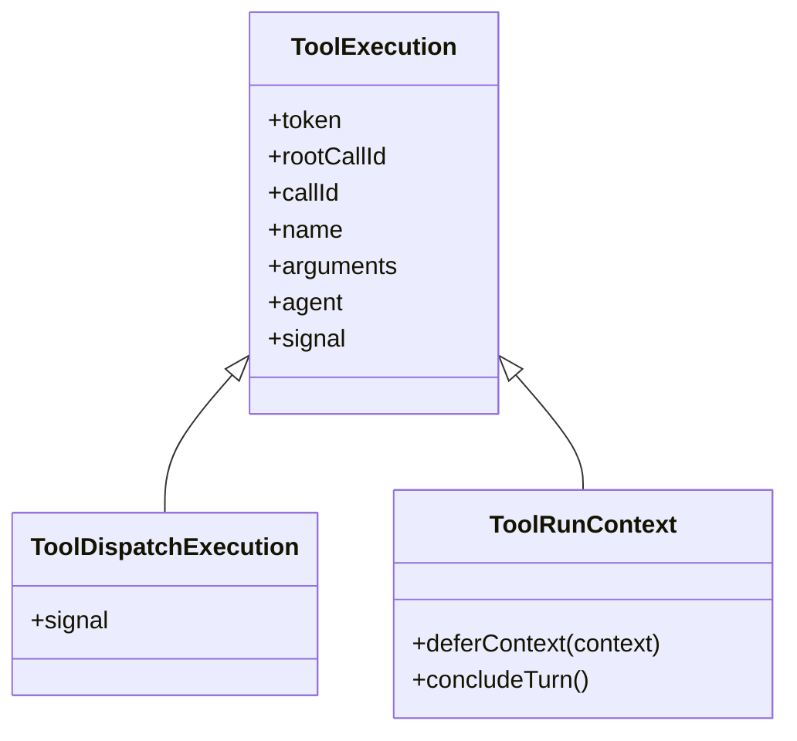

# 执行生命周期管�

<cite>
**本文引用的文件**
- [packages/core/tools/src/index.ts](file://packages/core/tools/src/index.ts)
- [packages/jobs/jobs/src/index.ts](file://packages/jobs/jobs/src/index.ts)
- [packages/jobs/jobs/src/types.ts](file://packages/jobs/jobs/src/types.ts)
- [packages/core/tools/src/types.ts](file://packages/core/tools/src/types.ts)
</cite>

## 目录
1. [简介](#简介)
2. [项目结�](#项目结�)
3. [核心组件](#核心组件)
4. [��总览](#��总览)
5. [详细组件分�](#详细组件分�)
6. [�赖关系分�](#�赖关系分�)
7. [性能考�](#性能考�)
8. [故障�查指�](#故障�查指�)
9. [结论](#结论)
10. [附录](#附录)

## 简介
本文件系统性说�工具执行的生命周期管�机制，覆盖以下�点：
- execute 函数的契约�求：�数校验�错误处��信��消�超时。
- exec 对象�供的能力：token�signal�agent 注入�deferContext�concludeTurn 等。
- 工具的错误处�策略：异常���结�化错误返��输出校验�投影失败处�。
- 长时间�行工具的��任务：jobs 系统的使用�状��转�读���消。
- �际生命周期示例：异步�作�资�清���消传播�最终结��交。

## 项目结�
围绕“工具执行�和“��任务�的核心代�分布在两个包中：
- tools（工具�行时）：�供工具注册�执行管线�事件水线（pre/around/post/result）�执行上下文�错误模�。
- jobs（��作业）：�供作业注册�生命周期�读���消�完�监�。

```mermaid
graph TB
subgraph "工具�行时"
TR["ToolRuntime<br/>注册/调度/管线"]
TD["ToolDefinition<br/>execute/输出定义"]
TE["ToolExecution<br/>exec对象(�读视图)"]
TDC["ToolRunContext<br/>�写signal/deferContext/concludeTurn"]
end
subgraph "��作业"
JR["JobRegistry<br/>start/list/read/kill/wait"]
JS["JobSnapshot/JobRead<br/>状��输出"]
end
TR --> TD
TR --> TE
TR --> TDC
TR --> JR
JR --> JS
```

图表��
- [packages/core/tools/src/index.ts:787-1200](file://packages/core/tools/src/index.ts#L787-L1200)
- [packages/jobs/jobs/src/index.ts:62-177](file://packages/jobs/jobs/src/index.ts#L62-L177)

章节��
- [packages/core/tools/src/index.ts:787-1200](file://packages/core/tools/src/index.ts#L787-L1200)
- [packages/jobs/jobs/src/index.ts:62-177](file://packages/jobs/jobs/src/index.ts#L62-L177)

## 核心组件
- ToolRuntime：工具注册���性解��执行管线调度（prepare/dispatch/finalize/finish），以�事件水线（tools/pre-execute�tools/execute�tools/post-execute�tools/result）。
- ToolDefinition：工具声�，包� schema�output（schema + render/presentationMeta）��选 finalizeContent�timeoutMs�isConcurrencySafe�presentCall/presentResult。
- ToolExecution / ToolDispatchExecution / ToolRunContext：执行上下文对象，暴露 token�signal�agent�rootCallId�callId�name�arguments�parent；TDR �许替� signal�deferContext�concludeTurn。
- JobRegistry：��作业抽象�务，�供 start/list/get/read/kill/wait/onJobDone/onJobsChanged/attachController。
- Job 类�：JobStatus�JobKind�JobOutcome�JobStart�JobHooks�JobSnapshot�JobRead。

章节��
- [packages/core/tools/src/index.ts:221-288](file://packages/core/tools/src/index.ts#L221-L288)
- [packages/core/tools/src/index.ts:314-424](file://packages/core/tools/src/index.ts#L314-L424)
- [packages/core/tools/src/index.ts:451-460](file://packages/core/tools/src/index.ts#L451-L460)
- [packages/jobs/jobs/src/index.ts:62-177](file://packages/jobs/jobs/src/index.ts#L62-L177)
- [packages/jobs/jobs/src/types.ts:13-161](file://packages/jobs/jobs/src/types.ts#L13-L161)

## ��总览
工具执行�调用入�进入 ToolRuntime.execute，�过输入校验�预执行水线�守�检查�around-dispatch（�替� signal ��超时/�试/指标）�工具体执行��置水线�内容终�化�结�投影��久化通知。��任务通过 JobRegistry �动，生产者维护资�，�行时负责身份�状���消。

```mermaid
sequenceDiagram
participant Caller as "调用方"
participant TR as "ToolRuntime"
participant Pre as "tools/pre-execute"
participant Guard as "守�"
participant Body as "工具体execute"
participant Post as "tools/post-execute"
participant Proj as "输出投影/终�化"
participant Jobs as "JobRegistry"
Caller->>TR : "execute({callId,name,arguments,signal,...})"
TR->>Pre : "触� pre-execute 水线"
Pre-->>TR : "allow/deny/ask"
TR->>Guard : "顺�守�检查"
Guard-->>TR : "拒�或放行"
TR->>Body : "around-dispatch(�替�signal)"
Body->>Jobs : "start/run_code/�调用"
Jobs-->>Body : "JobSnapshot/输出/完�"
Body-->>TR : "返�值/抛错"
TR->>Post : "触� post-execute 水线"
Post-->>TR : "accept/block/替�content/value"
TR->>Proj : "snapshot/冻结/渲染"
Proj-->>Caller : "ToolExecutionResult"
```

图表��
- [packages/core/tools/src/index.ts:137-208](file://packages/core/tools/src/index.ts#L137-L208)
- [packages/core/tools/src/index.ts:451-460](file://packages/core/tools/src/index.ts#L451-L460)
- [packages/core/tools/src/index.ts:555-580](file://packages/core/tools/src/index.ts#L555-L580)
- [packages/jobs/jobs/src/index.ts:73-133](file://packages/jobs/jobs/src/index.ts#L73-L133)

## 详细组件分�

### 工具执行管线� execute 契约
- 输入�模�
  - ToolExecutionInput 指定 callId�rootCallId�name�arguments�agent�parent�signal。
  - 工具呈�模� mode：native/code/both，影���性�是�注入 run_code 传输。
- 执行阶段
  - prepare：�数校验�pre-execute 水线�守�检查，决定 dispatch/final-result。
  - dispatch：around-dispatch 包装（�替� signal），执行工具体。
  - finalize：post-execute 水线�definition.finalizeContent�投影�冻结�事件通知。
  - finish：仅�内容终�化�通知（用�跳过 post-execute 的快速路径）。
- 超时��消
  - timeoutMs 声��作�超时预算，由 around-dispatch 包装器生效；工具体必须观察并转� exec.signal。
  - �消分为“在工具体之��消�和“在工具体之��消�，分别对应��错误�。
- 并��安全
  - isConcurrencySafe 标记�并行分组；exclusive 形��障。
  - presentCall/presentResult 为纯函数，用� UI 展示。

```mermaid
flowchart TD
Start(["开始"]) --> Validate["�数�模�校验"]
Validate --> PreExec{"pre-execute �许?"}
PreExec -- "�" --> Deny["deny -> �造失败结�"]
PreExec -- "是" --> Guard{"守�拒�?"}
Guard -- "是" --> Block["block -> �造失败结�"]
Guard -- "�" --> Dispatch["around-dispatch(�替�signal)"]
Dispatch --> Body["执行工具体"]
Body --> PostExec{"post-execute ��/替�/阻断"}
PostExec -- "阻断" --> Fail["�造失败结�"]
PostExec -- "��/替�" --> Finalize["finalizeContent/投影/冻结"]
Finalize --> Result["返� ToolExecutionResult"]
Deny --> Result
Block --> Result
Fail --> Result
```

图表��
- [packages/core/tools/src/index.ts:451-460](file://packages/core/tools/src/index.ts#L451-L460)
- [packages/core/tools/src/index.ts:555-580](file://packages/core/tools/src/index.ts#L555-L580)
- [packages/core/tools/src/index.ts:221-288](file://packages/core/tools/src/index.ts#L221-L288)

章节��
- [packages/core/tools/src/index.ts:314-424](file://packages/core/tools/src/index.ts#L314-L424)
- [packages/core/tools/src/index.ts:451-460](file://packages/core/tools/src/index.ts#L451-L460)
- [packages/core/tools/src/index.ts:555-580](file://packages/core/tools/src/index.ts#L555-L580)
- [packages/core/tools/src/index.ts:221-288](file://packages/core/tools/src/index.ts#L221-L288)

### exec 对象能力�注入点
- �读视图 ToolExecution：包� token�rootCallId�callId�name�arguments�agent�signal（���）。
- �写视图 ToolDispatchExecution：�许 around-dispatch 替� signal。
- �行上下文 ToolRunContext：在工具体内�用，支� deferContext（追加上下文到本轮）�concludeTurn（标记本轮结�）。
- agent 注入：exec.agent 由代�循�设置，用�范围过滤���边界。
- parent token：用� Code Mode �调用的归��等待。

图表��
- [packages/core/tools/src/index.ts:314-424](file://packages/core/tools/src/index.ts#L314-L424)

章节��
- [packages/core/tools/src/index.ts:314-424](file://packages/core/tools/src/index.ts#L314-L424)

### 错误处�策略
- 统一错误模�
  - ToolExecutionResult 区分�功�失败；失败�带 ToolFailure（message�info）。
  - �消错误�：ABORTED（工具体已调用��消）�ABORTED_BEFORE_DISPATCH（调用��消）。
  - 未知工具：抛出 ToolNotFoundError（code=UNKNOWN_TOOL）。
  - 输出��法：抛出 ToolOutputError（包� violations）。
- 异常���规范化
  - 任�抛出的值会被安全地转�为人类�读消�，��被��对象破�。
  - 投影失败（render/presentationMeta）会转为 ToolOutputError。
  - 快照�冻结确�结���久化且���。
- 水线�守�
  - pre-execute � deny/ask；guard �供�调拒�（无法��为�许）。
  - post-execute � accept/replace/block，将纠正�馈转为失败结�。

章节��
- [packages/core/tools/src/index.ts:468-580](file://packages/core/tools/src/index.ts#L468-L580)
- [packages/core/tools/src/index.ts:602-639](file://packages/core/tools/src/index.ts#L602-L639)

### ��任务� jobs 系统
- 作业生命周期
  - start(spec)：预检访问�验��所有者清��准入，然��步�动并返� JobHooks。
  - read(id)：消费�读���文本；最终输出完��幂等返�。
  - kill(id, caller, reason)：请求�消�标记 stopping/reported；生产者抛错�影�状�。
  - wait(id, timeoutMs, caller, signal)：等待结算或超时，�主动�消作业。
  - onJobDone/onJobsChanged：完�监����集��更监�。
- 状�机
  - running → stopping → completed/killed/failed（终端状�唯一）。
- �工具执行的集�
  - 工具体�通过 JobRegistry.start �动��任务，并在 exec.signal 上�应�消。
  - 作业输出通过 read ����，最终输出在 settle ��幂等读�。

```mermaid
stateDiagram-v2
[*] --> running
running --> stopping : "kill/teardown"
stopping --> completed : "done(status='completed')"
stopping --> killed : "done(status='killed')"
stopping --> failed : "done(status='failed')"
running --> completed : "直�完�"
running --> killed : "直�终止"
running --> failed : "异常失败"
```

图表��
- [packages/jobs/jobs/src/types.ts:13-39](file://packages/jobs/jobs/src/types.ts#L13-L39)
- [packages/jobs/jobs/src/index.ts:73-133](file://packages/jobs/jobs/src/index.ts#L73-L133)

章节��
- [packages/jobs/jobs/src/index.ts:73-133](file://packages/jobs/jobs/src/index.ts#L73-L133)
- [packages/jobs/jobs/src/types.ts:13-161](file://packages/jobs/jobs/src/types.ts#L13-L161)

### �际生命周期管�示例（步骤说�）
以下为典�场景的步骤�程（以伪步骤�述，�代�片段）：
- �动��任务
  - 在工具体中调用 JobRegistry.start，传入 kind�label�owner�run() 返� JobHooks。
  - �存 job id，以便�续 read/kill/wait。
- 异步�进�输出
  - 周期性调用 read(jobId) ����文本，直到返�的 snapshot.status 为终端状�。
  - 若为最终输出�作业，settled � read 返�最终 output。
- �消�清�
  - 当 exec.signal 触�时，调用 JobRegistry.kill(jobId, reason)。
  - 在 JobHooks.cancel 中尽快释放资�，并确� done 决议。
- 结æ�œå›�ä¼
  - 工具体根�作业结��建 ToolExecutionResult 的�功或失败分支。
  - 如需追加上下文，使用 exec.deferContext；如需结�本轮，调用 exec.concludeTurn。

章节��
- [packages/jobs/jobs/src/index.ts:73-133](file://packages/jobs/jobs/src/index.ts#L73-L133)
- [packages/core/tools/src/index.ts:404-424](file://packages/core/tools/src/index.ts#L404-L424)

## �赖关系分�
- ToolRuntime �赖：
  - 系统�示注入（systemPrompt）以生�工具 schema � SDK 段。
  - codeRuntime（在 code/both 模�下）用�生� run_code 传输� SDK �示。
  - 事件总线（Cordis Context）用� tools/* 事件水线。
- JobRegistry �赖：
  - Agent 会�隔离���（ownerSession）。
  - 进程内��（如 jobs-local）�供具体存储�调度。

```mermaid
graph LR
TR["ToolRuntime"] --> SP["systemPrompt"]
TR --> CR["codeRuntime"]
TR --> EV["事件总线(Cordis)"]
TR --> JR["JobRegistry"]
JR --> AG["Agent(会�/��)"]
JR --> IMPL["��(jobs-local)"]
```

图表��
- [packages/core/tools/src/index.ts:787-837](file://packages/core/tools/src/index.ts#L787-L837)
- [packages/jobs/jobs/src/index.ts:62-71](file://packages/jobs/jobs/src/index.ts#L62-L71)

章节��
- [packages/core/tools/src/index.ts:787-837](file://packages/core/tools/src/index.ts#L787-L837)
- [packages/jobs/jobs/src/index.ts:62-71](file://packages/jobs/jobs/src/index.ts#L62-L71)

## 性能考�
- 并��制
  - isConcurrencySafe �许将多个工具调用归并为并行组，�少串行开销。
  - run_code �调用并�上�由 maxParallelSubCalls �置，默认 10，��制资��用。
- 信���消
  - around-dispatch �替� signal ��超时/�试，但需��工具体快速�应�消，��阻�。
- 投影�快照
  - 输出投影�快照在 finalize 阶段进行，����计算；冻结结����久化效�。
- 作业读�
  - read 为消费�游标，����读�；最终输出完��幂等返�，便��试。

[本节为通用指导，�直�分�具体文件]

## 故障�查指�
- 常�错误�定�
  - UNKNOWN_TOOL：工具未注册或被 restrict ��；检查注册�作用域。
  - INVALID_TOOL_OUTPUT：工具返�的值或投影�符� schema；检查 output.schema � render/presentationMeta。
  - ABORTED/ABORTED_BEFORE_DISPATCH：�消�生在��阶段；检查 exec.signal �超时�置。
  - 未知语言/无渲染器：code/both 模�缺少 codeRuntime 或未注册渲染器；检查部署�置。
- 调试建议
  - 订阅 tools/result ��冻结的最终结�快照。
  - 使用 tools/code-dispatch-start/code-dispatch 追踪 run_code �调用。
  - 对 JobRegistry 使用 onJobDone � list 观察作业状��化。

章节��
- [packages/core/tools/src/index.ts:488-527](file://packages/core/tools/src/index.ts#L488-L527)
- [packages/core/tools/src/index.ts:137-208](file://packages/core/tools/src/index.ts#L137-L208)
- [packages/core/tools/src/types.ts:10-57](file://packages/core/tools/src/types.ts#L10-L57)

## 结论
本仓库通过 ToolRuntime � JobRegistry �建了�壮的工具执行生命周期���任务管�能力。execute 契约�确了�数校验�错误处���消�超时；exec 对象�供了 token�signal�agent 注入�上下文延�机制；jobs 系统�供作业的全生命周期管����输出。�循这些约定�����的异步�作�资�清�，�障系统在��场景下的稳定性��观测性。

[本节为总结，�直�分�具体文件]

## 附录
- 关键类�速查
  - ToolExecutionResult：�功/失败判别��类�。
  - ToolExecution/ToolDispatchExecution/ToolRunContext：执行上下文的��视图。
  - JobStatus/JobOutcome/JobSnapshot/JobRead：作业状��输出。
- �考事件
  - tools/pre-execute�tools/execute�tools/post-execute�tools/result。
  - tool/code-dispatch-start�tool/code-dispatch（Code Mode �调用）。

章节��
- [packages/core/tools/src/index.ts:555-580](file://packages/core/tools/src/index.ts#L555-L580)
- [packages/core/tools/src/index.ts:137-208](file://packages/core/tools/src/index.ts#L137-L208)
- [packages/core/tools/src/types.ts:10-57](file://packages/core/tools/src/types.ts#L10-L57)
- [packages/jobs/jobs/src/types.ts:13-161](file://packages/jobs/jobs/src/types.ts#L13-L161)