# 执行策略�观察

<cite>
**本文引用的文件**
- [packages/core/tools/src/index.ts](file://packages/core/tools/src/index.ts)
- [packages/core/tools/src/types.ts](file://packages/core/tools/src/types.ts)
</cite>

## 目录
1. [简介](#简介)
2. [项目结�](#项目结�)
3. [核心组件](#核心组件)
4. [��总览](#��总览)
5. [详细组件分�](#详细组件分�)
6. [�赖关系分�](#�赖关系分�)
7. [性能考�](#性能考�)
8. [故障�查指�](#故障�查指�)
9. [结论](#结论)
10. [附录](#附录)

## 简介
本文件�焦工具执行的策略系统�观察机制，围绕以下关键点展开：
- tools/pre-execute 钩�：用���检查�访问�制�审批（ask/deny/allow）。
- ctx.tools.guard() 的�调拒�机制：确�最终安全决策��被�续逻辑“翻盘�。
- tools/execute 包装器：用�添加超时��试�指标收集等横切能力。
- tools/post-execute � tools/result 钩�：用�结�处��内容替��阻断�最终观察。
- �供完整的策略��示例，展示如何�建安全的工具执行�境。

## 项目结�
�执行策略和观察机制直�相关的代�集中在工具�行时模�中，核心为 ToolRuntime 类�其事件水线（waterfall）编�。关键类��事件定义���包内的 types 模�。

```mermaid
graph TB
A["ToolRuntime<br/>工具�行时"] --> B["pre-execute 水线<br/>tools/pre-execute"]
A --> C["guard �调拒�<br/>ctx.tools.guard()"]
A --> D["execute 水线<br/>tools/execute"]
A --> E["post-execute 水线<br/>tools/post-execute"]
A --> F["result 事件<br/>tools/result"]
A --> G["调度阶段<br/>prepare/dispatch/finalize/finish"]
G --> D
D --> E
E --> F
```

图表��
- [packages/core/tools/src/index.ts:1342-1646](file://packages/core/tools/src/index.ts#L1342-L1646)
- [packages/core/tools/src/index.ts:1459-1507](file://packages/core/tools/src/index.ts#L1459-L1507)
- [packages/core/tools/src/index.ts:1569-1621](file://packages/core/tools/src/index.ts#L1569-L1621)

章节��
- [packages/core/tools/src/index.ts:1342-1646](file://packages/core/tools/src/index.ts#L1342-L1646)
- [packages/core/tools/src/types.ts:10-57](file://packages/core/tools/src/types.ts#L10-L57)

## 核心组件
- ToolExecutionInput / ToolExecution / ToolDispatchExecution：�述一次工具调用的输入�执行上下文��替�信�视图。
- ToolDefinition：工具定义，包� schema�输出契约��选 finalizeContent�timeoutMs�并�安全标记�呈�函数等。
- ToolRuntime：注册表�执行管�，编� pre-execute → guard → execute → post-execute → finalize → result。
- ToolGuard：�调拒�函数，返�拒��因或 undefined。
- PreToolDecision / PostToolDecision：pre/post 阶段的决策类�。
- CodeDispatchLog / tool/code-dispatch-start / tool/code-dispatch：Code Mode 下�调度的日志�观察事件。

章节��
- [packages/core/tools/src/index.ts:221-288](file://packages/core/tools/src/index.ts#L221-L288)
- [packages/core/tools/src/index.ts:314-394](file://packages/core/tools/src/index.ts#L314-L394)
- [packages/core/tools/src/index.ts:588-600](file://packages/core/tools/src/index.ts#L588-L600)
- [packages/core/tools/src/index.ts:711-753](file://packages/core/tools/src/index.ts#L711-L753)
- [packages/core/tools/src/types.ts:10-57](file://packages/core/tools/src/types.ts#L10-L57)

## ��总览
下图展示了�调用到最终结�的完整�水线，包括策略钩���调拒��执行包装�结�观察。

```mermaid
sequenceDiagram
participant Caller as "调用方"
participant RT as "ToolRuntime"
participant PE as "pre-execute 水线"
participant GU as "guard �调拒�"
participant EX as "execute 水线"
participant BODY as "工具体"
participant POST as "post-execute 水线"
participant FIN as "finalize/finish"
participant OBS as "result 观察者"
Caller->>RT : execute(exec)
RT->>PE : �行 tools/pre-execute
alt �许
PE-->>RT : allow
RT->>GU : �次评估�层 guard
alt 任一拒�
GU-->>RT : è¿”å›�æ‹’ç»�å�Ÿå›
RT->>FIN : 生�错误结�
FIN-->>OBS : 触� tools/result
FIN-->>Caller : 返�失败
else 全部通过
RT->>EX : �行 tools/execute
EX->>BODY : 调用工具体
BODY-->>EX : 返�值或异常
EX-->>RT : 标准化结�
RT->>POST : �行 tools/post-execute
alt 阻断
POST-->>RT : block
RT->>FIN : 生�阻断错误
FIN-->>OBS : 触� tools/result
FIN-->>Caller : 返�失败
else ��/替�
POST-->>RT : accept/replace
RT->>FIN : 应用 finalizeContent 并冻结
FIN-->>OBS : 触� tools/result
FIN-->>Caller : 返��功
end
end
else 拒�/请求审批
PE-->>RT : deny/ask
RT->>FIN : 生�错误结�
FIN-->>OBS : 触� tools/result
FIN-->>Caller : 返�失败
end
```

图表��
- [packages/core/tools/src/index.ts:1342-1646](file://packages/core/tools/src/index.ts#L1342-L1646)
- [packages/core/tools/src/index.ts:1459-1507](file://packages/core/tools/src/index.ts#L1459-L1507)
- [packages/core/tools/src/index.ts:1569-1621](file://packages/core/tools/src/index.ts#L1569-L1621)
- [packages/core/tools/src/index.ts:1657-1676](file://packages/core/tools/src/index.ts#L1657-L1676)

## 详细组件分�

### 策略系统：pre-execute�guard�execute�post-execute
- pre-execute（tools/pre-execute）
  - 作用：在工具体执行�进行��检查�访问�制�审批（allow/deny/ask）。
  - 行为：支�异步监�；若 ask，则通过审批�务决议；未��审批时�级为 deny。
  - �消：监�需关注 exec.signal；审批�消会�退为拒�。
- guard（ctx.tools.guard()）
  - 作用：在 pre-execute 之��工具体之�执行的一组�调拒�检查。
  - �调性：一旦任� guard 返�拒��因，�续无法将其翻转为�许；这是最终安全决策点。
  - 范围：全局�按 agent 作用域�加，远祖先优先，近作用域�查。
- execute（tools/execute）
  - 作用：围绕工具体的“around�包装点，适�注入超时��试�指标���等横切能力。
  - 信���：包装器�替� exec.signal，但会��始 caller 信���，�会丢失调用方�消。
  - 结�归一化：包装器返�的结�会被标准化为工具输出契约，��一致性。
- post-execute（tools/post-execute）
  - 作用：对已分派的结�进行���替�内容/值�附加上下文或阻断（block）。
  - 阻断：将结�转�为错误，内容为�馈信�；�附带 additionalContexts。
  - 值替�：仅对�功结�有效，且必须�循工具的 output.schema。
- finalize � finish
  - finalize：应用工具定义的 finalizeContent（最�一次内容��），然�冻结结�。
  - finish：通知 tools/result 观察者，完�一次执行的生命周期。

章节��
- [packages/core/tools/src/index.ts:1459-1507](file://packages/core/tools/src/index.ts#L1459-L1507)
- [packages/core/tools/src/index.ts:1110-1128](file://packages/core/tools/src/index.ts#L1110-L1128)
- [packages/core/tools/src/index.ts:1569-1621](file://packages/core/tools/src/index.ts#L1569-L1621)
- [packages/core/tools/src/index.ts:1631-1654](file://packages/core/tools/src/index.ts#L1631-L1654)
- [packages/core/tools/src/index.ts:1742-1781](file://packages/core/tools/src/index.ts#L1742-L1781)

### 观察机制：tools/result � Code Mode �调度事件
- tools/result
  - 时机：在 finalize 之��最终结�冻结�触�。
  - 语义：�读观察，监�器失败被隔离，�影�主�程。
  - 数�：�带冻结�的 ToolExecution � ToolExecutionResult。
- Code Mode �调度
  - tool/code-dispatch-start：记录�调度开始（父/� callId�工具���数）。
  - tool/code-dispatch：记录�调度结算（是�错误�模���内容）。
  - tools/code-dispatch-log：�在�久化副本上替�内容（如大文本预览），�影�程��际值。

章节��
- [packages/core/tools/src/index.ts:1657-1676](file://packages/core/tools/src/index.ts#L1657-L1676)
- [packages/core/tools/src/index.ts:1287-1306](file://packages/core/tools/src/index.ts#L1287-L1306)
- [packages/core/tools/src/types.ts:10-57](file://packages/core/tools/src/types.ts#L10-L57)

### 执行模��安全边界
- code 模�折�：在 code 模�下，模�直调�能调用�留的 run_code；其他工具必须在 SDK 程�中调用。
- 未知工具：�在��集�中的工具以 UNKNOWN_TOOL 失败，����路由兼容。
- 输出契约：工具返�值必须满足 output.schema；投影 render/presentationMeta 失败会转化为结�化错误。
- 并�安全：isConcurrencySafe 精确判定是���兄弟调用并行；默认独�。

章节��
- [packages/core/tools/src/index.ts:1221-1226](file://packages/core/tools/src/index.ts#L1221-L1226)
- [packages/core/tools/src/index.ts:1324-1326](file://packages/core/tools/src/index.ts#L1324-L1326)
- [packages/core/tools/src/index.ts:1792-1823](file://packages/core/tools/src/index.ts#L1792-L1823)
- [packages/core/tools/src/index.ts:1276-1285](file://packages/core/tools/src/index.ts#L1276-L1285)

### 超时��试�指标（通过 tools/execute 包装）
- 超时
  - 工具声� timeoutMs 作为�作�预算；由外部策略（如 dsh-tool-call-timeout-policy）通过 tools/execute 包装��。
  - 工具体需正确�应 exec.signal 并在�消时达到�默。
- �试
  - 在 tools/execute 中��特定错误并决定�试次数�退�策略。
- 指标
  - 在 execute ��记录耗时��功��错误�等指标。

章节��
- [packages/core/tools/src/index.ts:249-255](file://packages/core/tools/src/index.ts#L249-L255)
- [packages/core/tools/src/index.ts:1527-1560](file://packages/core/tools/src/index.ts#L1527-L1560)

### 审批� ask �级
- ask：当 pre-execute 返� ask 时，�试通过审批�务决议；若无审批�务或未�供 agent，则�级为 deny。
- �消：审批过程中若收到�消，视为拒�。

章节��
- [packages/core/tools/src/index.ts:1689-1729](file://packages/core/tools/src/index.ts#L1689-L1729)

## �赖关系分�
- ToolRuntime �赖：
  - 上下文�事件：ctx.waterfall�ctx.events.emit�scopeTarget。
  - 系统�示：systemPrompt 注入工具 schema � SDK 片段。
  - 代��行时：codeRuntime（在 code/both 模�下需�）。
  - 工具定义：ToolDefinition 的 output.render/presentationMeta�finalizeContent�isConcurrencySafe�timeoutMs。
- 事件�类�：
  - 工具执行生命周期事件：tools/pre-execute�tools/execute�tools/post-execute�tools/result。
  - Code Mode �调度事件：tool/code-dispatch-start�tool/code-dispatch。

```mermaid
graph LR
TR["ToolRuntime"] --> EVT["事件水线<br/>waterfall/emit"]
TR --> SP["系统�示<br/>schemas/sections"]
TR --> CR["代��行时<br/>codeRuntime"]
TR --> TD["工具定义<br/>ToolDefinition"]
TR --> SCOPE["作用域<br/>scopeTarget"]
```

图表��
- [packages/core/tools/src/index.ts:787-837](file://packages/core/tools/src/index.ts#L787-L837)
- [packages/core/tools/src/index.ts:980-1001](file://packages/core/tools/src/index.ts#L980-L1001)
- [packages/core/tools/src/index.ts:1019-1029](file://packages/core/tools/src/index.ts#L1019-L1029)

章节��
- [packages/core/tools/src/index.ts:787-837](file://packages/core/tools/src/index.ts#L787-L837)
- [packages/core/tools/src/index.ts:980-1001](file://packages/core/tools/src/index.ts#L980-L1001)
- [packages/core/tools/src/index.ts:1019-1029](file://packages/core/tools/src/index.ts#L1019-L1029)

## 性能考�
- 预快照�冻结：�数�结�在进入策略�进行 JSON 快照�冻结，���续修改导致�一致。
- 信���：wrapper � caller 信���，��嵌套 AbortSignal.any，�少监�开销。
- 并�安全：isConcurrencySafe 精确判定，默认独�，��共享状��争。
- 最�化副作用：presentCall/presentResult �求纯函数，便��放� UI 渲染。

章节��
- [packages/core/tools/src/index.ts:1411-1423](file://packages/core/tools/src/index.ts#L1411-L1423)
- [packages/core/tools/src/index.ts:1889-1916](file://packages/core/tools/src/index.ts#L1889-L1916)
- [packages/core/tools/src/index.ts:1276-1285](file://packages/core/tools/src/index.ts#L1276-L1285)

## 故障�查指�
- 常�错误�定�
  - 未知工具：resolveExecution 找�到定义或 code 模�折�拒�，返� UNKNOWN_TOOL。
  - 输出��法：output.schema 校验失败，抛出 ToolOutputError。
  - 投影失败：render/presentationMeta 抛错，转化为结�化错误。
  - 审批缺失：ask 无审批�务或无 agent，�级为 deny。
  - �消：ABORTED_BEFORE_DISPATCH（未进入工具体）或 ABORTED（已进入工具体）。
- 调试建议
  - 在 tools/pre-execute 中打�决策路径（allow/deny/ask）。
  - 在 tools/execute 中记录耗时�错误�。
  - 在 tools/post-execute 中拦截阻断�因��馈内容。
  - 使用 tools/result �最终审计�观测。

章节��
- [packages/core/tools/src/index.ts:1221-1226](file://packages/core/tools/src/index.ts#L1221-L1226)
- [packages/core/tools/src/index.ts:1792-1823](file://packages/core/tools/src/index.ts#L1792-L1823)
- [packages/core/tools/src/index.ts:1689-1729](file://packages/core/tools/src/index.ts#L1689-L1729)
- [packages/core/tools/src/index.ts:1918-1944](file://packages/core/tools/src/index.ts#L1918-L1944)

## 结论
该执行策略�观察机制通过分层水线��调拒�，�建了强一致��观测��扩展的工具执行�境：
- pre-execute 负责准入�审批，guard �供��逆的最终安全决策。
- execute 包装器统一承载超时��试�指标等横切能力。
- post-execute �供结�级策略（��/替�/阻断），result �供最终观察。
- Code Mode �调度事件完善了对嵌套调度的�观测性。
结�这些机制，�以�建既�活�安全的工具执行�境。

## 附录

### 策略��示例（步骤清�）
- 注册工具
  - 定义 ToolDefinition，包� name�description�parameters�output（schema + render + presentationMeta?）��选 finalizeContent�timeoutMs�isConcurrencySafe�presentCall/presentResult。
- �置 pre-execute
  - 订阅 tools/pre-execute，根�上下文��数返� allow/deny/ask；若 ask，确�监� exec.signal。
- 注册 guard
  - 使用 ctx.tools.guard() 注册�调拒�检查，返�拒��因或 undefined。
- 包装 execute
  - 订阅 tools/execute，��超时��试�指标收集；注���丢弃 caller �消。
- 处� post-execute
  - 订阅 tools/post-execute，选择 accept/block，必�时替� content/value 或附加 additionalContexts。
- 观察结�
  - 订阅 tools/result，记录审计信�；对 Code Mode �调度，订阅 tool/code-dispatch-start � tool/code-dispatch。

章节��
- [packages/core/tools/src/index.ts:221-288](file://packages/core/tools/src/index.ts#L221-L288)
- [packages/core/tools/src/index.ts:1459-1507](file://packages/core/tools/src/index.ts#L1459-L1507)
- [packages/core/tools/src/index.ts:1110-1128](file://packages/core/tools/src/index.ts#L1110-L1128)
- [packages/core/tools/src/index.ts:1569-1621](file://packages/core/tools/src/index.ts#L1569-L1621)
- [packages/core/tools/src/index.ts:1742-1781](file://packages/core/tools/src/index.ts#L1742-L1781)
- [packages/core/tools/src/index.ts:1657-1676](file://packages/core/tools/src/index.ts#L1657-L1676)
- [packages/core/tools/src/types.ts:10-57](file://packages/core/tools/src/types.ts#L10-L57)